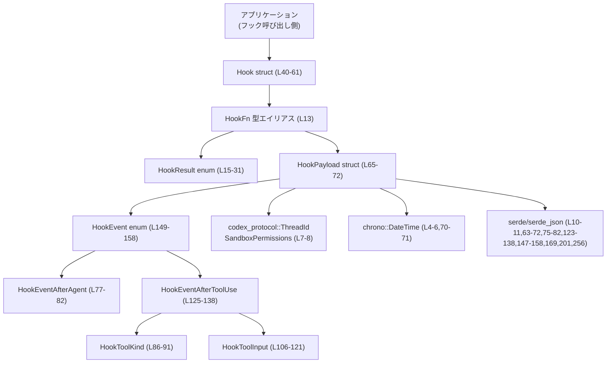
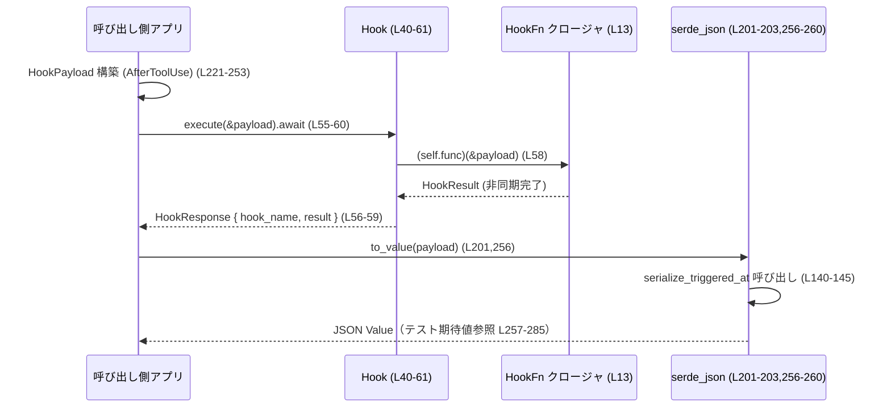

# hooks/src/types.rs コード解説

## 0. ざっくり一言

非同期フック（hook）の実行結果・関数シグネチャ・ペイロード（JSON シリアライズされるイベント情報）を定義するモジュールです。  
エージェント実行後やツール利用後のイベントを、安定した JSON 形式で外部のフック実装に渡すための共通型を提供します。

---

## 1. このモジュールの役割

### 1.1 概要

- このモジュールは **「エージェント／ツール実行のフック処理」** を表現するために存在し、以下を提供します。
  - 非同期フック関数の共通シグネチャ `HookFn`（hooks/src/types.rs:L13）
  - フックの実行結果 `HookResult` と、そのラップ `HookResponse` / `Hook`（L15-37, L40-61）
  - フックに渡されるコンテキスト `HookPayload` と、エージェント実行後／ツール利用後イベント型（L63-73, L75-82, L123-138, L147-158）
  - ツール呼び出しに関する付随情報（種別・入力・サンドボックス関連）（L84-121, L123-138）

これらにより、フックの呼び出し側と実装側の間で、**非同期・スレッド安全・シリアライズ可能な共通プロトコル**が定義されています。

### 1.2 アーキテクチャ内での位置づけ

このファイルは「型定義モジュール」であり、実際のフック処理本体は別モジュール／別クレートで実装される前提です。

主な依存関係は以下です。

- `codex_protocol::ThreadId` / `SandboxPermissions`: スレッド ID やサンドボックス権限（L7-8）
- `chrono::DateTime<Utc>`: トリガー時刻の UTC タイムスタンプ（L4-6, L70-71）
- `serde` / `serde_json`: JSON シリアライズ／テストでの JSON 生成（L10-11, L63-72, L75-82, L123-138, L147-158, L169, L201, L256）
- `futures::future::BoxFuture`: 非同期フックの戻り値（L9, L13）

Mermaid で全体の位置づけを示します（ノード名に定義行範囲を付記しています）。



### 1.3 設計上のポイント

- **非同期・スレッド安全なフック関数**
  - `HookFn` は `Arc<dyn Fn(&HookPayload) -> BoxFuture<HookResult> + Send + Sync>` で定義されています（L13）。
  - これにより、**スレッド間で共有可能な非同期フック実装**を表現します（`Send + Sync` 要求）。

- **制御フロー指示を含む結果型**
  - `HookResult` は `Success` / `FailedContinue` / `FailedAbort` を持ちます（L15-24）。
  - `should_abort_operation` で「操作を中断すべきか」を判定するユーティリティを提供します（L27-30）。

- **シリアライズ形式の安定性重視**
  - すべてのペイロード／イベント型に `#[derive(Serialize)]` と serde 属性が付与され、snake_case, tag/flatten などを利用して JSON 形状を固定化しています（L63-72, L75-82, L84-91, L93-102, L104-121, L123-138, L147-158）。
  - テストで JSON 形状が固定であることを検証しています（L179-216, L218-289）。

- **時間表現の統一**
  - `triggered_at` は `DateTime<Utc>` を RFC3339 形式（秒精度・Z 付き）でシリアライズする専用関数を使用します（L70-71, L140-145）。

- **状態を持たない「型定義モジュール」**
  - このモジュール自体はグローバル状態を持たず、全ての安全／並行性保証は型レベル（`Send + Sync`, `Arc`, `BoxFuture` など）で表現されています。

---

## 2. 主要な機能一覧

- **HookFn: 非同期フック関数シグネチャ**  
  `HookPayload` を受け取り `HookResult` を返す `BoxFuture` をラップした、`Arc` ベースの関数ポインタ型です（L13）。

- **HookResult: フック結果と中断判定**  
  成功／失敗（継続）／失敗（中断）を区別し、操作を継続すべきか判定できます（L15-31）。

- **Hook / HookResponse: フックのメタ情報と実行ラッパ**  
  フック名と関数本体をまとめる `Hook` と、実行結果を含む `HookResponse` を提供します（L34-37, L40-61）。

- **HookPayload: 共通コンテキスト**  
  セッション ID, カレントディレクトリ, クライアント識別子, トリガー時刻, イベント本体をまとめて渡す構造体です（L63-73）。

- **HookEvent / HookEventAfterAgent / HookEventAfterToolUse: イベント種別と詳細**  
  エージェント実行後・ツール利用後のそれぞれのイベント内容を表す型と、それらを包むタグ付き enum を提供します（L75-82, L123-138, L147-158）。

- **HookToolKind / HookToolInput / HookToolInputLocalShell: ツール呼び出し情報**  
  実行ツールの種別・入力内容（特にローカルシェルツール）を詳細に表現します（L84-91, L93-102, L104-121）。

- **triggered_at のカスタムシリアライズ**  
  UTC 時刻を RFC3339（秒単位・Z 表記）に変換するシリアライザ関数を提供します（L140-145）。

---

## 3. 公開 API と詳細解説

### 3.1 型一覧（構造体・列挙体など）

| 名前 | 種別 | 役割 / 用途 | 定義位置 |
|------|------|-------------|----------|
| `HookFn` | 型エイリアス | 非同期フック関数の共通シグネチャ。`HookPayload` → `HookResult` の `BoxFuture` を `Arc` で共有 | hooks/src/types.rs:L13 |
| `HookResult` | 列挙体 | フック実行の結果と、処理を継続するか中断するかの指示を表現 | L15-24 |
| `HookResponse` | 構造体 | 実行されたフック名と、その結果 `HookResult` をまとめた戻り値 | L34-37 |
| `Hook` | 構造体 | フック名とフック関数本体 `HookFn` をまとめたラッパ。`execute` メソッドで実行 | L40-43 |
| `HookPayload` | 構造体 | フックに渡される共通コンテキスト（セッション ID, 作業ディレクトリ, クライアント, トリガー時刻, イベント） | L65-72 |
| `HookEventAfterAgent` | 構造体 | エージェント実行後イベントの詳細（スレッド ID, ターン ID, 入力メッセージ群, 最後のアシスタント発言） | L77-82 |
| `HookToolKind` | 列挙体 | 利用したツールの種別（通常関数, カスタム, ローカルシェル, MCP） | L86-91 |
| `HookToolInputLocalShell` | 構造体 | ローカルシェルツールに渡されたコマンド・作業ディレクトリ・タイムアウト・サンドボックス権限など | L95-102 |
| `HookToolInput` | 列挙体 | 各ツール種別ごとの入力情報をまとめる tagged enum | L106-121 |
| `HookEventAfterToolUse` | 構造体 | ツール利用後イベントの詳細（ツール名, 種別, 入力, 実行成否など） | L125-138 |
| `HookEvent` | 列挙体 | HookPayload に格納されるイベントの種別（AfterAgent / AfterToolUse） | L149-158 |

### 3.2 関数詳細（重要関数）

#### `HookResult::should_abort_operation(&self) -> bool`

**概要**

フック結果が「操作中断（FailedAbort）」かどうかを判定するヘルパーメソッドです。呼び出し側はこの戻り値に基づき、後続フックの実行やメイン処理の継続可否を判断できます（L27-30）。

**引数**

| 引数名 | 型 | 説明 |
|--------|----|------|
| `self` | `&HookResult` | 判定対象のフック結果 |

**戻り値**

- `bool`  
  `true` の場合は操作を中断すべき（`FailedAbort`）。  
  `false` の場合は操作継続（`Success` または `FailedContinue`）。

**内部処理の流れ**

1. `matches!` マクロで `self` が `HookResult::FailedAbort(_)` かどうかをパターンマッチします（L29）。
2. `FailedAbort(_)` なら `true`、それ以外は `false` を返します。

**Examples（使用例）**

```rust
use crate::types::HookResult; // 実際のパスはプロジェクト構成に依存

fn should_stop(result: &HookResult) -> bool {
    // FailedAbort のときだけ true になる
    result.should_abort_operation()
}

fn example() {
    let err = "something went wrong";
    let r1 = HookResult::Success;
    let r2 = HookResult::FailedContinue(err.into());
    let r3 = HookResult::FailedAbort(err.into());

    assert!(!should_stop(&r1)); // 成功なので継続
    assert!(!should_stop(&r2)); // 失敗だが継続
    assert!(should_stop(&r3));  // 中断すべき
}
```

**Errors / Panics**

- この関数自身はパニックやエラーを発生させません。
- 返り値は純粋に enum のバリアントに依存します。

**Edge cases（エッジケース）**

- `HookResult` に新しいバリアントが将来追加された場合、`matches!` で `FailedAbort(_)` のみを判定する現在の実装では、それらはすべて「中断しない」と扱われます（L29）。

**使用上の注意点**

- フック呼び出し側が「処理を止めるかどうか」を判断するための統一インターフェースとして利用されることが想定されます。  
  `match` で直接バリアントを判定する代わりに、このメソッドを使うと意図が明確になります。

---

#### `impl Default for Hook::default() -> Hook`

**概要**

`Hook` のデフォルト値を返す実装です。  
名前 `"default"` と「常に `HookResult::Success` を返す」フック関数が設定されます（L45-51）。

**引数**

- なし（関連関数として `Hook::default()` が呼ばれるか、`Hook::default()` / `Hook::default()` を経由する）

**戻り値**

- `Hook`  
  - `name`: `"default"`  
  - `func`: 引数を無視して即座に `HookResult::Success` を返す非同期関数

**内部処理の流れ**

1. `Self { ... }` で構造体リテラルを構築（L47）。
2. `name` に `"default".to_string()` を設定（L48）。
3. `func` に `Arc::new(|_| Box::pin(async { HookResult::Success }))` を設定（L49）。
   - 任意の `&HookPayload` 引数を受け取るが未使用。
   - 即座に `HookResult::Success` を返す `async` ブロックを `Box::pin` し `BoxFuture` として返す。

**Examples（使用例）**

```rust
use crate::types::{Hook, HookPayload, HookResult};

async fn use_default_hook(payload: &HookPayload) {
    let hook = Hook::default();              // "default" という名前の成功専用フック
    let resp = hook.execute(payload).await;  // 常に Success になる

    match resp.result {
        HookResult::Success => println!("hook ok"),
        _ => unreachable!("default hook never fails"),
    }
}
```

**Errors / Panics**

- デフォルト実装の中ではエラーやパニックは発生しません。

**Edge cases（エッジケース）**

- `Hook::default()` は `HookPayload` の中身に依存せず、常に成功を返すため、  
  **監視用のダミーフック**や、フック機構を無効にしたい場面で使える一方、  
  フックの結果で処理を制御したい場面には適しません。

**使用上の注意点**

- 実運用では通常、`Hook { name, func }` を明示的に構築し、`func` に独自の非同期ロジックを設定することが前提です。  
  `default` は主にテストや「フック未設定時のプレースホルダ」としての利用が想定されます（コードからの推測）。

---

#### `Hook::execute(&self, payload: &HookPayload) -> HookResponse`（async）

**概要**

`Hook` に登録されたフック関数 `func` を非同期に実行し、その結果を `HookResponse` にまとめて返すメソッドです（L55-60）。

**引数**

| 引数名 | 型 | 説明 |
|--------|----|------|
| `self` | `&Hook` | 実行対象のフック（名前と関数本体を保持） |
| `payload` | `&HookPayload` | フックに渡すコンテキスト情報 |

**戻り値**

- `HookResponse`  
  - `hook_name`: `self.name.clone()`  
  - `result`: `self.func` を `payload` で実行した `HookResult`

**内部処理の流れ**

1. `(self.func)(payload)` で登録済みのフック関数を呼び出す（L58）。
2. 返ってきた `BoxFuture<'_, HookResult>` を `.await` し、`HookResult` を得る（L58）。
3. `HookResponse { hook_name: self.name.clone(), result }` を構築して返す（L56-59）。

**Examples（使用例）**

```rust
use std::sync::Arc;
use futures::future::BoxFuture;
use crate::types::{
    Hook, HookFn, HookPayload, HookResult,
    HookEvent, HookEventAfterAgent,
};
use codex_protocol::ThreadId;
use chrono::Utc;
use std::path::PathBuf;

// シンプルなログ用フック
fn make_logging_hook() -> Hook {
    let func: HookFn = Arc::new(|payload: &HookPayload| {
        Box::pin(async move {
            // ここで payload を参照してログなどを行う
            println!("hook for session {}", payload.session_id);
            HookResult::Success
        })
    });

    Hook {
        name: "logging".to_string(),
        func,
    }
}

#[tokio::main] // 実際のランタイムはプロジェクトに合わせる
async fn main() {
    let payload = HookPayload {
        session_id: ThreadId::new(),
        cwd: PathBuf::from("."),
        client: Some("cli".to_string()),
        triggered_at: Utc::now(),
        hook_event: HookEvent::AfterAgent {
            event: HookEventAfterAgent {
                thread_id: ThreadId::new(),
                turn_id: "t1".to_string(),
                input_messages: vec!["hi".to_string()],
                last_assistant_message: None,
            },
        },
    };

    let hook = make_logging_hook();
    let response = hook.execute(&payload).await;

    println!("hook {} finished: {:?}", response.hook_name, response.result);
}
```

**Errors / Panics**

- `execute` 自身は `Result` を返さず、`HookResult` にエラー情報を含める設計です。
  - フック実装側が失敗を表す場合は `HookResult::FailedContinue(err)` または `HookResult::FailedAbort(err)` を返すことになります（L21, L24）。
- フック関数実装がパニックを起こした場合、そのパニックは通常の Rust の挙動通り伝播します（この関数ではキャッチしません）。

**Edge cases（エッジケース）**

- `self.name` が空文字列・重複などであっても、そのまま `hook_name` として返されます（L57）。  
  一意制やフォーマットに関するバリデーションは行いません。
- `payload` がどのような値であっても（例: `client == None`）、`execute` は単に `func` を呼び出すだけであり、検証は行いません。

**使用上の注意点**

- `Hook::execute` は `async fn` であり、必ず `.await` する必要があります。  
  非同期ランタイム（tokio など）内で呼び出すことが前提です。
- `HookFn` が `Send + Sync` であるため、多数のスレッドから同じ `Hook` を共有して呼び出しても型レベルでは安全です（L13）。  
  ただし、内部でキャプチャしているデータ構造がスレッド安全かどうかは、フック実装側に依存します。

---

#### `serialize_triggered_at<S>(value: &DateTime<Utc>, serializer: S) -> Result<S::Ok, S::Error>`

**概要**

`HookPayload.triggered_at` フィールドを JSON にシリアライズする際のカスタム関数です（L70-71, L140-145）。  
UTC 時刻を RFC3339 形式（秒まで、タイムゾーンは `Z`）の文字列として出力します。

**引数**

| 引数名 | 型 | 説明 |
|--------|----|------|
| `value` | `&DateTime<Utc>` | シリアライズ対象の UTC 時刻 |
| `serializer` | `S` | serde から渡されるシリアライザ |

**戻り値**

- `Result<S::Ok, S::Error>`  
  シリアライズが成功した場合は `Ok`、何らかのシリアライザエラーが発生した場合は `Err`。

**内部処理の流れ**

1. `value.to_rfc3339_opts(SecondsFormat::Secs, true)` を呼び出し、RFC3339 形式の文字列に変換します（L144）。
   - `SecondsFormat::Secs`: 秒までの精度。
   - `true`: タイムゾーンを `Z` として出力（UTC）。
2. `serializer.serialize_str(&...)` で、その文字列を JSON 文字列としてシリアライズします（L144-145）。

**Examples（使用例）**

この関数は通常、直接呼び出さず `HookPayload` のシリアライズ経由で利用されます。テストを見ると（L179-216）、以下のような JSON が得られます。

```rust
use chrono::{TimeZone, Utc};
use std::path::PathBuf;
use codex_protocol::ThreadId;
use serde_json::json;
use crate::types::{HookPayload, HookEvent, HookEventAfterAgent};

fn example() {
    let session_id = ThreadId::new();
    let thread_id = ThreadId::new();

    let payload = HookPayload {
        session_id,
        cwd: PathBuf::from("tmp"),
        client: None,
        triggered_at: Utc.with_ymd_and_hms(2025, 1, 1, 0, 0, 0)
            .single()
            .expect("valid"),
        hook_event: HookEvent::AfterAgent {
            event: HookEventAfterAgent {
                thread_id,
                turn_id: "turn-1".into(),
                input_messages: vec!["hello".into()],
                last_assistant_message: Some("hi".into()),
            },
        },
    };

    let actual = serde_json::to_value(payload).unwrap();
    assert_eq!(actual["triggered_at"], json!("2025-01-01T00:00:00Z"));
}
```

**Errors / Panics**

- `to_rfc3339_opts` 自身は通常パニックしません。
- `serializer.serialize_str` が失敗した場合、`S::Error` を返します。  
  これは serde の通常のエラー伝播パターンです。

**Edge cases（エッジケース）**

- `DateTime<Utc>` が極端な日時でも、`chrono` がサポートする範囲内なら同様に RFC3339 文字列に変換されます。
- ミリ秒以下の情報は破棄され、秒単位に丸められます（`SecondsFormat::Secs` 指定のため）。

**使用上の注意点**

- `HookPayload` 内の `triggered_at` フィールドに `#[serde(serialize_with = "serialize_triggered_at")]` が付与されているため（L70）、この関数はシリアライズ時のみに呼び出されます。
- JSON 形状を変えたくない場合、この関数のフォーマット仕様（RFC3339 + 秒精度 + Z）を変更しないことが重要です。  
  テストでも形状が固定されていることが検証されています（L205, L260）。

---

### 3.3 その他の関数（テスト）

| 関数名 | 役割（1 行） | 定義位置 |
|--------|--------------|----------|
| `hook_payload_serializes_stable_wire_shape` | `HookPayload`（AfterAgent イベント）の JSON 形状が想定通りであることを検証 | L179-216 |
| `after_tool_use_payload_serializes_stable_wire_shape` | `HookPayload`（AfterToolUse イベント）の JSON 形状が想定通りであることを検証 | L218-289 |

いずれも `#[test]` が付与されたテスト関数であり（L179, L218）、ランタイムには含まれません。

---

## 4. データフロー

ここでは、ツール利用後フック（AfterToolUse）が実行され、ペイロードが JSON にシリアライズされる標準的な流れを示します。

1. 呼び出し側が `HookPayload` を構築し、`hook_event` に `HookEvent::AfterToolUse { event: HookEventAfterToolUse { ... } }` を設定する（L221-253）。
2. 構築した `HookPayload` を、登録済みの `Hook` に渡して `execute(&payload).await` を呼び出す（L55-60）。
3. `Hook` は登録済みの `HookFn` を呼び出し、`HookResult` を受け取る（L58）。
4. `HookResponse` にフック名と結果が格納され、呼び出し元に返される（L56-59）。
5. 同じ `HookPayload` が `serde_json::to_value(payload)` などで JSON にシリアライズされる。  
   このとき、`triggered_at` 用のカスタムシリアライザや、`HookEvent`/`HookToolInput` の tag/flatten 設定が効く（L70, L140-145, L147-158, L104-121）。

Mermaid のシーケンス図（行範囲付き）で表すと次のようになります。



この図から分かる通り、本モジュールは **「フック実行」と「ペイロードの JSON 化」の境界型** を提供し、実際のフック実装や送信先はこのチャンクには現れません。

---

## 5. 使い方（How to Use）

### 5.1 基本的な使用方法

典型的なフローは次の通りです。

1. 任意の非同期ロジックを持つ `HookFn` を定義する。
2. それを `Hook { name, func }` に詰める。
3. イベント発生時に `HookPayload` を構築する。
4. 非同期コンテキストで `hook.execute(&payload).await` を呼び出して結果を受け取る。

```rust
use std::sync::Arc;
use futures::future::BoxFuture;
use std::path::PathBuf;
use chrono::Utc;
use codex_protocol::ThreadId;

use crate::types::{
    Hook, HookFn, HookPayload, HookResult,
    HookEvent, HookEventAfterAgent,
};

fn make_example_hook() -> Hook {
    let func: HookFn = Arc::new(|payload: &HookPayload| {
        Box::pin(async move {
            // ここで payload を参照して任意の処理を行う
            println!("after agent: session={}", payload.session_id);
            // 例: 失敗してもメイン処理は継続したい場合
            HookResult::FailedContinue("logging failed".into())
        })
    });

    Hook {
        name: "after_agent_logger".to_string(),
        func,
    }
}

#[tokio::main]
async fn main() {
    let session_id = ThreadId::new();
    let thread_id = ThreadId::new();

    let payload = HookPayload {
        session_id,
        cwd: PathBuf::from("/tmp"),
        client: None,
        triggered_at: Utc::now(),
        hook_event: HookEvent::AfterAgent {
            event: HookEventAfterAgent {
                thread_id,
                turn_id: "turn-1".into(),
                input_messages: vec!["hi".into()],
                last_assistant_message: None,
            },
        },
    };

    let hook = make_example_hook();
    let resp = hook.execute(&payload).await;

    if resp.result.should_abort_operation() {
        eprintln!("hook requested abort");
    } else {
        println!("continue main operation");
    }
}
```

### 5.2 よくある使用パターン

1. **AfterAgent フックでのロギング／監査**

   - `HookEvent::AfterAgent` を利用し、ユーザー入力やアシスタント応答を監査ログや外部システムに送信する。
   - 失敗しても本体処理は継続したい場合、`HookResult::FailedContinue` を使用します（L21）。

2. **AfterToolUse フックでのメトリクス収集**

   - `HookEvent::AfterToolUse` と `HookEventAfterToolUse` を使い、ツール実行時間 (`duration_ms`) や成功／失敗 (`success`) をメトリクスに反映する（L125-138）。
   - ローカルシェルツールの入力詳細は `HookToolInput::LocalShell { params: HookToolInputLocalShell { ... } }` から取得できます（L104-121, L95-102）。

3. **JSON での外部連携**

   - `serde_json::to_string(&payload)` で JSON を生成し、外部 Webhook などに送信する。  
     このとき `client: None` は JSON から省略され、`Option` フィールドの挙動に注意が必要です（L68-69, L201-213, L256-285）。

### 5.3 よくある間違い

```rust
use crate::types::{Hook, HookFn, HookPayload, HookResult};
use std::rc::Rc;
use std::cell::RefCell;

// 間違い例: Rc<RefCell<..>> をキャプチャしており、HookFn が Send + Sync を満たさない
fn bad_hook() -> Hook {
    let state = Rc::new(RefCell::new(0));

    let func: HookFn = Arc::new(move |_payload: &HookPayload| {
        Box::pin(async move {
            *state.borrow_mut() += 1;
            HookResult::Success
        })
    });
    // ↑ 実際にはコンパイル時に Send + Sync 制約違反でエラーになる

    Hook { name: "bad".into(), func }
}

// 正しい例: Arc<Mutex<..>> など Send + Sync な構造を使う
use std::sync::{Arc, Mutex};

fn good_hook() -> Hook {
    let state = Arc::new(Mutex::new(0u32));

    let func: HookFn = Arc::new(move |_payload: &HookPayload| {
        let state = state.clone();
        Box::pin(async move {
            let mut guard = state.lock().unwrap();
            *guard += 1;
            HookResult::Success
        })
    });

    Hook { name: "good".into(), func }
}
```

**典型的な誤り**

- `HookFn` の `Send + Sync` 制約を満たさないデータ構造（`Rc`, `RefCell` など）をキャプチャしようとしてコンパイルエラーになる。
- `Hook::execute` が `async fn` であることを忘れ `.await` しない（コンパイルエラー）。
- `HookResult::FailedContinue` と `FailedAbort` の意味を取り違え、想定外に処理が継続／中断してしまう可能性。

### 5.4 使用上の注意点（まとめ）

- **並行性**
  - `HookFn` 自体は `Send + Sync` ですが、その内部で利用するデータ構造もスレッド安全である必要があります（L13）。
- **エラー表現**
  - フック内の論理的な失敗は `HookResult` に格納し、panic ではなく `FailedContinue` / `FailedAbort` を使う設計です（L21, L24）。  
    呼び出し側は `should_abort_operation` や `match` で扱いを決める必要があります。
- **シリアライズ仕様**
  - `HookPayload.client` は `None` の場合 JSON に含まれません（L68-69, L203-213, L258-285）。  
    一方、`HookToolInputLocalShell` 内の `Option` フィールドは `null` として出力されます（L95-102, L270-276）。
- **セキュリティ上の観点（このモジュールが表現するデータに基づく注記）**
  - `HookToolInputLocalShell.command` には任意のコマンドが入ることがフィールド名から想定されるため（L95-101）、フック実装でログ出力などを行う際はコマンド内容や作業ディレクトリを外部に漏らさないよう配慮が必要と考えられます（コード名からの推測であり、このチャンクではポリシーは定義されていません）。

---

## 6. 変更の仕方（How to Modify）

### 6.1 新しい機能を追加する場合

**1. 新しいイベント種別を追加したい場合**

既存の `HookEvent` は `AfterAgent` / `AfterToolUse` を持ち、それぞれ専用の構造体を `#[serde(flatten)]` で埋め込んでいます（L147-158, L75-82, L123-138）。  
このパターンから、例えば `AfterSomethingElse` を追加する場合は、次のような手順が自然です（コードからのパターン抽出）。

1. 新しい詳細構造体 `HookEventAfterSomethingElse` を定義し、`#[derive(Debug, Clone, Serialize)]` を付ける。
2. `HookEvent` enum に `AfterSomethingElse { #[serde(flatten)] event: HookEventAfterSomethingElse }` というバリアントを追加する（L149-158 に倣う）。
3. テストで JSON 形状が期待通りであることを検証するテスト関数を追加する（L179-216, L218-289 の形式に倣う）。

**2. 新しいツール種別を追加したい場合**

`HookToolKind` / `HookToolInput` はツール種別と入力内容を 1:1 で対応させています（L86-91, L104-121）。

1. `HookToolKind` に新しいバリアント（例: `RemoteApi`）を追加する（L86-91）。
2. 必要であれば新しい入力構造体（例: `HookToolInputRemoteApi`）を定義し、`HookToolInput` に対応するバリアントを追加する（L104-121 に倣う）。
3. `HookEventAfterToolUse` の利用箇所で、新しい種別に対応した処理／テストを追加する（L125-138, L218-289）。

### 6.2 既存の機能を変更する場合

- **HookResult の意味を変えるとき**
  - `FailedContinue` / `FailedAbort` の意味は呼び出し側の制御フローに直結します（L21, L24, L27-30）。  
    変更する場合は、全ての呼び出し側で `match` や `should_abort_operation` の利用箇所を検索し、挙動が意図通りか確認する必要があります（このチャンクでは呼び出し側は定義されていません）。

- **シリアライズ形式を変更するとき**
  - serde 属性（`rename_all`, `tag`, `flatten`, `skip_serializing_if`, `serialize_with` など）を変更すると、線路上の JSON 形状が変わります（L63-72, L75-82, L84-91, L93-102, L104-121, L123-138, L147-158, L140-145）。
  - 変更後は `hook_payload_serializes_stable_wire_shape` / `after_tool_use_payload_serializes_stable_wire_shape` を更新し、テストが新しい仕様を反映しているか確認する必要があります（L179-216, L218-289）。

- **HookFn シグネチャを変更する場合**
  - `HookFn` はこのモジュール全体で中心的な型です（L13）。変更すると `Hook` やフック実装すべてに影響します。
  - 例えば `HookResult` とは別に `Result` を返すようにするなどの変更は、`Hook::execute` の実装や呼び出し側との契約を大きく変えることになるため、このチャンクだけでは影響範囲を判断できません。「このチャンクには呼び出し側が現れない」点に注意が必要です。

---

## 7. 関連ファイル

このチャンクから直接参照されている型・モジュールは以下の通りです。  
同一リポジトリ内の他ファイルとの関係は、このチャンクには現れません。

| パス / モジュール | 役割 / 関係 |
|-------------------|------------|
| `codex_protocol::ThreadId` | スレッド／セッション識別子。`HookPayload.session_id` や `HookEventAfterAgent.thread_id` に使用（L7, L66, L78, L181-183, L221-223）。 |
| `codex_protocol::models::SandboxPermissions` | ローカルシェルツールに対するサンドボックス権限を表す enum。`HookToolInputLocalShell.sandbox_permissions` に使用（L8, L99, L240, L273）。 |
| `chrono::DateTime`, `chrono::Utc`, `chrono::SecondsFormat` | トリガー時刻（UTC）の管理とシリアライズフォーマット指定に使用（L4-6, L70-71, L140-145, L164-166, L187-190, L225-228）。 |
| `serde::Serialize`, `serde::Serializer` | JSON 等へのシリアライズのためのトレイト・API。ほぼ全てのペイロード／イベント型に適用されている（L10-11, L63-72, L75-82, L84-91, L93-102, L104-121, L123-138, L147-158, L140-145）。 |
| `serde_json` | テストで `HookPayload` などを JSON Value に変換し、期待形状と比較するために使用（L169, L201-203, L256-260）。 |
| `futures::future::BoxFuture` | 非同期フックの戻り値。`HookFn` の出力として利用（L9, L13）。 |
| `std::path::PathBuf` | 作業ディレクトリ (`cwd`) やテスト用パスに利用（L1, L67, L162, L185, L223）。 |
| `std::sync::Arc` | フック関数 `HookFn` をスレッド安全に共有するために使用（L2, L13, L45-49）。 |

このチャンクには、実際に `Hook` や `HookPayload` を利用しているアプリケーションコードは含まれていません。そのため、**どのモジュールからこの型群が使われているか** は「不明（このチャンクには現れない）」です。
