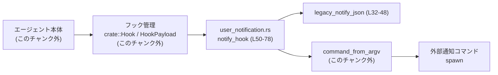
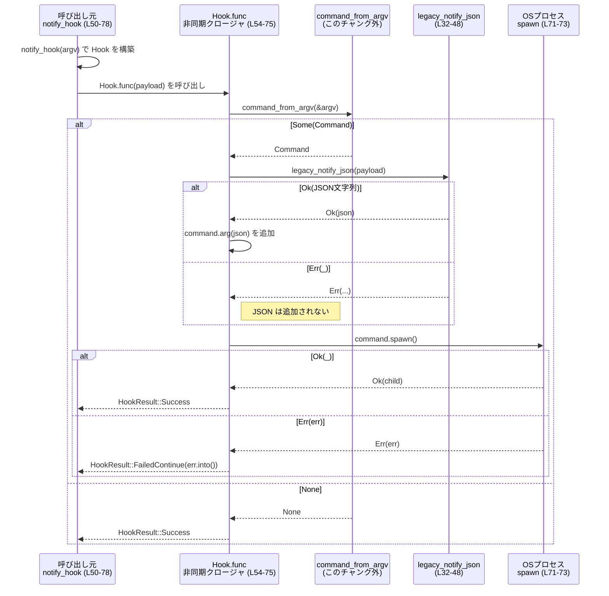

# hooks/src/user_notification.rs コード解説

## 0. ざっくり一言

`hooks/src/user_notification.rs` は、エージェント実行後の情報を「レガシー通知 JSON」に変換し、その JSON を引数として外部コマンドを非同期に実行するフック (`Hook`) を提供するモジュールです（hooks/src/user_notification.rs:L12-30, L32-48, L50-78）。

---

## 1. このモジュールの役割

### 1.1 概要

- このモジュールは **エージェントの 1 ターン完了時の情報を JSON にまとめ、既存の外部通知コマンドに渡す** ために存在します。
- `legacy_notify_json` で JSON 文字列を生成し（hooks/src/user_notification.rs:L32-47）、`notify_hook` でそれを外部コマンドに渡す `Hook` を構築します（hooks/src/user_notification.rs:L50-77）。
- コメントにある通り、**過去の通知仕様との後方互換性を維持すること** が主目的です（hooks/src/user_notification.rs:L12, L65）。

### 1.2 アーキテクチャ内での位置づけ

このモジュールは、「フック基盤」と「外部通知コマンド」の間に位置し、HookPayload から JSON を生成して別プロセスを起動します。



- `Hook`, `HookPayload`, `HookEvent`, `HookResult`, `command_from_argv` は crate 側に定義されており、このモジュールはそれらを利用する立場です（hooks/src/user_notification.rs:L6-10）。
- 外部コマンドの実行には `std::process::Stdio` と `command.spawn()` を用いています（hooks/src/user_notification.rs:L57-59, L67-73）。

### 1.3 設計上のポイント

- **後方互換性を優先**  
  - 「Legacy notify payload」「Backwards-compat」とコメントされており（hooks/src/user_notification.rs:L12, L65）、既存の通知実装と同じ JSON 形状・挙動（argv + JSON, fire-and-forget）を維持する設計です（hooks/src/user_notification.rs:L65-73, L90-100）。
- **状態を持たない設計**  
  - モジュール内の状態は `Arc<Vec<String>>` で保持する argv のみで、共有されるのは「読み取り専用」の引数リストです（hooks/src/user_notification.rs:L50-56）。
  - グローバルな可変状態はありません。
- **エラーハンドリング方針**  
  - `legacy_notify_json` は `Result<String, serde_json::Error>` で JSON 生成結果を返却し（hooks/src/user_notification.rs:L32）、非対応イベント種別では明示的にエラーを返します（hooks/src/user_notification.rs:L44-46）。
  - `notify_hook` 側は JSON 生成エラーを**無視**し（if let Ok(...) パターン, hooks/src/user_notification.rs:L61-63）、外部コマンドの起動エラーのみを `HookResult::FailedContinue` として報告します（hooks/src/user_notification.rs:L71-74）。
- **並行性と非同期**  
  - `Hook.func` は `Box::pin(async move { ... })` で非同期クロージャを返し（hooks/src/user_notification.rs:L54-56）、非同期フレームワーク上で実行されることを前提にしています。
  - `Arc` による argv の共有のみで、内部に共有可変なデータはなく、並行呼び出し時もデータ競合の可能性はありません（hooks/src/user_notification.rs:L50-56）。

---

## 2. 主要な機能・コンポーネント一覧

### 2.1 コンポーネントインベントリー

このチャンクに現れる型・関数の一覧です。

#### 型

| 名前 | 種別 | 公開 | 役割 / 用途 | 定義位置 |
|------|------|------|-------------|----------|
| `UserNotification` | enum | 非公開 | レガシー通知 JSON のトップレベルオブジェクト。現状 `AgentTurnComplete` 変種のみを持ち、エージェントターン終了時のメタ情報を保持します。 | hooks/src/user_notification.rs:L15-30 |

`UserNotification::AgentTurnComplete` のフィールド:

- `thread_id: String` – スレッド ID（`ThreadId` の文字列表現）（hooks/src/user_notification.rs:L18, L36-37）。
- `turn_id: String` – ターン ID（hooks/src/user_notification.rs:L19, L37）。
- `cwd: String` – カレントディレクトリのパス文字列（hooks/src/user_notification.rs:L20, L38）。
- `client: Option<String>` – クライアント識別子。`None` の場合は JSON から省略されます（hooks/src/user_notification.rs:L21-22）。
- `input_messages: Vec<String>` – ターン開始時にユーザーから送られたメッセージ群（hooks/src/user_notification.rs:L24-25）。
- `last_assistant_message: Option<String>` – ターン内で最後に送られたアシスタントからのメッセージ（hooks/src/user_notification.rs:L27-28）。

#### 関数（本体）

| 名前 | 公開 | 役割 / 用途 | 定義位置 |
|------|------|------------|----------|
| `legacy_notify_json(payload: &HookPayload) -> Result<String, serde_json::Error>` | 公開 | `HookPayload` からレガシー通知 JSON 文字列を生成する。`HookEvent::AfterAgent` のみ対応。 | hooks/src/user_notification.rs:L32-48 |
| `notify_hook(argv: Vec<String>) -> Hook` | 公開 | 指定 argv で外部コマンドを起動し、必要に応じてレガシー JSON を最終引数に付加する `Hook` を構築する。 | hooks/src/user_notification.rs:L50-78 |

#### 関数（テスト用）

| 名前 | 種別 | 役割 / 用途 | 定義位置 |
|------|------|------------|----------|
| `expected_notification_json() -> serde_json::Value` | テスト補助 | 歴史的なワイヤフォーマットに対応する期待 JSON を構築する。 | hooks/src/user_notification.rs:L90-100 |
| `test_user_notification() -> anyhow::Result<()>` | テスト (`#[test]`) | `UserNotification::AgentTurnComplete` のシリアライズ結果が期待 JSON と一致するか検証する。 | hooks/src/user_notification.rs:L103-118 |
| `legacy_notify_json_matches_historical_wire_shape() -> anyhow::Result<()>` | テスト (`#[test]`) | 実際の `HookPayload` から生成された JSON が歴史的なワイヤフォーマットと一致するか検証する。 | hooks/src/user_notification.rs:L121-147 |

### 2.2 主要な機能一覧（概要）

- `legacy_notify_json`: AfterAgent フック用の `HookPayload` から、レガシー仕様の JSON 文字列を生成します。
- `notify_hook`: argv からコマンドを構築し、上記 JSON を引数に追加して fire-and-forget で外部プロセスを起動する `Hook` を返します。

---

## 3. 公開 API と詳細解説

### 3.1 型一覧（外部依存を含む）

このモジュール自身が公開する型はありませんが、公開関数のインターフェース上重要な型を挙げます。

| 名前 | 種別 | 所属 | 役割 / 用途 | 備考 |
|------|------|------|-------------|------|
| `Hook` | 構造体（推定） | `crate` | フック名と、`HookPayload` を受け取って非同期に `HookResult` を返す処理をカプセル化する型。ここでは `Hook { name, func }` の形で初期化されています。 | 定義本体はこのチャンクには現れません（hooks/src/user_notification.rs:L6, L52-53）。 |
| `HookPayload` | 構造体（推定） | `crate` | フックに渡されるコンテキスト情報。`cwd`, `client`, `hook_event` などを持つことがコードから分かります。 | 定義本体はこのチャンクには現れませんが、テストでフィールド構造が一部見えます（hooks/src/user_notification.rs:L8, L122-140）。 |
| `HookEvent` | enum（推定） | `crate` | フックがどのタイミングで呼ばれたかを示すイベント種別。ここでは `AfterAgent` 変種のみマッチしています。 | 他の変種はこのチャンクには現れません（hooks/src/user_notification.rs:L7, L33-35, L127-139）。 |
| `HookResult` | enum（推定） | `crate` | フック実行の結果を表す型。ここでは `Success` と `FailedContinue` が使用されています。 | 具体的な意味は定義側ですが、名前から「成功」「失敗だが続行」が想定されます（hooks/src/user_notification.rs:L9, L59-60, L71-74）。 |

### 3.2 関数詳細

#### `legacy_notify_json(payload: &HookPayload) -> Result<String, serde_json::Error>`

**概要**

- `HookPayload` からレガシーなユーザー通知 JSON を生成し、文字列として返します（hooks/src/user_notification.rs:L32-42）。
- `HookEvent::AfterAgent` の場合のみサポートしており、それ以外のイベントでは `Err` を返します（hooks/src/user_notification.rs:L33-47）。

**引数**

| 引数名 | 型 | 説明 |
|--------|----|------|
| `payload` | `&HookPayload` | フックに渡されたコンテキスト。`cwd`, `client`, `hook_event`（特に `AfterAgent`）などを利用します（hooks/src/user_notification.rs:L33-41）。 |

**戻り値**

- `Result<String, serde_json::Error>`  
  - `Ok(String)`: レガシー通知 JSON の文字列表現。`UserNotification::AgentTurnComplete` をシリアライズしたものです（hooks/src/user_notification.rs:L35-42）。
  - `Err(serde_json::Error)`: 対応していないイベント種別、もしくはシリアライズエラー時に返されます。

**内部処理の流れ**

1. `payload.hook_event` を参照し `match` します（hooks/src/user_notification.rs:L33）。
2. `HookEvent::AfterAgent { event }` の場合:
   - `UserNotification::AgentTurnComplete` を構築し、`event` および `payload` の各フィールドから値をコピーします（hooks/src/user_notification.rs:L35-41）。
   - `serde_json::to_string(&UserNotification::AgentTurnComplete { ... })` で JSON 文字列にシリアライズし、その `Result` をそのまま返します（hooks/src/user_notification.rs:L35-42）。
3. それ以外の `HookEvent` の場合:
   - `"legacy notify payload is only supported for after_agent"` というメッセージを持つ `std::io::Error` を生成し（hooks/src/user_notification.rs:L44-46）、
   - それを `serde_json::Error::io` に渡して JSON エラー型に変換し、`Err` として返します（hooks/src/user_notification.rs:L44-46）。

**Examples（使用例）**

テストのロジックを簡略化した使用例です。

```rust
use codex_protocol::ThreadId;
use hooks::user_notification::legacy_notify_json; // モジュールパスは仮の例です

fn build_payload() -> HookPayload {
    // HookPayload 構築方法はこのチャンクには定義がないため疑似コードです
    HookPayload {
        session_id: ThreadId::new(),
        cwd: std::path::Path::new("/Users/example/project").to_path_buf(),
        client: Some("codex-tui".to_string()),
        triggered_at: chrono::Utc::now(),
        hook_event: HookEvent::AfterAgent {
            event: HookEventAfterAgent {
                thread_id: ThreadId::from_string(
                    "b5f6c1c2-1111-2222-3333-444455556666"
                ).expect("valid thread id"),
                turn_id: "12345".to_string(),
                input_messages: vec![
                    "Rename `foo` to `bar` and update the callsites.".to_string()
                ],
                last_assistant_message: Some(
                    "Rename complete and verified `cargo build` succeeds.".to_string()
                ),
            },
        },
    }
}

fn example() -> anyhow::Result<()> {
    let payload = build_payload();
    let json = legacy_notify_json(&payload)?;           // AfterAgent なので Ok(JSON) になる想定
    println!("{json}");
    Ok(())
}
```

**Errors / Panics**

- `Err` になる条件:
  - `payload.hook_event` が `HookEvent::AfterAgent` 以外の場合  
    → `serde_json::Error::io` でラップした I/O エラーを返します（hooks/src/user_notification.rs:L44-46）。
  - `HookEvent::AfterAgent` でも、シリアライズ時に `serde_json::to_string` が失敗した場合（例: フィールドにシリアライズ不能な値が含まれている）  
    → `serde_json::to_string` 起源のエラーが返されます（hooks/src/user_notification.rs:L35-42）。
- panic:
  - この関数自身には `unwrap` / `expect` はなく、直接的な panic 要因はコードからは見当たりません。

**Edge cases（エッジケース）**

- `payload.hook_event` が `AfterAgent` 以外:
  - 常に `Err(serde_json::Error)` を返し、メッセージは `"legacy notify payload is only supported for after_agent"` になります（hooks/src/user_notification.rs:L44-46）。
- `payload.client` が `None`:
  - `client` フィールドは `skip_serializing_if = "Option::is_none"` なので JSON から省略されます（hooks/src/user_notification.rs:L21-22）。
- `input_messages` が空のベクタ:
  - そのまま空配列としてシリアライズされます。特別扱いはありません（hooks/src/user_notification.rs:L24-25）。
- `last_assistant_message` が `None`:
  - `Option` フィールドですが `skip_serializing_if` 属性は付いておらず、`null` としてシリアライズされる挙動が想定されます（serde の一般仕様による推測）。ただし、この挙動はテストではカバーされていません。

**使用上の注意点**

- この関数は **AfterAgent 専用** です。他のイベントに対して JSON を生成したい場合は、`UserNotification` enum や `match` 式の分岐を拡張する必要があります（hooks/src/user_notification.rs:L33-47）。
- エラー型が `serde_json::Error` であるため、「非対応イベント」と「シリアライズエラー」が同じ型で表現されます。呼び出し側で両者を区別したい場合は、エラーメッセージ文字列などを見て判別するしかありません。

---

#### `notify_hook(argv: Vec<String>) -> Hook`

**概要**

- レガシー通知コマンドを実行する `Hook` を構築します（hooks/src/user_notification.rs:L50-77）。
- `argv` から `command_from_argv` でコマンドオブジェクトを作り、`legacy_notify_json` が成功した場合のみ JSON 引数を追加します（hooks/src/user_notification.rs:L57-63）。
- 標準入出力/標準エラーはすべて `Stdio::null()` に設定し、外部プロセスは fire-and-forget で起動されます（hooks/src/user_notification.rs:L65-73）。

**引数**

| 引数名 | 型 | 説明 |
|--------|----|------|
| `argv` | `Vec<String>` | 外部通知コマンドに渡すべき引数列。先頭要素はコマンド名であることが想定されますが、このチャンクからは断定できません（hooks/src/user_notification.rs:L50-51, L57-59）。 |

**戻り値**

- `Hook`  
  - `name: "legacy_notify"` と `func: Arc<dyn Fn(&HookPayload) -> ...>` を保持するフックオブジェクト（hooks/src/user_notification.rs:L52-55）。
  - `func` は非同期クロージャで、`HookPayload` を受け取り `HookResult` を返す Future を返す設計になっています（hooks/src/user_notification.rs:L54-56, L71-74）。

**内部処理の流れ（Hook.func 内）**

1. `argv` を `Arc<Vec<String>>` に包んでクロージャに移動可能にする（hooks/src/user_notification.rs:L50-51, L54-56）。
2. `Hook` 構造体を作成し、`name` と `func` を設定する（hooks/src/user_notification.rs:L52-55）。
3. `func` 内部（非同期クロージャ）では:
   1. `Arc::clone(&argv)` で共有所有権を取得する（hooks/src/user_notification.rs:L55）。
   2. `command_from_argv(&argv)` を呼び出し、コマンドオブジェクトの生成を試みる（hooks/src/user_notification.rs:L57-59）。
      - `Some(command)` の場合: そのコマンドを使用。
      - `None` の場合: 何もせず `HookResult::Success` を返す（hooks/src/user_notification.rs:L57-60）。
   3. `legacy_notify_json(payload)` を呼び、JSON 生成を試みる（hooks/src/user_notification.rs:L61）。
      - `Ok(notify_payload)` の場合: `command.arg(notify_payload)` で JSON を最終引数として追加する（hooks/src/user_notification.rs:L61-63）。
      - `Err(_)` の場合: JSON は追加しない（hooks/src/user_notification.rs:L61-63）。
   4. 標準入出力/標準エラーをすべて `Stdio::null()` に設定する（hooks/src/user_notification.rs:L65-69）。
   5. `command.spawn()` で外部プロセスを起動する（hooks/src/user_notification.rs:L71-73）。
      - `Ok(_)` の場合: `HookResult::Success` を返す。
      - `Err(err)` の場合: `HookResult::FailedContinue(err.into())` を返す（hooks/src/user_notification.rs:L71-74）。

**使用例**

フック管理側の API はこのチャンクにはないため、疑似的な例になります。

```rust
use hooks::user_notification::notify_hook; // モジュールパスは例
use hooks::HookPayload;                    // 実際のパスはこのチャンクには現れない

fn setup_hooks() {
    // レガシー通知コマンドの argv を定義
    let argv = vec![
        "/usr/local/bin/legacy-notify".to_string(),  // コマンドパス（例）
        "--some-flag".to_string(),                   // 固定引数
    ];

    // Hook を構築
    let hook = notify_hook(argv);

    // ここで hook をフック管理システムに登録する（API はこのチャンクには現れない）
    // hook_manager.register(hook);
}
```

**非同期・並行性に関する挙動**

- `func` は `Box::pin(async move { ... })` でラップされた非同期クロージャであり、**非同期ランタイム上で実行されることが前提**です（hooks/src/user_notification.rs:L54-56）。
- `argv` は `Arc<Vec<String>>` で共有されるだけで書き換えは行われず、**複数の並行フック呼び出しがあってもデータ競合は発生しません**（hooks/src/user_notification.rs:L50-56）。
- 外部プロセス起動 (`spawn`) は同期メソッドですが、起動後にプロセスの終了を待つことはなく、呼び出しはすぐに完了します（hooks/src/user_notification.rs:L71-74）。  
  → 多数のフック呼び出しが短時間に発生すると、同時に多くの外部プロセスが起動し得ます。

**バグ・セキュリティ観点**

- 外部コマンドとその引数はすべて `argv` 由来であり、**信頼できない入力から直接生成された `argv` を渡すと任意コマンド実行のリスク**があります。  
  これはフック機構全体の設計次第ですが、このモジュール側では特別なサニタイズは行っていません（hooks/src/user_notification.rs:L50-59）。
- 子プロセスの `stdin`/`stdout`/`stderr` をすべて `Stdio::null()` にしているため（hooks/src/user_notification.rs:L65-69）、外部コマンドのログやエラー出力は親プロセスから観測できません。  
  外部コマンド側のログ設定に依存することになります。
- `legacy_notify_json` のエラーは黙殺されるため（`if let Ok(...)` パターン, hooks/src/user_notification.rs:L61-63）、JSON 生成の不具合があっても HookResult には現れず、外部コマンドには気づかれないまま実行される可能性があります。

**Edge cases（エッジケース）**

- `command_from_argv(&argv)` が `None` を返す場合:
  - フックは何もせず `HookResult::Success` を返します（hooks/src/user_notification.rs:L57-60）。
  - このとき `legacy_notify_json` も呼ばれません。
- `legacy_notify_json(payload)` が `Err` の場合:
  - JSON 引数は追加されませんが、外部コマンド自体は起動されます（hooks/src/user_notification.rs:L61-63）。
- `command.spawn()` が失敗した場合:
  - 例: コマンドパスが存在しない、実行権限がない等。
  - `HookResult::FailedContinue(err.into())` が返されます（hooks/src/user_notification.rs:L71-74）。
- 標準入出力/エラーに依存した外部コマンド:
  - それらが `null` にされるため、標準入力からの読み込みを前提としたコマンドは正常に動作しない可能性があります（hooks/src/user_notification.rs:L65-69）。

**使用上の注意点**

- 非同期コンテキストで使用される前提なので、`Hook.func` の呼び出し側は適切な非同期ランタイム（Tokio など）の上で実行されている必要があります（hooks/src/user_notification.rs:L54-56）。
- 子プロセスの終了状態を監視したり、標準出力を収集したい場合にはこの実装では不十分です。その場合は `spawn` ではなく `output` 等の利用や、`Stdio::piped()` に変更する必要があります。

### 3.3 その他の関数

| 関数名 | 役割（1 行） | 備考 |
|--------|--------------|------|
| `expected_notification_json() -> Value` | レガシー通知 JSON の期待形状（歴史的ワイヤフォーマット）を生成するテスト補助関数です（hooks/src/user_notification.rs:L90-100）。 | 実運用コードからは呼び出されません。 |
| `test_user_notification() -> Result<()>` | `UserNotification::AgentTurnComplete` のシリアライズ結果が期待 JSON と一致するか検証します（hooks/src/user_notification.rs:L103-118）。 | `#[test]` 付きのユニットテストです。 |
| `legacy_notify_json_matches_historical_wire_shape() -> Result<()>` | 実際の `HookPayload` を元に `legacy_notify_json` の出力が期待 JSON と一致するか検証します（hooks/src/user_notification.rs:L121-147）。 | レガシーとの互換性を保証するためのテストです。 |

---

## 4. データフロー

典型的な処理シナリオは、「AfterAgent イベントが発生し、`legacy_notify` フックが外部通知コマンドを fire-and-forget で起動する」流れです。



要点:

- フック呼び出しごとに最大 1 個の外部プロセスが起動されます（hooks/src/user_notification.rs:L57-59, L71-73）。
- JSON 生成に失敗してもプロセス自体は起動されるため、「argv のみ」の挙動にフォールバックする形になります（hooks/src/user_notification.rs:L61-63）。
- プロセス終了は待たないため、呼び出し側のスループットへの影響は「起動コスト」に限定されます。

---

## 5. 使い方（How to Use）

### 5.1 基本的な使用方法

実際のフック登録 API はこのチャンクにはありませんが、`notify_hook` の利用パターンは次のようなイメージになります。

```rust
use hooks::user_notification::notify_hook; // モジュールパスは例です

fn main() {
    // レガシー通知コマンドの argv を定義
    let argv = vec![
        "/usr/local/bin/legacy-notify".to_string(),  // コマンド
        "--notify".to_string(),                      // 固定フラグ
    ];

    // Hook を構築
    let legacy_notify_hook = notify_hook(argv);

    // ここでフック管理システムに登録する
    // register_hook(legacy_notify_hook);
    // register_hook の API はこのチャンクには定義されていません。
}
```

- フック管理側は、AfterAgent イベント発生時に `legacy_notify_hook.func(&payload)` を呼び出すだけで、外部プロセスが起動される設計です（hooks/src/user_notification.rs:L54-75）。

### 5.2 よくある使用パターン

1. **固定コマンド + レガシー JSON**

   - テストと同じ wire フォーマットを前提にした既存ツールに通知するケース。
   - `argv` にはツールのパスと固定フラグだけを指定し、JSON は本モジュールに任せます。

2. **コマンドラッパーを利用する**

   - `argv` を例えば `["/usr/local/bin/wrapper", "legacy-notify"]` のようにし、ラッパープログラム側で JSON を解釈するケース。
   - 本モジュールから見れば `argv` の違いだけで、動作は変わりません。

### 5.3 よくある間違い

```rust
// 誤り例: legacy_notify_json を AfterAgent 以外で使ってしまう
fn wrong_usage(payload: &HookPayload) {
    // hook_event が AfterAgent でなければ Err になる
    let _ = legacy_notify_json(payload).unwrap(); // 実際にはここで panic し得る
}

// 正しい例: AfterAgent のみに限定する（疑似コード）
fn correct_usage(payload: &HookPayload) {
    if matches!(payload.hook_event, HookEvent::AfterAgent { .. }) {
        if let Ok(json) = legacy_notify_json(payload) {
            // json を利用
            println!("{json}");
        }
    }
}
```

- このモジュール自身では `legacy_notify_json` の `Err` を `unwrap` するようなコードはありませんが（hooks/src/user_notification.rs:L61-63）、外部から利用する場合には「AfterAgent 専用」であることに注意が必要です。

### 5.4 使用上の注意点（まとめ）

- `legacy_notify_json` は **AfterAgent 以外では必ずエラー** になるため、呼び出し側がイベント種別を適切に絞り込む必要があります（hooks/src/user_notification.rs:L33-47）。
- `notify_hook` が起動する外部コマンドは非同期で fire-and-forget されるため、**通知処理の成功/失敗を呼び出し側で同期的に確認することはできません**（hooks/src/user_notification.rs:L71-74）。
- 子プロセスの標準入出力/標準エラーはすべて破棄されるため、外部ツールのログやエラーは別途ファイルやシステムログに出力するよう設計する必要があります（hooks/src/user_notification.rs:L65-69）。
- 頻繁に呼び出される環境では、多数の外部プロセスが短時間に起動される可能性があり、システムリソースへの影響に注意が必要です。

---

## 6. 変更の仕方（How to Modify）

### 6.1 新しい機能を追加する場合

1. **他のイベント種別に対応する通知 JSON を追加したい場合**

   - `UserNotification` enum に新しい変種（例: `AgentError`, `ToolCallComplete` など）を追加する（hooks/src/user_notification.rs:L15-29）。
   - `legacy_notify_json` の `match &payload.hook_event` に分岐を追加し、新変種の JSON を構築する（hooks/src/user_notification.rs:L33-47）。
   - 必要に応じて新しいテストを追加し、`expected_notification_json` に対応する期待 JSON を定義する（hooks/src/user_notification.rs:L90-100, L103-147）。

2. **JSON スキーマを拡張したい場合**

   - `UserNotification::AgentTurnComplete` にフィールドを追加する（hooks/src/user_notification.rs:L18-28）。
   - 追加フィールドを `legacy_notify_json` で設定する（hooks/src/user_notification.rs:L35-41）。
   - レガシーツールとの互換性を考慮し、`skip_serializing_if` 属性の利用などで「フィールドがなくても動作する」ようにするか検討します。

3. **外部コマンドの起動方法を変更したい場合**

   - `notify_hook` 内の `stdin/stdout/stderr` 設定を変更（`Stdio::piped()` など）し、必要なら出力を読み取る処理を追加します（hooks/src/user_notification.rs:L65-69）。
   - `spawn` ではなく `output` や非同期版コマンド API を使用するよう書き換えることで、プロセス完了を待つ設計にも変更できます（hooks/src/user_notification.rs:L71-73）。

### 6.2 既存の機能を変更する場合の注意点

- **JSON 形式に関する契約**

  - `#[serde(tag = "type", rename_all = "kebab-case")]` によって、タイプタグは `"type"` フィールド、各フィールド名はケバブケースでシリアライズされます（hooks/src/user_notification.rs:L13-14, L16）。
  - テスト `expected_notification_json` はこの形式を前提にしており（hooks/src/user_notification.rs:L90-99）、外部ツールも同じ前提を持っている可能性が高いです。  
    → フィールド名やケースを変更すると、レガシーとの互換性が失われます。

- **エラー取り扱いの契約**

  - 現状、`legacy_notify_json` のエラーは `notify_hook` では無視されます（hooks/src/user_notification.rs:L61-63）。  
    もしエラー時にフック全体を失敗させたい場合は、`Err` を検知して `HookResult::FailedContinue` などを返すよう変更が必要です。
  - `HookResult::FailedContinue` の意味（処理継続か中断か）はフックフレームワーク側の契約に依存します。変更時にはその契約を確認する必要があります。

- **テストとの整合性**

  - `test_user_notification` と `legacy_notify_json_matches_historical_wire_shape` は JSON 形式とフィールド内容を厳密に検証しているため（hooks/src/user_notification.rs:L103-118, L121-147）、JSON 仕様を変更した場合はこれらのテストも更新する必要があります。
  - レガシー互換性を維持したい場合は、変更前後の JSON を比較する追加テストを検討できます。

---

## 7. 関連ファイル・外部依存

| パス / モジュール | 役割 / 関係 |
|-------------------|------------|
| `crate::Hook` | フックを表す型。`notify_hook` の戻り値として利用されますが、定義はこのチャンクには現れません（hooks/src/user_notification.rs:L6, L50-53）。 |
| `crate::HookPayload` | フックに渡されるコンテキストデータ。`legacy_notify_json` と `notify_hook` の入力として利用されます（hooks/src/user_notification.rs:L8, L32-41, L54-56, L122-140）。 |
| `crate::HookEvent` | フックイベント種別。ここでは `AfterAgent` 変種のみが使用されます（hooks/src/user_notification.rs:L7, L33-35, L127-139）。 |
| `crate::HookResult` | フックの実行結果。`notify_hook` 内で `Success` と `FailedContinue` が使用されています（hooks/src/user_notification.rs:L9, L59-60, L71-74）。 |
| `crate::command_from_argv` | `argv: &Vec<String>` からコマンドオブジェクトを生成する関数。`notify_hook` 内で外部コマンドの構築に使用されます（hooks/src/user_notification.rs:L10, L57-59）。 |
| `serde`, `serde_json` | `UserNotification` のシリアライズと JSON 文字列の生成に使用されます（hooks/src/user_notification.rs:L4, L13-14, L32-42, L90-100, L114-115, L142-143）。 |
| `std::process::Stdio` | 外部プロセスの標準入出力/標準エラー設定に使用されます（hooks/src/user_notification.rs:L1, L65-69）。 |
| `codex_protocol::ThreadId` | テスト用に `thread_id` を生成・フォーマットするために使用されています（hooks/src/user_notification.rs:L83, L121-131）。 |
| `chrono::Utc` | テスト用に `triggered_at` のタイムスタンプを生成するために使用されています（hooks/src/user_notification.rs:L126）。 |
| `anyhow`, `pretty_assertions` | テストでのエラーラップとアサーションを補助するために使用されています（hooks/src/user_notification.rs:L82, L84, L103-118, L121-147）。 |

このチャンクでは、フックフレームワーク自体の実装（`Hook` や `HookResult` の詳細など）は登場せず、**「AfterAgent イベントをレガシー通知コマンドに橋渡しする薄いアダプタ」** としての役割に特化していることが確認できます。
