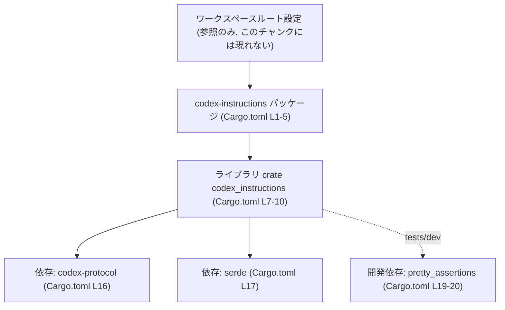
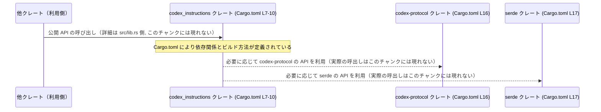

# instructions/Cargo.toml コード解説

## 0. ざっくり一言

`instructions/Cargo.toml` は、ライブラリクレート `codex-instructions`（ライブラリ名: `codex_instructions`）のメタデータと依存関係を定義する Cargo マニフェストファイルです（根拠: `Cargo.toml:L1-5, L7-10, L15-20`）。

---

## 1. このモジュールの役割

### 1.1 概要

- このファイルは、Rust プロジェクト内の **パッケージ設定** と **依存関係** を宣言するための Cargo マニフェストです（根拠: `Cargo.toml:L1, L15, L19`）。
- `codex-instructions` というパッケージ名と、そのライブラリターゲット `codex_instructions` を定義し、コンパイル対象ファイル `src/lib.rs` を指定しています（根拠: `Cargo.toml:L4, L9-10`）。
- エディションやライセンス、バージョン、lints、依存クレートなどは、同一ワークスペース内の共通設定を再利用する構成になっています（根拠: `Cargo.toml:L2-3, L5, L12-13, L16-17, L20`）。

### 1.2 アーキテクチャ内での位置づけ（コンポーネント一覧）

このファイルから分かるコンポーネントを一覧化します。

| コンポーネント名          | 種別               | 説明                                                                 | 定義/参照箇所 |
|---------------------------|--------------------|----------------------------------------------------------------------|---------------|
| `codex-instructions`      | パッケージ名       | このライブラリの Cargo パッケージ名                                  | `Cargo.toml:L4` |
| `codex_instructions`      | ライブラリターゲット| コンパイルされるライブラリクレート名。ソースは `src/lib.rs`          | `Cargo.toml:L7-10` |
| `src/lib.rs`              | ライブラリ本体     | ライブラリのルートファイルへのパス                                  | `Cargo.toml:L10` |
| `codex-protocol`          | 依存クレート       | ランタイム依存として宣言されたワークスペース内または外部クレート    | `Cargo.toml:L16` |
| `serde`                   | 依存クレート       | シリアライズ関連クレート。`derive` 機能を有効化して依存              | `Cargo.toml:L17` |
| `pretty_assertions`       | 開発依存クレート   | テストコード用のアサーション補助クレート（開発時のみ使用）          | `Cargo.toml:L19-20` |
| ワークスペースルート      | ワークスペース設定 | edition, license, version, lints, 依存の共通設定を保持（内容不明）   | `Cargo.toml:L2-3, L5, L12-13, L16-17, L20` |

> **補足**: ランタイムの公開 API（関数・構造体など）は `src/lib.rs` 以降の Rust コードに定義されます。このチャンクには現れません。

### 1.3 アーキテクチャ図（依存関係）

この図は、本チャンクに記述された依存関係に基づいたコンポーネント間の関係を示します。



- パッケージ `codex-instructions` がライブラリターゲット `codex_instructions` を提供し（根拠: `Cargo.toml:L4, L7-10`）、そのライブラリが `codex-protocol` と `serde` を依存として利用可能な構成です（根拠: `Cargo.toml:L16-17`）。
- `pretty_assertions` は `[dev-dependencies]` による開発専用の依存であり、本番コードではなくテストコードから利用される想定です（根拠: `Cargo.toml:L19-20`）。

### 1.4 設計上のポイント

- **ワークスペース共通設定の活用**  
  edition, license, version をワークスペースから継承しており、複数クレート間での一貫性を保つ設計になっています（根拠: `Cargo.toml:L2-3, L5`）。
- **ライブラリ専用クレート**  
  `[lib]` セクションのみが定義されており、バイナリターゲット（`[[bin]]`）は存在しません。このチャンクにはバイナリ定義は現れません（根拠: `Cargo.toml:L7-10` と、他に `[bin]` 等がないこと）。
- **doctest の無効化**  
  ドキュメントコメント中のサンプルコードをテストとして実行する doctest を無効にしています（根拠: `Cargo.toml:L8`）。これによりビルド時のテスト時間や、ドキュメントサンプルの保守コストに影響します。
- **lints のワークスペース一元化**  
  `[lints]` セクションで `workspace = true` を指定し、コンパイラ警告などの lint 設定をワークスペース共通にしています（根拠: `Cargo.toml:L12-13`）。
- **依存のワークスペース管理**  
  `codex-protocol`, `serde`, `pretty_assertions` いずれも `{ workspace = true }` 指定で、バージョンやソースはワークスペースルートの `[workspace.dependencies]` 等で管理されます（根拠: `Cargo.toml:L16-17, L20`）。

> **安全性・エラー・並行性について**  
> このファイルはビルド設定のみを記述しており、ランタイムの安全性・エラーハンドリング・並行性のロジックは含まれていません。これらは `src/lib.rs` などの実装側に依存します（このチャンクには現れません）。

---

## 2. 主要な機能一覧（マニフェストとしての役割）

「機能」は、この Cargo.toml がビルド・依存管理の観点で提供する役割として整理します。

- パッケージ定義: `codex-instructions` パッケージ名と、ワークスペース由来の edition / license / version を定義します（根拠: `Cargo.toml:L1-5`）。
- ライブラリターゲット定義: ライブラリ名 `codex_instructions` とソースパス `src/lib.rs` を指定し、doctest を無効化します（根拠: `Cargo.toml:L7-10`）。
- 共通 lints 適用: ワークスペース共通 lint 設定を適用します（根拠: `Cargo.toml:L12-13`）。
- ランタイム依存の宣言: `codex-protocol` と `serde` をランタイム依存として指定します（根拠: `Cargo.toml:L15-17`）。
- 開発時依存の宣言: テストなどで用いる `pretty_assertions` を開発依存として指定します（根拠: `Cargo.toml:L19-20`）。

---

## 3. 公開 API と詳細解説

このファイルには Rust の関数・構造体・列挙体などの定義は一切含まれていません。したがって、「公開 API」として直接説明できるものは **クレート単位** の情報に限られます。

### 3.1 型一覧（構造体・列挙体など）

このチャンク（Cargo.toml）には、型定義は含まれていません。

| 名前 | 種別 | 役割 / 用途 | 根拠 |
|------|------|-------------|------|
| （該当なし） | - | 型定義は Rust ソース（例: `src/lib.rs`）側に存在し、このチャンクには現れません | - |

### 3.2 関数詳細

このファイルには関数の定義がないため、関数詳細テンプレートに基づいて説明できる対象はありません。

- 公開関数・内部関数ともに、このチャンクには現れません。
- すべてのビジネスロジック・エラーハンドリング・並行処理は `src/lib.rs` 以降の Rust コードに実装されている前提です（根拠: ライブラリの `path` 指定 `Cargo.toml:L10`）。

### 3.3 その他の関数

- 補助関数やラッパー関数も、この Cargo.toml には記述されません。
- 関数／構造体の具体的なインベントリーは、このファイルからは取得できません（このチャンクには現れません）。

---

## 4. データフロー（クレートレベル）

### 4.1 クレート間の利用フロー

このセクションでは、**クレートレベル** の依存関係に基づいて、他クレートから見た利用フローを説明します。  
具体的な関数呼び出しやデータ構造は、Rust ソース側にあるため、このチャンクからは不明です。



- この図は、「どのクレートがどのクレートに依存し得るか」という **潜在的な呼び出し方向** を示すだけであり、実際にどの関数が呼ばれているかは、このチャンクには現れません。
- 依存方向自体は `[dependencies]` セクションで明示されています（根拠: `Cargo.toml:L15-17`）。

---

## 5. 使い方（How to Use）

このセクションでは、「`codex-instructions` クレートをどうやって他クレートから利用するか」「マニフェストをどう編集すると何が起こるか」を説明します。

### 5.1 基本的な使用方法（ライブラリの利用）

他のクレートからこのライブラリを利用する場合、通常はそのクレートの `Cargo.toml` に依存を追加します。

```toml
[dependencies]
codex-instructions = "x.y.z" # 実際のバージョンはワークスペースルートの設定を参照
```

- バージョン番号 `x.y.z` は、このファイルでは `version.workspace = true` としてワークスペースに委譲されているため、実際の値はワークスペースルート側で定義されます（根拠: `Cargo.toml:L5`）。
- 利用側 Rust コードでは、`lib` セクションで定義されたクレート名 `codex_instructions` を `use` パスの先頭として利用します（根拠: `Cargo.toml:L9`）。

```rust
// 他クレート側の例（概念的なイメージ。実際の API はこのチャンクには現れません）
// use codex_instructions::SomeType;
// use codex_instructions::some_function;
```

> 具体的にどの型・関数を `use` できるかは `src/lib.rs` 以降に依存するため、このチャンクからは分かりません。

### 5.2 よくある使用パターン（マニフェスト編集）

このファイルから読み取れる範囲での典型的な編集パターンを示します。

1. **新しい依存クレートの追加**

```toml
[dependencies]
codex-protocol = { workspace = true }
serde          = { workspace = true, features = ["derive"] }
# 例: ロギング用クレートを追加する場合
tracing        = { workspace = true }  # ワークスペース側で tracing を定義している場合
```

- 新たな依存を追加する際は、このように `[dependencies]` に行を追加します（根拠: `Cargo.toml:L15-17` を参考にした一般パターン）。

1. **doctest を有効化する**

```toml
[lib]
doctest = true                 # ここを true に変更
name = "codex_instructions"
path = "src/lib.rs"
```

- 現状は `doctest = false` で無効化されていますが（根拠: `Cargo.toml:L8`）、ドキュメントコメント中のサンプルコードもテストしたい場合は `true` に変更します。

### 5.3 よくある間違い（マニフェスト観点）

このチャンクから推測できる、間違えやすい点を示します。

```toml
# 間違い例: lib 名とパッケージ名の対応を意識せず変更する
[package]
name = "codex-instructions"

[lib]
name = "codex_instructions_v2"  # パッケージ名とずれている
path = "src/lib.rs"
```

- こうした場合、「クレート名」としては `codex_instructions_v2` で `use` する必要があり、パッケージ名（`Cargo.toml` 上の `name`）とは異なります。
- 現在のファイルでは、パッケージ名 `codex-instructions` と lib 名 `codex_instructions` はハイフンとアンダースコアの違いのみで対応しており、Rust の一般的な命名パターンに従っています（根拠: `Cargo.toml:L4, L9`）。

```toml
# 正しい例: 現状のファイルに沿った設定
[package]
name = "codex-instructions"

[lib]
name = "codex_instructions"
path = "src/lib.rs"
```

### 5.4 使用上の注意点（まとめ）

- **ワークスペース依存前提**  
  各種 `*.workspace = true` の指定により、このクレートはワークスペースルートの設定に依存しています（根拠: `Cargo.toml:L2-3, L5, L12-13, L16-17, L20`）。単体で切り出して利用する場合は、これらを具体的な値に書き換える必要があります。
- **doctest 無効化の影響**  
  ドキュメントサンプルのテストが実行されないため、サンプルコードの正当性は別途検証する必要があります（根拠: `Cargo.toml:L8`）。
- **テスト時のみの依存**  
  `pretty_assertions` は開発依存であり、本番コードからは利用できません（根拠: `Cargo.toml:L19-20`）。本番ロジックで利用したい場合は `[dependencies]` 側へ移動する必要があります。
- **ランタイム安全性・エラー処理・並行性**  
  これらはマニフェストではなく、Rust ソースコードの設計に依存します。このファイルからは詳細は分かりません（このチャンクには現れません）。

---

## 6. 変更の仕方（How to Modify）

### 6.1 新しい機能を追加する場合（依存追加など）

1. **どの機能がどのクレートに属するかを確認する**  
   - シリアライズ機能が必要であれば、既に `serde` が依存に含まれているため（根拠: `Cargo.toml:L17`）、`src/lib.rs` 側で serde を利用する実装を追加します。
   - 新規の外部機能が必要であれば、そのクレートを `[dependencies]` に追加します（パターンは `Cargo.toml:L15-17` を参照）。

2. **`Cargo.toml` に依存を追記する**

```toml
[dependencies]
codex-protocol = { workspace = true }
serde          = { workspace = true, features = ["derive"] }
# 新機能用クレート
new-crate      = { version = "0.1", features = ["foo"] } # 例: ワークスペース外の依存
```

1. **`src/lib.rs` で公開 API を追加する**  
   - 追加する関数・構造体は `pub` を付けて公開します。  
   - 具体的な内容はこのチャンクには現れませんが、公開 API を変更する際は利用側への影響に注意する必要があります。

### 6.2 既存の機能を変更する場合（マニフェストレベル）

- **エディションの変更**  
  - 現在は `edition.workspace = true` のため、エディションはワークスペース側で管理されています（根拠: `Cargo.toml:L2`）。
  - もしこのクレートだけ異なるエディションを使いたい場合は、`edition.workspace = true` を削除し、代わりに `edition = "2021"` などの具体値を設定します。
- **ライブラリのパス変更**

```toml
[lib]
doctest = false
name = "codex_instructions"
path = "src/lib.rs"  # ここを変更すると、Rust のエントリポイントファイルが変わる
```

- `path` を変更した場合、そのファイルが存在しないとビルドエラーになります。現状は `src/lib.rs` を想定しています（根拠: `Cargo.toml:L10`）。

- **依存の差し替え／削除**
  - 依存クレートの削除や差し替えを行う場合は、そのクレートを実際に利用しているコード（`src/lib.rs` など）も合わせて修正する必要があります。
  - 依存を削除してもコード側から参照が残っているとコンパイルエラーになります。

---

## 7. 関連ファイル

この Cargo.toml から関係が読み取れるファイル・クレートを整理します。

| パス / クレート名         | 役割 / 関係 |
|---------------------------|------------|
| `instructions/src/lib.rs` | ライブラリ本体。`[lib]` セクションの `path = "src/lib.rs"` により、このファイルがクレートルートとして利用されます（根拠: `Cargo.toml:L7-10`）。このチャンクには内容は現れません。 |
| ワークスペースルート `Cargo.toml` | `edition.workspace`, `license.workspace`, `version.workspace`, `[lints].workspace`, `[dependencies].workspace` 等の共通設定を保持するファイルです（根拠: `Cargo.toml:L2-3, L5, L12-13, L16-17, L20`）。本チャンクには内容は現れません。 |
| クレート `codex-protocol` | このライブラリのランタイム依存として宣言されているクレートです（根拠: `Cargo.toml:L16`）。機能詳細や API はこのチャンクには現れません。 |
| クレート `serde`          | ランタイム依存クレートで、`features = ["derive"]` により派生実装マクロの利用が可能です（根拠: `Cargo.toml:L17`）。このライブラリ内での具体的な使われ方はこのチャンクには現れません。 |
| クレート `pretty_assertions` | 開発時（テスト時）にのみ使用される依存クレートです（根拠: `Cargo.toml:L19-20`）。テストコードにおける利用箇所はこのチャンクには現れません。 |

---

### まとめ

- `instructions/Cargo.toml` は、**ライブラリクレート `codex-instructions` のビルド設定と依存関係を定義するマニフェスト** です。
- 公開 API やコアロジック（安全性・エラー処理・並行性を含む）は、`src/lib.rs` 以降の Rust ソースにあり、このチャンクには現れません。
- 本ファイルを理解すると、**クレートの位置づけ（ワークスペース内での役割）** と **依存関係の全体像** が把握しやすくなります。
