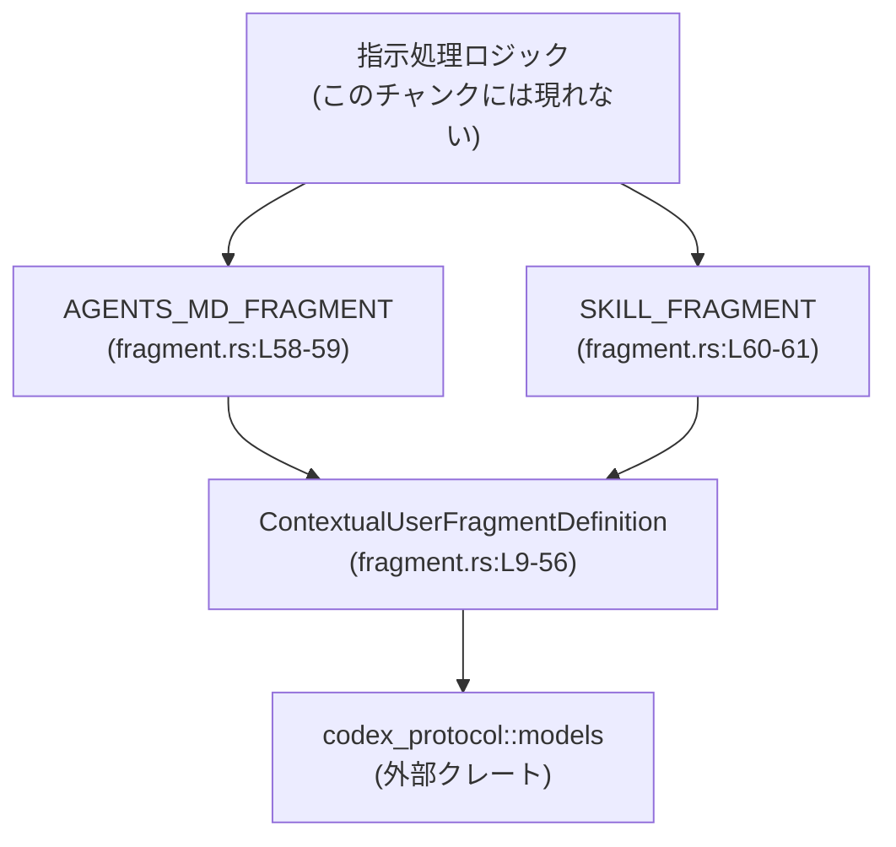
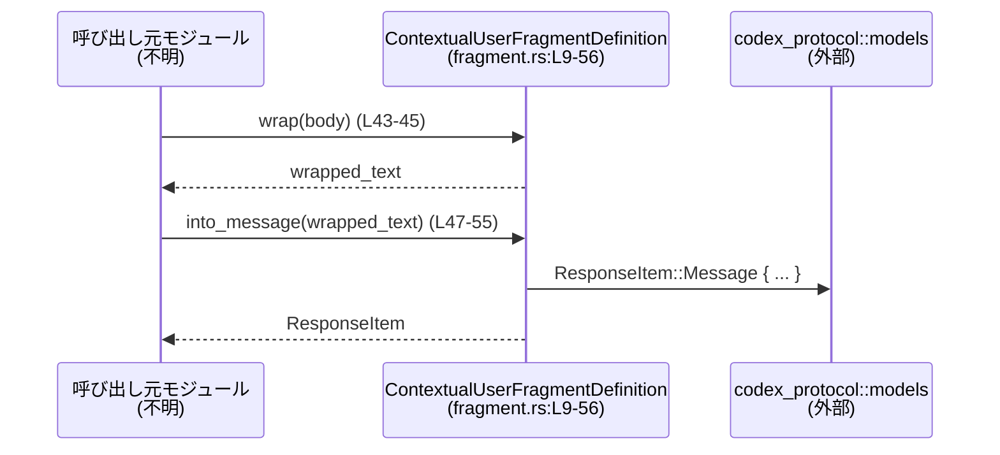

# instructions/src/fragment.rs

## 0. ざっくり一言

AGENTS.md や `<skill>...</skill>` のような「ユーザー向け指示ブロック」を、開始・終了マーカーで扱うための小さなユーティリティと、その代表的なプリセット定義を提供するモジュールです（`instructions/src/fragment.rs:L4-7, L9-13, L58-61`）。

---

## 1. このモジュールの役割

### 1.1 概要

- このモジュールは、テキスト中の特定の範囲（ユーザー指示フラグメント）を **開始マーカーと終了マーカーで囲んで管理する** ために存在します（`fragment.rs:L4-7, L9-13`）。
- 範囲の検出（先頭・末尾が指定マーカーかどうかの判定）、マーカーでのラップ、そしてそのテキストを `codex_protocol` の `ResponseItem::Message` 型に変換する機能を提供します（`fragment.rs:L23-32, L43-45, L47-55`）。

### 1.2 アーキテクチャ内での位置づけ

- 外部クレート `codex_protocol::models` の `ContentItem` / `ResponseItem` を利用して、プロトコルレベルの「ユーザーメッセージ」を構築します（`fragment.rs:L1-2, L47-55`）。
- 自身はマーカー定義と簡単な文字列処理のみを持ち、どのモジュールから呼ばれるかはこのチャンクだけでは分かりません（呼び出し元は「不明」とします）。

依存関係のイメージは次のとおりです。



### 1.3 設計上のポイント

- **軽量な不変データ構造**  
  - `ContextualUserFragmentDefinition` は `&'static str` フィールドのみを持ち、`Clone + Copy` です。ヒープ確保や可変状態は持ちません（`fragment.rs:L9-13`）。
- **安全な文字列スライス**  
  - `matches_text` は `str::get` と `saturating_sub` を用いてインデックス計算を行い、境界外アクセスや UTF-8 境界違反があっても `None` を返すことでパニックを避けています（`fragment.rs:L25-27, L29-31`）。
- **ASCII 大文字小文字無視の比較**  
  - マーカー比較には `eq_ignore_ascii_case` を用いており、ASCII 文字に関しては大小文字を区別しません（`fragment.rs:L27, L31`）。
- **プロトコルへの橋渡し**  
  - `into_message` で、与えられたテキストを常に `role: "user"` の `ResponseItem::Message` にラップします。これにより、呼び出し側は `codex_protocol` の詳細を意識せずにユーザーメッセージを生成できます（`fragment.rs:L47-55`）。
- **並行性**  
  - 型は不変な `'static` 参照のみを保持し、メソッドはすべて `&self` あるいは `self`（`Copy`）を取り可変アクセスを行わないため、このモジュール内にデータ競合の要素はありません（`fragment.rs:L9-13, L16-21, L23-45, L47-55`）。

---

## 2. 主要な機能一覧

- 指示フラグメント定義の保持: 開始マーカー・終了マーカーのペアを保持する `ContextualUserFragmentDefinition` 構造体（`fragment.rs:L9-13`）。
- テキストのフラグメント判定: テキストの先頭と末尾が指定マーカーで囲まれているかを判定する `matches_text`（`fragment.rs:L23-32`）。
- フラグメントの生成: 本文文字列を開始・終了マーカーで挟んだテキストを生成する `wrap`（`fragment.rs:L43-45`）。
- プロトコルメッセージの生成: 任意のテキストから `ResponseItem::Message` を生成する `into_message`（`fragment.rs:L47-55`）。
- 代表的なフラグメント定義:
  - `AGENTS_MD_FRAGMENT`: `# AGENTS.md instructions for` と `</INSTRUCTIONS>` で囲まれた指示ブロック用（`fragment.rs:L4-5, L58-59`）。
  - `SKILL_FRAGMENT`: `<skill>` と `</skill>` で囲まれたスキル定義ブロック用（`fragment.rs:L6-7, L60-61`）。

---

## 3. 公開 API と詳細解説

### 3.1 型一覧（構造体・列挙体など）

#### このモジュール内で定義される主なコンポーネント

| 名前 | 種別 | 役割 / 用途 | 可視性 | 定義位置 |
|------|------|-------------|--------|----------|
| `ContextualUserFragmentDefinition` | 構造体 | ユーザー指示フラグメント（開始・終了マーカーのペア）の定義を保持する | `pub` | `instructions/src/fragment.rs:L9-13` |
| `AGENTS_MD_START_MARKER` | 定数 `&'static str` | AGENTS.md 用の開始マーカー文字列 | `pub(crate)` | `fragment.rs:L4` |
| `AGENTS_MD_END_MARKER` | 定数 `&'static str` | AGENTS.md 用の終了マーカー文字列 | `pub(crate)` | `fragment.rs:L5` |
| `SKILL_OPEN_TAG` | 定数 `&'static str` | `<skill>` 開始タグ文字列 | `pub(crate)` | `fragment.rs:L6` |
| `SKILL_CLOSE_TAG` | 定数 `&'static str` | `</skill>` 終了タグ文字列 | `pub(crate)` | `fragment.rs:L7` |
| `AGENTS_MD_FRAGMENT` | 定数 `ContextualUserFragmentDefinition` | AGENTS.md 用フラグメント定義 | `pub` | `fragment.rs:L58-59` |
| `SKILL_FRAGMENT` | 定数 `ContextualUserFragmentDefinition` | `<skill>` 用フラグメント定義 | `pub` | `fragment.rs:L60-61` |

#### 外部依存型

| 名前 | 種別 | 役割 / 用途 | 定義元 | 使用位置 |
|------|------|-------------|--------|----------|
| `ContentItem` | 列挙体（と推定） | メッセージ内容（入力テキスト等）を表すプロトコル型 | `codex_protocol::models` | `fragment.rs:L1, L51` |
| `ResponseItem` | 列挙体（と推定） | チャットプロトコルにおけるメッセージなどの単位 | `codex_protocol::models` | `fragment.rs:L2, L47-55` |

※ `ContentItem` / `ResponseItem` の詳細実装はこのチャンクには現れません。

---

### 3.2 関数詳細

#### `ContextualUserFragmentDefinition::new(start_marker: &'static str, end_marker: &'static str) -> Self`

**概要**

- 開始マーカーと終了マーカーのペアから `ContextualUserFragmentDefinition` を生成するコンストラクタです（`fragment.rs:L16-21`）。
- `const fn` のため、定数定義（`AGENTS_MD_FRAGMENT` 等）にも利用できます（`fragment.rs:L58-61`）。

**引数**

| 引数名 | 型 | 説明 |
|--------|----|------|
| `start_marker` | `&'static str` | フラグメントの開始マーカー文字列 |
| `end_marker` | `&'static str` | フラグメントの終了マーカー文字列 |

**戻り値**

- `ContextualUserFragmentDefinition`: 渡されたマーカーを保持する新しい定義インスタンス（`fragment.rs:L16-21`）。

**内部処理の流れ**

1. `Self { start_marker, end_marker }` でフィールドにそのまま代入します（`fragment.rs:L17-20`）。
2. 他の処理や検証は行っていません（`fragment.rs:L16-21`）。

**Examples（使用例）**

```rust
// 実際のモジュールパスはプロジェクト構成に合わせて変更する
use crate::instructions::fragment::ContextualUserFragmentDefinition;

const CUSTOM_FRAGMENT: ContextualUserFragmentDefinition =
    ContextualUserFragmentDefinition::new("[[START]]", "[[END]]"); // 'static なマーカーを指定
```

**Errors / Panics**

- ランタイムエラーや `Result` は返しません。
- `unsafe` やパニックになりうる操作はありません（単純な構造体初期化のみ、`fragment.rs:L17-20`）。

**Edge cases（エッジケース）**

- 非 ASCII 文字を含むマーカーも受け付けますが、このモジュール内では特別扱いはありません（`fragment.rs:L16-21`）。
- `'static` ライフタイム制約により、ローカルな `String` から `&str` を直接渡すことはできません（コンパイルエラーになります）。

**使用上の注意点**

- `'static` 制約があるため、コンパイル時に確定しているリテラル等を使う設計になっています（`fragment.rs:L16`）。
- 動的なマーカーを使いたい場合は、この型や関数の設計自体を変更する必要があります。

---

#### `ContextualUserFragmentDefinition::matches_text(&self, text: &str) -> bool`

**概要**

- 渡されたテキストの前後（前後の空白を除く）が、この定義の開始・終了マーカーで囲まれているかを判定します（`fragment.rs:L23-32`）。

**引数**

| 引数名 | 型 | 説明 |
|--------|----|------|
| `&self` | `&ContextualUserFragmentDefinition` | 使用するマーカー定義 |
| `text` | `&str` | 判定対象テキスト |

**戻り値**

- `bool`:  
  - `true` … `text` の先頭（前の空白除去後）が `start_marker` で始まり、末尾（後ろの空白除去後）が `end_marker` で終わる場合（`fragment.rs:L23-32`）。  
  - `false` … 上記条件を満たさない場合。

**内部処理の流れ**

1. `text.trim_start()` により先頭の空白類（スペース・改行など）を除去し `trimmed` に保存します（`fragment.rs:L24`）。
2. `trimmed.get(..self.start_marker.len())` で、先頭 `start_marker.len()` バイト分のスライス（`Option<&str>`）を取得します（`fragment.rs:L25-26`）。
   - インデックス範囲外や UTF-8 境界不正の場合 `None` になります。
3. `.is_some_and(|candidate| candidate.eq_ignore_ascii_case(self.start_marker))` によって、  
   - スライスが存在し、かつ ASCII 大文字小文字無視で `start_marker` と等しいかを判定し、`starts_with_marker` に格納します（`fragment.rs:L25-27`）。
4. 改めて `trimmed.trim_end()` で末尾の空白を除去し直します（`fragment.rs:L28`）。
5. `trimmed.len().saturating_sub(self.end_marker.len())` で終了マーカー候補の開始位置を計算し、その位置から末尾までを `get(..)` で取得します（`fragment.rs:L29-30`）。
   - ここでも範囲外や UTF-8 境界不正の場合は `None` です。
6. そのスライスが ASCII 大文字小文字無視で `end_marker` と等しいかを判定して `ends_with_marker` に格納します（`fragment.rs:L29-31`）。
7. 最後に `starts_with_marker && ends_with_marker` を返します（`fragment.rs:L32`）。

**Examples（使用例）**

```rust
use crate::instructions::fragment::AGENTS_MD_FRAGMENT;

let text = "# AGENTS.md instructions for foo\nbody\n</INSTRUCTIONS>\n";
// 前後の改行や空白は無視される
assert!(AGENTS_MD_FRAGMENT.matches_text(text)); // true を返す想定（fragment.rs:L23-32）

let text2 = "no markers here";
assert!(!AGENTS_MD_FRAGMENT.matches_text(text2)); // マーカーで始まらないので false
```

**Errors / Panics**

- `str::get` を使っているため、範囲外や UTF-8 境界不正でも `None` となり、パニックにはなりません（`fragment.rs:L25-27, L29-31`）。
- 例外や `Result` を返す設計ではなく、単純に `bool` で結果を返します。

**Edge cases（エッジケース）**

- `text` が空文字列または空白のみの場合  
  - `trim_start` / `trim_end` の結果が空となり、どちらのマーカーとも一致しないため `false` になります（`fragment.rs:L24-32`）。
- `text` よりマーカーが長い場合  
  - `get(..len)` / `get(start..)` が `None` となり、`starts_with_marker` または `ends_with_marker` が `false` になります（`fragment.rs:L25-27, L29-31`）。
- 非 ASCII 文字を含むマーカー・テキスト  
  - `eq_ignore_ascii_case` は ASCII のみをケース変換対象とするため、非 ASCII 文字に関しては通常の大小文字比較と同様に扱われます（`fragment.rs:L27, L31`）。
- テキストの前後に余分な空白や改行がある場合  
  - `trim_start` / `trim_end` により無視されるため、マーカーのすぐ外側の空白は判定に影響しません（`fragment.rs:L24, L28`）。

**使用上の注意点**

- 判定は「**先頭が開始マーカーで始まり、末尾が終了マーカーで終わるか**」であり、内部の構造（本文の内容）には一切関知しません（`fragment.rs:L24-32`）。
- 部分一致（テキスト中のどこかにマーカーが含まれるか）を調べる関数ではありません。その用途には別途処理が必要です。

---

#### `ContextualUserFragmentDefinition::wrap(&self, body: String) -> String`

**概要**

- 本文文字列 `body` を、開始マーカー・終了マーカーで挟み込んだ新しい文字列を生成します（`fragment.rs:L43-45`）。

**引数**

| 引数名 | 型 | 説明 |
|--------|----|------|
| `&self` | `&ContextualUserFragmentDefinition` | 使用するマーカー定義 |
| `body` | `String` | 挟み込む本文。所有権はこの関数内に移動します |

**戻り値**

- `String`:  
  - `"start_marker\nbody\nend_marker"` という形式の新しい文字列（`fragment.rs:L43-45`）。

**内部処理の流れ**

1. `format!("{}\n{}\n{}", self.start_marker, body, self.end_marker)` を呼び出します（`fragment.rs:L44`）。
2. これにより、開始マーカー・本文・終了マーカーの間に改行文字 `\n` を挟んだ文字列が生成されます（`fragment.rs:L44`）。

**Examples（使用例）**

```rust
use crate::instructions::fragment::SKILL_FRAGMENT;

let body = "<name>Example Skill</name>".to_string();
let wrapped = SKILL_FRAGMENT.wrap(body);
// wrapped は "<skill>\n<name>Example Skill</name>\n</skill>" という形式になる（fragment.rs:L43-45）
```

**Errors / Panics**

- `format!` は通常のフォーマット処理であり、ここではエラーを返しません（`fragment.rs:L44`）。
- メモリ不足等の極端な状況を除き、この関数自体からパニックは想定されません。

**Edge cases（エッジケース）**

- `body` が空文字列の場合  
  - `"start_marker\n\nend_marker"` のように、空行が 1 行挟まった形の文字列になります（`fragment.rs:L44`）。
- `body` 内に開始マーカーや終了マーカーと同じ文字列が含まれていても、この関数はそれを加工せず、単純に挟み込むのみです（`fragment.rs:L43-45`）。

**使用上の注意点**

- `body` の所有権を消費するため、元の `String` は呼び出し後に利用できません。再利用したい場合は `.clone()` などを検討します（Rust の所有権ルールに基づく挙動）。
- マーカーや本文の改行コード（`"\n"` 固定）に依存する処理を後続で行う場合、環境依存の改行（`\r\n` など）との整合性に注意が必要です。

---

#### `ContextualUserFragmentDefinition::into_message(self, text: String) -> ResponseItem`

**概要**

- 任意のテキスト `text` から、`codex_protocol` に定義された `ResponseItem::Message` を構築します（`fragment.rs:L47-55`）。
- `role` を `"user"` に固定し、`ContentItem::InputText { text }` としてラップします。

**引数**

| 引数名 | 型 | 説明 |
|--------|----|------|
| `self` | `ContextualUserFragmentDefinition` | フラグメント定義（`Copy` なので実質的に参照渡しと同様） |
| `text` | `String` | メッセージ本文。所有権は `ContentItem::InputText` に移動します |

**戻り値**

- `ResponseItem`: `ResponseItem::Message { ... }` バリアント（`fragment.rs:L47-55`）。

**内部処理の流れ**

1. `ResponseItem::Message { ... }` 構文で列挙体のバリアントを構築します（`fragment.rs:L48-54`）。
2. `id` は `None` に固定されます（`fragment.rs:L49`）。
3. `role` は `"user".to_string()` で文字列化され `"user"` 固定になります（`fragment.rs:L50`）。
4. `content` は `vec![ContentItem::InputText { text }]` という 1 要素のベクタで、`text` を `InputText` バリアントに格納します（`fragment.rs:L51`）。
5. `end_turn` と `phase` は `None` に設定されています（`fragment.rs:L52-53`）。

**Examples（使用例）**

```rust
use crate::instructions::fragment::AGENTS_MD_FRAGMENT;
use codex_protocol::models::ResponseItem;

let body = "# AGENTS.md instructions for foo\n...\n</INSTRUCTIONS>".to_string();
let message: ResponseItem = AGENTS_MD_FRAGMENT.into_message(body);
// message は role = "user" の Message バリアントになり、content[0] に InputText として body が入る（fragment.rs:L47-55）
```

**Errors / Panics**

- コンストラクタ的な処理のみであり、エラーやパニックを発生させる要素は含まれていません（`fragment.rs:L48-54`）。
- 外部型 `ResponseItem` / `ContentItem` の実装に依存する部分は、このチャンクには現れません。

**Edge cases（エッジケース）**

- `text` が空文字列でも、そのまま `InputText { text: "" }` として格納されます（`fragment.rs:L51`）。
- 非常に長い文字列を渡した場合でも、ここでは特別な制限や分割は行わず、そのまま 1 つの `InputText` として扱います（`fragment.rs:L51`）。

**使用上の注意点**

- `self` は値渡しですが、型が `Copy` のため所有権移動のコストは低く、呼び出し側でも同じ値を引き続き使用できます（`fragment.rs:L9, L47`）。
- `role` が `"user"` に固定されているため、システムメッセージやアシスタントメッセージとして扱いたい場合は別のコンストラクタが必要になります。

---

### 3.3 その他の関数

| 関数名 | 役割（1 行） | 定義位置 |
|--------|--------------|----------|
| `ContextualUserFragmentDefinition::start_marker(&self) -> &'static str` | 保持している開始マーカー文字列を返す単純なゲッターです。 | `fragment.rs:L35-37` |
| `ContextualUserFragmentDefinition::end_marker(&self) -> &'static str` | 保持している終了マーカー文字列を返す単純なゲッターです。 | `fragment.rs:L39-41` |

どちらも単にフィールドを返すだけであり、副作用やパニック要因はありません。

---

## 4. データフロー

ここでは、典型的なシナリオとして「AGENTS.md の指示をラップし、ユーザーメッセージとしてプロトコルに渡す」流れを説明します。

1. 呼び出し元が AGENTS.md 形式の本文文字列を用意します。
2. `AGENTS_MD_FRAGMENT.wrap(body)` でマーカー付きのテキストに変換します（`fragment.rs:L43-45, L58-59`）。
3. その文字列を `AGENTS_MD_FRAGMENT.into_message(wrapped)` に渡し、`ResponseItem::Message` を生成します（`fragment.rs:L47-55`）。
4. 生成された `ResponseItem` が、どこか上位のロジックから送信・保存などに利用されます（このチャンクには現れません）。

この流れをシーケンス図で表すと次のようになります。



`matches_text (L23-32)` は、例えば既にあるテキストが AGENTS.md 形式かどうかを判定するために同様の位置で呼び出されると考えられますが、その具体的な呼び出し元はこのチャンクには現れません。

---

## 5. 使い方（How to Use）

### 5.1 基本的な使用方法

AGENTS.md 用フラグメントをラップして `ResponseItem` に変換する例です。

```rust
// 実際のモジュールパスはプロジェクト構成に合わせて調整する
use crate::instructions::fragment::AGENTS_MD_FRAGMENT;
use codex_protocol::models::ResponseItem;

fn build_agents_message(body_only: String) -> ResponseItem {
    // body_only: マーカーを含まない AGENTS.md 本文
    let wrapped = AGENTS_MD_FRAGMENT.wrap(body_only);   // "# AGENTS..." と "</INSTRUCTIONS>" で挟む（fragment.rs:L43-45, L58-59）
    AGENTS_MD_FRAGMENT.into_message(wrapped)            // ResponseItem::Message に変換（fragment.rs:L47-55）
}
```

この関数を呼び出すと、AGENTS.md 指示ブロックを 1 つの「ユーザー向けメッセージ」として上位レイヤーに渡すことができます。

### 5.2 よくある使用パターン

#### 1. 既存テキストがフラグメント形式か判定する

```rust
use crate::instructions::fragment::SKILL_FRAGMENT;

fn is_skill_block(text: &str) -> bool {
    SKILL_FRAGMENT.matches_text(text) // "<skill> ... </skill>" で囲まれているか判定（fragment.rs:L23-32, L60-61）
}
```

#### 2. 独自マーカーのフラグメントを追加定義する

```rust
use crate::instructions::fragment::ContextualUserFragmentDefinition;

const CUSTOM_FRAGMENT: ContextualUserFragmentDefinition =
    ContextualUserFragmentDefinition::new("<<CUSTOM>>", "<</CUSTOM>>"); // fragment.rs:L16-21

fn wrap_custom(body: String) -> String {
    CUSTOM_FRAGMENT.wrap(body) // "<<CUSTOM>>\n...\n<</CUSTOM>>" 形式に変換（fragment.rs:L43-45）
}
```

### 5.3 よくある間違い

```rust
use crate::instructions::fragment::ContextualUserFragmentDefinition;

// 間違い例: ライフタイムが 'static でない &str を渡そうとする
fn make_fragment(prefix: &str, suffix: &str) {
    // 下の行はコンパイルエラー:
    // ContextualUserFragmentDefinition::new(prefix, suffix);
    // 'static ライフタイムが要求されるため（fragment.rs:L16）
}

// 正しい例: 文字列リテラル（'static）を渡す
const OK_FRAGMENT: ContextualUserFragmentDefinition =
    ContextualUserFragmentDefinition::new("[[START]]", "[[END]]");
```

```rust
use crate::instructions::fragment::AGENTS_MD_FRAGMENT;

// 間違い例: テキストの一部にマーカーが含まれていれば true だと誤解する
let text = "prefix # AGENTS.md instructions for foo\n...\n</INSTRUCTIONS> suffix";
assert!(!AGENTS_MD_FRAGMENT.matches_text(text)); // 先頭と末尾がマーカーではないため false（fragment.rs:L23-32)

// 正しい理解: 先頭と末尾（空白を除く）がマーカーである場合のみ true
let text2 = "# AGENTS.md instructions for foo\n...\n</INSTRUCTIONS>\n";
assert!(AGENTS_MD_FRAGMENT.matches_text(text2));
```

### 5.4 使用上の注意点（まとめ）

- **安全性 / エラー**  
  - 文字列スライスはすべて `str::get` を経由しており、範囲外や UTF-8 境界違反でパニックにならない設計です（`fragment.rs:L25-27, L29-31`）。  
  - 本モジュール内には `unsafe` ブロックや I/O は存在せず、エラーはすべて `bool` や純粋な値の形で表現されています。
- **並行性**  
  - 型は不変の `'static` 参照のみを保持し、内部状態を変更しないため、複数スレッドから同じ定数（`AGENTS_MD_FRAGMENT` / `SKILL_FRAGMENT`）を共有して使用してもデータレースは生じません（`fragment.rs:L4-7, L9-13, L58-61`）。
- **パフォーマンス**  
  - `matches_text` はトリムと文字列比較を行うだけなので、入力長 N に対して O(N) 程度の軽量な処理です（`fragment.rs:L24-32`）。  
  - `wrap` や `into_message` は 1 回の `String` フォーマット / ベクタ構築のみであり、高頻度利用でも負荷は小さいと考えられます（`fragment.rs:L43-45, L47-55`）。
- **セキュリティ観点**  
  - 入力テキストに対して特別なサニタイズやエスケープは行っていません。`wrap` は `body` をそのままマーカーで挟むのみです（`fragment.rs:L43-45`）。  
  - したがって、セキュリティ対策（例: HTML エスケープ等）が必要な場合は、呼び出し側で実施する前提の設計です。

---

## 6. 変更の仕方（How to Modify）

### 6.1 新しい機能を追加する場合

**新しい種類のフラグメントを追加する**

1. 新しい開始・終了マーカーを `pub(crate) const` で定義します。  
   例: `pub(crate) const NEW_START: &str = "<new>";`（`fragment.rs:L4-7` を参考）。
2. それらを使って新しい `ContextualUserFragmentDefinition` の定数を追加します。  
   例:  

   ```rust
   pub const NEW_FRAGMENT: ContextualUserFragmentDefinition =
       ContextualUserFragmentDefinition::new(NEW_START, NEW_END);
   ```

3. 呼び出し側からは、既存の `AGENTS_MD_FRAGMENT` / `SKILL_FRAGMENT` と同様に利用できます（`fragment.rs:L58-61`）。

**他の役割（system, assistant など）のメッセージ生成を追加したい場合**

- `into_message` は `role: "user"` に固定されているため（`fragment.rs:L50`）、別のロールを扱うには:
  - 新しいメソッド（例: `into_system_message`）をこの `impl` に追加する、または
  - 呼び出し側で `ResponseItem::Message` を直接構築する  
  といった変更が考えられます。

### 6.2 既存の機能を変更する場合

- `matches_text` の判定ロジックを変更する際の注意:
  - 現状は「先頭・末尾がマーカーであるか」を空白を除去したうえで判定しています（`fragment.rs:L24-32`）。
  - 仕様を変えると、既存の呼び出し側の期待と異なる動作になる可能性があるため、呼び出し箇所（このチャンクには現れない）を検索して仕様を再確認する必要があります。
- `wrap` のフォーマットを変更する場合:
  - 改行文字の有無や位置を変えると、後続のパーサ（マーカーを前提とした解析処理）への影響が出る可能性が高いです（`fragment.rs:L43-45`）。
- `into_message` のフィールドを変更する場合:
  - `id` / `end_turn` / `phase` のデフォルト値を変更すると、上位のメッセージ処理ロジックにも影響します（`fragment.rs:L49, L52-53`）。
  - `codex_protocol::models::ResponseItem` の仕様に反しないかを確認する必要があります（詳細はこのチャンクには現れません）。

---

## 7. 関連ファイル

このチャンクから直接参照されているのは次の外部コンポーネントです。

| パス / 型 | 役割 / 関係 |
|-----------|------------|
| `codex_protocol::models::ContentItem` | `into_message` でメッセージ内容（`InputText` バリアント）として使用される（`fragment.rs:L1, L51`）。 |
| `codex_protocol::models::ResponseItem` | `into_message` の戻り値として使用されるメッセージコンテナ（`fragment.rs:L2, L47-55`）。 |

このモジュールを利用する上位の指示処理ロジック（例: AGENTS.md を読み取り、このフラグメントを使ってメッセージを組み立てるコード）は、このチャンクには現れないため不明です。テストコード（`#[cfg(test)]` モジュール等）もこのチャンクには存在しません（ファイル末尾までに出現しないため、`fragment.rs:L58-61` で終了）。
