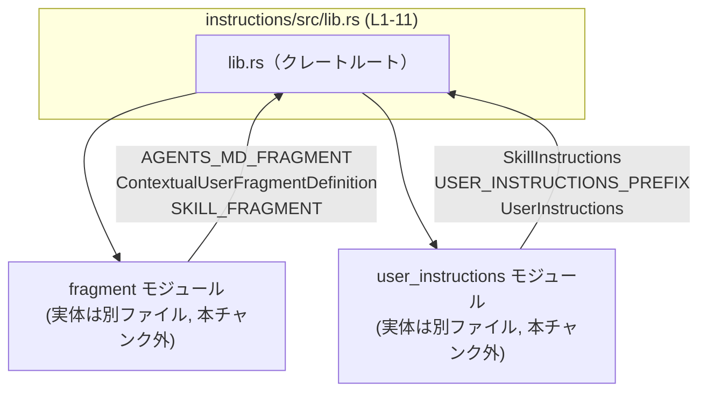

# instructions/src/lib.rs コード解説

## 0. ざっくり一言

`instructions/src/lib.rs` は、このクレートのルートとして「ユーザー／スキルのインストラクション」と「コンテキスト付きユーザーフラグメント定義」に関するシンボルをまとめて再エクスポートするモジュールです（`instructions/src/lib.rs:L1-11`）。

---

## 1. このモジュールの役割

### 1.1 概要

- 先頭のドキュメントコメントによると、このモジュール（クレート）は  
  「User and skill instruction payloads and contextual user fragment markers for Codex prompts.」  
  を扱います（`instructions/src/lib.rs:L1`）。
- `lib.rs` 自身は `fragment` / `user_instructions` という 2 つのサブモジュールを定義し（`L3-4`）、そこから以下の 6 つのシンボルを再エクスポートします（`L6-11`）。
  - `AGENTS_MD_FRAGMENT`
  - `ContextualUserFragmentDefinition`
  - `SKILL_FRAGMENT`
  - `SkillInstructions`
  - `USER_INSTRUCTIONS_PREFIX`
  - `UserInstructions`
- これにより、利用側はサブモジュール名を意識せず、クレートのトップレベルからこれらのシンボルにアクセスできます。

### 1.2 アーキテクチャ内での位置づけ

- `lib.rs` はクレートのルートであり、外部公開される API の窓口になっています。
- 実装は `fragment` モジュールと `user_instructions` モジュール側にあり、`lib.rs` はそれらを束ねる役割に限定されています（`L3-4, L6-11`）。
- サブモジュールは `mod fragment;` / `mod user_instructions;` として宣言されており（`L3-4`）、`pub mod` ではないため、外部からは直接参照できず、トップレベルで再エクスポートされたシンボルだけが公開 API になります。

依存関係を簡略化した Mermaid 図です（本チャンク: `instructions/src/lib.rs:L1-11` を明示）。



※ `fragment` / `user_instructions` の実装ファイル（`fragment.rs` など）の中身は、このチャンクには現れません。

### 1.3 設計上のポイント

コードから読み取れる設計上の特徴は次のとおりです。

- **再エクスポートによる API 集約**  
  - `mod fragment;` / `mod user_instructions;` でモジュールを内部に保持しつつ、必要なシンボルだけを `pub use` で外に出す形になっています（`L3-4, L6-11`）。
  - これにより、公開 API を `lib.rs` に集約し、内部構造を隠蔽する構成になっています。
- **状態レスのルートモジュール**  
  - `lib.rs` 内には関数定義・構造体定義・静的変数定義などはなく、モジュール宣言と再エクスポートのみが存在します（`L1-11`）。
  - したがって、このファイル単体で状態やロジックを保持している部分はありません。
- **エラー処理・並行処理はこのファイルには存在しない**  
  - `lib.rs` には関数や非同期処理は定義されておらず、エラー処理・並行性に関するロジックはこのファイルにはありません。  
    それらがある場合は、`fragment` / `user_instructions` 側に実装されているはずですが、このチャンクには現れません。

---

## 2. 主要な機能一覧

このファイルは機能そのものではなく「公開 API の窓口」として機能します。ここでは、再エクスポートされているシンボルを中心に、コードから分かる範囲で説明します。

- `AGENTS_MD_FRAGMENT`: `fragment` モジュール由来のシンボル。種別・詳細な役割は、このチャンクには現れません（`L6`）。
- `ContextualUserFragmentDefinition`: `fragment` モジュール由来のシンボル。コメントから、コンテキスト付きユーザーフラグメント定義に関係する型または値であることが示唆されますが、詳細な構造は不明です（`L1, L7`）。
- `SKILL_FRAGMENT`: `fragment` モジュール由来のシンボル。スキル関連のフラグメントに関係することが名前から推測されますが、具体的な挙動や型は不明です（`L8`）。
- `SkillInstructions`: `user_instructions` モジュール由来のシンボル。コメントから、スキルに関するインストラクションペイロードを表す型である可能性がありますが、実際の定義はこのチャンクにはありません（`L1, L9`）。
- `USER_INSTRUCTIONS_PREFIX`: `user_instructions` モジュール由来のシンボル。ユーザーインストラクションのプレフィックス文字列などを表す定数であることが名前から想像されますが、コードからは断定できません（`L10`）。
- `UserInstructions`: `user_instructions` モジュール由来のシンボル。コメントから、ユーザーのインストラクションペイロードを表す型であることが示唆されますが、内部構造は不明です（`L1, L11`）。

※ 具体的なフィールド・メソッド・振る舞いは、`fragment` / `user_instructions` の実装がこのチャンクには現れないため、不明です。

---

## 3. 公開 API と詳細解説

### 3.1 型・シンボル一覧（公開インベントリー）

#### モジュール / サブモジュール

| 名前 | 種別 | 公開状態 | 定義位置（根拠） | 役割 / 関係 |
|------|------|----------|------------------|------------|
| `fragment` | モジュール | 内部モジュール（`pub` なし） | `instructions/src/lib.rs:L3` | `AGENTS_MD_FRAGMENT` などを定義しているモジュール。実体ファイルは通常 `src/fragment.rs` または `src/fragment/mod.rs` のいずれかになりますが、どちらであるかはこのチャンクからは分かりません。 |
| `user_instructions` | モジュール | 内部モジュール（`pub` なし） | `instructions/src/lib.rs:L4` | `SkillInstructions` や `UserInstructions` など、インストラクション関連のシンボルを定義しているモジュール。実体ファイルは `src/user_instructions.rs` または `src/user_instructions/mod.rs` であると考えられますが、詳細は不明です。 |

#### 再エクスポートされるシンボル

| 名前 | 種別（コードから判別可能な範囲） | 元モジュール | 定義位置（再エクスポートの根拠） | 役割 / 用途（コメント・名前に基づく） |
|------|----------------------------------|------------|-----------------------------------|----------------------------------------|
| `AGENTS_MD_FRAGMENT` | 不明（このチャンクに型定義なし） | `fragment` | `instructions/src/lib.rs:L6` | 「エージェント」に関する Markdown フラグメントなどを表すシンボルである可能性がありますが、実態はこのチャンクからは分かりません。 |
| `ContextualUserFragmentDefinition` | 不明 | `fragment` | `instructions/src/lib.rs:L7` | ドキュメントコメントの「contextual user fragment markers」に対応する定義であると考えられますが、型か定数かなどの詳細は不明です。 |
| `SKILL_FRAGMENT` | 不明 | `fragment` | `instructions/src/lib.rs:L8` | スキル関連のフラグメントであることが名前から推測されますが、具体的な内容はコードからは読み取れません。 |
| `SkillInstructions` | 不明 | `user_instructions` | `instructions/src/lib.rs:L9` | スキル向けインストラクションペイロードを表す型であるとコメントから推測されますが、フィールドなどの詳細は不明です。 |
| `USER_INSTRUCTIONS_PREFIX` | 不明 | `user_instructions` | `instructions/src/lib.rs:L10` | ユーザーインストラクションに共通するプレフィックス文字列などを表す定数である可能性がありますが、実際の型・値は不明です。 |
| `UserInstructions` | 不明 | `user_instructions` | `instructions/src/lib.rs:L11` | ユーザーのインストラクションペイロードを表す型であるとコメントから推測されますが、内部構造はこのチャンクには現れません。 |

> **重要**: 上記の「役割 / 用途」は、`lib.rs` のドキュメントコメント（`L1`）とシンボル名からの推測を含みます。正確な仕様は、それぞれのモジュールの実装を確認する必要があります。

### 3.2 関数詳細

- このファイルには関数定義が存在しません（`instructions/src/lib.rs:L1-11` には `fn` キーワードが現れません）。
- 関数がある場合は、`fragment` もしくは `user_instructions` モジュール側に定義されていると考えられますが、それらのコードはこのチャンクには現れないため、関数ごとの詳細解説（引数・戻り値・エラーハンドリング・エッジケースなど）は行えません。

### 3.3 その他の関数

- このチャンクには関数シンボルが一切現れないため、「その他の関数」に該当するものもありません。

---

## 4. データフロー

このファイルには実行時のロジックやデータ処理のコードはありませんが、「公開 API を経由したシンボル参照」の流れを簡単なシーケンスとして示します。

以下は、利用側コードが `UserInstructions` などを使うときの解決の流れを抽象化した図です（`instructions/src/lib.rs:L1-11` の範囲に対応）。

```mermaid
sequenceDiagram
  participant Caller as 呼び出し側コード
  participant Lib as lib.rs<br/>(instructions/src/lib.rs L1-11)
  participant Frag as fragment モジュール<br/>(実装は本チャンク外)
  participant UI as user_instructions モジュール<br/>(実装は本チャンク外)

  Caller->>Lib: use crate::UserInstructions;
  Note over Lib: pub use user_instructions::UserInstructions; (L11)

  Lib->>UI: UserInstructions シンボルを解決

  Caller->>Lib: use crate::AGENTS_MD_FRAGMENT;
  Note over Lib: pub use fragment::AGENTS_MD_FRAGMENT; (L6)

  Lib->>Frag: AGENTS_MD_FRAGMENT シンボルを解決
```

要点:

- 呼び出し側は `crate::UserInstructions` などクレートルート経由でシンボルを参照します。
- コンパイラは `lib.rs` の `pub use` をたどり、実際の定義場所である `fragment` / `user_instructions` モジュール内の定義にたどり着きます。
- 実行時のデータ処理はすべてサブモジュール側で行われ、このファイルは名前解決の窓口としてだけ関与します。

このため、**エラー処理や並行処理に関する実装上の注意点は、`fragment` / `user_instructions` 側のコードに依存し、このファイル単体からは判断できません**。

---

## 5. 使い方（How to Use）

### 5.1 基本的な使用方法

このモジュールの主な役割は「クレートルートからインポートしやすくする」ことです。  
同一クレート内から利用する場合の典型的なコード例を示します。

```rust
// lib.rs と同じクレート内の別モジュールから利用する場合の例
use crate::{                                               // 同一クレート内なので `crate::` を使用
    AGENTS_MD_FRAGMENT,                                     // fragment モジュール由来のシンボル
    ContextualUserFragmentDefinition,                       // コンテキスト付きユーザーフラグメント定義（詳細は別モジュール）
    SKILL_FRAGMENT,                                         // スキル関連のフラグメント
    SkillInstructions,                                      // スキル用インストラクションペイロード
    USER_INSTRUCTIONS_PREFIX,                               // ユーザーインストラクションのプレフィックス（推測）
    UserInstructions,                                       // ユーザーインストラクションペイロード
};

// これらの型や値を引数に取る関数を定義するイメージ例
// ※ 実際にどのように使うかは、各型の定義に依存するため、このチャンクからは分かりません。
fn build_prompt(                                           // プロンプトを構築する関数の例
    user_inst: UserInstructions,                           // ユーザーインストラクション
    skill_inst: SkillInstructions,                         // スキルインストラクション
    ctx_frag: &ContextualUserFragmentDefinition,           // フラグメント定義への参照
) {
    // ここで AGENTS_MD_FRAGMENT や SKILL_FRAGMENT, USER_INSTRUCTIONS_PREFIX などを
    // 用いてプロンプト文字列を組み立てることが想定されますが、
    // 具体的な API はこのチャンクには現れません。
}
```

この例のポイント:

- 利用側はサブモジュール名（`fragment` / `user_instructions`）を意識せず、`crate::` 直下からシンボルをインポートできます。
- 所有権・借用の扱い（`UserInstructions` を所有権で受け取るのか、参照で受け取るのか等）は、各型の設計に依存し、このチャンクからは分かりません。

### 5.2 よくある使用パターン（想定されるもの）

コードから確定できるのは「インポートパターン」だけですが、それに基づき想定される利用形態は次のとおりです。

- **型を利用したデータ構築・シリアライズ**  
  - `UserInstructions` / `SkillInstructions` が構造体や列挙体である場合、これらを組み立ててプロンプトエンジンに渡す用途が考えられます。
  - 具体的なフィールドやメソッドは不明なため、詳細な例はこのチャンクからは示せません。
- **フラグメント定数によるテンプレート組み立て**  
  - `AGENTS_MD_FRAGMENT` / `SKILL_FRAGMENT` / `USER_INSTRUCTIONS_PREFIX` が文字列定数である場合、テンプレート文字列の連結やフォーマットに使われると考えられます。
  - これが実際にどの型かは、このチャンクに定義がないため不明です。

### 5.3 よくある間違い（起こり得るもの）

このファイルの構造から想定される誤用例を挙げます。

```rust
// （外部クレートからの利用を仮定した例）
// 間違い例: 内部モジュールに直接アクセスしようとする
// use instructions::fragment::AGENTS_MD_FRAGMENT;
// use instructions::user_instructions::UserInstructions;

// 正しい例: クレートルートから再エクスポート済みシンボルを利用する
use instructions::AGENTS_MD_FRAGMENT;
use instructions::UserInstructions;
```

- `mod fragment;` / `mod user_instructions;` は `pub` ではないため、外部クレートからは `instructions::fragment` / `instructions::user_instructions` へ直接アクセスできません（`L3-4`）。
- 外部公開されているのは、`lib.rs` から `pub use` されたシンボルのみです（`L6-11`）。

### 5.4 使用上の注意点（まとめ）

- **公開 API を変えたい場合の影響**  
  - このファイルで `pub use` しているシンボルを追加・削除・名称変更すると、クレートの公開 API が変わり、外部利用者のコードに影響します。
- **内部構造の隠蔽**  
  - `fragment` / `user_instructions` は外部から直接見えないため、内部のモジュール構成を変更しても、`lib.rs` の再エクスポートを維持すれば外部 API は保たれます。
- **エラー処理・並行性に関する注意**  
  - このファイルにはロジックがないため、エラー処理や非同期処理に関する注意点はすべてサブモジュール側の実装に依存します。
  - したがって、スレッド安全性やパニック条件を確認するには、`fragment` / `user_instructions` の実装を直接読む必要があります。

---

## 6. 変更の仕方（How to Modify）

### 6.1 新しい機能を追加する場合

新しい型や定数を公開 API に追加したい場合の一般的な手順は、現在の構造から次のように整理できます。

1. **どのモジュールに実装するか決める**  
   - ユーザー／スキルインストラクションのペイロードに関係するなら `user_instructions` モジュール側。  
   - フラグメントやコンテキスト情報に関係するなら `fragment` モジュール側。  
   ※ これはドキュメントコメント（`L1`）と既存の名前付けに基づく整理であり、厳密な設計ルールはこのチャンクからは分かりません。
2. **該当モジュールに型や関数を追加**  
   - 例: `user_instructions` に `AdvancedUserInstructions` などを定義する。
3. **`lib.rs` から再エクスポートする**  
   - 新しいシンボルを外部にも公開したい場合、`lib.rs` に `pub use user_instructions::AdvancedUserInstructions;` のような行を追加します。
4. **既存の利用箇所への影響を確認**  
   - 追加であれば影響は限定的ですが、名前が衝突していないかなどを確認する必要があります。

### 6.2 既存の機能を変更する場合

既存シンボルの変更に関して、このファイルから読み取れる注意点は次のとおりです。

- **シンボル名を変更する場合**  
  - `fragment` / `user_instructions` 内の定義名と、`lib.rs` の `pub use` 両方を修正する必要があります。
  - `lib.rs` からの名前が変わると、外部利用者のインポートパスがすべて変わるため、公開 API 変更として扱うべきです。
- **シンボルを非公開にしたい場合**  
  - `lib.rs` の `pub use` 行を削除すれば、外部からは見えなくなります。
  - ただし、クレート内の他モジュールが `crate::UserInstructions` などを利用している場合、それらのコードも修正が必要です。
- **型の意味や構造を変える場合**  
  - 実際の型定義はサブモジュール側にあり、このファイルからはその構造が分からないため、変更の影響範囲を調べるには、サブモジュールとその利用箇所を検索する必要があります。

---

## 7. 関連ファイル

この `lib.rs` と密接に関係するファイル・モジュールは次のとおりです。

| パス（推定を含む） | 役割 / 関係 |
|--------------------|------------|
| `instructions/src/fragment.rs` または `instructions/src/fragment/mod.rs` | `mod fragment;` に対応するモジュールファイルです（`instructions/src/lib.rs:L3`）。`AGENTS_MD_FRAGMENT` / `ContextualUserFragmentDefinition` / `SKILL_FRAGMENT` などの実体定義が含まれていると考えられます。どちらのパスが使われているかは、このチャンクからは判別できません。 |
| `instructions/src/user_instructions.rs` または `instructions/src/user_instructions/mod.rs` | `mod user_instructions;` に対応するモジュールファイルです（`instructions/src/lib.rs:L4`）。`SkillInstructions` / `USER_INSTRUCTIONS_PREFIX` / `UserInstructions` の実体定義が含まれていると考えられます。 |
| （テストコード） | このチャンクにはテストモジュールや `tests/` ディレクトリへの参照は現れません。テストの有無や場所は不明です。 |

---

### Bugs / Security / テスト / パフォーマンスに関する補足（このファイルに限った話）

- **バグ・セキュリティ**  
  - `lib.rs` は再エクスポートのみを行っており、ロジックや状態を持たないため、このファイル単体に起因する実行時バグやセキュリティホールは基本的に「誤ったシンボルの公開／非公開」に限られます。
  - 例えば、本来非公開にすべき内部型を `pub use` してしまうと、外部から予期しない操作が可能になるリスクがあります。
- **エッジケース・契約**  
  - ランタイム上の契約（前提条件・不変条件）やエッジケースは、サブモジュール側の関数・型の仕様に依存し、このチャンクからは読み取れません。
- **テスト**  
  - このファイルの振る舞いは「どのシンボルが公開されているか」に尽きるため、ユニットテストよりも「コンパイル時に適切なシンボルが見えるか」「外部から期待どおりにインポートできるか」を確認する統合テストが適していますが、実際にどのようなテストがあるかは不明です。
- **パフォーマンス / スケーラビリティ / 観測性**  
  - `lib.rs` には処理ロジックがないため、パフォーマンスやログ出力などの観測性に直接影響するコードはありません。これらはすべてサブモジュールの実装に依存します。
