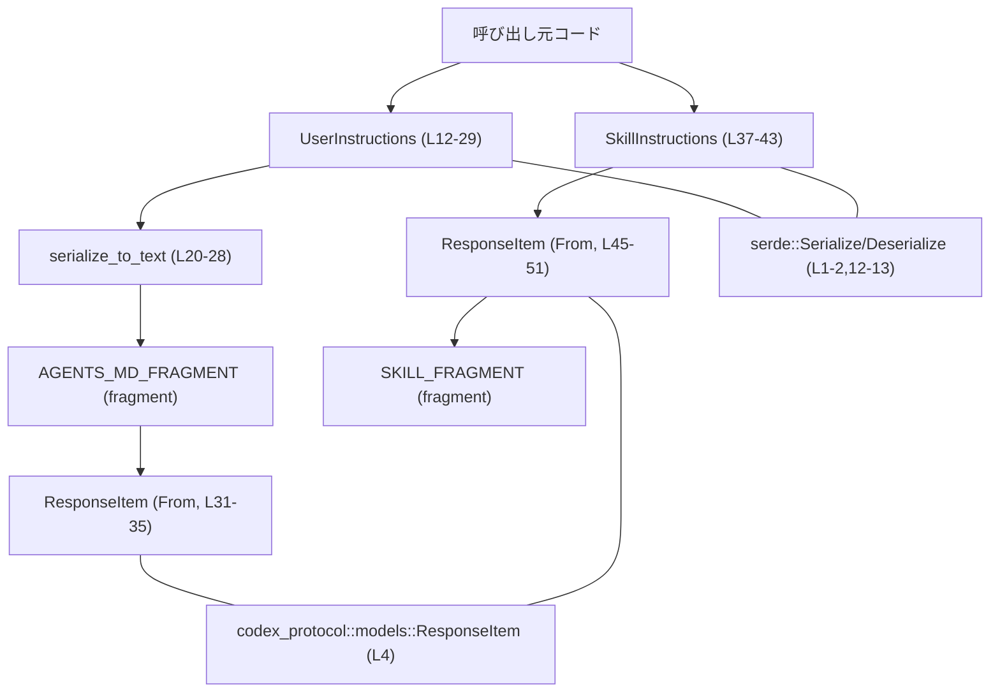
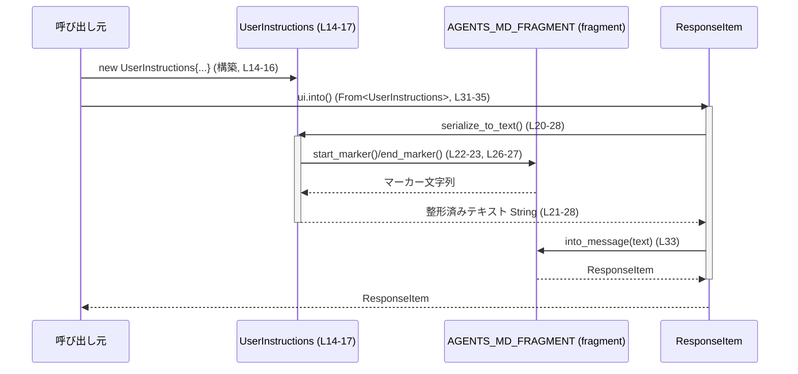

# instructions/src/user_instructions.rs コード解説

## 0. ざっくり一言

`UserInstructions` / `SkillInstructions` という 2 種類の指示データを構造体として表現し、それらを特定のマーカー付きテキストに整形し、`ResponseItem` に変換するためのモジュールです（すべて安全な Rust で記述されています）[user_instructions.rs:L10-51]。

---

## 1. このモジュールの役割

### 1.1 概要

- このモジュールは、「ユーザー向け指示」と「スキルに関する指示」を構造体として保持し、プロトコル仕様に沿ったテキスト形式に変換する役割を持ちます[ユーザー用: L12-29, スキル用: L37-51]。
- 変換結果は `codex_protocol::models::ResponseItem` 型にラップされ、外部とのインターフェイスとして利用されます[ユーザー用 `From` 実装: L31-35, スキル用: L45-51]。
- シリアライズ／デシリアライズのために `serde` を利用し、JSON 等の他形式との変換にも対応できる構造になっています[L12-13, L37-38]。

### 1.2 アーキテクチャ内での位置づけ

このモジュールが依存する主なコンポーネントと、データの流れを示します。



- `UserInstructions` / `SkillInstructions` はアプリケーション内のドメインデータ。
- `AGENTS_MD_FRAGMENT` / `SKILL_FRAGMENT`（`crate::fragment`）が、マーカーやタグ付きテキストの扱いを抽象化していることが読み取れます[呼び出し: L22-27, L47-50]。
- `ResponseItem` は外部プロトコル側のデータモデルと考えられますが、詳細はこのチャンクには現れません[L4]。

### 1.3 設計上のポイント

コードから読み取れる設計上の特徴は次のとおりです。

- **データとフォーマットの分離**  
  - 構造体は純粋にデータ（文字列）を保持し[UserInstructions: L14-16, SkillInstructions: L39-42]、フォーマットはメソッドや `From` 実装側で行います[L20-28, L31-35, L45-51]。
- **共通インターフェイスとしての `From<T> for ResponseItem`**  
  - 両方の構造体から `ResponseItem` への `From` 実装を提供することで、`into()` による一貫した変換が可能な設計になっています[L31-35, L45-51]。
- **serde によるシリアライズ互換性**  
  - `Serialize` / `Deserialize` 派生と `#[serde(rename = ...)]` により、外部形式からの変換時のフィールド名／ルート名を安定させています[L12-13, L37-38]。
- **安全性と並行性**  
  - `unsafe` コードは存在せず、操作はすべて文字列生成のみです。
  - フィールドはすべて `String` であり[UserInstructions: L14-16, SkillInstructions: L39-42]、標準ライブラリのルールにより `UserInstructions` / `SkillInstructions` は `Send` / `Sync` 自動実装が成立します（`ResponseItem` や fragment の自動実装状況はこのチャンクからは不明です）。
- **公開定数によるマーカー共有**  
  - `USER_INSTRUCTIONS_PREFIX` は `AGENTS_MD_START_MARKER` の別名として公開されており[L6-7, L10]、外部コードが生テキストからユーザー指示ブロックの開始を判定する用途が想定されます（用途自体はこのチャンクには現れません）。

---

## 2. 主要な機能一覧

このモジュールが提供する主な機能は次のとおりです。

- ユーザー指示の表現: `UserInstructions` 構造体でディレクトリとテキストを保持する[user_instructions.rs:L14-16]。
- ユーザー指示のテキスト化: `UserInstructions::serialize_to_text` により、マーカー付きテキストへ整形する[L20-28]。
- ユーザー指示から `ResponseItem` への変換: `impl From<UserInstructions> for ResponseItem` により、プロトコル用メッセージに変換する[L31-35]。
- スキル指示の表現: `SkillInstructions` 構造体で名前・パス・内容を保持する[L39-42]。
- スキル指示から `ResponseItem` への変換: `impl From<SkillInstructions> for ResponseItem` により、スキル情報を含むメッセージに変換する[L45-51]。
- 指示ブロック開始マーカーの公開: `USER_INSTRUCTIONS_PREFIX` を通じて、ユーザー指示ブロックの先頭文字列を外部に提供する[L10]。

---

## 3. 公開 API と詳細解説

### 3.1 コンポーネント一覧（構造体・定数など）

このチャンクに現れる主要コンポーネントの一覧です。

| 名前 | 種別 | 役割 / 用途 | 定義位置 |
|------|------|-------------|----------|
| `USER_INSTRUCTIONS_PREFIX` | `pub const &str` | ユーザー指示ブロックの開始マーカー文字列を外部に公開する。`AGENTS_MD_START_MARKER` の別名。 | `user_instructions.rs:L10` |
| `UserInstructions` | 構造体 | ユーザー指示を表す。ディレクトリと自由形式テキストを保持する。 | `user_instructions.rs:L14-17` |
| `SkillInstructions` | 構造体 | スキルに関する指示を表す。スキル名・パス・内容を保持する。 | `user_instructions.rs:L39-43` |
| `tests` | モジュール（テスト用） | このモジュールのテストを `user_instructions_tests.rs` に委譲する。中身はこのチャンクには現れない。 | `user_instructions.rs:L54-56` |

関連するトレイト実装:

| 実装 | 対象型 | 役割 / 用途 | 定義位置 |
|------|--------|-------------|----------|
| `Debug`, `Clone`, `Serialize`, `Deserialize`, `PartialEq` | `UserInstructions` | デバッグ表示、複製、シリアライズ／デシリアライズ、同値比較を可能にする派生。 | `user_instructions.rs:L12-13` |
| `Debug`, `Clone`, `Serialize`, `Deserialize`, `PartialEq` | `SkillInstructions` | 同上。 | `user_instructions.rs:L37-38` |
| `From<UserInstructions> for ResponseItem` | `ResponseItem` | `UserInstructions` から `ResponseItem` への変換。`into()` で利用可能。 | `user_instructions.rs:L31-35` |
| `From<SkillInstructions> for ResponseItem` | `ResponseItem` | `SkillInstructions` から `ResponseItem` への変換。 | `user_instructions.rs:L45-51` |

### 3.2 関数詳細

このモジュールに実装されている公開インターフェイス上重要な関数／メソッドは 3 つです。

---

#### `UserInstructions::serialize_to_text(&self) -> String`

**概要**

- `UserInstructions` を、特定の開始マーカー／終了マーカーに囲まれたテキスト形式に整形します[L20-28]。
- 生成される形式は次のような構造です（具体的な値は例）:

  ```text
  <AGENTS_MD_START_MARKER><directory>

  <INSTRUCTIONS>
  <text>
  <AGENTS_MD_END_MARKER>
  ```

  （実際のマーカー文字列は `AGENTS_MD_FRAGMENT.start_marker()` / `end_marker()` の返すものです[L22-23, L26]。）

**引数**

| 引数名 | 型 | 説明 |
|--------|----|------|
| `&self` | `&UserInstructions` | ディレクトリとテキストを含む `UserInstructions` への参照です[L20]. 所有権は移動せず、呼び出し後も再利用可能です。 |

**戻り値**

- `String`  
  - マーカー・ディレクトリ行・`<INSTRUCTIONS>` 行・内容・終了マーカーを連結した新しい文字列です[L21-27]。
  - 元の `self.directory` / `self.text` は変更されません。

**内部処理の流れ**

1. `AGENTS_MD_FRAGMENT.start_marker()` を呼び出して開始マーカー文字列を取得します[L22-23]。
2. `AGENTS_MD_FRAGMENT.end_marker()` を呼び出して終了マーカー文字列を取得します[L26-27]。
3. `format!` マクロで、以下の形式の文字列を構築します[L21-27]。
   - `{prefix}{directory}\n\n<INSTRUCTIONS>\n{contents}\n{suffix}`
   - `prefix` に開始マーカー、`directory` に `self.directory`、`contents` に `self.text`、`suffix` に終了マーカーを埋め込みます[L22-26]。
4. 生成された `String` を返します[L28]。

**Examples（使用例）**

ユーザー指示をテキスト化する基本的な例です。

```rust
use codex_protocol::models::ResponseItem;                      // ResponseItem 型をインポート（L4）
use crate::user_instructions::UserInstructions;               // 同一クレート内の UserInstructions をインポート

fn build_instructions() -> String {                            // テキスト化された指示を返す関数を定義
    let ui = UserInstructions {                                // UserInstructions のインスタンスを作成（L14-16）
        directory: "src/agent".to_string(),                    // directory フィールドに任意のディレクトリ文字列をセット
        text: "Follow the coding guidelines.".to_string(),     // text フィールドに指示内容をセット
    };

    let text_block = ui.serialize_to_text();                   // マーカー付きテキストに変換（L20-28）

    text_block                                                 // 生成したテキストを呼び出し元へ返す
}
```

**Errors / Panics**

- このメソッド内で明示的に `Result` を返す処理や `panic!` 呼び出しはありません[L20-28]。
- 使用している `format!` マクロは、ここでは固定のフォーマット文字列と `{}` プレースホルダのみを用いているため、フォーマットの失敗によるパニックは通常発生しません[L21-27]。
- 事実上の失敗要因は、メモリ不足などランタイム環境依存の要因に限られます（Rust / 標準ライブラリの一般的挙動）。

**Edge cases（エッジケース）**

- `self.directory` が空文字列の場合  
  - 出力先頭は `{prefix}` の直後に何もない状態になります（例: `<marker>\n\n<INSTRUCTIONS>...`）[L21-25]。
- `self.text` が空文字列の場合  
  - `<INSTRUCTIONS>` の直後の行が空行になり、その後に `suffix` が続きます[L21-27]。
- `self.text` に改行や `<INSTRUCTIONS>`、マーカーと同じ文字列などが含まれている場合  
  - そのまま埋め込まれるため、下流処理（パーサ等）がどのように解釈するかは、このチャンクからは分かりません。
- `directory` / `text` に非常に長い文字列を渡した場合  
  - それに比例した長さの `String` が生成されます。特別な制限チェックは行っていません[L20-28]。

**使用上の注意点**

- このメソッドは `&self` を受け取るため、同じ `UserInstructions` インスタンスから何度でも呼び出せます[L20]。
- 埋め込まれるのは生のテキストであり、HTML/XML エスケープやタグのサニタイズ等は行っていません[L21-27]。  
  - 下流でマークアップ的に解釈される場合、意図しない構造になる可能性があります（具体的挙動は不明）。
- `AGENTS_MD_FRAGMENT` の開始／終了マーカー仕様に依存しているため、fragment 側の仕様変更があると生成フォーマットも変わります[L22-23, L26-27]。

---

#### `impl From<UserInstructions> for ResponseItem::from(ui: UserInstructions) -> ResponseItem`

**概要**

- `UserInstructions` を `ResponseItem` に変換します[L31-35]。
- 変換時に `serialize_to_text` を呼び出し、テキストブロックを `AGENTS_MD_FRAGMENT.into_message` で `ResponseItem` にラップします[L32-34]。

**引数**

| 引数名 | 型 | 説明 |
|--------|----|------|
| `ui` | `UserInstructions` | 変換対象のユーザー指示。所有権をムーブして受け取ります[L32]。変換後は `ui` を再利用できません。 |

**戻り値**

- `ResponseItem`  
  - `AGENTS_MD_FRAGMENT.into_message(ui.serialize_to_text())` の戻り値です[L33]。
  - `serialize_to_text` により生成された文字列を、プロトコル用のメッセージ型に変換したものです。

**内部処理の流れ**

1. 引数 `ui` の `serialize_to_text()` を呼び出し、マーカー付きテキストを生成します[L33]。
2. その文字列を `AGENTS_MD_FRAGMENT.into_message(...)` に渡します[L33]。
3. `into_message` の戻り値である `ResponseItem` を返します[L33-34]。

**Examples（使用例）**

`into()` を使って自然な形で `ResponseItem` に変換する例です。

```rust
use codex_protocol::models::ResponseItem;                      // ResponseItem 型をインポート（L4）
use crate::user_instructions::UserInstructions;               // UserInstructions 型をインポート

fn build_response_item() -> ResponseItem {                     // ResponseItem を返す関数を定義
    let ui = UserInstructions {                                // UserInstructions を生成（L14-16）
        directory: "src/agent".to_string(),                    // ディレクトリ文字列
        text: "Follow the coding guidelines.".to_string(),     // 指示本文
    };

    let response: ResponseItem = ui.into();                    // From<UserInstructions> 実装により ResponseItem へ変換（L31-35）

    response                                                   // 変換された ResponseItem を返す
}
```

**Errors / Panics**

- この `from` 実装内に `Result` や `panic!` は存在しません[L32-34]。
- `serialize_to_text` と `AGENTS_MD_FRAGMENT.into_message` の双方が成功する前提で記述されています[L33]。
- `AGENTS_MD_FRAGMENT.into_message` の内部挙動（エラー条件やパニック可能性）は、このチャンクには現れません。

**Edge cases（エッジケース）**

- `UserInstructions` のフィールドが空／長大などであっても、特別なチェックは行わず、そのまま `ResponseItem` に変換します[L32-34]。
- `ui` はムーブされるため、変換後に元の変数を再度使用しようとするとコンパイルエラーになります（Rust の所有権ルールによる安全性）。

**使用上の注意点**

- この `From` 実装により、`ResponseItem::from(ui)` だけでなく、`let ri: ResponseItem = ui.into();` という書き方も可能です（Rust 一般仕様）。
- `AGENTS_MD_FRAGMENT` の仕様に依存するため、fragment 側のフォーマットやメタデータの追加／変更の影響を受けます[L33]。
- 変換処理は純粋関数的で、副作用（I/O 等）はありません。

---

#### `impl From<SkillInstructions> for ResponseItem::from(si: SkillInstructions) -> ResponseItem`

**概要**

- `SkillInstructions` を `ResponseItem` に変換します[L45-51]。
- スキル名・パス・内容を 1 つのテキストに整形し、それを `SKILL_FRAGMENT.wrap` でラップしてから `SKILL_FRAGMENT.into_message` に渡します[L47-50]。

**引数**

| 引数名 | 型 | 説明 |
|--------|----|------|
| `si` | `SkillInstructions` | 変換対象のスキル指示。所有権をムーブして受け取ります[L46]。 |

**戻り値**

- `ResponseItem`  
  - `SKILL_FRAGMENT.into_message(SKILL_FRAGMENT.wrap(format!(...)))` の戻り値です[L47-50]。
  - スキルに関するメタ情報を含んだメッセージと考えられますが、`ResponseItem` の具体的フィールド構造は不明です。

**内部処理の流れ**

1. `format!` マクロで、次のようなテキストを生成します[L47-50]。

   ```text
   <name>{si.name}</name>
   <path>{si.path}</path>
   {si.contents}
   ```

2. その文字列を `SKILL_FRAGMENT.wrap(...)` に渡し、fragment 固有のラッピングを行います[L47-50]。
3. `SKILL_FRAGMENT.into_message(...)` により `ResponseItem` に変換します[L47-50]。
4. 変換結果を返します[L47-50]。

**Examples（使用例）**

スキル定義を `ResponseItem` に変換する例です。

```rust
use codex_protocol::models::ResponseItem;                      // ResponseItem 型をインポート（L4）
use crate::user_instructions::SkillInstructions;              // SkillInstructions 型をインポート

fn build_skill_response() -> ResponseItem {                    // スキル用 ResponseItem を返す関数を定義
    let si = SkillInstructions {                               // SkillInstructions を生成（L39-42）
        name: "search_docs".to_string(),                       // スキル名
        path: "skills/search_docs.rs".to_string(),             // スキルのパス
        contents: "Search the documentation for relevant info".to_string(), // スキルの説明や中身
    };

    let response: ResponseItem = si.into();                    // From<SkillInstructions> 実装による変換（L45-51）

    response                                                   // 結果を返す
}
```

**Errors / Panics**

- この実装内にエラーハンドリングや `panic!` はありません[L46-50]。
- `format!`、`SKILL_FRAGMENT.wrap`、`SKILL_FRAGMENT.into_message` が失敗しない前提で書かれています[L47-50]。
- `SKILL_FRAGMENT` の内部エラー条件やパニック可能性は、このチャンクには記述されていません。

**Edge cases（エッジケース）**

- `name` / `path` / `contents` のいずれかが空文字列でも、そのままタグ内／本文として出力されます[L47-50]。
- `name` や `path` に改行やタグ文字列（`</name>` など）が含まれている場合  
  - そのまま埋め込まれるため、タグとして解釈されるかどうかは、下流のパーサや LLM 側の挙動に依存し、このチャンクからは分かりません。
- 文字列が非常に長い場合  
  - 長さに比例した `String` が生成されます。長さ制限は行っていません[L47-50]。

**使用上の注意点**

- `SkillInstructions` のインスタンスは `into()` 呼び出し後に再利用できません（所有権が `into()` 内にムーブされるため）。
- テキストはエスケープやバリデーションなくタグの中に埋め込まれるため、下流で XML/HTML ライクにパースする場合は特に注意が必要です[L47-50]。
- `SKILL_FRAGMENT` の仕様変更（ラッピング形式など）は、そのまま生成される `ResponseItem` の内容に影響します。

---

### 3.3 その他の関数

このチャンクには、補助的な関数やラッパー関数は存在しません。  
`AGENTS_MD_FRAGMENT` / `SKILL_FRAGMENT` のメソッド（`start_marker`, `end_marker`, `wrap`, `into_message`）は外部モジュール側の実装であり、このファイル内には定義が現れません[L22-23, L26-27, L33, L47-50]。

---

## 4. データフロー

ここでは、`UserInstructions` と `SkillInstructions` が `ResponseItem` に変換される典型的な流れを示します。

### 4.1 ユーザー指示 → ResponseItem のフロー

1. 呼び出し元が `UserInstructions` を構築します[L14-16]。
2. `ui.into()` または `ResponseItem::from(ui)` を呼び出します[L31-35]。
3. `from` 実装内で `ui.serialize_to_text()` が呼ばれ、テキストブロックが生成されます[L33]。
4. 生成されたテキストが `AGENTS_MD_FRAGMENT.into_message(...)` に渡され、`ResponseItem` になります[L33]。



### 4.2 スキル指示 → ResponseItem のフロー（概要）

1. 呼び出し元が `SkillInstructions` を構築します[L39-42]。
2. `si.into()` を呼び出します[L45-51]。
3. `from` 実装内で `format!` により `<name>...` `<path>...` と内容をまとめた文字列を生成します[L47-50]。
4. その文字列を `SKILL_FRAGMENT.wrap` でラップし、`SKILL_FRAGMENT.into_message` で `ResponseItem` に変換します[L47-50]。

---

## 5. 使い方（How to Use）

### 5.1 基本的な使用方法

#### ユーザー指示を ResponseItem に変換する

```rust
use codex_protocol::models::ResponseItem;                      // ResponseItem 型をインポート（L4）
use crate::user_instructions::UserInstructions;               // 同一クレート内の UserInstructions をインポート

fn build_user_instructions_response() -> ResponseItem {        // ユーザー指示用 ResponseItem を返す関数
    let ui = UserInstructions {                                // UserInstructions の構築（L14-16）
        directory: "src/agent".to_string(),                    // 対象ディレクトリを指定
        text: "Please review the code in this directory.".to_string(), // ユーザー向け指示テキスト
    };

    let response: ResponseItem = ui.into();                    // From<UserInstructions> 実装で ResponseItem に変換（L31-35）

    response                                                   // 生成した ResponseItem を返す
}
```

#### スキル指示を ResponseItem に変換する

```rust
use codex_protocol::models::ResponseItem;                      // ResponseItem 型をインポート（L4）
use crate::user_instructions::SkillInstructions;              // SkillInstructions 型をインポート

fn build_skill_instructions_response() -> ResponseItem {       // スキル指示用 ResponseItem を返す関数
    let si = SkillInstructions {                               // SkillInstructions の構築（L39-42）
        name: "search_docs".to_string(),                       // スキル名
        path: "skills/search_docs.rs".to_string(),             // スキル実装のパス
        contents: "Search the documentation for APIs.".to_string(), // スキルの説明や内容
    };

    let response: ResponseItem = si.into();                    // From<SkillInstructions> 実装で ResponseItem に変換（L45-51）

    response                                                   // 生成した ResponseItem を返す
}
```

### 5.2 よくある使用パターン

1. **テキストブロックだけが必要な場合**  
   `ResponseItem` ではなく、生のマーカー付きテキストを利用したい場合は `serialize_to_text` を直接呼び出します[L20-28]。

   ```rust
   use crate::user_instructions::UserInstructions;            // UserInstructions をインポート

   fn as_text() -> String {                                    // テキストを返す関数
       let ui = UserInstructions {
           directory: "src/agent".to_string(),
           text: "Only need raw text block.".to_string(),
       };

       ui.serialize_to_text()                                  // ResponseItem を介さずテキストを取得（L20-28）
   }
   ```

2. **テキストからの検索用にプレフィックスを利用する**  
   生テキストの中でユーザー指示ブロックを検出するために `USER_INSTRUCTIONS_PREFIX` を使うことが想定されます。

   ```rust
   use crate::user_instructions::USER_INSTRUCTIONS_PREFIX;     // プレフィックス定数をインポート（L10）

   fn contains_instructions_block(text: &str) -> bool {        // テキストに指示ブロックが含まれるかをチェックする
       text.contains(USER_INSTRUCTIONS_PREFIX)                  // プレフィックス文字列の有無で判定
   }
   ```

   ※ `USER_INSTRUCTIONS_PREFIX` の値は `AGENTS_MD_START_MARKER` に等しく、このチャンクではその中身は定義されていません[L6-7, L10]。

### 5.3 よくある間違い

```rust
use crate::user_instructions::UserInstructions;

// 間違い例: ui を into() で消費した後に再度使用しようとしている
fn wrong_usage() {
    let ui = UserInstructions {
        directory: "src/agent".to_string(),
        text: "text".to_string(),
    };

    let _ri = ui.into();                // ここで ui の所有権はムーブされる（L31-35）

    // println!("{:?}", ui);           // コンパイルエラー: ui は move 済みで使用できない
}

// 正しい例: 必要なら clone する、または &self を受けるメソッドを利用する
fn correct_usage() {
    let ui = UserInstructions {
        directory: "src/agent".to_string(),
        text: "text".to_string(),
    };

    let text_block = ui.serialize_to_text(); // &self を使うので ui は消費されない（L20）
    let _ri = ui.into();                     // ここで初めて所有権を移動する（L31-35）
    // この後 ui は使用できないが、text_block は利用可能
}
```

### 5.4 使用上の注意点（まとめ）

- **所有権とライフタイム**
  - `serialize_to_text` は `&self` を取るため、何度でも呼び出せます[L20]。
  - `From<T> for ResponseItem` は `T` を値で受け取るため、`into()` 呼び出し後に元の値は使用できません[L32, L46]。
- **安全性**
  - このモジュール内には `unsafe` ブロックがなく、すべて安全な Rust で実装されています。
- **エラー／例外**
  - いずれの関数も `Result` を返さず、エラーハンドリングは行っていません[L20-28, L31-35, L45-51]。
  - 実質的な失敗要因はメモリ不足などランタイム依存です（一般的な Rust の挙動）。
- **テキスト内容の扱い**
  - フィールドはすべてエスケープされずにそのままフォーマット文字列に埋め込まれます[L21-27, L47-50]。
  - タグや特別なマーカーを含む文字列を渡すと、下流のパーサに影響する可能性があります。
- **並行性**
  - 構造体は単に `String` を保持しているだけであり[L14-16, L39-42]、外部の共有可変状態へのアクセスはありません。
  - そのため、標準的な Rust の自動実装により、`UserInstructions` / `SkillInstructions` はスレッド間で安全にムーブ／共有できます（ただし `ResponseItem` や fragment が `Send` / `Sync` かどうかは不明です）。

---

## 6. 変更の仕方（How to Modify）

### 6.1 新しい機能を追加する場合

例: 新しい種類の指示 `ProjectInstructions` を追加したい場合。

1. **構造体の追加**
   - `UserInstructions` / `SkillInstructions` と同様に、新しい構造体をこのファイルに追加します（`Debug`, `Clone`, `Serialize`, `Deserialize`, `PartialEq` を派生するかどうかを決める）[パターンは L12-17, L37-43 を参照]。
2. **`From<ProjectInstructions> for ResponseItem` の実装**
   - 他の `From` 実装を参考に、`ResponseItem` への変換ロジックを追加します[L31-35, L45-51]。
   - 必要なら新しい fragment（例: `PROJECT_FRAGMENT`）を `crate::fragment` から利用します[fragment 利用パターン: L22-23, L26-27, L33, L47-50]。
3. **テストの追加**
   - `user_instructions_tests.rs` 側に新構造体と `From` 実装に対するテストを追加します（テスト内容自体はこのチャンクには記述されていませんが、テストモジュールが存在します[L54-56]）。

### 6.2 既存の機能を変更する場合

1. **フォーマット仕様の変更**
   - 例: `<INSTRUCTIONS>` タグ名を変えたい場合は、`serialize_to_text` のフォーマット文字列を変更します[L21-23]。
   - これにより、既存テキストとの互換性や下流パーサへの影響が出る可能性があるため、使用箇所をすべて洗い出す必要があります（このチャンクには使用箇所は現れません）。
2. **フィールドの追加・削除**
   - `UserInstructions` / `SkillInstructions` にフィールドを追加する場合は、そのフィールドを利用するフォーマット処理も更新します[L21-27, L47-50]。
   - serde を利用しているため、外部フォーマットとの互換性が変わる点にも注意します[L12-13, L37-38]。
3. **契約の維持**
   - `From<T> for ResponseItem` が返す `ResponseItem` の意味やフォーマットは、外部コードとの契約となる可能性があります。
   - フォーマット変更の前に、`ResponseItem` を消費している箇所を確認することが重要です（このチャンクには現れません）。

---

## 7. 関連ファイル

このモジュールと密接に関連するファイル／モジュールは次のとおりです。

| パス / モジュール | 役割 / 関係 |
|-------------------|------------|
| `crate::fragment` | `AGENTS_MD_FRAGMENT`, `AGENTS_MD_START_MARKER`, `SKILL_FRAGMENT` を定義しているモジュールです。開始／終了マーカーや `wrap` / `into_message` の仕様を提供し、本モジュールのフォーマットや `ResponseItem` 変換に直接影響します[L6-8, L22-23, L26-27, L33, L47-50]。実体のコードはこのチャンクには現れません。 |
| `codex_protocol::models::ResponseItem` | 指示を外部プロトコル用メッセージに変換した結果の型です[L4, L31-35, L45-51]。この型の構造や用途は、このチャンクには現れません。 |
| `instructions/src/user_instructions_tests.rs` | `#[cfg(test)]` で参照されるテストモジュールです[L54-56]。このファイル内で、`UserInstructions` / `SkillInstructions` およびその `From` 実装に対するテストが行われていると推測されますが、具体的なテスト内容はこのチャンクには現れません。 |

このモジュールだけでは fragment や `ResponseItem` の詳細は分からないため、それらの仕様を確認する際は上記関連ファイル／クレートを参照する必要があります。
