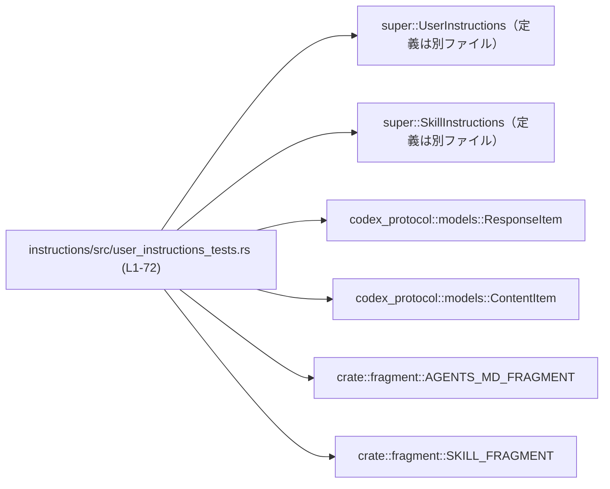
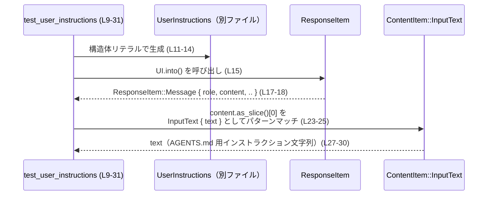

# instructions/src/user_instructions_tests.rs コード解説

## 0. ざっくり一言

`UserInstructions` / `SkillInstructions` の `Into<ResponseItem>` 実装と、`AGENTS_MD_FRAGMENT` / `SKILL_FRAGMENT` によるテキストマッチング仕様を検証するためのテスト群です。  
ユーザー向け指示テキストが正しいタグ付きフォーマットで生成されることを確認します。

---

## 1. このモジュールの役割

### 1.1 概要

- このテストモジュールは、ユーザー指示 (`UserInstructions`) とスキル指示 (`SkillInstructions`) が、プロトコル型 `ResponseItem` / `ContentItem` に正しく変換されることを検証します（`instructions/src/user_instructions_tests.rs:L9-31`, `L41-64`）。
- 併せて、生成されるテキストが `AGENTS_MD_FRAGMENT` / `SKILL_FRAGMENT` によって期待どおり認識される（マッチする／しない）ことを確認します（`L33-39`, `L66-71`）。

### 1.2 アーキテクチャ内での位置づけ

このファイルはテスト専用であり、次のコンポーネントに依存しています。

- プロダクション側モジュール（`super::*` 経由）  
  - `UserInstructions`
  - `SkillInstructions`
- 外部クレート `codex_protocol::models`  
  - `ResponseItem`
  - `ContentItem`
- フラグメント定義 `crate::fragment`  
  - `AGENTS_MD_FRAGMENT`
  - `SKILL_FRAGMENT`

依存関係を簡略図で示すと次のようになります。



### 1.3 設計上のポイント

- **責務の分離**  
  - 変換ロジックそのものは別モジュール（`super::*`）にあり、このファイルは「**期待されるテキストフォーマット**」だけを明示するテスト層になっています（`L11-15`, `L43-48`）。
- **パターンマッチによる検証**  
  - `ResponseItem::Message { role, content, .. }` という列挙体バリアントへのパターンマッチと、`[ContentItem::InputText { text }]` というスライスパターンを使い、構造と中身を同時に検証しています（`L17-25`, `L50-57`）。
- **フラグメントの挙動保証**  
  - `matches_text` に対して **マッチする場合／しない場合** の両方をテストし、誤検知（false positive）を防ぐ契約をテストで表現しています（`L35-38`, `L68-71`）。
- **エラーハンドリング方針（テスト内）**  
  - 想定外のバリアントやコンテンツ数に対しては `panic!` を使用し、テスト失敗として扱っています（`L18-19`, `L24-25`, `L51-52`, `L57-58`）。
- **並行性**  
  - このファイルにはグローバルな可変状態や `unsafe` ブロックはなく、単純な同期テストのみで構成されています。

---

## 2. 主要な機能一覧（コンポーネントインベントリー）

### 2.1 このファイルで定義される関数（テスト）

| 名前 | 種別 | 役割 / 用途 | 定義位置 |
|------|------|-------------|----------|
| `test_user_instructions` | テスト関数 | `UserInstructions` を `ResponseItem::Message` に変換した結果の `role` と `ContentItem::InputText` の `text` が期待どおりか検証する | `instructions/src/user_instructions_tests.rs:L9-31` |
| `test_is_user_instructions` | テスト関数 | `AGENTS_MD_FRAGMENT` が、AGENTS 用インストラクション文字列にはマッチし、素の `"test_text"` にはマッチしないことを検証する | `instructions/src/user_instructions_tests.rs:L33-39` |
| `test_skill_instructions` | テスト関数 | `SkillInstructions` を `ResponseItem::Message` に変換した結果が、期待される `<skill>...</skill>` 形式のテキストになることを検証する | `instructions/src/user_instructions_tests.rs:L41-64` |
| `test_is_skill_instructions` | テスト関数 | `SKILL_FRAGMENT` が、`<skill>` 形式のテキストにはマッチし、 `"regular text"` にはマッチしないことを検証する | `instructions/src/user_instructions_tests.rs:L66-71` |

### 2.2 参照される外部コンポーネント

このチャンクには定義がなく、参照のみされるコンポーネントの一覧です。

| 名前 | 種別（推定を含む） | 由来 | 役割 / 用途 | 参照位置 |
|------|-------------------|------|-------------|----------|
| `UserInstructions` | 構造体 | `super::*` | `directory: String` と `text: String` を持つユーザー指示オブジェクト。`Into<ResponseItem>` 実装がある（`user_instructions.into()`） | `L11-15` |
| `SkillInstructions` | 構造体 | `super::*` | `name`, `path`, `contents` を持つスキル指示オブジェクト。`Into<ResponseItem>` 実装がある | `L43-48` |
| `ResponseItem` | 列挙体 | `codex_protocol::models` | レスポンスを表す列挙体。`Message { role, content, .. }` バリアントが存在する | `L3`, `L15`, `L17-18`, `L48`, `L50-51` |
| `ContentItem` | 列挙体 | `codex_protocol::models` | メッセージのコンテンツ要素。`InputText { text }` バリアントが存在する | `L2`, `L23-24`, `L56-57` |
| `AGENTS_MD_FRAGMENT` | 不明（このチャンクには型定義なし） | `crate::fragment` | `matches_text(&str) -> bool` を持つ何らかの値。AGENTS 用インストラクション文字列のパターンマッチに使用される | `L6`, `L35-38` |
| `SKILL_FRAGMENT` | 不明（このチャンクには型定義なし） | `crate::fragment` | `matches_text(&str) -> bool` を持つ何らかの値。`<skill>` 形式テキストのパターンマッチに使用される | `L7`, `L68-71` |

> `AGENTS_MD_FRAGMENT` / `SKILL_FRAGMENT` の具体的な型や内部構造は、このチャンクには現れません。

---

## 3. 公開 API と詳細解説

このファイル自体はテストモジュールであり、プロダクションコード向けの公開 API は定義していません。  
ただし、**プロダクション API の利用方法を具体的に示すサンプル**として有用です。

### 3.1 型一覧（このファイルから読み取れる範囲）

| 名前 | 種別 | フィールド / バリアント（このチャンクから読み取れる範囲） | 役割 / 用途 | 根拠 |
|------|------|-----------------------------------------------|-------------|------|
| `UserInstructions` | 構造体 | `directory: String`, `text: String` | ユーザー向け AGENTS.md インストラクションの情報を保持する | 構造体リテラルから（`L11-14`） |
| `SkillInstructions` | 構造体 | `name: String`, `path: String`, `contents: String` | SKILL.md ベースのスキルインストラクション情報を保持する | 構造体リテラルから（`L43-47`） |
| `ResponseItem` | 列挙体 | `Message { role, content, .. }` バリアント | 役割（role）とコンテンツ（content）を持つメッセージレスポンスを表現する | パターンマッチから（`L17-18`, `L50-51`） |
| `ContentItem` | 列挙体 | `InputText { text }` バリアント | テキスト入力コンテンツを保持する | パターンマッチから（`L23-24`, `L56-57`） |

### 3.2 関数詳細

以下では、重要なテスト関数 4 つについて、関数テンプレートに沿って説明します。

---

#### `test_user_instructions()`

**概要**

- `UserInstructions` を `ResponseItem::Message` に変換した際に、
  - `role` が `"user"` であること
  - `content` が 1 要素の `ContentItem::InputText` であり、その `text` が AGENTS 用インストラクションフォーマットに一致すること  
  を検証します（`instructions/src/user_instructions_tests.rs:L9-31`）。

**引数**

- なし（標準的な `#[test]` 関数です）。

**戻り値**

- 戻り値は `()` であり、テスト成功／失敗は `panic!` / `assert_eq!` により表されます。

**内部処理の流れ**

1. `UserInstructions` のインスタンスを作成する（`directory`, `text` フィールドを設定）（`L11-14`）。
2. `user_instructions.into()` により `ResponseItem` へ変換する（`L15`）。
3. 変換結果が `ResponseItem::Message { role, content, .. }` バリアントであることをパターンマッチし、そうでなければ `panic!` する（`L17-19`）。
4. `role` が `"user"` であることを `assert_eq!` で検証する（`L21`）。
5. `content.as_slice()` を 1 要素スライスとしてパターンマッチし、唯一の要素が `ContentItem::InputText { text }` であることを検証する（`L23-25`）。
6. 抽出した `text` が、期待する AGENTS.md インストラクションフォーマット文字列と一致することを `assert_eq!` で検証する（`L27-30`）。

**Examples（使用例）**

テスト関数自体が、`UserInstructions` の典型的な使用例になっています。  
コアとなる部分のみを抜き出すと次のようになります。

```rust
// UserInstructions を構築する
let user_instructions = UserInstructions {
    directory: "test_directory".to_string(), // 対象ディレクトリ名
    text: "test_text".to_string(),           // 指示本文
};

// ResponseItem へ変換する（Into<ResponseItem> 実装を利用）
let response_item: ResponseItem = user_instructions.into();

// 必要に応じて ResponseItem をパターンマッチで扱う
if let ResponseItem::Message { role, content, .. } = response_item {
    // role は "user" を想定
    assert_eq!(role, "user");
    // content[0] は InputText を想定
    if let [ContentItem::InputText { text }] = content.as_slice() {
        println!("instructions text: {text}");
    }
}
```

**Errors / Panics**

このテスト関数内では次の場合に `panic!` または `assert` 失敗が発生します。

- `ResponseItem` が `Message` 以外のバリアントだった場合（`L17-19`）。
- `content` の長さが 1 でない、または先頭要素が `InputText` でない場合（`L23-25`）。
- `role` が `"user"` 以外の場合（`L21`）。
- `text` が期待する AGENTS.md 用インストラクション文字列と異なる場合（`L27-30`）。

**Edge cases（エッジケース）**

- `UserInstructions` の `directory` や `text` に別の値を指定した場合の挙動は、このテストではカバーされていません。
- 空文字列や特殊文字を含む値についても、このファイルからは挙動を読み取れません。

**使用上の注意点**

- `UserInstructions` の `Into<ResponseItem>` 実装は、**role を `"user"` に固定し、`ContentItem::InputText` 一要素として指示をエンコードする**契約を持つことが、このテストから読み取れます（`L17-25`, `L27-30`）。
- 実装を変更する際は、このテストの期待文字列と構造を更新する必要があります。

---

#### `test_is_user_instructions()`

**概要**

- AGENTS 用インストラクション文字列に対する `AGENTS_MD_FRAGMENT.matches_text` の挙動を検証します（`L33-39`）。
- 正しくフォーマットされたインストラクションにはマッチし、プレーンな `"test_text"` にはマッチしないことを確認します。

**内部処理の流れ**

1. 正しいフォーマットの AGENTS インストラクション文字列を `matches_text` に渡し、`true` を期待する（`L35-37`）。
2. `"test_text"` という素の文字列を `matches_text` に渡し、`false` を期待する（`L38`）。

**Errors / Panics**

- `matches_text` が誤った真偽値を返した場合、`assert!` によりテストは失敗します（`L35-38`）。

**Edge cases / 契約**

- このテストから読み取れる契約は次のとおりです。
  - ヘッダ行 `"# AGENTS.md instructions for <directory>"` と `"<INSTRUCTIONS>...</INSTRUCTIONS>"` タグを正しく含む文字列だけが「AGENTS インストラクション」として認識される（`L35-37`）。
  - タグやヘッダがない単なる本文だけの文字列はマッチしない（`L38`）。

---

#### `test_skill_instructions()`

**概要**

- `SkillInstructions` を `ResponseItem::Message` に変換した結果が、`<skill>` タグで囲まれた期待どおりの XML 風テキストになることを検証します（`L41-64`）。

**内部処理の流れ**

1. `SkillInstructions` インスタンスを作成する（`name`, `path`, `contents` を設定）（`L43-47`）。
2. `skill_instructions.into()` により `ResponseItem` に変換する（`L48`）。
3. 変換結果を `ResponseItem::Message { role, content, .. }` としてパターンマッチし、そうでなければ `panic!` する（`L50-52`）。
4. `role` が `"user"` であることを検証する（`L54`）。
5. `content` が 1 要素の `ContentItem::InputText { text }` であることを検証する（`L56-58`）。
6. その `text` が `<skill>`, `<name>`, `<path>` タグを含む期待文字列と一致することを `assert_eq!` で検証する（`L60-63`）。

**Examples（使用例）**

テストと同様に、スキル定義ファイルから読み取った情報を指示テキストに変換する例です。

```rust
// スキルの指示情報を構築する
let skill_instructions = SkillInstructions {
    name: "demo-skill".to_string(),                  // スキル名
    path: "skills/demo/SKILL.md".to_string(),        // SKILL.md のパス
    contents: "body".to_string(),                    // SKILL.md の本文
};

// ResponseItem へ変換する
let response_item: ResponseItem = skill_instructions.into();

// メッセージとして扱う
if let ResponseItem::Message { role, content, .. } = response_item {
    assert_eq!(role, "user");                        // role が user
    if let [ContentItem::InputText { text }] = content.as_slice() {
        println!("skill xml-like text: {text}");
    }
}
```

**Errors / Panics**

- `ResponseItem` が `Message` 以外のバリアントの場合（`L50-52`）。
- `content` が 1 要素でない、または `InputText` でない場合（`L56-58`）。
- `role` が `"user"` でない場合（`L54`）。
- `text` が期待される `<skill>` 形式文字列と一致しない場合（`L60-63`）。

**Edge cases（エッジケース）**

- 別の `name` / `path` / `contents` に対するフォーマットのされ方は、このテストからは分かりません。  
  ここでは固定文字列 `"demo-skill"`, `"skills/demo/SKILL.md"`, `"body"` だけが確認されています（`L43-47`）。

**使用上の注意点**

- `SkillInstructions` の `Into<ResponseItem>` 実装は、スキル情報を `<skill>...</skill>` 形式のテキストに変換する契約を持つことがこのテストから読み取れます（`L60-63`）。
- 実装を変更して別形式（JSON 等）にした場合、このテストは失敗するため、仕様変更時にはテストの期待値も合わせて変更する必要があります。

---

#### `test_is_skill_instructions()`

**概要**

- `<skill>` 形式テキストに対する `SKILL_FRAGMENT.matches_text` の挙動を検証し、正しいフォーマットの文字列にのみマッチすることを確認します（`L66-71`）。

**内部処理の流れ**

1. `<skill>...</skill>` で囲まれた文字列を `matches_text` に渡し、`true` を期待する（`L68-70`）。
2. `"regular text"` を渡し、`false` を期待する（`L71`）。

**Errors / Panics**

- 真偽値が期待と異なる場合、`assert!` によりテストは失敗します。

**Edge cases / 契約**

- 少なくとも、タグ `<skill>`, `<name>`, `<path>` を含む特定形式の文字列にマッチする実装であることが読み取れます（`L68-70`）。
- タグを含まない通常のテキストはマッチ対象外です（`L71`）。

### 3.3 その他の関数

- このファイルには、上記 4 つのテスト関数以外の関数やヘルパーは定義されていません。

---

## 4. データフロー

### 4.1 `UserInstructions` → `ResponseItem` → `ContentItem::InputText` のフロー

`test_user_instructions` を例に、データの流れを示します。

1. テスト関数が `UserInstructions` を構築する（`L11-14`）。
2. `Into<ResponseItem>` 実装を通じて `UserInstructions` が `ResponseItem::Message` に変換される（`L15`）。
3. `ResponseItem::Message` から `role` と `content` が取り出される（`L17-18`）。
4. `content` ベクタから `ContentItem::InputText { text }` が抽出される（`L23-25`）。
5. `text` が期待どおりの整形済みインストラクション文字列であることが検証される（`L27-30`）。

これをシーケンス図で表すと次のようになります。



`SkillInstructions` についても同じパターンで、`test_skill_instructions` 内で `<skill>` 形式の文字列が生成されるだけが異なります（`L43-48`, `L60-63`）。

---

## 5. 使い方（How to Use）

このファイルはテストですが、**`UserInstructions` / `SkillInstructions` の使い方** の参考になります。

### 5.1 基本的な使用方法

`UserInstructions` を使ってユーザー向けインストラクションを `ResponseItem` に変換する基本フローは次のとおりです（テストから抽出）。

```rust
// 1. 指示情報を構築する
let instructions = UserInstructions {
    directory: "some_dir".to_string(),  // 対象ディレクトリ
    text: "some instruction".to_string(), // 指示本文
};

// 2. プロトコル型 ResponseItem に変換する
let response: ResponseItem = instructions.into();

// 3. メッセージ内容を取り出す
if let ResponseItem::Message { role, content, .. } = response {
    assert_eq!(role, "user");           // ユーザー役として送信される
    if let [ContentItem::InputText { text }] = content.as_slice() {
        // text には AGENTS.md 用フォーマット済みの文字列が入る
        println!("{text}");
    }
}
```

同様に、`SkillInstructions` では `<skill>` 形式のテキストが生成されます。

```rust
let skill_instructions = SkillInstructions {
    name: "demo-skill".to_string(),
    path: "skills/demo/SKILL.md".to_string(),
    contents: "body".to_string(),
};

let response: ResponseItem = skill_instructions.into();
if let ResponseItem::Message { role, content, .. } = response {
    assert_eq!(role, "user");
    if let [ContentItem::InputText { text }] = content.as_slice() {
        // text には <skill> タグで囲まれた文字列が入る
        println!("{text}");
    }
}
```

### 5.2 よくある使用パターン

- **AGENTS.md インストラクションの認識**  
  `AGENTS_MD_FRAGMENT.matches_text(text)` を使い、文字列が AGENTS.md 形式かどうかを判定する（`L35-38`）。
- **SKILL.md インストラクションの認識**  
  `SKILL_FRAGMENT.matches_text(text)` を使い、文字列が `<skill>` 形式かどうかを判定する（`L68-71`）。

### 5.3 よくある間違い（推測可能な範囲）

コードから推測できる誤用例と正しい例を対比します。

```rust
// 誤り: プレーンな本文だけをフラグメントに渡してもマッチしない
let text = "test_text";
assert!(!AGENTS_MD_FRAGMENT.matches_text(text)); // L38 に対応

// 正しい例: ヘッダ行と <INSTRUCTIONS> タグを含むフォーマット済み文字列
let text = "# AGENTS.md instructions for test_directory\n\n\
            <INSTRUCTIONS>\n\
            test_text\n\
            </INSTRUCTIONS>";
assert!(AGENTS_MD_FRAGMENT.matches_text(text));  // L35-37 に対応
```

同様に、`SKILL_FRAGMENT` には `<skill>` タグを含むテキストを渡す必要があります（`L68-70`）。

### 5.4 使用上の注意点（まとめ）

- `matches_text` 系の関数は、**完全なフォーマット済み文字列** を前提としており、ヘッダやタグを省略するとマッチしません（`L35-38`, `L68-71`）。
- `UserInstructions` / `SkillInstructions` → `ResponseItem` の変換に依存しているコードは、  
  - `role == "user"`  
  - `content` が 1 要素の `InputText`  
  という前提に基づいていることに注意が必要です（`L17-25`, `L50-57`）。

---

## 6. 変更の仕方（How to Modify）

### 6.1 新しい機能を追加する場合

このファイルの範囲で追加可能な「機能」は主にテストケースです。

- 新たなインストラクション形式やバリアントを `UserInstructions` / `SkillInstructions` に追加した場合:
  - 対応する `into()` 実装を変更したら、その仕様に対応する新しいテスト関数を本ファイルに追加するのが自然です。
  - 既存の `test_user_instructions` / `test_skill_instructions` を参考に、構造体の構築 → `into()` → パターンマッチ → 期待文字列の `assert_eq!` という流れを踏襲できます。

### 6.2 既存の機能を変更する場合

- **フォーマット仕様の変更**  
  - 例えば AGENTS.md のヘッダ行や `<skill>` タグの構造を変更した場合、
    - `test_user_instructions` / `test_skill_instructions` の期待文字列（`L27-30`, `L60-63`）
    - `test_is_user_instructions` / `test_is_skill_instructions` のマッチ対象文字列（`L35-37`, `L68-70`）  
    を合わせて更新する必要があります。
- **`ResponseItem` 構造の変更**  
  - `Message` バリアントのフィールド構造が変わった場合、パターンマッチ部分（`L17-18`, `L50-51`）の更新が必要です。

変更時には、`cargo test` によりこのファイルのテストがすべて通ることを確認するのが前提になります。

---

## 7. 関連ファイル

このファイルと密接に関係するモジュール／クレートです。内容はこのチャンクには現れません。

| パス / モジュール | 役割 / 関係 |
|-------------------|------------|
| `super::UserInstructions` | ユーザー指示を表す構造体。`directory`, `text` フィールドを持ち、`Into<ResponseItem>` を実装している（`L11-15`）。 |
| `super::SkillInstructions` | スキル指示を表す構造体。`name`, `path`, `contents` フィールドを持ち、`Into<ResponseItem>` を実装している（`L43-48`）。 |
| `codex_protocol::models::ResponseItem` | レスポンスを表す列挙体。`Message { role, content, .. }` バリアントが使用されている（`L3`, `L17-18`, `L50-51`）。 |
| `codex_protocol::models::ContentItem` | メッセージコンテンツを表す列挙体。`InputText { text }` バリアントが使用されている（`L2`, `L23-24`, `L56-57`）。 |
| `crate::fragment::AGENTS_MD_FRAGMENT` | AGENTS.md インストラクション文字列にマッチするフラグメント。`matches_text(&str) -> bool` が呼び出されている（`L6`, `L35-38`）。 |
| `crate::fragment::SKILL_FRAGMENT` | `<skill>` 形式インストラクション文字列にマッチするフラグメント。`matches_text(&str) -> bool` が呼び出されている（`L7`, `L68-71`）。 |

> これら関連ファイルの具体的な実装内容や追加の公開 API は、このチャンクには含まれていないため不明です。
