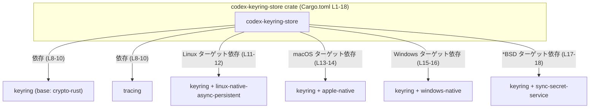
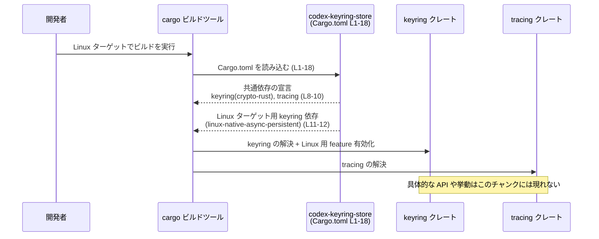

keyring-store\Cargo.toml

---

## 0. ざっくり一言

`codex-keyring-store` クレートの **Cargo マニフェスト**であり、  
ワークスペース設定と、OS ごとに異なる `keyring` クレートのバックエンド機能を有効化する依存関係を定義しています（根拠: `keyring-store\Cargo.toml:L1-5,8-18`）。

---

## 1. このモジュールの役割

### 1.1 概要

- このファイルは Rust クレート `codex-keyring-store` の **名前やバージョン設定の継承、ライセンス、リント設定**を宣言します（`[package]`, `[lints]` セクション, 根拠: L1-7）。
- また、`keyring` と `tracing` への依存を定義しつつ、ターゲット OS ごとに `keyring` の有効化する **feature セットを切り替え**ています（根拠: L8-18）。
- クレート名からは「キーリング（認証情報ストア）に関連する機能」を提供するライブラリであると推測されますが、このチャンクには実装コードが含まれておらず、公開 API の具体的な内容は不明です（事実: コード本体が未提示）。

### 1.2 アーキテクチャ内での位置づけ

- クレート `codex-keyring-store` は、ワークスペース全体の設定（バージョン・edition・license・lint）に従い（根拠: L1-7）、  
  ランタイム機能として `keyring` と `tracing` に依存するライブラリとして位置づけられています（根拠: L8-10）。
- `keyring` 依存はターゲット OS ごとに feature を切り替えることで、OS ネイティブなバックエンドを選択する構成になっています（根拠: L11-18）。

依存関係の構造を Mermeid 図で示します（Cargo.toml 全体: L1-18 に対応）。



※ `keyring` の各 feature がどのような API や挙動を提供するかは、このファイルからは分かりません。

### 1.3 設計上のポイント（Cargo レベル）

- **ワークスペース設定の継承**
  - `version.workspace = true`, `edition.workspace = true`, `license.workspace = true` により、  
    これらの値をワークスペースルートの設定から継承する構成です（根拠: L1-5）。
  - リント設定も `[lints] workspace = true` でワークスペースのポリシーに従います（根拠: L6-7）。
- **依存の一元管理**
  - `keyring` と `tracing` のバージョンも `workspace = true` によりワークスペースで一元管理されます（根拠: L8-10,11-18）。
- **ターゲット別の機能切り替え**
  - `target.'cfg(target_os = "...")'.dependencies` を用い、OS ごとに `keyring` の feature を変更しています（根拠: L11-18）。
  - これにより、ビルドターゲットが変わると有効になる `keyring` 機能も変わります。
- **状態管理やエラーハンドリング**
  - このファイル自体はビルド定義だけを記述しており、ランタイムの状態管理・エラーハンドリング・並行性制御の実装は含まれていません（事実: 関数・型定義が皆無）。

---

## 2. 主要な機能一覧（Cargo 設定として）

### 2.1 コンポーネントインベントリー（クレート／依存関係）

このチャンクに現れるコンポーネント（クレート単位）の一覧です。

| コンポーネント名                    | 種別         | 役割 / 用途（このファイルから読める範囲）                                                | 定義元 |
|-------------------------------------|--------------|-------------------------------------------------------------------------------------------|--------|
| `codex-keyring-store`               | ライブラリ？ | ワークスペースの一部として定義されるクレート。本体の役割はこのチャンクからは不明。       | `keyring-store\Cargo.toml:L1-5` |
| `keyring`                           | 依存クレート | OS ごとに異なる feature を有効化して利用される外部クレート。具体的な API は不明。        | `keyring-store\Cargo.toml:L8-9,11-12,13-14,15-16,17-18` |
| `tracing`                           | 依存クレート | ロギング / トレーシング用途と推測されるが、このファイルでは機能詳細は不明。             | `keyring-store\Cargo.toml:L8,10` |

※ `codex-keyring-store` がバイナリかライブラリかは、このチャンクだけでは判定できません（`[lib]` や `[[bin]]` セクションがないため）。

### 2.2 このファイルが提供する「機能」（設定観点）

- ワークスペース設定に従ったクレートメタデータの宣言（根拠: L1-7）。
- ランタイムで利用する `keyring` / `tracing` 依存関係の宣言（根拠: L8-10）。
- ターゲット OS ごとの `keyring` feature 切り替え（根拠: L11-18）。

アプリケーションから呼び出す公開関数やメソッドは、このファイルには出現しません。

---

## 3. 公開 API と詳細解説

### 3.1 型一覧（構造体・列挙体など）

このファイルは **Cargo マニフェスト**であり、Rust の型定義（`struct`, `enum`, `type` など）は含まれていません。

| 名前 | 種別 | 役割 / 用途 | 定義元 |
|------|------|-------------|--------|
| なし | -    | -           | -      |

### 3.2 関数詳細

このチャンクには関数・メソッド・関連関数の定義が一切含まれていないため、  
「関数詳細テンプレート」を適用できる対象はありません。

- 公開 API（`pub fn` 等）: 不明（このファイルに現れない）
- 内部関数: 不明（同上）

### 3.3 その他の関数

- 補助関数やラッパー関数も、このファイルには存在しません。

---

## 4. データフロー

### 4.1 ビルド時の依存解決フロー

実行時データフロー（どの関数が何を呼ぶか）はコードがないため不明です。  
ここでは、この Cargo マニフェストから確実に読み取れる **ビルド時の依存解決フロー**を示します。

典型的な Linux ターゲットでのビルド時シーケンス図（Cargo.toml L1-18 に基づく）:



- 実行時には `codex-keyring-store` のコード（未提示）が `keyring` / `tracing` を呼び出すと考えられますが、  
  どのような呼び出しが行われるかはこのチャンクからは判定できません（推測に留まるため記述しません）。

---

## 5. 使い方（How to Use）

このファイルは「モジュールの使い方」ではなく「**クレート設定の書き方**」に関する内容です。

### 5.1 基本的な使用方法（同様の Cargo 設定を行う場合）

同じパターンの Cargo 設定を別クレートで行う例です。  
`workspace = true` とターゲット別依存の使い方を示します。

```toml
[package]                               # パッケージメタデータセクション
name = "my-keyring-wrapper"             # クレート名
version.workspace = true                # バージョンはワークスペースから継承
edition.workspace = true                # edition もワークスペースから継承
license.workspace = true                # ライセンスもワークスペースから継承

[lints]                                 # リント設定
workspace = true                        # リントはワークスペース共通設定に従う

[dependencies]                          # 通常依存
keyring = { workspace = true }          # バージョンはワークスペース定義を使用
tracing = { workspace = true }          # 同上

[target.'cfg(target_os = "linux")'.dependencies]
keyring = { workspace = true, features = ["linux-native-async-persistent"] }

[target.'cfg(target_os = "windows")'.dependencies]
keyring = { workspace = true, features = ["windows-native"] }
```

このように、ワークスペースの依存バージョンを再利用しつつ、ターゲット別に feature を切り替えることができます。  
（本リポジトリの `keyring-store\Cargo.toml` では linux/macOS/Windows/*BSD に対して定義を行っています: L11-18）

### 5.2 よくある使用パターン（この設定から推測できる範囲）

このファイルから直接分かる使用パターンは以下のようなものです。

- **ワークスペース内の複数クレートで `keyring` / `tracing` を共有**
  - `workspace = true` により、バージョン・feature 管理をワークスペースに集約し、  
    依存関係の一貫性を保つ（根拠: L8-10,11-18）。
- **ターゲット OS ごとに最適化された keyring バックエンドを利用**
  - Linux / macOS / Windows / *BSD で異なる feature を与えているため、  
    ビルドターゲットに応じて `keyring` の実装詳細が変わる構成です（根拠: L11-18）。
  - ただし、それが実際にどの API を通じて使われるかは不明です。

### 5.3 よくある間違い（Cargo 設定観点）

このファイルから推測できる範囲で、誤用例と注意点を示します。

```toml
# 誤りの一例（仮想例）:
[target.'cfg(target_os = "linux")'.dependencies]
keyring = { version = "0.1", features = ["linux-native-async-persistent"] }
# ↑ workspace = true を外してしまうと、
#   ワークスペース全体の keyring バージョンとズレる可能性がある。

# 正しい一貫性のある例（本ファイルと同様のパターン）:
[target.'cfg(target_os = "linux")'.dependencies]
keyring = { workspace = true, features = ["linux-native-async-persistent"] }
```

- バージョンを個別に指定すると、他クレートとバージョンがずれてビルドエラーや挙動差の原因になる可能性があります。
- 本ファイルはすべて `workspace = true` を維持しているため、バージョンの一貫性が保たれます（根拠: L8-10,11-18）。

### 5.4 使用上の注意点（まとめ）

この Cargo 設定を前提とした注意点を、分かる範囲で整理します。

- **前提条件**
  - ワークスペースルートで `keyring` と `tracing` の依存が定義されている必要があります（`workspace = true` 参照, 根拠: L8-10,11-18）。
- **ターゲット依存の差異**
  - OS によって有効な `keyring` feature が異なるため、もし `codex-keyring-store` の実装が特定 feature の存在を前提としている場合、  
    すべての OS でその前提が成り立つとは限りません。
  - ただし、実装コードがないため、そのような前提があるかどうかは不明です。
- **セキュリティ観点**
  - `keyring` という名前と feature 名からは、認証情報や秘密鍵の扱いが想定されますが、  
    実際にどのようなセキュリティ特性を持つかは、このファイルからは分かりません。
  - セキュリティ要件は `keyring` クレートおよび `codex-keyring-store` の実装側ドキュメントを参照する必要があります。

---

## 6. 変更の仕方（How to Modify）

### 6.1 新しい機能（設定）を追加する場合

Cargo.toml レベルで行える代表的な拡張方法を示します。

1. **新しい OS ターゲットへの対応を追加**
   - 例として、`target_os = "android"` 向けの `keyring` feature を追加する場合:

     ```toml
     [target.'cfg(target_os = "android")'.dependencies]
     keyring = { workspace = true, features = ["android-native"] }
     ```

   - これにより、Android 向けビルド時に追加の feature が有効になります。
   - 実装側では、Android でも動作するようなコードパスやテストを用意する必要がありますが、その詳細はこのチャンクからは不明です。

2. **トレーシングの機能を拡張**
   - `tracing` に feature を追加したい場合は、ワークスペースルートの依存定義やこのファイルに feature 指定を加えることを検討します。
   - ただし、本ファイルでは `tracing` に feature が明示されていないため、  
     feature 管理はワークスペースルート側で行われている可能性があります（推測）。

### 6.2 既存の機能（設定）を変更する場合の注意点

- **影響範囲の確認**
  - `keyring` の feature を削除・変更すると、`codex-keyring-store` 実装が利用している API が使えなくなる可能性があります。
  - 実装コードが見えていないため、実際にどの feature / API が依存されているかは、このチャンクからは分かりません。
- **契約（前提条件）の維持**
  - ワークスペース共通のバージョン・edition・license 継承を崩すと、他クレートとの一貫性が失われるため、  
    変更前にワークスペース全体のポリシーを確認する必要があります（根拠: L1-5,6-7）。
- **テスト**
  - OS ごとの feature を変更した場合、各 OS ターゲットでビルド・テストを行い、  
    実装の条件分岐や keyring 利用部分が期待どおり動くか確認する必要があります（一般論）。
- **並行性・エラー処理**
  - このファイルからは、`codex-keyring-store` の並行性モデル（同期 / 非同期）やエラー型は分かりません。
  - ただし `linux-native-async-persistent` という feature 名から、非同期 API が関係する可能性が推測されますが、  
    コードがないため断定はできません（根拠: L11-12）。

---

## 7. 関連ファイル

このチャンクから直接分かる関連ファイルは、同一ディレクトリの Cargo マニフェストのみです。

| パス                            | 役割 / 関係 |
|---------------------------------|------------|
| `keyring-store\Cargo.toml`      | 本ドキュメントの対象。`codex-keyring-store` クレートのメタデータと依存関係を定義するファイル。 |

- Rust クレートである以上、通常は `src/lib.rs` や `src/main.rs` などの実装ファイルが存在しますが、  
  それらの実在や内容はこのチャンクからは確認できません（「不明」と扱います）。

---

### まとめ（このチャンクに関する制約）

- このチャンクには **実装コード（関数・構造体など）は一切含まれていません**。
- そのため、
  - 公開 API
  - コアロジック
  - 実行時のデータフロー
  - 具体的なエラー処理・並行性制御
  は、このファイル単体からは読み取れません。
- 説明はすべて **Cargo 設定と依存関係の構造**に限定されており、それ以上の挙動は  
  「不明」または「命名からの推測」に留めています。
