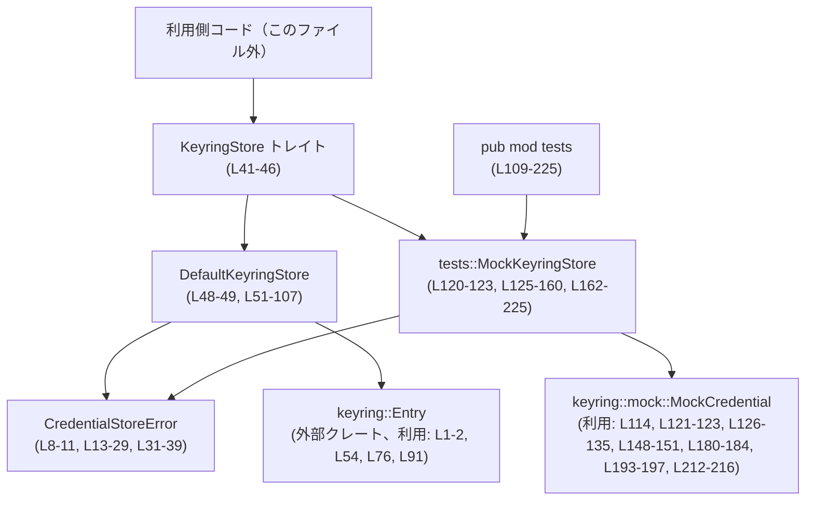
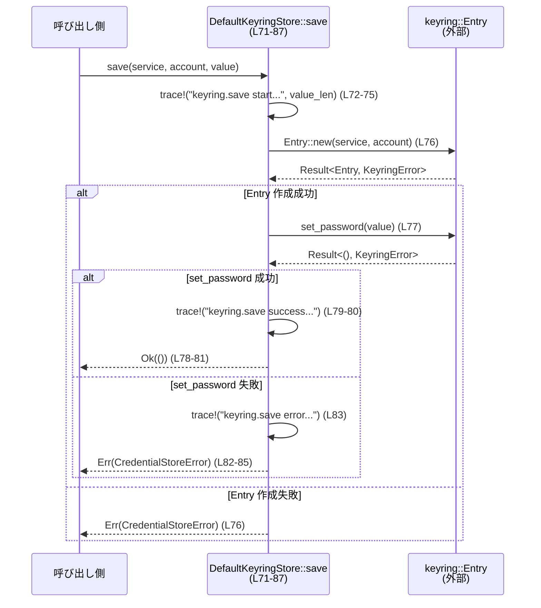

# keyring-store/src/lib.rs コード解説

## 0. ざっくり一言

OS のキーチェーンを扱う `keyring` クレートに対する抽象化として、共通トレイト `KeyringStore` と、そのデフォルト実装・テスト用モック実装・エラー型を定義するモジュールです（根拠: `keyring-store/src/lib.rs:L8-51,L109-225`）。

---

## 1. このモジュールの役割

### 1.1 概要

- `keyring` クレートを使った資格情報（パスワードなど）の保存・取得・削除を、共通インターフェース `KeyringStore` 越しに扱えるようにしています（根拠: L41-46, L51-107, L162-225）。
- 具体実装として、実際の OS キーチェーンにアクセスする `DefaultKeyringStore` と、テスト用にインメモリで動作する `MockKeyringStore` を提供します（根拠: L48-49, L51-107, L120-123, L162-225）。
- エラーは `KeyringError` をラップした `CredentialStoreError` という専用のエラー型で表現されます（根拠: L8-11, L13-29, L39）。

### 1.2 アーキテクチャ内での位置づけ

このファイル内の主要コンポーネント間の依存関係は次のようになっています。



- 「利用側コード」は、このトレイトを利用する外部の任意のコードを表す概念的なノードであり、具体的な実装はこのチャンクには現れません。
- `KeyringStore` を通して、利用側は本番環境では `DefaultKeyringStore` を、テストでは `MockKeyringStore` を差し替えられる設計です（根拠: トレイト＋2つの impl があること: L41-46, L51-107, L162-225）。

### 1.3 設計上のポイント

- **トレイトによる抽象化**  
  - `KeyringStore: Debug + Send + Sync` により、デバッグ表示可能かつスレッド間共有可能な実装だけを許可しています（根拠: L41-42）。
- **エラーの一元管理**  
  - `keyring::Error` を直接外に出さず、`CredentialStoreError::Other(KeyringError)` に包んで管理します（根拠: L8-11, L13-29）。
- **キーが存在しない場合の扱いの統一**  
  - 読み込み: キーが存在しないときは `Ok(None)`（根拠: L60-63, L181-183）。  
  - 削除: キーが存在しないときは `Ok(false)`（根拠: L97-100, L214-215）。
- **ログ出力**  
  - `tracing::trace` で `load` / `save` / `delete` の開始・結果・エラーを詳細にログ出力します（根拠: L53, L57-58, L61-62, L65, L72-75, L79-80, L83, L90-91, L94-95, L98-99, L102）。
  - 保存時には値そのものではなく長さ（`value_len`）のみを出力し、値の秘匿性に配慮しています（根拠: L72-75）。
- **テスト用モックのスレッド安全性**  
  - `MockKeyringStore` は `Arc<Mutex<HashMap<...>>>` で内部状態を共有し、`PoisonError::into_inner` でロック毒化時もパニックせずロックを継続利用します（根拠: L115-118, L121-123, L127-135, L138-144, L153-159, L169-173, L201-205, L218-221）。

---

## 2. 主要な機能一覧

- 資格情報ストア共通インターフェース `KeyringStore` の定義
- OS キーチェーン（`keyring::Entry`）に紐づく `DefaultKeyringStore` 実装
- `keyring::Error` をラップする `CredentialStoreError` 型
- テスト用のインメモリ実装 `tests::MockKeyringStore`
- `tracing` による `load` / `save` / `delete` の詳細なトレースログ

（根拠: L8-11, L13-29, L41-49, L51-107, L109-123, L125-160, L162-225）

---

## 3. 公開 API と詳細解説

### 3.1 型・モジュール一覧（コンポーネントインベントリー）

| 名前 | 種別 | 役割 / 用途 | 定義位置 |
|------|------|-------------|----------|
| `CredentialStoreError` | enum | `keyring::Error` をラップする資格情報ストア専用エラー型 | L8-11, L13-29, L31-39 |
| `KeyringStore` | trait | 資格情報ストアの共通インターフェース（`load` / `save` / `delete`） | L41-46 |
| `DefaultKeyringStore` | struct(ゼロサイズ) | `keyring::Entry` を使う本番用の実装 | L48-49, L51-107 |
| `tests` | pub mod | テスト用のモジュール。モック実装を含む。`#[cfg(test)]` は付いていないため、このファイルから見る限り常に公開されます。 | L109-225 |
| `tests::MockKeyringStore` | struct | テスト用のモック資格情報ストア。`Arc<Mutex<HashMap<...>>>` で内部状態を保持。 | L120-123, L125-160, L162-225 |

### 3.1.1 関数・メソッド一覧（コンポーネントインベントリー）

| 名前 | 所属 | 簡単な役割 | 定義位置 |
|------|------|------------|----------|
| `CredentialStoreError::new` | `CredentialStoreError` impl | `KeyringError` から `CredentialStoreError` を生成 | L14-16 |
| `CredentialStoreError::message` | 同上 | 内部エラーを文字列に変換して返す | L18-22 |
| `CredentialStoreError::into_error` | 同上 | 内部の `KeyringError` を取り出して返す | L24-28 |
| `KeyringStore::load` | `KeyringStore` trait | 資格情報を読み込む | L43 |
| `KeyringStore::save` | 同上 | 資格情報を保存する | L44 |
| `KeyringStore::delete` | 同上 | 資格情報を削除する | L45 |
| `DefaultKeyringStore::load` | `KeyringStore` impl | `keyring::Entry` からパスワードを取得 | L52-69 |
| `DefaultKeyringStore::save` | 同上 | `keyring::Entry` にパスワードを保存 | L71-87 |
| `DefaultKeyringStore::delete` | 同上 | `keyring::Entry` から資格情報を削除 | L89-106 |
| `MockKeyringStore::credential` | `MockKeyringStore` impl | 指定アカウントの `MockCredential` を取得／作成 | L126-135 |
| `MockKeyringStore::saved_value` | 同上 | 指定アカウントに保存された値を取得 | L137-146 |
| `MockKeyringStore::set_error` | 同上 | 指定アカウントの操作結果をエラーにする | L148-151 |
| `MockKeyringStore::contains` | 同上 | 指定アカウントのエントリ有無を確認 | L153-159 |
| `MockKeyringStore::load` | `KeyringStore` impl | モックから値を読み込む | L163-185 |
| `MockKeyringStore::save` | 同上 | モックに値を保存 | L187-197 |
| `MockKeyringStore::delete` | 同上 | モックから値を削除し、マップからもエントリを削除 | L199-224 |
| `fmt` 実装 | `CredentialStoreError` | Display 表示 (`"{error}"`) | L31-36 |

---

### 3.2 関数詳細（主要 API）

#### 3.2.1 `KeyringStore::load(&self, service: &str, account: &str) -> Result<Option<String>, CredentialStoreError>`

**概要**

- サービス名とアカウント名を指定して資格情報（文字列）を読み込みます。
- 値が存在しない場合は `Ok(None)` を返し、OS 側の「未登録」と区別できるようにしています（根拠: `DefaultKeyringStore` と `MockKeyringStore` の実装: L60-63, L181-183）。

**引数**

| 引数名 | 型 | 説明 |
|--------|----|------|
| `service` | `&str` | サービス名。`DefaultKeyringStore` では `Entry::new(service, account)` に渡されます（根拠: L54）。|
| `account` | `&str` | アカウント名。`DefaultKeyringStore` では `Entry::new` に渡され、モックでは `HashMap` のキーとして使われます（根拠: L54, L132-133, L169-173）。|

**戻り値**

- `Ok(Some(String))` : 資格情報が存在し、取得に成功した場合（根拠: L56-59, L180-182）。
- `Ok(None)` : 対応するエントリが存在しない場合（`KeyringError::NoEntry` を検出）（根拠: L60-63, L181-183）。
- `Err(CredentialStoreError)` : その他のエラーが発生した場合（根拠: L64-67, L183-184）。

**内部処理の流れ（仕様）**

トレイト自体には実装はありませんが、`DefaultKeyringStore` と `MockKeyringStore` の振る舞いから、以下が契約として読み取れます（根拠: L51-107, L162-185）。

1. 実装側でストアを特定する（`service`・`account` を使う）（L54, L169-173）。
2. 実際のストアから値を取得しようとする。
3. 値が存在すれば `Some(value)` を返す（L56-59, L180-182）。
4. ストア側で「エントリなし」と判定された場合は `Ok(None)` を返す（L60-63, L181-183）。
5. それ以外のエラーは `CredentialStoreError` にラップして `Err` で返す（L64-67, L183-184）。

**Examples（使用例）**

```rust
use crate::{KeyringStore, DefaultKeyringStore}; // クレート名は例示

fn print_token(store: &dyn KeyringStore) -> Result<(), crate::CredentialStoreError> {
    // "my-service" / "user@example.com" 用の資格情報を取得する
    match store.load("my-service", "user@example.com")? {
        Some(token) => {
            println!("トークン: {}", token); // 資格情報が存在した場合
        }
        None => {
            println!("トークンはまだ保存されていません"); // 未登録の場合
        }
    }
    Ok(())
}

// 利用例
fn main() -> Result<(), Box<dyn std::error::Error>> {
    let store = DefaultKeyringStore; // DefaultKeyringStore はゼロサイズ構造体（L48-49）
    print_token(&store)?;            // &dyn KeyringStore として扱う
    Ok(())
}
```

**Errors / Panics**

- `Err(CredentialStoreError)` になるケース:
  - バックエンドの `Entry::new` が失敗した場合（L54, L76, L91）。
  - `get_password()` が `KeyringError::NoEntry` 以外のエラーを返した場合（L64-67, L183-184）。
- このファイル内では `panic!` を直接呼んでおらず、`load` 経由でのパニックは見られません。

**Edge cases（エッジケース）**

- 対応するエントリが存在しない場合: `Ok(None)`（根拠: L60-63, L181-183）。
- `service` や `account` が空文字列のときの挙動は、`keyring` クレート側に依存し、このチャンクからは分かりません。
- 同じ `service` / `account` の組み合わせで複数回呼び出した場合のキャッシュ有無も、このファイルからは分かりません（毎回 `Entry::new` を呼んでいることのみ分かります: L54）。

**使用上の注意点**

- 値の有無（`Option`）とエラー（`Result` の `Err`）を区別して扱う必要があります。  
  例: 「未登録」と「取得エラー」を混同しないようにする。
- 並行実行: `KeyringStore` は `Send + Sync` を要求しているため（L41-42）、実装はスレッド安全であることが前提です。

---

#### 3.2.2 `KeyringStore::save(&self, service: &str, account: &str, value: &str) -> Result<(), CredentialStoreError>`

**概要**

- 指定された `service` / `account` に対して資格情報 `value` を保存します（根拠: L44, L71-87, L187-197）。

**引数**

| 引数名 | 型 | 説明 |
|--------|----|------|
| `service` | `&str` | サービス識別子。`Entry::new` の引数に渡されます（L76）。 |
| `account` | `&str` | アカウント識別子。`Entry::new` の引数および `MockKeyringStore` のキーとして使用（L76, L193-197）。 |
| `value` | `&str` | 保存したい資格情報（パスワード等）。ログには長さのみ出力され、内容は出力されません（L72-75）。 |

**戻り値**

- `Ok(())` : 保存に成功した場合（根拠: L77-81, L193-197）。
- `Err(CredentialStoreError)` : エントリ作成や保存に失敗した場合（根拠: L76, L82-85, L195-197）。

**内部処理の流れ（仕様）**

`DefaultKeyringStore` の実装から読み取れる流れです（根拠: L71-87）。

1. 操作開始を `tracing::trace!` でログ（`value_len` を出力）（L72-75）。
2. `Entry::new(service, account)` でキーリングエントリを作成し、失敗した場合は `CredentialStoreError` に変換して即 `Err`（L76）。
3. `entry.set_password(value)` を呼び出す（L77）。
4. 成功 (`Ok(())`) の場合は成功ログを出力し、`Ok(())` を返す（L78-81）。
5. 失敗 (`Err(error)`) の場合はエラーログを出力し、`CredentialStoreError::new(error)` を返す（L82-85）。

モック実装も `set_password` を呼び、エラーは `CredentialStoreError` にマップしている点で同様です（根拠: L187-197）。

**Examples（使用例）**

```rust
use crate::{KeyringStore, DefaultKeyringStore};

fn save_token(store: &dyn KeyringStore, token: &str) -> Result<(), crate::CredentialStoreError> {
    // "my-service" / "user@example.com" にトークンを保存
    store.save("my-service", "user@example.com", token)
}

fn main() -> Result<(), Box<dyn std::error::Error>> {
    let store = DefaultKeyringStore;
    save_token(&store, "secret-token-123")?;
    Ok(())
}
```

**Errors / Panics**

- `Err(CredentialStoreError)` になるケース:
  - `Entry::new(service, account)` が失敗した場合（L76）。
  - `set_password(value)` がエラーを返した場合（L82-85, L195-197）。
- パニックはこのファイル上では発生しません（`unwrap` 等は使用していません）。

**Edge cases（エッジケース）**

- `value` が空文字列のときの扱いは `keyring` クレートに依存し、このファイルからは分かりません。
- 既に同じキーに値が存在する場合の上書き／マージの挙動も、このチャンクには現れません（`set_password` の仕様次第です）。

**使用上の注意点**

- 保存に失敗した場合は `Err` になりますが、部分的に保存されたかどうかは、このコードだけからは分かりません。
- ログには値の長さのみが記録される点はセキュリティ上の情報として把握しておく必要があります（根拠: L72-75）。

---

#### 3.2.3 `KeyringStore::delete(&self, service: &str, account: &str) -> Result<bool, CredentialStoreError>`

**概要**

- 指定された `service` / `account` に対応する資格情報を削除します。
- 戻り値の `bool` は「削除を行ったかどうか（対象が存在したか）」を表します（根拠: L89-106, L199-224）。

**引数**

| 引数名 | 型 | 説明 |
|--------|----|------|
| `service` | `&str` | サービス識別子。`Entry::new` の引数として使用（L91）。 |
| `account` | `&str` | アカウント識別子。`Entry::new` とモック側のキーとして使用（L91, L201-205）。 |

**戻り値**

- `Ok(true)` : 対応するエントリが存在し、削除に成功した場合（根拠: L93-96, L212-213 + L218-223）。
- `Ok(false)` : 対応するエントリが存在しなかった場合（`KeyringError::NoEntry`）（根拠: L97-100, L214-215）。
- `Err(CredentialStoreError)` : その他のエラーが発生した場合（根拠: L101-104, L215-216）。

**内部処理の流れ（仕様）**

`DefaultKeyringStore` の実装（L89-106）からの流れ:

1. 操作開始を `trace!` でログ（L90）。
2. `Entry::new(service, account)` からエントリを取得し、失敗時は `CredentialStoreError` を返して終了（L91）。
3. `entry.delete_credential()` を呼ぶ（L92）。
4. 成功 (`Ok(())`) の場合: 成功ログを出力し、`Ok(true)` を返す（L93-96）。
5. `Err(KeyringError::NoEntry)` の場合: 「エントリなし」としてログを出力し、`Ok(false)` を返す（L97-100）。
6. その他のエラーの場合: エラーログを出し、`Err(CredentialStoreError)` で返す（L101-104）。

モック側の実装では、`delete_credential` の結果を同様に `bool` にマップし、`HashMap` からもエントリを削除しています（根拠: L199-224）。

**Examples（使用例）**

```rust
use crate::{KeyringStore, DefaultKeyringStore};

fn remove_token(store: &dyn KeyringStore) -> Result<(), crate::CredentialStoreError> {
    let removed = store.delete("my-service", "user@example.com")?;
    if removed {
        println!("資格情報を削除しました");
    } else {
        println!("削除対象の資格情報は存在しませんでした");
    }
    Ok(())
}
```

**Errors / Panics**

- `Err(CredentialStoreError)` になる条件:
  - エントリ取得（`Entry::new`）の失敗（L91）。
  - 削除処理（`delete_credential`）で `KeyringError::NoEntry` 以外のエラーが発生（L101-104, L215-216）。
- パニックは使用していないため、この関数自体からは発生しません。

**Edge cases（エッジケース）**

- 「存在しなかった」ケース (`Ok(false)`) と「削除に成功した」ケース (`Ok(true)`) を呼び出し側で判別できます。
- `MockKeyringStore::delete` は、`delete_credential` の結果が `Ok(false)` のときでも `HashMap` から該当キーを削除しているため（L214-215, L218-222）、以後の `contains` や `saved_value` はキーなし扱いになります。

**使用上の注意点**

- 「対象が存在したかどうか」を確認したい場合は戻り値の `bool` を必ず確認する必要があります。
- 「存在しない」という通常ケースと、「エラー」が明確に分かれている点を前提にエラー処理を書く必要があります。

---

#### 3.2.4 `DefaultKeyringStore::load(&self, ...)`（実装詳細）

シグネチャはトレイトと同じため、ここでは実装固有の挙動を補足します（L52-69）。

**内部処理の流れ**

1. 開始ログを出力（L53）。
2. `Entry::new(service, account)` でキーリングエントリを生成（L54）。
3. `entry.get_password()` を呼び出し（L55）。
4. `Ok(password)` の場合:
   - 成功ログを出力し（L57-58）、`Ok(Some(password))` を返す（L56-59）。
5. `Err(keyring::Error::NoEntry)` の場合:
   - 「エントリなし」ログを出力し（L61-62）、`Ok(None)` を返す（L60-63）。
6. その他のエラー:
   - エラーログを出力し（L65）、`CredentialStoreError::new(error)` で `Err` を返す（L64-67）。

**ログ内容・セキュリティ**

- ログには `service` と `account` がプレーンテキストで含まれます（L53, L57, L61, L65）。
- パスワードそのものはログに出力されません。

---

#### 3.2.5 `DefaultKeyringStore::save(&self, ...)`（実装詳細）

シグネチャはトレイトどおりで、実装は L71-87 にあります。

**内部処理の流れ**

1. 開始ログ。`service`・`account` とともに `value.len()` を出力（L72-75）。
2. `Entry::new(service, account)` でエントリ作成、失敗時は `CredentialStoreError` を返して終了（L76）。
3. `entry.set_password(value)` を呼ぶ（L77）。
4. 成功時:
   - 成功ログを出力し（L79-80）、`Ok(())` を返す（L78-81）。
5. 失敗時:
   - エラーログを出し（L83）、`Err(CredentialStoreError::new(error))` を返す（L82-85）。

---

#### 3.2.6 `DefaultKeyringStore::delete(&self, ...)`（実装詳細）

シグネチャはトレイトどおりで、実装は L89-106 にあります。

**内部処理の流れ**

1. 開始ログ（L90）。
2. `Entry::new(service, account)` でエントリ取得、失敗時は `Err(CredentialStoreError)`（L91）。
3. `entry.delete_credential()` を実行（L92）。
4. 成功 (`Ok(())`) の場合: 成功ログを出し、`Ok(true)`（L93-96）。
5. `Err(keyring::Error::NoEntry)` の場合: 「エントリなし」ログを出し、`Ok(false)`（L97-100）。
6. その他のエラーの場合: エラーログを出し、`Err(CredentialStoreError::new(error))`（L101-104）。

---

### 3.3 その他の関数（補助 / テスト用）

| 関数名 | 役割（1 行） | 定義位置 |
|--------|--------------|----------|
| `CredentialStoreError::message` | 内部エラーを `String` に変換して返す（`to_string()` を呼ぶだけ） | L18-22 |
| `CredentialStoreError::into_error` | ラップしている `KeyringError` を取り出す | L24-28 |
| `MockKeyringStore::credential` | 指定アカウントの `MockCredential` を取得し、なければ作成して返す | L126-135 |
| `MockKeyringStore::saved_value` | 指定アカウントのパスワードを取得。内部エラーは `None` として扱う | L137-146 |
| `MockKeyringStore::set_error` | 指定アカウントの `MockCredential` にエラー状態を設定 | L148-151 |
| `MockKeyringStore::contains` | 内部 `HashMap` にキーが存在するかどうかを返す | L153-159 |
| `MockKeyringStore::load` | モックから値を読み込む。`NoEntry` は `Ok(None)` にマップ | L163-185 |
| `MockKeyringStore::save` | モックに値を保存。エラーは `CredentialStoreError` にマップ | L187-197 |
| `MockKeyringStore::delete` | モックから削除を試み、`HashMap` からもエントリを削除する | L199-224 |

---

## 4. データフロー

ここでは `DefaultKeyringStore::save` を例に、資格情報保存時のデータフローを示します。

### 4.1 処理の流れ（テキスト）

1. 呼び出し側が `DefaultKeyringStore::save(service, account, value)` を呼ぶ（L71-72）。
2. `save` はトレースログを出力し、`Entry::new(service, account)` で `keyring::Entry` を生成する（L72-76）。
3. `Entry::new` が成功すると、`set_password(value)` を呼び出す（L77）。
4. `set_password` が成功した場合は成功ログを出し、`Ok(())` を返す（L78-81）。
5. `Entry::new` または `set_password` でエラーが発生した場合は、エラーログを出したうえで `CredentialStoreError` にラップし `Err` を返す（L76, L82-85）。

### 4.2 シーケンス図



---

## 5. 使い方（How to Use）

### 5.1 基本的な使用方法（DefaultKeyringStore）

以下ではクレート名を便宜的に `keyring_store` と書きますが、実際の名前は Cargo.toml に依存し、このチャンクからは分かりません。

```rust
use keyring_store::{KeyringStore, DefaultKeyringStore, CredentialStoreError};

fn main() -> Result<(), Box<dyn std::error::Error>> {
    // 本番用ストアとして DefaultKeyringStore を使用（L48-49）
    let store = DefaultKeyringStore;

    // 1. 保存
    store.save("my-service", "user@example.com", "secret-token")
        .map_err(|e| {
            eprintln!("保存エラー: {}", e); // Display 実装でメッセージを表示（L31-36）
            e
        })?;

    // 2. 読み込み
    match store.load("my-service", "user@example.com")? {
        Some(token) => println!("取得したトークン: {}", token),
        None => println!("トークンはまだ保存されていません"),
    }

    // 3. 削除
    let removed = store.delete("my-service", "user@example.com")?;
    println!("削除実行されたか: {}", removed); // true/false（L93-96, L97-100）

    Ok(())
}
```

### 5.2 よくある使用パターン

#### パターン1: トレイトオブジェクトを引数に取るサービス関数

`KeyringStore` トレイトを引数に取ることで、`DefaultKeyringStore` と `MockKeyringStore` を差し替え可能にできます（根拠: 2 実装がある: L51-107, L162-225）。

```rust
use keyring_store::{KeyringStore, DefaultKeyringStore, CredentialStoreError};

fn ensure_token(store: &dyn KeyringStore) -> Result<String, CredentialStoreError> {
    if let Some(token) = store.load("my-service", "user@example.com")? {
        Ok(token)
    } else {
        let new_token = "generated-token";
        store.save("my-service", "user@example.com", new_token)?;
        Ok(new_token.to_string())
    }
}

fn main() -> Result<(), Box<dyn std::error::Error>> {
    let store = DefaultKeyringStore;
    let token = ensure_token(&store)?;
    println!("利用するトークン: {}", token);
    Ok(())
}
```

#### パターン2: テストで `MockKeyringStore` を使う

`pub mod tests` 内の `MockKeyringStore` を用いることで、`keyring` に依存せずテストできます（根拠: L109-123, L125-160, L162-225）。

```rust
use keyring_store::tests::MockKeyringStore;
use keyring_store::{KeyringStore, CredentialStoreError};

fn uses_store(store: &dyn KeyringStore) -> Result<(), CredentialStoreError> {
    store.save("svc", "alice", "pw")?;
    let value = store.load("svc", "alice")?;
    assert_eq!(value, Some("pw".to_string()));
    Ok(())
}

#[test]
fn test_uses_store_with_mock() -> Result<(), CredentialStoreError> {
    let mock = MockKeyringStore::default(); // #[derive(Default)]（L120）
    uses_store(&mock)
}
```

### 5.3 よくある間違いと正しい使い方

```rust
use keyring_store::{KeyringStore, DefaultKeyringStore};

// 間違い例: load の結果を Option なのに unwrap してしまい、存在しないケースを考慮しない
fn wrong() -> Result<(), keyring_store::CredentialStoreError> {
    let store = DefaultKeyringStore;
    let token = store.load("svc", "bob")?.unwrap(); // 存在しないときに panic する
    println!("token = {}", token);
    Ok(())
}

// 正しい例: Option を match で扱う
fn correct() -> Result<(), keyring_store::CredentialStoreError> {
    let store = DefaultKeyringStore;
    match store.load("svc", "bob")? {
        Some(token) => println!("token = {}", token),
        None => println!("まだ保存されていません"),
    }
    Ok(())
}
```

### 5.4 使用上の注意点（まとめ）

- **値の有無とエラーの区別**  
  - `load` は `Result<Option<String>, _>` を返すため、「未登録」と「エラー」を正しく区別して扱う必要があります（L43, L52-69, L163-185）。
- **`delete` の戻り値**  
  - `bool` は「削除を行ったかどうか」であり、「エラーの有無」ではありません（L89-106, L199-224）。
- **ログへの情報漏えい**  
  - `service` と `account` がログに出力される設計である点を前提に運用する必要があります（L53, L57, L61, L65, L72-75, L79-80, L83, L90, L94, L98, L102）。
- **並行性**  
  - トレイトに `Send + Sync` 制約がかかっており（L41-42）、`DefaultKeyringStore` はゼロサイズ・状態なしのため複数スレッドから安全に共有できます。
  - `MockKeyringStore` は `Arc<Mutex<...>>` によって内部状態を守っており、`PoisonError` でも `into_inner` を使うことでパニックを避け、状態アクセスを継続しています（L115-118, L121-123, L127-135, L138-144, L153-159, L169-173, L201-205, L218-221）。

---

## 6. 変更の仕方（How to Modify）

### 6.1 新しい機能（新バックエンド）を追加する場合

`KeyringStore` を実装する別のバックエンド（例: ファイルベースストアなど）を追加したい場合は、次のような流れになります。

1. 新しい構造体を定義する（このファイルか別ファイル）。  
   - 例: `pub struct FileKeyringStore { ... }`（この名前は例示であり、このチャンクには現れません）。
2. `impl KeyringStore for FileKeyringStore { ... }` を実装し、`load` / `save` / `delete` を `DefaultKeyringStore` と同じ契約に従って実装する（「NoEntry 相当 → None / false」「その他のエラー → Err」など）（根拠: 現行 2 実装の共通仕様: L52-69, L89-106, L163-185, L199-224）。
3. 必要なら、テスト用に `MockKeyringStore` と同様のパターン（`Arc<Mutex<...>>`）を使って、スレッド安全なモックを用意できます（L120-123, L125-160, L162-225）。

### 6.2 既存の機能を変更する場合

- **エラー表現を変えたい場合**  
  - すべてのエラーが `CredentialStoreError::Other(KeyringError)` に集約されているため（L8-11, L13-29）、新しいバリアントを追加する場合は、`DefaultKeyringStore` と `MockKeyringStore` のすべての `map_err(CredentialStoreError::new)` 箇所を見直す必要があります（L54, L76, L91, L167-168, L193-197, L215-216）。
- **ログ出力を変更したい場合**  
  - `tracing::trace!` を使っている箇所（L53, L57-58, L61-62, L65, L72-75, L79-80, L83, L90, L94-95, L98-99, L102）のメッセージとパラメータをまとめて確認します。
- **契約の維持**  
  - `KeyringStore` の契約（`NoEntry → None / false`）を変える場合、2 つの実装だけでなく、このトレイトを使っている全てのコードに影響するため、呼び出し側の扱いも一括で確認する必要があります。このチャンクには呼び出し側のコードは現れません。

---

## 7. 関連ファイル・外部コンポーネント

このチャンクに現れる関連コンポーネントは以下のとおりです。

| パス / 型 | 役割 / 関係 | 根拠 |
|-----------|------------|------|
| `keyring::Entry` | 実際の資格情報ストアにアクセスするエントリ型。`DefaultKeyringStore` から利用される。 | L1, L54, L76, L91 |
| `keyring::Error` | キーリング操作のエラー型。`KeyringError` としてインポートされ、`CredentialStoreError` 内に保持される。 | L2, L9-10, L14-16, L24-27 |
| `keyring::credential::CredentialApi` | `MockCredential` に対するパスワード操作・削除などの API を提供するトレイト。モック実装で利用。 | L113, L137-146, L180-184, L193-197, L212-216 |
| `keyring::mock::MockCredential` | テスト用のモック資格情報。`MockKeyringStore` 内部で使用。 | L114, L121-123, L126-135, L148-151, L180-184, L193-197, L212-216 |
| `std::sync::Arc` / `Mutex` / `PoisonError` | モックの内部状態共有とスレッド安全性の確保に利用。ロック毒化時も `into_inner` でパニックせず状態にアクセス。 | L115-118, L121-123, L127-135, L138-144, L153-159, L169-173, L201-205, L218-221 |
| `tracing::trace` | `DefaultKeyringStore` の各操作の開始・結果・エラーをログ出力。 | L6, L53, L57-58, L61-62, L65, L72-75, L79-80, L83, L90, L94-95, L98-99, L102 |

このチャンクには、`KeyringStore` を実際に利用するアプリケーションコードや他のモジュールは現れていません。そのため、これらとの統合方法は上記の使用例のように一般的な Rust のトレイト利用パターンに従う形で推測することしかできません。
