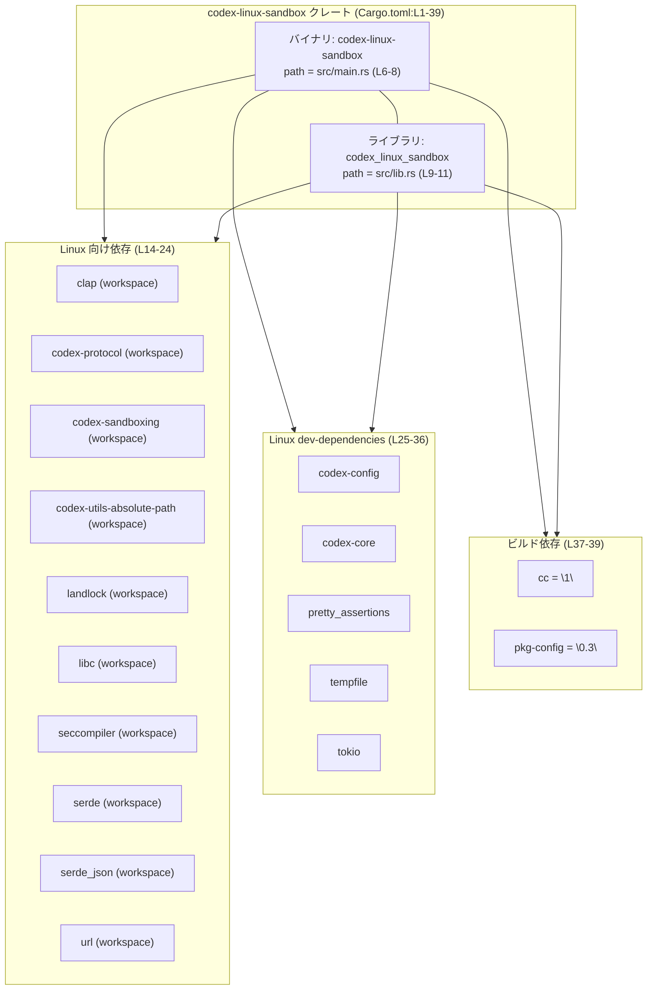
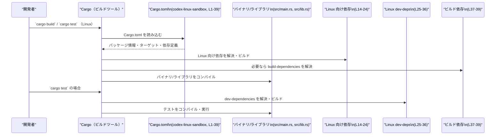

# linux-sandbox/Cargo.toml コード解説

## 0. ざっくり一言

このファイルは、クレート `codex-linux-sandbox` の Cargo マニフェストであり、  
バイナリとライブラリのターゲット定義、および Linux 向けの依存クレート・開発用依存・ビルド依存を指定しています（`Cargo.toml:L1-39`）。

---

## 1. このモジュールの役割

### 1.1 概要

- このファイルは Rust クレート `codex-linux-sandbox` のメタデータと依存関係を定義します（`[package]` セクション, `Cargo.toml:L1-5`）。
- バイナリターゲット `codex-linux-sandbox`（`src/main.rs`）と、ライブラリターゲット `codex_linux_sandbox`（`src/lib.rs`）の 2 つを持つ構成になっています（`Cargo.toml:L6-11`）。
- Linux ターゲット（`cfg(target_os = "linux")`）向けにのみ有効な依存クレート群と dev-dependencies を定義しており（`Cargo.toml:L14-36`）、さらに C コンパイラ・pkg-config を使うビルド依存を指定しています（`Cargo.toml:L37-39`）。

このファイルは設定のみを含み、Rust の関数・構造体などの実装コードは含みません。

### 1.2 アーキテクチャ内での位置づけ

Cargo.toml から読み取れる範囲の、クレート内コンポーネントと依存関係を図示します。



- バイナリとライブラリは同じクレートの中にあり、依存セクション `[target.'cfg(target_os = "linux")'.dependencies]` に列挙されたクレートを共有して利用できます（コンパイル上の依存関係として）（`Cargo.toml:L14-24`）。
- dev-dependencies と build-dependencies は、テストやビルドスクリプトなどビルド周辺工程で利用されますが、具体的な利用コードはこのチャンクには現れません。

### 1.3 設計上のポイント

コードから読み取れる設計上の特徴は次のとおりです。

- **ワークスペース依存**  
  - `version.workspace = true`, `edition.workspace = true`, `license.workspace = true` により、バージョン・エディション・ライセンスはワークスペース定義に委譲されています（`Cargo.toml:L3-5`）。
  - 多くの依存クレートも `workspace = true` とされており、バージョン管理がワークスペース側で一元化されています（`Cargo.toml:L15-23,26-30`）。
- **ターゲット OS ごとの依存管理**  
  - 依存と dev-dependencies はいずれも `target.'cfg(target_os = "linux")'` にぶら下がっており、Linux ターゲットのときにのみ有効になります（`Cargo.toml:L14-24,25-36`）。
- **バイナリ＋ライブラリ構成**  
  - 同じソースディレクトリ内で、CLI バイナリ（`src/main.rs`）とライブラリ（`src/lib.rs`）の両方を提供する構成です（`Cargo.toml:L6-11`）。呼び出し方向はこのファイルだけでは不明です。
- **ビルド時のネイティブ依存**  
  - `cc` と `pkg-config` を build-dependencies として指定しており（`Cargo.toml:L37-39`）、何らかの C/C++ コードやシステムライブラリとの連携をビルド時に行う設計であると推測されますが、具体的な処理内容はこのチャンクには現れません。
- **lint 方針のワークスペース一元管理**  
  - `[lints] workspace = true` により、lint（警告・スタイルチェック等）の設定もワークスペースで統一されています（`Cargo.toml:L12-13`）。

---

## 2. 主要な機能一覧

このファイルが提供する「機能」は、実行時ロジックではなくビルド時設定です。

- クレートメタ情報の定義：`codex-linux-sandbox` クレートの名前・バージョン・エディション・ライセンスの指定（`Cargo.toml:L1-5`）。
- バイナリターゲット定義：`codex-linux-sandbox` 実行ファイルを `src/main.rs` からビルドする設定（`Cargo.toml:L6-8`）。
- ライブラリターゲット定義：`codex_linux_sandbox` ライブラリを `src/lib.rs` からビルドする設定（`Cargo.toml:L9-11`）。
- Linux ターゲット専用依存クレート群の指定：`clap`, `codex-sandboxing`, `landlock` などの依存（`Cargo.toml:L14-24`）。
- Linux ターゲット専用 dev-dependencies の指定：`codex-config`, `tokio` などテスト・開発用途の依存（`Cargo.toml:L25-36`）。
- ビルド依存の指定：`cc`, `pkg-config` によるネイティブビルド連携（`Cargo.toml:L37-39`）。
- lint 設定のワークスペース継承：`[lints] workspace = true` による共通 lint 設定の利用（`Cargo.toml:L12-13`）。

実際の公開 API（Rust の関数・型）は `src/lib.rs` 側にあり、このチャンクには現れません。

---

## 3. 公開 API と詳細解説

このファイルには Rust コードが含まれないため、**型** や **関数** の定義は存在しません。そのため、以下の小節では「該当なし」であることを明記します。

### 3.1 型一覧（構造体・列挙体など）

- このファイルは Cargo マニフェストであり、構造体・列挙体などの Rust の型定義は含まれていません。  
  （型定義を含むとすれば `src/lib.rs` や `src/main.rs` ですが、このチャンクには現れません。）

### 3.2 関数詳細（最大 7 件）

- Cargo.toml には関数定義がないため、関数詳細テンプレートに基づいて説明できる公開関数は存在しません。

### 3.3 その他の関数

- 同様に、補助的な関数やラッパー関数もこのファイルには定義されていません。

### 3.4 コンポーネントインベントリー（ターゲット・依存クレート）

Rust の型・関数ではなく、「ビルド上のコンポーネント（ターゲット・依存クレート）」の一覧を示します。

| コンポーネント | 種別 | 説明 | 根拠 |
|----------------|------|------|------|
| `codex-linux-sandbox` | パッケージ | このクレート全体の名前。ワークスペースに参加しており、バージョン等はワークスペースから継承 | `Cargo.toml:L1-5` |
| バイナリ `codex-linux-sandbox` | バイナリターゲット | 実行バイナリ。エントリポイントは `src/main.rs` | `Cargo.toml:L6-8` |
| ライブラリ `codex_linux_sandbox` | ライブラリターゲット | ライブラリクレート。ルートは `src/lib.rs` | `Cargo.toml:L9-11` |
| `clap` | Linux 依存 | Linux ターゲット時の依存クレート。ワークスペースでバージョンを管理し、`derive` 機能を有効化 | `Cargo.toml:L14-15` |
| `codex-protocol` | Linux 依存 | ワークスペース内の `codex-protocol` クレートへの依存。用途はこのチャンクには現れません | `Cargo.toml:L14,16` |
| `codex-sandboxing` | Linux 依存 | ワークスペース内の `codex-sandboxing` クレートへの依存 | `Cargo.toml:L14,17` |
| `codex-utils-absolute-path` | Linux 依存 | ワークスペース内ユーティリティクレートへの依存 | `Cargo.toml:L14,18` |
| `landlock` | Linux 依存 | ワークスペース内 `landlock` クレートへの依存 | `Cargo.toml:L14,19` |
| `libc` | Linux 依存 | ワークスペース内 `libc` クレートへの依存 | `Cargo.toml:L14,20` |
| `seccompiler` | Linux 依存 | ワークスペース内 `seccompiler` クレートへの依存 | `Cargo.toml:L14,21` |
| `serde` | Linux 依存 | ワークスペース内 `serde` クレートへの依存。`derive` 機能を有効化 | `Cargo.toml:L14,22` |
| `serde_json` | Linux 依存 | ワークスペース内 `serde_json` クレートへの依存 | `Cargo.toml:L14,23` |
| `url` | Linux 依存 | ワークスペース内 `url` クレートへの依存 | `Cargo.toml:L14,24` |
| `codex-config` | Linux dev 依存 | 開発・テスト時に利用される `codex-config` クレートへの依存 | `Cargo.toml:L25-26` |
| `codex-core` | Linux dev 依存 | 開発・テスト時に利用される `codex-core` クレートへの依存 | `Cargo.toml:L25,27` |
| `pretty_assertions` | Linux dev 依存 | テスト等で利用されるアサーション支援クレートへの依存 | `Cargo.toml:L25,28` |
| `tempfile` | Linux dev 依存 | 一時ファイル操作のためと推測されるクレートへの依存（用途はこのチャンクには現れません） | `Cargo.toml:L25,29` |
| `tokio` | Linux dev 依存 | 非同期ランタイム `tokio` への開発用依存。`io-std`, `macros` 等の機能を有効化 | `Cargo.toml:L25,30-36` |
| `cc` | ビルド依存 | C/C++ コードのコンパイルに用いられるビルド依存クレート | `Cargo.toml:L37-38` |
| `pkg-config` | ビルド依存 | システムライブラリの検出に用いられるビルド依存クレート | `Cargo.toml:L37,39` |

> 用途が「推測される」と記載しているものは、クレート名や一般的な利用からの推測であり、**具体的にどう使われているかはこのチャンクには現れません**。

---

## 4. データフロー

このファイル単体からは、実行時のデータフローや関数呼び出し関係は分かりません。  
ここでは、「Cargo がこのマニフェストをどのように解釈してビルドを行うか」というビルド時フローを示します。

### 4.1 ビルド時のフロー概要

- 開発者が Linux ターゲットで `codex-linux-sandbox` をビルドすると、Cargo はこの `Cargo.toml` を読み込み、バイナリ・ライブラリターゲットおよび Linux 向け依存を解決します（`Cargo.toml:L1-11,L14-36`）。
- `build-dependencies` に指定された `cc` と `pkg-config` が必要な場合、ビルドスクリプト（存在する場合）がこれらを用いてネイティブコードやシステムライブラリを検出・コンパイルします（`Cargo.toml:L37-39`）。
- dev-dependencies は、テストやベンチマーク実行時にのみ解決・コンパイルされます（`Cargo.toml:L25-36`）。

### 4.2 ビルドフローのシーケンス図

以下は、Linux 上で `cargo build` または `cargo test` を実行したときの一般的なフローを表現したものです。



- 呼び出し関係は Cargo と依存クレートの間のものであり、`src/main.rs` や `src/lib.rs` 内の関数・メソッド間のデータフローは、このチャンクには現れません。
- 並行性（`tokio` の利用など）や安全性（`landlock`, `seccompiler` の使い方など）の**具体的な実装上の挙動**は、このファイルからは読み取れません。

---

## 5. 使い方（How to Use）

### 5.1 基本的な使用方法

このファイルを前提に、開発者が行う典型的な操作例を示します。以下は一般的な Cargo の使い方であり、`Cargo.toml` の記述と矛盾しない範囲で説明します。

Linux 環境で、ワークスペースルートからこのクレートのバイナリをビルド・実行する例:

```bash
# バイナリターゲットをビルド
cargo build -p codex-linux-sandbox

# バイナリターゲットを実行
cargo run -p codex-linux-sandbox -- [バイナリに渡す引数...]
```

- `-p codex-linux-sandbox` は `[package] name = "codex-linux-sandbox"` に対応します（`Cargo.toml:L2`）。
- 非 Linux ターゲット（例: Windows）の場合、依存セクションが `cfg(target_os = "linux")` に限定されているため、このクレートがビルドできるかどうかは、このチャンクからは分かりません。

ライブラリとして利用する場合（ワークスペース内の別クレートから import するなど）の具体的な API は `src/lib.rs` に依存するため、このチャンクには現れません。

### 5.2 よくある使用パターン

Cargo.toml から想定できる「使われ方」を、事実ベースで列挙します。

1. **Linux 向け CLI ツールとしての利用**  
   - `[[bin]]` セクションによりバイナリが定義されているため（`Cargo.toml:L6-8`）、Linux 上で CLI として実行されることが想定されます。
   - 依存が Linux ターゲット限定になっているため、機能は Linux 向けに特化している可能性があります（このチャンクには具体的な機能は現れません）。

2. **ワークスペース内ライブラリとしての再利用**  
   - `[lib]` セクションがあるため（`Cargo.toml:L9-11`）、他クレートから `codex_linux_sandbox` ライブラリを利用できる設計です。
   - 実際にどの関数・型が公開されているかは `src/lib.rs` を参照する必要があります（このチャンクには現れません）。

### 5.3 よくある間違い

Cargo.toml の設定と Linux ターゲット依存を考えると、起こりうる誤りのパターンを挙げます（**あくまで一般論**です）。

```rust
// （誤りになりうる例）
// 非 Linux 向けビルドでもコンパイルされるコードで Linux 専用依存を使っている

use landlock::SomeType;  // landlock は Linux ターゲット依存としてのみ指定されている（L19）

fn do_something() {
    // ...
}
```

この場合、クレートを Linux 以外のターゲットでビルドすると、`landlock` 依存が解決されずビルドエラーになる可能性があります。

```rust
// より安全な例（一般的なパターン）

#[cfg(target_os = "linux")]
use landlock::SomeType;

#[cfg(target_os = "linux")]
fn do_something_linux_only() {
    // Linux 専用の機能
}
```

- 上記はあくまで一般的な `cfg` の使い方の例であり、`src/lib.rs` / `src/main.rs` が実際にこのような構造になっているかどうかは、このチャンクには現れません。
- Cargo.toml の `target.'cfg(target_os = "linux")'.dependencies` と整合するように、コード側でも `cfg` を用いる必要がある点が注意事項として挙げられます。

### 5.4 使用上の注意点（まとめ）

- **OS 依存性**  
  - 依存と dev-dependencies がすべて `target_os = "linux"` に紐づいているため（`Cargo.toml:L14-36`）、Linux 以外のターゲットでこのクレートをビルドする場合は、コード側でも適切に `cfg` を使っているかを確認する必要があります。
- **ビルド環境の前提**  
  - `cc` と `pkg-config` がビルド依存として指定されているため（`Cargo.toml:L37-39`）、ビルド環境には C コンパイラと pkg-config に対応した開発環境が必要になります。これが不足するとビルドエラーになります。
- **安全性・エラー・並行性の詳細**  
  - Rust の具体的な実装（`src/lib.rs`, `src/main.rs`）がこのチャンクには存在しないため、このクレートのエラーハンドリング方針、安全性（unsafe の利用など）、並行性（`tokio` をどのように使うか）については、ここからは判断できません。
- **ワークスペースとの整合性**  
  - 多くの設定項目・依存が `workspace = true` に委譲されているため（`Cargo.toml:L3-5,15-23,26-30`）、ワークスペース側の設定変更がこのクレートに影響します。バージョンアップや依存変更はワークスペース設定も含めて確認する必要があります。

---

## 6. 変更の仕方（How to Modify）

### 6.1 新しい機能を追加する場合（Cargo.toml 観点）

新しい機能を追加するときに、Cargo.toml に対して行うであろう変更パターンを示します。

1. **新たな Rust 依存クレートを追加する**  
   - Linux 専用機能であれば、既存の依存と同様に `[target.'cfg(target_os = "linux")'.dependencies]` セクションに追加します（`Cargo.toml:L14-24`）。
   - 例（概念的なもの、実際の行追加例）:

     ```toml
     [target.'cfg(target_os = "linux")'.dependencies]
     # 既存
     clap = { workspace = true, features = ["derive"] }
     # ...
     # 新規追加例
     new-crate = "0.1"
     ```

   - 非 Linux でも使う依存を追加する場合は、OS 条件をどうするかを検討する必要があります。このファイルにはそのような例は現れていません。

2. **新しいバイナリターゲットを追加する**  
   - 別の CLI を追加したい場合、`[[bin]]` セクションをもう 1 つ追加します。既存のバイナリ定義は `Cargo.toml:L6-8` にあります。
   - 実際に追加する `path` に対応する `src/*.rs` ファイルを作成する必要がありますが、そのコード部分はこのチャンクには現れません。

3. **ビルドステップの拡張**  
   - C/C++ コードやネイティブライブラリとの連携を増やしたい場合、`build-dependencies` にクレートを追加したり、既存の `cc` / `pkg-config` の利用方法を変更することになります（`Cargo.toml:L37-39`）。  
   - 実際には `build.rs` 側の変更が必要ですが、そのファイルの有無・内容はこのチャンクには現れません。

### 6.2 既存の機能を変更する場合

1. **ターゲット名・パスを変更する**  
   - バイナリ名やライブラリ名・パスを変更するには、`[[bin]]` / `[lib]` セクション（`Cargo.toml:L6-11`）を修正します。
   - パスを変更した場合は、対応する `src/main.rs` / `src/lib.rs` 等のファイル移動も必要です。

2. **依存バージョン・機能の調整**  
   - Workspace で一元管理されている依存（`workspace = true`）の場合、バージョン変更はワークスペース側で行うことになります（`Cargo.toml:L15-23,26-30`）。
   - `features`（例: `clap` の `"derive"`, `tokio` の `"rt-multi-thread"` など）の追加・削除は、このファイル側で行えます（`Cargo.toml:L15,30-36`）。変更時はコード側で利用している機能と整合しているか確認が必要です。

3. **OS 対応の拡張 / 変更**  
   - 現状、依存は Linux ターゲットに限定されています（`Cargo.toml:L14-36`）。  
   - もし Windows など他 OS に対応させる場合、`[dependencies]` など OS 共通のセクションを新設したり、`cfg` 条件を変える必要があります。  
   - その際はコード側の `cfg` 属性との整合も重要ですが、このチャンクにはコードがないため、具体的にどこを直すべきかは分かりません。

---

## 7. 関連ファイル

この Cargo.toml から推測できる、関連性の高いファイル・ディレクトリを一覧にします。

| パス | 役割 / 関係 |
|------|------------|
| `src/main.rs` | `[[bin]]` セクションで指定されているバイナリターゲットのエントリポイントです（`Cargo.toml:L6-8`）。実際の `main` 関数や CLI ロジックはこのファイルにあると考えられますが、このチャンクには現れません。 |
| `src/lib.rs` | `[lib]` セクションで指定されるライブラリクレートのルートファイルです（`Cargo.toml:L9-11`）。公開 API（関数・型）はここから始まります。 |
| （ワークスペースルートの `Cargo.toml`） | `version.workspace = true` などの指定から、このクレートはワークスペース構成の一部であることが分かります（`Cargo.toml:L3-5,15-23,26-30`）。ワークスペースルートには依存バージョンや共通設定が記述されているはずですが、このチャンクには現れません。 |
| `build.rs` （存在する場合） | `build-dependencies` が定義されているため（`Cargo.toml:L37-39`）、`build.rs` が存在し、`cc` / `pkg-config` を利用している可能性があります。ただし、このチャンクには `build.rs` 自体は現れず、存在の有無は断定できません。 |

---

### このチャンクで分からないこと

- `src/lib.rs` / `src/main.rs` 内の具体的な関数・構造体・エラーハンドリング・並行性制御（`tokio` の使い方など）。
- `landlock`, `seccompiler` などのセキュリティ関連クレートをどのように利用しているか。
- `build.rs` の有無と、中で `cc` / `pkg-config` をどう利用しているか。

以上の点を知るには、対応するソースファイルを併せて読む必要があります。
