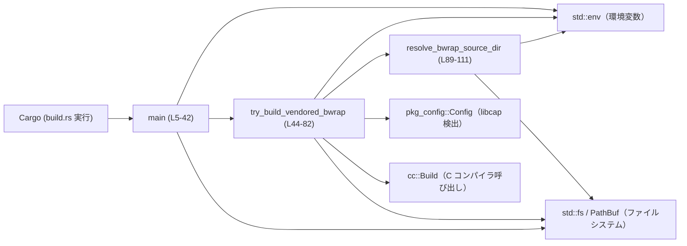
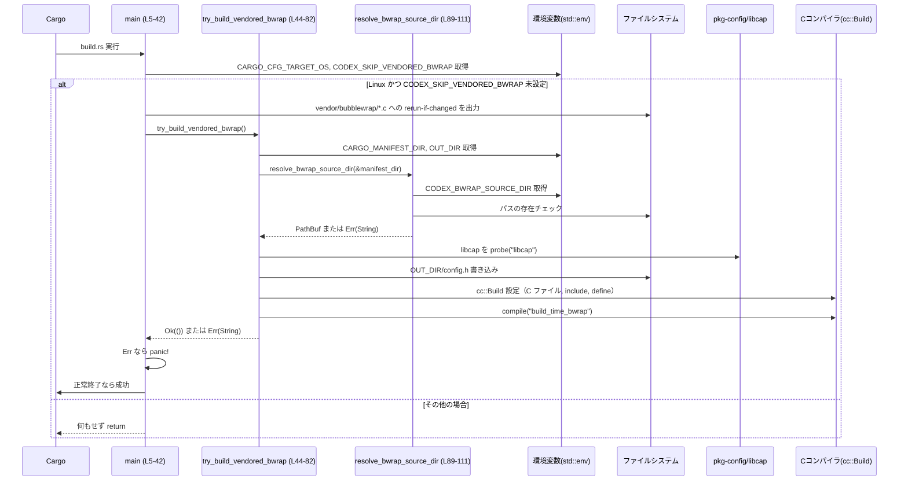

# linux-sandbox/build.rs コード解説

## 0. ざっくり一言

linux-sandbox クレートの **build スクリプト**で、Linux ターゲット向けに vendored な bubblewrap(C コード) をビルドし、`cfg(vendored_bwrap_available)` を設定するためのコードです（`linux-sandbox/build.rs:L5-42, L44-82`）。  

---

## 1. このモジュールの役割

### 1.1 概要

- このファイルは Cargo がビルド時に実行する **build.rs** で、Linux 向けビルド時に bubblewrap を C コンパイラでビルドする役割を持ちます（`linux-sandbox/build.rs:L5-42`）。
- bubblewrap のソースディレクトリを環境変数または vendored ツリーから解決し（`resolve_bwrap_source_dir`、`linux-sandbox/build.rs:L89-111`）、`libcap` を `pkg-config` で検出して C ビルドを行います（`linux-sandbox/build.rs:L49-51, L62-79`）。
- ビルドが成功すれば `vendored_bwrap_available` という `cfg` フラグを Rust コンパイラに伝えます（`linux-sandbox/build.rs:L7, L80`）。

### 1.2 アーキテクチャ内での位置づけ

Cargo から見た build スクリプトと外部コンポーネントの関係を示します。



- `main` は Cargo から直接実行され、ビルド対象 OS や制御用環境変数を見て vendored bubblewrap のビルドを行うかどうかを決めます（`linux-sandbox/build.rs:L34-41`）。
- 実際のビルド処理は `try_build_vendored_bwrap` に委譲されます（`linux-sandbox/build.rs:L39-41, L44-82`）。
- ソースディレクトリ解決は `resolve_bwrap_source_dir` が担当します（`linux-sandbox/build.rs:L48-49, L89-111`）。

### 1.3 設計上のポイント

- **条件付きビルド**
  - OS が Linux 以外、または `CODEX_SKIP_VENDORED_BWRAP` が設定されている場合は、早期 return して何もしません（`linux-sandbox/build.rs:L34-37`）。
- **環境変数駆動**
  - `CARGO_CFG_TARGET_OS`, `CARGO_MANIFEST_DIR`, `OUT_DIR`, `CODEX_BWRAP_SOURCE_DIR`, `CODEX_SKIP_VENDORED_BWRAP` 等の環境変数で挙動を切り替えます（`linux-sandbox/build.rs:L15, L34-36, L45-47, L90`）。
- **cfg フラグの明示**
  - Clippy / rustc に対して `vendored_bwrap_available` という cfg が存在しうることを宣言し（`linux-sandbox/build.rs:L7`）、ビルド成功時に実際に有効化します（`linux-sandbox/build.rs:L80`）。
- **エラーハンドリング**
  - ビルド処理内部は基本的に `Result<(), String>` を使い、エラー内容を `String` 化しています（`linux-sandbox/build.rs:L44, L45-51, L54-61, L89-111`）。
  - 最終的には `main` 側で `panic!` を発生させ、Cargo ビルドを失敗させます（`linux-sandbox/build.rs:L39-41`）。
- **外部ツール依存**
  - `pkg-config` で `libcap` を検出し（`linux-sandbox/build.rs:L49-51`）、`cc` クレートで C コンパイラを呼び出します（`linux-sandbox/build.rs:L62-79`）。
- **並行性**
  - スレッド生成や async は行っておらず、処理はすべて単一スレッドで同期的に実行されます（このチャンク内にスレッド・async の使用は現れません）。

---

## 2. 主要な機能一覧

- vendored bubblewrap の変更検知登録  
  - `vendor/bubblewrap/*.c` に変更があった場合に build.rs を再実行させるための `cargo:rerun-if-changed` を出力します（`linux-sandbox/build.rs:L14-32`）。
- Linux 向け bubblewrap ビルドの有効/無効制御  
  - ターゲット OS と `CODEX_SKIP_VENDORED_BWRAP` に応じて vendored bubblewrap のビルドを行うかどうかを決めます（`linux-sandbox/build.rs:L34-37`）。
- bubblewrap ソースディレクトリの解決  
  - `CODEX_BWRAP_SOURCE_DIR` もしくは vendored ディレクトリ (`../vendor/bubblewrap`) からソースディレクトリを決定します（`linux-sandbox/build.rs:L89-111`）。
- libcap の検出  
  - `pkg-config` を使って `libcap` の存在とインクルードパスを検出します（`linux-sandbox/build.rs:L49-51`）。
- C コンパイル設定と実行  
  - `cc::Build` に C ファイル、インクルードパス、マクロ定義（`_GNU_SOURCE` と `main` → `bwrap_main`）を設定し、`build_time_bwrap` という静的ライブラリをビルドします（`linux-sandbox/build.rs:L62-79`）。
- コンパイル結果の Rust 側への伝達  
  - ビルド成功時に `vendored_bwrap_available` cfg を有効にして、Rust コード側で条件付きコンパイルに使えるようにします（`linux-sandbox/build.rs:L7, L80`）。

---

## 3. 公開 API と詳細解説

### 3.1 型・関数インベントリー

このファイルにはユーザー定義型はなく、3 つの関数が定義されています。

| 名前 | 種別 | シグネチャ | 役割 / 用途 | 根拠 |
|------|------|-----------|-------------|------|
| `main` | 関数 | `fn main()` | Cargo から呼ばれるエントリポイント。OS と環境変数に基づき vendored bubblewrap をビルドするか判断し、必要なら `try_build_vendored_bwrap` を呼び出す | `linux-sandbox/build.rs:L5-42` |
| `try_build_vendored_bwrap` | 関数 | `fn try_build_vendored_bwrap() -> Result<(), String>` | bubblewrap のソースディレクトリ解決、`libcap` 検出、`config.h` 出力、C コードのコンパイルを行うコア処理 | `linux-sandbox/build.rs:L44-82` |
| `resolve_bwrap_source_dir` | 関数 | `fn resolve_bwrap_source_dir(manifest_dir: &Path) -> Result<PathBuf, String>` | `CODEX_BWRAP_SOURCE_DIR` または vendored ディレクトリから bubblewrap のソースディレクトリを決定する | `linux-sandbox/build.rs:L89-111` |

### 3.2 関数詳細

#### `main()`

**概要**

- build.rs のエントリポイントで、Linux ターゲットかどうかと制御用環境変数を確認した上で vendored bubblewrap のビルドを行うかを決定します（`linux-sandbox/build.rs:L5-42`）。

**引数**

引数はありません（build.rs の標準的な `main` 関数です）。

**戻り値**

- 戻り値型は `()` です。  
- ただし内部で `panic!` する可能性があり、その場合 Cargo ビルドは失敗します（`linux-sandbox/build.rs:L39-41`）。

**内部処理の流れ（アルゴリズム）**

1. Clippy/rustc に対して `vendored_bwrap_available` が有効な cfg 名であることを伝え、再ビルド・再実行条件となる環境変数を宣言します（`linux-sandbox/build.rs:L7-12`）。
2. `CARGO_MANIFEST_DIR` からベースディレクトリを推定し、vendored bubblewrap C ファイル 4 つに対して `cargo:rerun-if-changed` を出力します（`linux-sandbox/build.rs:L14-32`）。
3. `CARGO_CFG_TARGET_OS` を取得し、ターゲット OS が `"linux"` でない場合や `CODEX_SKIP_VENDORED_BWRAP` が設定されている場合は、処理を即座に終了します（`linux-sandbox/build.rs:L34-37`）。
4. 上記条件を満たす場合、`try_build_vendored_bwrap` を呼び出し、`Err` の場合は `panic!` によって Cargo ビルドを失敗させます（`linux-sandbox/build.rs:L39-41`）。

**Examples（使用例）**

build.rs 自体は Cargo によって自動的に呼ばれますが、挙動制御の例として:

```bash
# Linux 向けに通常ビルド（vendored bubblewrap を使う）
CARGO_CFG_TARGET_OS=linux cargo build

# vendored bubblewrap をスキップする（システムの bubblewrap などを使う設計の場合）
CARGO_CFG_TARGET_OS=linux CODEX_SKIP_VENDORED_BWRAP=1 cargo build
```

**Errors / Panics**

- `try_build_vendored_bwrap()` が `Err(String)` を返すと `panic!` します（`linux-sandbox/build.rs:L39-41`）。
  - 原因例（詳細は `try_build_vendored_bwrap` 参照）:
    - `CARGO_MANIFEST_DIR` / `OUT_DIR` が取得できない。
    - `CODEX_BWRAP_SOURCE_DIR` / vendored ディレクトリが存在しない。
    - `libcap` が `pkg-config` で検出できない。
    - `config.h` の書き込みに失敗する。
- `CARGO_CFG_TARGET_OS` が未設定でも、`unwrap_or_default()` により空文字列となり、Linux 以外とみなされて早期 return するため、そこで panic はしません（`linux-sandbox/build.rs:L34-35`）。

**Edge cases（エッジケース）**

- `CARGO_CFG_TARGET_OS` が未設定または `"linux"` 以外  
  → vendored bubblewrap ビルドは実行されません（`linux-sandbox/build.rs:L34-37`）。
- `CODEX_SKIP_VENDORED_BWRAP` が設定されている  
  → Linux であっても vendored bubblewrap ビルドはスキップされます（`linux-sandbox/build.rs:L35-37`）。
- vendored C ファイルやディレクトリが存在しない  
  → 直接は `main` では検証せず、`try_build_vendored_bwrap` 内の処理でエラー→panic に至る可能性があります。

**使用上の注意点**

- build.rs で panic すると **クレート全体のビルドが失敗**します。そのため、エラー文言はユーザーが原因を特定しやすい内容である必要があります。
- `CARGO_CFG_TARGET_OS` などの環境変数は通常 Cargo が設定しますが、クロスコンパイルや CI 環境で明示的に上書きしている場合、意図せず vendored bubblewrap がビルドされない可能性があります。

---

#### `try_build_vendored_bwrap() -> Result<(), String>`

**概要**

- vendored bubblewrap をビルドするためのコア処理です。  
  - ビルドディレクトリを取得し（`OUT_DIR`）、  
  - bubblewrap のソースディレクトリを解決し（`resolve_bwrap_source_dir`）、  
  - `pkg-config` で `libcap` を検出し、  
  - `config.h` を生成してから、C コンパイラでソースをビルドします（`linux-sandbox/build.rs:L44-82`）。

**引数**

引数はありません。

**戻り値**

- 成功時: `Ok(())`
- 失敗時: エラーメッセージを含む `Err(String)`

**内部処理の流れ（アルゴリズム）**

1. `CARGO_MANIFEST_DIR` を取得し、`PathBuf` に変換します（`linux-sandbox/build.rs:L45-46`）。
2. `OUT_DIR` を取得し、`PathBuf` に変換します（`linux-sandbox/build.rs:L47`）。
3. `resolve_bwrap_source_dir(&manifest_dir)` で bubblewrap のソースディレクトリを決定します（`linux-sandbox/build.rs:L48-49`）。
4. `pkg_config::Config::new().probe("libcap")` で libcap の存在と設定を取得します。失敗した場合は `Err("libcap not available via pkg-config: ...")` を返します（`linux-sandbox/build.rs:L49-51`）。
5. `OUT_DIR/config.h` を生成し、`PACKAGE_STRING` を定義した内容を書き出します（`linux-sandbox/build.rs:L53-60`）。
6. `cc::Build::new()` で C ビルド設定を構築します（`linux-sandbox/build.rs:L62-72`）。
   - bubblewrap の C ソース（`bubblewrap.c`, `bind-mount.c`, `network.c`, `utils.c`）を追加（`linux-sandbox/build.rs:L64-67`）。
   - `OUT_DIR` と `src_dir` をインクルードパスとして登録（`linux-sandbox/build.rs:L68-69`）。
   - `_GNU_SOURCE` を定義し、`main` を `bwrap_main` にリネーム（`linux-sandbox/build.rs:L70-72`）。
7. `libcap.include_paths` に含まれるパスそれぞれについて `-idirafter<path>` オプションを C コンパイラに渡します（`linux-sandbox/build.rs:L73-76`）。
8. `build.compile("build_time_bwrap")` で実際に C コンパイルを行い、静的ライブラリ（`libbuild_time_bwrap.a` 等）を生成します（`linux-sandbox/build.rs:L79`）。
9. `println!("cargo:rustc-cfg=vendored_bwrap_available")` を出力し、Rust 側で `cfg(vendored_bwrap_available)` を使えるようにします（`linux-sandbox/build.rs:L80`）。

**Examples（使用例）**

build.rs 内から直接呼び出している形が標準的な利用例です（`linux-sandbox/build.rs:L39-41`）。

テスト等で単独呼び出しする場合のイメージ:

```rust
// 擬似的なユニットテスト例（実際にはビルド環境依存です）
#[test]
fn test_try_build_vendored_bwrap() {
    // 必要な環境変数をセット
    std::env::set_var("CARGO_MANIFEST_DIR", "/path/to/codex-rs/linux-sandbox");
    std::env::set_var("OUT_DIR", "/tmp/out");
    // bubblewrap ソースの場所を指定
    std::env::set_var("CODEX_BWRAP_SOURCE_DIR", "/path/to/bubblewrap");

    let result = try_build_vendored_bwrap(); // C コンパイルが走る可能性あり
    assert!(result.is_ok());
}
```

※ 実際のテストでは C コンパイラや `pkg-config` のセットアップが必要となるため、そのまま実行できるかどうかは環境に依存します。

**Errors / Panics**

この関数自体は `panic!` を呼ばず、すべて `Err(String)` に詰めて返します。

主な `Err` 発生条件:

- `CARGO_MANIFEST_DIR` / `OUT_DIR` が取得できない  
  → `env::var` のエラーを `err.to_string()` に変換して返却（`linux-sandbox/build.rs:L45-47`）。
- bubblewrap ソースディレクトリが解決できない  
  → `resolve_bwrap_source_dir` が `Err(String)` を返す場合（`linux-sandbox/build.rs:L48-49, L89-111`）。
- `libcap` が `pkg-config` で検出できない  
  → `"libcap not available via pkg-config: {err}"` というメッセージで `Err` に（`linux-sandbox/build.rs:L49-51`）。
- `config.h` の書き込みに失敗した場合  
  → `"failed to write {path}: {err}"` 形式のエラー文字列（`linux-sandbox/build.rs:L53-61`）。

`cc::Build::compile` 呼び出し時のエラー処理は、このチャンクからは分かりませんが（`linux-sandbox/build.rs:L79`）、通常はコンパイルエラーとして Cargo ビルドが失敗する形になります。

**Edge cases（エッジケース）**

- `CODEX_BWRAP_SOURCE_DIR` が指すディレクトリは存在するが、必要な C ファイル (`bubblewrap.c` 等) がない  
  → この関数内では存在チェックをしていないため、C コンパイラ側でのコンパイルエラーとして現れる可能性があります（`.file()` 呼び出しは単にパスを渡すだけ、`linux-sandbox/build.rs:L64-67`）。
- `libcap.include_paths` が空  
  → `for include_path in libcap.include_paths { .. }` のループは単に何も実行されず、`-idirafter` フラグも追加されません（`linux-sandbox/build.rs:L73-76`）。
- `OUT_DIR` が存在しない  
  → `std::fs::write(&config_h, ...)` でディレクトリ未存在により失敗し、`Err("failed to write ...")` が返される可能性があります（`linux-sandbox/build.rs:L53-61`）。

**使用上の注意点**

- この関数は build.rs の中からのみ呼ぶ想定であり、**通常のライブラリコードから使われることはありません**（exports=0 のメタ情報のとおり）。
- 環境依存（C コンパイラ、`pkg-config`, `libcap` インストール状況）に強く依存するため、CI やクロスコンパイル環境では事前にこれらの準備が必要です。
- `CODEX_BWRAP_SOURCE_DIR` をユーザーが任意のパスに設定できるため、そのパスにある C コードがビルドされます。これは一般的な build.rs と同様の挙動ですが、セキュリティ観点では「ビルド時にどのコードをコンパイルしているか」を把握しておく必要があります。

---

#### `resolve_bwrap_source_dir(manifest_dir: &Path) -> Result<PathBuf, String>`

**概要**

- bubblewrap のソースディレクトリを決定する関数です（`linux-sandbox/build.rs:L89-111`）。
- 優先順位:
  1. `CODEX_BWRAP_SOURCE_DIR` 環境変数が指すパス（存在する場合）
  2. `manifest_dir/../vendor/bubblewrap` が存在する場合
  3. どちらも無ければエラー

**引数**

| 引数名 | 型 | 説明 |
|--------|----|------|
| `manifest_dir` | `&Path` | `CARGO_MANIFEST_DIR` に対応するパス。`../vendor/bubblewrap` を相対的に導出するベースとなります（`linux-sandbox/build.rs:L89, L101`）。 |

**戻り値**

- 成功時: bubblewrap ソースディレクトリを指す `PathBuf`
- 失敗時: 人間が読めるエラーメッセージを格納した `Err(String)`

**内部処理の流れ（アルゴリズム）**

1. `CODEX_BWRAP_SOURCE_DIR` が設定されているかを `env::var` でチェックします（`linux-sandbox/build.rs:L90`）。
   - 取得に成功した場合、そのパスを `PathBuf` にし、`exists()` で存在チェック（`linux-sandbox/build.rs:L91-93`）。
   - 存在すれば `Ok(src_dir)` を返し、存在しなければ `"CODEX_BWRAP_SOURCE_DIR was set but does not exist: ..."` というメッセージで `Err` を返す（`linux-sandbox/build.rs:L95-98`）。
2. `CODEX_BWRAP_SOURCE_DIR` が未設定の場合  
   → `manifest_dir.join("../vendor/bubblewrap")` を vendored ディレクトリとして扱い、存在チェックを行う（`linux-sandbox/build.rs:L101-103`）。
   - 存在すれば `Ok(vendor_dir)` を返す。
3. いずれも存在しない場合  
   → `expected vendored bubblewrap at ..., but it was not found. Set CODEX_BWRAP_SOURCE_DIR ...` というメッセージで `Err` を返す（`linux-sandbox/build.rs:L106-110`）。

**Examples（使用例）**

```rust
use std::path::Path;
use std::env;

// manifest_dir を仮に "/workspace/codex-rs/linux-sandbox" とする
env::set_var("CARGO_MANIFEST_DIR", "/workspace/codex-rs/linux-sandbox");
let manifest_dir = Path::new("/workspace/codex-rs/linux-sandbox");

// 環境変数が優先されるケース
env::set_var("CODEX_BWRAP_SOURCE_DIR", "/opt/bubblewrap-src");
let dir = resolve_bwrap_source_dir(manifest_dir).expect("must exist");
assert_eq!(dir, std::path::PathBuf::from("/opt/bubblewrap-src"));

// 環境変数が未設定で、vendored ディレクトリを使うケース
env::remove_var("CODEX_BWRAP_SOURCE_DIR");
let dir = resolve_bwrap_source_dir(manifest_dir).unwrap();
// => "/workspace/codex-rs/vendor/bubblewrap" が返る想定（存在すれば）
```

**Errors / Panics**

- `CODEX_BWRAP_SOURCE_DIR` が設定されているが、そのパスが存在しない場合  
  → `"CODEX_BWRAP_SOURCE_DIR was set but does not exist: {path}"` で `Err` を返します（`linux-sandbox/build.rs:L95-98`）。
- `CODEX_BWRAP_SOURCE_DIR` 未設定かつ vendored ディレクトリも存在しない場合  
  → vendored パスとともに、環境変数を設定するか vendoring するように促すメッセージで `Err` を返します（`linux-sandbox/build.rs:L106-110`）。

この関数内で `panic!` は使用していません。

**Edge cases（エッジケース）**

- `CODEX_BWRAP_SOURCE_DIR` が存在するがディレクトリではなくファイルである  
  → `exists()` は true なので `Ok` が返されますが、後続の処理（C コンパイル）が失敗する可能性があります（`linux-sandbox/build.rs:L91-93`）。
- パスにアクセス権がない  
  → `exists()` は権限エラーを内部でどう扱うか OS 依存です。このチャンクからは詳細は分かりませんが、一般に権限エラーも `exists()` が false を返すことがあります。その場合、vendored 側のチェックに回り、最終的にエラーメッセージが返る可能性があります（`linux-sandbox/build.rs:L101-110`）。

**使用上の注意点**

- `manifest_dir` は `CARGO_MANIFEST_DIR` に対応するパスである前提で設計されています。異なるパスを渡すと vendored パス解決が期待どおりに動作しない可能性があります。
- `CODEX_BWRAP_SOURCE_DIR` を設定する場合は「存在するディレクトリ」であることのみがチェックされ、構造（中身のファイル）はチェックされません。

---

### 3.3 その他の関数

- このファイルにこれ以上の関数はありません。
- 型定義（構造体・列挙体等）もこのチャンクには現れません。

---

## 4. データフロー

ここでは、Linux ターゲット向けビルド時に vendored bubblewrap をビルドする際の典型的なデータ・制御フローを示します。



要点:

- **環境変数** は build.rs の挙動を大きく左右します（OS 判定・ソースディレクトリ・出力ディレクトリ）。
- **ファイルシステム** はソースディレクトリ・vendored ディレクトリ・`OUT_DIR/config.h` の存在/書き込みに関与します。
- **外部ツール**（C コンパイラ・`pkg-config`）の結果によってビルドが成功するかどうかが決まります。

---

## 5. 使い方（How to Use）

### 5.1 基本的な使用方法

この build.rs は Cargo によって自動的に実行されるため、通常はユーザーが直接関数を呼び出す必要はありません。典型的なビルドフローは次のとおりです。

```bash
# Linux 向けにビルド（デフォルトターゲットが Linux の場合）
cargo build

# 明示的に Linux ターゲットを指定する例
cargo build --target x86_64-unknown-linux-gnu
```

前提:

- bubblewrap が vendored されている (`linux-sandbox/../vendor/bubblewrap` に存在) か、`CODEX_BWRAP_SOURCE_DIR` が有効なディレクトリを指していること（`linux-sandbox/build.rs:L89-111`）。
- `pkg-config` 経由で `libcap` が検出可能であること（`linux-sandbox/build.rs:L49-51`）。
- C コンパイラが利用可能であること（`cc::Build::compile` の呼び出し、`linux-sandbox/build.rs:L79`）。

### 5.2 よくある使用パターン

1. **vendored bubblewrap を使う（デフォルト）**

```bash
# vendor/bubblewrap が存在する前提
cargo build --target x86_64-unknown-linux-gnu
```

- `CODEX_BWRAP_SOURCE_DIR` 未設定  
- `../vendor/bubblewrap` が存在すればそのディレクトリを使います（`linux-sandbox/build.rs:L101-103`）。

1. **ローカルチェックアウトの bubblewrap を使う**

```bash
export CODEX_BWRAP_SOURCE_DIR=/home/user/src/bubblewrap
cargo build --target x86_64-unknown-linux-gnu
```

- `CODEX_BWRAP_SOURCE_DIR` が優先され、そのパスが存在すれば vendored ではなくそちらを使います（`linux-sandbox/build.rs:L90-93`）。

1. **vendored bubblewrap を使わずにビルド**

他の手段で bubblewrap を利用するため、vendored バイナリのビルドをスキップするケース:

```bash
export CODEX_SKIP_VENDORED_BWRAP=1
cargo build --target x86_64-unknown-linux-gnu
```

- `main` が vendored ビルド部分をスキップします（`linux-sandbox/build.rs:L34-37`）。
- この場合 `vendored_bwrap_available` cfg は定義されません（`linux-sandbox/build.rs:L80` に到達しない）。

### 5.3 よくある間違い

```bash
# 間違い例: vendored ディレクトリがないのに環境変数も未設定
# => resolve_bwrap_source_dir がエラーとなり、ビルドが失敗する
rm -rf ../vendor/bubblewrap
cargo build --target x86_64-unknown-linux-gnu

# 正しい例: CODEX_BWRAP_SOURCE_DIR を設定するか、vendored ディレクトリを用意する
export CODEX_BWRAP_SOURCE_DIR=/path/to/bubblewrap
cargo build --target x86_64-unknown-linux-gnu
# または
git submodule update --init vendor/bubblewrap
cargo build --target x86_64-unknown-linux-gnu
```

```bash
# 間違い例: libcap がインストールされていない環境
# => "libcap not available via pkg-config" エラーでビルド失敗
cargo build --target x86_64-unknown-linux-gnu

# 正しい例: OS のパッケージマネージャで libcap 開発パッケージをインストール
sudo apt-get install libcap-dev  # 例: Debian/Ubuntu 系
cargo build --target x86_64-unknown-linux-gnu
```

### 5.4 使用上の注意点（まとめ）

- **前提条件**
  - bubblewrap ソースが `CODEX_BWRAP_SOURCE_DIR` か `../vendor/bubblewrap` のどちらかで入手可能であること（`linux-sandbox/build.rs:L89-111`）。
  - `pkg-config` が `libcap` を検出できる状態であること（`linux-sandbox/build.rs:L49-51`）。
- **禁止/非推奨事項**
  - 信頼できないディレクトリを `CODEX_BWRAP_SOURCE_DIR` に指定すると、その C コードがビルド時にコンパイルされるため、安全性に注意が必要です（一般的な build.rs と同様のリスク）。
- **エラー・パニック条件**
  - 上記前提条件が満たされない場合、`try_build_vendored_bwrap` が `Err(String)` を返し、`main` で `panic!` するためビルド全体が失敗します（`linux-sandbox/build.rs:L39-41`）。
- **並行性**
  - build.rs は単一スレッドで実行されており、共有可変状態やデータ競合に関する配慮は不要です。このチャンク内にスレッドや `async` の使用はありません。

---

## 6. 変更の仕方（How to Modify）

### 6.1 新しい機能を追加する場合

例: vendored bubblewrap に新しい C ファイル `foo.c` が追加された場合。

1. **変更対象ファイル**
   - `linux-sandbox/build.rs`（このファイル）

2. **追加ステップ**

   - `rerun-if-changed` 対象に追加:

     ```rust
     println!(
         "cargo:rerun-if-changed={}",
         vendor_dir.join("foo.c").display()
     ); // linux-sandbox/build.rs:L17-32 と同様のパターン
     ```

   - `cc::Build` にもファイルを追加:

     ```rust
     build
         .file(src_dir.join("bubblewrap.c"))
         // ...
         .file(src_dir.join("utils.c"))
         .file(src_dir.join("foo.c")); // 新規ファイル
     ```

3. **依存関係**
   - 追加した C ファイルが `config.h` や `libcap` に依存する場合は、既存の include/define 設定を流用できます（`linux-sandbox/build.rs:L68-72`）。

### 6.2 既存の機能を変更する場合

- **ソースディレクトリ解決ロジックを変更したい場合**
  - `resolve_bwrap_source_dir` のみに閉じており、`manifest_dir` に対するパス計算とエラーメッセージの整合性に注意します（`linux-sandbox/build.rs:L89-111`）。
  - `try_build_vendored_bwrap` は `PathBuf` を受け取るだけなので、返り値の意味を変えないことが重要です（「bubblewrap ソースのルートディレクトリ」という契約）。

- **libcap 以外のライブラリに依存させたい場合**
  - `pkg_config::Config::new().probe("libcap")` の部分を変更する必要があります（`linux-sandbox/build.rs:L49-51`）。
  - 追加ライブラリの include パスやライブラリパスの取り扱いを、`cc::Build` に反映させるかどうかも検討が必要です。

- **影響範囲の確認**
  - `vendored_bwrap_available` cfg を使っている他ファイルは、このチャンクには現れません。ワークスペース全体で `cfg(vendored_bwrap_available)` を検索し、挙動変化がないか確認する必要があります。

- **テスト**
  - 専用テストコードはこのチャンクには存在しません。変更後は、代表的な環境（Linux / non-Linux、vendored 有無、`CODEX_BWRAP_SOURCE_DIR` 有無）で `cargo build -vv` などを実行し、エラーメッセージとビルド結果を確認することが実質的なテストになります。

---

## 7. 関連ファイル

この build.rs と密接に関係すると考えられるパス一覧です。

| パス | 役割 / 関係 |
|------|-------------|
| `../vendor/bubblewrap/bubblewrap.c` | vendored bubblewrap のメイン C ソース。`build.rs` からコンパイル対象として登録されています（`linux-sandbox/build.rs:L16-20, L64`）。 |
| `../vendor/bubblewrap/bind-mount.c` | bubblewrap の bind mount 関連 C ソース（`linux-sandbox/build.rs:L21-24, L65`）。 |
| `../vendor/bubblewrap/network.c` | bubblewrap のネットワーク設定関連 C ソース（`linux-sandbox/build.rs:L25-28, L66`）。 |
| `../vendor/bubblewrap/utils.c` | bubblewrap のユーティリティ C ソース（`linux-sandbox/build.rs:L29-32, L67`）。 |
| （不明）`cfg(vendored_bwrap_available)` を参照する Rust ファイル | build.rs が出力する cfg フラグを利用して、vendored bubblewrap の有無で挙動を切り替えている可能性がありますが、このチャンクには具体的な参照箇所は現れません。 |

このチャンクにはテストコードや `vendored_bwrap_available` を実際に使っているコードは含まれていないため、それらの詳細は「不明」です。
