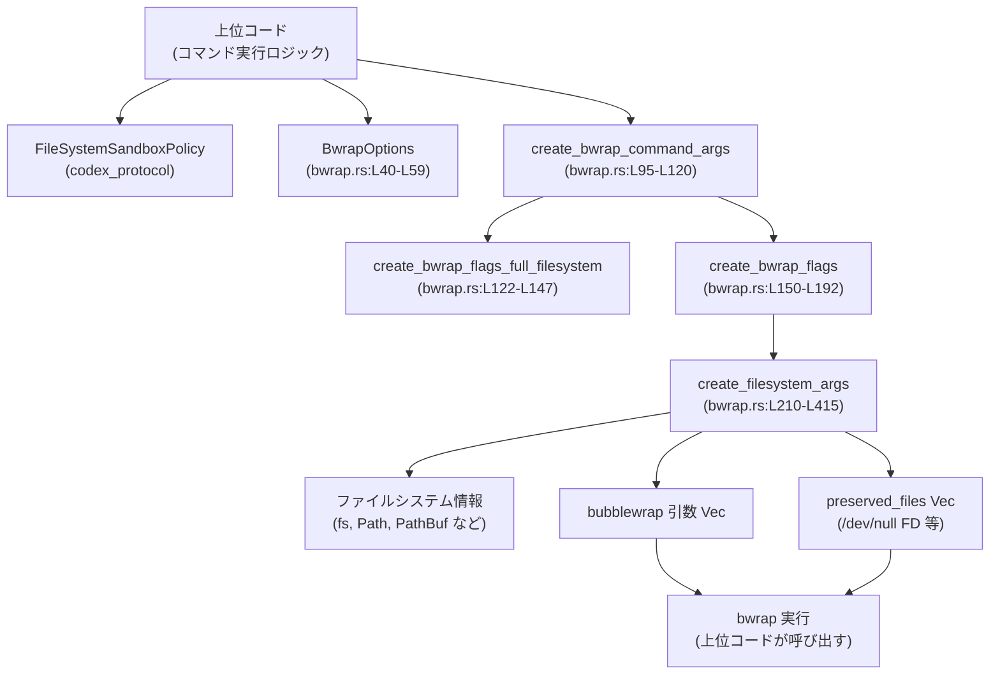
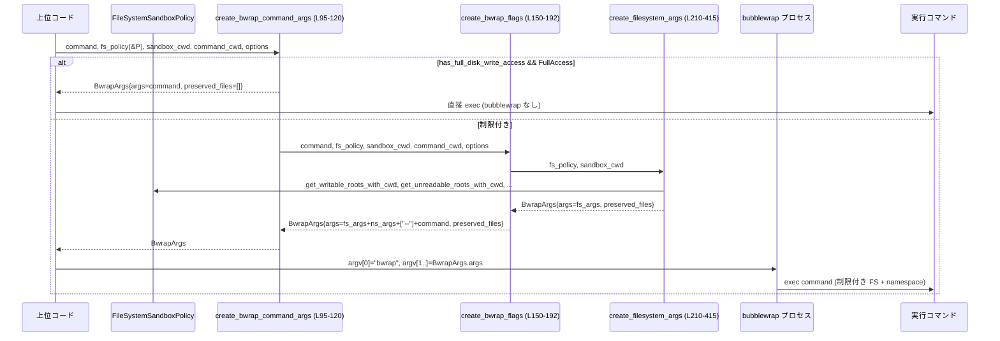

# linux-sandbox/src/bwrap.rs コード解説

## 0. ざっくり一言

Linux 上で bubblewrap（`bwrap`）を使い、**「基本は読み取り専用・一部だけ書き込み許可」** というポリシーベースのファイルシステムサンドボックスを構成するためのヘルパーです。  
`FileSystemSandboxPolicy` から bubblewrap の引数列（と保護用のファイルディスクリプタ）を組み立てます。

---

## 1. このモジュールの役割

### 1.1 概要

- このモジュールは **Linux 上のコマンド実行時に、ファイルシステムとネットワークを制限するための bubblewrap ラッパー** を提供します。
- 入力となる `FileSystemSandboxPolicy` に基づき、
  - 読み取り専用・書き込み可・アクセス禁止（unreadable）の各パスを bubblewrap のマウント構成に変換します。
  - ネットワーク名前空間（ホスト共有／完全分離／プロキシ専用）と `/proc` マウント有無を制御します。
- macOS の Seatbelt サンドボックスと同様に、
  - デフォルトは読み取り専用、
  - 明示的な writable roots を上に重ねる、
  - その下の `.git`, `.codex` などの「保護サブパス」は再び読み取り専用 or 完全禁止、
  という挙動を再現します（bwrap.rs:L88-L94）。

### 1.2 アーキテクチャ内での位置づけ

このモジュールは「**ポリシー → bubblewrap 引数**」の変換層です。実際のプロセス生成や seccomp 設定は別コンポーネントが担当していると読み取れます（seccomp などはモジュール先頭コメントのみで、このチャンクには実装は登場しません）。



### 1.3 設計上のポイント

- **純粋な引数生成ロジック**  
  - グローバル状態やスレッドローカルは持たず、すべて引数とローカル変数で完結しています。
- **ポリシー駆動のマウント構成**  
  - `FileSystemSandboxPolicy` のメソッド（`has_full_disk_read_access`, `get_writable_roots_with_cwd` など）に全面的に依存し、Linux 固有の bubblewrap 引数に変換しています（bwrap.rs:L210-L222）。
- **シンボリックリンクを明示的に扱う**  
  - writable root や carve-out が symlink を含む場合でも、escape やファイル／ディレクトリ種別の不整合を避けるため、canonicalize を使って *実体側* にマウントする処理があります（bwrap.rs:L425-L456, L624-L655）。
- **エラーハンドリング**  
  - ほとんどのファイルシステム操作はエラーを握りつぶして「保守的な安全側」に倒します。
  - 明示的にエラーとして返しうるのは主に `/dev/null` のオープン失敗です（bwrap.rs:L605-L607）。
- **並行性**  
  - 共有ミュータブル状態を持たないため、同一プロセス内で複数スレッドから呼ばれてもデータ競合は発生しない構造です（`&`/所有権ベース）。

---

## 2. 主要な機能一覧（コンポーネントインベントリー）

### 2.1 型・定数一覧

| 名前 | 種別 | 可視性 | 役割 / 用途 | 定義位置 |
|------|------|--------|-------------|----------|
| `LINUX_PLATFORM_DEFAULT_READ_ROOTS` | `const &[&str]` | モジュール内 | 制限付き ReadOnly ポリシー時に、自動的に読み取り許可に含める Linux プラットフォーム標準ディレクトリ（`/usr`, `/lib` 等）のリスト | `bwrap.rs:L24-L38` |
| `BwrapOptions` | `struct` | `pub(crate)` | bubblewrap 実行時の追加オプション（`mount_proc`, `network_mode`）を保持する | `bwrap.rs:L40-L59` |
| `BwrapNetworkMode` | `enum` | `pub(crate)` | ネットワーク名前空間の扱い（`FullAccess`, `Isolated`, `ProxyOnly`）を表す | `bwrap.rs:L61-L80` |
| `BwrapArgs` | `struct` | `pub(crate)` | bubblewrap に渡す引数列 (`args`) と、`--ro-bind-data` 用に保持しておく `File` 群 (`preserved_files`) をまとめた返却値 | `bwrap.rs:L82-L86` |

### 2.2 関数一覧（本体ロジック）

| 名前 | 役割（1 行） | 定義位置 |
|------|--------------|----------|
| `create_bwrap_command_args` | ポリシーに応じて、コマンドをそのまま実行するか bubblewrap でラップするかを決め、最終的な引数を組み立てる | `bwrap.rs:L95-L120` |
| `create_bwrap_flags_full_filesystem` | フルディスク書き込み許可時に、ファイルシステムはそのまま／ネットワークだけ制限する bubblewrap 引数を生成する | `bwrap.rs:L122-L147` |
| `create_bwrap_flags` | 制限付きポリシー時に、ファイルシステムマウントと名前空間オプションを組み合わせた完全な bubblewrap 引数を生成する | `bwrap.rs:L150-L192` |
| `create_filesystem_args` | `FileSystemSandboxPolicy` から、読み取り／書き込み／禁止パスのマウント構成を bubblewrap 引数列に落とし込むコアロジック | `bwrap.rs:L210-L415` |
| `path_to_string` | `Path` を UTF-8 文字列にロスレス／ロスフル変換して bubblewrap 引数用の `String` にする | `bwrap.rs:L417-L419` |
| `path_depth` | パスのコンポーネント数を数え、マウント順序のソートに利用する | `bwrap.rs:L421-L422` |
| `canonical_target_if_symlinked_path` | パスの途中に symlink が含まれている場合、その実体の canonical パスを返す（なければ `None`） | `bwrap.rs:L425-L456` |
| `remap_paths_for_symlink_target` | symlink な root の論理パス配下にある carve-out パス群を、実体側パスに写像する | `bwrap.rs:L458-L469` |
| `normalize_command_cwd_for_bwrap` | コマンドの cwd を canonicalize し、bubblewrap 内のマウントと整合するように正規化する | `bwrap.rs:L471-L475` |
| `append_mount_target_parent_dir_args` | 指定したマウントターゲットの親ディレクトリ階層を `--dir` で事前作成する bubblewrap 引数を追加する | `bwrap.rs:L477-L495` |
| `append_read_only_subpath_args` | 書き込み可能 root の直下で読み取り専用に戻すサブパスに対して、`--ro-bind` の引数を追加する | `bwrap.rs:L497-L530` |
| `append_unreadable_root_args` | アクセス禁止（unreadable）な root に対して、存在有無や symlink を考慮しつつ適切にマスクするための bubblewrap 引数を追加する | `bwrap.rs:L532-L567` |
| `append_existing_unreadable_path_args` | 実在する unreadable パス（ディレクトリ／ファイル）用のマスク処理を行う（tmpfs マスクまたは `/dev/null` バインド） | `bwrap.rs:L569-L615` |
| `is_within_allowed_write_paths` | パスが書き込み許可 root 配下かどうかを判定する | `bwrap.rs:L617-L621` |
| `canonical_target_for_symlink_in_path` | allowed write path 内にある symlink を辿り、その canonical 実体パスを返す（escape 対策に利用） | `bwrap.rs:L624-L659` |
| `find_first_non_existent_component` | パスを先頭から辿り、最初に存在しないコンポーネントを返す | `bwrap.rs:L665-L690` |

### 2.3 テストモジュール

- `mod tests`  
  - 多数のテスト関数があり、シンボリックリンク／ネストした writable & unreadable roots／プラットフォームデフォルトなど、さまざまなパターンを検証しています（`#[cfg(test)] mod tests { ... }` `bwrap.rs:L692-…`）。
  - 本チャンクでは各テスト関数の詳細行番号は省略し、挙動は後述の「テストの観点」でまとめます。

---

## 3. 公開 API と詳細解説

### 3.1 型一覧（構造体・列挙体）

| 名前 | 種別 | フィールド / バリアント | 役割 / 用途 | 定義位置 |
|------|------|------------------------|-------------|----------|
| `BwrapOptions` | 構造体 | `mount_proc: bool` / `network_mode: BwrapNetworkMode` | bubblewrap 実行時の `/proc` マウントとネットワーク名前空間の扱いを指定します。`Default` 実装で安全寄りの初期値（`mount_proc = true`, `FullAccess`）が設定されます。 | `bwrap.rs:L40-L59` |
| `BwrapNetworkMode` | 列挙体 | `FullAccess`, `Isolated`, `ProxyOnly` | bubblewrap でネットワークを unshare するかどうかを表します。`FullAccess` のみホストネットワーク共有で、それ以外は unshare されます（`should_unshare_network`）。 | `bwrap.rs:L61-L80` |
| `BwrapArgs` | 構造体 | `args: Vec<String>`, `preserved_files: Vec<File>` | bubblewrap に渡す引数列と、`--ro-bind-data` で使うためにオープン状態を維持すべき `File` 群です。呼び出し側はこれを使って `Command` 等を構成します。 | `bwrap.rs:L82-L86` |

---

### 3.2 関数詳細（主要 7 件）

#### `create_bwrap_command_args(command: Vec<String>, file_system_sandbox_policy: &FileSystemSandboxPolicy, sandbox_policy_cwd: &Path, command_cwd: &Path, options: BwrapOptions) -> Result<BwrapArgs>`

**概要**

- 与えられたコマンドラインとファイルシステムサンドボックスポリシーから、  
  - 必要なら bubblewrap によるラップを行い、  
  - 不要ならコマンドをそのまま返す  
 という判断を行います（bwrap.rs:L95-L120）。

**引数**

| 引数名 | 型 | 説明 |
|--------|----|------|
| `command` | `Vec<String>` | 実行したいコマンドライン（`argv[0]` を含む）です。bubblewrap でラップされる場合は `--` の後ろに展開されます。 |
| `file_system_sandbox_policy` | `&FileSystemSandboxPolicy` | ファイルシステムの読み書きポリシーを表すオブジェクトです。`has_full_disk_write_access` などを提供します。 |
| `sandbox_policy_cwd` | `&Path` | サンドボックスポリシーの基準となるカレントディレクトリ（ポリシー側の解釈に使用）。 |
| `command_cwd` | `&Path` | 実際にコマンドを実行する（論理上の）カレントディレクトリです。symlink の正規化対象になります。 |
| `options` | `BwrapOptions` | `/proc` マウント有無とネットワークモード（`BwrapNetworkMode`）を指定します。 |

**戻り値**

- `Result<BwrapArgs>`  
  - `Ok(BwrapArgs)` の場合: bubblewrap 用引数列と preserved files が含まれます。
    - フルディスク書き込み + `FullAccess` ネットワークの場合は、`args` は元の `command` そのもの、`preserved_files` は空です（bwrap.rs:L102-L107）。
  - `Err(e)` の場合: 主に `/dev/null` オープン失敗に起因する I/O エラー（詳しくは後述）です。

**内部処理の流れ**

1. `file_system_sandbox_policy.has_full_disk_write_access()` を評価します（bwrap.rs:L102）。
2. フルディスク書き込み許可の場合:
   - `options.network_mode == BwrapNetworkMode::FullAccess` なら、bubblewrap を使わず `command` そのものを返します（bwrap.rs:L103-L107）。
   - そうでなければ、`create_bwrap_flags_full_filesystem(command, options)` を呼んで、ネットワークのみ制限しつつファイルシステムはフルアクセスでラップします（bwrap.rs:L108-L110）。
3. フルディスク書き込み許可でない場合:
   - `create_bwrap_flags(...)` を呼び出し、ファイルシステム制限を含む bubblewrap 引数を組み立てます（bwrap.rs:L113-L119）。

**Examples（使用例）**

基本的な使用例（ポリシー詳細は疑似コード）:

```rust
use std::path::Path;
use codex_protocol::protocol::{SandboxPolicy, FileSystemSandboxPolicy};
use linux_sandbox::bwrap::{BwrapOptions, BwrapNetworkMode, create_bwrap_command_args};

// 実行したいコマンド
let command = vec!["/bin/true".to_string()];

// 何らかの SandboxPolicy から FileSystemSandboxPolicy を生成する
let sandbox_policy = SandboxPolicy::DangerFullAccess;              // 例: フルアクセス
let fs_policy = FileSystemSandboxPolicy::from(&sandbox_policy);

let options = BwrapOptions {
    mount_proc: true,
    network_mode: BwrapNetworkMode::ProxyOnly, // ネットワークだけ制限
};

let bwrap_args = create_bwrap_command_args(
    command,
    &fs_policy,
    Path::new("/"),   // ポリシー基準 cwd
    Path::new("/"),   // コマンド実行 cwd
    options,
)?;

// bwrap_args.args をそのまま std::process::Command などに渡す
```

**Errors / Panics**

- `Result` の `Err`:
  - 下層の `create_filesystem_args` → `append_existing_unreadable_path_args` → `File::open("/dev/null")` のオープン失敗時に I/O エラーが返ります（bwrap.rs:L605-L607）。
- 明示的な `panic!` や `unwrap()` は本関数内では使用していません。

**Edge cases（エッジケース）**

- フルディスク書き込み + `FullAccess` ネットワーク:
  - bubblewrap を一切使わず、コマンドをそのまま返します（テスト `full_disk_write_full_network_returns_unwrapped_command` で検証、bwrap.rs テスト部）。
- フルディスク書き込み + ネットワーク制限:
  - `create_bwrap_flags_full_filesystem` を通じて、ファイルシステムはフルアクセスのまま、ネットワークだけ unshare されます（テスト `full_disk_write_proxy_only_keeps_full_filesystem_but_unshares_network`）。
- 制限付きポリシー:
  - 必ず bubblewrap ラップとなり、ファイルシステム制限が適用されます。

**使用上の注意点**

- この関数は **「bwrap も含めた最終的な argv」** を返すため、呼び出し側はこれをそのまま `Command::new("bwrap")` などに渡す想定です（実際の呼び出しコードはこのチャンクには存在しません）。
- `preserved_files` の中身は **閉じてはいけないファイルディスクリプタ** です。子プロセスが `/dev/null` などを参照できるよう、プロセス生成までライフタイムを維持する必要があります。

---

#### `create_bwrap_flags_full_filesystem(command: Vec<String>, options: BwrapOptions) -> BwrapArgs`

**概要**

- フルディスク書き込みアクセスが許可されている場合に、**ファイルシステムはホストと同じ** まま、ユーザ名前空間・PID 名前空間（および必要に応じてネットワーク名前空間・`/proc`）を分離する bubblewrap 引数を生成します（bwrap.rs:L122-L147）。

**引数**

| 引数名 | 型 | 説明 |
|--------|----|------|
| `command` | `Vec<String>` | 実行するコマンドライン（`argv[0]` 含む）。`--` の後ろに展開されます。 |
| `options` | `BwrapOptions` | ネットワーク分離や `/proc` マウント有無を指定します。 |

**戻り値**

- `BwrapArgs`  
  - `args` には `["--new-session", "--die-with-parent", "--bind", "/", "/", "--unshare-user", "--unshare-pid", ... , "--", <command...>]` の形で引数が詰められます（bwrap.rs:L123-L146）。
  - `preserved_files` は空です。

**内部処理の流れ**

1. `args` にセッション分離・親プロセスに追随するオプションを設定（`--new-session`, `--die-with-parent`）（bwrap.rs:L123-L125）。
2. `--bind / /` でホストのルートファイルシステムをそのまま再バインド（書き込み可能）します（bwrap.rs:L126-L128）。
3. `--unshare-user`, `--unshare-pid` でユーザ名前空間と PID 名前空間を分離します（bwrap.rs:L129-L132）。
4. `options.network_mode.should_unshare_network()` が真なら `--unshare-net` を追加し、ネットワーク名前空間も分離します（bwrap.rs:L134-L135, L76-L79）。
5. `options.mount_proc` が真なら `--proc /proc` を追加し、新しい `/proc` をマウントします（bwrap.rs:L137-L139）。
6. 最後に `"--"` と `command` を追加し、`BwrapArgs` にまとめて返します（bwrap.rs:L141-L146）。

**Examples（使用例）**

```rust
let command = vec!["/bin/true".to_string()];
let options = BwrapOptions {
    mount_proc: true,
    network_mode: BwrapNetworkMode::ProxyOnly,
};

let bwrap = create_bwrap_flags_full_filesystem(command, options);

// bwrap.args はテストと同様の形:
// ["--new-session", "--die-with-parent", "--bind", "/", "/", "--unshare-user",
//  "--unshare-pid", "--unshare-net", "--proc", "/proc", "--", "/bin/true"]
```

**Errors / Panics**

- この関数は `Result` を返さず、I/O も行わないため、失敗しません。
- `panic!` も使用していません。

**Edge cases**

- `mount_proc = false` の場合、`--proc /proc` は追加されません（コメントにも「制約のあるコンテナ環境では拒否されうる」と記載、bwrap.rs:L43-L47, L137-L140）。
- `network_mode = FullAccess` の場合、`--unshare-net` は追加されません。

**使用上の注意点**

- **ファイルシステム制限は一切行われない** ため、セキュリティ上は「名前空間分離だけ」の状態です。  
  `FileSystemSandboxPolicy::has_full_disk_write_access()` が真であるケースに限定して使われます。

---

#### `create_bwrap_flags(command: Vec<String>, file_system_sandbox_policy: &FileSystemSandboxPolicy, sandbox_policy_cwd: &Path, command_cwd: &Path, options: BwrapOptions) -> Result<BwrapArgs>`

**概要**

- 制限付きファイルシステムポリシー用の「完全な bubblewrap 引数列」を生成します。  
  `create_filesystem_args` で作ったマウント構成に、ユーザ／PID／ネットワークの名前空間と `/proc` マウント、`--chdir` を組み合わせます（bwrap.rs:L150-L192）。

**引数**

`create_bwrap_command_args` と同じ意味の引数に、`options` が加わる形です（bwrap.rs:L150-L155）。

**戻り値**

- `Result<BwrapArgs>`  
  - `args`: bubblewrap の全引数（`argv[0]` 以外）を順に並べたもの。
  - `preserved_files`: `create_filesystem_args` から受け継いだ `File` 群。

**内部処理の流れ**

1. `create_filesystem_args(file_system_sandbox_policy, sandbox_policy_cwd)?` を呼び、ファイルシステム関連の `args` と `preserved_files` を取得します（bwrap.rs:L157-L160）。
2. `normalize_command_cwd_for_bwrap(command_cwd)` でコマンドの cwd を canonicalize します（bwrap.rs:L161, L471-L475）。
3. 空の `args` に `"--new-session"`, `"--die-with-parent"` を push し、`filesystem_args` を extend します（bwrap.rs:L162-L165）。
4. `"--unshare-user"`, `"--unshare-pid"` を追加し、必要なら `"--unshare-net"` を追加します（bwrap.rs:L166-L172）。
5. `options.mount_proc` が真なら `"--proc", "/proc"` を追加します（bwrap.rs:L173-L176）。
6. `normalized_command_cwd.as_path() != command_cwd` の場合は `"--chdir", <canonical cwd>` を追加します（bwrap.rs:L178-L185）。
7. `"--"` と `command` を追加し、`BwrapArgs` として `Ok(..)` を返します（bwrap.rs:L186-L191）。

**Examples（使用例）**

テスト `restricted_policy_chdirs_to_canonical_command_cwd` が典型的なシナリオです（bwrap.rs テスト部）:

- 論理 cwd（symlink 経由）と実体 cwd が異なる場合でも、
  - `--chdir` には canonical な cwd が使われる。
  - 読み取り root の `--ro-bind` も symlink ではなく canonical なパスでマウントされる。

**Errors / Panics**

- `create_filesystem_args` のエラーを `?` でそのまま返します。
- その他、`normalize_command_cwd_for_bwrap` の内部で `canonicalize` に失敗した場合は `unwrap_or_else` で元のパスを使うため、エラーにはなりません（bwrap.rs:L471-L475）。

**Edge cases**

- `command_cwd` が存在しない／権限不足で canonicalize できない場合:
  - `normalized_command_cwd == command_cwd` となり `--chdir` は付与されません（bwrap.rs:L178-L185, L471-L475）。
- `filesystem_args` が非常に多くなるケース（大量の carve-out）でも、単に `args` が長くなるだけで特別な挙動はありません。

**使用上の注意点**

- `BwrapArgs::preserved_files` を必ず子プロセス生成まで生存させる必要があります。
- `sandbox_policy_cwd` と `command_cwd` を混同すると、ポリシー上の「カレントディレクトリ」と実行時 cwd の対応がずれ、意図しないマウント構成になる可能性があります。

---

#### `create_filesystem_args(file_system_sandbox_policy: &FileSystemSandboxPolicy, cwd: &Path) -> Result<BwrapArgs>`

**概要**

- このモジュールの**コアロジック**です。  
  `FileSystemSandboxPolicy` の内容から、bubblewrap のファイルシステムマウント引数と、必要な `preserved_files` を構築します（bwrap.rs:L210-L415）。

**引数**

| 引数名 | 型 | 説明 |
|--------|----|------|
| `file_system_sandbox_policy` | `&FileSystemSandboxPolicy` | 読み取り／書き込み／不可パスを含む抽象ポリシー。 |
| `cwd` | `&Path` | ポリシー評価に使用されるカレントディレクトリ。special path（`CurrentWorkingDirectory` 等）の解決に使われます。 |

**戻り値**

- `Result<BwrapArgs>`  
  - `args`: `--ro-bind`, `--bind`, `--tmpfs`, `--dev`, `--perms`, `--remount-ro` 等の bubblewrap 引数一式。
  - `preserved_files`: 一部の unreadable ファイル用に開いた `/dev/null` の `File` オブジェクト（必要な場合のみ。最大 1 個）。

**内部処理の流れ（概要）**

1. **writable / unreadable roots の取得とフィルタリング**  
   - `get_writable_roots_with_cwd(cwd)` から writable roots を取得し、`root.exists()` を満たさないものはスキップします（bwrap.rs:L217-L221）。  
     → クロスプラットフォーム設定時に「存在しない path で失敗しない」ことが目的（テスト `ignores_missing_writable_roots` 参照）。
   - `get_unreadable_roots_with_cwd(cwd)` で unreadable roots を取得します（bwrap.rs:L222）。

2. **読み取り root のベースマウント構成**  
   - `has_full_disk_read_access()` が真なら:
     - `["--ro-bind", "/", "/", "--dev", "/dev"]` をベースとします（bwrap.rs:L224-L236）。
   - それ以外の場合:
     - `["--tmpfs", "/", "--dev", "/dev"]` をベースとし（bwrap.rs:L237-L245）、
     - `get_readable_roots_with_cwd(cwd)` と `include_platform_defaults()` から `readable_roots` を構築します（bwrap.rs:L247-L258）。
     - `readable_roots` に `/` が含まれる場合は、「広い読み取り権限」とみなして `--ro-bind / /` に切り替えます（bwrap.rs:L261-L271）。
     - そうでない場合は、各 readable root に `--ro-bind root root` を追加します。  
       writable root の配下にある readable root は、symlink を解決して実体側にマウントします（bwrap.rs:L273-L291）。

3. **writable roots と unreadable roots の関係整理**  
   - `allowed_write_paths` に writable roots の `root` と symlink 実体を集めます（bwrap.rs:L297-L305）。
   - `unreadable_paths` に unreadable roots の集合を構築します（bwrap.rs:L306-L309）。
   - writable roots をパス深さでソートし（bwrap.rs:L310-L311）、
     - unreadable roots のうち「writable root の祖先であり、かつ self は writable root 配下でないもの」を `unreadable_ancestors_of_writable_roots` として抽出します（bwrap.rs:L315-L327）。

4. **祖先側 unreadable roots のマスク**  
   - `unreadable_ancestors_of_writable_roots` を浅い順にソートし、`append_unreadable_root_args` でマスク処理を追加します（bwrap.rs:L328-L337）。

5. **各 writable root に対する処理**  
   各 `writable_root` について（bwrap.rs:L339-L389）:
   - symlink target を取得 (`canonical_target_if_symlinked_path`) し、必要に応じて親ディレクトリを `--dir` で再作成します（bwrap.rs:L341-L351, L477-L495）。
   - `--bind mount_root mount_root` で書き込み可能にします（bwrap.rs:L353-L356）。
   - `writable_root.read_only_subpaths` から unreadable roots と重複しないものを抽出し、symlink root の場合は実体側に remap してから、パス深さ順に `append_read_only_subpath_args` で読み取り専用サブパスを適用します（bwrap.rs:L358-L370）。
   - `unreadable_roots` のうち当該 root 配下にあるものを（必要なら remap して）`append_unreadable_root_args` でマスクします（bwrap.rs:L371-L388）。

6. **writable roots と無関係な unreadable roots のマスク**  
   - writable roots と祖先／子関係にない unreadable roots を `rootless_unreadable_roots` として抽出し（bwrap.rs:L391-L400）、
   - パス深さ順に `append_unreadable_root_args` を適用します（bwrap.rs:L401-L408）。

7. **結果の返却**  
   - 最終的な `args` と `preserved_files` を `BwrapArgs` にまとめて返します（bwrap.rs:L411-L414）。

**Examples（使用例）**

簡略化した呼び出し例（詳細ポリシーは擬似）:

```rust
use std::path::Path;
use codex_protocol::protocol::{FileSystemSandboxPolicy, FileSystemSandboxEntry,
    FileSystemPath, FileSystemAccessMode, FileSystemSpecialPath};

let cwd = Path::new("/workspace");

// 「workspace は書き込み許可、`blocked` はアクセス禁止」のポリシー例
let policy = FileSystemSandboxPolicy::restricted(vec![
    FileSystemSandboxEntry {
        path: FileSystemPath::Path { path: AbsolutePathBuf::try_from("/workspace")? },
        access: FileSystemAccessMode::Write,
    },
    FileSystemSandboxEntry {
        path: FileSystemPath::Path { path: AbsolutePathBuf::try_from("/workspace/blocked")? },
        access: FileSystemAccessMode::None,
    },
]);

let BwrapArgs { args, preserved_files } =
    create_filesystem_args(&policy, cwd)?;

// args には `--bind /workspace /workspace` と
// `--tmpfs /workspace/blocked` + `--remount-ro /workspace/blocked` などが含まれる
```

**Errors / Panics**

- `Result` エラー:
  - ファイル・ディレクトリが unreadable root として指定されており、かつ **ファイル** である場合、
    - `/dev/null` を `File::open("/dev/null")?` で開く処理が初回に行われます（bwrap.rs:L605-L607）。
    - これが失敗すると（極めて稀ですが）`create_filesystem_args` 全体が `Err` を返します。
- それ以外のファイルシステムアクセス（`exists`, `symlink_metadata`, `canonicalize` 等）は、いずれも `Option` に畳み込まれるか誤り側で早期終了するよう実装されており、エラーとしては返されません。

**Edge cases（エッジケース）**

- **存在しない writable root**  
  - `root.exists()` でフィルタリングされ、無視されます（bwrap.rs:L217-L221）。  
    テスト `ignores_missing_writable_roots` がこの挙動を確認しています。
- **存在しない unreadable root**  
  - `find_first_non_existent_component` で最初の欠損コンポーネントを特定し、それが writable root 配下なら `/dev/null` をその位置に `--ro-bind` します（bwrap.rs:L550-L557）。  
    → サンドボックス内でそのパス以下の階層が新規作成されるのを防ぎます。
- **symlink を含む writable root / carve-out**  
  - `canonical_target_if_symlinked_path` や `canonical_target_for_symlink_in_path` を使って実体側にマウントし、  
    「シンボリックリンク経由で sandbox の外（`outside-private` など）へ抜ける」ケースをテストで防いでいます（テスト `symlinked_writable_roots_mask_nested_symlink_escape_paths_without_binding_targets`）。
- **混在する read-only / unreadable / writable carve-out**  
  - ソート順とマスク順（祖先→子）の制御により、
    - まず unreadable parent を `tmpfs`＋`--perms` でマスク、
    - その後、必要な writable descendants を `--dir` で作成し、最後に `--bind` で再度書き込み許可にする、  
    という順序を保証しています（複数のテストで検証）。

**使用上の注意点**

- `FileSystemSandboxPolicy` の設計に強く依存しているため、**新しい access mode や special path を追加する場合は、この関数への影響を必ず確認する必要** があります。
- `cwd` に存在しないディレクトリを渡した場合でも、`get_*_roots_with_cwd` 側の実装次第で結果が変わるため、この関数単体では挙動を保証できません（このチャンクには `FileSystemSandboxPolicy` の実装がないため詳細不明）。

---

#### `append_unreadable_root_args(args: &mut Vec<String>, preserved_files: &mut Vec<File>, unreadable_root: &Path, allowed_write_paths: &[PathBuf]) -> Result<()>`

**概要**

- アクセス禁止（unreadable）に設定された root パスに対し、symlink や存在有無を考慮しつつ、適切なマスクのための bubblewrap 引数を追加します（bwrap.rs:L532-L567）。  
  実処理の大部分は `append_existing_unreadable_path_args` に委譲されます。

**引数**

| 引数名 | 型 | 説明 |
|--------|----|------|
| `args` | `&mut Vec<String>` | 既存の bubblewrap 引数列。ここに unreadable マスクに必要な引数を追加します。 |
| `preserved_files` | `&mut Vec<File>` | `/dev/null` などの FD を保持しておくためのベクタ。必要に応じて初回に `/dev/null` を開きます。 |
| `unreadable_root` | `&Path` | アクセス禁止としたいパス（ディレクトリまたはファイル）。 |
| `allowed_write_paths` | `&[PathBuf]` | 書き込み許可 root とその canonical ターゲットのリスト。symlink escape 判定に使います。 |

**戻り値**

- `Result<()>`  
  - 成功時は `Ok(())`。  
  - `/dev/null` オープン失敗時などに `Err` が返ります（実際のオープンは `append_existing_unreadable_path_args` 内）。

**内部処理の流れ**

1. `canonical_target_for_symlink_in_path(unreadable_root, allowed_write_paths)` を試し、  
   - allowed write path 内の symlink が途中に含まれていれば、その canonical ターゲットに対して unreadable 処理を適用します（bwrap.rs:L538-L547）。
2. `unreadable_root.exists()` を確認し、存在しなければ:
   - `find_first_non_existent_component(unreadable_root)` で、最初に存在しないコンポーネントを取得します（bwrap.rs:L550-L552）。
   - それが `allowed_write_paths` 配下であれば、`--ro-bind /dev/null <component>` を追加して `Ok(())` を返します（bwrap.rs:L553-L558）。
3. 存在する場合は、`append_existing_unreadable_path_args` に委譲します（bwrap.rs:L561-L566）。

**Errors / Panics**

- `append_existing_unreadable_path_args` による `/dev/null` の `File::open` 失敗が `Err` になります（bwrap.rs:L605-L607）。
- その他の失敗は `Option` で吸収されており、`Err` は返されません。

**Edge cases**

- symlink escape（writable root 内にある symlink が sandbox 外を指す）:
  - symlink 自身ではなく、その canonical ターゲット（例: `/outside-private`）に対してマスクが適用されるため、**escape 先のパスが unreadable になる** ことがテストで確認されています（`symlinked_writable_roots_mask_nested_symlink_escape_paths_without_binding_targets`）。
- 未存在パス:
  - 最初の欠損コンポーネントが writable root 配下にない場合は何も行わず、エラーにもなりません。

**使用上の注意点**

- `allowed_write_paths` を適切に構築しないと、symlink escape 判定が期待通りに機能しません。  
  通常は `create_filesystem_args` 内部からのみ呼び出されることを前提とした設計になっています。

---

#### `append_existing_unreadable_path_args(args: &mut Vec<String>, preserved_files: &mut Vec<File>, unreadable_root: &Path, allowed_write_paths: &[PathBuf]) -> Result<()>`

**概要**

- 実在する unreadable パス（ディレクトリまたはファイル）に対して、具体的な bubblewrap マスク処理を追加します（bwrap.rs:L569-L615）。

**引数／戻り値**

`append_unreadable_root_args` と同様です。

**内部処理の流れ**

1. `unreadable_root.is_dir()` の場合（ディレクトリ）:
   - `allowed_write_paths` から `unreadable_root` 配下にある writable descendants を抽出します（bwrap.rs:L575-L580）。
   - `--perms` に
     - descendants が空なら `"000"`（完全拒否）、
     - 存在すれば `"111"`（execute-only）を設定します（bwrap.rs:L581-L590）。
   - `--tmpfs <unreadable_root>` で、そのディレクトリを tmpfs にマスクします（bwrap.rs:L591-L592）。
   - descendants をパス深さ順にソートし、`append_mount_target_parent_dir_args` で、その中のマウントターゲットの親ディレクトリを tmpfs 上に作成します（bwrap.rs:L593-L599）。
   - 最後に `--remount-ro <unreadable_root>` で tmpfs を読み取り専用にします（bwrap.rs:L600-L601）。
2. そうでない場合（ファイル）:
   - `preserved_files` が空なら `/dev/null` を `File::open("/dev/null")?` で開いて push します（bwrap.rs:L605-L607）。
   - その `as_raw_fd()` を文字列化して `null_fd` とし、
   - `--perms 000 --ro-bind-data <null_fd> <unreadable_root>` を追加します（bwrap.rs:L608-L613）。

**Errors / Panics**

- ディレクトリの場合は I/O で失敗する箇所がなく、`Ok(())` が返ります。
- ファイルの場合だけ `/dev/null` の `open` が `?` になっており、ここで I/O エラーが起きると `Err` が返ります。

**Edge cases**

- **writable descendants が存在する unreadable ディレクトリ**  
  - `--perms 111`（execute-only）＋ `--tmpfs`＋ `--remount-ro` によって、
    - 直接の内容閲覧はできない一方で、
    - その下に再度 `--bind` された writable パスへはパスとして到達できるように設計されています（テスト `split_policy_reenables_writable_subpaths_after_unreadable_parent` など）。
- **ファイルの unreadable carve-out**  
  - `--ro-bind-data` によって、実際のファイル内容は `/dev/null` に置き換えられ、読み取りも書き込みもできなくなります（テスト `split_policy_masks_root_read_file_carveouts`）。

**使用上の注意点**

- `preserved_files` に `/dev/null` を 1 回だけ保持し、複数ファイルに再利用する設計です。  
  呼び出し側は `BwrapArgs::preserved_files` をそのまま引き継ぐ必要があります。

---

#### `canonical_target_if_symlinked_path(path: &Path) -> Option<PathBuf>`

**概要**

- `path` のどこかに symlink が含まれていれば、そのパス全体の canonical 実体パスを返します（bwrap.rs:L425-L456）。  
  symlink が無い／メタデータ取得に失敗した場合は `None` を返します。

**内部処理のポイント**

- `path.components()` を先頭から走査し、`current` に順次コンポーネントを積み上げて `symlink_metadata` を取得します（bwrap.rs:L425-L445）。
- いずれかの `current` が symlink なら、`fs::canonicalize(path)` で **元の `path` 全体** を canonicalize して返します（bwrap.rs:L447-L452）。
  - canonicalized path が `path` と同一（すでに正規化済み）なら `None` を返します（bwrap.rs:L449-L450）。
- `symlink_metadata` の取得に失敗した時点で `None` を返し、それ以降のコンポーネントは調べません（bwrap.rs:L443-L446）。

**使用上の注意点**

- `fs::canonicalize` の失敗は `ok()?` で `None` に畳み込まれます。  
  そのため、パーミッションエラーなどがあってもエラーにはなりませんが、symlink 情報が失われます。
- writable root や readable root の実体マウントに使われることが多く、安全のため「解決できない場合はそのまま論理パスを使う」方針になっています。

---

#### `canonical_target_for_symlink_in_path(target_path: &Path, allowed_write_paths: &[PathBuf]) -> Option<PathBuf>`

**概要**

- `target_path` の途中にある symlink のうち、**allowed write path 配下にあるもの** を検出し、その symlink の canonical ターゲットを返します（bwrap.rs:L624-L659）。  
  symlink escape を防ぐため、`allowed_write_paths` に含まれない場所の symlink は無視されます。

**内部処理のポイント**

- `canonical_target_if_symlinked_path` とほぼ同じ構造で、違いは:
  - `symlink_metadata` で symlink を検出した後、
  - `is_within_allowed_write_paths(&current, allowed_write_paths)` が真の場合だけ `fs::canonicalize(&current).ok()` を返す点です（bwrap.rs:L651-L655）。
- `symlink_metadata` 失敗時はループを `break` して `None` を返します（bwrap.rs:L646-L649）。

**使用上の注意点**

- この関数自体は `target_path` 全体の canonical 化は行わず、symlink 自身の canonical ターゲットを返します。
- `allowed_write_paths` を正しく構築しないと、意図せぬ symlink escape が未検出になる可能性があります。  
  本モジュールでは `create_filesystem_args` が適切に構築することを前提としています。

---

### 3.3 その他の関数（補助扱い）

| 関数名 | 役割（1 行） | 定義位置 |
|--------|--------------|----------|
| `path_to_string` | パスを bubblewrap 引数用の `String` に変換する（非 UTF-8 パスも安全に処理）。 | `bwrap.rs:L417-L419` |
| `path_depth` | パスの深さ（コンポーネント数）を返し、ソートキーとして使用する。 | `bwrap.rs:L421-L422` |
| `remap_paths_for_symlink_target` | symlink root の論理パス配下にあるパス群を、実体ルートに対応するパスに変換する。 | `bwrap.rs:L458-L469` |
| `normalize_command_cwd_for_bwrap` | `canonicalize` に失敗した場合は元のパスを使う、堅牢な cwd 正規化関数。 | `bwrap.rs:L471-L475` |
| `append_mount_target_parent_dir_args` | unreadable parent マスク後に writable child を再マウントする際、必要な親ディレクトリを `--dir` で再作成する。 | `bwrap.rs:L477-L495` |
| `append_read_only_subpath_args` | 読み取り専用サブパスに対して symlink や存在有無を考慮しながら `--ro-bind` を追加する。 | `bwrap.rs:L497-L530` |
| `is_within_allowed_write_paths` | あるパスがいずれかの writable root（またはその canonical ターゲット）配下にあるか判定する。 | `bwrap.rs:L617-L621` |
| `find_first_non_existent_component` | パスを先頭から辿って最初に存在しないコンポーネントを返し、`/dev/null` バインドに利用する。 | `bwrap.rs:L665-L690` |

---

## 4. データフロー

ここでは、「制限付きポリシーでコマンドを実行する」典型的なシナリオのデータフローを示します。

1. 上位コードが `FileSystemSandboxPolicy` と `BwrapOptions`、`command`、`cwd` を用意して `create_bwrap_command_args` を呼ぶ。
2. フルディスク書き込みでない場合、`create_bwrap_flags` → `create_filesystem_args` が呼ばれ、ファイルシステムのマウント構成が `Vec<String>` として構築される。
3. `create_bwrap_flags` が名前空間オプションや `--chdir` を追加し、最終的な `BwrapArgs` を返す。
4. 上位コードは `BwrapArgs.args` を使って bubblewrap プロセスを起動し、その内部で元の `command` を `exec` する。



---

## 5. 使い方（How to Use）

### 5.1 基本的な使用方法

ここでは、**制限付き ReadOnly ポリシーでコマンドを bwrap ラップして実行する** 想定の簡略コード例を示します。

```rust
use std::path::Path;
use std::process::Command;
use codex_protocol::protocol::{SandboxPolicy, FileSystemSandboxPolicy};
use linux_sandbox::bwrap::{BwrapOptions, BwrapNetworkMode, create_bwrap_command_args};

// 1. サンドボックスポリシーを用意する（例: ReadOnly + Restricted）
let sandbox_policy = SandboxPolicy::ReadOnly {
    access: ReadOnlyAccess::Restricted {
        include_platform_defaults: true,
        readable_roots: Vec::new(),
    },
    network_access: false,
};
let fs_policy = FileSystemSandboxPolicy::from(&sandbox_policy);

// 2. bwrap オプションを設定する
let options = BwrapOptions {
    mount_proc: true,
    network_mode: BwrapNetworkMode::Isolated,
};

// 3. 実行したいコマンドを用意する
let command = vec!["/bin/ls".to_string(), "/".to_string()];

// 4. bubblewrap 用の引数を生成する
let bwrap_args = create_bwrap_command_args(
    command,
    &fs_policy,
    Path::new("/"),     // ポリシー基準 cwd
    Path::new("/"),     // コマンド実行 cwd
    options,
)?;

// 5. 実際に bwrap プロセスを起動する
let status = Command::new("bwrap")
    .args(&bwrap_args.args)     // 生成された引数をそのまま渡す
    // bwrap_args.preserved_files は、このプロセスが終了するまで Drop されないように保持しておく
    .status()?;

// status をチェックしてエラー処理などを行う
```

### 5.2 よくある使用パターン

1. **完全信頼モード（DangerFullAccess 相当）**
   - `SandboxPolicy::DangerFullAccess` → `FileSystemSandboxPolicy::from(&policy)` → `has_full_disk_write_access() == true`。
   - `BwrapOptions.network_mode = FullAccess`  
     → `create_bwrap_command_args` は `command` をそのまま返す（バイパス）。
   - `BwrapOptions.network_mode != FullAccess`  
     → `create_bwrap_flags_full_filesystem` により、ネットワークだけ制限された bubblewrap 実行になります。

2. **最小限の ReadOnly + 一部 writable**
   - `FileSystemSandboxPolicy::restricted` などで、
     - `Minimal` や `CurrentWorkingDirectory` 等を ReadOnly / Write に設定。
   - `create_filesystem_args` が `.codex` や `.git` を自動的に読み取り専用サブパスとしてマスクする設計（詳細は `FileSystemSandboxPolicy` 側に依存）。

3. **Symlink の多いホームディレクトリのサンドボックス**
   - テスト `writable_roots_under_symlinked_ancestors_bind_real_target` のように、
     - 論理ホーム（`/home/user/.codex`）が symlink で実体（`/real-codex`）を指している場合でも、
     - 実体側に `--bind` することで安定したサンドボックスを構成します。

### 5.3 よくある間違い（想定される誤用）

```rust
// 間違い例: preserved_files をすぐ Drop してしまう
let bwrap_args = create_bwrap_command_args(/* ... */)?;
std::process::Command::new("bwrap")
    .args(&bwrap_args.args)
    .status()?; // bwrap_args はここで Drop され、FD が閉じられてしまう可能性

// 正しい例: bwrap_args を Command のスコープと同じかそれ以上生かしておく
let bwrap_args = create_bwrap_command_args(/* ... */)?;
let status = {
    let mut cmd = std::process::Command::new("bwrap");
    cmd.args(&bwrap_args.args);
    cmd.status()?
};
// このスコープを抜けるまで preserved_files が保持される
```

- **`SandboxPolicy` と `cwd` の不整合**  
  - `sandbox_policy_cwd` と `command_cwd` を同じ値にしてしまうと、意図せぬ readable/writable root 解決になる場合があります。  
    （たとえば、ポリシーが特定ディレクトリ基準で書かれているのに `/` を渡す等）

### 5.4 使用上の注意点（まとめ）

- **セキュリティ上の前提**
  - 本モジュールは「bubblewrap と `FileSystemSandboxPolicy` が正しく実装されている」ことを前提にした **引数生成レイヤ** です。  
    実際の seccomp や `PR_SET_NO_NEW_PRIVS` 設定は別コンポーネントです（コメント参照、bwrap.rs:L9-L11）。
- **スレッド安全性**
  - グローバル可変状態を持たず、入力に応じて新しい `Vec<String>` や `Vec<File>` を返すだけなので、Rust の所有権ルールのもとスレッド間で安全に共有できます（共有する場合は `Arc` などが必要ですが、このモジュール側には制約はありません）。
- **パフォーマンス**
  - パス数や carve-out 数が多い場合、`Vec<String>` や `BTreeSet<PathBuf>` の構築コストが増加しますが、サンドボックス構築は通常プロセス起動時の一度きりであり、継続的なホットパスではない設計と思われます（コードからの推測に限る）。
- **ファイルシステム依存**
  - `exists`, `symlink_metadata`, `canonicalize` など多数のファイルシステムアクセスを行うため、非常に制限されたコンテナ環境では挙動が変わる可能性があります。  
  - ただし、ほとんどのエラーは `Option` に落としており、「失敗したら保守的に制限が弱まる」よりは、「制限が強めになる（パスが無視される／escape が封じられる）」方向の挙動に見えます。

---

## 6. 変更の仕方（How to Modify）

### 6.1 新しい機能を追加する場合

例: 新しいネットワークモードを追加したい場合

1. **`BwrapNetworkMode` にバリアントを追加**（bwrap.rs:L61-L73）。
2. 必要なら `should_unshare_network` のロジックを更新（bwrap.rs:L76-L79）。
3. 上位レイヤ（ポリシー → `BwrapOptions` 変換コード）で新バリアントを扱う。
4. 新バリアント専用のテストを `mod tests` に追加し、
   - `create_bwrap_command_args` と `create_bwrap_flags_full_filesystem` の出力引数列を確認する。

### 6.2 既存の機能を変更する場合

- **ファイルシステムポリシーの解釈を変えたい場合**
  - まず `FileSystemSandboxPolicy` 側の API 変更／拡張を検討し、本モジュールとのインターフェイスを整理します。
  - `create_filesystem_args` はポリシー → bubblewrap 引数の中心的な変換ロジックなので、変更の影響範囲が広いです。
  - テストモジュール内には symlink, nested carve-out, platform defaults など様々なシナリオがあるため、変更後に必ず全テストを再実行し、順序やマスクが意図通りかを確認する必要があります。

- **シンボリックリンク処理の変更**
  - `canonical_target_if_symlinked_path` および `canonical_target_for_symlink_in_path` に依存する箇所（writable roots / read-only subpaths / unreadable roots の remap 部分）を網羅的に確認します。
  - 特に escape 防止に関わるテスト（`symlinked_writable_roots_mask_nested_symlink_escape_paths_without_binding_targets` 等）は必須です。

---

## 7. 関連ファイル

| パス | 役割 / 関係 |
|------|------------|
| `codex_protocol::protocol::FileSystemSandboxPolicy` | 本モジュールが依存するファイルシステムサンドボックスポリシー表現です。`has_full_disk_write_access`, `get_*_roots_with_cwd` などのメソッドを提供します（実装はこのチャンクには含まれません）。 |
| `codex_protocol::protocol::{SandboxPolicy, FileSystemSandboxEntry, FileSystemPath, FileSystemAccessMode, FileSystemSpecialPath, ReadOnlyAccess}` | テストで主に使用される、ポリシー構築用の型群です。実装詳細はこのチャンクには現れません。 |
| `codex_utils_absolute_path::AbsolutePathBuf` | 絶対パス表現をラップするユーティリティ型で、writable / readable / unreadable roots の内部表現に利用されます。 |
| `linux-sandbox/src/…` の他ファイル | seccomp や `PR_SET_NO_NEW_PRIVS` 設定、実際の `Command` 実行ロジックなどを担当していると推測されますが、このチャンクには具体的なコードはありません。 |

---

### テストの観点（補足）

- テストモジュールでは、以下のような条件が網羅的に検証されています（詳細な行番号は省略）:
  - フルディスク書き込み + ネットワークオプションに応じた挙動。
  - symlink を含む writable roots / protected subpaths のマウント先が実体側になること。
  - nested の writable / read-only / unreadable carve-out が正しい順序で適用されること。
  - root read-only ポリシー下での carve-out（ディレクトリ／ファイル）のマスク挙動。
  - プラットフォームデフォルト（`/usr` など）が存在する場合の自動読み取り許可。

これらのテストは、特に **セキュリティ境界（symlink escape）と edge case のマウント順序** を守る上で重要なリグレッションガードになっています。
