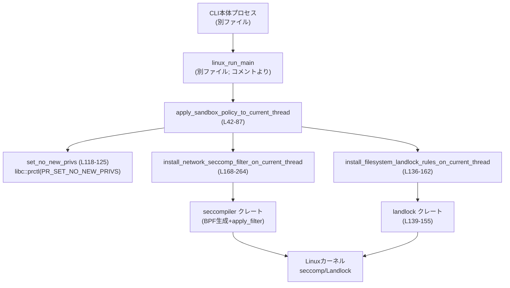
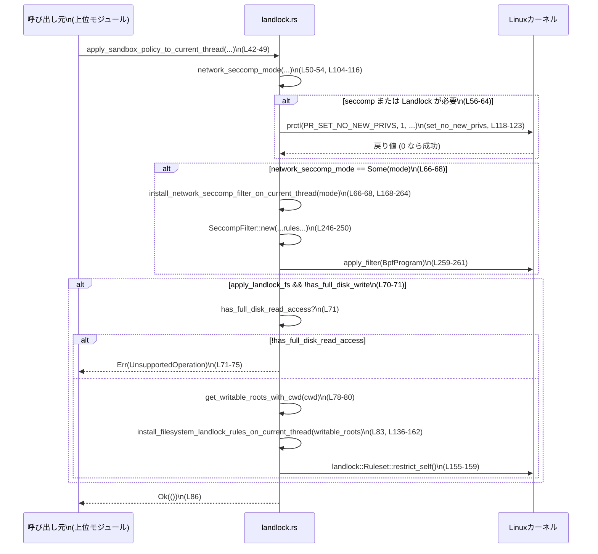

# linux-sandbox/src/landlock.rs

## 0. ざっくり一言

Linux 上で動作する CLI のために、**現在のスレッドだけに seccomp と `PR_SET_NO_NEW_PRIVS` を適用し、必要に応じて Landlock によるファイルシステム制限を掛けるためのユーティリティモジュール**です（`landlock.rs:L1-4, L34-41`）。

---

## 1. このモジュールの役割

### 1.1 概要

- このモジュールは、**Linux サンドボックス内での権限・システムコール制限**を行うためのプリミティブを提供します（`landlock.rs:L1-4`）。
- 具体的には、次を担当します（`landlock.rs:L34-41`）。
  - 制限が必要な場合に `PR_SET_NO_NEW_PRIVS` を有効化する。
  - ネットワークアクセス制限のための seccomp フィルタを現在のスレッドにインストールする。
  - 旧来のバックアップ用途として、Landlock によるファイルシステム制限を設定する（現在は bubblewrap がメイン）。

### 1.2 アーキテクチャ内での位置づけ

コメントから、このモジュールは **「linux_run_main」などの上位レイヤから呼び出される低レベルのサンドボックス設定レイヤ**として位置づけられています（`landlock.rs:L3-4, L34-41, L134-135`）。



- ネットワーク・ファイルシステムの**カーネルレベル制限**を行うが、**どのポリシーを使うかの判断（`SandboxPolicy`/`NetworkSandboxPolicy`）は上位のプロトコル層**に任されています（`landlock.rs:L42-48, L95-116`）。
- ファイルシステムの主なサンドボックスは bubblewrap 側で行われ、このモジュールの Landlock は「レガシー/バックアップ用途」として残っています（`landlock.rs:L3-4, L134-135`）。

### 1.3 設計上のポイント

- **スレッド単位の適用**  
  - `apply_sandbox_policy_to_current_thread` や seccomp/Landlock のセットアップ関数は、**「現在のスレッド」への適用を意識した名前とコメント**になっています（`landlock.rs:L34-35, L127-129, L164-168`）。
  - コメントで「子プロセスだけが継承し、CLI 全体には適用しない」設計意図が示されています（`landlock.rs:L34-35, L166-167`）。

- **安全な API ラップ**  
  - `set_no_new_privs` の内部では `unsafe` な `libc::prctl` 呼び出しを行いますが、外部インターフェースは `Result<()>` を返す **安全な関数**としてラップされています（`landlock.rs:L118-124`）。
  - seccomp/Landlock 自体の FFI は `landlock`/`seccompiler` クレート側に隠蔽されています（`landlock.rs:L139-149, L246-261`）。

- **エラーハンドリング方針**  
  - このモジュールの「メイン」関数は `codex_protocol::error::Result<()>` を返し、`CodexErr` ないし `SandboxErr` によるドメイン固有エラーで失敗を表現します（`landlock.rs:L8-10, L42-49, L136-162`）。
  - seccomp 設定関数は `std::result::Result<(), SandboxErr>` を返し、呼び出し元で `?` によるエラー変換が行われます（`landlock.rs:L168-170, L66-68`）。

- **fail-closed なネットワークポリシー**  
  - ネットワークサンドボックスは「管理されたネットワークセッションは、ポリシーがフルアクセスでも seccomp を掛けて fail-closed にする」という設計方針を持ちます（`landlock.rs:L95-102, L275-283`）。

- **Landlock は「ベストエフォート」互換性**  
  - `CompatLevel::BestEffort` が使われており、カーネル側の Landlock サポート状況に応じて可能な範囲で制限を適用します（`landlock.rs:L143-145`）。
  - ただし、結果として `RulesetStatus::NotEnforced` の場合は明示的にエラーを返してサンドボックス失敗として扱っています（`landlock.rs:L155-159`）。

---

## 2. 主要な機能一覧（コンポーネントインベントリー）

### 型・関数一覧

| 名前 | 種別 | 役割 / 用途 | 定義位置 |
|------|------|-------------|----------|
| `NetworkSeccompMode` | enum | ネットワーク用 seccomp フィルタのモード（`Restricted` / `ProxyRouted`）を表現 | `landlock.rs:L89-93` |
| `apply_sandbox_policy_to_current_thread` | 関数 | サンドボックスポリシーに基づき、`no_new_privs` / ネットワーク seccomp / Landlock FS を現在スレッドに適用するエントリポイント | `landlock.rs:L42-87` |
| `should_install_network_seccomp` | 関数 | ネットワーク seccomp フィルタをインストールすべきかをブールで決定する補助ロジック | `landlock.rs:L95-102` |
| `network_seccomp_mode` | 関数 | 上記ブールと proxy 設定から `NetworkSeccompMode` / `None` を決定する | `landlock.rs:L104-116` |
| `set_no_new_privs` | 関数 | `libc::prctl(PR_SET_NO_NEW_PRIVS)` を呼び出し、`no_new_privs` を有効化 | `landlock.rs:L118-125` |
| `install_filesystem_landlock_rules_on_current_thread` | 関数 | Landlock ルールを設定し、読み取りは全体許可 / 書き込みは `/dev/null` と指定ルートだけを許可 | `landlock.rs:L127-162` |
| `install_network_seccomp_filter_on_current_thread` | 関数 | `NetworkSeccompMode` に応じて seccomp ルールマップを構築し、BPF プログラムを生成・適用 | `landlock.rs:L164-264` |
| `deny_syscall` | 内部関数 | 特定システムコールを無条件で拒否するルールエントリを作成する小さなヘルパー | `landlock.rs:L171-173` |
| `tests` モジュール | テスト | `should_install_network_seccomp` と `network_seccomp_mode` の動作をテスト | `landlock.rs:L266-343` |

---

## 3. 公開 API と詳細解説

### 3.1 型一覧（構造体・列挙体など）

| 名前 | 種別 | 役割 / 用途 | フィールド | 定義位置 |
|------|------|-------------|-----------|----------|
| `NetworkSeccompMode` | enum (非公開) | ネットワーク用 seccomp フィルタの動作モード | `Restricted`（ネットワーク禁止＋AF_UNIX のみ許可）、`ProxyRouted`（IP ソケットのみ許可・AF_UNIX 制限） | `landlock.rs:L89-93` |

※ enum 自体は `pub` ではないため、このモジュール内の実装詳細としてのみ利用されます。

### 3.2 関数詳細

#### `apply_sandbox_policy_to_current_thread(...) -> Result<()>`

```rust
pub(crate) fn apply_sandbox_policy_to_current_thread(
    sandbox_policy: &SandboxPolicy,
    network_sandbox_policy: NetworkSandboxPolicy,
    cwd: &Path,
    apply_landlock_fs: bool,
    allow_network_for_proxy: bool,
    proxy_routed_network: bool,
) -> Result<()>   // alias to codex_protocol::error::Result
```

**概要**

- サンドボックスポリシーに基づき、**現在のスレッド**に対して以下を順に適用します（`landlock.rs:L42-84`）。
  - ネットワーク用 seccomp フィルタ（必要な場合）。
  - `PR_SET_NO_NEW_PRIVS`（seccomp または Landlock FS が必要な場合）。
  - Landlock によるファイルシステム書き込み制限（オプション・レガシー機能）。

**引数**

| 引数名 | 型 | 説明 |
|--------|----|------|
| `sandbox_policy` | `&SandboxPolicy` | ファイルシステムの読み書き権限などを含むサンドボックスポリシー。`has_full_disk_write_access` / `has_full_disk_read_access` / `get_writable_roots_with_cwd` などで参照されます（`landlock.rs:L61, L70-82`）。 |
| `network_sandbox_policy` | `NetworkSandboxPolicy` | ネットワークの有効化状態（`Enabled` / `Restricted` 等）を表すポリシー（`landlock.rs:L44, L95-102`）。 |
| `cwd` | `&Path` | カレントディレクトリ。`get_writable_roots_with_cwd` に渡され、相対パス解決に使われます（`landlock.rs:L45, L78-80`）。 |
| `apply_landlock_fs` | `bool` | Landlock によるファイルシステム制限を使うかどうかのフラグ（`landlock.rs:L46, L60-61, L70-84`）。 |
| `allow_network_for_proxy` | `bool` | プロキシ用の「管理されたネットワーク」セッションを使うかどうか。これが `true` の場合、フルネットワークポリシーでも seccomp を有効化します（`landlock.rs:L47, L95-102, L275-283`）。 |
| `proxy_routed_network` | `bool` | プロキシ経由の「ルーティングされたネットワーク」モードを使うかどうか。これが `true` の場合、seccomp モードが `ProxyRouted` になります（`landlock.rs:L48, L104-116, L309-317`）。 |

**戻り値**

- 成功時：`Ok(())`
- 失敗時：`Err(CodexErr::...)`  
  - `set_no_new_privs` の失敗、Landlock ルールのセットアップ失敗、Landlock ルールが `NotEnforced` だった場合などがここに集約されます（`landlock.rs:L63, L83, L155-159`）。

**内部処理の流れ**

1. `network_seccomp_mode` を呼び出し、ネットワーク用 seccomp を適用すべきか／どのモードで適用するかを判定（`landlock.rs:L50-54`）。
2. seccomp または Landlock 書き込み制限が必要な場合に `set_no_new_privs()` を呼び出す（`landlock.rs:L56-64`）。
3. `network_seccomp_mode` が `Some(mode)` なら、`install_network_seccomp_filter_on_current_thread(mode)` を呼び、seccomp フィルタを現在スレッドに適用（`landlock.rs:L66-68`）。
4. `apply_landlock_fs` が `true` かつ `sandbox_policy` にフルディスク書き込み権限がない場合、Landlock によるファイルシステム制限の適用を検討（`landlock.rs:L70-71`）。
   - ただし、フルディスク読み取り権限がない場合は `UnsupportedOperation` エラーで即時失敗（`landlock.rs:L71-75`）。
   - 書き込み可能ルートを `sandbox_policy.get_writable_roots_with_cwd(cwd)` から取得し、その `root` フィールドのリストを Landlock に渡す（`landlock.rs:L78-83`）。
5. すべて成功すると `Ok(())` を返す（`landlock.rs:L86`）。

**Examples（使用例）**

> 注意: `SandboxPolicy` の具体的な構築方法はこのファイルからは分からないため、コメントで省略しています。

```rust
use std::path::Path;
use codex_protocol::protocol::{SandboxPolicy, NetworkSandboxPolicy};
use linux_sandbox::landlock::apply_sandbox_policy_to_current_thread; // 実際のモジュールパスはこのファイルからは不明

fn run_child_with_sandbox(
) -> codex_protocol::error::Result<()> {
    // SandboxPolicy を上位レイヤで構築する（詳細不明）
    let sandbox_policy: SandboxPolicy = /* ... */;

    // ネットワークを完全に禁止するポリシーを指定
    let network_policy = NetworkSandboxPolicy::Restricted;

    // 現在の作業ディレクトリ
    let cwd = std::env::current_dir()?; // std::io::Error -> CodexErr へ変換されるかは上位定義次第

    // Landlock FS は使わず、プロキシも使わない単純ケース
    apply_sandbox_policy_to_current_thread(
        &sandbox_policy,
        network_policy,
        cwd.as_path(),
        /*apply_landlock_fs*/ false,
        /*allow_network_for_proxy*/ false,
        /*proxy_routed_network*/ false,
    )?;

    // ここ以降で fork/exec される子プロセスが、seccomp の制限を継承すると想定されます
    Ok(())
}
```

**Errors / Panics**

- `set_no_new_privs` が失敗した場合  
  - `libc::prctl(PR_SET_NO_NEW_PRIVS, ...)` が 0 以外を返すと、`std::io::Error::last_os_error()` が `CodexErr` に変換されて返ります（`landlock.rs:L118-123`）。
- Landlock 利用時のエラー
  - `sandbox_policy.has_full_disk_read_access()` が `false` の場合、`CodexErr::UnsupportedOperation` を返します（`landlock.rs:L71-75`）。
  - `install_filesystem_landlock_rules_on_current_thread` が `Err` を返した場合、そのエラーが伝播します（`landlock.rs:L83`）。
- seccomp 設定エラー
  - `install_network_seccomp_filter_on_current_thread` が `Err(SandboxErr)` を返すと、`?` により呼び出し元の `Result` に変換されます（`landlock.rs:L66-68`）。
- Panic
  - `apply_sandbox_policy_to_current_thread` 自体は `panic!` を起こしませんが、内部で呼ぶ関数（例えば seccomp 側の `unimplemented!`）が panic しうる点には注意が必要です（`landlock.rs:L250-256`）。

**Edge cases（エッジケース）**

- `network_sandbox_policy` が「フルネットワーク許可 (`Enabled`)」だが、`allow_network_for_proxy` が `false` の場合  
  - `network_seccomp_mode` は `None` を返し、ネットワーク seccomp はインストールされません（`landlock.rs:L95-102, L286-293, L334-341`）。
- `NetworkSandboxPolicy::Restricted` の場合  
  - `allow_network_for_proxy` の値に関わらず seccomp がインストールされます（`landlock.rs:L95-102, L297-305`）。
- `apply_landlock_fs == true` かつ `has_full_disk_write_access == true` の場合  
  - Landlock FS の適用はスキップされます（`landlock.rs:L60-62, L70`）。
- `apply_landlock_fs == true` かつ `has_full_disk_read_access == false` の場合  
  - 即座に `UnsupportedOperation` エラーで失敗します（`landlock.rs:L70-75`）。

**使用上の注意点**

- **呼び出しタイミング**  
  - コメントから、この関数は「子プロセスを作成する前に、子を生成するスレッドで呼ぶ」ことが前提と解釈できます（`landlock.rs:L34-35`）。他スレッドには影響しない設計意図です。
- **Landlock FS はレガシー**  
  - コメントで「現在は bubblewrap がファイルシステムサンドボックスを担当し、この Landlock バックエンドは未使用」と明言されています（`landlock.rs:L134-135`）。`apply_landlock_fs` を有効にする場合は、その前提を理解しておく必要があります。
- **アーキテクチャ依存の panic 可能性**  
  - 非 x86_64 / aarch64 アーキテクチャで seccomp フィルタを適用すると `unimplemented!` による panic が発生します（`landlock.rs:L246-256`）。そのような環境でこの機能を使う場合は注意が必要です。

---

#### `should_install_network_seccomp(network_sandbox_policy, allow_network_for_proxy) -> bool`

**概要**

- ネットワーク seccomp フィルタを「インストールすべきかどうか」をブール値で返す単純な判定関数です（`landlock.rs:L95-102`）。

**引数**

| 引数名 | 型 | 説明 |
|--------|----|------|
| `network_sandbox_policy` | `NetworkSandboxPolicy` | ネットワークポリシー。`is_enabled()` メソッドで状態を確認します（`landlock.rs:L95-101`）。 |
| `allow_network_for_proxy` | `bool` | 管理されたプロキシ経由ネットワークを許可するかどうか。`true` の場合は seccomp を必ず有効化します（`landlock.rs:L95-101, L275-283`）。 |

**戻り値**

- seccomp をインストールするべきなら `true`、インストール不要なら `false`（`landlock.rs:L101`）。

**内部処理**

- 判定ロジックは 1 行です（`landlock.rs:L99-101`）:

  ```rust
  !network_sandbox_policy.is_enabled() || allow_network_for_proxy
  ```

  - `network_sandbox_policy.is_enabled() == false` の場合（例: `Restricted`）、常に `true` を返します（`landlock.rs:L297-305`）。
  - それ以外（例: `Enabled`）では `allow_network_for_proxy` の値に従います（`landlock.rs:L275-293`）。

**Examples**

```rust
use codex_protocol::protocol::NetworkSandboxPolicy;

assert_eq!(
    should_install_network_seccomp(
        NetworkSandboxPolicy::Enabled,
        /*allow_network_for_proxy*/ false,
    ),
    false,
);

assert_eq!(
    should_install_network_seccomp(
        NetworkSandboxPolicy::Enabled,
        /*allow_network_for_proxy*/ true,
    ),
    true,
);
```

（テストからの抜粋、`landlock.rs:L275-293`。）

**Errors / Panics**

- この関数はエラーも panic も発生させません。

**Edge cases**

- `NetworkSandboxPolicy::Restricted` の場合は `allow_network_for_proxy` に関わらず常に `true`（`landlock.rs:L297-305`）。
- 「フルネットワーク許可＋管理ネットワークなし」の場合のみ `false` となり、seccomp をスキップします（`landlock.rs:L286-293`）。

**使用上の注意点**

- この関数はあくまで**ブール判定**しか返さないため、実際にどのモードで seccomp をインストールするかは `network_seccomp_mode` 側で決定されます（`landlock.rs:L104-116`）。

---

#### `network_seccomp_mode(network_sandbox_policy, allow_network_for_proxy, proxy_routed_network) -> Option<NetworkSeccompMode>`

**概要**

- ネットワークのポリシーとプロキシ設定から、実際に使う seccomp モード（`Restricted` / `ProxyRouted`）または「適用なし (`None`)」を求めます（`landlock.rs:L104-116`）。

**引数**

| 引数名 | 型 | 説明 |
|--------|----|------|
| `network_sandbox_policy` | `NetworkSandboxPolicy` | ネットワークポリシー（`landlock.rs:L105`）。 |
| `allow_network_for_proxy` | `bool` | 管理プロキシを使うかどうか（`landlock.rs:L106`）。 |
| `proxy_routed_network` | `bool` | プロキシルーティングモードを使うかどうか（`landlock.rs:L107`）。 |

**戻り値**

- `Some(NetworkSeccompMode::ProxyRouted)`：プロキシルーティングが有効な場合（`landlock.rs:L111-113, L309-317`）。
- `Some(NetworkSeccompMode::Restricted)`：それ以外で、seccomp をインストールすべき場合（`landlock.rs:L109-115, L321-329`）。
- `None`：seccomp をインストールしない場合（`landlock.rs:L109-111, L333-341`）。

**内部処理**

1. まず `should_install_network_seccomp` を呼び、seccomp の必要性を判定（`landlock.rs:L109`）。
2. `false` なら `None` を返して終了（`landlock.rs:L109-111`）。
3. `true` なら `proxy_routed_network` を見てモードを分岐:
   - `proxy_routed_network == true` → `Some(ProxyRouted)`（`landlock.rs:L111-113`）。
   - それ以外 → `Some(Restricted)`（`landlock.rs:L113-115`）。

**Examples**

テストコードに具体例があります（`landlock.rs:L309-341`）。

```rust
use codex_protocol::protocol::NetworkSandboxPolicy;

assert_eq!(
    network_seccomp_mode(
        NetworkSandboxPolicy::Enabled,
        /*allow_network_for_proxy*/ true,
        /*proxy_routed_network*/ true,
    ),
    Some(NetworkSeccompMode::ProxyRouted),
);

assert_eq!(
    network_seccomp_mode(
        NetworkSandboxPolicy::Enabled,
        /*allow_network_for_proxy*/ false,
        /*proxy_routed_network*/ false,
    ),
    None,
);
```

**Errors / Panics**

- エラーも panic も発生しません。

**Edge cases**

- `NetworkSandboxPolicy::Restricted` かつ `proxy_routed_network == false` の場合でも `Some(Restricted)` が返ります（`landlock.rs:L321-329`）。
- 「フルネットワーク／プロキシなし／ルーティングなし」の場合のみ `None` となり、seccomp を完全にスキップします（`landlock.rs:L333-341`）。

**使用上の注意点**

- この関数の戻り値 `Option<NetworkSeccompMode>` をそのまま `apply_sandbox_policy_to_current_thread` が利用しているため、**ネットワークサンドボックスの有無とモードはここが唯一の決定ポイント**です（`landlock.rs:L50-54, L66-68`）。

---

#### `set_no_new_privs() -> Result<()>`

**概要**

- Linux の `prctl(PR_SET_NO_NEW_PRIVS, 1, ...)` を呼び出し、**このスレッドとその子が新しい権限を獲得できないようにする**フラグを有効にします（`landlock.rs:L118-123`）。

**引数**

- なし。

**戻り値**

- 成功時：`Ok(())`
- 失敗時：`Err(CodexErr::from(std::io::Error))`（`landlock.rs:L121-123`）

**内部処理**

1. `unsafe { libc::prctl(libc::PR_SET_NO_NEW_PRIVS, 1, 0, 0, 0) }` を呼び出し、戻り値を `result` に格納（`landlock.rs:L120`）。
2. `result != 0` の場合、`std::io::Error::last_os_error()` を取得し、`into()` でエラー型変換して返す（`landlock.rs:L121-123`）。
3. それ以外は `Ok(())` を返す（`landlock.rs:L124`）。

**Examples**

```rust
fn ensure_no_new_privs() -> codex_protocol::error::Result<()> {
    set_no_new_privs()?; // 失敗時は CodexErr に変換されて呼び出し元へ伝播
    Ok(())
}
```

**Errors / Panics**

- OS レベルのエラー（例えば権限不足やサポート外）で `prctl` が失敗した場合、`std::io::Error` が `CodexErr` にラップされて返されます。
- 関数自体は panic しません。

**Edge cases**

- `PR_SET_NO_NEW_PRIVS` がサポートされない古いカーネル等では失敗する可能性がありますが、その詳細な条件はこのファイルからは分かりません。失敗した場合はエラーとして処理されます（`landlock.rs:L121-123`）。

**使用上の注意点**

- `no_new_privs` は一度有効にすると **元に戻せません**（Linux の仕様による一般論）。この関数を呼ぶタイミングは慎重に設計する必要があります。
- この関数は `apply_sandbox_policy_to_current_thread` からのみ呼ばれており、seccomp や Landlock を使う前提条件として扱われています（`landlock.rs:L56-64`）。

---

#### `install_filesystem_landlock_rules_on_current_thread(writable_roots: Vec<AbsolutePathBuf>) -> Result<()>`

**概要**

- Landlock によるファイルシステムルールを現在スレッドに適用し、**読み取りを全ファイルシステムで許可しつつ、書き込みを `/dev/null` と指定された `writable_roots` に限定**します（`landlock.rs:L127-132, L139-152`）。
- コメントによると、現在は bubblewrap によるファイルシステムサンドボックスが主であり、この Landlock バックエンドは「未使用だが将来の参考・フォールバック用途」とされています（`landlock.rs:L134-135`）。

**引数**

| 引数名 | 型 | 説明 |
|--------|----|------|
| `writable_roots` | `Vec<AbsolutePathBuf>` | 書き込みを許可したいディレクトリの絶対パス群（`landlock.rs:L136-138, L151-153`）。 |

**戻り値**

- 成功時：`Ok(())`
- 失敗時：`Err(CodexErr::Sandbox(..))`  
  - 特に Landlock が `NotEnforced` の場合は `SandboxErr::LandlockRestrict` が返ります（`landlock.rs:L157-159`）。

**内部処理の流れ**

1. Landlock ABI を `ABI::V5` として選択し（`landlock.rs:L139`）、読み書き用・読み取り専用の `AccessFs` マスクを取得（`landlock.rs:L140-141`）。
2. `Ruleset::default()` を起点に以下を設定（`landlock.rs:L143-149`）。
   - `CompatLevel::BestEffort` を指定（`set_compatibility`）。
   - `handle_access(access_rw)` で書き込み可能アクセスをハンドル対象として設定。
   - `create()` でカーネル側にルールセットを作成。
   - `/` 配下の読み取りを許可するルールを追加。
   - `/dev/null` への読み書きルールを追加。
   - `set_no_new_privs(true)` で Landlock 側でも `no_new_privs` をセット。
3. `writable_roots` が空でなければ、それらのパスに対して読み書き可能なルールを追加（`landlock.rs:L151-153`）。
4. `restrict_self()` を呼び、現在スレッドにルールセットを適用（`landlock.rs:L155`）。
5. `status.ruleset` が `RulesetStatus::NotEnforced` の場合、`CodexErr::Sandbox(SandboxErr::LandlockRestrict)` を返して失敗とする（`landlock.rs:L157-159`）。
6. それ以外は `Ok(())` を返す（`landlock.rs:L161`）。

**Examples**

```rust
use codex_utils_absolute_path::AbsolutePathBuf;

fn apply_landlock_example() -> codex_protocol::error::Result<()> {
    // 書き込みを許可したいディレクトリの絶対パスを用意する
    let writable_roots: Vec<AbsolutePathBuf> = vec![
        /* 例: AbsolutePathBuf::try_from("/tmp/my-sandbox")? */
    ];

    install_filesystem_landlock_rules_on_current_thread(writable_roots)?;
    Ok(())
}
```

**Errors / Panics**

- Landlock のセットアップや `restrict_self()` が失敗した場合、`CodexErr` にラップされて返されます（`landlock.rs:L143-155`）。
- ルールセットが `NotEnforced` と判定された場合は `CodexErr::Sandbox(SandboxErr::LandlockRestrict)` を明示的に返します（`landlock.rs:L157-159`）。
- Panic は発生させません。

**Edge cases**

- `writable_roots` が空の場合  
  - 書き込みは `/dev/null` のみ許可され、それ以外は Landlock によって制限されます（`landlock.rs:L148-152`）。
- カーネルが Landlock をサポートしていない、または不完全サポートの場合  
  - `CompatLevel::BestEffort` によって可能な限りの適用が試みられますが、`status.ruleset == NotEnforced` であればエラーとして扱われます（`landlock.rs:L143-145, L155-159`）。

**使用上の注意点**

- コメントにある通り、**現在の実装では bubblewrap 側でファイルシステムサンドボックスを行っており、この関数は通常のパスでは使われない**前提です（`landlock.rs:L134-135`）。
- `apply_sandbox_policy_to_current_thread` からのみ呼び出されており、`apply_landlock_fs` フラグと `SandboxPolicy` の内容に依存します（`landlock.rs:L70-84`）。

---

#### `install_network_seccomp_filter_on_current_thread(mode: NetworkSeccompMode) -> std::result::Result<(), SandboxErr>`

**概要**

- `NetworkSeccompMode` に応じて seccomp ルールを生成し、**現在スレッドにネットワーク関連システムコールの制限を適用**します（`landlock.rs:L164-264`）。
- ルールの基本方針（両モード共通）（`landlock.rs:L175-182`）:
  - `ptrace`, `io_uring_setup`, `io_uring_enter`, `io_uring_register` を無条件に禁止（EPERM を返す）。
- モード別:
  - `Restricted` モードでは、ほとんどのネットワーク関係 syscalls を禁止し、`socket`/`socketpair` については AF_UNIX だけを許可（`landlock.rs:L183-214`）。
  - `ProxyRouted` モードでは、AF_INET/AF_INET6 の `socket` のみ許可し、AF_UNIX の `socketpair` を禁止（`landlock.rs:L215-243`）。

**引数**

| 引数名 | 型 | 説明 |
|--------|----|------|
| `mode` | `NetworkSeccompMode` | `Restricted` か `ProxyRouted` を指定（`landlock.rs:L169-170, L183-214`）。 |

**戻り値**

- 成功時：`Ok(())`
- 失敗時：`Err(SandboxErr)`（`SeccompFilter::new` や `apply_filter` からのエラーなど; `landlock.rs:L246-261`）。

**内部処理の流れ**

1. 内部関数 `deny_syscall` を定義し、「指定した sysno を無条件に EPERM にする」ルールを追加するユーティリティとして利用（`landlock.rs:L171-173`）。
2. 空の `BTreeMap<i64, Vec<SeccompRule>>` を用意し、基本禁止ルール (`ptrace`, `io_uring_*`) を追加（`landlock.rs:L175-182`）。
3. `mode` によって分岐（`landlock.rs:L183-214, L215-243`）。

   - **Restricted モード**（`landlock.rs:L184-214`）:
     - 接続系・ソケット関連の多数の syscalls (`connect`, `accept`, `bind`, `listen`, `sendto` など) を `deny_syscall` で禁止（`landlock.rs:L185-201`）。
     - `socket`/`socketpair` に対して、「第1引数 (domain) が AF_UNIX 以外なら EPERM」というルール (`SeccompCmpOp::Ne` 条件) を設定（`landlock.rs:L203-213`）。
       - コメントと条件から、**AF_UNIX ソケットのみ許可、それ以外のドメインを禁止**する挙動になります（`landlock.rs:L203-210`）。

   - **ProxyRouted モード**（`landlock.rs:L215-243`）:
     - `socket` に対して、「第1引数が AF_INET でも AF_INET6 でもない場合に EPERM」となる条件（`Ne` 条件を 2 つ AND）を設定（`landlock.rs:L221-234`）。
       - これにより、**AF_INET/AF_INET6 だけが許可され、他のドメインは拒否**されます。
     - `socketpair` に対して、「第1引数が AF_UNIX なら EPERM」（AF_UNIX の `socketpair` を禁止）という条件を設定（`landlock.rs:L235-242`）。
       - コメント通り、Unix ドメインソケットペアによるローカルバイパスを防ぐ意図と解釈できます（`landlock.rs:L216-220`）。

4. 構築した `rules` マップと、デフォルトアクション `SeccompAction::Allow`（未マッチ時に許可）・マッチ時のアクション `SeccompAction::Errno(EPERM)` を指定して `SeccompFilter::new` を生成（`landlock.rs:L246-250`）。
5. ターゲットアーキテクチャを `cfg!(target_arch = "...")` によって `x86_64` か `aarch64` に分岐し、それ以外の場合は `unimplemented!("unsupported architecture for seccomp filter")` となる（`landlock.rs:L250-256`）。
6. `SeccompFilter` から `BpfProgram` に変換（`try_into`）し（`landlock.rs:L259`）、`apply_filter(&prog)` で実際に seccomp をカーネルに適用（`landlock.rs:L261`）。
7. すべて成功したら `Ok(())` を返します（`landlock.rs:L263`）。

**Examples**

> この関数は通常、直接ではなく `apply_sandbox_policy_to_current_thread` 経由で呼ばれます（`landlock.rs:L66-68`）。

```rust
// Restricted モードでだけ seccomp をセットアップしたい内部ユースケースの例
fn setup_restricted_network() -> Result<(), SandboxErr> {
    install_network_seccomp_filter_on_current_thread(NetworkSeccompMode::Restricted)
}
```

**Errors / Panics**

- `SeccompFilter::new` や `try_into::<BpfProgram>`、`apply_filter` が失敗した場合、`SandboxErr` にマップされて `Err` になります（`landlock.rs:L246-261`）。
- 対象アーキテクチャが `x86_64` でも `aarch64` でもない場合:
  - `unimplemented!("unsupported architecture for seccomp filter")` が実行され、**panic** を引き起こします（`landlock.rs:L250-256`）。

**Edge cases**

- Restricted モードでは `recvfrom` の禁止がコメントアウトされているため、`recvfrom` 自体は許可されます（`landlock.rs:L195-199`）。  
  - コメントに「`cargo clippy` のようなツール用に必要」と理由が記載されています。
- ProxyRouted モードでは AF_INET/AF_INET6 の `socket` は許可されますが、AF_UNIX の `socketpair` は明示的に禁止されています（`landlock.rs:L221-242`）。

**使用上の注意点**

- **デフォルトアクションが Allow** であるため、**ルールに記載していないシステムコールはすべて許可される**点に留意が必要です（`landlock.rs:L246-249`）。
- 新たなネットワーク関連のシステムコール（例えば今後追加されるもの）が出た場合、このルールでは自動的には禁止されないため、ルール追加が必要になる可能性があります。
- アーキテクチャが増える（例: `riscv64`）場合、`TargetArch` の分岐に追従しないと、ランタイム `unimplemented!` による panic を起こす可能性があります（`landlock.rs:L250-256`）。

---

### 3.3 その他の関数

| 関数名 | 役割（1 行） | 定義位置 |
|--------|--------------|----------|
| `deny_syscall(rules: &mut BTreeMap<i64, Vec<SeccompRule>>, nr: i64)` | 指定された syscall 番号に、無条件で EPERM を返す seccomp ルール（空ベクタ）を追加する内部ヘルパー | `landlock.rs:L171-173` |
| テスト各種 (`managed_network_enforces_seccomp_even_for_full_network_policy` など) | `should_install_network_seccomp` と `network_seccomp_mode` の組み合わせが、想定したブール値／モードを返すことを確認する | `landlock.rs:L274-341` |

---

## 4. データフロー

ここでは、`apply_sandbox_policy_to_current_thread` が呼ばれたときの**代表的な処理フロー**を示します。

### シーケンス図（ネットワーク制限 + no_new_privs のみ）



- ネットワーク用 seccomp と Landlock FS は**それぞれ独立に適用**され、どちらかが失敗すると `Err` によって上位へ伝播します（`landlock.rs:L63, L83`）。
- `no_new_privs` は、seccomp か Landlock のどちらかを使う場合に一度だけセットされます（`landlock.rs:L56-64`）。

---

## 5. 使い方（How to Use）

### 5.1 基本的な使用方法

典型的には、**子プロセスを生成する直前**に、サンドボックスポリシーに基づいて現在スレッドに制限を適用します。

```rust
use std::path::Path;
use codex_protocol::protocol::{SandboxPolicy, NetworkSandboxPolicy};
// 実際のモジュールパスはプロジェクト構成に依存（ここでは仮）
use linux_sandbox::landlock::apply_sandbox_policy_to_current_thread;

fn spawn_sandboxed_child() -> codex_protocol::error::Result<()> {
    // 1. ポリシーとフラグを決定する
    let sandbox_policy: SandboxPolicy = /* 上位レイヤで構築 */;
    let network_policy = NetworkSandboxPolicy::Restricted; // 例: ネットワーク禁止
    let cwd = std::env::current_dir()?;
    let apply_landlock_fs = false; // 通常は bubblewrap に任せる
    let allow_network_for_proxy = false;
    let proxy_routed_network = false;

    // 2. 現在スレッドにサンドボックスを適用する
    apply_sandbox_policy_to_current_thread(
        &sandbox_policy,
        network_policy,
        cwd.as_path(),
        apply_landlock_fs,
        allow_network_for_proxy,
        proxy_routed_network,
    )?;

    // 3. このスレッドから fork/exec される子プロセスは、seccomp 等を継承する想定
    //    ここで child を起動する
    //    e.g., std::process::Command::new("...").spawn()...

    Ok(())
}
```

### 5.2 よくある使用パターン

1. **完全にネットワークを禁止するサンドボックス**

   - `NetworkSandboxPolicy::Restricted`
   - `allow_network_for_proxy = false`
   - `proxy_routed_network = false`

   この組み合わせでは `NetworkSeccompMode::Restricted` が選ばれ、AF_UNIX 以外の `socket`/`socketpair` と、主要なネットワーク関連 syscalls が禁止されます（`landlock.rs:L183-214, L321-329`）。

2. **管理されたプロキシ経由でのみネットワークを許可**

   - `NetworkSandboxPolicy::Enabled`（ポリシー上はフルアクセス）
   - `allow_network_for_proxy = true`
   - `proxy_routed_network = true`

   この場合、テスト通り `NetworkSeccompMode::ProxyRouted` が選ばれ、AF_INET/AF_INET6 ソケットのみ許可され、AF_UNIX の `socketpair` などローカルソケットによるバイパスが制限されます（`landlock.rs:L309-317, L215-243`）。

3. **ファイルシステム Landlock を利用するレガシーパターン**

   - `apply_landlock_fs = true`
   - `sandbox_policy.has_full_disk_write_access() == false`
   - `sandbox_policy.has_full_disk_read_access() == true`

   この場合、読み取り全体許可＋書き込み限定 Landlock が適用されます（`landlock.rs:L70-83, L139-155`）。

### 5.3 よくある間違い（想定）

```rust
// 間違い例: フルネットワークポリシーで、管理ネットワークも使わないのに
// seccomp を期待している
let network_policy = NetworkSandboxPolicy::Enabled;
let allow_network_for_proxy = false;
let proxy_routed_network = false;

let mode = network_seccomp_mode(network_policy, allow_network_for_proxy, proxy_routed_network);
// mode は None になる (seccomp はインストールされない) — landlock.rs:L333-341
```

```rust
// 正しい例: Restricted ポリシーを使う、または allow_network_for_proxy を true にする
let network_policy = NetworkSandboxPolicy::Restricted;
let allow_network_for_proxy = false;
let proxy_routed_network = false;

let mode = network_seccomp_mode(network_policy, allow_network_for_proxy, proxy_routed_network);
// Some(NetworkSeccompMode::Restricted) となり、seccomp がインストールされる
```

### 5.4 使用上の注意点（まとめ）

- **スレッド単位のサンドボックス**  
  - 関数名やコメントから、「現在のスレッド」にのみ seccomp/Landlock を適用する設計意図が読み取れます（`landlock.rs:L34-35, L164-168`）。  
    複数スレッドを使う場合、どのスレッドで子プロセスを生成するかを明確にする必要があります。
- **アーキテクチャ制限**  
  - `install_network_seccomp_filter_on_current_thread` は `x86_64` と `aarch64` 以外では `unimplemented!` による panic の可能性があります（`landlock.rs:L250-256`）。
- **ファイルシステムサンドボックスの二重化**  
  - bubblewrap によるサンドボックスと Landlock を同時に使う設計かどうか、このファイルからは確定できません。コメントでは Landlock は「現在未使用」と書かれており（`landlock.rs:L134-135`）、通常は `apply_landlock_fs` を `false` にする前提の可能性があります。
- **エラー処理の統一**  
  - `Result` と `std::result::Result`（`SandboxErr`）が混在しているため、上位レイヤでは `From` 実装に依存したエラー変換が発生します（`landlock.rs:L8-10, L42-49, L168-170`）。エラーパスのハンドリング戦略は上位で確認する必要があります。

---

## 6. 変更の仕方（How to Modify）

### 6.1 新しい機能を追加する場合

1. **新たなネットワーク syscall を禁止したい場合**

   - `install_network_seccomp_filter_on_current_thread` の `match mode` ブロックで、`deny_syscall(&mut rules, libc::SYS_XXX)` を追加します（`landlock.rs:L171-182, L185-201`）。
   - その syscall が Restricted モードだけ禁止なのか、ProxyRouted モードでも禁止すべきかを設計し、それぞれの分岐に追加します。

2. **新しい seccomp モードを追加したい場合**

   - `NetworkSeccompMode` enum に新しいバリアントを追加（`landlock.rs:L89-93`）。
   - `network_seccomp_mode` にそのモードを返すための条件分岐を追加（`landlock.rs:L104-116`）。
   - `install_network_seccomp_filter_on_current_thread` の `match mode` に新バリアントのブロックを追加し、ルールセットを構成します（`landlock.rs:L183-214, L215-243`）。

3. **Landlock ルールの拡張**

   - 読み取り制限も行いたい場合や、特定のパスを完全に禁止したい場合は、`Ruleset::add_rules` に渡す `path_beneath_rules` の引数を変更・追加します（`landlock.rs:L147-152`）。

### 6.2 既存の機能を変更する場合

- **影響範囲の確認**

  - ネットワークポリシー関連のロジックは、テストモジュールのテストに直接対応しているため、`should_install_network_seccomp` / `network_seccomp_mode` を変更する際は、テストも更新する必要があります（`landlock.rs:L274-341`）。

- **前提条件の維持**

  - `set_no_new_privs` は seccomp/Landlock の前提条件として使われています（`landlock.rs:L56-64, L118-125`）。この関数の呼び出し順序や条件を変更する場合は、カーネル側の要件（seccomp に no_new_privs が必要）を満たしているか確認する必要があります。

- **Landlock の fail-closed 挙動**

  - `RulesetStatus::NotEnforced` でエラーにする挙動を変更すると、サンドボックスの安全性に直接影響します（`landlock.rs:L155-159`）。緩和する場合は、その影響を十分に検討する必要があります。

---

## 7. 関連ファイル / モジュール

| パス / モジュール | 役割 / 関係 |
|------------------|------------|
| `codex_protocol::error::{CodexErr, Result, SandboxErr}` | このモジュールの主要なエラー型と `Result` エイリアスを提供します。`apply_sandbox_policy_to_current_thread` や Landlock 関数の戻り値で使用されています（`landlock.rs:L8-10, L42-49, L118-123, L136-162, L168-170`）。 |
| `codex_protocol::protocol::{SandboxPolicy, NetworkSandboxPolicy}` | サンドボックスポリシーのモデル。どのような FS/ネットワーク制限を適用するかの判断材料を提供します（`landlock.rs:L11-12, L42-48, L70-82, L95-116, L274-341`）。 |
| `codex_utils_absolute_path::AbsolutePathBuf` | Landlock の書き込み可能ルートとして使用される絶対パスの型です（`landlock.rs:L13, L136-138, L151-153`）。 |
| `landlock` クレート | `Ruleset`, `AccessFs`, `ABI` などを提供し、Landlock サンドボックスの Rust ラッパーとして機能します（`landlock.rs:L15-23, L139-155`）。 |
| `seccompiler` クレート | `SeccompFilter`, `SeccompRule`, `SeccompCondition`, `apply_filter` などを提供し、seccomp BPF プログラムの生成と適用を行います（`landlock.rs:L24-32, L171-173, L246-261`）。 |
| `linux_run_main`（コメント中の参照） | bubblewrap によるファイルシステムサンドボックスを行う上位レイヤ関数としてコメント内で言及されていますが、このチャンクには定義が現れません（`landlock.rs:L3, L134-135`）。 |

このファイルに現れない他の呼び出し元や設定箇所（例: `apply_sandbox_policy_to_current_thread` の具体的な呼び出し場所）は、このチャンクからは把握できません。
