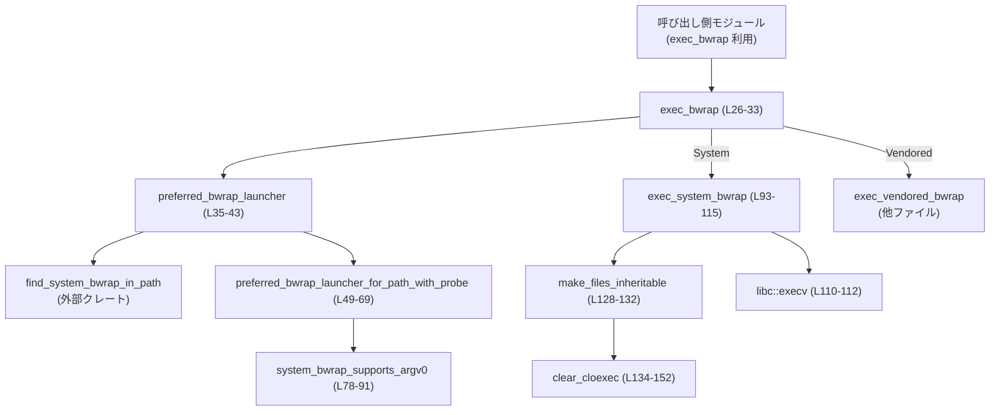
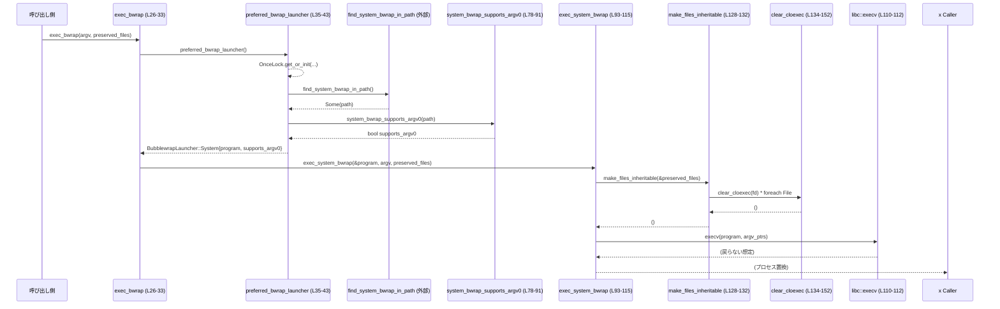

# linux-sandbox/src/launcher.rs

## 0. ざっくり一言

Linux 上で bubblewrap を起動するためのランチャーです。  
システムにインストールされた bubblewrap と、vendored（同梱）版のどちらを使うかを判定し、必要なファイルディスクリプタを exec 境界を越えて引き継ぎつつ `execv(2)` で置き換え実行します。（根拠: `exec_bwrap`, `preferred_bwrap_launcher`, `exec_system_bwrap`, `make_files_inheritable` 定義部 `launcher.rs:L26-L33,L35-L43,L93-L115,L128-L152`）

---

## 1. このモジュールの役割

### 1.1 概要

- このモジュールは **bubblewrap（bwrap）プロセスをどのバイナリで起動するか選択し、実際に `exec` する** 役割を持ちます。（`BubblewrapLauncher`, `exec_bwrap`。`launcher.rs:L14-L24,L26-L33`）
- システムの bwrap バイナリが存在すればそれを優先し、そのバージョンが `--argv0` オプションに対応しているかを一度だけプローブして記録します。（`preferred_bwrap_launcher`, `system_bwrap_supports_argv0`。`launcher.rs:L35-L43,L78-L91`）
- システム bwrap に切り替える場合は、指定されたファイルディスクリプタの `FD_CLOEXEC` フラグを外して、exec 境界を越えて継承させます。（`make_files_inheritable`, `clear_cloexec`。`launcher.rs:L93-L100,L128-L152`）

### 1.2 アーキテクチャ内での位置づけ

他モジュールからは「argv と preserved_files を渡すと、適切な bwrap が選ばれて exec される」単一の入り口として使われます。  
内部では以下の依存関係を持ちます。



- システム bwrap へのパス探索は外部クレート `codex_sandboxing::find_system_bwrap_in_path` に委譲されています。（`launcher.rs:L11,L38-L40`）
- vendored 版 bwrap の実装は `crate::vendored_bwrap::exec_vendored_bwrap` にあり、このチャンクには現れません。（`launcher.rs:L10,L31`）

### 1.3 設計上のポイント

- **ランチャー種別のキャッシュ**  
  - `OnceLock<BubblewrapLauncher>` により、システム bwrap の有無・`--argv0` 対応状況の検出はプロセス内で一度だけ行われ、以後はクローンされた値を使います。（`launcher.rs:L35-L43`）
  - `OnceLock` はスレッド安全な一度きりの初期化を提供するため、並行呼び出しにも対応した設計です。

- **システム vs vendored の切り替え**  
  - システム bwrap のパスが見つかり、かつそれがファイルであれば `System` を選択し、それ以外は vendored を選択します。（`preferred_bwrap_launcher_for_path_with_probe` の `is_file` チェック。`launcher.rs:L49-L55`）
  - システム bwrap が `--argv0` をサポートしない場合でも `System` を選択し、サポート有無を別途保持します。（`launcher.rs:L57-L68`）

- **エラーハンドリング方針**  
  - 想定外の状況（絶対パス化に失敗・CString 化失敗・`fcntl` 失敗・`execv` 失敗など）はすべて `panic!` で即座にプロセスを中断します。（`launcher.rs:L58-L64,L101-L104,L117-L123,L134-L151`）
  - これはランチャー層では「発生しない前提」のエラーをプログラミングエラーとして扱う設計です。

- **unsafe と OS 依存 API の使用**  
  - 実際のプロセス置き換えに `libc::execv` を、FD フラグ操作に `libc::fcntl` を使用し、`unsafe` ブロックで明示しています。（`launcher.rs:L110-L112,L136,L147`）
  - C 文字列に変換するために `CString` を使用し、内部にヌルバイトがないことを保証しています。（`launcher.rs:L101-L104,L117-L123`）

- **並行性**  
  - 主要な可変状態は `OnceLock` のみで、それ以外は関数に渡された引数のみを扱います。  
    これにより、グローバルな可変状態への依存が限定され、スレッドセーフな初期化以外に共有状態を持ちません。（`launcher.rs:L35-L43`）

---

## 2. 主要な機能一覧

### 2.1 コンポーネント一覧（インベントリー）

| 名前 | 種別 | 公開範囲 | 役割 / 用途 | 定義位置 |
|------|------|----------|-------------|----------|
| `BubblewrapLauncher` | enum | private | システム bwrap を使うか vendored を使うかを表すランチャー種別 | `launcher.rs:L14-L18` |
| `SystemBwrapLauncher` | struct | private | システム bwrap の絶対パスと `--argv0` 対応有無を保持 | `launcher.rs:L20-L24` |
| `exec_bwrap` | 関数 | `pub(crate)` | ランチャー種別を決定し、システム・vendored のどちらかで bwrap を exec するエントリポイント | `launcher.rs:L26-L33` |
| `preferred_bwrap_launcher` | 関数 | private | 一度だけシステム bwrap を探索・判定し、以後キャッシュされた `BubblewrapLauncher` を返す | `launcher.rs:L35-L43` |
| `preferred_bwrap_launcher_for_path` | 関数 | private | 指定パスの bwrap バイナリに対し、デフォルトのプローブ関数を使ってランチャー種別を決定 | `launcher.rs:L45-L47` |
| `preferred_bwrap_launcher_for_path_with_probe` | 関数 | private | 任意のプローブ関数を注入可能な判定ロジック（テストで利用） | `launcher.rs:L49-L69` |
| `preferred_bwrap_supports_argv0` | 関数 | `pub(crate)` | 現在選択されている bwrap が `--argv0` をサポートするか（vendored の場合は true）を返す | `launcher.rs:L71-L75` |
| `system_bwrap_supports_argv0` | 関数 | private | `bwrap --help` を起動して標準出力/標準エラー内に `--argv0` が含まれるかを調べる | `launcher.rs:L78-L91` |
| `exec_system_bwrap` | 関数 | private | システム bwrap を `execv` で起動し、必要なファイルディスクリプタを継承させる | `launcher.rs:L93-L115` |
| `argv_to_cstrings` | 関数 | private | Rust の `Vec<String>` を `Vec<CString>` に変換（内部にヌルバイトがあると panic） | `launcher.rs:L117-L125` |
| `make_files_inheritable` | 関数 | private | 渡された `File` の `FD_CLOEXEC` をクリアして exec 後も継承可能にする | `launcher.rs:L128-L132` |
| `clear_cloexec` | 関数 | private | `fcntl(F_GETFD/F_SETFD)` によって単一 FD の `FD_CLOEXEC` をクリア | `launcher.rs:L134-L152` |
| `tests` モジュール | モジュール | test-only | ランチャー選択ロジックと FD フラグ変更の動作を検証するユニットテスト群 | `launcher.rs:L154-L226` |
| `prefers_system_bwrap_when_help_lists_argv0` | テスト関数 | test | `--argv0` をサポートする場合に System ランチャーが選択されることを検証 | `launcher.rs:L160-L173` |
| `prefers_system_bwrap_when_system_bwrap_lacks_argv0` | テスト関数 | test | `--argv0` 非対応でも System ランチャーが選択されることを検証 | `launcher.rs:L175-L186` |
| `falls_back_to_vendored_when_system_bwrap_is_missing` | テスト関数 | test | パスが存在しない場合に Vendored にフォールバックすることを検証 | `launcher.rs:L189-L195` |
| `preserved_files_are_made_inheritable_for_system_exec` | テスト関数 | test | `make_files_inheritable` が FD の `FD_CLOEXEC` をクリアすることを検証 | `launcher.rs:L197-L205` |
| `set_cloexec`, `fd_flags` | テスト用関数 | test | FD フラグ設定・取得のユーティリティ | `launcher.rs:L207-L215,L217-L225` |

### 2.2 主要な機能（箇条書き）

- システム bwrap の検出と優先利用（なければ vendored にフォールバック）  
  （`preferred_bwrap_launcher`, `preferred_bwrap_launcher_for_path_with_probe`。`launcher.rs:L35-L43,L49-L55`）
- システム bwrap の `--argv0` サポート有無の自動検知とキャッシュ  
  （`system_bwrap_supports_argv0`。`launcher.rs:L78-L91`）
- ランチャー種別にもとづく bwrap の `exec` 実行 (`execv` 使用)  
  （`exec_bwrap`, `exec_system_bwrap`, `exec_vendored_bwrap` 呼び出し。`launcher.rs:L26-L33,L93-L115`）
- exec 境界を越えて保持すべきファイルディスクリプタの `FD_CLOEXEC` クリア  
  （`make_files_inheritable`, `clear_cloexec`。`launcher.rs:L128-L152`）
- 現在選ばれているランチャーが `--argv0` をサポートするかの問い合わせ API  
  （`preferred_bwrap_supports_argv0`。`launcher.rs:L71-L75`）

---

## 3. 公開 API と詳細解説

### 3.1 型一覧（構造体・列挙体）

| 名前 | 種別 | 役割 / 用途 | 主なフィールド | 定義位置 |
|------|------|-------------|----------------|----------|
| `BubblewrapLauncher` | enum | システム bwrap を使うか vendored を使うかのランチャー種別 | `System(SystemBwrapLauncher)`, `Vendored` | `launcher.rs:L14-L18` |
| `SystemBwrapLauncher` | struct | システム bwrap 実行時に必要な情報をまとめた構造体 | `program: AbsolutePathBuf`, `supports_argv0: bool` | `launcher.rs:L20-L24` |

`BubblewrapLauncher` と `SystemBwrapLauncher` はどちらも `Debug`, `Clone`, `PartialEq`, `Eq` を derive しており、テストやキャッシュで比較・複製できるようになっています。（`launcher.rs:L14-L24`）

### 3.2 関数詳細（7 件）

#### `exec_bwrap(argv: Vec<String>, preserved_files: Vec<File>) -> !`

**概要**

- bubblewrap を起動するためのモジュール内のメインエントリポイントです。  
- システム bwrap か vendored bwrap のいずれかを選択し、そのいずれかを `exec` するため、**この関数は決して戻りません (`!`)**。（`launcher.rs:L26-L33`）

**引数**

| 引数名 | 型 | 説明 |
|--------|----|------|
| `argv` | `Vec<String>` | bwrap プロセスに渡す引数リスト。`argv[0]` も含む想定です。（根拠: 後続で `argv_to_cstrings` にそのまま渡される。`launcher.rs:L104-L105,L117-L125`） |
| `preserved_files` | `Vec<File>` | bwrap 実行後も子プロセスに継承させたいファイルディスクリプタの集合 |

**戻り値**

- 戻り値型は `!`（発散型）であり、正常系でも異常系でもこの関数は呼び出し元に制御を返しません。  
  - システム／vendored bwrap への `exec` が成功した場合、現在のプロセスは置き換えられます。  
  - 失敗した場合は内部で `panic!` が発生し、プロセスが中断します。（システムパスの正規化失敗など経路による）

**内部処理の流れ**

1. `preferred_bwrap_launcher()` を呼び出して、ランチャー種別（System/Vendored）を取得します。（`launcher.rs:L27,L35-L43`）
2. `BubblewrapLauncher::System(launcher)` の場合  
   `exec_system_bwrap(&launcher.program, argv, preserved_files)` を呼び出します。（`launcher.rs:L28-L30`）
3. `BubblewrapLauncher::Vendored` の場合  
   vendored 版の `exec_vendored_bwrap(argv, preserved_files)` を呼び出します。（`launcher.rs:L31`）

**Examples（使用例）**

同一クレート内から bwrap を起動する最小例です（argv の内容は簡略化しています）。

```rust
use std::fs::File;                       // File 型を使用する
use std::path::Path;
use std::fs::OpenOptions;

// 同一クレート内で launcher モジュールにいると仮定
use crate::launcher::{exec_bwrap, preferred_bwrap_supports_argv0};

fn run_in_sandbox() -> ! {
    // bwrap に渡したい引数を組み立てる
    let mut argv = vec![
        "bwrap".to_string(),             // argv[0]
        "--ro-bind".to_string(),
        "/host/path".to_string(),
        "/sandbox/path".to_string(),
    ];

    // `--argv0` が使える環境なら先にオプションを追加する
    if preferred_bwrap_supports_argv0() {
        argv.splice(1..1, [
            "--argv0".to_string(),
            "my-sandboxed-program".to_string(),
        ]);
    }

    // 子プロセスに継承させたいファイルを開く
    let log_file = OpenOptions::new()
        .create(true)
        .append(true)
        .open(Path::new("/tmp/sandbox.log"))
        .expect("open log file");

    let preserved_files = vec![log_file];

    // この呼び出しは戻りません
    exec_bwrap(argv, preserved_files);
}
```

**Errors / Panics**

- `exec_bwrap` 自身は明示的に `panic!` を呼びませんが、内部で呼び出す関数が panic する可能性があります。例：  
  - システム bwrap のパス正規化失敗（`AbsolutePathBuf::from_absolute_path` の `Err`）で panic。（`launcher.rs:L58-L64`）  
  - システム bwrap 実行時に `execv` が失敗した場合に panic。（`launcher.rs:L113-L114`）  
  - vendored bwrap 実行の内部実装はこのチャンクにはないため、不明です。

**Edge cases（エッジケース）**

- `argv` が空 (`Vec::new()`) の場合  
  - このチャンクでは特別な検証は行われていません。空の `argv` がそのまま `exec_system_bwrap` / `exec_vendored_bwrap` に渡されます。（`launcher.rs:L26-L33`）
- `preserved_files` が空の場合  
  - `make_files_inheritable` に空スライスが渡され、何も行われません。（`launcher.rs:L93-L100,L128-L132`）

**使用上の注意点**

- この関数は戻らないため、呼び出し後にコードを続けて書くとそこは到達不能コードになります。制御フロー設計に注意が必要です。
- 渡す `argv` の各要素にヌルバイト（`'\0'`）が含まれると、後続の `CString::new` によって panic が発生します。（`argv_to_cstrings`。`launcher.rs:L117-L123`）
- `preserved_files` に含めた `File` は `exec` 後も子プロセスに継承されます。不要な FD を含めると情報漏えいの原因となる可能性があります。

---

#### `preferred_bwrap_launcher() -> BubblewrapLauncher`

**概要**

- システム bwrap の有無と `--argv0` サポート状況を調べ、`BubblewrapLauncher` を返します。  
- 判定はプロセス内で一度だけ行われ、後続の呼び出しはキャッシュされた値のクローンを返します。（`launcher.rs:L35-L43`）

**引数**

- なし。

**戻り値**

- `BubblewrapLauncher::System(SystemBwrapLauncher)` または `BubblewrapLauncher::Vendored` を返します。  
  - `System` の場合は `program` と `supports_argv0` が設定された構造体が入ります。（`launcher.rs:L65-L68`）

**内部処理の流れ**

1. `static LAUNCHER: OnceLock<BubblewrapLauncher>` を参照します。（`launcher.rs:L35-L36`）
2. `LAUNCHER.get_or_init(...)` により、未初期化であれば以下のクロージャを一度だけ実行します。（`launcher.rs:L37-L42`）
   - `find_system_bwrap_in_path()` を呼び出し、システムの bwrap パスを探索。（`launcher.rs:L38-L40`）
   - `Some(path)` の場合は `preferred_bwrap_launcher_for_path(&path)` へ。（`launcher.rs:L39`）
   - `None` の場合は `BubblewrapLauncher::Vendored` を直接返却。（`launcher.rs:L40`）
3. `get_or_init` から得られた参照を `clone()` して返します。（`launcher.rs:L42-L43`）

**Examples（使用例）**

```rust
use crate::launcher::preferred_bwrap_launcher;

fn debug_launcher() {
    let launcher = preferred_bwrap_launcher();
    eprintln!("launcher = {:?}", launcher); // Debug が derive されている
}
```

**Errors / Panics**

- この関数自体は panic を直接発生させませんが、以下の経路で panic が発生しうることに注意が必要です。  
  - `preferred_bwrap_launcher_for_path` 経由で `AbsolutePathBuf::from_absolute_path` が `Err` を返した場合の panic。（`launcher.rs:L58-L64`）

**Edge cases**

- システム bwrap が PATH 上に存在しない場合、`BubblewrapLauncher::Vendored` がキャッシュされ、その後は常に vendored が使われます。（`launcher.rs:L38-L40`）
- `find_system_bwrap_in_path` の挙動はこのチャンクには現れないため、どのようなパスが検出対象かは不明です。

**使用上の注意点**

- `OnceLock` の初期化はスレッドセーフですが、一度決まったランチャー種別を後から変えることはできません。プロセス起動後に PATH を変えても反映されません。

---

#### `preferred_bwrap_launcher_for_path_with_probe(system_bwrap_path: &Path, system_bwrap_supports_argv0: impl FnOnce(&Path) -> bool) -> BubblewrapLauncher`

**概要**

- 任意の bwrap パスと「`--argv0` をサポートしているか」を判定するプローブ関数を受け取り、`BubblewrapLauncher` を構築するヘルパーです。（`launcher.rs:L49-L69`）
- テストでは、このプローブ関数にフェイク実装を渡すことで、実際にプロセスを起動せずに挙動を検証しています。（`launcher.rs:L160-L173,L175-L186`）

**引数**

| 引数名 | 型 | 説明 |
|--------|----|------|
| `system_bwrap_path` | `&Path` | システム bwrap のパス候補（絶対・相対はこの関数側では区別しない） |
| `system_bwrap_supports_argv0` | `impl FnOnce(&Path) -> bool` | 指定パスが `--argv0` をサポートしているかを返すプローブ関数 |

**戻り値**

- `BubblewrapLauncher::System(SystemBwrapLauncher)` または `BubblewrapLauncher::Vendored`。  
- `System` の場合、`program` は `AbsolutePathBuf` に正規化したパス、`supports_argv0` はプローブ結果になります。（`launcher.rs:L57-L68`）

**内部処理の流れ**

1. `system_bwrap_path.is_file()` が false の場合、即座に `BubblewrapLauncher::Vendored` を返却します。（`launcher.rs:L53-L55`）
2. `supports_argv0` をプローブ関数 `system_bwrap_supports_argv0(system_bwrap_path)` の結果で取得します。（`launcher.rs:L57`）
3. `AbsolutePathBuf::from_absolute_path(system_bwrap_path)` を呼び出してパスを正規化します。  
   `Err(err)` の場合は panic します。（`launcher.rs:L58-L64`）
4. 正規化されたパスと `supports_argv0` をフィールドに持つ `SystemBwrapLauncher` を作成し、`BubblewrapLauncher::System` で返します。（`launcher.rs:L65-L68`）

**Examples（使用例）**

テストのようにフェイクプローブを使って挙動を決める例です。

```rust
use std::path::Path;
use codex_utils_absolute_path::AbsolutePathBuf;
use crate::launcher::{BubblewrapLauncher, SystemBwrapLauncher, preferred_bwrap_launcher_for_path_with_probe};

fn example_with_fake_probe() {
    let path = Path::new("/usr/bin/bwrap");
    // ここでは常に argv0 をサポートしているとみなす
    let launcher = preferred_bwrap_launcher_for_path_with_probe(path, |_| true);

    match launcher {
        BubblewrapLauncher::System(SystemBwrapLauncher { program, supports_argv0 }) => {
            assert_eq!(supports_argv0, true);
            // program は AbsolutePathBuf 型
            println!("System bwrap at: {}", program);
        }
        BubblewrapLauncher::Vendored => {
            println!("Falling back to vendored bwrap");
        }
    }
}
```

**Errors / Panics**

- `system_bwrap_path.is_file()` が false の場合  
  → Vendored にフォールバックし、panic は発生しません。（`launcher.rs:L53-L55`）
- `AbsolutePathBuf::from_absolute_path` が `Err` を返した場合  
  → `"failed to normalize system bubblewrap path ..."` というメッセージで panic します。（`launcher.rs:L58-L64`）

**Edge cases**

- `system_bwrap_path` が存在するが実行可能でない場合  
  - この関数では `is_file()` しか確認しないため `System` が返されます。後続で `execv` が失敗して panic につながる可能性があります。（`launcher.rs:L53-L55,L93-L115`）
- 相対パスが渡された場合  
  - `AbsolutePathBuf::from_absolute_path` がどの条件で失敗するかはこのチャンクでは不明ですが、絶対パスでない場合には `Err` になりうると推測されます。その場合 panic します。（`launcher.rs:L58-L64`）

**使用上の注意点**

- この関数はテストでの利用を主目的としており（プローブの差し替え）、通常コードからは `preferred_bwrap_launcher_for_path` / `preferred_bwrap_launcher` を通じて使われます。（`launcher.rs:L45-L47,L160-L173`）

---

#### `system_bwrap_supports_argv0(system_bwrap_path: &Path) -> bool`

**概要**

- 指定された bwrap バイナリが `--argv0` オプションをサポートしているかを判定します。  
- 内部では `Command::new(system_bwrap_path).arg("--help").output()` を実行し、標準出力・標準エラーに `--argv0` が含まれるかを検査します。（`launcher.rs:L78-L91`）

**引数**

| 引数名 | 型 | 説明 |
|--------|----|------|
| `system_bwrap_path` | `&Path` | bwrap 実行ファイルのパス |

**戻り値**

- `true` : `bwrap --help` の出力（stdout または stderr）に `--argv0` が含まれている場合。  
- `false` : `Command::output()` がエラーになった場合、または出力中に `--argv0` が一度も現れない場合。（`launcher.rs:L84-L90`）

**内部処理の流れ**

1. `Command::new(system_bwrap_path).arg("--help").output()` を実行します。（`launcher.rs:L84`）
   - `Ok(output)` の場合はそのまま進行。  
   - `Err(_)` の場合は `false` を返します。（`launcher.rs:L85-L87`）
2. `output.stdout` と `output.stderr` を `String::from_utf8_lossy` で UTF-8 文字列に変換します。（`launcher.rs:L88-L89`）
3. どちらかの文字列に `--argv0` が含まれていれば `true`、そうでなければ `false` を返します。（`launcher.rs:L90`）

**Examples（使用例）**

```rust
use std::path::Path;
use crate::launcher::system_bwrap_supports_argv0;

fn check_system_bwrap() {
    let path = Path::new("/usr/bin/bwrap");
    let supports = system_bwrap_supports_argv0(path);
    println!("system bwrap supports --argv0: {}", supports);
}
```

**Errors / Panics**

- `Command::output()` の失敗は捕捉され、`false` を返すだけで panic にはなりません。（`launcher.rs:L84-L87`）
- `String::from_utf8_lossy` はデコードエラーをパニックではなく置換文字で処理するため、ここでも panic は起きません。（`launcher.rs:L88-L89`）

**Edge cases**

- bwrap が存在しない、または実行権限がない場合  
  → `Command::output()` が `Err` を返し、`false` になります。（`launcher.rs:L84-L87`）
- `--help` 出力が非常に大きい場合  
  → すべてメモリに読み込んでから文字列検索を行います。頻度は `OnceLock` 経由で 1 回に抑えられていますが、メモリ使用量は出力サイズに比例します。

**使用上の注意点**

- この関数は通常直接は呼ばず、`preferred_bwrap_launcher_for_path` を通じて使われます。  
- パフォーマンス的にはサブプロセス起動を伴うため、繰り返し呼び出すべきではなく、小さな `OnceLock` キャッシュと組み合わせて使う現在の設計が前提です。（`launcher.rs:L35-L43`）

---

#### `exec_system_bwrap(program: &AbsolutePathBuf, argv: Vec<String>, preserved_files: Vec<File>) -> !`

**概要**

- システムの bwrap バイナリを `execv` で実行し、現在のプロセスを置き換えます。（`launcher.rs:L93-L115`）  
- 実行前に `preserved_files` に含まれるファイルディスクリプタの `FD_CLOEXEC` を解除し、exec 後も子プロセスで利用可能にします。

**引数**

| 引数名 | 型 | 説明 |
|--------|----|------|
| `program` | `&AbsolutePathBuf` | システム bwrap の絶対パス |
| `argv` | `Vec<String>` | bwrap に渡す引数リスト |
| `preserved_files` | `Vec<File>` | exec 後も継承したいファイル |

**戻り値**

- 戻り値型は `!` であり、成功しても失敗しても呼び出し元には戻りません。  
  - `execv` 成功時: プロセスが bwrap に置き換えられる。  
  - 失敗時: panic によりプロセスが終了します。（`launcher.rs:L113-L114`）

**内部処理の流れ**

1. `make_files_inheritable(&preserved_files)` を呼び出して、各 FD の `FD_CLOEXEC` フラグをクリアします。（`launcher.rs:L98-L100,L128-L132`）
2. 表示用に `program_path` を `String` として作成します。（`launcher.rs:L101`）
3. `program` パスを `CString` に変換します。ヌルバイトが含まれていると panic します。（`launcher.rs:L102-L103`）
4. `argv_to_cstrings(&argv)` で引数を `CString` のベクタに変換し、さらに各要素の `as_ptr()` を取り出して `Vec<*const c_char>` にします。（`launcher.rs:L104-L106,L117-L125`）
5. 最後に終端の `NULL` ポインタ（`std::ptr::null()`）を追加し、`argv_ptrs` を C の `char *argv[]` 形式にします。（`launcher.rs:L106`）
6. `unsafe { libc::execv(program.as_ptr(), argv_ptrs.as_ptr()); }` を呼び出します。（`launcher.rs:L110-L112`）
7. 戻ってきてしまった場合は `std::io::Error::last_os_error()` で errno を取得し、panic します。（`launcher.rs:L113-L114`）

**Examples（使用例）**

通常は `exec_bwrap` 経由で呼び出されるため、直接使う場面はあまりありませんが、概念的には次のような形です。

```rust
use std::fs::File;
use codex_utils_absolute_path::AbsolutePathBuf;
use crate::launcher::exec_system_bwrap;

fn run_system_bwrap_direct() -> ! {
    let program = AbsolutePathBuf::from_absolute_path("/usr/bin/bwrap".as_ref())
        .expect("absolute path");
    let argv = vec!["bwrap".to_string(), "--help".to_string()];
    let preserved_files: Vec<File> = Vec::new();

    exec_system_bwrap(&program, argv, preserved_files);
}
```

**Errors / Panics**

- `CString::new(program.as_path().as_os_str().as_bytes())` が `Err` の場合  
  → `"invalid system bubblewrap path: {err}"` で panic。（`launcher.rs:L101-L103`）
- `argv_to_cstrings` 内部でいずれかの引数にヌルバイトが含まれる場合  
  → `"failed to convert argv to CString: {err}"` で panic。（`launcher.rs:L117-L123`）
- `libc::execv` が負の値を返した場合（失敗）  
  → `last_os_error()` を取得後 `"failed to exec system bubblewrap {program_path}: {err}"` で panic。（`launcher.rs:L110-L115`）

**Edge cases**

- `argv` が空で `argv_ptrs` が `[NULL]` だけになる場合、`execv` の挙動は未定義ではありませんが、多くの OS でエラーになる可能性があります。ここでは特別扱いされず、そのまま `execv` に渡されます。（`launcher.rs:L104-L107`）
- `preserved_files` に無効な FD を持つ `File` が含まれている場合  
  → `clear_cloexec` 内の `fcntl` が失敗し、panic に至ります。（`launcher.rs:L128-L152`）

**使用上の注意点**

- `unsafe` ブロック内で `execv` を呼び出しているため、`program` と `argv_ptrs` のライフタイム・ヌル終端等の安全性は呼び出し側コード（本関数）で保証されています。そのため、`argv_to_cstrings` の結果を必ず `execv` 呼び出しまで保持する現在の形を維持することが重要です。（`launcher.rs:L101-L107,L110-L112`）
- `execv` 呼び出し後は Rust のクリーンアップ処理（`Drop`）は行われません。プロセスが完全に置き換えられるため、リソース解放を exec 前までに済ませる前提の設計です。

---

#### `make_files_inheritable(files: &[File])`

**概要**

- 渡された `File` のファイルディスクリプタについて、`FD_CLOEXEC` フラグをクリアし、`exec` 後も子プロセスに継承できるようにします。（`launcher.rs:L128-L132`）  
- 実際のフラグ操作は `clear_cloexec` に委譲しています。

**引数**

| 引数名 | 型 | 説明 |
|--------|----|------|
| `files` | `&[File]` | exec 後も継承させる `File` のスライス |

**戻り値**

- なし（`()`）。

**内部処理の流れ**

1. スライス `files` を for ループで走査します。（`launcher.rs:L128-L131`）
2. 各 `File` から `as_raw_fd()` で FD を取得し、`clear_cloexec(fd)` を呼び出します。（`launcher.rs:L129-L131`）

**Examples（使用例）**

テストコードに近い形の使用例です。（`launcher.rs:L197-L205`）

```rust
use std::os::fd::AsRawFd;
use tempfile::NamedTempFile;
use crate::launcher::make_files_inheritable;

fn example_inheritable() {
    let file = NamedTempFile::new().expect("temp file");

    // まず CLOEXEC を立てる（テスト用。実運用では不要）
    let fd = file.as_file().as_raw_fd();
    // libc::fcntl を直接使うこともできるが、ここでは簡略化

    // その後、継承可能にする
    make_files_inheritable(std::slice::from_ref(file.as_file()));
}
```

**Errors / Panics**

- 個々の FD に対する `clear_cloexec` の内部で `fcntl(F_GETFD)` や `fcntl(F_SETFD)` が失敗した場合に panic します。（`launcher.rs:L134-L152`）

**Edge cases**

- `files` が空スライスの場合、ループは 0 回で何も行われません。（`launcher.rs:L128-L131`）
- 同じ `File` を複数回渡しても、`FD_CLOEXEC` がクリアされるだけで追加の副作用はありません。

**使用上の注意点**

- `files` に含めた FD はすべて exec 後の子プロセスに残ります。意図しない FD を含めると、セキュリティ上のリスク（不要なファイルへのアクセス権漏えい）になる可能性があります。
- この関数はシステム bwrap 実行時にのみ使用され、vendored bwrap の実装で同様の処理を行っているかどうかはこのチャンクからは分かりません。（`launcher.rs:L93-L100`）

---

#### `clear_cloexec(fd: libc::c_int)`

**概要**

- 指定されたファイルディスクリプタの `FD_CLOEXEC` フラグをクリアします。（`launcher.rs:L134-L152`）  
- `fcntl(F_GETFD)` と `fcntl(F_SETFD)` を直接呼び出す低レベルユーティリティです。

**引数**

| 引数名 | 型 | 説明 |
|--------|----|------|
| `fd` | `libc::c_int` | 操作対象のファイルディスクリプタ |

**戻り値**

- なし（`()`）。

**内部処理の流れ**

1. `unsafe { libc::fcntl(fd, libc::F_GETFD) }` で現在の FD フラグを取得します。（`launcher.rs:L136`）
2. `flags < 0` の場合、`last_os_error()` を取得し `"failed to read fd flags..."` で panic します。（`launcher.rs:L137-L140`）
3. `cleared_flags = flags & !libc::FD_CLOEXEC` で CLOEXEC ビットをクリアします。（`launcher.rs:L141`）
4. 既に `FD_CLOEXEC` が立っていなければ (`cleared_flags == flags`) 何もせず return します。（`launcher.rs:L142-L143`）
5. そうでなければ `unsafe { libc::fcntl(fd, libc::F_SETFD, cleared_flags) }` で新しいフラグを設定します。（`launcher.rs:L147`）
6. `result < 0` の場合、`last_os_error()` を取得し `"failed to clear CLOEXEC..."` で panic します。（`launcher.rs:L148-L151`）

**Examples（使用例）**

通常は直接呼び出さず、`make_files_inheritable` 経由で使用しますが、単独利用も可能です。

```rust
use std::os::fd::AsRawFd;
use tempfile::NamedTempFile;
use crate::launcher::clear_cloexec;

fn clear_example() {
    let file = NamedTempFile::new().expect("temp file");
    let fd = file.as_file().as_raw_fd();

    clear_cloexec(fd); // エラー時には panic
}
```

**Errors / Panics**

- `fcntl(F_GETFD)` が `-1` を返した場合  
  → `"failed to read fd flags for preserved bubblewrap file descriptor {fd}: {err}"` で panic。（`launcher.rs:L136-L140`）
- `fcntl(F_SETFD, cleared_flags)` が `-1` を返した場合  
  → `"failed to clear CLOEXEC for preserved bubblewrap file descriptor {fd}: {err}"` で panic。（`launcher.rs:L147-L151`）

**Edge cases**

- `FD_CLOEXEC` が元から立っていない場合 (`cleared_flags == flags`) は `F_SETFD` を呼び出さず即 return するため、システムコールの回数を抑えています。（`launcher.rs:L141-L143`）
- `fd` が既にクローズされていた場合、`fcntl` が失敗し panic します。（OS の挙動に依存しますが、通常は `EBADF`）

**使用上の注意点**

- コメントに「`fd` is an owned descriptor kept alive by `files`.」とあるように、本関数の呼び出し元は FD のライフタイム（有効な期間）を保証する必要があります。（`launcher.rs:L135`）
- 他のスレッドで同じ FD を操作している場合、フラグが競合して予期せぬ状態になる可能性があります。通常は単一スレッドかつ明確な所有関係のもとで使う前提のユーティリティです。

---

#### `preferred_bwrap_supports_argv0() -> bool`

**概要**

- 現在選択されている bwrap ランチャーが `--argv0` をサポートしているかを問い合わせます。（`launcher.rs:L71-L75`）  
- System ランチャーの場合は検出した値を返し、vendored ランチャーの場合は常に `true` を返します。

**引数**

- なし。

**戻り値**

- `true` :  
  - System ランチャーで `launcher.supports_argv0` が `true` の場合、または  
  - Vendored ランチャーが選択されている場合。（`launcher.rs:L72-L75`）  
- `false` : System ランチャーで `launcher.supports_argv0` が `false` の場合。

**内部処理の流れ**

1. `preferred_bwrap_launcher()` を呼び出してランチャー種別を取得します。（`launcher.rs:L72`）
2. `match` 文で分岐します。（`launcher.rs:L72-L75`）
   - `BubblewrapLauncher::System(launcher)` → `launcher.supports_argv0` を返す。  
   - `BubblewrapLauncher::Vendored` → `true` を返す。

**Examples（使用例）**

```rust
use crate::launcher::preferred_bwrap_supports_argv0;

fn build_bwrap_args(mut argv: Vec<String>) -> Vec<String> {
    if preferred_bwrap_supports_argv0() {
        argv.splice(1..1, [
            "--argv0".to_string(),
            "my-program-name".to_string(),
        ]);
    }
    argv
}
```

**Errors / Panics**

- 内部で `preferred_bwrap_launcher` を呼ぶため、その初期化過程で発生する panic（絶対パス化の失敗など）が表面化する可能性があります。（`launcher.rs:L35-L43,L58-L64`）
- ランチャーの取得自体が成功していれば、この関数単独では panic しません。

**Edge cases**

- システム bwrap が見つからず vendored にフォールバックしている環境では、常に `true` を返します。  
  vendored 実装が argv0 非対応であった場合、この返り値との整合性は vendored 側の実装次第ですが、このチャンクからは不明です。（`launcher.rs:L71-L75`）

**使用上の注意点**

- `exec_bwrap` を呼ぶ前に、bwrap 引数を構成する際に使用するのが想定される使い方です。  
- 「vendored は必ず `--argv0` 対応」という前提に依存しているため、その前提が変わった場合にはこの挙動の見直しが必要になります。

---

### 3.3 その他の関数

| 関数名 | 役割（1 行） | 定義位置 |
|--------|--------------|----------|
| `preferred_bwrap_launcher_for_path(system_bwrap_path: &Path) -> BubblewrapLauncher` | 指定パスに対しデフォルトプローブ `system_bwrap_supports_argv0` を使ってランチャー種別を決定する薄いラッパー | `launcher.rs:L45-L47` |
| `argv_to_cstrings(argv: &[String]) -> Vec<CString>` | `Vec<String>` を C 互換の `Vec<CString>` に変換するユーティリティ（内部にヌルバイトがあれば panic） | `launcher.rs:L117-L125` |
| テスト用 `set_cloexec(fd: libc::c_int)` | 指定 FD に `FD_CLOEXEC` フラグを立てるテストユーティリティ | `launcher.rs:L207-L215` |
| テスト用 `fd_flags(fd: libc::c_int) -> libc::c_int` | `fcntl(F_GETFD)` により FD フラグを取得するテストユーティリティ | `launcher.rs:L217-L225` |

---

## 4. データフロー

### 4.1 代表的な処理シナリオ

システム bwrap が存在し、`--argv0` をサポートしている環境で `exec_bwrap` が呼ばれる場合のフローを示します。

- 1 回目の呼び出しでは、システム bwrap の探索と `--argv0` サポート有無の検出が行われ、`OnceLock` にキャッシュされます。（`launcher.rs:L35-L43,L78-L91`）
- 以後の呼び出しではキャッシュされた `BubblewrapLauncher::System` が再利用され、即座に `exec_system_bwrap` が呼ばれます。（`launcher.rs:L26-L33,L35-L43`）



Vendored ランチャーが選択された場合は、`exec_system_bwrap` の代わりに `exec_vendored_bwrap` が呼ばれる点だけが異なります。（`launcher.rs:L26-L33`）

---

## 5. 使い方（How to Use）

### 5.1 基本的な使用方法

クレート内部で sandbox を起動する典型的なフローの例です。

```rust
use std::fs::{File, OpenOptions};                               // File 型を使う
use std::path::Path;
use crate::launcher::{exec_bwrap, preferred_bwrap_supports_argv0}; // 本モジュールの公開API

fn run_sandboxed_process() -> ! {
    // 1. bwrap の引数を準備する
    let mut argv = vec![
        "bwrap".to_string(),                                     // argv[0]
        "--ro-bind".to_string(),
        "/host/data".to_string(),
        "/data".to_string(),
        "--".to_string(),
        "/usr/bin/my-app".to_string(),
    ];

    // 2. --argv0 サポート状況に応じてオプションを組み立てる
    if preferred_bwrap_supports_argv0() {
        argv.splice(1..1, [
            "--argv0".to_string(),
            "my-app (sandboxed)".to_string(),
        ]);
    }

    // 3. 子プロセスに継承させたいファイルを用意する（例: ログファイル）
    let log_file: File = OpenOptions::new()
        .create(true)
        .append(true)
        .open(Path::new("/tmp/my-app.log"))
        .expect("open log file");
    let preserved_files = vec![log_file];

    // 4. bwrap を exec する（この呼び出しは戻らない）
    exec_bwrap(argv, preserved_files);
}
```

### 5.2 よくある使用パターン

1. **`--argv0` を条件付きで追加する**  
   - `preferred_bwrap_supports_argv0()` を使って事前にチェックし、サポートされている場合のみ `--argv0` を付ける。（`launcher.rs:L71-L75`）

2. **複数回の sandbox 起動**  
   - 何度 `exec_bwrap` を呼び出しても、ランチャー種別の判定は最初の一度だけで済み、以降はキャッシュされた `BubblewrapLauncher` が使われます。（`launcher.rs:L35-L43`）

3. **テスト環境での挙動固定**  
   - `preferred_bwrap_launcher_for_path_with_probe` にフェイクのパスとプローブ関数を渡し、自動検出ロジックの結果を固定してテストする。（`launcher.rs:L160-L173,L175-L186`）

### 5.3 よくある間違い

```rust
// 間違い例: exec_bwrap の後にコードを書いている
fn incorrect_usage() {
    let argv = vec!["bwrap".to_string()];
    let preserved_files = Vec::new();

    exec_bwrap(argv, preserved_files);

    // この行には決して到達しない（! 型）
    println!("This will never be printed"); // 到達不能コード
}

// 正しい例: exec_bwrap を末尾に配置し、それ以降に処理を置かない
fn correct_usage() -> ! {
    let argv = vec!["bwrap".to_string()];
    let preserved_files = Vec::new();

    exec_bwrap(argv, preserved_files);
}
```

```rust
// 間違い例: argv にヌルバイトを含めてしまう
let argv = vec!["foo\0bar".to_string()];       // 内部に '\0' がある
exec_bwrap(argv, Vec::new());                  // CString::new が panic

// 正しい例: ヌルバイトを含まない文字列だけを使う
let argv = vec!["foobar".to_string()];
exec_bwrap(argv, Vec::new());
```

```rust
// 間違い例: preserved_files にすでにクローズ済みの FD を含める
let file = open_some_file();
drop(file);                                    // ここで FD がクローズされる
let preserved_files = vec![file];              // コンパイルは通らないが、
// 仮に unsafe などで無効 FD を渡した場合、clear_cloexec が panic しうる
```

### 5.4 使用上の注意点（まとめ・安全性/セキュリティを含む）

- **プロセスライフサイクル**
  - `exec_bwrap` / `exec_system_bwrap` はプロセスを置き換えるため、戻りません。  
    呼び出し元は「ここでプロセスが終了する」前提で終了処理等を設計する必要があります。

- **panic によるプロセス中断**
  - いくつかのエラーケースは `panic!` によって扱われています（パス正規化失敗、FD フラグ取得失敗、CString 変換失敗、`execv` 失敗など）。  
    これらは「起こらない前提」のエラーとして扱われているため、実運用でこれらが発生する場合は環境構成や呼び出し方法の見直しが必要になります。（`launcher.rs:L58-L64,L101-L104,L117-L123,L134-L151`）

- **ファイルディスクリプタの漏えい**
  - `preserved_files` に含めた FD は子プロセスに継承されるため、意図しないファイルやソケットを含めないことが重要です。特に認証情報や管理用ソケットなどは含めないようにするべきです。

- **bwrap バイナリの信頼性**
  - システム bwrap のパスは `find_system_bwrap_in_path` が見つけたものをそのまま信頼しています。この関数の挙動はこのチャンクには現れないため、実際にどの PATH が探索されるかは外部依存です。（`launcher.rs:L11,L38-L40`）
  - 実行には `std::process::Command` および `libc::execv` を使っており、シェルは介在しないため、OS レベルの「コマンドインジェクション」の危険性は抑えられています。（`launcher.rs:L84-L85,L110-L112`）

- **並行性**
  - `OnceLock` による初期化はスレッド安全ですが、`clear_cloexec` は単一 FD を対象に `fcntl` を呼んでおり、同じ FD に対し他スレッドから同時に `fcntl` を呼ぶと結果が競合しうる点に注意が必要です。（`launcher.rs:L35-L43,L134-L152`）

- **パフォーマンス**
  - `system_bwrap_supports_argv0` は `bwrap --help` を実行するため比較的重い処理ですが、`OnceLock` によって 1 度だけ実行される設計になっています。（`launcher.rs:L35-L43,L78-L91`）

---

## 6. 変更の仕方（How to Modify）

### 6.1 新しい機能を追加する場合

例: 「別の条件で vendored を優先したい」「`--argv0` 以外の機能サポートもプローブしたい」など。

1. **ランチャー種別に情報を追加する**
   - 追加情報がシステムランチャーにだけ必要なら `SystemBwrapLauncher` にフィールドを追加し、`BubblewrapLauncher::System` を通じて流通させます。（`launcher.rs:L20-L24,L65-L68`）

2. **判定ロジックを拡張する**
   - 判定は `preferred_bwrap_launcher_for_path_with_probe` に集中しているため、ここに新たな条件分岐を追加するのが自然です。（`launcher.rs:L49-L69`）
   - テストではこの関数にフェイクプローブが渡されているため、新しい条件分岐もテストから制御できます。（`launcher.rs:L160-L173,L175-L186`）

3. **キャッシュに反映する**
   - `preferred_bwrap_launcher` はこの関数の戻り値をそのままキャッシュしているため（`OnceLock`）、新しい情報も自動的にキャッシュされます。（`launcher.rs:L35-L43`）

4. **利用側 API を追加する**
   - 例えば「`--new-option` をサポートするか」という問い合わせ API を追加したい場合は、`preferred_bwrap_supports_argv0` と同様のパターンで `pub(crate)` 関数を追加し、`BubblewrapLauncher` から情報を取り出すようにします。（`launcher.rs:L71-L75`）

### 6.2 既存の機能を変更する場合

1. **影響範囲の確認**
   - ランチャー選択ロジックの変更は、`preferred_bwrap_launcher` と `preferred_bwrap_launcher_for_path_with_probe` を起点に、  
     - `exec_bwrap` / `preferred_bwrap_supports_argv0`  
     - テストモジュールの 3 つのテスト関数  
     に影響します。（`launcher.rs:L26-L33,L35-L47,L49-L69,L71-L75,L160-L195`）

2. **契約（前提条件）の確認**
   - `exec_system_bwrap`: `program` は絶対パスであること、`argv` の各要素にヌルバイトを含めないこと、`preserved_files` の FD は有効であること、が暗黙の前提です。（`launcher.rs:L93-L100,L101-L104,L117-L123,L134-L140`）
   - これらの前提を変更する場合、`argv_to_cstrings` や `clear_cloexec` の実装も合わせて見直す必要があります。

3. **テストの更新**
   - ランチャー選択ロジックを変更した場合は、既存のテスト  
     - `prefers_system_bwrap_when_help_lists_argv0`  
     - `prefers_system_bwrap_when_system_bwrap_lacks_argv0`  
     - `falls_back_to_vendored_when_system_bwrap_is_missing`  
     の期待値が変わる可能性があります。（`launcher.rs:L160-L173,L175-L186,L189-L195`）
   - FD 関連の挙動を変更した場合は `preserved_files_are_made_inheritable_for_system_exec` も合わせて確認する必要があります。（`launcher.rs:L197-L205`）

4. **unsafe 部分の見直し**
   - `exec_system_bwrap` / `clear_cloexec` の `unsafe` ブロックを変更する際は、  
     - ポインタの有効期間  
     - ヌル終端の有無  
     - FD の有効性  
     を満たすことを再度確認する必要があります。（`launcher.rs:L110-L112,L136,L147`）

---

## 7. 関連ファイル

| パス / クレート | 役割 / 関係 |
|----------------|------------|
| `crate::vendored_bwrap::exec_vendored_bwrap` | vendored（同梱）バージョンの bubblewrap を起動する機能を提供します。`exec_bwrap` から呼び出されますが、このチャンクには実装は現れません。（`launcher.rs:L10,L31`） |
| `codex_sandboxing::find_system_bwrap_in_path` | システムの PATH などから bwrap バイナリを探すユーティリティ関数です。`preferred_bwrap_launcher` が利用し、ランチャー種別の基礎情報を提供します。（`launcher.rs:L11,L38-L40`） |
| `codex_utils_absolute_path::AbsolutePathBuf` | 絶対パスのみを保持するラッパー型です。システム bwrap のパスを正規化するために使用されます。（`launcher.rs:L12,L58-L68,L93-L104`） |
| `libc` クレート | `execv` および `fcntl` を通じて OS の低レベル API を呼び出すために使用されています。（`launcher.rs:L110-L112,L134-L137,L147`） |
| `tempfile` クレート（テスト） | テストで一時ファイルを作成し、システム bwrap のダミーパスや FD の検証に使用されています。（`launcher.rs:L158,L160-L173,L175-L186,L197-L205`） |
| `pretty_assertions` クレート（テスト） | `assert_eq!` の見やすい差分表示を提供し、ランチャー選択ロジックの期待値を検証する際に用いられています。（`launcher.rs:L157,L166-L172,L180-L185,L191-L194`） |

このモジュールは、システム／vendored の bwrap 実装と OS レベルの exec/FD 操作の間を橋渡しする位置にあり、  
**「どの bwrap を」「どのような FD と引数で」「どう exec するか」** を一箇所に集約している点が特徴です。
