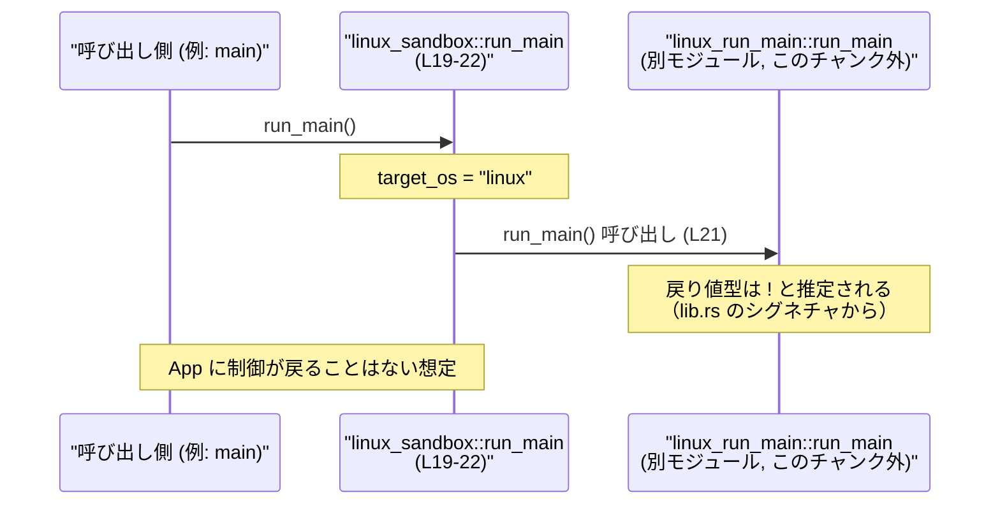
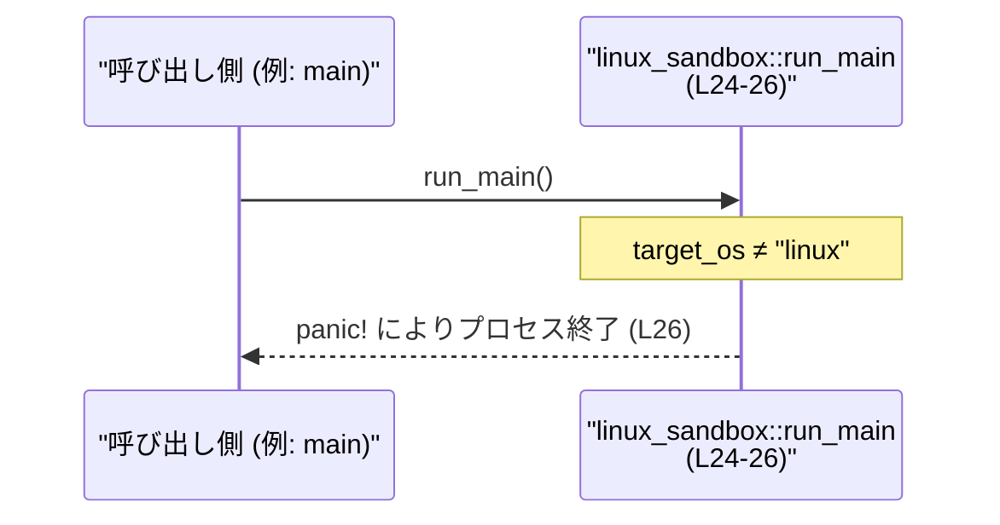

# linux-sandbox/src/lib.rs コード解説

## 0. ざっくり一言

Linux 上でのみ有効なサンドボックス処理のエントリーポイント `run_main` を公開し、Linux 以外では即時に `panic!` することで非対応プラットフォームでの誤用を防ぐクレートルート（`lib.rs`）です（`linux-sandbox/src/lib.rs:L1-5, L19-26`）。

---

## 1. このモジュールの役割

### 1.1 概要

- このモジュールは、Linux 向けのサンドボックス機能の「ヘルパーエントリーポイント」として `run_main` 関数を公開します（`linux-sandbox/src/lib.rs:L1`）。  
- Linux でビルドされた場合だけ、内部モジュール群（`bwrap`, `landlock`, `launcher`, `linux_run_main`, `proxy_routing`, `vendored_bwrap`）を有効にし、`run_main` から `linux_run_main::run_main` に処理を委譲します（`linux-sandbox/src/lib.rs:L6-7, L12-13, L19-22`）。  
- Linux 以外の OS では `run_main` は呼び出し時に必ず `panic!` し、「Linux 専用である」ことをランタイムで明示します（`linux-sandbox/src/lib.rs:L24-26`）。  

### 1.2 アーキテクチャ内での位置づけ

このファイルはクレートルートとして、Linux 向けサンドボックス機能を提供する内部モジュールを宣言し、外部からは単一の API `run_main` を見せる構造になっています。

```mermaid
graph TD
    subgraph Crate["linux-sandbox crate root (lib.rs, このチャンク)"]
        Root["lib.rs<br/>クレートルート"]
        Bwrap["mod bwrap<br/>(L6-7)"]
        Landlock["mod landlock<br/>(L8-9)"]
        Launcher["mod launcher<br/>(L10-11)"]
        LRM["mod linux_run_main<br/>(L12-13)"]
        Proxy["mod proxy_routing<br/>(L14-15)"]
        VBwrap["mod vendored_bwrap<br/>(L16-17)"]
        RunMain["pub fn run_main() -> !<br/>(L19-22, L24-26)"]
    end

    Root --> Bwrap
    Root --> Landlock
    Root --> Launcher
    Root --> LRM
    Root --> Proxy
    Root --> VBwrap

    Caller["外部利用者<br/>(例: バイナリ crate の main)"] --> RunMain
    RunMain -->|"target_os=\"linux\" のとき"| LRMCall["linux_run_main::run_main()<br/>(呼び出し, L21)"]
    RunMain -->|"target_os≠\"linux\" のとき"| Panic["panic!(..)<br/>(L26)"]
```

- `mod` 宣言により内部モジュールがクレートに組み込まれますが、それらの中身はこのチャンクには現れません（`linux-sandbox/src/lib.rs:L6-17`）。
- `run_main` はクレート外から呼び出される唯一の公開関数です（`linux-sandbox/src/lib.rs:L20, L25`）。

### 1.3 設計上のポイント

- **プラットフォームごとの条件付きコンパイル**  
  - `#[cfg(target_os = "linux")]` と `#[cfg(not(target_os = "linux"))]` によって、Linux / 非 Linux で別実装の `run_main` がコンパイルされます（`linux-sandbox/src/lib.rs:L19, L24`）。
- **「決して戻らない」エントリーポイント**  
  - 戻り値の型が `!`（never type）となっており、`run_main` は正常終了で呼び出し元に戻らない設計です（`linux-sandbox/src/lib.rs:L20, L25`）。
  - そのため、Linux 版が呼び出す `linux_run_main::run_main` も `!` を返す関数であることが Rust の型システム上から分かります（`linux-sandbox/src/lib.rs:L21`）。
- **非対応環境でのフェイルクローズ**  
  - 非 Linux ではサンドボックスを無効のまま実行するのではなく、即時 `panic!` させることで「動かさない」方向に寄せた設計です（`linux-sandbox/src/lib.rs:L24-26`）。
- **スレッド・状態を持たない薄いラッパ**  
  - このファイル内にはグローバル状態やスレッド操作はなく、単にモジュールを宣言し、`run_main` から別モジュールへ委譲するだけの薄いレイヤーになっています（`linux-sandbox/src/lib.rs:L6-7, L8-17, L19-22`）。

---

## 2. 主要な機能一覧（コンポーネントインベントリー）

このチャンクに現れるモジュール・関数の一覧です。

| 種別 | 名前 | 公開? | 役割（このチャンクから分かる範囲） | 定義位置 |
|------|------|-------|------------------------------------|----------|
| モジュール | `bwrap` | 非公開 | Linux ターゲットでだけコンパイルされる内部モジュール。用途はこのチャンクからは不明。 | `linux-sandbox/src/lib.rs:L6-7` |
| モジュール | `landlock` | 非公開 | 同上。用途はこのチャンクからは不明。 | `linux-sandbox/src/lib.rs:L8-9` |
| モジュール | `launcher` | 非公開 | 同上。用途はこのチャンクからは不明。 | `linux-sandbox/src/lib.rs:L10-11` |
| モジュール | `linux_run_main` | 非公開 | Linux 版 `run_main` が委譲する処理本体を持つモジュール（`linux_run_main::run_main` 呼び出しから推定）。 | `linux-sandbox/src/lib.rs:L12-13` |
| モジュール | `proxy_routing` | 非公開 | Linux ターゲットでだけコンパイルされる内部モジュール。用途はこのチャンクからは不明。 | `linux-sandbox/src/lib.rs:L14-15` |
| モジュール | `vendored_bwrap` | 非公開 | 同上。用途はこのチャンクからは不明。 | `linux-sandbox/src/lib.rs:L16-17` |
| 関数 | `run_main`（Linux 版） | 公開 | Linux 上でサンドボックス付き「メイン処理」を起動するエントリーポイント。`linux_run_main::run_main` に委譲し、戻らない。 | `linux-sandbox/src/lib.rs:L19-22` |
| 関数 | `run_main`（非 Linux 版） | 公開 | 「このクレートは Linux 専用」であることを示すために呼び出し時に即 `panic!` するエントリーポイント。 | `linux-sandbox/src/lib.rs:L24-26` |

> 構造体・列挙体などの型定義は、このチャンクには現れません。

---

## 3. 公開 API と詳細解説

### 3.1 型一覧（構造体・列挙体など）

- このファイル（`linux-sandbox/src/lib.rs`）には構造体・列挙体・型エイリアスなどの公開型定義は存在しません。

### 3.2 関数詳細

#### `run_main() -> !`

**概要**

- Linux 向けサンドボックスのエントリーポイントとなる公開関数です（`linux-sandbox/src/lib.rs:L19-22`）。  
- ターゲット OS が Linux の場合、内部モジュール `linux_run_main` に処理を丸ごと委譲し、戻り値の型 `!` の通り、呼び出し元には戻りません（`linux-sandbox/src/lib.rs:L20-21`）。  
- Linux 以外では、呼び出し時に必ず `panic!("codex-linux-sandbox is only supported on Linux")` を起こします（`linux-sandbox/src/lib.rs:L24-26`）。

**引数**

- 引数はありません。

**戻り値**

- 戻り値の型は `!`（never type）です（`linux-sandbox/src/lib.rs:L20, L25`）。
  - この型は「決して正常に戻らない」ことを表す特殊な型で、関数が必ず `panic!` する、無限ループする、あるいは別の `!` 型の関数を呼び出したまま戻らないといった挙動を意味します。
  - Linux 版 `run_main` が内部で呼び出す `linux_run_main::run_main` も `!` を返す関数であることが、このシグネチャから分かります（`linux-sandbox/src/lib.rs:L21`）。

**内部処理の流れ（アルゴリズム）**

コンパイルターゲットごとに別の実装が選択されます。

1. **Linux ターゲット (`target_os = "linux"`) の場合**（`linux-sandbox/src/lib.rs:L19-22`）
   1. `run_main` が呼び出される（`linux-sandbox/src/lib.rs:L20`）。
   2. ただちに `linux_run_main::run_main();` を呼び出す（`linux-sandbox/src/lib.rs:L21`）。
   3. `linux_run_main::run_main` からは戻らないため、`run_main` も呼び出し元に戻りません。
2. **非 Linux ターゲットの場合**（`linux-sandbox/src/lib.rs:L24-26`）
   1. `run_main` が呼ばれると、関数本体の中で即座に `panic!("codex-linux-sandbox is only supported on Linux");` が実行される（`linux-sandbox/src/lib.rs:L26`）。
   2. プログラムはスタックアンワインド／アボート（挙動はビルド設定による）で終了します。

**使用例（正常系：Linux 上）**

以下は、Linux ターゲットのバイナリ crate からこのライブラリの `run_main` を呼び出す典型的な例です。  
（crate 名は仮に `linux_sandbox` とします。実際には `Cargo.toml` の設定に応じて読み替えが必要です。）

```rust
// src/main.rs

// クレート名は Cargo.toml の [dependencies] / [package] 設定に依存します。
// ここでは例として `linux_sandbox` という名前を仮定しています。
use linux_sandbox::run_main; // 公開関数 run_main をインポート

fn main() {
    // サンドボックス付きのメイン処理を開始する。
    // run_main は ! 型（決して戻らない）なので、この行より後は実行されない想定です。
    run_main();
    // この行に到達することはない。
}
```

**使用例（エラー系：非 Linux 上での挙動）**

非 Linux ターゲットで同様に `run_main` を呼び出すと、実行時に必ず `panic!` します。

```rust
// 非 Linux ターゲットでビルドされた場合のイメージ

fn main() {
    // 実行すると、"codex-linux-sandbox is only supported on Linux" という
    // メッセージで panic! し、プロセスは異常終了します。
    linux_sandbox::run_main();
}
```

- 実際の panic メッセージはコード上で `"codex-linux-sandbox is only supported on Linux"` と定義されています（`linux-sandbox/src/lib.rs:L26`）。

**Errors / Panics**

- **Linux ターゲット**
  - このチャンク内には `panic!` は存在せず、`run_main` 自身は `linux_run_main::run_main` に処理を委譲するのみです（`linux-sandbox/src/lib.rs:L21`）。
  - `linux_run_main::run_main` 内でどのようなエラー処理・panic が起こりうるかは、このチャンクには現れません。
- **非 Linux ターゲット**
  - `run_main` は必ず `panic!` します（`linux-sandbox/src/lib.rs:L24-26`）。
    - メッセージ: `"codex-linux-sandbox is only supported on Linux"`（`linux-sandbox/src/lib.rs:L26`）。
  - これは設計上意図された挙動であり、「非対応環境で誤ってサンドボックスなしの実行を行う」ことを防ぐためのフェイルクローズな振る舞いと解釈できます。

**Edge cases（エッジケース）**

- **ビルドターゲットと実行環境が Linux の場合**
  - Linux 版 `run_main` がコンパイルされ、`linux_run_main::run_main` が呼ばれます（`linux-sandbox/src/lib.rs:L19-22`）。
  - `!` 型のため、正常終了で呼び出し元に戻ることは想定されていません。
- **ビルドターゲットが非 Linux の場合**
  - `run_main` の実装は `panic!` のみであり、どのようなタイミング・状態で呼び出しても必ず panic します（`linux-sandbox/src/lib.rs:L24-26`）。
- **並行性・スレッド**
  - この関数内ではスレッド生成や共有状態へのアクセスは行っておらず、並行性に関する特別なエッジケースは、このチャンクからは確認できません。

**使用上の注意点**

- **前提条件**
  - Linux 上でのみ意味のある関数です。非 Linux で呼び出すと確実に panic します（`linux-sandbox/src/lib.rs:L24-26`）。
  - 戻り値の型が `!` であるため、「戻ってくること」を前提としたコード（例えば `let x = run_main();` のような書き方）はできません（`linux-sandbox/src/lib.rs:L20, L25`）。
- **セキュリティ面**
  - 非対応環境でサンドボックスを無効のまま実行してしまうのではなく、起動時に即 `panic!` させる設計になっているため、「サンドボックスが効いていると思ったら実は効いていない」といった誤認を防ぐ方向の挙動です（`linux-sandbox/src/lib.rs:L24-26`）。
  - Linux 版で実際にどのような権限制限（`no_new_privs`、seccomp、bubblewrap など）が適用されるかは、crate レベルコメントと内部モジュールの実装に依存し、このチャンクから詳細は分かりません（`linux-sandbox/src/lib.rs:L3-5`）。
- **エラー処理戦略**
  - 非 Linux での panic は「致命的エラー」として扱われます。ライブラリとして利用する場合、上位層で OS をチェックし、そもそも `run_main` を呼ばない設計にする必要があります。
- **パフォーマンス**
  - この関数自身は単なるラッパであり、処理コストはほぼゼロです。全体のパフォーマンスは `linux_run_main::run_main` およびその内部の実装に依存し、このチャンクからは評価できません。

### 3.3 その他の関数

- このファイルには `run_main` 以外の関数定義はありません。

---

## 4. データフロー

ここでは、Linux ターゲットで `run_main` が呼び出された場合の代表的なフローを示します。

### 4.1 Linux 上での代表的フロー

1. 外部の呼び出し元（例: バイナリ crate の `main` 関数）が `linux-sandbox` クレートの `run_main` を呼び出す。
2. `run_main` は内部モジュール `linux_run_main` に定義された `run_main` 関数を呼び出す（`linux-sandbox/src/lib.rs:L21`）。
3. `linux_run_main::run_main` は `!` 型を返す関数であり、そのままプロセス終了まで制御を持ち続けると考えられますが、具体的な処理内容はこのチャンクには現れません。



### 4.2 非 Linux 上での代表的フロー

1. 外部の呼び出し元が `run_main` を呼び出す。
2. `run_main` は即座に `panic!("codex-linux-sandbox is only supported on Linux")` を実行し、スタックアンワインドまたはアボートによりプロセスは終了します（`linux-sandbox/src/lib.rs:L24-26`）。



---

## 5. 使い方（How to Use）

### 5.1 基本的な使用方法

Linux ターゲットのバイナリ crate から、このライブラリの `run_main` をエントリーポイントとして利用するパターンが想定されます。

```rust
// src/main.rs （Linux ターゲット）
// クレート名は例として `linux_sandbox` としています。

use linux_sandbox::run_main; // ライブラリのエントリーポイントをインポート

fn main() {
    // サンドボックス環境を構築しつつメイン処理を開始する。
    // run_main は ! 型なので、この呼び出しから戻ることはありません。
    run_main();

    // この行には到達しない。
    // ここにコードを書いても実行されない点に注意が必要です。
}
```

### 5.2 よくある使用パターン

1. **サンドボックス付きのメイン処理を丸ごと任せる**
   - アプリケーション側は環境構築や権限制御の詳細を意識せず、`run_main` の中にサンドボックスの設定を閉じ込める構成にできます。
2. **OS チェックを行ってから呼び出す**
   - ライブラリとして再利用する場合、非 Linux 環境では `run_main` を呼ばないように、ビルドターゲットまたは実行時の OS をチェックし、場合によっては代替コードパスを用意する設計が考えられます。
   - ただし、このチェックはこのファイルには含まれておらず、利用側で実装する必要があります。

### 5.3 よくある間違い

```rust
// 間違い例: run_main が戻ることを期待している
use linux_sandbox::run_main;

fn main() {
    // 何らかの前処理
    println!("before sandbox");

    run_main(); // ここで制御は戻らない想定なのに…

    // 間違い: ここに「サンドボックス後の処理」を書いてしまう
    // このコードは実行されない。
    println!("after sandbox");
}
```

```rust
// 正しい例: run_main が最後の呼び出しになるように構成する
use linux_sandbox::run_main;

fn main() {
    // サンドボックス開始前に必要な準備をすべて終わらせる
    setup_logging();
    parse_args();

    // 以降の制御は run_main に任せる
    run_main();
}

fn setup_logging() {
    // ログの初期化処理など
}

fn parse_args() {
    // 引数パースなど
}
```

### 5.4 使用上の注意点（まとめ）

- `run_main` は **Linux 専用** であり、非 Linux 環境で呼び出すと必ず `panic!` します（`linux-sandbox/src/lib.rs:L24-26`）。
- 戻り値型が `!` のため、`run_main` 呼び出し後に続く処理は実行されません。エントリーポイントとして「プログラムの最後」に配置する必要があります（`linux-sandbox/src/lib.rs:L20`）。
- このファイルにはスレッドや共有状態の操作がなく、並行性に関する注意点は見当たりません。並行処理の特性は `linux_run_main` など内部モジュールの実装に依存します。
- ロギングやメトリクスといった観測性（observability）に関するコードはこのチャンクには含まれておらず、必要に応じて呼び出し元や内部モジュール側で実装する必要があります。

---

## 6. 変更の仕方（How to Modify）

### 6.1 新しい機能を追加する場合

- **非 Linux 向けの代替実装を追加したい場合**
  1. 現在は非 Linux 版 `run_main` が即 `panic!` する実装のみです（`linux-sandbox/src/lib.rs:L24-26`）。
  2. 非 Linux でもサンドボックスなしで一部機能だけを提供したい場合は、この `#[cfg(not(target_os = "linux"))]` 側の `run_main` の本体を変更することになります。
  3. ただし、その場合は「非 Linux では panic する」という現状の契約が変わるため、既存利用者への影響を確認する必要があります。
- **別のエントリーポイントを追加したい場合**
  - `lib.rs` に新たな公開関数を追加し、その中で `linux_run_main` や他の内部モジュールを呼び出す構成が自然です。
  - どのモジュールを利用すべきかは、`bwrap`, `landlock`, `launcher`, `proxy_routing`, `vendored_bwrap` の実装（このチャンク外）を確認する必要があります。

### 6.2 既存の機能を変更する場合

- **`run_main` の契約変更時の注意点**
  - 戻り値型 `!` を他の型に変更すると、呼び出し側コードで「戻らない」前提に依存している部分が壊れる可能性があります。
  - 非 Linux での `panic!` をやめて単に何もしないように変更すると、「サンドボックスが効いていないのにエラーにもならない」状態が発生しうるため、セキュリティ上の意味合いが変わります。
- **影響範囲の確認方法**
  - `run_main` を参照している箇所をクレート全体で検索し、「戻らない」前提や「Linux 専用」前提に依存していないかを確認する必要があります。
  - 実際のサンドボックス処理は `linux_run_main` および他の内部モジュールで行われると考えられるため、挙動変更時にはそちらのモジュールも合わせて確認する必要があります（`linux-sandbox/src/lib.rs:L12-13`）。

---

## 7. 関連ファイル

このファイルから宣言されている内部モジュールと、その関係をまとめます。

| パス（推定） | 役割 / 関係 |
|--------------|------------|
| `linux-sandbox/src/bwrap.rs` または `linux-sandbox/src/bwrap/mod.rs` | `mod bwrap;` に対応するモジュール（`linux-sandbox/src/lib.rs:L6-7`）。具体的な役割はこのチャンクには現れません。 |
| `linux-sandbox/src/landlock.rs` または `linux-sandbox/src/landlock/mod.rs` | `mod landlock;` に対応（`linux-sandbox/src/lib.rs:L8-9`）。詳細は不明。 |
| `linux-sandbox/src/launcher.rs` または `linux-sandbox/src/launcher/mod.rs` | `mod launcher;` に対応（`linux-sandbox/src/lib.rs:L10-11`）。詳細は不明。 |
| `linux-sandbox/src/linux_run_main.rs` または `linux-sandbox/src/linux_run_main/mod.rs` | `mod linux_run_main;` に対応し、Linux 版 `run_main` の実装本体が存在すると考えられます（`linux-sandbox/src/lib.rs:L12-13, L21`）。 |
| `linux-sandbox/src/proxy_routing.rs` または `linux-sandbox/src/proxy_routing/mod.rs` | `mod proxy_routing;` に対応（`linux-sandbox/src/lib.rs:L14-15`）。詳細は不明。 |
| `linux-sandbox/src/vendored_bwrap.rs` または `linux-sandbox/src/vendored_bwrap/mod.rs` | `mod vendored_bwrap;` に対応（`linux-sandbox/src/lib.rs:L16-17`）。詳細は不明。 |

> 上記パスは Rust のモジュール規則（`mod foo;` に対して `foo.rs` または `foo/mod.rs`）からの推定であり、このチャンクだけではファイル名までは明示されていません。

---

### テストについて

- このファイルには `#[cfg(test)] mod tests` などのテストモジュールは含まれていません。  
- `run_main` の挙動（特に非 Linux での panic）を検証するテストが存在するかどうかは、このチャンクからは分かりません。
