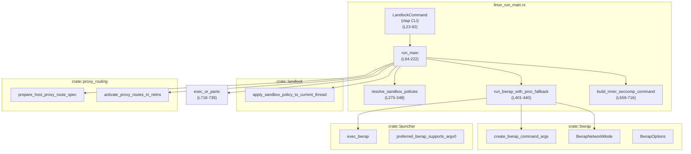
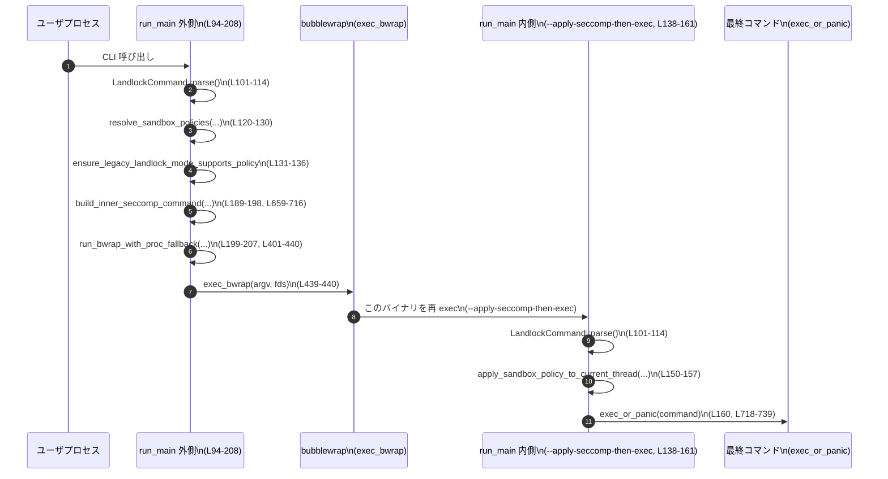

# linux-sandbox/src/linux_run_main.rs

## 0. ざっくり一言

Linux サンドボックスヘルパーのエントリポイントであり、CLI 引数からサンドボックスポリシーを解決し、bubblewrap（bwrap）＋seccomp もしくはレガシー Landlock のいずれかでプロセスをサンドボックスに入れた上で、最終コマンドに `execvp` するモジュールです（`LandlockCommand`, `run_main` 定義: `linux_run_main.rs:L23-92`, `L94-222`）。

---

## 1. このモジュールの役割

### 1.1 概要

- このモジュールは **Linux 上でコマンドを安全にサンドボックス実行する** ために存在し、以下を行います。
  - CLI から渡されたレガシー/分割サンドボックスポリシー（ファイルシステム＋ネットワーク）を正規化・検証する（`resolve_sandbox_policies`: `L275-348`）。
  - 必要に応じて bubblewrap によりファイルシステム名前空間を構成し、その内部で再実行して seccomp＋`no_new_privs` などのランタイム制限を適用する（`run_main`, `run_bwrap_with_proc_fallback`, `build_inner_seccomp_command`: `L94-222`, `L401-440`, `L659-716`）。
  - レガシーモードでは Landlock ベースのサンドボックスを適用して直接ユーザコマンドを `execvp` する（`apply_sandbox_policy_to_current_thread`, `exec_or_panic`: `L138-221`, `L718-739`）。

### 1.2 アーキテクチャ内での位置づけ

このファイルは「Linux サンドボックスヘルパー」バイナリの中心であり、他モジュールとの関係は概ね以下のようになっています。



- ポリシー表現（`SandboxPolicy`, `FileSystemSandboxPolicy`, `NetworkSandboxPolicy`）は `codex_protocol::protocol` から供給されます（インポート: `L18-20`）。
- bubblewrap ラッパ (`crate::bwrap`, `crate::launcher`) や Landlock 制御 (`crate::landlock`) は外部モジュールに委譲されており、このファイルはそれらをオーケストレーションする層です。

### 1.3 設計上のポイント

- **CLI ベースの設定**  
  - `LandlockCommand` は `clap::Parser` により CLI と 1:1 に対応する構造体です（`L23-92`）。
  - レガシー単一ポリシーと分割ポリシー（FS/Network）の両方を許容し、組み合わせに制約を課します（`resolve_sandbox_policies`: `L275-348`）。

- **二段階サンドボックス（outer bwrap → inner seccomp）**  
  - 通常パスでは、まず bubblewrap でファイルシステム・ネットワーク名前空間を構築し、その内部で本バイナリを再実行して seccomp / `no_new_privs` を適用します（`run_main`, `build_inner_seccomp_command`, `apply_sandbox_policy_to_current_thread`: `L94-222`, `L659-716`, `L150-158`）。
  - 内部再実行であることを `--apply-seccomp-then-exec` フラグで判別します（`LandlockCommand.apply_seccomp_then_exec`: `L63-69`）。

- **レガシー Landlock 互換性**  
  - `use_legacy_landlock` を指定すると bubblewrap を用いず、Landlock によるファイルシステム制限に直接依存するモードになります（`run_main` の末尾: `L210-221`）。
  - 分割ポリシーとレガシーポリシーの意味論の整合性を検査する仕組みを持ちます（`legacy_sandbox_policies_match_semantics`: `L350-361`）。

- **/proc マウントのプレフライト検査**  
  - 一部の制約されたコンテナ環境では `/proc` のマウントが失敗するため、短命の bubblewrap 子プロセスを fork して stderr を検査し、失敗を検知した場合は `--no-proc` 相当にフォールバックします（`preflight_proc_mount_support`, `run_bwrap_in_child_capture_stderr`, `is_proc_mount_failure`: `L519-533`, `L574-625`, `L640-645`）。

- **エラーハンドリングの方針**  
  - ほぼ全ての OS レベルエラーやポリシー不正は `panic!` によりプロセスを即時終了させます。  
    これにより「サンドボックス適用に失敗したのに非サンドボックスでコマンドが実行される」状況を避けています。

- **並行性**  
  - 内部で `libc::fork` を用いて一時的な子プロセスを生成しますが（`run_bwrap_in_child_capture_stderr`: `L586-604`）、スレッドは使っておらず、プロセスレベルの並行性のみです。
  - 子プロセスはすぐに `exec_bwrap` を呼び出すか、エラー時に `panic!` して終了します。

---

## 2. 主要な機能一覧

- CLI パース: `LandlockCommand` によるコマンドライン引数の定義とパース（`L23-92`, `L101-114`）。
- エントリポイント実行制御: `run_main` によるモード選択（inner stage / outer bwrap / legacy Landlock）（`L94-222`）。
- サンドボックスポリシー解決:
  - レガシー・分割ポリシーの整合性検査と正規化（`resolve_sandbox_policies`, `legacy_sandbox_policies_match_semantics`, `file_system_sandbox_policies_match_semantics`: `L275-377`）。
- モード制約チェック:
  - `ensure_inner_stage_mode_is_valid` でフラグの排他制約を強制（`L379-383`）。
  - `ensure_legacy_landlock_mode_supports_policy` でレガシーモードに不適切なポリシーを拒否（`L385-399`）。
- bubblewrap 実行パス:
  - ネットワークモード決定（`bwrap_network_mode`: `L442-452`）。
  - `/proc` マウント可否のプレフライトとフォールバック（`run_bwrap_with_proc_fallback`, `preflight_proc_mount_support`: `L401-440`, `L519-533`）。
  - bwrap コマンドラインの構築と `argv[0]` の調整（`build_bwrap_argv`, `apply_inner_command_argv0`, `apply_inner_command_argv0_for_launcher`: `L455-477`, `L479-510`）。
- 再実行用「inner コマンド」の組み立て: `build_inner_seccomp_command`（`L659-716`）。
- 最終コマンドの `execvp` 実行: `exec_or_panic`（`L718-739`）。
- bubblewrap プレフライト子プロセスの生成と stderr キャプチャ: `run_bwrap_in_child_capture_stderr`（`L574-625`）。
- /proc マウントエラー検知: `is_proc_mount_failure`（`L640-645`）。

---

## 3. 公開 API と詳細解説

### 3.1 型一覧（構造体・列挙体など）

| 名前 | 種別 | 役割 / 用途 | 定義位置 |
|------|------|-------------|----------|
| `LandlockCommand` | 構造体（`pub`） | clap による CLI 引数の定義。サンドボックスポリシーや各種モードフラグ、実行コマンドを保持する。 | `linux_run_main.rs:L23-92` |
| `EffectiveSandboxPolicies` | 構造体 | レガシー/分割ポリシーの整合性をとった「有効な」ポリシー 3 種をまとめて保持する。 | `linux_run_main.rs:L224-229` |
| `ResolveSandboxPoliciesError` | enum | サンドボックスポリシー解決時のエラー種別を表現する。Display 実装により人間可読なメッセージを提供。 | `linux_run_main.rs:L231-241`, `L243-272` |
| `InnerSeccompCommandArgs<'a>` | 構造体 | bwrap 内部で再実行する「inner」コマンドを組み立てるための引数束。借用と所有を混在させている。 | `linux_run_main.rs:L648-657` |

※ `FileSystemSandboxPolicy`, `NetworkSandboxPolicy`, `SandboxPolicy`, `BwrapNetworkMode`, `BwrapOptions` などは他モジュールで定義されており、このチャンクには現れません。

---

### 3.2 関数詳細（主要 7 件）

#### `pub fn run_main() -> !`

**概要**

- Linux サンドボックスヘルパーのエントリポイントです。CLI 引数を `LandlockCommand` としてパースし、ポリシーを解決した上で、bubblewrap＋seccomp もしくはレガシー Landlock のいずれかを使って環境をサンドボックス化し、その後ユーザコマンドに `execvp` します（`linux_run_main.rs:L94-222`）。
- 戻り値型 `!` が示すとおり、**正常経路では必ず `exec` または `panic!` により現在のプロセスが終了**します。

**引数**

- なし（CLI 引数は内部で `LandlockCommand::parse()` を通じて取得: `L101-114`）。

**戻り値**

- `!`（発散型）。関数から戻ることはありません。
  - 成功時: `execvp` によりユーザコマンドに置き換わる（`exec_or_panic` 経由: `L718-739`）。
  - 失敗時: `panic!` によりプロセスを異常終了します（多数箇所）。

**内部処理の流れ（アルゴリズム）**

1. **CLI パースと基本検証**  
   - `LandlockCommand::parse()` で CLI 引数を構造体に展開（`L101-114`）。
   - `command` が空であれば `panic!("No command specified to execute.")`（`L116-118`）。
   - `ensure_inner_stage_mode_is_valid` で `--apply-seccomp-then-exec` と `--use-legacy-landlock` の同時指定を拒否（`L119`, `L379-383`）。

2. **サンドボックスポリシーの解決**  
   - `resolve_sandbox_policies(...)` を呼び、`EffectiveSandboxPolicies` を得る（`L120-130`）。
   - 失敗時は `panic!("{err}")`（`L130`）。
   - `ensure_legacy_landlock_mode_supports_policy(...)` により、レガシーモードで扱えない分割ポリシー構成を拒否（`L131-136`, `L385-399`）。

3. **inner stage（bwrap 後の再実行）モード**  
   - `apply_seccomp_then_exec` が `true` の場合（これは bwrap 内部で再実行されたときのみ想定: `L138-161`）:
     - `allow_network_for_proxy` が `true` なら `proxy_route_spec` を要求し、`activate_proxy_routes_in_netns` でネットワーク名前空間内のプロキシルートを有効化（`L141-147`）。
     - `apply_sandbox_policy_to_current_thread(...)` で seccomp 等ランタイム制限を適用（`L150-157`）。
     - `exec_or_panic(command)` でユーザコマンドに `execvp`（`L160`）。

4. **「ファイルシステムをフルアクセス＋プロキシなし」特例パス**  
   - `file_system_sandbox_policy.has_full_disk_write_access()` かつ `!allow_network_for_proxy` の場合、bubblewrap を使わずにランタイム制限だけを適用して `exec_or_panic` します（`L163-175`）。
   - メソッド名から、ファイルシステムの書き込み制限が無効な構成であると推測されますが、正確な意味はこのチャンクだけからは断定できません。

5. **通常パス（outer bwrap → inner 再実行）**  
   - `!use_legacy_landlock` の場合（デフォルト）:
     - `allow_network_for_proxy` が `true` のとき、`prepare_host_proxy_route_spec` でホスト側のプロキシルート設定文字列を取得（`L177-187`）。
     - `InnerSeccompCommandArgs` を組み立て、`build_inner_seccomp_command` で「inner」コマンド argv を構築（`L189-198`, `L659-716`）。
     - `run_bwrap_with_proc_fallback(...)` を呼び、bubblewrap による名前空間構築と inner コマンド実行に移ります（`L199-207`, `L401-440`）。

6. **レガシー Landlock パス**  
   - 上記パスを通らない（= `use_legacy_landlock == true`）場合、bubblewrap は使わず:
     - `apply_sandbox_policy_to_current_thread(..., /*apply_landlock_fs*/ true, ...)` で Landlock を含むサンドボックス制限を適用（`L210-218`）。
     - `exec_or_panic(command)` でユーザコマンドに `execvp`（`L221`）。

**Examples（使用例）**

この関数は通常、バイナリの `fn main` からそのまま呼び出されます。

```rust
// src/main.rs からの典型的な呼び出し例（概念的な例）
fn main() {
    // この呼び出しの後は、成功すれば最終コマンドに exec され、
    // 失敗すれば panic! でプロセスが終了します。
    linux_sandbox::linux_run_main::run_main();
}
```

CLI からの使用イメージ（ポリシー JSON は簡略化されたプレースホルダです）:

```bash
# 分割ポリシー＋通常モードでの実行例（概念的な例）
linux-sandbox-helper \
  --sandbox-policy-cwd /workspace \
  --file-system-sandbox-policy '{"...fs_policy..."}' \
  --network-sandbox-policy '{"...net_policy..."}' \
  -- command arg1 arg2
```

**Errors / Panics**

`run_main` 自体は `Result` を返さず、様々な条件で `panic!` します。主な条件は以下です。

- `command` が空: `panic!("No command specified to execute.")`（`L116-118`）。
- `--apply-seccomp-then-exec` と `--use-legacy-landlock` が同時指定: `ensure_inner_stage_mode_is_valid` 内で panic（`L379-383`）。
- `resolve_sandbox_policies` がエラー (`MissingConfiguration`, `PartialSplitPolicies` など) を返す: `unwrap_or_else(|err| panic!("{err}"))`（`L125-130`）。
- レガシー Landlock モードに不適合な分割ポリシー: `ensure_legacy_landlock_mode_supports_policy` が panic（`L391-398`）。
- inner ステージでプロキシモードなのに `proxy_route_spec` が未指定: `panic!("managed proxy mode requires --proxy-route-spec")`（`L141-144`）。
- `apply_sandbox_policy_to_current_thread` がエラーを返す: panic でラップ（`L150-159`, `L164-173`, `L210-219`）。
- `prepare_host_proxy_route_spec` など外部関数がエラーを返した場合の明示的 panic（`L181-185`）。
- 後続で呼ばれる `run_bwrap_with_proc_fallback`, `exec_or_panic` 等も内部で panic 条件を持ちます。

**Edge cases（エッジケース）**

- サンドボックスポリシーが 1 つも指定されない場合: `resolve_sandbox_policies` が `MissingConfiguration` を返し、最終的に panic します（`L275-348` を参照）。
- FS/Network 分割ポリシーが片方だけ指定された場合: `PartialSplitPolicies` エラーで panic（`L284-290`）。
- レガシーポリシーと分割ポリシーの意味論が一致しない状態で両方を指定した場合: `MismatchedLegacyPolicy` により panic（`L292-325`）。
- `/proc` マウントが不可能なコンテナ環境: bwrap 実行前のプレフライトで検知され、`mount_proc` フラグが false に切り替わって再試行されます（`L414-425`）。

**使用上の注意点**

- `run_main` は呼び出し元プロセスを `exec` する前提で設計されており、**呼び出し後に処理が続くことはありません**。  
  他の初期化やロギングは `run_main` を呼ぶ前に完了している必要があります。
- CLI からの利用時には、**必ず実行コマンド（`--` 以降の引数）を 1 つ以上指定する必要があります**。
- サンドボックス適用に失敗した場合、コマンドは実行されずプロセスが死ぬ設計になっており、「サンドボックス適用に失敗したので制限なしで実行する」という挙動にはなりません。
- FFI を多用するため、`run_main` の振る舞いを変えるときは下層の `execvp`、`fork`、`pipe2` などの呼び出しとの整合性に注意が必要です。

---

#### `fn resolve_sandbox_policies(...) -> Result<EffectiveSandboxPolicies, ResolveSandboxPoliciesError>`

**概要**

- CLI から渡されたレガシー `SandboxPolicy` と分割された `FileSystemSandboxPolicy` / `NetworkSandboxPolicy` の組み合わせを検証し、一貫性のある `EffectiveSandboxPolicies` にまとめます（`linux_run_main.rs:L275-348`）。
- 受け付ける構成は「レガシーのみ」「分割のみ」「両方」であり、片方だけの分割ポリシーは拒否します。

**引数**

| 引数名 | 型 | 説明 |
|--------|----|------|
| `sandbox_policy_cwd` | `&Path` | ポリシーにおける cwd の解決に使うベースディレクトリ（`L276`）。 |
| `sandbox_policy` | `Option<SandboxPolicy>` | レガシー単一ポリシー（`L277`）。 |
| `file_system_sandbox_policy` | `Option<FileSystemSandboxPolicy>` | 分割ファイルシステムポリシー（`L278`）。 |
| `network_sandbox_policy` | `Option<NetworkSandboxPolicy>` | 分割ネットワークポリシー（`L279`）。 |

**戻り値**

- `Ok(EffectiveSandboxPolicies)`:
  - `sandbox_policy`: レガシー表現（分割ポリシーのみが与えられた場合はそこから導出: `L335-343`）。
  - `file_system_sandbox_policy`, `network_sandbox_policy`: 分割表現。
- `Err(ResolveSandboxPoliciesError)`:
  - `PartialSplitPolicies`, `SplitPoliciesRequireDirectRuntimeEnforcement`, `FailedToDeriveLegacyPolicy`, `MismatchedLegacyPolicy`, `MissingConfiguration` のいずれか（`L231-241`）。

**内部処理の流れ**

1. 分割ポリシーの有無を判定し、両方あり／両方なし／片側だけの 3 パターンを分類（`L284-290`）。
   - 片側だけの場合は直ちに `Err(PartialSplitPolicies)` を返す。
2. `(sandbox_policy, split_policies)` の組み合わせについて `match`（`L292-347`）:
   - **レガシー＋分割の両方がある場合**（`L293-325`）:
     - FS ポリシーが「直接ランタイム enforcement が必要」と判定される場合は、そのまま 3 つを返す（`L294-301`）。
     - そうでない場合、分割ポリシーからレガシーポリシーを導出し（`to_legacy_sandbox_policy`: `L303-309`）、与えられたレガシーポリシーと意味論が一致するか `legacy_sandbox_policies_match_semantics` で確認（`L310-320`）。
     - 一致すれば 3 つのポリシーを返し、不一致なら `Err(MismatchedLegacyPolicy)` を返す。
   - **レガシーポリシーだけある場合**（`L326-333`）:
     - `FileSystemSandboxPolicy::from_legacy_sandbox_policy` と `NetworkSandboxPolicy::from` で分割ポリシーを導出し、3 つを返す。
   - **分割ポリシーだけある場合**（`L334-344`）:
     - FS ポリシーからレガシーポリシーを導出し（`to_legacy_sandbox_policy`）、3 つを返す。
   - **何もない場合**（`L346-347`）:
     - `Err(MissingConfiguration)` を返す。

**Examples（使用例）**

`run_main` 内の呼び出し（`L120-130`）:

```rust
let EffectiveSandboxPolicies {
    sandbox_policy,
    file_system_sandbox_policy,
    network_sandbox_policy,
} = resolve_sandbox_policies(
        sandbox_policy_cwd.as_path(),
        sandbox_policy,
        file_system_sandbox_policy,
        network_sandbox_policy,
    )
    .unwrap_or_else(|err| panic!("{err}"));
```

ここで `sandbox_policy` / `file_system_sandbox_policy` / `network_sandbox_policy` は `LandlockCommand` から来ています。

**Errors / Panics**

- この関数自体は `panic!` せず `Result` を返します。
- ただし `run_main` 側で `unwrap_or_else(|err| panic!("{err}")` としているため、**呼び出し側の使い方としてはエラー＝プロセス終了**となります。

**Edge cases**

- `sandbox_policy` も分割ポリシーも `None` の場合 → `MissingConfiguration`（`L346-347`）。
- 分割ポリシーが FS/Network のどちらか片方だけ → `PartialSplitPolicies`（`L284-290`）。
- 分割ポリシーが「直接ランタイム enforcement 必須」と判定されるケースでもレガシーポリシーが併記された場合:
  - このチャンクでは `SplitPoliciesRequireDirectRuntimeEnforcement` エラーが「レガシーとの併用禁止」ケースでのみ使われており（`L303-309`）、FS ポリシー側の挙動詳細は不明です。

**使用上の注意点**

- レガシー／分割の両方を渡す場合、**意味論が完全に一致している必要がある**ため、ポリシー生成側はこの前提を満たすように設計されている必要があります（`legacy_sandbox_policies_match_semantics`: `L350-361` 参照）。
- `sandbox_policy_cwd` を変えると `FileSystemSandboxPolicy::from_legacy_sandbox_policy` や `get_*_roots_with_cwd` 系の結果が変化するため、同じポリシーでも意味論が変わり得ます。

---

#### `fn run_bwrap_with_proc_fallback(...) -> !`

**概要**

- bubblewrap を用いてサンドボックス環境を構築し、inner コマンドを実行するラッパ関数です（`linux_run_main.rs:L401-440`）。
- `/proc` のマウントが禁止された環境を検出するため、必要に応じてプレフライトを行い、失敗した場合は `mount_proc = false` にフォールバックした上で bwrap を起動します。

**引数**

| 引数名 | 型 | 説明 |
|--------|----|------|
| `sandbox_policy_cwd` | `&Path` | ポリシー CWD。bwrap のルート設定に利用されます（`L402`）。 |
| `command_cwd` | `Option<&Path>` | コマンドの論理的な cwd。未指定なら `sandbox_policy_cwd` を使う（`L403`, `L412`）。 |
| `file_system_sandbox_policy` | `&FileSystemSandboxPolicy` | ファイルシステムポリシー。bwrap のマウント指定構築に使用（`L404`）。 |
| `network_sandbox_policy` | `NetworkSandboxPolicy` | ネットワークポリシー。bwrap のネットワークモード決定に利用（`L405`）。 |
| `inner` | `Vec<String>` | bwrap 内で実行する「inner」コマンドの argv（`L406`）。 |
| `mount_proc` | `bool` | `/proc` を新しくマウントすべきかどうか（`L407`）。 |
| `allow_network_for_proxy` | `bool` | プロキシルーティングのためにネットワークを開放するかどうか（`L408`）。 |

**戻り値**

- `!`（発散型）。内部で `exec_bwrap` を呼び出すため、戻りません（`L439-440`）。

**内部処理の流れ**

1. `bwrap_network_mode` により `BwrapNetworkMode` を決定（`L410-411`, `L442-452`）。
2. `command_cwd` が `None` の場合は `sandbox_policy_cwd` に置き換え（`L412-413`）。
3. `/proc` マウントプレフライト（`L414-425`）:
   - `mount_proc` が `true` の場合のみ、`preflight_proc_mount_support(...)` を呼ぶ（`L414-420`）。
   - プレフライトが `false` を返した場合、`mount_proc = false` に変更して続行（`L421-425`）。
   - コメントにある通り、プレフライト失敗時のリトライは**静かに**行われ、stderr は子プロセス内部にのみ閉じ込められます。
4. `BwrapOptions { mount_proc, network_mode }` を構築（`L427-430`）。
5. `build_bwrap_argv(...)` で bwrap 用 argv＋保持ファイルディスクリプタを構築（`L431-437`）。
6. `apply_inner_command_argv0(&mut bwrap_args.args)` で inner コマンドの `argv[0]` を調整（`L438`, `L479-485`）。
7. `exec_bwrap(...)` を呼び出し、bubblewrap に `exec` します（`L439-440`）。

**Errors / Panics**

- この関数内で直接 `panic!` は呼んでいませんが、呼び出す関数が panic する可能性があります:
  - `build_bwrap_argv` は `create_bwrap_command_args` のエラーを `panic!("error building bubblewrap command: {err:?}")` に変換（`L469-476`）。
  - `apply_inner_command_argv0` は後述の `apply_inner_command_argv0_for_launcher` で `panic!` 条件あり（`L487-507`）。
  - `exec_bwrap` の内部挙動はこのチャンクには現れません。

**Edge cases**

- `/proc` マウントが不可能な環境:
  - プレフライトで検知→`mount_proc` を false にして再試行（`L414-425`）。
  - これによりプロセス分離は維持しつつ、`/proc` の再マウントだけを諦めるという挙動になります。
- `command_cwd` 未指定:
  - `sandbox_policy_cwd` が論理 cwd として利用されます（`L412-413`）。

**使用上の注意点**

- `run_bwrap_with_proc_fallback` は `!` 戻り値であり、**呼び出し元には戻りません**。呼ぶ位置は `run_main` の中に限定されており、他の箇所から呼ぶ場合も同様の前提になります。
- `/proc` マウントプレフライトは bwrap 実行とは別のプロセス（`run_bwrap_in_child_capture_stderr` 参照）で行われるため、システムへの負荷を考慮すると過度な呼び出しは避けるべきです。
- `network_sandbox_policy` が `allow_network_for_proxy` と組み合わさることでネットワークモードが変化するため、これらの値を変えると bwrap 側の挙動が大きく変わります。

---

#### `fn preflight_proc_mount_support(...) -> bool`

**概要**

- bubblewrap を用いて短命な子プロセスを起動し、`--proc /proc` を伴う bwrap 実行が成功するかどうかを stderr の内容で判定する関数です（`linux_run_main.rs:L519-533`）。
- これにより `/proc` マウントを禁止しているコンテナ環境を事前に検出します。

**引数**

| 引数名 | 型 | 説明 |
|--------|----|------|
| `sandbox_policy_cwd` | `&Path` | サンドボックスポリシーに基づく cwd（`L520`）。 |
| `command_cwd` | `&Path` | 実行時の cwd（`L521`）。 |
| `file_system_sandbox_policy` | `&FileSystemSandboxPolicy` | bwrap プレフライト用の FS ポリシー（`L522`）。 |
| `network_mode` | `BwrapNetworkMode` | ネットワークモード。実際の実行時と同じモードを使う（`L523`）。 |

**戻り値**

- `true`: `/proc` マウントを含む bwrap 実行が成功すると判断された。
- `false`: stderr 内容から `/proc` マウント失敗と判断された。

**内部処理の流れ**

1. `build_preflight_bwrap_argv(...)` でプレフライト用 bwrap argv を構築（`L525-530`, `L535-552`）。
   - inner コマンドは `/usr/bin/true` か `/bin/true` か `true` のいずれか（`resolve_true_command`: `L554-560`）。
   - `BwrapOptions { mount_proc: true, network_mode }` を常に使用（`L547-551`）。
2. `run_bwrap_in_child_capture_stderr(preflight_argv)` を実行し、子プロセスの stderr を文字列として取得（`L531`, `L574-625`）。
3. `!is_proc_mount_failure(stderr.as_str())` を評価して返却（`L532-533`, `L640-645`）。

**Errors / Panics**

- この関数自体は `bool` を返すのみですが、内部の `build_preflight_bwrap_argv` / `run_bwrap_in_child_capture_stderr` は `panic!` する可能性があります。
- 特に `run_bwrap_in_child_capture_stderr` は `pipe2`, `fork`, `dup2`, `waitpid` 等の OS コール失敗時に panic を発生させます（`L577-582`, `L586-590`, `L617-622`）。

**Edge cases**

- stderr が空、または `/proc` マウントに失敗したことを示す既知の文言が含まれない場合:
  - `is_proc_mount_failure` が `false` を返し、結果として `preflight_proc_mount_support` は `true` を返します（`L640-645`）。
  - このため、「判定できないエラー」は `/proc` マウント成功と同様に扱われ、実際の bwrap 実行でエラーになった場合はその時点で別途失敗として扱われることになります。

**使用上の注意点**

- この関数の目的はあくまで「/proc マウントが明確に失敗する環境を先に検出する」ことであり、**その他のエラー原因を分類するものではありません**。
- 判定は stderr の文字列マッチングに依存しているため、bubblewrap のエラーメッセージ形式が変わった場合には挙動が変わりうることに注意が必要です。

---

#### `fn run_bwrap_in_child_capture_stderr(bwrap_args: crate::bwrap::BwrapArgs) -> String`

**概要**

- `fork` を使って子プロセスを生成し、その子プロセスで bubblewrap を実行させつつ stderr を親プロセス側で読み取って文字列として返す関数です（`linux_run_main.rs:L574-625`）。
- `/proc` マウントプレフライトなど、短命の bwrap 実行に対して stderr の内容を解析する用途を想定しています。

**引数**

| 引数名 | 型 | 説明 |
|--------|----|------|
| `bwrap_args` | `crate::bwrap::BwrapArgs` | 実行する bubblewrap の argv と、保持すべきファイルディスクリプタのセット（`L574`）。 |

**戻り値**

- `String`: 子プロセス（bwrap）の stderr 出力。
  - サイズ上限は `MAX_PREFLIGHT_STDERR_BYTES = 64 * 1024` バイトに制限されます（`L575`）。

**内部処理の流れ**

1. `pipe2` で `O_CLOEXEC` 付きのパイプ（`pipe_fds[0]` 読み端, `pipe_fds[1]` 書き端）を作成（`L577-584`）。
2. `fork` を実行（`L586-590`）。
   - **子プロセス (`pid == 0`)**（`L592-603`）:
     - 読み端 FD を閉じる（`close_fd_or_panic(read_fd, ...)`: `L595`）。
     - `dup2(write_fd, STDERR_FILENO)` により stderr をパイプ書き端にリダイレクト（`L596-599`）。
     - 書き端 FD を閉じる（`L600`）。
     - `exec_bwrap(bwrap_args.args, bwrap_args.preserved_files)` で bubblewrap を `exec`（`L603`）。
   - **親プロセス**:
     - 書き端 FD を閉じてから（`L607`）、読み端を `File::from_raw_fd` で `File` としてラップ（`L610`）。
     - `take(MAX_PREFLIGHT_STDERR_BYTES)` 付きの reader で stderr を全て読み取り、`stderr_bytes` に蓄積（`L611-615`）。
     - `waitpid(pid, &mut status, 0)` で子プロセス終了を待機（`L617-622`）。
3. `stderr_bytes` を `String::from_utf8_lossy(...).into_owned()` で UTF-8 文字列に変換して返す（`L624`）。

**Errors / Panics**

- `pipe2` 失敗: `panic!("failed to create stderr pipe for bubblewrap: {err}")`（`L579-582`）。
- `fork` 失敗: `panic!("failed to fork for bubblewrap: {err}")`（`L587-590`）。
- 子プロセスでの `dup2` 失敗: panic（`L596-599`）。
- `close_fd_or_panic` 内での `close` 失敗: panic（`L632-637`）。
- 親プロセスでの `read_to_end` 失敗: `panic!("failed to read bubblewrap stderr: {err}")`（`L613-615`）。
- `waitpid` 失敗: `panic!("waitpid failed for bubblewrap child: {err}")`（`L618-622`）。

**並行性 / 安全性の観点**

- `fork` 後の子プロセスは、基本的に標準 C ライブラリや Rust ランタイムの状態を複製したままですが、すぐに `exec_bwrap` される設計です（`L592-603`）。
- 子プロセス内で `panic!` した場合の詳細な後処理（`abort` か unwind か）はこのチャンクからは分かりませんが、いずれにしても親とは独立して終了します。
- 親プロセス側ではパイプ読み取りと `waitpid` のみを行っており、マルチスレッドを使っていないため、**プロセスレベルの単純な並行性モデル**になっています。

**使用上の注意点**

- 戻り値は stderr の内容のみであり、終了ステータスなどは呼び出し元で解釈していません。この関数の現用途（`preflight_proc_mount_support`) では stderr のテキストマッチのみを利用しています。
- `MAX_PREFLIGHT_STDERR_BYTES` により読み取りサイズが制限されているため、非常に大量の stderr を出すコマンドに対しては切り捨てが発生する場合がありますが、プレフライト用途では問題になりにくい想定です。

---

#### `fn build_inner_seccomp_command(args: InnerSeccompCommandArgs<'_>) -> Vec<String>`

**概要**

- bubblewrap 内部で再実行する「inner」コマンドの argv を構築します（`linux_run_main.rs:L659-716`）。
- 現在実行中のバイナリパスを先頭要素とし、ポリシーを JSON 文字列として CLI 引数に含め、最後に `--` の後ろにユーザコマンドを連結する形式です。

**引数**

| 引数名 | 型 | 説明 |
|--------|----|------|
| `args` | `InnerSeccompCommandArgs<'_>` | CWD, ポリシー、プロキシ設定、最終コマンドなどを含む構造体（`L661-670`, `L648-657`）。 |

**戻り値**

- `Vec<String>`: bubblewrap から実行される inner コマンドの argv。  
  例として、先頭は `current_exe`、続いて `--sandbox-policy-cwd` などのオプションが続き、最後に `--` とユーザコマンドが含まれます（`L688-715`）。

**内部処理の流れ**

1. `InnerSeccompCommandArgs` を分解してローカル変数に展開（`L661-670`）。
2. `std::env::current_exe()` で現在実行中のバイナリパスを取得（`L671-674`）。失敗したら panic。
3. `serde_json::to_string` により、`sandbox_policy`, `file_system_sandbox_policy`, `network_sandbox_policy` を JSON 文字列にシリアライズ（`L675-686`）。失敗時はそれぞれ panic。
4. `inner` ベクタを初期化（`L688-692`）:
   - [0]   = `current_exe` のパス文字列。
   - [1-2] = `--sandbox-policy-cwd`, `sandbox_policy_cwd`。
5. `command_cwd` が存在する場合、`--command-cwd` とパス文字列を追加（`L693-696`）。
6. 分割ポリシーとレガシーポリシー JSON を CLI 引数として追加（`L697-705`）:
   - `--sandbox-policy`, `<policy_json>`
   - `--file-system-sandbox-policy`, `<fs_policy_json>`
   - `--network-sandbox-policy`, `<network_policy_json>`
   - `--apply-seccomp-then-exec`（フラグ）
7. `allow_network_for_proxy` が `true` の場合、`--allow-network-for-proxy` と `--proxy-route-spec` `<spec>` を追加（`L706-712`）。
8. 区切り用の `"--"` を追加し、その後ろに `command` ベクタの要素をすべて連結（`L713-715`）。

**Errors / Panics**

- `current_exe` 取得失敗: `panic!("failed to resolve current executable path: {err}")`（`L671-674`）。
- `serde_json::to_string` 失敗: それぞれ `panic!("failed to serialize ... policy: {err}")`（`L675-686`）。
- `allow_network_for_proxy` が `true` なのに `proxy_route_spec` が `None` の場合: `panic!("managed proxy mode requires a proxy route spec")`（`L707-710`）。

**Edge cases**

- `command` が空の `InnerSeccompCommandArgs` を渡した場合:
  - コード上は許容されていますが（`command` に対するチェックはありません）、後続の `run_main` → `exec_or_panic` において `command[0]` アクセスでパニックが発生します。
  - 現状、この関数の呼び出し元である `run_main` は CLI レベルで `command` 非空を保証しているため、このケースは想定されていません（`L116-118`）。

**使用上の注意点**

- 生成されるコマンドラインにはポリシー JSON が **文字列として埋め込まれます**。ポリシーのサイズや内容（例: 改行・特殊文字）によりシェルからの取り扱いが変わるため、バイナリ内部からのみ利用される前提で設計されていると考えられます（外部から手書きするのは現実的ではない想定）。
- `InnerSeccompCommandArgs` にフィールドを追加する場合は、この関数と `run_main` の引数構築部分（`L189-198`）を同期して変更する必要があります。

---

#### `fn exec_or_panic(command: Vec<String>) -> !`

**概要**

- 与えられた `command` argv を C 文字列に変換し、`libc::execvp` を用いて `exec` します（`linux_run_main.rs:L718-739`）。
- `execvp` が戻ってくる（= 失敗）場合は、`panic!` によりプロセスを終了します。

**引数**

| 引数名 | 型 | 説明 |
|--------|----|------|
| `command` | `Vec<String>` | `argv[0]` がコマンド名、それ以降が引数の argv ベクタ（`L718`）。 |

**戻り値**

- `!`（発散型）。成功すれば `execvp` により別プロセスイメージに置き換わるため戻りません。

**内部処理の流れ**

1. `command[0]` を取り出して `CString::new` で C 文字列へ変換（`L721-722`）。
2. `command` の各要素を `CString::new` で C 文字列へ変換し、`Vec<CString>` を作成（`L724-727`）。
3. 各 `CString` の `as_ptr()` を `Vec<*const libc::c_char>` に詰め、最後に `null` ポインタを追加して `argv` 配列形式にする（`L729-730`）。
4. `libc::execvp(c_command.as_ptr(), c_args_ptrs.as_ptr())` を呼ぶ（`L732-734`）。
5. `execvp` から戻ってきた場合（= 失敗）、`std::io::Error::last_os_error()` により errno を取得し、`panic!("Failed to execvp {}: {err}", ...)` を発生させる（`L736-738`）。

**Errors / Panics**

- `command[0]` へのアクセスは事前条件として `command` が非空であることを前提としています。`run_main` はこの前提を満たすように `command.is_empty()` をチェックしています（`L116-118`）。
- いずれかの引数に NUL バイトが含まれている場合、`CString::new` が失敗し `expect("Failed to convert ...")` により panic します（`L721-722`, `L724-727`）。
- `execvp` 失敗時は errno に応じた `std::io::Error` を取得し、panic します（`L736-738`）。

**使用上の注意点**

- **NUL バイト (`\0`) を含まない引数のみを許容**しています。CLI 由来の一般的な文字列では問題になりにくいですが、バイナリデータを引数として渡す用途には適しません。
- `exec_or_panic` 呼び出し後は、**プロセスが置き換わるか、panic で終了するかの二択**であり、戻り値を期待してはいけません。
- FFI を介した `execvp` 呼び出しであるため、追加の処理を入れる場合には async-signal-safe かどうかなど OS レベルの制約を意識する必要があります。

---

### 3.3 その他の関数

| 関数名 | 役割（1 行） | 定義位置 |
|--------|--------------|----------|
| `legacy_sandbox_policies_match_semantics` | レガシー `SandboxPolicy` 同士の意味論が一致するか、分割ポリシー換算を通じて比較する。 | `linux_run_main.rs:L350-361` |
| `file_system_sandbox_policies_match_semantics` | 2 つの `FileSystemSandboxPolicy` が同じアクセス権・ルート集合を持つかを比較する。 | `linux_run_main.rs:L363-377` |
| `ensure_inner_stage_mode_is_valid` | `--apply-seccomp-then-exec` と `--use-legacy-landlock` の同時指定を禁止する。 | `linux_run_main.rs:L379-383` |
| `ensure_legacy_landlock_mode_supports_policy` | レガシーモードで「直接ランタイム enforcement 必須」な分割ポリシーを拒否する。 | `linux_run_main.rs:L385-399` |
| `bwrap_network_mode` | `NetworkSandboxPolicy` と `allow_network_for_proxy` から `BwrapNetworkMode` を決定する。 | `linux_run_main.rs:L442-452` |
| `build_bwrap_argv` | `create_bwrap_command_args` の結果に `"bwrap"` を先頭として付け、`BwrapArgs` を構築する。 | `linux_run_main.rs:L455-477` |
| `apply_inner_command_argv0` | デフォルトの現在プロセス `argv[0]` 情報を用いて `apply_inner_command_argv0_for_launcher` を呼び出す。 | `linux_run_main.rs:L479-485` |
| `apply_inner_command_argv0_for_launcher` | bubblewrap 引数中の `"--"` の位置を探し、`--argv0` 追加または inner コマンド名の書き換えを行う。 | `linux_run_main.rs:L487-510` |
| `current_process_argv0` | `std::env::args_os().next()` から現在プロセスの `argv[0]` を取得し、`String` に変換する。 | `linux_run_main.rs:L512-516` |
| `build_preflight_bwrap_argv` | `/bin/true` 等を inner コマンドとしたプレフライト用 bwrap argv を構築する。 | `linux_run_main.rs:L535-552` |
| `resolve_true_command` | `/usr/bin/true` → `/bin/true` → `"true"` の順に存在するものを返す。 | `linux_run_main.rs:L554-560` |
| `close_fd_or_panic` | `libc::close` の戻り値をチェックし、失敗したら context を含めて panic する。 | `linux_run_main.rs:L632-637` |
| `is_proc_mount_failure` | stderr 文字列に `/newroot/proc` 関連の既知エラーメッセージが含まれるか判定する。 | `linux_run_main.rs:L640-645` |

---

## 4. データフロー

ここでは、**通常パス（分割ポリシー＋非レガシーモード）** におけるデータフローを示します。

### 4.1 外側 run_main → bubblewrap → 内側 run_main → 最終コマンド



- ポリシー JSON は `build_inner_seccomp_command` の段階で CLI 引数に埋め込まれ、内側 `run_main` では再び `LandlockCommand::parse()` により構造体に戻されます。
- `apply_sandbox_policy_to_current_thread` の `apply_landlock_fs` 引数は inner ステージでは `false` 固定になっており（`L154`）、ファイルシステム制限は bubblewrap による名前空間変更に依存していることが分かります。
- ネットワーク関連の挙動は `allow_network_for_proxy`, `proxy_route_spec`, `NetworkSandboxPolicy` によって変化し、bwrap では `BwrapNetworkMode` に反映され、inner ステージでは `activate_proxy_routes_in_netns` と `apply_sandbox_policy_to_current_thread` に反映されます。

---

## 5. 使い方（How to Use）

### 5.1 基本的な使用方法

このモジュールは、通常は「Linux サンドボックスヘルパー」バイナリとしてビルドされ、`run_main` が `main` 関数から呼ばれます。

```rust
// 概念的な main 実装例（crate 名やモジュールパスは実際の構成に依存します）
fn main() {
    // 他の初期化やログ設定などがあれば先に行う。
    // ここから先は run_main が exec するため戻ってきません。
    linux_sandbox::linux_run_main::run_main();
}
```

CLI からの実行イメージ（ポリシー JSON は簡略化例）:

```bash
# 分割ポリシーを使った標準的な呼び出し
./linux-sandbox-helper \
  --sandbox-policy-cwd /workspace \
  --file-system-sandbox-policy '{"...fs_policy_json..."}' \
  --network-sandbox-policy '{"...net_policy_json..."}' \
  -- command arg1 arg2

# レガシー Landlock モードでの呼び出し（bubblewrap を利用しない）
./linux-sandbox-helper \
  --sandbox-policy-cwd /workspace \
  --sandbox-policy '{"...legacy_policy_json..."}' \
  --use-legacy-landlock \
  -- command arg1 arg2
```

### 5.2 よくある使用パターン

1. **標準モード（分割ポリシー＋bwrap＋inner seccomp）**

   - `--file-system-sandbox-policy` と `--network-sandbox-policy` の両方を指定し、`--use-legacy-landlock` を付けない。
   - `run_main` は outer → bwrap → inner の二段階で制限を適用します（`L177-208`）。

2. **レガシーモード（Landlock のみ）**

   - `--sandbox-policy` のみ、または `--sandbox-policy` と分割ポリシーの組み合わせで指定し、`--use-legacy-landlock` を付ける。
   - `run_main` は bubblewrap を呼ばず、`apply_sandbox_policy_to_current_thread(..., /*apply_landlock_fs*/ true)` の後に直接 `exec_or_panic` します（`L210-221`）。

3. **ファイルシステムフルアクセス＋ランタイム制限のみ**

   - 分割ポリシーが「フルディスク書き込みアクセス」を許可する構成を持ち、`allow_network_for_proxy == false` の場合（`L163-175`）。
   - bubblewrap によるファイルシステム分離を行わず、`apply_sandbox_policy_to_current_thread(..., /*apply_landlock_fs*/ false)` のみを適用して `exec_or_panic` します。

4. **プロキシ向けネットワーク許可モード**

   - `--allow-network-for-proxy` を付けた場合:
     - outer ステージでは `prepare_host_proxy_route_spec` でホスト側ルートを準備（`L181-185`）。
     - inner ステージでは `activate_proxy_routes_in_netns` でネット名前空間内にルートを設定（`L141-147`）。
     - bwrap のネットワークモードは `BwrapNetworkMode::ProxyOnly` になります（`L443-447`）。

### 5.3 よくある間違い

```rust
// 間違い例: inner ステージとレガシーモードを同時に有効化してしまう
// (この構成で起動すると ensure_inner_stage_mode_is_valid 内で panic)
./linux-sandbox-helper \
  --sandbox-policy-cwd /workspace \
  --sandbox-policy '{"..."}' \
  --use-legacy-landlock \
  --apply-seccomp-then-exec \  # ← 内部用フラグを誤って指定
  -- command arg1

// 正しい考え方: --apply-seccomp-then-exec は inner 実行専用
// 外部からは通常指定せず、レガシーモードを使う場合は --use-legacy-landlock のみ付ける。
./linux-sandbox-helper \
  --sandbox-policy-cwd /workspace \
  --sandbox-policy '{"..."}' \
  --use-legacy-landlock \
  -- command arg1
```

```bash
# 間違い例: 分割ポリシーが片方だけ
./linux-sandbox-helper \
  --sandbox-policy-cwd /workspace \
  --file-system-sandbox-policy '{"...fs_only..."}' \
  -- command arg1
# → resolve_sandbox_policies が PartialSplitPolicies を返し、panic

# 正しい例: 分割ポリシーは必ず FS/Network の両方を指定する
./linux-sandbox-helper \
  --sandbox-policy-cwd /workspace \
  --file-system-sandbox-policy '{"...fs..."}' \
  --network-sandbox-policy '{"...net..."}' \
  -- command arg1
```

### 5.4 使用上の注意点（まとめ）

- **前提条件**
  - `command`（`LandlockCommand.command`）は非空である必要があります（`L116-118`）。
  - 分割ポリシーを使う場合、`file_system_sandbox_policy` と `network_sandbox_policy` は両方とも指定する必要があります（`L284-290`）。
  - `--allow-network-for-proxy` を指定して inner ステージを使う場合は、`proxy_route_spec` が必須であり、欠如すると panic します（`L141-144`, `L707-710`）。

- **エラー・パニック条件**
  - サンドボックスポリシーに関するミスコンフィグ（不足・不整合）はすべて `ResolveSandboxPoliciesError` 経由で検出され、`run_main` 内で panic に変換されます（`L120-130`）。
  - OS レベルのエラー（`fork`, `pipe2`, `dup2`, `waitpid`, `execvp` など）は、全て `panic!` により致命的と扱われます（`L577-582`, `L586-590`, `L596-599`, `L613-615`, `L618-622`, `L736-738`）。

- **セキュリティ上の性質**
  - サンドボックス制約の適用に失敗した場合に、**非サンドボックスでユーザコマンドを実行するコードパスは存在せず**、いずれも panic によるプロセス終了となります。
  - `/proc` マウントに失敗する環境では、`mount_proc=false` でフォールバックして実行するため、PID 名前空間分離と `/proc` の関係は環境に依存します（`L414-425` のコメント参照）。

- **並行性**
  - `run_bwrap_in_child_capture_stderr` による `fork` / `waitpid` を除き、スレッドなどの同時実行は行っていません。
  - `fork` 後すぐに `exec_bwrap` が呼ばれる設計のため、子プロセス側で複雑な Rust ランタイム状態を扱うことは避けられています（`L592-603`）。

---

## 6. 変更の仕方（How to Modify）

### 6.1 新しい機能を追加する場合

新しい CLI オプションやポリシー関連の機能を追加する場合、主に以下の流れで変更が入ります。

1. **CLI 定義の拡張**
   - `LandlockCommand` に新しいフィールドと `#[arg(...)]` 属性を追加します（`L23-92`）。
2. **run_main の分解パターンにフィールドを追加**
   - `let LandlockCommand { ... } = LandlockCommand::parse();` のパターンに新フィールドを追加します（`L101-114`）。
3. **inner ステージへの伝播**
   - inner でも同じオプションを使う必要がある場合は:
     - `InnerSeccompCommandArgs` にフィールドを追加（`L648-657`）。
     - `build_inner_seccomp_command` 内で CLI 引数としてシリアライズする処理を追加（`L688-705` 付近）。
4. **bubblewrap 経路への反映**
   - bubblewrap の動作に影響する場合は、`BwrapOptions` や `create_bwrap_command_args` 呼び出し部分（`L427-437`, `L462-469`）に新オプションを渡す必要があります。
5. **テスト**
   - `#[path = "linux_run_main_tests.rs"] mod tests;` により同一ディレクトリのテストモジュールが存在しますが、このチャンクには内容が現れません（`L741-742`）。
   - 機能追加に応じて該当テストファイルにケースを追加するのが自然です。

### 6.2 既存の機能を変更する場合

- **ポリシー意味論の変更**
  - `FileSystemSandboxPolicy` や `NetworkSandboxPolicy` の意味論を変更する場合、`legacy_sandbox_policies_match_semantics` と `file_system_sandbox_policies_match_semantics` の比較ロジック（`L350-377`）が期待と一致しているか確認する必要があります。
- **/proc マウント検出ロジックの変更**
  - bubblewrap のエラーメッセージ形式が変わるなどで `/proc` マウント検出が不適切になった場合、`is_proc_mount_failure` の文字列マッチ条件（`L640-645`）や `preflight_proc_mount_support` の扱いを更新する必要があります。
- **exec / fork まわりの変更**
  - `run_bwrap_in_child_capture_stderr` や `exec_or_panic` を変更する際は、FFI 呼び出しの安全性（特に `fork` 後にどのような処理を行うか）やファイルディスクリプタのクローズ条件（`close_fd_or_panic`: `L632-637`）に注意する必要があります。

---

## 7. 関連ファイル

| パス / モジュール | 役割 / 関係 |
|-------------------|------------|
| `crate::bwrap` | `BwrapNetworkMode`, `BwrapOptions`, `create_bwrap_command_args`, `BwrapArgs` を提供し、bubblewrap コマンドラインとオプションを構築するモジュールです（インポート: `L10-12`, 使用: `L401-440`, `L455-477`, `L535-552`）。 |
| `crate::landlock` | `apply_sandbox_policy_to_current_thread` を提供し、ランドロックや seccomp 等のランタイム制限適用を担当します（`L13`, 使用: `L150-158`, `L164-173`, `L210-219`）。 |
| `crate::launcher` | `exec_bwrap`, `preferred_bwrap_supports_argv0` を提供し、bubblewrap の起動と `argv[0]`サポート検出を担当します（`L14-15`, 使用: `L439-440`, `L479-485`）。 |
| `crate::proxy_routing` | `activate_proxy_routes_in_netns`, `prepare_host_proxy_route_spec` を提供し、プロキシ用のルーティング設定を行います（`L16-17`, 使用: `L141-147`, `L181-185`）。 |
| `codex_protocol::protocol` | `SandboxPolicy`, `FileSystemSandboxPolicy`, `NetworkSandboxPolicy` の型定義と関連メソッド（`from_legacy_sandbox_policy`, `to_legacy_sandbox_policy`, `needs_direct_runtime_enforcement`, `has_full_disk_*_access` など）を提供します（`L18-20`, 使用: `L275-377`）。このチャンク内には具体的な実装は現れません。 |
| `codex_sandboxing::landlock::CODEX_LINUX_SANDBOX_ARG0` | inner コマンドの `argv[0]` として用いる特別な値を提供します（`L21`, 使用: `L498-501`）。 |
| `linux-sandbox/src/linux_run_main_tests.rs` | このモジュール専用のテストコードが置かれていると考えられますが、このチャンクには内容が現れません（テストモジュール宣言: `L741-742`）。 |

このレポートは、本ファイル `linux_run_main.rs` の内容に基づいており、他ファイルの実装詳細については「このチャンクには現れない」ため、具体的な挙動は記述していません。
