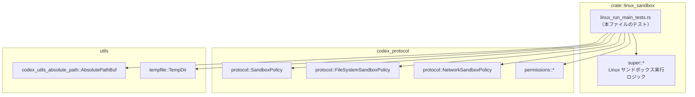
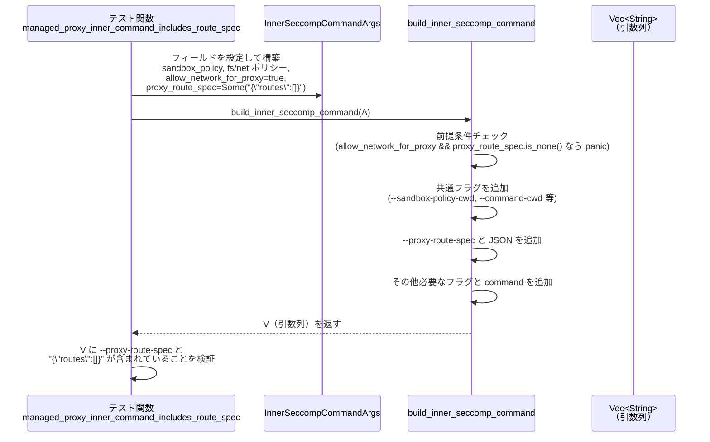

# linux-sandbox/src/linux_run_main_tests.rs コード解説

## 0. ざっくり一言

このファイルは、Linux 向けのサンドボックス実行ロジック（`super::*`）に対するテスト群です。  
主に **bubblewrap(bwrap) のコマンドライン構築**、**ファイルシステム／ネットワークのサンドボックスポリシー解決**、**seccomp / Landlock のモード検証** の振る舞いを検証しています。

> ※ 行番号はこのチャンクには含まれていないため、正確な `Lxx-yy` 形式は付せません。以下では関数名とテスト内容を根拠として説明します。

---

## 1. このモジュールの役割

### 1.1 概要

このテストモジュールは、Linux サンドボックス実行モジュールが次を満たすことを確認します。

- `bwrap` のエラーメッセージから「/proc のマウント失敗」を正しく検出できること
- `bwrap` の引数列（argv）が、ネットワーク分離や `--argv0` サポートの有無に応じて正しく構築されること
- 「レガシー」な一体型 `SandboxPolicy` と、分割された `FileSystemSandboxPolicy`・`NetworkSandboxPolicy` の間の整合性が取れていること
- seccomp の適用モード／Landlock のレガシーモードが、与えられたポリシーと組み合わせとして妥当であること

### 1.2 アーキテクチャ内での位置づけ

このファイル自体は「テスト専用モジュール」です。親モジュール (`super::*`) に定義された本体ロジックと、外部クレートの型を利用しています。



- テストは `super::*` から関数・型（`build_bwrap_argv`, `resolve_sandbox_policies` など）をインポートして呼び出します。
- サンドボックスポリシーの定義自体は `codex_protocol::protocol` / `codex_protocol::permissions` にあります。
- 一時ディレクトリや絶対パス変換は `tempfile`・`codex_utils_absolute_path` に依存しています。

### 1.3 設計上のポイント

テストコードから読み取れる設計上の特徴は次のとおりです。

- **責務の分割**
  - bwrap のエラー解析 (`is_proc_mount_failure`)
  - bwrap の引数列構築 (`build_bwrap_argv`, `build_preflight_bwrap_argv`)
  - 内部 seccomp コマンド引数の構築 (`build_inner_seccomp_command`)
  - サンドボックスポリシーの解決 (`resolve_sandbox_policies`)
  - seccomp / Landlock モードの妥当性チェック (`ensure_inner_stage_mode_is_valid`, `ensure_legacy_landlock_mode_supports_policy`)
- **ポリシーの二段構成**
  - レガシーな `SandboxPolicy` と、新しい分割ポリシー (`FileSystemSandboxPolicy`, `NetworkSandboxPolicy`) の両方に対応し、相互変換／整合性チェックを行う設計になっています。
- **エラーハンドリング方針**
  - ユーザー入力や設定の不整合は `Result<_, ResolveSandboxPoliciesError>` の `Err` で返すもの（`resolve_sandbox_policies`）と、
  - **プログラマの契約違反**（ありえない組み合わせ）として `panic!` を起こすもの（`build_inner_seccomp_command` の `allow_network_for_proxy == true && proxy_route_spec == None` など）が分かれています。
- **安全性の検証**
  - `std::panic::catch_unwind` を用いたテストにより、特定の条件で必ず `panic` することを明示的に検証しています（seccomp/Landlock のモード組み合わせ／ポリシー不整合など）。
- **状態のない関数が中心**
  - いずれの関数も、テストから見る限りグローバル状態を持たず、引数から戻り値を計算する純粋な関数（あるいは検証関数）として扱われています。

---

## 2. 主要な機能一覧（テストから見える仕様）

このテストファイルがカバーしている主要な機能を列挙します。

- bwrap `/proc` マウントエラー検出
  - `is_proc_mount_failure` が、`"Can't mount proc on /newroot/proc:"` を含む特定のエラーメッセージを「/proc マウント失敗」として検出する。
- bwrap 引数列の構築と `--argv0` の扱い
  - `build_bwrap_argv` が proc マウントやネットワーク分離に応じたフラグ群を生成する。
  - `apply_inner_command_argv0_for_launcher` が、bwrap の `--argv0` サポート有無に応じて「ラッパー実行ファイルのパス」や「argv0」の挿入方法を切り替える。
- ネットワーク分離モードの決定
  - `bwrap_network_mode` が、`NetworkSandboxPolicy` と `allow_network_for_proxy` の組み合わせから `BwrapNetworkMode`（`FullAccess` / `Isolated` / `ProxyOnly`）を決定する。
- ファイルシステムポリシーの直接実行時 Enforcement 要否
  - `FileSystemSandboxPolicy::needs_direct_runtime_enforcement` が、Root や CWD を含む特定の組み合わせを「カーネルサンドボックスだけでは表現できない＝ランタイム側の直接 Enforcement が必要」と判定する。
- プロキシ付き実行時の bwrap プリフライト引数
  - `build_preflight_bwrap_argv` が、プロキシ付き実行のプリフライトコマンドを bwrap でラップし、`"--"` 区切りを含む argv を生成する。
- inner seccomp コマンドの構築
  - `build_inner_seccomp_command` が、管理されたプロキシ（route spec 付き）かどうか、split ポリシーを使うかどうかに応じて、`--proxy-route-spec` や `--file-system-sandbox-policy` / `--network-sandbox-policy`、`--command-cwd` などのフラグを含むコマンドラインを構築する。
- サンドボックスポリシー解決
  - `resolve_sandbox_policies` が、レガシー `SandboxPolicy` と split ポリシー（FS/Network）の入力組み合わせから、一貫した `ResolvedSandboxPolicies` を返すか、`ResolveSandboxPoliciesError` を返す。
- seccomp / Landlock モード検証
  - `ensure_inner_stage_mode_is_valid` が、`apply_seccomp_then_exec` と `use_legacy_landlock` の不正な組み合わせ（両方 true）を `panic` として弾く。
  - `ensure_legacy_landlock_mode_supports_policy` が、レガシー Landlock モードでサポートできないファイルシステムポリシーを `panic` で拒否する。

---

## 3. 公開 API と詳細解説

### 3.1 型一覧（構造体・列挙体など）

テストから参照される主な型を整理します（定義本体は別モジュールにあります）。

| 名前 | 種別 | 役割 / 用途 |
|------|------|-------------|
| `SandboxPolicy` | 列挙体（推定） | レガシー形式のサンドボックスポリシー。`new_read_only_policy` や `DangerFullAccess`, `WorkspaceWrite { .. }` などのバリアントを持ちます。 |
| `FileSystemSandboxPolicy` | 構造体 or 列挙体 | ファイルシステム専用のサンドボックスポリシー。`from(&SandboxPolicy)`, `restricted(...)`, `unrestricted()`, `default()` などのコンストラクタと、`needs_direct_runtime_enforcement(...)` メソッドを持ちます。 |
| `NetworkSandboxPolicy` | 列挙体 | ネットワーク専用のサンドボックスポリシー。`Enabled`, `Restricted` などのバリアントと、`from(&SandboxPolicy)` コンバージョンを持ちます。 |
| `ReadOnlyAccess` | 列挙体 | WorkspaceWrite ポリシーにおける読み取りアクセスレベルを表します（例: `FullAccess`）。 |
| `BwrapOptions` | 構造体 | bwrap コマンド構築時のオプション。`mount_proc: bool`, `network_mode: BwrapNetworkMode` フィールドがテストから確認できます。 |
| `BwrapNetworkMode` | 列挙体 | bwrap のネットワーク分離モード。テストでは `FullAccess`, `Isolated`, `ProxyOnly` が登場します。 |
| `InnerSeccompCommandArgs<'a>` | 構造体 | `build_inner_seccomp_command` の入力。`sandbox_policy_cwd`, `command_cwd`, `sandbox_policy`, `file_system_sandbox_policy`, `network_sandbox_policy`, `allow_network_for_proxy`, `proxy_route_spec`, `command` フィールドを持ちます。 |
| `ResolveSandboxPoliciesError` | 列挙体 | `resolve_sandbox_policies` のエラー型。`PartialSplitPolicies` と `MismatchedLegacyPolicy { .. }` のバリアントがテストから確認できます。 |
| `ResolvedSandboxPolicies` | 構造体（推定） | `resolve_sandbox_policies` の成功時戻り値。`sandbox_policy`, `file_system_sandbox_policy`, `network_sandbox_policy` フィールドを持ちます。 |
| `AbsolutePathBuf` | 構造体 | 絶対パスを表すユーティリティ型。`from_absolute_path(&Path)` により生成されています。 |
| `tempfile::TempDir` | 構造体 | 一時ディレクトリの RAII 管理。ファイルシステムポリシー検証用に利用されています。 |

> 型の詳細定義（フィールドの完全な一覧・可視性）は、このテストファイルからは分かりません。

---

### 3.2 コア関数の詳細（テストから分かる仕様）

ここでは、テストが直接対象としている主要関数について、**テストから読み取れる範囲**で仕様を整理します。

#### `build_bwrap_argv(...)`

**概要**

- Linux 上でコマンドを sandbox 実行するための **bubblewrap (bwrap)** の引数列を構築する関数です。
- テストでは `.args` フィールドを持つ戻り値が用いられており、`Vec<String>` 形式の引数列を取得できます。

**引数（テストから分かる範囲）**

| 引数名 | 型 | 説明 |
|--------|----|------|
| `command` | `Vec<String>` | bwrap 内で実行するコマンドとその引数（`["/bin/true"]` など）。 |
| `fs_policy` | `&FileSystemSandboxPolicy` | ファイルシステムサンドボックスポリシー。`SandboxPolicy` から `from` で生成されることが多いです。 |
| `sandbox_root` | `&Path` | サンドボックスのルートディレクトリとしてバインドするパス（テストでは `"/"`）。 |
| `cwd` | `&Path` | コマンド実行時のカレントディレクトリ（テストでは `"/"`）。 |
| `options` | `BwrapOptions` | `mount_proc`・`network_mode` を含む bwrap 構築用オプション。 |

**戻り値**

- 型名はテストからは分かりませんが、少なくとも `.args: Vec<String>` フィールドを持つ構造体です。
- `.args` は「bwrap のコマンドライン引数列」を表します。

**内部処理の流れ（テストからの推測）**

テスト `inserts_bwrap_argv0_before_command_separator` などから、次の点が読み取れます。

1. bwrap の基本フラグを並べる  
   例として、`["bwrap", "--new-session", "--die-with-parent"]` が必ず先頭に入ります。
2. ルートとデバイスのバインド  
   - `--ro-bind / /` など、ルートファイルシステムを読み取り専用でバインド。
   - `--dev /dev` で `/dev` を適切に扱います。
3. ユーザ・PID・proc の分離  
   - `--unshare-user`, `--unshare-pid` フラグを追加。
   - `options.mount_proc == true` の場合、`--proc /proc` を追加します。
4. ネットワーク名前空間の分離  
   - `options.network_mode` が `Isolated` または `ProxyOnly` の場合、`--unshare-net` を追加することがテストから確認できます。
5. `"--"` で bwrap の引数と内側コマンドを区切り、`command` の内容をその後に並べます。

**Errors / Panics**

- この関数自体が `Result` を返すかどうかは、テストからは分かりません。
- 少なくとも、テストでは `expect` や `catch_unwind` を使っていないため、通常の入力で `panic` しない前提で設計されていると考えられます（断定はできません）。

**Edge cases（テストでカバーされているもの）**

- `network_mode == BwrapNetworkMode::Isolated` のとき `--unshare-net` が含まれる。
- `network_mode == BwrapNetworkMode::ProxyOnly` のときも `--unshare-net` が含まれる。
- `mount_proc == true` のとき、`--proc /proc` が含まれる。

**使用上の注意点**

- `command` ベクタの先頭要素は、bwrap 内で呼び出される実行ファイルパスとして使われます。`apply_inner_command_argv0_for_launcher` がその値を書き換える場合があります。
- ネットワーク分離のモード（`BwrapNetworkMode`）は、`bwrap_network_mode` の結果をそのまま渡すと整合性が保ちやすくなります。

---

#### `apply_inner_command_argv0_for_launcher(argv: &mut Vec<String>, supports_argv0: bool, launcher_path: String)`

**概要**

- すでに構築済みの bwrap 引数列 (`argv`) を調整し、bwrap が `--argv0` をサポートしているかどうかに応じて、**「ラッパー実行ファイルの呼び出し方」** を切り替える関数です。
- **目的**は、実行ファイル名 (`argv[0]`) を所望の値にしつつ、ユーザーコマンドとネストしたコマンドを誤って書き換えないことです。

**引数**

| 引数名 | 型 | 説明 |
|--------|----|------|
| `argv` | `&mut Vec<String>` | bwrap の引数列。先頭に `"bwrap"`, 途中に `"--"`, その直後に inner コマンドのパスが入っています。 |
| `supports_argv0` | `bool` | bwrap が `--argv0` オプションをサポートしているかどうか。 |
| `launcher_path` | `String` | 実際に実行されるラッパーバイナリ（例: `/tmp/codex-arg0-session/codex-linux-sandbox`）のパス。 |

**戻り値**

- テストでは戻り値を使用していないため、`()`（ユニット）を返す副作用関数である可能性が高いです。

**内部処理の流れ（テストからの推測）**

テスト `inserts_bwrap_argv0_before_command_separator` などから：

1. `argv` 内の最初の `"--"`（bwrap の引数と inner コマンドの区切り）を探します。
2. `supports_argv0 == true` の場合:
   - `"--"` の直前に `["--argv0", <launcher_path のベース名>]` を挿入します。  
     例: `/tmp/codex-arg0-session/codex-linux-sandbox` → `"codex-linux-sandbox"`。
   - inner コマンド自体（例: `"/bin/true"`) は変更しません。
3. `supports_argv0 == false` の場合:
   - `"--"` の直後の引数（本来の inner コマンド：`"/bin/true"` など）を `launcher_path` に置き換えます。
   - `"--argv0"` というフラグは一切含めません（テストで検証されています）。
4. `argv` の後半に `std::env::current_exe()` が含まれている場合でも、**最初の `"--"` 以降の最初のコマンドだけ**を書き換え、それ以降のコマンド（ネストしたユーザーコマンド）は触りません。

**Errors / Panics**

- テストでは `catch_unwind` でラップされておらず、通常の入力では `panic` しない前提の関数と考えられます。
- `"--"` が存在しない場合の挙動は、このファイルからは分かりません。

**Edge cases**

- 後ろの方にもう一つ `"--"` があり、その後に `std::env::current_exe()` に基づく実行ファイルが現れるケースでも、前半の helper コマンドのみを書き換えることがテストで確認されています。
- `launcher_path` がディレクトリではなく実行ファイルパスである前提です（ベース名を `argv0` に使うため）。

**使用上の注意点**

- `build_bwrap_argv` で一度 bwrap 引数列を構築してから、この関数で「ラッパー Binaryへの差し替え」と「argv0 設定」を行う、という二段構えの設計になっています。
- `supports_argv0` の判定は bwrap のバージョンや実装に依存するため、テストと同じ前提で使う必要があります。

---

#### `bwrap_network_mode(policy: NetworkSandboxPolicy, allow_network_for_proxy: bool) -> BwrapNetworkMode`

**概要**

- ネットワークサンドボックスポリシーと「プロキシ用のネットワークを許可するかどうか」のフラグから、bwrap に渡すネットワークモード (`BwrapNetworkMode`) を決定する関数です。

**引数**

| 引数名 | 型 | 説明 |
|--------|----|------|
| `policy` | `NetworkSandboxPolicy` | 論理的なネットワークポリシー。`Enabled` / `Restricted` など。 |
| `allow_network_for_proxy` | `bool` | 管理されたプロキシ用にネットワークを許可するかどうか。 |

**戻り値**

- `BwrapNetworkMode`（`FullAccess`, `Isolated`, `ProxyOnly` など）。
- テストでは `NetworkSandboxPolicy::Enabled` と `allow_network_for_proxy == true` から `ProxyOnly` が得られることが確認されています。

**内部処理の流れ（テストから分かるルール）**

- 少なくとも次のルールが存在します。

1. `policy == NetworkSandboxPolicy::Enabled` かつ `allow_network_for_proxy == true` の場合:
   - 戻り値は `BwrapNetworkMode::ProxyOnly` になります。
   - これは「プロキシにはネットワークを許可するが、ユーザーコマンドには直接フルアクセスさせない」というポリシーを示唆します。

2. その他の組み合わせに関しては、このファイルからは分かりません。

**Errors / Panics**

- テストからは、エラーやパニック条件は読み取れません（通常の enum のマッピング関数である可能性が高いです）。

**Edge cases**

- `allow_network_for_proxy` が `true` の場合、論理ポリシーが `Enabled` であっても bwrap でのモードは `ProxyOnly` に「格下げ」される点が重要です。

**使用上の注意点**

- bwrap のネットワーク分離フラグ（`--unshare-net` の有無など）は `BwrapNetworkMode` から決まるため、`build_bwrap_argv` と一貫して使用する必要があります。

---

#### `build_inner_seccomp_command(args: InnerSeccompCommandArgs) -> Vec<String>`

**概要**

- サンドボックス内の「inner stage」で seccomp を適用するプロセスを起動するための **コマンドライン引数列**を構築します。
- 管理されたプロキシを使うかどうか、split ポリシーをどう渡すか、コマンド CWD をどう渡すかを制御します。

**引数（構造体フィールド）**

| フィールド名 | 型 | 説明 |
|-------------|----|------|
| `sandbox_policy_cwd` | `&Path` | サンドボックスポリシーの基準となる CWD。 |
| `command_cwd` | `Option<&Path>` | 実際にコマンドを実行する際の CWD。`Some` のとき `--command-cwd` 付きで渡されます。 |
| `sandbox_policy` | `&SandboxPolicy` | レガシー形式のサンドボックスポリシー。 |
| `file_system_sandbox_policy` | `&FileSystemSandboxPolicy` | split されたファイルシステムポリシー。 |
| `network_sandbox_policy` | `NetworkSandboxPolicy` | split されたネットワークポリシー。 |
| `allow_network_for_proxy` | `bool` | 管理されたプロキシにネットワークを許可するかどうか。 |
| `proxy_route_spec` | `Option<String>` | 管理されたプロキシ用のルート指定 JSON（例: `"{"routes":[]}"`）。 |
| `command` | `Vec<String>` | 実際に inner stage で実行するコマンド（例: `["/bin/true"]`）。 |

**戻り値**

- `Vec<String>`: inner seccomp プロセスを起動するためのコマンドライン引数列です。  
  テストでは `args.iter()` や `args.windows(2)` に渡されていることから、単純な `Vec<String>` であることが分かります。

**内部処理の流れ（テストからの推測）**

1. **前提条件チェック**
   - `allow_network_for_proxy == true` かつ `proxy_route_spec == None` の場合、`panic` します（`managed_proxy_inner_command_requires_route_spec` テストより）。
2. **共通フラグの付与**
   - `sandbox_policy_cwd` は、おそらく `--sandbox-policy-cwd <path>` の形で渡されます（`rewrites_bwrap_helper_command_not_nested_user_command_when_current_exe_appears_later` の argv 例から推測）。
   - `command_cwd: Some(path)` の場合、`["--command-cwd", path]` のペアが引数に含まれます（`inner_command_includes_split_policy_flags` テスト）。
3. **管理されたプロキシ（managed proxy）の場合**
   - `allow_network_for_proxy == true` のケースでは、次を含みます。
     - `--proxy-route-spec` フラグ
     - その直後に `proxy_route_spec` の JSON 文字列（例: `"{"routes":[]}"`）
   - このケースでは、split ポリシーの CLI フラグ (`--file-system-sandbox-policy`, `--network-sandbox-policy`) をどう扱うかはテストからは分かりません。
4. **非管理プロキシ or ネットワーク分離のみの場合**
   - `allow_network_for_proxy == false` では、次を含みます。
     - `--file-system-sandbox-policy`
     - `--network-sandbox-policy`
   - `--proxy-route-spec` は **含まれない** ことが `non_managed_inner_command_omits_route_spec` テストで確認されています。
5. **コマンド本体の配置**
   - 最終的に inner stage で実行する `command`（`["/bin/true"]` など）が、適切な位置に挿入されます（具体的な位置はこのテストからは分かりません）。

**Errors / Panics**

- **panic** 条件（テストで検証されているもの）:
  - `allow_network_for_proxy == true` かつ `proxy_route_spec == None` のとき、`panic` します。
- `Result` を返さず、契約違反を `panic` で強制するスタイルが採られていると読み取れます。

**Edge cases**

- `command_cwd == None` のケースの挙動は、このファイルからは分かりません。
- `proxy_route_spec` の文字列形式（JSON バリデーションなど）はテストされていません。単に「指定された文字列がそのまま渡される」程度の仕様が確認できるのみです。

**使用上の注意点**

- 管理されたプロキシモードで利用する場合、必ず `proxy_route_spec: Some(...)` を指定する必要があります。これを忘れると `panic` します。
- `sandbox_policy` と split ポリシー（`file_system_sandbox_policy`, `network_sandbox_policy`）の整合性は、別途 `resolve_sandbox_policies` で満たしておくことが前提と考えられます。

---

#### `resolve_sandbox_policies(base_dir: &Path, sandbox_policy: Option<SandboxPolicy>, fs_policy: Option<FileSystemSandboxPolicy>, net_policy: Option<NetworkSandboxPolicy>) -> Result<ResolvedSandboxPolicies, ResolveSandboxPoliciesError>`

**概要**

- レガシーな `SandboxPolicy` と、新しい split ポリシー (`FileSystemSandboxPolicy`, `NetworkSandboxPolicy`) から、実際に使うポリシーセットを決定する関数です。
- いくつかの入力パターンを許容しますが、**部分的な指定**や**矛盾した指定**はエラーとして扱います。

**引数**

| 引数名 | 型 | 説明 |
|--------|----|------|
| `base_dir` | `&Path` | ワークスペースや CWD の基準ディレクトリ。WorkspaceWrite ポリシーの評価などに使用されます。 |
| `sandbox_policy` | `Option<SandboxPolicy>` | レガシー形式のサンドボックスポリシー。`Some` のときは split ポリシーと整合性チェックされます。 |
| `fs_policy` | `Option<FileSystemSandboxPolicy>` | 分割されたファイルシステムポリシー。 |
| `net_policy` | `Option<NetworkSandboxPolicy>` | 分割されたネットワークポリシー。 |

**戻り値**

- `Ok(ResolvedSandboxPolicies)` の場合:
  - `resolved.sandbox_policy`: レガシー形式のサンドボックスポリシー（提供されたものか、split から導出されたもの）。
  - `resolved.file_system_sandbox_policy`: split ファイルシステムポリシー。
  - `resolved.network_sandbox_policy`: split ネットワークポリシー。
- `Err(ResolveSandboxPoliciesError)` の場合:
  - `PartialSplitPolicies`: split ポリシーが部分的にしか与えられていない場合。
  - `MismatchedLegacyPolicy { .. }`: レガシー `sandbox_policy` と split ポリシーが整合しない場合。

**内部処理の流れ（テストからの推測）**

テストから読み取れるケース分けは以下の通りです。

1. **レガシーのみ指定 (split なし)**  
   - `sandbox_policy = Some(p)`, `fs_policy = None`, `net_policy = None`
   - この場合、`FileSystemSandboxPolicy::from(&p)` と `NetworkSandboxPolicy::from(&p)` を使って split ポリシーを導出し、それらを含む `ResolvedSandboxPolicies` を返します。
2. **split のみ指定 (レガシーなし)**  
   - `sandbox_policy = None`, `fs_policy = Some(f)`, `net_policy = Some(n)`
   - この場合、split ポリシーからレガシー `sandbox_policy` を導出し、その 3 つを返します。
   - テストでは `new_read_only_policy` から導出した fs/net を渡すと、元の `sandbox_policy` と等価なものが返ることが確認されています。
3. **部分的な split 指定**  
   - 例: `sandbox_policy = Some(_)`, `fs_policy = Some(_)`, `net_policy = None`
   - この場合 `Err(ResolveSandboxPoliciesError::PartialSplitPolicies)` が返ります。
4. **レガシーと split の不整合**
   - 例: `sandbox_policy = Some(new_read_only_policy())`, `fs_policy = Some(FileSystemSandboxPolicy::unrestricted())`, `net_policy = Some(NetworkSandboxPolicy::Enabled)`
   - この場合 `Err(MismatchedLegacyPolicy { .. })` が返ります（`matches!` で確認）。
5. **direct runtime enforcement を要する split ポリシー + レガシーフォールバック**
   - `fs_policy` が `needs_direct_runtime_enforcement(...) == true` となるような「split-only」ポリシーであっても、
   - `sandbox_policy = Some(legacy)` が与えられている場合、**エラーにせず** `ResolvedSandboxPolicies` を返します。
   - このとき `resolved.sandbox_policy == legacy` であることが確認されています。
6. **WorkspaceWrite のセマンティクス一致チェック**
   - `SandboxPolicy::WorkspaceWrite { writable_roots: ..., read_only_access: FullAccess, ... }` と、
   - `FileSystemSandboxPolicy::from(&SandboxPolicy::new_workspace_write_policy())` の組み合わせを `base_dir`（workspace のパス）とともに渡すと、**セマンティクスが等価とみなされて成功**します。

**Errors / Panics**

- エラーは `ResolveSandboxPoliciesError` 経由で表現され、`panic` は使われていません（少なくともテストでは `expect_err` 経由で受けています）。
- `PartialSplitPolicies` と `MismatchedLegacyPolicy` 以外のバリアントが存在するかどうかは、このファイルからは分かりません。

**Edge cases**

- `sandbox_policy` と split 双方が `None` のケースの挙動は、このファイルからは分かりません。
- `base_dir` が WorkspaceWrite のルートと一致しない場合の判定ロジックも、このファイルからは不明です。

**使用上の注意点**

- split ポリシーを使う場合は、**必ず FS/Network の両方をセットで指定する**必要があります。どちらかだけ指定すると `PartialSplitPolicies` エラーになります。
- レガシー `sandbox_policy` と split ポリシーを同時に指定する場合は、**意味的に一致するように構成する**必要があります。そうでないと `MismatchedLegacyPolicy` が返ります。
- direct runtime enforcement が必要な split-only ポリシーを使う場合は、レガシー `sandbox_policy` を **フォールバックとして併せて指定する**前提になっています。

---

#### `ensure_inner_stage_mode_is_valid(apply_seccomp_then_exec: bool, use_legacy_landlock: bool)`

**概要**

- inner stage（seccomp 適用ステージ）の実行モードと、レガシー Landlock モードの組み合わせが **禁止されていないか** をチェックする関数です。
- 不正な組み合わせでは `panic` します。

**引数**

| 引数名 | 型 | 説明 |
|--------|----|------|
| `apply_seccomp_then_exec` | `bool` | 「seccomp を適用してから `exec` を行う」モードを使うかどうか。 |
| `use_legacy_landlock` | `bool` | レガシー Landlock モードを使用するかどうか。 |

**戻り値**

- テストから見る限り、戻り値は利用されておらず、おそらく `()` を返す検証関数です。

**内部処理の流れ（テストからの推測）**

1. `apply_seccomp_then_exec == true` かつ `use_legacy_landlock == true` の組み合わせを検出した場合、`panic` します。
2. 上記以外の 3 パターン (`false,false` / `false,true` / `true,false`) では `panic` しません。

**Errors / Panics**

- 禁止された組み合わせ（`true, true`）でのみ `panic` が発生します。
- テストでは `std::panic::catch_unwind` を用いて、このパターンで確実に `panic` が起きることを検証しています。

**使用上の注意点**

- inner stage の実行方法と Landlock のモードを導入するときは、この関数を通して **起動前にチェック**しておく設計になっていると考えられます。
- 将来的に新しいモードを追加する場合は、この関数を更新した上でテストパターンを追加する必要があります。

---

#### `ensure_legacy_landlock_mode_supports_policy(use_legacy_landlock: bool, fs_policy: &FileSystemSandboxPolicy, net_policy: NetworkSandboxPolicy, base_dir: &Path)`

**概要**

- レガシー Landlock モードを使う場合に、与えられたファイルシステムポリシーが Landlock の表現力内に収まっているかを検証する関数です。
- サポートできないポリシーが渡された場合には `panic` します（テストからの推測）。

**引数**

| 引数名 | 型 | 説明 |
|--------|----|------|
| `use_legacy_landlock` | `bool` | レガシー Landlock モードを有効にするかどうか。 |
| `fs_policy` | `&FileSystemSandboxPolicy` | 適用したいファイルシステムポリシー。 |
| `net_policy` | `NetworkSandboxPolicy` | ネットワークポリシー（Restricted など）。 |
| `base_dir` | `&Path` | ワークスペースや CWD の基準ディレクトリ。 |

**戻り値**

- テストからは戻り値が使われておらず、おそらく `()` を返す検証関数です。

**内部処理の流れ（テストからの推測）**

1. `use_legacy_landlock == false` の場合の挙動は、このファイルからは不明です（何もせず戻る可能性が高いですが、断定はできません）。
2. `use_legacy_landlock == true` の場合:
   - `fs_policy` が「split-only」なポリシー（＝`needs_direct_runtime_enforcement(...) == true` となるような Root 読み + 特定ディレクトリ書きなど）であるとき、`panic` します。
   - テスト `legacy_landlock_rejects_split_only_filesystem_policies` が、この条件で `catch_unwind` による `panic` を確認しています。

**Errors / Panics**

- レガシー Landlock モードでサポート不能なポリシーが渡された場合、`panic` します。
- エラーを `Result` で返すのではなく、プログラマの契約違反として扱う設計と読み取れます。

**使用上の注意点**

- レガシー Landlock を有効にする前に、`FileSystemSandboxPolicy::needs_direct_runtime_enforcement` などを用いて事前にポリシーをチェックし、問題があれば別の実装パスを選ぶ必要があると考えられます。
- テストでは `NetworkSandboxPolicy::Restricted` が使われていますが、ネットワークポリシーとの組み合わせがどこまで許容されるかの詳細は、このファイルからは分かりません。

---

### 3.3 その他の関数・テスト関数一覧

#### テストが参照するその他の関数

| 関数名 | 役割（テストから読み取れる範囲） |
|--------|----------------------------------|
| `is_proc_mount_failure(stderr: &str) -> bool` | `stderr` に含まれる bwrap のエラーメッセージから、「/newroot/proc への proc マウント失敗」を検出します。`Invalid argument` / `Operation not permitted` / `Permission denied` のようなメッセージは true、それ以外（`bind mount /dev/null` など）は false になります。 |
| `build_preflight_bwrap_argv(...)` | プロキシありの実行時に、プリフライト用コマンドを bwrap 内でラップするための引数列を構築します。`args` に `"--"` が含まれることから、bwrap の inner コマンド区切りを適用していることが分かります。 |

#### このファイル内で定義されているテスト関数

テスト関数は 26 個あり、上記で説明した各仕様を検証しています。主な分類は次のとおりです。

- `detects_proc_mount_*` / `ignores_non_proc_mount_errors`  
  → `is_proc_mount_failure` の判定ロジックをテスト。
- `inserts_bwrap_argv0_before_command_separator` / `rewrites_inner_command_path_when_bwrap_lacks_argv0` / `rewrites_bwrap_helper_command_not_nested_user_command_when_current_exe_appears_later`  
  → `build_bwrap_argv` と `apply_inner_command_argv0_for_launcher` の連携をテスト。
- `inserts_unshare_net_*` / `proxy_only_mode_takes_precedence_over_full_network_policy`  
  → ネットワーク分離モード (`BwrapNetworkMode`) の決定と bwrap フラグ生成をテスト。
- `split_only_filesystem_policy_requires_direct_runtime_enforcement` / `root_write_read_only_carveout_requires_direct_runtime_enforcement`  
  → `FileSystemSandboxPolicy::needs_direct_runtime_enforcement` の条件をテスト。
- `managed_proxy_preflight_argv_is_wrapped_for_full_access_policy`  
  → 管理されたプロキシプリフライトの bwrap ラップをテスト。
- `managed_proxy_inner_command_*` / `inner_command_includes_split_policy_flags` / `non_managed_inner_command_omits_route_spec`  
  → `build_inner_seccomp_command` の route spec / split policy / command cwd の扱いをテスト。
- `resolve_sandbox_policies_*` 系  
  → `resolve_sandbox_policies` の全主要分岐（成功・エラー）をテスト。
- `apply_seccomp_then_exec_with_legacy_landlock_panics` / `valid_inner_stage_modes_do_not_panic` / `legacy_landlock_rejects_split_only_filesystem_policies`  
  → seccomp/Landlock 関連の検証関数の panic 挙動をテスト。

---

## 4. データフロー

ここでは、代表的なシナリオとして「管理されたプロキシで inner seccomp コマンドを構築する」ケースを、テスト `managed_proxy_inner_command_includes_route_spec` をもとに示します。

### 4.1 処理の要点

- 呼び出し側は `SandboxPolicy`, split ポリシー、CWD 情報、プロキシの route spec、実行コマンドを `InnerSeccompCommandArgs` にまとめます。
- `build_inner_seccomp_command` は、これらをもとに inner stage プロセス起動用の引数列を構築し、特に `--proxy-route-spec` とその JSON 文字列を埋め込みます。
- route spec が省略されている場合には `panic` するため、コマンド構築の前提条件となっています。

### 4.2 シーケンス図（managed proxy の場合）



---

## 5. 使い方（How to Use）

ここではテストコードをベースに、実際にこれらの関数を利用する典型的なパターンを示します。

### 5.1 サンドボックスポリシーの解決と inner コマンド構築の例

```rust
use std::path::Path;
use codex_protocol::protocol::{SandboxPolicy, FileSystemSandboxPolicy, NetworkSandboxPolicy};

// 1. レガシー sandbox_policy から split ポリシーを解決する
let sandbox_policy = SandboxPolicy::new_read_only_policy(); // 読み取り専用ポリシー
let resolved = resolve_sandbox_policies(
    Path::new("/tmp"),              // base_dir
    Some(sandbox_policy.clone()),   // レガシーポリシー
    None,                           // fs_policy は自動導出
    None,                           // net_policy も自動導出
).expect("legacy policy should resolve");

// 2. inner seccomp コマンド用の引数を構築する
let args = build_inner_seccomp_command(InnerSeccompCommandArgs {
    sandbox_policy_cwd: Path::new("/tmp"),                         // ポリシー基準 CWD
    command_cwd: Some(Path::new("/tmp/workspace")),                // 実行 CWD
    sandbox_policy: &resolved.sandbox_policy,                      // レガシーポリシー
    file_system_sandbox_policy: &resolved.file_system_sandbox_policy,
    network_sandbox_policy: resolved.network_sandbox_policy,
    allow_network_for_proxy: false,                                // プロキシなし
    proxy_route_spec: None,                                        // route spec も不要
    command: vec!["/bin/true".to_string()],                        // 実行コマンド
});

// 3. args は inner stage プロセス起動にそのまま利用できる Vec<String> です
//   （具体的な先頭コマンドなどはこのファイルからは分かりませんが、
//    テストでは flags の存在が検証されています）
```

### 5.2 管理されたプロキシを用いる場合の注意点

```rust
use std::path::Path;
use codex_protocol::protocol::{SandboxPolicy, FileSystemSandboxPolicy, NetworkSandboxPolicy};

// レガシー + split ポリシーを明示的に構成するケース
let sandbox_policy = SandboxPolicy::new_read_only_policy();
let fs_policy = FileSystemSandboxPolicy::from(&sandbox_policy);
let net_policy = NetworkSandboxPolicy::Restricted;

let resolved = resolve_sandbox_policies(
    Path::new("/tmp"),
    Some(sandbox_policy.clone()),
    Some(fs_policy),
    Some(net_policy),
).expect("policies should be consistent");

// 管理されたプロキシで inner コマンドを構築する
let proxy_route_spec = "{\"routes\":[]}".to_string(); // ルート指定 JSON

let args = build_inner_seccomp_command(InnerSeccompCommandArgs {
    sandbox_policy_cwd: Path::new("/tmp"),
    command_cwd: Some(Path::new("/tmp/link")),
    sandbox_policy: &resolved.sandbox_policy,
    file_system_sandbox_policy: &resolved.file_system_sandbox_policy,
    network_sandbox_policy: resolved.network_sandbox_policy,
    allow_network_for_proxy: true,                      // プロキシにネットワークを許可
    proxy_route_spec: Some(proxy_route_spec),           // ★ 必須。None だと panic
    command: vec!["/bin/true".to_string()],
});
```

- 上記のように、`allow_network_for_proxy == true` のときは **必ず** `proxy_route_spec: Some(...)` を渡す必要があります。  
  テスト `managed_proxy_inner_command_requires_route_spec` が、この条件を満たさないと `panic` することを確認しています。

### 5.3 よくある誤りと正しい例

```rust
// 誤り例: allow_network_for_proxy を true にしているのに proxy_route_spec を None にしている
let _ = build_inner_seccomp_command(InnerSeccompCommandArgs {
    // ...他のフィールドは省略...
    allow_network_for_proxy: true,   // プロキシにネットワークを許可
    proxy_route_spec: None,          // ★ route spec を渡していない → panic する
    command: vec!["/bin/true".to_string()],
});

// 正しい例: allow_network_for_proxy を true にするなら proxy_route_spec を Some(...) で渡す
let _ = build_inner_seccomp_command(InnerSeccompCommandArgs {
    // ...他のフィールドは省略...
    allow_network_for_proxy: true,
    proxy_route_spec: Some("{\"routes\":[]}".to_string()),
    command: vec!["/bin/true".to_string()],
});
```

---

## 5.4 モジュール全体の使用上の注意点（まとめ）

テストから読み取れる範囲で、このモジュール（および親モジュールの関数群）を安全に利用するための注意点を整理します。

- **契約違反は panic で表現される**
  - `build_inner_seccomp_command` の route spec 未指定、
  - `ensure_inner_stage_mode_is_valid` の禁止組み合わせ、
  - `ensure_legacy_landlock_mode_supports_policy` のサポート不能ポリシー  
  などは **Result ではなく panic** で表現されています。  
  ランタイムエラーとして捕捉したい場合は、テストと同様に `std::panic::catch_unwind` を使う設計にする必要があります。
- **split ポリシーは必ずセットで**
  - `fs_policy` と `net_policy` のどちらか片方だけを設定して `resolve_sandbox_policies` を呼ぶと、`PartialSplitPolicies` エラーになります。
- **レガシーポリシーとの整合性**
  - レガシー `SandboxPolicy` と split ポリシーを同時に渡す場合、意味が一致するように構成されていることを前提とします。不整合があると `MismatchedLegacyPolicy` になります。
- **ネットワークモードの優先順位**
  - `bwrap_network_mode` は `allow_network_for_proxy` を優先し、`NetworkSandboxPolicy::Enabled` でも `ProxyOnly` に落とす場合があります。  
    bwrap 側のネットワーク分離（`--unshare-net`）と整合するよう注意が必要です。

---

## 6. 変更の仕方（How to Modify）

ここでは、テストと想定 API を踏まえて、「どこを見れば何を変えられそうか」を整理します。実際の実装ファイル（`super::*` 側）の構造は見えていないため、テストから推測できる範囲に留めます。

### 6.1 新しい機能を追加する場合

- **新しい NetworkSandboxPolicy / BwrapNetworkMode を追加する**
  1. 親モジュールで `NetworkSandboxPolicy`・`BwrapNetworkMode` に新しいバリアントを追加し、そのマッピングロジックを `bwrap_network_mode` に追加します。
  2. `build_bwrap_argv` で新モードに応じた bwrap フラグ（`--unshare-net` の有無など）を拡張します。
  3. このテストファイルに、  
     - 新モードで `bwrap_network_mode` が期待通りの `BwrapNetworkMode` を返すテスト、  
     - `build_bwrap_argv` が適切なフラグを含むことを検証するテスト  
     を追加します。
- **inner seccomp コマンドに新しいフラグを渡したい場合**
  1. `InnerSeccompCommandArgs` に新フィールドを追加します。
  2. `build_inner_seccomp_command` の実装に応じて、そのフィールドに基づくフラグ生成ロジックを追加します。
  3. このテストファイルに、該当フラグの存在を確認するテストを追加します。

### 6.2 既存の機能を変更する場合

- **サンドボックスポリシーの解決ロジックを変更する**
  - 影響範囲:
    - `resolve_sandbox_policies` 自体
    - このテストファイル内の `resolve_sandbox_policies_*` 系テストすべて
  - 注意点:
    - `PartialSplitPolicies` / `MismatchedLegacyPolicy` といったエラーの意味は、既存呼び出し側との契約になっているため、変更する場合は呼び出し側の期待も合わせて確認する必要があります。
- **panic 条件を変更する**
  - `build_inner_seccomp_command` や `ensure_inner_stage_mode_is_valid` の panic 条件を変えると、このファイルの `catch_unwind` ベースのテストにすぐ影響します。
  - panic を `Result` ベースのエラーに切り替えたい場合は、テストも `expect_err` などに書き換える必要があります。

---

## 7. 関連ファイル

このテストファイルと密接に関係するであろうモジュール／クレートをまとめます。

| パス / モジュール | 役割 / 関係 |
|-------------------|------------|
| `super::*`（親モジュール） | `build_bwrap_argv`, `build_preflight_bwrap_argv`, `apply_inner_command_argv0_for_launcher`, `bwrap_network_mode`, `build_inner_seccomp_command`, `resolve_sandbox_policies`, `ensure_inner_stage_mode_is_valid`, `ensure_legacy_landlock_mode_supports_policy` など、本体ロジックを提供します。具体的なファイルパスはこのチャンクからは分かりません。 |
| `codex_protocol::protocol::SandboxPolicy` | レガシー形式のサンドボックスポリシー定義。テストでは `new_read_only_policy`, `DangerFullAccess`, `WorkspaceWrite` バリアントが使用されています。 |
| `codex_protocol::protocol::{FileSystemSandboxPolicy, NetworkSandboxPolicy, ReadOnlyAccess}` | split されたファイルシステム／ネットワークポリシー、WorkspaceWrite の read-only アクセス指定などを提供します。 |
| `codex_protocol::permissions::*` | `FileSystemSandboxEntry`, `FileSystemPath`, `FileSystemSpecialPath`, `FileSystemAccessMode` など、ファイルシステムポリシーの詳細表現に使用されます。 |
| `codex_utils_absolute_path::AbsolutePathBuf` | `Path` を絶対パスに変換して保持するユーティリティ。サンドボックスポリシー定義の一部として利用されます。 |
| `tempfile::TempDir` | 一時ディレクトリを安全に作成／破棄するためのユーティリティ。`needs_direct_runtime_enforcement` や Landlock サポート検証用の実ディレクトリ構造の準備に使われています。 |
| `pretty_assertions::assert_eq` | `assert_eq!` の差分表示強化版。テストの可読性向上のために使用されています。 |

---

このレポートは、**テストコードから読み取れる仕様と契約**にフォーカスしており、実装の詳細や追加のバリアント・フラグについては、このチャンクからは判断できない部分があることに注意してください。
