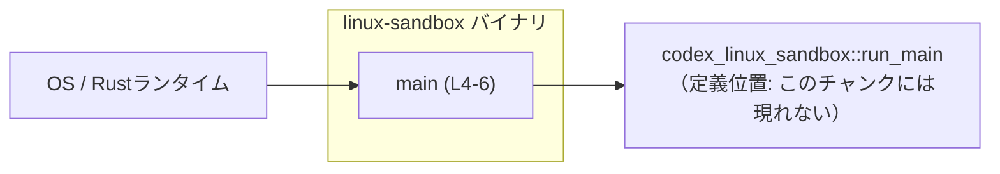
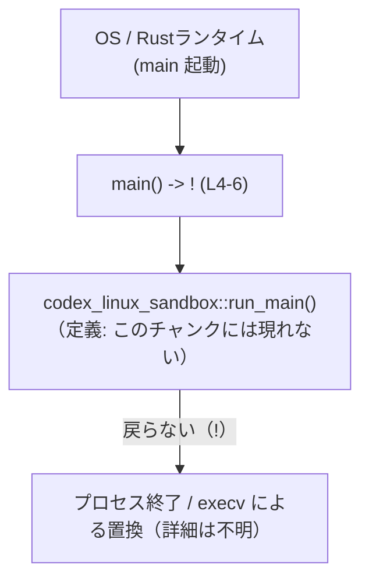
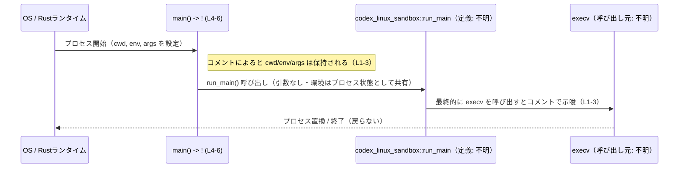

# linux-sandbox/src/main.rs コード解説

## 0. ざっくり一言

このファイルは、`linux-sandbox` バイナリクレートのエントリポイントとなる `main` 関数を定義し、実際の処理を `codex_linux_sandbox::run_main` に完全委譲する薄いラッパとして機能しています（`linux-sandbox/src/main.rs:L4-6`）。  
コメントから、カレントディレクトリ（cwd）、環境変数（env）、コマンドライン引数（args）が最終的な `execv` 呼び出しまで保持されることが示唆されています（`linux-sandbox/src/main.rs:L1-3`）。

---

## 1. このモジュールの役割

### 1.1 概要

- このモジュールは **バイナリ起動時のエントリポイント** を提供し、アプリケーションの本体ロジックをライブラリクレート `codex_linux_sandbox` に委譲するために存在しています（`linux-sandbox/src/main.rs:L4-6`）。
- コメントにより、プロセス起動時の **cwd/env/args を保持したまま最終的に `execv` が呼び出される** という契約が示されています（`linux-sandbox/src/main.rs:L1-3`）。

### 1.2 アーキテクチャ内での位置づけ

このファイルは OS から直接呼ばれる `main` を持ち、唯一の責務として `codex_linux_sandbox::run_main` を呼び出します。`run_main` の実装はこのチャンクには現れません。



- `main` は OS/Rust ランタイムから呼ばれる標準エントリポイントです。
- `run_main` は別クレート（`codex_linux_sandbox`）の関数であり、このファイルからのみ参照されます（`linux-sandbox/src/main.rs:L5`）。

### 1.3 設計上のポイント

- **薄いエントリポイント**  
  - `main` は 1 行で `codex_linux_sandbox::run_main()` を呼び出すのみであり（`linux-sandbox/src/main.rs:L4-5`）、アプリケーションロジックは完全にライブラリ側に集約されています。
- **決して戻らない `main`**  
  - `fn main() -> !` と宣言されており、「決して戻らない（never type `!`）」関数として定義されています（`linux-sandbox/src/main.rs:L4`）。  
    Rust の型システム上、ブロック末尾の式も `!` である必要があるため、このコードがコンパイルされている前提では `codex_linux_sandbox::run_main` も `!` を返すと考えられます（ただし、定義はこのチャンクには現れません）。
- **環境の保持に関する契約コメント**  
  - コメントで、cwd / env / args が最終的な `execv` に渡ること、およびそれらが正しいことを呼び出し側（= このバイナリを起動する側）が保証する必要があると明示されています（`linux-sandbox/src/main.rs:L1-3`）。
- **エラーと終了コードの委譲**  
  - `main` 側にはエラー処理や終了コード設定のロジックはなく、すべて `run_main` 側に委譲されていると解釈できます（`linux-sandbox/src/main.rs:L5`）。
- **並行性**  
  - このファイル内にはスレッド生成、非同期処理（`async`/`await`）、ロックなどの並行性に関するコードはありません。

---

## 2. 主要な機能一覧

このファイルが提供する機能は 1 つだけです。

- `main` 関数（エントリポイント）: OS/Rust ランタイムから呼び出され、`codex_linux_sandbox::run_main` を呼び出してプロセスを終了まで駆動する（`linux-sandbox/src/main.rs:L4-6`）。

---

## 3. 公開 API と詳細解説

### 3.1 型一覧（構造体・列挙体など）

このファイルには、構造体や列挙体などのユーザー向け型定義は存在しません。

| 名前 | 種別 | 役割 / 用途 | 定義位置 |
|------|------|-------------|----------|
| （該当なし） | — | — | — |

### 3.2 関数詳細

このファイルに定義されている関数は `main` のみです。

#### `main() -> !`

**概要**

- Rust バイナリのエントリポイントです（`linux-sandbox/src/main.rs:L4`）。
- 呼び出されると `codex_linux_sandbox::run_main()` を 1 回呼び出し、その結果としてプロセスは戻らない形で終了または置換されることが期待されています（`linux-sandbox/src/main.rs:L5`）。
- コメントによれば、プロセスの cwd / env / args は最終的な `execv` 呼び出しまで保持されます（`linux-sandbox/src/main.rs:L1-3`）。

**引数**

- 引数は取りません（Rust の `main` として標準的な形）。

**戻り値**

- 戻り値の型は `!`（never type）です（`linux-sandbox/src/main.rs:L4`）。
  - `!` は「決して正常には戻らない」関数を表し、典型的には以下のような挙動を意味します。
    - プロセスを `std::process::exit` や `execv` により終了または置換する。
    - 無限ループに入る。
  - このファイル内には上記処理は直接書かれておらず、`run_main` に委譲されています（`linux-sandbox/src/main.rs:L5`）。

**内部処理の流れ（アルゴリズム）**

この関数の処理は非常に単純です。

1. OS / ランタイムから `main()` が呼び出される（外部の Rust ランタイムの挙動であり、このチャンクには現れません）。
2. `codex_linux_sandbox::run_main()` を 1 回だけ呼び出す（`linux-sandbox/src/main.rs:L5`）。
3. `run_main` からは戻らないことが期待されるため、`main` も呼び出し元（OS）には戻りません（`linux-sandbox/src/main.rs:L4-5`）。

概念的なフローを図示します。



**Examples（使用例）**

`main` は OS によって呼び出されるため、通常ユーザーコードから直接呼ぶことはありません。  
ただし、「薄いエントリポイントとしてライブラリの `run_main` に処理を委譲する」というパターンを示す例として同型のコードを抜き出します。

```rust
// linux-sandbox/src/main.rs からの抜粋
// cwd, env, args が execv まで保持されることに注意する（L1-3）。
fn main() -> ! {                                         // プロセスのエントリポイント。決して戻らない型を返す（L4）
    codex_linux_sandbox::run_main()                      // 実際の処理はライブラリ側に委譲（L5）
}                                                        // 戻り値は never 型のため、ここに制御は戻らない想定（L6）
```

このコードは、他のバイナリプロジェクトでライブラリのエントリ関数に処理を委譲する際の参考になります。

**Errors / Panics**

- `main` 自体には `Result` などの戻り値型がなく、`panic!` も使用していません（`linux-sandbox/src/main.rs:L4-6`）。
- したがって、エラー処理方針や panic の有無は完全に `codex_linux_sandbox::run_main` の実装に依存します。
  - `run_main` が内部でエラーをログに記録したり、終了コードを設定したり、panic を発生させたりするかどうかは、このチャンクには現れないため不明です。

**Edge cases（エッジケース）**

`main` 自体のエッジケースはほとんどありませんが、コメントをもとに考えられる前提条件を列挙します。

- **cwd / env / args が「そのまま」届くケース**  
  - コメントによると、cwd・環境変数・コマンドライン引数が最終的な `execv` 呼び出しまで保持されると記述されています（`linux-sandbox/src/main.rs:L1-3`）。
  - このファイル内にはそれらを変更するコードは存在しません（`linux-sandbox/src/main.rs:L4-6`）。
- **異常な cwd / env / args**  
  - たとえば無効なパスを指す cwd、非常に大きな環境変数、想定外の引数形式などが渡された場合、`main` 側では何もチェックしていません。
  - それらの扱いがどうなるかは `run_main` および最終的な `execv` の振る舞いに依存し、このチャンクからは分かりません。
- **並行性**  
  - この関数内ではスレッド生成や非同期処理は一切行われていません（`linux-sandbox/src/main.rs:L4-6`）。  
    並行性に起因するエッジケースは、あるとすれば `run_main` の実装側に存在します（このチャンクには現れません）。

**使用上の注意点**

- **前提条件（コメントによる契約）**  
  - cwd / env / args が正しいことは「caller の責任」とコメントされています（`linux-sandbox/src/main.rs:L1-3`）。
    - ここでの「caller」とは、このバイナリを起動する側（上位プロセスやスクリプトなど）を指すと解釈できます。
    - このバイナリ自身（`main` 関数）は、これらの値を検証・補正しないことが示唆されています。
- **環境の変更を行わないこと**  
  - 現状の `main` は環境を一切変更せずに `run_main` を呼び出します（`linux-sandbox/src/main.rs:L4-6`）。
  - 将来 `main` に処理を追加する場合、cwd/env/args を意図せず変更してしまうと、コメントで表現されている契約を破る可能性があります。
- **エラー処理の追加位置**  
  - エラー処理・ログ出力・プロセス終了コードの制御は、原則として `run_main` 側にまとめる設計になっています。
  - `main` 側でそれらを扱うと、責務が分散し複雑化するため、既存の構造を維持するなら `main` は薄いまま保つ方針が読み取れます。

### 3.3 その他の関数

このファイルには補助関数やラッパー関数は存在しません。

| 関数名 | 役割（1 行） | 定義位置 |
|--------|--------------|----------|
| （該当なし） | — | — |

---

## 4. データフロー

このファイル内で明示されているデータはありませんが、コメントに基づき、プロセス起動から `execv` までの高レベルなデータフローを示します。  

> 注意: cwd/env/args や `execv` の扱いはコメントおよび一般的なプロセスモデルからの推測を含みます。`execv` の具体的な呼び出しはこのチャンクには現れません。



このシーケンス図が表すポイントは以下の通りです。

- `main` 自体は **明示的な引数や返り値の受け渡しを行わず**、プロセス全体の状態（cwd/env/args）を暗黙的に保持したまま `run_main` に制御を渡しています（`linux-sandbox/src/main.rs:L4-5`）。
- コメントは「cwd, env, command args が最終的な `execv` 呼び出しまで保持される」と述べており（`linux-sandbox/src/main.rs:L1-3`）、`run_main` はその前提のもとで `execv` を行う設計と解釈できます（ただし、`run_main` と `execv` の具体的な実装はこのチャンクには現れません）。

---

## 5. 使い方（How to Use）

### 5.1 基本的な使用方法

このファイルの `main` 関数は OS/Rust ランタイムから自動的に呼び出されるため、通常の Rust コードから直接利用することはありません。  
利用者の観点では、「ビルドされたバイナリを実行する」ことが唯一の使い方になります。

```text
cargo build               # ワークスペースや Cargo.toml の内容はこのチャンクには現れないため、実際のコマンドは不明
./linux-sandbox ...       # バイナリ名も Cargo.toml がないため不明。ここでは例示のみ。
```

- 実際のバイナリ名や `cargo build --bin NAME` の `NAME` は、`Cargo.toml` の `[[bin]]` セクションやパッケージ名に依存しますが、それらはこのチャンクには現れません。

### 5.2 よくある使用パターン

このファイル自体は `run_main` への委譲しか行わないため、「パターン」と呼べるものは単純です。

- **薄いエントリポイントとしての利用パターン**  
  ほかのプロジェクトで同様の構造を採用する場合の例です。

```rust
// 別プロジェクトでライブラリのエントリ関数に処理を委譲する例
fn main() -> ! {                                         // 戻り値を ! にすることで、ライブラリ側でプロセス終了まで担う設計
    my_crate::run_main()                                 // 実処理は my_crate の run_main に集約
}
```

このようにすることで、ビジネスロジックやエラーハンドリングをライブラリクレートに閉じ込め、`main` を極めて薄く保つ構造を再利用できます。

### 5.3 よくある間違い

このファイルのコメントと構造から想定される誤用例を示します。

```rust
// 誤りの例: cwd/env/args を意図せず変更してから run_main を呼び出す
fn main() -> ! {
    std::env::set_current_dir("/tmp").unwrap();          // カレントディレクトリを書き換えてしまう
    // ... 環境変数を書き換える処理 ...
    codex_linux_sandbox::run_main();                     // コメントで示された契約と異なる可能性
}

// 正しい例（現状の設計を維持する場合）: 環境を変更せずにそのまま委譲する
fn main() -> ! {
    codex_linux_sandbox::run_main();                     // cwd/env/args を保持したまま実行
}
```

- コメントでは cwd/env/args が `execv` まで保持されることに言及しているため（`linux-sandbox/src/main.rs:L1-3`）、環境を変えたい場合は、その契約を意図的に変更することになる点に注意が必要です。

### 5.4 使用上の注意点（まとめ）

- `main` は環境をいじらずに `run_main` に委譲する前提で書かれています（`linux-sandbox/src/main.rs:L4-5`）。
- cwd / env / args の整合性は「このバイナリを起動する側」の責任であり、`main` はそれを検証しません（`linux-sandbox/src/main.rs:L1-3`）。
- エラー処理、ログ出力、終了コード決定などは `run_main` に依存し、このファイルだけでは挙動は分かりません。
- このファイルには並行性に関する処理がなく、スレッド安全性・非同期 I/O などの懸念は `run_main` 側にのみ存在します。

---

## 6. 変更の仕方（How to Modify）

### 6.1 新しい機能を追加する場合

`main` に新しい機能を追加したい場合の基本的な考え方です。

1. **処理の追加場所**  
   - 追加するコードは `main` 関数内（`linux-sandbox/src/main.rs:L4-6`）に記述します。
   - 現状は 1 行のみの関数なので、前後に初期化処理やロギングを追加する形になります。

2. **環境に関する契約の確認**  
   - コメントにある「cwd/env/args を `execv` まで保持する」という契約（`linux-sandbox/src/main.rs:L1-3`）を維持するかどうかを明確にします。
   - 契約を維持する場合:
     - cwd を変更しない
     - 既存の環境変数を上書きしない
     - 引数リストを変更しない
   - 契約を変更する場合:
     - コメントも更新し、上位の利用者に新しい前提条件を明示する必要があります。

3. **`run_main` の責務との分離**  
   - ビジネスロジックやエラーハンドリングを `run_main` 側に保持したい場合、`main` では最小限の前処理（例: ログ設定）に留める方針にすると構造が明確になります。

### 6.2 既存の機能を変更する場合

`main` の挙動を変更する際に注意すべき点です。

- **影響範囲の確認**  
  - `main` はプロセス起動直後に呼ばれる最初の関数であり、変更はアプリケーション全体の起動挙動に影響します。
  - 特に cwd/env/args の扱いを変更すると、`run_main` やその先の `execv` 呼び出しの挙動に連鎖的な影響を与える可能性があります。
- **契約（前提条件）の維持**  
  - コメント（`linux-sandbox/src/main.rs:L1-3`）は外部に対する契約として機能していると解釈できます。
  - その契約を破る変更（たとえば cwd を変更する、環境変数をクリアするなど）を行う場合は、コメントや上位設計文書も併せて更新する必要があります。
- **エラーや終了コードの扱い**  
  - `main` が `!` を返す前提により、通常の `main() -> Result<(), E>` のようなパターンは取っていません（`linux-sandbox/src/main.rs:L4`）。
  - もしエラーを OS に終了コードとして伝えたい場合、`run_main` の実装を変更するのが自然です（このチャンクには現れません）。

---

## 7. 関連ファイル

このファイルと密接に関係するコンポーネントを一覧します。

| パス / クレート名 | 役割 / 関係 |
|-------------------|------------|
| `codex_linux_sandbox` クレート（具体的なパスはこのチャンクには現れない） | `codex_linux_sandbox::run_main` を提供し、`main` から唯一呼び出されるライブラリクレートです（`linux-sandbox/src/main.rs:L5`）。実際のサンドボックス処理、`execv` 呼び出し、エラーハンドリングなどはここに実装されていると考えられますが、詳細はこのチャンクからは分かりません。 |
| `Cargo.toml`（パッケージ/バイナリ定義ファイル） | `linux-sandbox/src/main.rs` をエントリポイントとするバイナリの名前や依存クレート（`codex_linux_sandbox` など）を定義しているはずですが、このチャンクには現れません。 |

---

### Bugs / Security の観点（このファイルに限定）

- **Bugs となりうる点**
  - このファイル単体ではロジックが極めて単純であり、典型的なバグ要素は見当たりません（`linux-sandbox/src/main.rs:L4-6`）。
  - ただし、コメントに対して実装が食い違う（`run_main` が `execv` を呼ばない・cwd/env/args を変更する）場合、設計上の不整合が生じる可能性がありますが、それは `run_main` 側の問題であり、このチャンクには現れません。

- **Security の観点**
  - `main` が環境を検証しない設計であるため、cwd/env/args に悪意のある値が設定されていた場合、それらがそのまま `run_main` および `execv` に渡る可能性があります（`linux-sandbox/src/main.rs:L1-3`）。
  - このファイルは検証を行わないことを前提としているため、入力検証やサニタイズの責任は **起動側**（caller）または `run_main` の実装にあります。

このように、`linux-sandbox/src/main.rs` は非常に小さいファイルですが、プロセス起動時の契約と責務分担（caller / main / run_main）を示す重要なエントリポイントとなっています。
