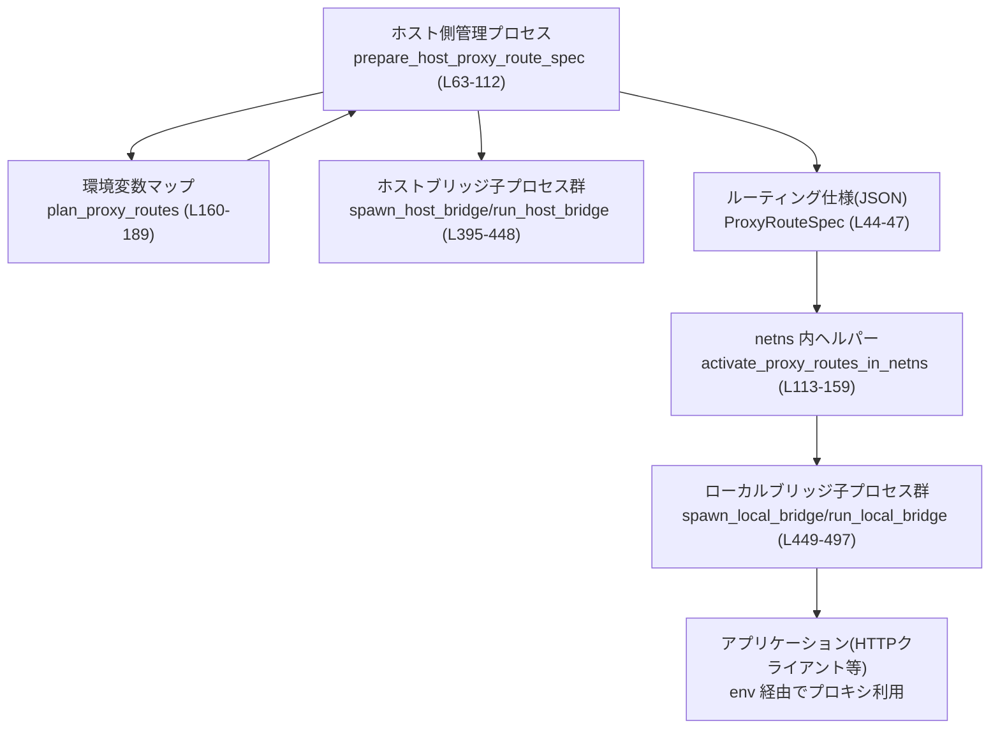

# linux-sandbox\src\proxy_routing.rs

## 0. ざっくり一言

このモジュールは、**ホスト側のプロキシ環境変数（HTTP_PROXY など）を、ネットワーク名前空間内のプロセスでも安全に利用できるようにルーティングする仕組み**を提供します（`proxy_routing.rs:L63-159`）。  
具体的には、ホスト側プロキシへの TCP 接続を **Unix ドメインソケット＋ローカルループバックポート**でブリッジする小さなプロセス群を自動的に起動・管理します。

---

## 1. このモジュールの役割

### 1.1 概要

- このモジュールは、**「ホストのプロキシ設定をそのままコンテナ／netns 内で使えない」**という問題を解決するために存在し、以下の機能を提供します。
  - ホスト環境変数から **ループバック（127.0.0.1 / localhost）プロキシ設定だけを抽出**し、ルーティング計画を立てる（`plan_proxy_routes`、`parse_loopback_proxy_endpoint`。`proxy_routing.rs:L160-189, L194-225`）。
  - ホスト側で、プロキシごとに **Unix ドメインソケット (UDS) ブリッジプロセス**を起動し、その情報を JSON でシリアライズして返す（`prepare_host_proxy_route_spec`。`proxy_routing.rs:L63-112`）。
  - netns 内で、上記 JSON を読み取り、**ローカルループバック (127.0.0.1:port) ～ UDS ～ ホストプロキシ**をつなぐローカルブリッジを起動し、プロキシ環境変数を書き換える（`activate_proxy_routes_in_netns`。`proxy_routing.rs:L113-159`）。

### 1.2 アーキテクチャ内での位置づけ

代表的なデータフロー（ホスト → netns）の構成を、主要コンポーネントだけ抜き出して示します。



- **ホスト側**: `prepare_host_proxy_route_spec` が環境変数を解析し（`plan_proxy_routes`）、ホストプロキシへの橋渡しを行う **host bridge プロセス**を起動します（`spawn_host_bridge`、`run_host_bridge`。`proxy_routing.rs:L395-448`）。
- **netns 側**: JSON 仕様を受け取った `activate_proxy_routes_in_netns` が **local bridge プロセス**を起動し（`spawn_local_bridge`、`run_local_bridge`。`proxy_routing.rs:L449-497`）、プロキシ環境変数を 127.0.0.1:ポート に書き換えます。

### 1.3 設計上のポイント

コードから読み取れる特徴を列挙します。

- **責務分割**
  - ルーティング仕様の生成（ホスト側）と、仕様の適用（netns 側）を別関数で明確に分離（`prepare_host_proxy_route_spec` vs `activate_proxy_routes_in_netns`。`proxy_routing.rs:L63-112, L113-159`）。
  - 環境変数パースと検証は `plan_proxy_routes`・`parse_loopback_proxy_endpoint` に切り出し（`proxy_routing.rs:L160-189, L194-225`）。
  - OS リソース管理（ディレクトリ作成・PID 判定・ioctl 等）は専用ヘルパー関数群に分離（例: `create_proxy_socket_dir`、`cleanup_stale_proxy_socket_dirs_in`、`ensure_loopback_interface_up`。`proxy_routing.rs:L263-285, L306-333, L515-575`）。

- **状態管理**
  - 公開される構造体は `ProxyRouteSpec` のみ（`pub(crate)`）。これは JSON でシリアライズされ、host/netns 間で受け渡される仕様オブジェクトです（`proxy_routing.rs:L44-47`）。
  - 子プロセスの PID や一時ディレクトリアイテムは、起動時にローカルなベクタ / マップで管理され、長期的な共有状態は持たない（`proxy_routing.rs:L79-95, L353-379`）。

- **エラーハンドリング方針**
  - 外部 API (`prepare_host_proxy_route_spec`, `activate_proxy_routes_in_netns`) は `io::Result` を返し、入力不備や環境不足は `InvalidInput` / `NotFound` として明示（`proxy_routing.rs:L63-74, L116-121, L139-149`）。
  - OS 呼び出しエラーは基本的に `last_os_error` を `io::Error` として透過（`proxy_routing.rs:L357-360, L516-519, L577-579`）。
  - 一部のクリーンアップ処理では、失敗を無視してベストエフォートで進める（`cleanup_stale_proxy_socket_dirs_in` 内の `let _ = ...` など。`proxy_routing.rs:L329`）。

- **並行性・プロセス**
  - **fork + pipe** による子プロセス起動と「準備完了通知」を行う（`spawn_host_bridge`, `spawn_local_bridge`, `create_ready_pipe`。`proxy_routing.rs:L395-425, L449-475, L598-605`）。
  - 各ブリッジプロセス内部では、接続ごとに新しいスレッドを `std::thread::spawn` で生成し、双方向コピーを行う（`run_host_bridge`, `run_local_bridge`, `proxy_bidirectional`。`proxy_routing.rs:L438-447, L485-495, L586-597`）。
  - `set_parent_death_signal` により、親が死んだ際に子プロセスも終了するよう `prctl(PR_SET_PDEATHSIG, SIGTERM)` を設定（`proxy_routing.rs:L576-585`）。

- **安全性（Rust / OS）**
  - 公開 API はすべて `unsafe` ではなく、モジュール内部で `libc` や `prctl` などの **FFI 呼び出しを `unsafe` ブロックに閉じ込めている**（`proxy_routing.rs:L345-347, L516-518, L577-580`）。
  - 環境変数の書き換え (`std::env::set_var`) は **`unsafe` ブロック内で実行**され、「このプロセスが単一スレッドである」という前提をコメントで明示している（`proxy_routing.rs:L151-155`）。

---

## 2. 主要な機能一覧

このモジュールが提供する主要機能をまとめます。

- **プロキシ環境変数の検出・パース**
  - `is_proxy_env_key` で対象となる環境変数キーか判定（`proxy_routing.rs:L190-193`）。
  - `plan_proxy_routes` で、ループバックアドレスを指す有効なプロキシだけを抽出（`proxy_routing.rs:L160-189`）。
  - `parse_loopback_proxy_endpoint` で、URL 文字列から `SocketAddr` を生成し、ループバックかどうかを検証（`proxy_routing.rs:L194-225`）。

- **ホスト側ルーティング仕様の生成**
  - `prepare_host_proxy_route_spec` が、プロキシ情報と UDS パスのマッピングを JSON 文字列として生成（`proxy_routing.rs:L63-112`）。
  - 必要に応じて古いソケットディレクトリをクリーンアップし、新しい一時ディレクトリを `0700` パーミッション付きで作成（`create_proxy_socket_dir`, `cleanup_stale_proxy_socket_dirs_in`。`proxy_routing.rs:L263-285, L306-333`）。
  - 各プロキシ endpoint ごとにホストブリッジプロセスを fork して起動（`spawn_host_bridge`, `run_host_bridge`。`proxy_routing.rs:L395-448`）。

- **netns 側ルーティング仕様の適用**
  - `activate_proxy_routes_in_netns` が JSON をデコードし、UDS ごとにローカルブリッジプロセスを起動（`spawn_local_bridge`, `run_local_bridge`。`proxy_routing.rs:L113-159, L449-497`）。
  - 元のプロキシ環境変数値を、ループバックポートを指す URL に書き換え（`rewrite_proxy_env_value`。`proxy_routing.rs:L236-262`）。

- **ブリッジ・双方向コピー**
  - `proxy_bidirectional` が、TCP <-> UnixStream の双方向コピーを 2 つのスレッドで行い、双方向のデータ転送を完了させる（`proxy_routing.rs:L586-597`）。

- **一時ディレクトリ管理・PID 生存確認**
  - `create_proxy_socket_dir`, `ensure_private_proxy_socket_parent_dir`, `cleanup_proxy_socket_dir` などで UDS を置くディレクトリを安全に作成・削除（`proxy_routing.rs:L263-305, L380-393`）。
  - `cleanup_stale_proxy_socket_dirs_in` と `is_pid_alive` 系で、既に死んだプロセスに紐づくディレクトリをクリーンアップ（`proxy_routing.rs:L306-333, L339-352`）。

---

## 3. 公開 API と詳細解説

### 3.1 型一覧（構造体）

| 名前 | 種別 | 役割 / 用途 | 定義箇所 |
|------|------|-------------|----------|
| `ProxyRouteSpec` | 構造体（`pub(crate)`） | ルーティング仕様全体。`Vec<ProxyRouteEntry>` のラッパーで、JSON でシリアライズされ host/netns 間で受け渡される。 | `proxy_routing.rs:L44-47` |
| `ProxyRouteEntry` | 構造体（内部） | 環境変数キー (`env_key`) と、そのキーに対応する UDS パス (`uds_path`) のペア。 | `proxy_routing.rs:L48-52` |
| `PlannedProxyRoute` | 構造体（内部） | `plan_proxy_routes` が生成する、中間的な計画エントリ。環境変数キーとホストプロキシの `SocketAddr`。 | `proxy_routing.rs:L53-57` |
| `ProxyRoutePlan` | 構造体（内部） | `routes: Vec<PlannedProxyRoute>` と、そもそもプロキシ設定が存在したかどうか (`has_proxy_config`) を保持。 | `proxy_routing.rs:L58-62` |

### 3.1.1 定数

| 名前 | 種別 | 役割 / 用途 | 定義箇所 |
|------|------|-------------|----------|
| `PROXY_ENV_KEYS` | `&[&str]` | 対象とするプロキシ環境変数名のホワイトリスト。大文字で保持され、キー判定時に大文字化して比較。 | `proxy_routing.rs:L25-40` |
| `PROXY_SOCKET_DIR_PREFIX` | `&str` | プロキシ用一時ディレクトリ名のプレフィックス (`codex-linux-sandbox-proxy-...`)。 | `proxy_routing.rs:L41` |
| `HOST_BRIDGE_READY` | `u8` | ホストブリッジ子プロセスが「準備完了」を親に通知する際に使うバイト値。 | `proxy_routing.rs:L42` |
| `LOOPBACK_INTERFACE_NAME` | `&[u8]` | ループバックインタフェース名 `"lo"` をバイト列で保持。`ioctl` 用の `ifreq` 構造体へコピーされる。 | `proxy_routing.rs:L43` |

---

### 3.2 関数詳細（主要 7 関数）

#### `prepare_host_proxy_route_spec() -> io::Result<String>`

**概要**

- ホストプロセス側で呼び出され、環境変数から有効なループバックプロキシ設定を抽出し、  
  それぞれに対応する UDS ブリッジを構成する JSON ルーティング仕様文字列を返します（`proxy_routing.rs:L63-112`）。

**引数**

なし（現在のプロセスの環境変数を `std::env::vars` で取得）。

**戻り値**

- `Ok(String)`  
  - `serde_json::to_string(&ProxyRouteSpec)` の結果で、各プロキシ環境変数キーと UDS パスの一覧が含まれます（`proxy_routing.rs:L111`）。
- `Err(io::Error)`  
  - プロキシ設定が存在しない／パース不能な場合（`InvalidInput`）、  
    またはディレクトリ作成・子プロセス起動など OS 操作の失敗時。

**内部処理の流れ**

1. 環境変数を `HashMap<String, String>` として収集し（`std::env::vars().collect()`。`proxy_routing.rs:L64`）、`plan_proxy_routes` でルーティング計画を作成（`proxy_routing.rs:L65`）。
2. 計画にルートが 1 つもない場合:
   - プロキシ設定はあったがパースできなかった場合と、そもそもプロキシ設定が無い場合を区別してエラーを返す（`proxy_routing.rs:L67-74`）。
3. UDS を置く親ディレクトリを決定し（`proxy_socket_parent_dir`）、古い死んだプロセス用ディレクトリをクリーンアップ（`cleanup_stale_proxy_socket_dirs_in`。`proxy_routing.rs:L76-78`）。
4. `create_proxy_socket_dir` で、`0700` パーミッションの一時ディレクトリを作成（`proxy_routing.rs:L79-80`）。
5. 計画された各 endpoint (`SocketAddr`) ごとに、重複を除いた UDS パスを割り当てて `socket_by_endpoint` に登録（`proxy_routing.rs:L81-89`）。
6. 各 endpoint / UDS パスについて `spawn_host_bridge` を呼び、ホストブリッジ子プロセスを起動。PID を `host_bridge_pids` に蓄積（`proxy_routing.rs:L91-94`）。
7. ブリッジプロセス群の終了を監視し、ディレクトリをクリーンアップするウォーカープロセスを起動（`spawn_proxy_socket_dir_cleanup_worker`。`proxy_routing.rs:L95`）。
8. 元の `ProxyRoutePlan` の順序に従って、`env_key` と対応する `uds_path` を `ProxyRouteEntry` として構築（`proxy_routing.rs:L97-109`）。
9. `ProxyRouteSpec { routes }` を JSON シリアライズして返す（`proxy_routing.rs:L111`）。

**Examples（使用例）**

ホスト側でルーティング仕様を生成し、netns 内ヘルパーに文字列で渡すイメージです。

```rust
use std::io;
use linux_sandbox::proxy_routing::prepare_host_proxy_route_spec;

fn main() -> io::Result<()> {
    // ホストの環境変数からプロキシルーティング仕様を生成
    let spec_json = prepare_host_proxy_route_spec()?; // 失敗時は io::Error

    // 例えば、この JSON をパイプや環境変数で netns 内ヘルパーに渡すなど
    // run_in_netns(spec_json); // 仮想例

    Ok(())
}
```

**Errors / Panics**

- `Err(io::ErrorKind::InvalidInput)`（`proxy_routing.rs:L67-74`）
  - 対象となるプロキシ環境変数が 1 つもない。
  - もしくは存在はするが、いずれもループバック endpoint としてパースできなかった。
- その他 OS 関連エラー（`proxy_routing.rs:L79-80, L91-95`）
  - 一時ディレクトリ作成 (`create_proxy_socket_dir`) が失敗。
  - `spawn_host_bridge` で `fork` 失敗や UDS bind 失敗。
  - `spawn_proxy_socket_dir_cleanup_worker` で `fork` 失敗。
- パニックを直接引き起こすコードは見当たりません（`unwrap` 等は使用されていません）。

**Edge cases（エッジケース）**

- すべての対象プロキシ環境変数が空文字または空白のみ → 無視され、`routes.is_empty()` になり `InvalidInput`（`proxy_routing.rs:L169-173`）。
- 対象プロキシ環境変数はあるが、ホストがループバックでない（例: `http://example.com:3128`）→ `parse_loopback_proxy_endpoint` が `None` を返し、結果的にルートは 0 件（`proxy_routing.rs:L175-177, L203-205`）。
- 一時ディレクトリ名が 128 回連続で既存・作成失敗した場合 → `AlreadyExists` エラーとして `Err`（`proxy_routing.rs:L266-285`）。

**使用上の注意点**

- 関数内部で `fork` や UDS 作成が行われ、子プロセスが常駐します。  
  呼び出し側は **ライフサイクル**（プロセス終了時に自動クリーンアップされる前提）を理解しておく必要があります。
- 返される JSON 文字列には **元のプロキシ URL は含まれず**、`env_key` と UDS パスのみが含まれます（テスト `proxy_route_spec_serialization_omits_proxy_urls` 参照。`proxy_routing.rs:L713-725`）。

---

#### `activate_proxy_routes_in_netns(serialized_spec: &str) -> io::Result<()>`

**概要**

- netns 内のヘルパープロセスで呼び出され、ホストから渡された JSON 仕様（`ProxyRouteSpec`）をもとに、
  各 UDS へのローカルブリッジを起動し、環境変数のプロキシ URL を 127.0.0.1:ポート に書き換えます（`proxy_routing.rs:L113-159`）。

**引数**

| 引数名 | 型 | 説明 |
|--------|----|------|
| `serialized_spec` | `&str` | `prepare_host_proxy_route_spec` が返した JSON 文字列。`ProxyRouteSpec` を表す。 |

**戻り値**

- `Ok(())`  
  - すべての UDS に対してローカルブリッジを起動し、対応する環境変数を書き換え終えた場合。
- `Err(io::Error)`  
  - JSON パース失敗、ルーティング仕様が空、ローカルブリッジ起動失敗、元の環境変数が存在しない、URL の書き換えに失敗した場合など。

**内部処理の流れ**

1. `serde_json::from_str` で `ProxyRouteSpec` にデシリアライズ（`proxy_routing.rs:L114`）。
2. ルートが空なら `InvalidInput` エラー（`proxy_routing.rs:L116-121`）。
3. `uds_path` ごとに、一度だけ `spawn_local_bridge` を呼んでローカルブリッジを起動し、割り当てられたローカルポート (`u16`) を記録（`proxy_routing.rs:L123-130`）。
4. 各 `ProxyRouteEntry` について:
   - UDS パスからローカルポートを取得（存在しない場合はエラー）。`proxy_routing.rs:L132-138`
   - 元の環境変数値を `std::env::var` で取得（存在しなければ `NotFound` エラー）。`proxy_routing.rs:L139-144`
   - `rewrite_proxy_env_value` で、同じスキーム／パスを保ちつつホスト部分を `127.0.0.1:local_port` に書き換え（`proxy_routing.rs:L145-150`）。
   - `unsafe { std::env::set_var(...) }` で環境変数を上書き（`proxy_routing.rs:L151-155`）。
5. すべて成功すれば `Ok(())` を返す（`proxy_routing.rs:L158`）。

**Examples（使用例）**

```rust
use std::io;
use linux_sandbox::proxy_routing::activate_proxy_routes_in_netns;

fn main() -> io::Result<()> {
    // ホスト側から受け取った JSON 仕様（例として標準入力から読む）
    let mut spec = String::new();
    std::io::stdin().read_line(&mut spec)?;

    // netns 内でローカルブリッジを起動し、HTTP_PROXY などを書き換える
    activate_proxy_routes_in_netns(spec.trim())?;

    // 以降、このプロセスからの HTTP クライアントは 127.0.0.1:ポート 経由でホストプロキシに到達する
    Ok(())
}
```

**Errors / Panics**

- JSON パース失敗 → `io::Error::other` 経由でラップ（`proxy_routing.rs:L114`）。
- `spec.routes.is_empty()` → `InvalidInput`（`proxy_routing.rs:L116-121`）。
- `spawn_local_bridge` 失敗 → そのまま `Err` を返す（`proxy_routing.rs:L123-130`）。
- 元の環境変数が存在しない → `NotFound`（`proxy_routing.rs:L139-144`）。
- `rewrite_proxy_env_value` が `None` → `InvalidInput`（`proxy_routing.rs:L145-150`）。

**Edge cases（エッジケース）**

- JSON 仕様には存在するが、実際の環境変数が消えている（途中で上書きされた等）→ `NotFound` エラー（`proxy_routing.rs:L139-144`）。
- `rewrite_proxy_env_value` がスキーム付き／無しなどのフォーマット差異を吸収できない場合 → `None` になり `InvalidInput`（`proxy_routing.rs:L145-150, L236-262`）。
- 同じ `uds_path` を複数の `env_key` が参照している場合 → ローカルブリッジは一つだけ起動され、ポートは共有される（`proxy_routing.rs:L123-130`）。

**使用上の注意点**

- 環境変数の書き換えを `unsafe` ブロックで行っており、「このヘルパープロセスがシングルスレッドである」ことを前提としています（コメント参照。`proxy_routing.rs:L151-153`）。  
  他のスレッドから同時に `std::env` 系 API を呼ぶと未定義動作になる可能性がある点に注意が必要です。
- この関数を呼んだ後に `fork` する場合、子プロセスはすでに書き換えられた環境変数を引き継ぎます。

---

#### `plan_proxy_routes(env: &HashMap<String, String>) -> ProxyRoutePlan`

**概要**

- 与えられた環境変数マップから、`PROXY_ENV_KEYS` に含まれるキーのみを対象に、  
  有効なループバックプロキシ endpoint を `ProxyRoutePlan` として抽出します（`proxy_routing.rs:L160-189`）。

**引数**

| 引数名 | 型 | 説明 |
|--------|----|------|
| `env` | `&HashMap<String, String>` | キー＝環境変数名、値＝その値。通常 `std::env::vars().collect()` で生成。 |

**戻り値**

- `ProxyRoutePlan`  
  - `routes`: 有効なループバック endpoint だけを含む `Vec<PlannedProxyRoute>`。
  - `has_proxy_config`: 対象キーに対して「非空の値」が 1 つでも見つかったかどうか。

**内部処理の流れ**

1. `routes` と `has_proxy_config` を初期化（`proxy_routing.rs:L161-162`）。
2. `env` の (key, value) を列挙し、`is_proxy_env_key` で対象キーかチェック（`proxy_routing.rs:L164-167, L190-193`）。
3. 値を `trim()` し、空ならスキップ。それ以外なら `has_proxy_config = true` にセット（`proxy_routing.rs:L169-173`）。
4. `parse_loopback_proxy_endpoint` で endpoint をパース。`None` なら無視（`proxy_routing.rs:L175-177`）。
5. 成功した場合は `PlannedProxyRoute { env_key: key.clone(), endpoint }` を `routes` に push（`proxy_routing.rs:L178-181`）。
6. 最後に `env_key` の辞書順でソートし（`proxy_routing.rs:L184`）、`ProxyRoutePlan { routes, has_proxy_config }` を返す（`proxy_routing.rs:L185-188`）。

**Examples（使用例）**

```rust
use std::collections::HashMap;
use std::net::SocketAddr;

fn example_plan() {
    let mut env = HashMap::new();
    env.insert("HTTP_PROXY".to_string(), "http://127.0.0.1:8080".to_string());
    env.insert("PATH".to_string(), "/usr/bin".to_string());

    let plan = plan_proxy_routes(&env);
    assert!(plan.has_proxy_config);
    assert_eq!(plan.routes.len(), 1);
    assert_eq!(plan.routes[0].env_key, "HTTP_PROXY");
    assert_eq!(
        plan.routes[0].endpoint,
        "127.0.0.1:8080".parse::<SocketAddr>().unwrap()
    );
}
```

**Edge cases**

- すべての対象キーが空文字・空白のみ → `has_proxy_config == true` だが `routes` は空。  
  これを受けて `prepare_host_proxy_route_spec` は `InvalidInput` を返します（`proxy_routing.rs:L67-74`）。
- ループバック以外のホスト名（`example.com` など）→ `parse_loopback_proxy_endpoint` が `None` を返し、`routes` に含まれません（`proxy_routing.rs:L175-177, L203-205`）。

---

#### `parse_loopback_proxy_endpoint(proxy_url: &str) -> Option<SocketAddr>`

**概要**

- プロキシ URL 文字列を解析し、それが localhost / 127.0.0.1 / ::1 を指している場合に限り、`SocketAddr` を返します（`proxy_routing.rs:L194-225`）。  
  スキームが省略されていても `http://` とみなします。

**引数**

| 引数名 | 型 | 説明 |
|--------|----|------|
| `proxy_url` | `&str` | 環境変数に設定されているプロキシ URL。例: `"http://127.0.0.1:3128"` や `"127.0.0.1:3128"`。 |

**戻り値**

- `Some(SocketAddr)`  
  - ホストがループバックであり、ポートが 0 でない場合。
- `None`  
  - URL パース失敗・ホストがループバックでない・ポートが最終的に 0 の場合。

**内部処理の流れ**

1. 文字列に `"://"` が含まれていなければ `"http://"` を付加（`proxy_routing.rs:L195-199`）。
2. `url::Url::parse` でパースし、ホスト文字列を取得（`proxy_routing.rs:L201-203`）。
3. `is_loopback_host` でホストが `localhost` / `127.0.0.1` / `::1` のいずれかか確認。違えば `None`（`proxy_routing.rs:L203-205, L226-228`）。
4. スキームを小文字化し、明示的なポートがあればそれを使い、なければ `default_proxy_port(scheme)` を使う（`proxy_routing.rs:L207-210, L229-235`）。
5. ポートが 0 なら `None`（`proxy_routing.rs:L211-213`）。
6. ホスト名が `"localhost"` の場合は `127.0.0.1` を、そうでなければ `IpAddr` としてパース（`proxy_routing.rs:L215-219`）。
7. `ip.is_loopback()` を確認し、ループバックなら `Some(SocketAddr::new(ip, port))`、そうでなければ `None`（`proxy_routing.rs:L220-223`）。

**Examples**

```rust
use std::net::SocketAddr;

let ep = parse_loopback_proxy_endpoint("http://127.0.0.1:43128");
assert_eq!(
    ep,
    Some("127.0.0.1:43128".parse::<SocketAddr>().unwrap())
);

let non_loopback = parse_loopback_proxy_endpoint("http://example.com:3128");
assert_eq!(non_loopback, None);
```

（テスト `parses_loopback_proxy_endpoint` と `ignores_non_loopback_proxy_endpoint` と一致。`proxy_routing.rs:L638-656`）

**Edge cases**

- `"127.0.0.1"` のようにポートが省略された場合 → スキームに応じて `default_proxy_port` が補われる（`proxy_routing.rs:L207-213, L229-235`）。
- スキームが `"socks5"` など → デフォルトポート 1080（`proxy_routing.rs:L229-233`）。
- IPv6 ループバック `"::1"` にも対応しています（`is_loopback_host`。`proxy_routing.rs:L226-228`）。

---

#### `spawn_host_bridge(endpoint: SocketAddr, uds_path: &Path) -> io::Result<libc::pid_t>`

**概要**

- 指定されたプロキシ endpoint（ホスト側 TCP アドレス）と UDS パスをブリッジする **ホストブリッジ子プロセス**を fork で起動し、  
  起動完了まで待ってから子プロセスの PID を返します（`proxy_routing.rs:L395-425`）。

**引数**

| 引数名 | 型 | 説明 |
|--------|----|------|
| `endpoint` | `SocketAddr` | 接続先のホストプロキシ TCP アドレス。`plan_proxy_routes` で得られた値が渡される。 |
| `uds_path` | `&Path` | netns 側から接続される UDS のパス。 |

**戻り値**

- `Ok(pid)`  
  - `run_host_bridge` を実行中の子プロセスの PID。
- `Err(io::Error)`  
  - `fork` 失敗、パイプ生成失敗、子プロセスの準備完了通知が期待どおりでない場合。

**内部処理の流れ**

1. `create_ready_pipe` で `O_CLOEXEC` なパイプ (read_fd, write_fd) を作成（`proxy_routing.rs:L395-397, L598-605`）。
2. `fork` し、エラーならパイプをクローズしてエラー返却（`proxy_routing.rs:L397-403`）。
3. 子プロセス側 (`pid == 0`):
   - 親側読み取り FD をクローズ（失敗時は即 `_exit(1)`）。`proxy_routing.rs:L405-407`
   - `run_host_bridge(endpoint, uds_path, write_fd)` を実行して結果をチェック。エラーなら `_exit(1)`、成功でも `_exit(0)`。`proxy_routing.rs:L409-413`
4. 親プロセス側:
   - 書き込み FD をクローズし（`proxy_routing.rs:L416`）、読み取り FD を `File::from_raw_fd` に包んで 1 バイト読み取り（`proxy_routing.rs:L417-419`）。
   - 読み取ったバイトが `HOST_BRIDGE_READY` でなければエラー（`proxy_routing.rs:L420-423`）。
   - 問題なければ `Ok(pid)` を返す（`proxy_routing.rs:L425`）。

**並行性／安全性の観点**

- `fork` 後の子プロセスは `run_host_bridge` 内で無限ループし、接続ごとに新スレッドを起動する（`proxy_routing.rs:L438-447`）。
- 親プロセスはパイプを通じて「準備完了」を同期しているため、UDS が bind される前に他の操作を進めることを防げます。

---

#### `run_host_bridge(endpoint: SocketAddr, uds_path: &Path, ready_fd: libc::c_int) -> io::Result<()>`

**概要**

- 子プロセス内で実行され、`uds_path` に UDS を bind して待ち受け、受信した接続ごとに `endpoint` への TCP 接続を張って双方向コピーを行います（`proxy_routing.rs:L427-448`）。

**内部処理の流れ（要点）**

1. `set_parent_death_signal()` で親死にシグナルを設定（`proxy_routing.rs:L428`）。
2. 既存の UDS ファイルがあれば削除し、`UnixListener::bind(uds_path)` で新たに bind（`proxy_routing.rs:L429-432`）。
3. `ready_fd` を `File::from_raw_fd` に包み、`HOST_BRIDGE_READY` バイトを書いて親に通知（`proxy_routing.rs:L434-436`）。
4. `loop` で `listener.accept()`。各接続に対して:
   - クロージャ内で `TcpStream::connect(endpoint)` を試み、成功なら `proxy_bidirectional(tcp_stream, unix_stream)` を呼ぶスレッドを `spawn`（`proxy_routing.rs:L438-446`）。

---

#### `spawn_local_bridge(uds_path: &Path) -> io::Result<u16>`

**概要**

- netns 側で呼び出され、`uds_path` にある UDS との間で TCP <-> UDS ブリッジを行う **ローカルブリッジ子プロセス**を起動し、  
  割り当てられたローカルループバックポート番号を返します（`proxy_routing.rs:L449-475`）。

**戻り値**

- `Ok(port)`  
  - 子プロセスの `run_local_bridge` が `bind_local_loopback_listener` により獲得したポート番号（BE バイト列でパイプを通じて送信）。`proxy_routing.rs:L471-474`
- `Err(io::Error)`  
  - `fork` 失敗、パイプ生成失敗、読み取り失敗など。

**内部処理の流れ**

1. `create_ready_pipe` → `fork`（`proxy_routing.rs:L450-452`）。
2. 子プロセス側で `run_local_bridge(uds_path, write_fd)` を実行（`proxy_routing.rs:L459-467`）。
3. 親プロセス側で `read_fd` から 2 バイト読み取り、BE として `u16` に変換して返却（`proxy_routing.rs:L470-474`）。

---

#### `run_local_bridge(uds_path: &Path, ready_fd: libc::c_int) -> io::Result<()>`

**概要**

- `bind_local_loopback_listener` で `127.0.0.1:0` に TCP リスナを確保し、  
  `uds_path` に存在する UDS との間で双方向コピーを行うローカルブリッジです（`proxy_routing.rs:L476-497`）。

**内部処理の流れ（要点）**

1. `set_parent_death_signal` を設定（`proxy_routing.rs:L477`）。
2. `bind_local_loopback_listener` で `TcpListener` を取得し、その `local_addr().port()` を取得（`proxy_routing.rs:L478-479, L498-513`）。
3. `ready_fd` にポート番号の BE バイト列を書き込み通知（`proxy_routing.rs:L481-483`）。
4. `loop` で `listener.accept()`。各接続に対して:
   - `UnixStream::connect(uds_path)` を試み、成功すれば `proxy_bidirectional(tcp_stream, unix_stream)` を実行するスレッドを `spawn`（`proxy_routing.rs:L485-495`）。

---

#### `proxy_bidirectional(mut tcp_stream: TcpStream, mut unix_stream: UnixStream) -> io::Result<()>`

**概要**

- TCP ストリームと Unix ドメインストリームの間で、**双方向のバイトコピー**を行います。  
  一方のコピーは別スレッドで、もう一方は呼び出しスレッドで実行されます（`proxy_routing.rs:L586-597`）。

**引数**

| 引数名 | 型 | 説明 |
|--------|----|------|
| `tcp_stream` | `TcpStream` | 片方の通信端点（ホストプロキシ行き or netns 内アプリ行き）。 |
| `unix_stream` | `UnixStream` | もう一方の通信端点（UDS 経由のブリッジ先）。 |

**戻り値**

- `Ok(())`  
  - 双方向コピーがエラーなく完了した場合。
- `Err(io::Error)`  
  - スレッドの join エラー、`std::io::copy` のエラーなど。

**内部処理の流れ**

1. `tcp_stream.try_clone()` と `unix_stream.try_clone()` で読み書き用のハンドルを複製（`proxy_routing.rs:L587-588`）。
2. 別スレッドを起動し、`tcp_reader` から `unix_writer` へ `std::io::copy`（`proxy_routing.rs:L589`）。
3. 呼び出しスレッドでは、`unix_stream` から `tcp_stream` へ `std::io::copy` を実行（`proxy_routing.rs:L590`）。
4. スレッドの `join()` 結果を確認し、パニックなら `io::Error::other("bridge thread panicked")` を返す（`proxy_routing.rs:L591-593`）。
5. 2 つの `copy` の `Result<u64>` をそれぞれ `?` で伝播し、両方成功したら `Ok(())`（`proxy_routing.rs:L594-596`）。

**並行性上の注意**

- 片方向のコピーに時間がかかっている間も、もう一方向は並行して進行します。
- スレッド数は接続ごとに 1 つ増えるため、大量の同時接続がある場合はスレッド数・メモリに注意が必要です。

---

### 3.3 その他の関数（インベントリー）

非テスト関数の一覧です。

| 関数名 | 役割（1 行） | 定義箇所 |
|--------|--------------|----------|
| `is_proxy_env_key` | キーを大文字化し、`PROXY_ENV_KEYS` に含まれるかどうかチェックする。 | `proxy_routing.rs:L190-193` |
| `is_loopback_host` | `"localhost"`, `"127.0.0.1"`, `"::1"` のいずれかか判定する。 | `proxy_routing.rs:L226-228` |
| `default_proxy_port` | スキームに応じたデフォルトポート（http=80, https=443, socks系=1080）を返す。 | `proxy_routing.rs:L229-235` |
| `rewrite_proxy_env_value` | URL のホストとポートだけを `127.0.0.1:local_port` に置き換え、スキーム有無・末尾スラッシュなどを元の形式に近づける。 | `proxy_routing.rs:L236-262` |
| `create_proxy_socket_dir` | プロキシ用一時ディレクトリを `0700` で作成し、一意な名前を選ぶ。 | `proxy_routing.rs:L263-285` |
| `proxy_socket_parent_dir` | `CODEX_HOME/tmp` か、失敗した場合は `std::env::temp_dir()` を親ディレクトリとして選ぶ。 | `proxy_routing.rs:L286-294` |
| `ensure_private_proxy_socket_parent_dir` | 指定パスのディレクトリを `0700` で作成し、パーミッションを強制。 | `proxy_routing.rs:L295-305` |
| `cleanup_stale_proxy_socket_dirs_in` | 指定ディレクトリ配下で `PROXY_SOCKET_DIR_PREFIX` に合致し、かつ PID が死んでいるディレクトリを削除。 | `proxy_routing.rs:L306-333` |
| `parse_proxy_socket_dir_owner_pid` | ディレクトリ名から所有者 PID を抽出し、0 以外なら `Some(pid)` を返す。 | `proxy_routing.rs:L334-337` |
| `is_pid_alive` | `u32` PID を `libc::pid_t` に変換し、`is_pid_alive_raw` に委譲。 | `proxy_routing.rs:L339-343` |
| `is_pid_alive_raw` | `kill(pid, 0)` の戻り値から PID の生死を判定。`ESRCH` 以外のエラーは「生きている」とみなす。 | `proxy_routing.rs:L345-352` |
| `spawn_proxy_socket_dir_cleanup_worker` | ホストブリッジ PIDs を監視し、全て死んだらソケットディレクトリを削除する監視子プロセスを起動。 | `proxy_routing.rs:L353-379` |
| `cleanup_proxy_socket_dir` | 指定ディレクトリを最大 20 回リトライしつつ `remove_dir_all` で削除。 | `proxy_routing.rs:L380-393` |
| `bind_local_loopback_listener` | `127.0.0.1:0` で TCP リスナを起動。`EADDRNOTAVAIL`/`ENETUNREACH` の場合はループバックインタフェースを up にして再試行。 | `proxy_routing.rs:L498-513` |
| `ensure_loopback_interface_up` | `ioctl(SIOCGIFFLAGS/SIOCSIFFLAGS/SIOCSIFADDR)` で `lo` インタフェースを UP & ループバックアドレスに設定。 | `proxy_routing.rs:L515-575` |
| `set_parent_death_signal` | `prctl(PR_SET_PDEATHSIG, SIGTERM)` を設定し、親 PID が 1 ならエラーにする。 | `proxy_routing.rs:L576-585` |
| `create_ready_pipe` | `libc::pipe2` で `O_CLOEXEC` 属性付きパイプを作成し、読み書き FD を返す。 | `proxy_routing.rs:L598-605` |
| `close_fd` | `libc::close` をラップし、負の戻り値なら `last_os_error` を返す。 | `proxy_routing.rs:L606-611` |

---

## 4. データフロー

ここでは、ホストの `HTTP_PROXY` が `http://127.0.0.1:3128` で設定されている場合に、  
netns 内アプリからホストプロキシに HTTP リクエストが届くまでの流れを示します。

### 4.1 高レベルフロー

1. **ホスト側**  
   `prepare_host_proxy_route_spec` が環境変数を解析し、ホストブリッジ子プロセス（UDS リスナ）を起動。  
   それぞれの UDS パスと `HTTP_PROXY` などのキー対応を JSON にまとめる（`proxy_routing.rs:L63-112`）。

2. **netns 側準備**  
   上記 JSON が netns 内に渡され、`activate_proxy_routes_in_netns` によって各 UDS へのローカルブリッジ子プロセスが起動。  
   `HTTP_PROXY` の値は `127.0.0.1:<local_port>` を指すように書き換えられる（`proxy_routing.rs:L113-159`）。

3. **アプリケーション利用時**  
   netns 内アプリが `HTTP_PROXY` を利用して外部 HTTP アクセスを行うと、  
   接続は `127.0.0.1:<local_port>` → ローカルブリッジ → UDS → ホストブリッジ → ホストプロキシ endpoint と流れる。

### 4.2 シーケンス図

```mermaid
sequenceDiagram
    participant HostMgr as ホスト管理プロセス<br/>prepare_host_proxy_route_spec (L63-112)
    participant HostBridge as ホストブリッジ子プロセス<br/>run_host_bridge (L427-448)
    participant NetnsHelper as netns 内ヘルパー<br/>activate_proxy_routes_in_netns (L113-159)
    participant LocalBridge as ローカルブリッジ子プロセス<br/>run_local_bridge (L476-497)
    participant App as アプリ(HTTPクライアント等)
    participant Proxy as ホストプロキシ(TCP endpoint)

    HostMgr->>HostMgr: plan_proxy_routes(env) (L160-189)
    HostMgr->>HostMgr: create_proxy_socket_dir() (L263-285)
    loop 各 endpoint
        HostMgr->>HostBridge: fork + run_host_bridge(endpoint, uds_path) (L395-448)
    end
    HostMgr->>NetnsHelper: ProxyRouteSpec(JSON) を受け渡し

    NetnsHelper->>NetnsHelper: deserialize ProxyRouteSpec (L113-115)
    loop 各 UDS
        NetnsHelper->>LocalBridge: fork + run_local_bridge(uds_path) (L449-497)
        LocalBridge-->>NetnsHelper: local_port をパイプで通知
    end
    NetnsHelper->>NetnsHelper: rewrite_proxy_env_value(..., local_port) (L236-262)

    App->>LocalBridge: TCP 接続 (127.0.0.1:local_port)
    LocalBridge->>HostBridge: UDS 接続 (uds_path)
    HostBridge->>Proxy: TCP 接続 (endpoint)
    App<->>Proxy: HTTP 通信（proxy_bidirectional 経由）(L586-597)
```

---

## 5. 使い方（How to Use）

### 5.1 基本的な使用方法

ホスト側と netns 側での典型的な連携例を示します（簡略化）。

```rust
use std::io;
use std::process::Command;
// 仮のモジュールパス。実際のクレート構成に合わせて修正が必要です。
use linux_sandbox::proxy_routing::{
    prepare_host_proxy_route_spec,
    activate_proxy_routes_in_netns,
};

fn main() -> io::Result<()> {
    // --- ホスト側: ルーティング仕様を生成 ---
    let spec_json = prepare_host_proxy_route_spec()?; // proxy_routing.rs:L63-112

    // 例: netns 内で実行されるヘルパーバイナリに JSON を環境変数で渡す
    let status = Command::new("netns-helper")
        .env("CODEX_PROXY_SPEC", &spec_json)
        // 実際には unshare/setns 等で netns に入る処理が別途必要
        .status()?;

    if !status.success() {
        eprintln!("netns-helper failed");
    }

    Ok(())
}

// netns-helper 内の main 処理のイメージ
fn netns_main() -> io::Result<()> {
    let spec = std::env::var("CODEX_PROXY_SPEC")
        .map_err(|_| io::Error::new(io::ErrorKind::NotFound, "CODEX_PROXY_SPEC not set"))?;
    activate_proxy_routes_in_netns(&spec)?; // proxy_routing.rs:L113-159

    // 以降でユーザコマンドを exec する
    // execve(...)

    Ok(())
}
```

### 5.2 よくある使用パターン

1. **単一プロキシ環境変数だけを利用する場合**

   - 例: `HTTP_PROXY` だけ設定されている。
   - `plan_proxy_routes` でルートは 1 件となり、ホストブリッジも 1 プロセスだけ起動します。

2. **複数のプロキシ環境変数が同一 endpoint を指す場合**

   - 例: `HTTP_PROXY` と `HTTPS_PROXY` が同じ `127.0.0.1:3128` を指す。
   - `prepare_host_proxy_route_spec` では endpoint 単位で UDS を割り当てるため、**1 つの UDS を複数の env_key が共有**します（`proxy_routing.rs:L81-89, L97-109`）。
   - netns 側では `spawn_local_bridge` も UDS ごとに 1 度だけ呼ばれ、ローカルポートも共有されます（`proxy_routing.rs:L123-130`）。

3. **`CODEX_HOME` を使った一時ディレクトリのカスタマイズ**

   - `CODEX_HOME/tmp` が書き込み可能ならそこに UDS 用ディレクトリを作成し、そうでなければ通常の temp ディレクトリを使います（`proxy_routing.rs:L286-294`）。

### 5.3 よくある間違い（想定されるもの）

```rust
// 間違い例: netns 側で JSON 仕様を与えずに activate_proxy_routes_in_netns を呼ぶ
let spec = "{}"; // routes フィールドがない/空
let result = activate_proxy_routes_in_netns(spec);
// => "proxy routing spec contained no routes" という InvalidInput エラー (L116-121)

// 正しい例: 必ず prepare_host_proxy_route_spec の出力をそのまま渡す
let spec = prepare_host_proxy_route_spec()?;
activate_proxy_routes_in_netns(&spec)?;
```

```rust
// 間違い例: 複数スレッドから同時に activate_proxy_routes_in_netns を呼ぶ
// （環境変数書き換えが unsafe 前提であるため）
use std::thread;

let spec = prepare_host_proxy_route_spec()?;
thread::scope(|s| {
    for _ in 0..4 {
        s.spawn(|| {
            // これは安全とは限らない（env 共有のため）
            let _ = activate_proxy_routes_in_netns(&spec);
        });
    }
});

// 正しい使い方の例: ヘルパープロセスがシングルスレッドのうちに一度だけ呼ぶ
let spec = prepare_host_proxy_route_spec()?;
activate_proxy_routes_in_netns(&spec)?;
// その後で exec してユーザのマルチスレッドアプリを起動
```

### 5.4 使用上の注意点（まとめ）

- **前提条件**
  - `prepare_host_proxy_route_spec` はホスト側ネットワークにアクセス可能なプロセスから呼ぶ必要があります。
  - `activate_proxy_routes_in_netns` を呼ぶプロセスは、**まだ他スレッドを生成していない段階**であることが期待されています（`proxy_routing.rs:L151-153`）。

- **禁止・非推奨パターン**
  - 既に多数のスレッドが存在するプロセスで `activate_proxy_routes_in_netns` を実行し、さらに並行して環境変数にアクセスすること。
  - 同一一時ディレクトリを異なるユーザで共有すること（一時ディレクトリは `0700` で作成されるため、他ユーザからはアクセスできません。`proxy_routing.rs:L270-272, L297-304`）。

- **エラー扱い**
  - プロキシ環境変数がひとつも設定されていない、またはループバックでない → managed proxy モードは使えず、`InvalidInput` が返る（エラーメッセージはコード中に明示。`proxy_routing.rs:L67-73`）。
  - UDS や TCP bind に失敗した場合、その原因（権限不足・アドレス未利用など）は `last_os_error` に記録されます。

---

## 6. 変更の仕方（How to Modify）

### 6.1 新しい機能を追加する場合

例: 「特定のドメインだけプロキシ経由にしたい」などのフィルタを入れたい場合。

1. **環境変数の解釈を拡張する**
   - `plan_proxy_routes`（`proxy_routing.rs:L160-189`）に新しいロジックを追加するのが自然です。
   - たとえば独自の `NO_PROXY` 相当環境変数を見て `PlannedProxyRoute` を増減するなど。

2. **ルーティング仕様の拡張**
   - 追加情報が JSON 仕様として必要な場合、`ProxyRouteSpec` / `ProxyRouteEntry` にフィールドを追加します（`proxy_routing.rs:L44-52`）。
   - その際は `prepare_host_proxy_route_spec` と `activate_proxy_routes_in_netns` の双方で読み書きを更新する必要があります（`proxy_routing.rs:L63-112, L113-159`）。

3. **ブリッジ処理の拡張**
   - 通信内容を書き換えるような機能を入れる場合は、`proxy_bidirectional` の前後で処理を挟むか、別のブリッジ関数を用意して `run_host_bridge` / `run_local_bridge` から呼び出すのが分かりやすいです（`proxy_routing.rs:L427-447, L476-497, L586-597`）。

### 6.2 既存の機能を変更する場合の注意点

- **影響範囲の把握**
  - 環境変数解析ロジック (`plan_proxy_routes`, `parse_loopback_proxy_endpoint`, `rewrite_proxy_env_value`) を変更すると、  
    テスト群（`tests` モジュール。`proxy_routing.rs:L613-762`）に反映が必要です。
  - UDS やディレクトリ処理 (`create_proxy_socket_dir`, `cleanup_stale_proxy_socket_dirs_in`) を変更する場合、  
    PID ベースのクリーンアップロジック全体との整合性を確認します（`proxy_routing.rs:L263-305, L306-333, L334-352, L353-379`）。

- **契約（Contract）**
  - `prepare_host_proxy_route_spec` は、「ルートが 0 件なら `InvalidInput` を返す」という契約に依存している可能性が高いです（呼び出し側が fallback を実装している場合）。  
    この挙動を変える場合は、呼び出し元コードも併せて見直す必要があります。
  - `activate_proxy_routes_in_netns` は、仕様に含まれる `env_key` が実際に環境変数に存在することを前提にしています（`NotFound` の扱いを変えるなら要検討。`proxy_routing.rs:L139-144`）。

- **テストの確認**
  - `tests` モジュールには、環境変数キー判定、URL パース、ルーティング計画、ポートデフォルト値、一時ディレクトリクリーンアップなどのテストがあります（`proxy_routing.rs:L613-762`）。  
    対応するテストを更新し、新しいケースを追加することで回帰を防げます。

---

## 7. 関連ファイル

このチャンクに他ファイルの参照やモジュールパスは明示的に現れません。そのため、直接の関連ファイルは **このチャンクからは分かりません**。

| パス | 役割 / 関係 |
|------|------------|
| （不明） | `prepare_host_proxy_route_spec` / `activate_proxy_routes_in_netns` を呼び出す上位モジュールは、このチャンクには現れません。 |

---

## 付録: テストと安全性・セキュリティ上の観点（要点）

### テストがカバーしているもの

- 環境変数キーの大文字小文字非依存判定（`recognizes_proxy_env_keys_case_insensitively`。`proxy_routing.rs:L631-636`）。
- ループバック endpoint のパースと、非ループバック URL の無視（`proxy_routing.rs:L638-656`）。
- `plan_proxy_routes` が有効なループバック endpoint のみを含むこと（`proxy_routing.rs:L659-682`）。
- `rewrite_proxy_env_value` がポートのみ書き換えること（`proxy_routing.rs:L684-690`）。
- デフォルトポートのスキームマッピング（`proxy_routing.rs:L692-697`）。
- 一時ディレクトリ／PID ベースクリーンアップの挙動（`proxy_routing.rs:L699-762`）。
- `ProxyRouteSpec` の JSON シリアライズに元のプロキシ URL が含まれないこと（`proxy_routing.rs:L713-725`）。

### 言語固有の安全性・並行性

- **FFI 呼び出し**  
  `libc::fork`, `libc::socket`, `libc::ioctl`, `libc::kill`, `libc::close`, `libc::pipe2`, `libc::prctl` など、多数の `unsafe` 呼び出しがありますが、  
  すべて関数内部に閉じ込められ、公開 API は safe です（`proxy_routing.rs:L345-347, L516-518, L577-580, L598-601` など）。
- **環境変数の書き換え**  
  Rust の標準ライブラリでは、環境変数の変更はグローバル状態の変更であり、スレッドセーフではありません。  
  そのため、`activate_proxy_routes_in_netns` では `unsafe` ブロック内で `set_var` を呼び、  
  コメントで「シングルスレッドであること」を前提条件として明示しています（`proxy_routing.rs:L151-155`）。
- **スレッド増加とリソース管理**
  - 各接続ごとに `std::thread::spawn` を行うため、大量の同時接続があるとスレッド数が増加します（`proxy_routing.rs:L438-447, L485-495, L589`）。
  - 子プロセスは `set_parent_death_signal` により、親プロセス終了時に SIGTERM を受けるため、ゾンビ化を防ぐ設計になっています（`proxy_routing.rs:L576-585`）。

### セキュリティ上の注意点（コードから読み取れる範囲）

- UDS を含む一時ディレクトリは `0700` で作成されるため、同一ユーザ以外からのアクセスは制限されます（`proxy_routing.rs:L270-272, L297-304`）。
- UDS ファイル自体のパーミッションは OS の umask に依存し、コード中で明示的な制御は行っていません（`UnixListener::bind` のデフォルト挙動に依存。`proxy_routing.rs:L432`）。
- プロキシ環境変数のキー名や値は信頼されたプロセス環境から取得する前提であり、追加のバリデーションはループバック判定と URL パースに限られます（`proxy_routing.rs:L160-189, L194-225`）。

以上が、このモジュールの構造・データフロー・安全性を理解するために必要な情報の整理です。
