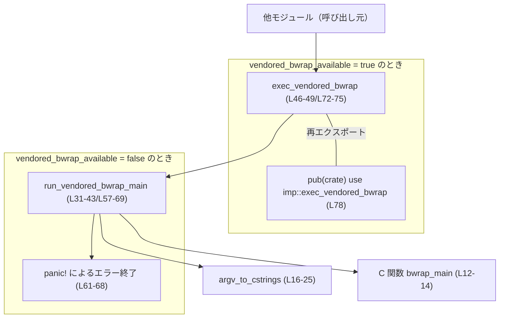
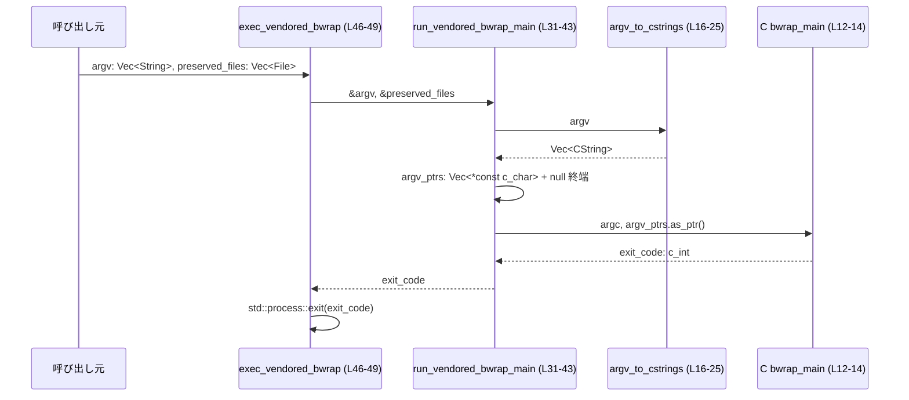

# linux-sandbox/src/vendored_bwrap.rs コード解説

## 0. ざっくり一言

- Linux 対象でビルド時にコンパイルした bubblewrap（C製）の `main` 相当（`bwrap_main`）を、Rust から FFI 経由で呼び出すための薄いラッパーモジュールです（`linux-sandbox/src/vendored_bwrap.rs:L1-4`）。
- vendored bubblewrap が利用できない構成では、同じインターフェースで即座に panic する実装に切り替わります（`linux-sandbox/src/vendored_bwrap.rs:L52-76`）。

---

## 1. このモジュールの役割

### 1.1 概要

- このモジュールは **ビルド時に vendored された bubblewrap バイナリを Rust プロセスから呼び出す問題** を解決するために存在し、**`exec_vendored_bwrap` というエントリポイントを crate 内部に提供**します（`linux-sandbox/src/vendored_bwrap.rs:L1-4,L46-49,L78`）。
- 実際のサンドボックス処理は C 側の `bwrap_main` に委譲され、Rust 側は `argv` の C 文字列変換およびプロセス終了（`std::process::exit`）のみを担当します（`linux-sandbox/src/vendored_bwrap.rs:L12-14,L16-25,L31-43,L46-49`）。
- vendored bubblewrap が利用不可の場合でも同じ関数が存在しますが、その実装は明示的なエラーメッセージで panic するフェイルファスト経路になります（`linux-sandbox/src/vendored_bwrap.rs:L56-69,L72-75`）。

### 1.2 アーキテクチャ内での位置づけ

- `#[cfg(vendored_bwrap_available)]` と `#[cfg(not(vendored_bwrap_available))]` で 2 つの `imp` モジュール実装が切り替わり、どちらも `exec_vendored_bwrap` を提供します（`linux-sandbox/src/vendored_bwrap.rs:L6-50,L52-76`）。
- ファイル末尾で `pub(crate) use imp::exec_vendored_bwrap;` しており、このファイルの外からは常に同じ関数名で呼び出せます（`linux-sandbox/src/vendored_bwrap.rs:L78`）。
- vendored 版では Rust から C 関数 `bwrap_main` を FFI で呼び出します（`linux-sandbox/src/vendored_bwrap.rs:L12-14`）。

主要コンポーネント間の関係を簡略図で示します。



※ ノード位置は概念レベルであり、cfg によってどちらか一方のサブグラフのみが有効になります。

### 1.3 設計上のポイント

- **cfg による二重実装**  
  - `#[cfg(vendored_bwrap_available)]` と `#[cfg(not(vendored_bwrap_available))]` で同名モジュール・同名関数を条件付きに定義し、ビルド構成に依存して実装を切り替えています（`linux-sandbox/src/vendored_bwrap.rs:L6-50,L52-76`）。
- **FFI 経由の C `main` 呼び出し**  
  - `unsafe extern "C" { fn bwrap_main(...) }` を宣言し、`run_vendored_bwrap_main` 内で unsafe ブロックから呼び出します（`linux-sandbox/src/vendored_bwrap.rs:L12-14,L40-42`）。
- **引数の C 文字列変換と null 終端**  
  - `argv_to_cstrings` で `Vec<String>` を `Vec<CString>` に変換し、さらに `*const c_char` の配列 + null 終端ポインタに組み立てています（`linux-sandbox/src/vendored_bwrap.rs:L16-25,L35-38`）。
- **エラー処理方針**  
  - 変換失敗（NUL バイトを含む文字列）では `panic!` を発生させます（`linux-sandbox/src/vendored_bwrap.rs:L19-22`）。
  - vendored bubblewrap が利用不能な構成では、`run_vendored_bwrap_main` および `exec_vendored_bwrap` が必ず panic する実装になっています（`linux-sandbox/src/vendored_bwrap.rs:L56-69,L72-75`）。
- **状態の保持**  
  - 明示的なグローバル状態は持たず、関数引数を通じてのみ情報を受け渡ししています。
  - `exec_vendored_bwrap` の `preserved_files: Vec<File>` は戻り型 `!` と `std::process::exit` により実質的にプロセス終了まで保持されます（`linux-sandbox/src/vendored_bwrap.rs:L46-49`）。

---

## 2. 主要な機能一覧とコンポーネントインベントリー

### 2.1 主要機能一覧

- `exec_vendored_bwrap`: 引数 `argv` をもとに build-time bubblewrap の `main` を実行し、その終了コードでプロセスを終了するエントリポイント（`linux-sandbox/src/vendored_bwrap.rs:L45-49,L72-75,L78`）。
- `run_vendored_bwrap_main`: bubblewrap の `bwrap_main` を直接呼び出し、その終了コードを返すラッパー（vendored 版） または panic によるエラー終了（非 vendored 版）（`linux-sandbox/src/vendored_bwrap.rs:L31-43,L57-69`）。
- `argv_to_cstrings`: Rust の `String` のスライスを C 文字列 (`CString`) のベクタに変換する内部ヘルパー（`linux-sandbox/src/vendored_bwrap.rs:L16-25`）。
- `bwrap_main`（extern C）: bubblewrap 側が提供する `main` 相当の C 関数。Rust 側から FFI で呼び出されます（`linux-sandbox/src/vendored_bwrap.rs:L12-14`）。

### 2.2 コンポーネント一覧（関数・モジュール）

| 名前 | 種別 | 公開範囲 | 役割 / 用途 | 定義位置 |
|------|------|----------|-------------|----------|
| `imp` | モジュール（vendored 版） | ファイル内 private | vendored bubblewrap 利用時の実装をまとめる | `linux-sandbox/src/vendored_bwrap.rs:L6-50` |
| `imp` | モジュール（非 vendored 版） | ファイル内 private | vendored bubblewrap 不可時の panic 実装をまとめる | `linux-sandbox/src/vendored_bwrap.rs:L52-76` |
| `bwrap_main` | `unsafe extern "C" fn` | `imp` 内 private | bubblewrap C 側のエントリポイントを表す FFI 関数 | `linux-sandbox/src/vendored_bwrap.rs:L12-14` |
| `argv_to_cstrings` | `fn` | `imp` 内 private | Rust の `argv` を C 互換の `CString` ベクタに変換 | `linux-sandbox/src/vendored_bwrap.rs:L16-25` |
| `run_vendored_bwrap_main`（vendored） | `pub(crate) fn` | `imp` 内（モジュール private のため実質このファイル内） | `argv` を変換して `bwrap_main` を呼び出し、終了コードを返す | `linux-sandbox/src/vendored_bwrap.rs:L31-43` |
| `exec_vendored_bwrap`（vendored） | `pub(crate) fn` | `imp` 内 | `run_vendored_bwrap_main` を呼び出し、その終了コードで `std::process::exit` する | `linux-sandbox/src/vendored_bwrap.rs:L45-49` |
| `run_vendored_bwrap_main`（非 vendored） | `pub(crate) fn` | `imp` 内 | vendored bubblewrap がない構成で即座に panic する | `linux-sandbox/src/vendored_bwrap.rs:L56-69` |
| `exec_vendored_bwrap`（非 vendored） | `pub(crate) fn` | `imp` 内 | 上記 panic 用関数を呼び出した後 `unreachable!` でマーク | `linux-sandbox/src/vendored_bwrap.rs:L72-75` |
| `exec_vendored_bwrap` | `pub(crate) use` による再エクスポート | crate 内から利用可能 | cfg に応じて `imp::exec_vendored_bwrap` を公開する唯一の API | `linux-sandbox/src/vendored_bwrap.rs:L78` |

---

## 3. 公開 API と詳細解説

### 3.1 型一覧（構造体・列挙体など）

- このファイルには新しい構造体・列挙体などの型定義は登場しません。
- 使用している主な既存型は以下です。
  - `std::ffi::CString`（C 互換の所有型文字列）（`linux-sandbox/src/vendored_bwrap.rs:L8,L16-25`）
  - `std::fs::File`（ファイル記述子の RAII ラッパー）（`linux-sandbox/src/vendored_bwrap.rs:L9,L33,L46,L54,L59,L72`）
  - `libc::c_int`（C の `int` 型に対応）（`linux-sandbox/src/vendored_bwrap.rs:L12-13,L31,L34,L57,L60`）

### 3.2 関数詳細

#### `exec_vendored_bwrap(argv: Vec<String>, preserved_files: Vec<File>) -> !`

（vendored 版実装。非 vendored 版も同じシグネチャで panic 実装になっています。）

**概要**

- build-time bubblewrap の `main` 相当を `argv` を通じて実行し、その終了コードを用いて現在の Rust プロセスを終了します（`linux-sandbox/src/vendored_bwrap.rs:L45-49`）。
- 戻り型が `!` であるため、この関数は呼び出し元に返ることはありません（`std::process::exit` を呼ぶため）。

**引数**

| 引数名 | 型 | 説明 |
|--------|----|------|
| `argv` | `Vec<String>` | bubblewrap に渡す引数のリスト。先頭要素として本来のプログラム名（`"bwrap"` など）を含めるかどうかは、このファイルからは不明です。 |
| `preserved_files` | `Vec<File>` | サンドボックス実行中も保持しておきたいファイルディスクリプタ群。vendored 版では引数名のみ使用され、値としては参照されません（`linux-sandbox/src/vendored_bwrap.rs:L46-47`）。 |

**戻り値**

- 戻り型は `!`（never 型）であり、関数は正常終了しません。
  - vendored 版では `run_vendored_bwrap_main` の結果を `std::process::exit` に渡し、プロセスを終了させます（`linux-sandbox/src/vendored_bwrap.rs:L46-49`）。
  - 非 vendored 版では `run_vendored_bwrap_main` が必ず panic し、`unreachable!` に到達しない前提です（`linux-sandbox/src/vendored_bwrap.rs:L72-75`）。

**内部処理の流れ（アルゴリズム）**

vendored 版（`#[cfg(vendored_bwrap_available)]`）の処理フロー:

1. 受け取った `argv` と `preserved_files` を引数として `run_vendored_bwrap_main(&argv, &preserved_files)` を呼び出し、終了コード `exit_code` を取得します（`linux-sandbox/src/vendored_bwrap.rs:L46-47`）。
2. `std::process::exit(exit_code)` を呼んで現在のプロセスを指定コードで終了します（`linux-sandbox/src/vendored_bwrap.rs:L48`）。

非 vendored 版（`#[cfg(not(vendored_bwrap_available))]`）の処理フロー:

1. `_argv`, `_preserved_files` を無視し、`run_vendored_bwrap_main(&[], &[])` を呼びます（`linux-sandbox/src/vendored_bwrap.rs:L72-73`）。
2. `run_vendored_bwrap_main` は必ず `panic!` するため、その後ろの `unreachable!` には到達しない前提です（`linux-sandbox/src/vendored_bwrap.rs:L74-75`）。

**Examples（使用例）**

※ 実際には vendored bubblewrap とビルドスクリプトが必要なため、ここでは擬似コード的な例になります。

```rust
use std::fs::File;
// モジュールパスは仮の例です（このチャンクからは正確なパスは分かりません）
use crate::linux_sandbox::vendored_bwrap::exec_vendored_bwrap;

fn launch_in_sandbox() {
    // bubblewrap に渡す引数を組み立てる（例として最低限の形）
    let argv = vec![
        "bwrap".to_string(),          // 通常はプログラム名
        "--ro-bind".to_string(),
        "/usr".to_string(),
        "/usr".to_string(),
        "--".to_string(),
        "/bin/echo".to_string(),
        "hello".to_string(),
    ];

    // サンドボックス内で保持したいファイル群（例として空ベクタ）
    let preserved_files: Vec<File> = Vec::new();

    // ここから先は戻ってこない
    exec_vendored_bwrap(argv, preserved_files);
}
```

この例では、プロセスは bubblewrap の終了コードで終了し、`launch_in_sandbox` の呼び出し元には戻りません。

**Errors / Panics**

- vendored 版:
  - `argv` に NUL バイト（`\0`）を含む要素があると、内部の `argv_to_cstrings` が `panic!` を起こします（`linux-sandbox/src/vendored_bwrap.rs:L19-22`）。
  - C 側の `bwrap_main` がどのようなエラーコードを返すかは、このファイルからは不明です。
- 非 vendored 版:
  - 常に `run_vendored_bwrap_main` 内部の `panic!` によりパニック終了します（`linux-sandbox/src/vendored_bwrap.rs:L61-68,L72-73`）。

**Edge cases（エッジケース）**

- `argv` が空ベクタのとき：
  - `argc` は 0 として `bwrap_main` に渡されます（`linux-sandbox/src/vendored_bwrap.rs:L35,L42`）。
  - bubblewrap 側での扱いはこのチャンクからは不明です。
- `argv` の各要素が長い文字列の場合：
  - Rust 側では特別な制限を設けておらず、そのまま `CString` に変換されます（`linux-sandbox/src/vendored_bwrap.rs:L16-25`）。
- `preserved_files` が空／非空であることによる違い：
  - Rust 側のロジックでは `preserved_files` 自体は参照されておらず、挙動の差はありません（`linux-sandbox/src/vendored_bwrap.rs:L31-43,L46-49`）。
  - ただし、その用途（ファイルディスクリプタを保持する意図など）はこのチャンクからは明示されていません。

**使用上の注意点**

- **戻らない関数であること**  
  呼び出し後に処理が続くことを前提にしない必要があります。`exec_vendored_bwrap` の後に記述したコードは実行されません（`linux-sandbox/src/vendored_bwrap.rs:L46-49`）。
- **NUL バイトを含む引数**  
  `argv` の各文字列に NUL バイトが含まれていると panic になります。外部入力から直接 `argv` を構築する場合は、NUL の混入を防ぐ前処理が必要になります（`linux-sandbox/src/vendored_bwrap.rs:L19-22`）。
- **ビルド構成依存の挙動**  
  `vendored_bwrap_available` が有効でない構成では、呼び出しは必ず panic になります（`linux-sandbox/src/vendored_bwrap.rs:L52-76`）。この構成で本関数に到達すること自体が想定外であることが panic メッセージから読み取れます（`linux-sandbox/src/vendored_bwrap.rs:L61-68`）。
- **並行性**  
  この関数はプロセス全体を終了させるため、並行スレッドや async タスクがあっても問答無用で終了します。Rust 側での並行制御は関与しません。

---

#### `run_vendored_bwrap_main(argv: &[String], _preserved_files: &[File]) -> libc::c_int`

（vendored 版実装。非 vendored 版は同シグネチャで常に panic します。）

**概要**

- bubblewrap の `bwrap_main` を呼び出し、その終了コード（`libc::c_int`）を返すヘルパー関数です（`linux-sandbox/src/vendored_bwrap.rs:L31-43`）。
- vendored 版では `argv` を C 互換形式に変換して FFI 呼び出しを行います。非 vendored 版では即座に panic します（`linux-sandbox/src/vendored_bwrap.rs:L56-69`）。

**引数**

| 引数名 | 型 | 説明 |
|--------|----|------|
| `argv` | `&[String]` | bubblewrap に渡す引数群。 |
| `_preserved_files` | `&[File]` | 参照として受け取りますが、vendored 版では変数名に `_` が付けられている通り未使用です（`linux-sandbox/src/vendored_bwrap.rs:L31-34`）。 |

**戻り値**

- bubblewrap の `bwrap_main` が返した終了コード（`libc::c_int`）をそのまま返します（`linux-sandbox/src/vendored_bwrap.rs:L42-43`）。
- コメントから、「正常動作時は `execve` により他プログラムに置き換わり、戻り値が返るのは失敗時のみ」という前提が示されています（`linux-sandbox/src/vendored_bwrap.rs:L27-30`）。  
  ただし、実際の数値の意味づけはこのチャンクからは不明です。

**内部処理の流れ（vendored 版）**

1. `argv_to_cstrings(argv)` を呼び、`Vec<CString>` を作成します（`linux-sandbox/src/vendored_bwrap.rs:L35`）。
2. 各 `CString` から `.as_ptr()` を呼び出して `*const c_char` のベクタ `argv_ptrs` を構築します（`linux-sandbox/src/vendored_bwrap.rs:L37`）。
3. `argv_ptrs` の末尾に `std::ptr::null()` を push し、C 側から見て null 終端された `argv` 配列になるようにします（`linux-sandbox/src/vendored_bwrap.rs:L38`）。
4. unsafe ブロック内で `bwrap_main(cstrings.len() as libc::c_int, argv_ptrs.as_ptr())` を呼び出し、その戻り値を返します（`linux-sandbox/src/vendored_bwrap.rs:L40-42`）。

**内部処理の流れ（非 vendored 版）**

1. 引数は未使用で、`panic!("build-time bubblewrap is not available ...")` を実行します（`linux-sandbox/src/vendored_bwrap.rs:L57-69`）。

**Examples（使用例）**

vendored 版を直接呼び出す例（テストや内部利用向けのイメージ）:

```rust
use std::fs::File;

// 実際には imp モジュールは private なので、テスト用モジュール内など限定された文脈を想定
fn call_bwrap_main_direct() -> libc::c_int {
    let argv = vec![
        "bwrap".to_string(),
        "--help".to_string(),
    ];
    let preserved: Vec<File> = Vec::new();

    // 仮に同一モジュール内から呼べるとすると…
    crate::linux_sandbox::vendored_bwrap::imp::run_vendored_bwrap_main(&argv, &preserved)
}
```

※ 実際に `imp` が外部から見えるかどうかは、モジュール階層次第でありこのチャンクからは不明です。上記はあくまで利用イメージです。

**Errors / Panics**

- `argv_to_cstrings` 内部での `CString::new` に失敗した場合（入力に NUL バイトが含まれる場合）、`panic!("failed to convert argv to CString: {err}")` でパニックになります（`linux-sandbox/src/vendored_bwrap.rs:L19-22`）。
- FFI 呼び出し `bwrap_main` 自体がどのようなエラー挙動を持つかは C 実装側に依存し、このチャンクからは不明です。
- 非 vendored 版では、関数を呼び出すと必ず panic になります（`linux-sandbox/src/vendored_bwrap.rs:L61-68`）。

**Edge cases（エッジケース）**

- `argv` が空スライス:
  - `cstrings.len()` は 0 となり、`argc` に 0 が渡されます（`linux-sandbox/src/vendored_bwrap.rs:L35,L42`）。
- 多数の引数:
  - すべて `CString` とポインタ配列にコピーされますが、Rust 側では特別な制限は設けられていません。
- `argv` の要素のうち一つでも NUL バイトを含む場合:
  - 即座に panic し、`bwrap_main` は呼ばれません（`linux-sandbox/src/vendored_bwrap.rs:L19-22`）。

**使用上の注意点**

- **FFI の安全性前提**  
  unsafe ブロックは、`argv_ptrs` 内のポインタが `bwrap_main` 実行中は有効であるという前提で書かれています（`linux-sandbox/src/vendored_bwrap.rs:L40-42`）。  
  実際には `cstrings` と `argv_ptrs` はローカル変数であり、関数のスコープから出る前に `bwrap_main` は終了するので、この前提は満たされています。
- **非 vendored 版の利用禁止**  
  `vendored_bwrap_available` が false の構成では、この関数を呼び出すこと自体が意図されていないことが panic メッセージから読み取れます（`linux-sandbox/src/vendored_bwrap.rs:L61-68`）。

---

#### `argv_to_cstrings(argv: &[String]) -> Vec<CString>`

**概要**

- Rust の `String` スライスを C 互換の `CString` ベクタに変換する内部ユーティリティです（`linux-sandbox/src/vendored_bwrap.rs:L16-25`）。

**引数**

| 引数名 | 型 | 説明 |
|--------|----|------|
| `argv` | `&[String]` | C 文字列に変換したい引数の配列。 |

**戻り値**

- `Vec<CString>`: 変換された C 互換文字列の集合です。各 `CString` は所有権を持ち、後続処理で `.as_ptr()` により `*const c_char` を取得できます（`linux-sandbox/src/vendored_bwrap.rs:L16-25`）。

**内部処理の流れ**

1. `argv.len()` と同じ容量を持つ `Vec<CString>` を `Vec::with_capacity(argv.len())` で作成します（`linux-sandbox/src/vendored_bwrap.rs:L17`）。
2. `for arg in argv` で各引数を走査し、`CString::new(arg.as_str())` を呼び出します（`linux-sandbox/src/vendored_bwrap.rs:L18-19`）。
3. `CString::new` が `Ok(value)` を返した場合、`cstrings.push(value)` でベクタに追加します（`linux-sandbox/src/vendored_bwrap.rs:L20`）。
4. `Err(err)` の場合は `panic!("failed to convert argv to CString: {err}")` で即座にパニックになります（`linux-sandbox/src/vendored_bwrap.rs:L21-22`）。
5. すべての要素を処理した後、`cstrings` を返します（`linux-sandbox/src/vendored_bwrap.rs:L24-25`）。

**Examples（使用例）**

```rust
use std::ffi::CString;

fn example_convert() {
    let args = vec!["bwrap".to_string(), "--help".to_string()];

    // 実際には imp モジュール内の関数ですが、ここでは利用イメージとして示します。
    let c_args: Vec<CString> = {
        // 同一モジュール内を仮定して直接呼び出す例
        // linux-sandbox/src/vendored_bwrap.rs の中であればこのように呼べます。
        super::imp::argv_to_cstrings(&args)
    };

    assert_eq!(c_args.len(), 2);
    // c_args[0].as_ptr() などを通じて C API に渡せる
}
```

**Errors / Panics**

- `CString::new` は、入力文字列に NUL バイトが含まれている場合にエラーを返します。  
  この関数ではそのエラーをハンドリングせずに `panic!` を発生させます（`linux-sandbox/src/vendored_bwrap.rs:L19-22`）。

**Edge cases（エッジケース）**

- `argv` が空スライス：
  - 容量 0 の `Vec<CString>` が返されます（`linux-sandbox/src/vendored_bwrap.rs:L17,L24-25`）。
- 非 ASCII 文字を含む引数：
  - `String` は UTF-8 文字列であり、そのまま `CString::new` に渡されます。UTF-8 であること自体は問題になりません（NUL バイトを含まない限り）。

**使用上の注意点**

- この関数は内部実装向けであり、エラー時に panic する挙動を前提としています。外部入力を安全に扱いたい場合は、別途 `CString::new` のエラーを呼び出し元で処理するラッパーが必要になる可能性があります。

---

#### `bwrap_main(argc: libc::c_int, argv: *const *const c_char) -> libc::c_int` （extern C）

**概要**

- bubblewrap のメイン関数を表す C 側のシンボルです。Rust 側では宣言のみ行い実装は提供していません（`linux-sandbox/src/vendored_bwrap.rs:L12-14`）。

**引数・戻り値**

- `argc`: 引数の個数（`argv` の要素数）。`cstrings.len()` を `libc::c_int` にキャストして渡しています（`linux-sandbox/src/vendored_bwrap.rs:L35,L42`）。
- `argv`: `*const *const c_char` で、C の `argv` に相当する null 終端配列です（`linux-sandbox/src/vendored_bwrap.rs:L37-38,L42`）。
- 戻り値: `libc::c_int` として終了コードを返します。

**使用上の注意点**

- この関数は unsafe FFI であり、Rust 側では以下の前提を満たすようにしています（`linux-sandbox/src/vendored_bwrap.rs:L40-42`）。
  - `argv` は null 終端されている。
  - `argv` 内のポインタは `bwrap_main` の呼び出し期間中は有効なまま。
- それ以上の安全性（例えば reentrancy やスレッド安全性）は C 実装に依存し、このチャンクからは不明です。

### 3.3 その他の関数

| 関数名 | 役割（1 行） | 定義位置 |
|--------|--------------|----------|
| `exec_vendored_bwrap`（非 vendored 版） | vendored bubblewrap がない構成で `run_vendored_bwrap_main` を呼び、`unreachable!` で到達不能を明示する | `linux-sandbox/src/vendored_bwrap.rs:L72-75` |

---

## 4. データフロー

代表的なシナリオとして、「vendored bubblewrap が利用可能な Linux ビルドで、`exec_vendored_bwrap` を呼び出してサンドボックス処理を開始する」場合のデータフローを示します。

1. 呼び出し元が Rust の `Vec<String>` で `argv`、`Vec<File>` で `preserved_files` を構築します。
2. `exec_vendored_bwrap(argv, preserved_files)` を呼ぶと、内部で `run_vendored_bwrap_main(&argv, &preserved_files)` が呼ばれます（`linux-sandbox/src/vendored_bwrap.rs:L46-47`）。
3. `run_vendored_bwrap_main` は `argv_to_cstrings(argv)` で `Vec<CString>` に変換し、さらに C ポインタ配列 + null 終端に組み立てます（`linux-sandbox/src/vendored_bwrap.rs:L35-38`）。
4. `bwrap_main(argc, argv_ptrs.as_ptr())` を unsafe で呼び出し、終了コードを得ます（`linux-sandbox/src/vendored_bwrap.rs:L40-42`）。
5. `exec_vendored_bwrap` はその終了コードで `std::process::exit` を呼んでプロセス終了します（`linux-sandbox/src/vendored_bwrap.rs:L48`）。



非 vendored 構成では `exec_vendored_bwrap` → `run_vendored_bwrap_main` の途中で即座に panic し、`bwrap_main` には到達しません（`linux-sandbox/src/vendored_bwrap.rs:L61-69,L72-73`）。

---

## 5. 使い方（How to Use）

### 5.1 基本的な使用方法

このモジュールの外から利用できる唯一の関数は `exec_vendored_bwrap` です（`linux-sandbox/src/vendored_bwrap.rs:L78`）。

```rust
use std::fs::File;
// 正確なモジュールパスは crate 構成によりますが、ここでは概念的な例とします。
use crate::linux_sandbox::vendored_bwrap::exec_vendored_bwrap;

fn main() {
    // bubblewrap に渡す argv を用意する
    let argv = vec![
        "bwrap".to_string(),
        "--dev-bind".to_string(),
        "/".to_string(),
        "/".to_string(),
        "--".to_string(),
        "/usr/bin/my_program".to_string(),
        "--flag".to_string(),
    ];

    // サンドボックス内でも保持しておきたいファイル
    let preserved_files: Vec<File> = Vec::new();

    // ここから先には戻らない
    exec_vendored_bwrap(argv, preserved_files);
}
```

- この呼び出しにより、vendored bubblewrap の `bwrap_main` が実行され、終了コードに応じてプロセスが終了します（`linux-sandbox/src/vendored_bwrap.rs:L31-43,L46-49`）。
- `exec_vendored_bwrap` の後に記述したコードは実行されません。

### 5.2 よくある使用パターン

- **ビルド時に固定されたサンドボックス設定で起動**  
  `argv` を固定のテンプレートとしてコード内に埋め込み、必要なパラメータのみ差し替える形が考えられます（このチャンクからは具体的な設定内容はわかりません）。
- **ファイルディスクリプタの保持**  
  `preserved_files` に特定の `File` を入れることで、それらが `exec_vendored_bwrap` 呼び出し後もドロップされないことが保証されます。`std::process::exit` によってプロセスが即終了するため、事実上プロセスライフタイム全体を通じて保持される形になります（`linux-sandbox/src/vendored_bwrap.rs:L46-49`）。

### 5.3 よくある間違い

```rust
use crate::linux_sandbox::vendored_bwrap::exec_vendored_bwrap;

fn wrong_usage() {
    let argv = vec!["bwrap".to_string(), "--help".to_string()];
    let preserved_files = Vec::new();

    exec_vendored_bwrap(argv, preserved_files);

    // 間違い例: ここに後続処理を書いても実行されない
    println!("この行は決して表示されません");
}
```

正しい認識:

```rust
fn correct_usage() {
    let argv = vec!["bwrap".to_string(), "--help".to_string()];
    let preserved_files = Vec::new();

    // exec_vendored_bwrap はプロセス終了の「最終処理」として呼び出す
    exec_vendored_bwrap(argv, preserved_files);

    // ここ以降のコードは書かない／実行されない前提で設計する
}
```

### 5.4 使用上の注意点（まとめ）

- **ビルド構成依存**  
  - `vendored_bwrap_available` が有効でない構成では `exec_vendored_bwrap` を呼ぶと panic します（`linux-sandbox/src/vendored_bwrap.rs:L52-76`）。Linux 以外のターゲットや、bubblewrap のビルドが失敗した構成では注意が必要です。
- **引数の内容**  
  - `argv` の各文字列に NUL バイトを含めると panic します（`linux-sandbox/src/vendored_bwrap.rs:L19-22`）。外部入力をそのまま渡す場合は sanitize が必要です。
- **並行性**  
  - この関数はプロセス全体を終了させるため、async ランタイムやスレッドプールと併用する場合も、他のタスク／スレッドはすべて終了します。
- **エラーハンドリング**  
  - bubblewrap による失敗理由は戻り値の整数コードとしてのみ得られます（`linux-sandbox/src/vendored_bwrap.rs:L31-43`）。このファイル内ではコード値を解釈していません。

---

## 6. 変更の仕方（How to Modify）

### 6.1 新しい機能を追加する場合

- **追加する場所**
  - build-time bubblewrap 呼び出しに関する新しいラッパー関数やオプションを追加する場合は、このファイルと同じモジュール（または同階層）に追加するのが自然です。
- **利用すべき既存関数**
  - C 呼び出し前後の処理を変えずにロジックを拡張したい場合は、`run_vendored_bwrap_main` の前後に処理を追加する形が考えられます（`linux-sandbox/src/vendored_bwrap.rs:L31-43`）。
  - `argv` の加工や検証を行う場合には、`argv_to_cstrings` を参考にしつつ、NUL バイト検出時に panic ではなく `Result` を返す別関数を追加するなどの選択肢があります（このファイルには Result 版は存在しません）。
- **呼び出し元への公開**
  - 新しいエントリポイントを crate 内から使えるようにするには、現状 `pub(crate) use imp::exec_vendored_bwrap;` と同様の再エクスポートを追加する必要があります（`linux-sandbox/src/vendored_bwrap.rs:L78`）。

### 6.2 既存の機能を変更する場合

- **影響範囲の確認**
  - `exec_vendored_bwrap` はこのファイル唯一の公開 API であり、この関数シグネチャや戻り型（`!`）を変えると、呼び出し元コードに広く影響します（`linux-sandbox/src/vendored_bwrap.rs:L45-49,L72-75,L78`）。
  - `run_vendored_bwrap_main` や `argv_to_cstrings` は `imp` モジュール内の private／モジュール内公開関数であり、影響はより局所的です。
- **前提条件の維持**
  - FFI 呼び出し部分では、`argv` の null 終端とポインタの有効期間という前提が重要です（`linux-sandbox/src/vendored_bwrap.rs:L37-42`）。この部分を変更する際は、`cstrings` のライフタイムが `bwrap_main` 呼び出し期間をカバーするように保つ必要があります。
- **panic メッセージ・エラー処理の変更**
  - 非 vendored 版の panic メッセージはビルド環境のトラブルシュートに利用されるため（`linux-sandbox/src/vendored_bwrap.rs:L61-68`）、内容を変更する場合はメッセージ利用箇所（ログ解析など）も含めて影響を確認する必要があります。
- **テストの確認**
  - このファイル内にテストコードは含まれていません。このファイルに対するテストが別ファイルに存在するかどうかはこのチャンクからは不明ですが、変更後には FFI 呼び出しまわりの挙動を検証するテストを追加・更新することが望ましいです（事実として「テストがない」だけがこのチャンクから読み取れます）。

---

## 7. 関連ファイル

このチャンクから直接参照できる関連要素は文字列やコメントに現れているもののみです。

| パス / 要素 | 役割 / 関係 |
|------------|------------|
| `codex-rs/vendor/bubblewrap` ディレクトリ | 非 vendored 版の panic メッセージ中で「bubblewrap sources expected at codex-rs/vendor/bubblewrap (default)」と記述されており、bubblewrap の C ソースが配置される想定のパスと読み取れます（`linux-sandbox/src/vendored_bwrap.rs:L61-67`）。 |
| ビルドスクリプト（ファイル名不明） | 「On Linux targets, the build script compiles bubblewrap's C sources and exposes a `bwrap_main` symbol」とのコメントから、何らかの build script が C ソースをコンパイルし FFI シンボル `bwrap_main` を提供していることがわかります（`linux-sandbox/src/vendored_bwrap.rs:L1-4`）。具体的なファイル名（`build.rs` など）はこのチャンクには現れません。 |
| `libcap` ヘッダ | panic メッセージの Notes に「libcap headers must be available via pkg-config」とあるため、bubblewrap のビルドに `libcap` のヘッダが必要であることが示されています（`linux-sandbox/src/vendored_bwrap.rs:L61-66`）。 |

---

### 安全性・バグ・セキュリティ観点の補足（このファイルから読み取れる範囲）

- **FFI 安全性**
  - Rust 側では `CString` と null 終端ポインタ配列を使うことで、`bwrap_main` に対して妥当な `argv` を渡すようにしています（`linux-sandbox/src/vendored_bwrap.rs:L16-25,L35-38,L40-42`）。
  - それでもなお、C 側の実装が不正なメモリアクセスをしないかどうかはこのチャンクからは判断できません。
- **panic による強制終了**
  - `argv` 内の NUL バイトや vendored bubblewrap 不在といった状況では `panic!` によってプロセスがクラッシュします（`linux-sandbox/src/vendored_bwrap.rs:L19-22,L61-69`）。これが DoS につながり得るかどうかは呼び出し元がどう `argv` を構築するかに依存します。
- **並行性**
  - グローバルなミュータブル状態は登場せず、このファイルだけを見る限りではスレッド安全性に関する特別な懸念は読み取れません。
  - ただし、`std::process::exit` によりプロセス全体が終了するため、その時点で他スレッドの実行もすべて停止します。
