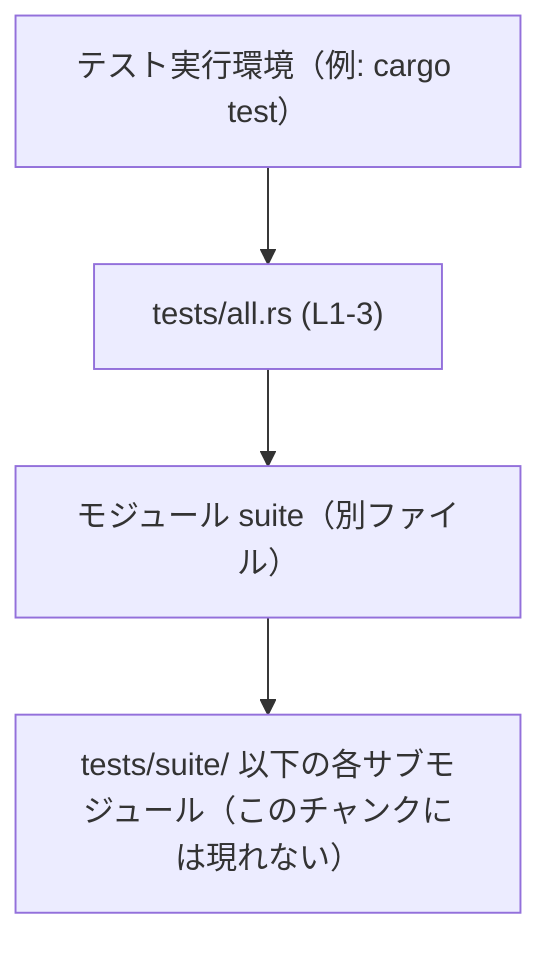

# linux-sandbox/tests/all.rs コード解説

## 0. ざっくり一言

`tests/all.rs` は、`suite` という 1 つのモジュールを読み込むだけの **統合テスト用バイナリのエントリファイル**です（`all.rs:L1-3`）。  
実際のテストロジックは、`tests/suite/` ディレクトリ以下のモジュール側に置かれる前提になっています（コメントより）。

---

## 1. このモジュールの役割

### 1.1 概要

- このファイルは、「単一の統合テストバイナリとして、すべてのテストモジュールを集約する」ために存在します（`all.rs:L1-2`）。
- 具体的には、`mod suite;` により `suite` モジュール（別ファイル）を読み込み、その中に定義されたテスト群を 1 つのテストバイナリとしてまとめる役割を持ちます（`all.rs:L3`）。

### 1.2 アーキテクチャ内での位置づけ

コメントとモジュール宣言から読み取れる範囲での関係を図にします。



- `tests/all.rs` 自身はテストコードを一切持たず、**テスト集合（suite）への入り口**として位置づけられています。
- `suite` モジュールの具体的な構造やテスト関数は、このチャンクには現れません。

### 1.3 設計上のポイント

コードとコメントから読み取れる特徴は次のとおりです。

- **単一エントリファイル方式**（`all.rs:L1`）
  - 「Single integration test binary」とコメントされており、統合テストを 1 バイナリにまとめる方針です。
- **テストロジックの分離**（`all.rs:L2-3`）
  - 実際のテスト実装は `tests/suite/` 以下に分離され、このファイルはそれを `mod suite;` で読み込むだけになっています。
- **状態・エラーハンドリング・並行性ロジックの非保持**
  - このファイル内には関数・構造体・スレッド生成・エラー処理などのロジックは一切ありません（`all.rs:L1-3`）。

### 1.4 コンポーネントインベントリー（このファイル内）

このチャンクに現れるコンポーネントを一覧にします。

#### モジュール

| 種別   | 名前   | 定義位置       | 説明 | 備考 |
|--------|--------|----------------|------|------|
| モジュール宣言 | `suite` | `all.rs:L3-3` | 統合テスト群をまとめるモジュールへの参照です。中身は別ファイルで定義されます。 | 実体（`tests/suite/` 以下）はこのチャンクには現れません。 |

#### 型（構造体・列挙体など）

このファイル内に型定義（構造体・列挙体・型エイリアスなど）は存在しません（`all.rs:L1-3`）。

| 名前 | 種別 | 定義位置 | 説明 |
|------|------|----------|------|
| なし | -    | -        | このチャンクには型定義が現れません。 |

#### 関数

このファイル内には関数・メソッド定義は存在しません（`all.rs:L1-3`）。

| 名前 | 定義位置 | 説明 |
|------|----------|------|
| なし | -        | 関数定義はこのチャンクには現れません。 |

---

## 2. 主要な機能一覧

このファイルが直接提供する機能は 1 つだけです。

- 統合テストモジュールの集約:
  - `mod suite;` により、`tests/suite/` 以下のテストモジュール群を 1 つのテストバイナリに集約する入口となります（`all.rs:L1-3`）。

実際のテストケースの実行・検証ロジックは、このチャンクには現れません（`suite` モジュール側）。

---

## 3. 公開 API と詳細解説

このファイルには公開関数や型は定義されていません。Rust のテストシステム上は、**ファイル全体がテスト用バイナリのルートモジュール**として扱われます。

### 3.1 型一覧（構造体・列挙体など）

上で述べた通り、このファイルには新たな型定義はありません。

| 名前 | 種別 | 役割 / 用途 | 根拠 |
|------|------|-------------|------|
| なし | -    | -           | ファイル内容がコメントとモジュール宣言のみであるため（`all.rs:L1-3`）。 |

### 3.1 補足: モジュール一覧

型の代わりに、このファイルで定義されるモジュールを整理します。

| 名前 | 種別 | 役割 / 用途 | 根拠 |
|------|------|-------------|------|
| `suite` | モジュール宣言 | 統合テスト群を含むモジュール。`tests/suite/` 以下に実体があるとコメントされています。 | `mod suite;`（`all.rs:L3-3`）、コメント（`all.rs:L2-2`） |

### 3.2 関数詳細

**本ファイルには関数定義が存在しないため、このセクションで詳細解説する対象はありません。**  
テスト関数などの実体は `suite` モジュール内にあると考えられますが、そのコードはこのチャンクには現れません。

### 3.3 その他の関数

同様に、このファイル内に補助関数やラッパー関数も存在しません。

| 関数名 | 役割（1 行） | 根拠 |
|--------|--------------|------|
| なし   | -            | `all.rs` にはコメントと `mod suite;` しかないため（`all.rs:L1-3`）。 |

---

## 4. データフロー

このファイル単体での処理フローは非常に単純で、**「テストバイナリが読み込まれたときに、`suite` モジュールがコンパイル時に結合される」**という関係のみが存在します。

### 4.1 概要

- Rust のモジュールシステムにより、`mod suite;` はコンパイル時に `suite` モジュールのソースファイルを読み込みます（`all.rs:L3`）。
- `suite` 側のテスト関数群は、Rust のテストランナーから呼び出されることが想定されますが、その具体的な呼び出し順やデータのやり取りはこのチャンクには現れません。

### 4.2 シーケンス図（高レベル）

このファイルのコード範囲（`L1-3`）に限定した抽象的なフローです。

```mermaid
sequenceDiagram
    participant Runner as テストランナー
    participant All as tests/all.rs (L1-3)
    participant Suite as モジュール suite（別ファイル）

    Runner->>All: テストバイナリをロード・実行
    Note over All: コンパイル時に<br/>mod suite; を通じて<br/>suite モジュールが結合
    All->>Suite: モジュール境界を通じてテストコードへ移譲（抽象）
    Suite-->>Runner: テスト結果を報告（このチャンクには実装なし）
```

- `Runner`（テストランナー）と `Suite`（実際のテストコード）の間の詳細なデータフローは、このファイルからは分かりません。

---

## 5. 使い方（How to Use）

このファイルは、利用者が直接呼び出す API ではなく、**テスト実行時に暗黙的に使われるエントリファイル**です。

### 5.1 基本的な使用方法

このファイルを前提としたテストコードの構成イメージです。`suite` モジュール側の実装例を、概念的に示します（`suite` の具体的な定義はこのチャンクにはないため、以下は Rust の一般的なモジュール構成の例です）。

```rust
// tests/all.rs（本ファイル、実コード）                    // 統合テストバイナリのエントリ
// Single integration test binary that aggregates all test modules.
// The submodules live in `tests/suite/`.
mod suite;                                                // suite モジュールを読み込む（all.rs:L3）

// tests/suite/mod.rs（例: このチャンクには現れない）       // suite モジュールの実体例
mod foo_tests;                                            // 個別テストモジュール
mod bar_tests;

// tests/suite/foo_tests.rs（例）                          // 実際のテスト
#[test]
fn foo_works() {
    // ... テストロジック ...
}
```

- 上記のように `tests/suite/` 以下にテストモジュールを配置する形が、コメント（`all.rs:L2`）と `mod suite;`（`all.rs:L3`）から想定されます。
- 実際の構成（ファイル名・モジュール構造）は、このチャンクには現れないため、ここでは一般的なパターンのみを示しています。

### 5.2 よくある使用パターン

このファイルに対して行われる典型的な操作は次のようなものです。

- **パターン1: 新しいテストモジュールの追加**
  - `tests/suite/` 以下に新しいファイル（例: `new_feature_tests.rs`）を作成し、`suite` の実体ファイル（例: `tests/suite/mod.rs`）から `mod new_feature_tests;` で読み込む。
  - `tests/all.rs` 側は変更せずに、テストを追加できます。
- **パターン2: テスト構成の大枠変更**
  - 統合テスト全体の構成を変えたい場合に、`mod suite;` で読み込むモジュール名を変更する可能性がありますが、そのような変更はこのチャンクからは読み取れません。

### 5.3 よくある間違い

Rust のモジュールシステムに起因する、起こりやすい誤りを示します。

```rust
// 間違い例: suite モジュールのファイルが存在しない
mod suite;                     // all.rs 側はこのまま（all.rs:L3）
// → tests/suite.rs あるいは tests/suite/mod.rs が存在しないとコンパイルエラー

// 正しい例: ファイル配置とモジュール宣言を揃える
mod suite;                     // all.rs 側（all.rs:L3）

// 例: tests/suite/mod.rs が存在し、その中でさらにサブモジュールを定義
// （このファイルはこのチャンクには現れません）
mod foo_tests;
mod bar_tests;
```

### 5.4 使用上の注意点（まとめ）

- **前提条件**
  - `mod suite;` に対応する `suite` モジュールの実体（`tests/suite.rs` または `tests/suite/mod.rs` など）が存在している必要があります（`all.rs:L3`）。
- **禁止事項 / 注意点**
  - `suite` のファイル名やディレクトリ構造を変える場合、Rust のモジュール探索ルールに従って整合性を保たないとコンパイルエラーになります。
- **安全性・エラー・並行性**
  - 本ファイルには実行時ロジックが無く、所有権・エラー処理・スレッド生成などのコードは存在しません。そのため、ランタイムの安全性や並行性に関する挙動は、このチャンクからは評価できません。

---

## 6. 変更の仕方（How to Modify）

### 6.1 新しい機能（テスト）を追加する場合

新しいテストケースやテストモジュールを追加したい場合、**通常は `tests/all.rs` ではなく `suite` 側を編集する**形になります。

1. `tests/suite/` ディレクトリ以下に、新しいテストファイルを作成する。
2. `suite` モジュールの実体ファイル（例: `tests/suite/mod.rs`）で、新しいテストファイルを `mod` 宣言で読み込む。
3. 必要な `#[test]` 関数や補助関数を、その新しいファイル内に実装する。

この流れは、コメントの「The submodules live in `tests/suite/`.」（`all.rs:L2`）から読み取れる設計方針に沿うものです。

### 6.2 既存の機能を変更する場合

`tests/all.rs` 自体を変更するケースは限定的です。

- **`suite` モジュール名を変える場合**
  - `mod suite;` の名前を変更すると、対応するファイル・ディレクトリ構成も変更する必要があります。
  - 影響範囲としては、`suite` モジュール実体と、その中で参照しているサブモジュール群が考えられますが、具体的な構造はこのチャンクには現れません。
- **テスト構造のトップレベル再編**
  - 統合テストを複数バイナリに分割する・別名のルートモジュールに切り替えるといった変更は、このファイルと `tests/` ディレクトリ内の他ファイルとの関係を見直す必要があります。
  - ただし、そのような再編方針や既存構成の詳細は、このチャンクからは分かりません。

---

## 7. 関連ファイル

コメントとモジュール宣言から推測される、密接に関連するパスを挙げます。  
※ 実在するかどうか・中身の詳細は、このチャンクには現れません。

| パス（想定）              | 役割 / 関係 | 根拠 |
|---------------------------|------------|------|
| `tests/suite.rs` または `tests/suite/mod.rs` | `mod suite;` の実体となるモジュールファイル。統合テストの本体が置かれていると考えられます。 | コメント「The submodules live in `tests/suite/`.」（`all.rs:L2`）と `mod suite;`（`all.rs:L3`） |
| `tests/suite/*.rs`        | 個々のテストモジュール。`suite` モジュールのサブモジュールとして読み込まれる想定です。 | 同上。具体的なファイル名はこのチャンクには現れません。 |

---

### Bugs / Security / Contracts / Edge Cases に関する補足

- **Bugs**
  - このファイルの唯一の動作要素は `mod suite;` であり、バグになり得るのは「対応するファイルが存在しない・名前が一致しない」などコンパイル時エラーに直結するケースです。
  - 実行時バグの可能性は、このファイルだけからは見当たりません（ロジックが無いため）。
- **Security**
  - テスト専用ファイルであり、また実行ロジックを持たないため、セキュリティ上の懸念点はこのチャンクからは読み取れません。
- **Contracts（契約）**
  - 「`suite` モジュールが存在すること」「`tests/suite/` 以下にサブモジュールがあること」が暗黙の前提条件（契約）になっています（`all.rs:L2-3`）。
- **Edge Cases**
  - `suite` モジュールが空であってもコンパイル自体は可能ですが、そのようなケースの取り扱いや意図は、このチャンクからは分かりません。
  - `suite` モジュールファイルが欠如している場合はコンパイルエラーとなるため、テスト実行前に検知されます。
