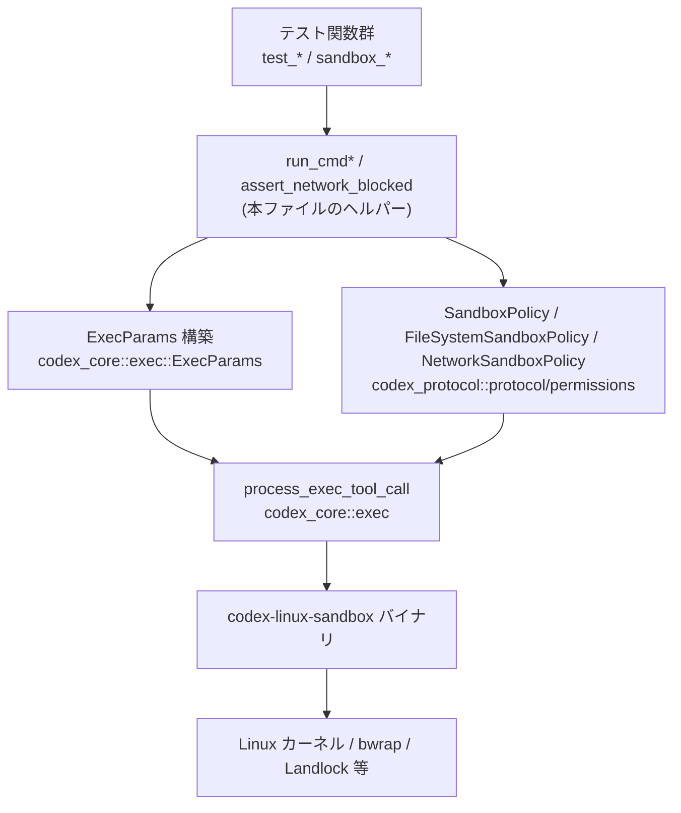
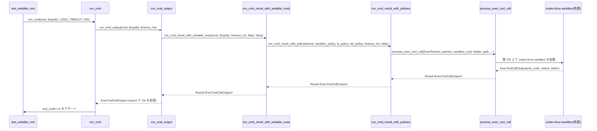

# linux-sandbox/tests/suite/landlock.rs

## 0. ざっくり一言

Linux 向けサンドボックス実装（`codex-linux-sandbox` + bubblewrap 等）を、実際にコマンドを実行しながら検証する非同期テスト群です。  
ファイルシステムの書き込み制御・ネットワーク遮断・特定ディレクトリの carve‑out など、ポリシー周りの挙動を end‑to‑end で確認します。

---

## 1. このモジュールの役割

### 1.1 概要

- このモジュールは **Linux サンドボックスのポリシー実装が、期待どおりにプロセスを制限できているか** を検証するために存在し、次の機能を提供します。
  - `codex-linux-sandbox` バイナリを使ってコマンドを実行するヘルパー関数群（`run_cmd*`, `assert_network_blocked` など）による共通ラッパー。（根拠: `run_cmd*`, `assert_network_blocked` 定義 `landlock.rs:L52-149`, `L377-433`）
  - ファイルシステム書き込みパス、`.git` / `.codex` ディレクトリ、シンボリックリンク、`/dev` ノードなどを対象にした挙動テスト。（根拠: 各テスト `L197-345`, `L457-747`）
  - ネットワーク関連のシステムコール・外部コマンド（curl, wget, ping, ssh 等）がサンドボックス下で遮断されることの検証。（根拠: `sandbox_blocks_*` 系テスト `L435-455`, `L749-767`, `L769-774`）
  - タイムアウト・NoNewPrivs フラグなどのセキュリティ関連プロセス属性の検証。（根拠: `test_no_new_privs_is_enabled` `L347-364`, `test_timeout` `L366-370`）

### 1.2 アーキテクチャ内での位置づけ

このファイルはテストコードであり、主に次のコンポーネントに依存します。

- `codex_core::exec::process_exec_tool_call`: サンドボックス付きで外部コマンドを実行するコア API。（根拠: `landlock.rs:L6`, `L138-148`, `L399-408`）
- `codex_protocol::protocol::SandboxPolicy` と関連ポリシー型: ファイルシステム・ネットワークのポリシー定義。（根拠: `L20`, `L78-99`, `L562-605`, `L635-687`, `L711-738`）
- `codex-linux-sandbox` バイナリ: 実際にサンドボックス環境を構成するヘルパーバイナリ。（根拠: `env!("CARGO_BIN_EXE_codex-linux-sandbox")` `L135`, `L397`, `L557-560`, `L630-633`）

これらの関係を簡略化した依存関係図です。



### 1.3 設計上のポイント

- **責務分割**
  - サンドボックス付きでコマンドを実行する処理は `run_cmd_result_with_policies` に集約し、テストはこのヘルパーを通してポリシーや引数だけを指定します。（根拠: `landlock.rs:L78-109`, `L112-149`）
  - ネットワーク遮断の検証は `assert_network_blocked` に集約し、さまざまなネットワークコマンドに対して同じ判定ロジックを共有しています。（根拠: `L372-433`, `L435-455`, `L749-767`, `L769-774`）
- **状態管理**
  - このファイル内で持つ状態は定数（タイムアウト値・エラーメッセージ）とローカル変数のみで、長寿命の共有状態はありません。テストは主に一時ディレクトリ・一時ファイルを使って隔離されています。（根拠: `L29-44`, `L305-314`, `L551-555` 等）
- **エラーハンドリング**
  - コマンド実行結果は `Result<ExecToolCallOutput, CodexErr>` として返され、`expect_denied` や `assert_network_blocked` で `SandboxErr::Denied` / `SandboxErr::Timeout` を明示的に扱います。（根拠: `L78-84`, `L112-119`, `L162-180`, `L183-195`, `L411-417`）
  - テスト失敗は `assert_eq!` や `panic!` によって表現されます。`unwrap` / `expect` もテスト内で許容されています。（根拠: `L2`, `L61`, `L111`, `L376`）
- **並行性**
  - すべてのテストは `#[tokio::test]` の非同期テストで、内部で `async` 関数を `await` します。（根拠: `L197`, `L202`, 以降の各テスト定義）
  - テスト間で共有される mutable 状態が無く、各テストは独立した一時ディレクトリやプロセスを使うため、Rust のテストハーネスが並列実行してもデータレースは発生しない構造になっています。（根拠: `tempfile::tempdir` / `NamedTempFile` 利用箇所 `L205`, `L305`, `L328`, `L464`, `L517`, `L551`, `L623`, `L705`）

---

## 2. 主要な機能一覧（コンポーネントインベントリー付き）

### 2.1 関数・定数インベントリー

| 名称 | 種別 | 役割 / 振る舞い | 定義位置 |
|------|------|-----------------|----------|
| `SHORT_TIMEOUT_MS` | 定数 `u64` | 短いコマンド用タイムアウト（非 aarch64: 200ms / aarch64: 5000ms）。 | `linux-sandbox/tests/suite/landlock.rs:L29-32` |
| `LONG_TIMEOUT_MS` | 定数 `u64` | 長めのコマンド用タイムアウト（非 aarch64: 1000ms / aarch64: 5000ms）。 | `L34-37` |
| `NETWORK_TIMEOUT_MS` | 定数 `u64` | ネットワーク関連テスト用タイムアウト（非 aarch64: 2000ms / aarch64: 10000ms）。 | `L39-42` |
| `BWRAP_UNAVAILABLE_ERR` | 定数 `&'static str` | bubblewrap がビルドに含まれていない場合のエラーメッセージ断片。 | `L44` |
| `create_env_from_core_vars` | 関数 | `ShellEnvironmentPolicy::default()` に基づいてサンドボックス用環境変数を構築。 | `L46-49` |
| `run_cmd` | 非公開 async 関数 | サンドボックス下でコマンドを実行し、**成功(exit code=0)** を前提にし、失敗時には標準出力・標準エラーを表示して panic する簡易ヘルパー。 | `L51-59` |
| `run_cmd_output` | 非公開 async 関数 | writable roots とタイムアウトを指定してコマンドを実行し、`ExecToolCallOutput` を返す。失敗 (`Result::Err`) の場合は panic。 | `L61-76` |
| `run_cmd_result_with_writable_roots` | 非公開 async 関数 | `SandboxPolicy::WorkspaceWrite` を構築し、ファイルシステム・ネットワークポリシーを導出してコマンドを実行。`Result<ExecToolCallOutput>` を返す。 | `L78-109` |
| `run_cmd_result_with_policies` | 非公開 async 関数 | 任意の `SandboxPolicy` / `FileSystemSandboxPolicy` / `NetworkSandboxPolicy` とコマンドを受け取り、`process_exec_tool_call` 経由で実行するコアヘルパー。 | `L111-149` |
| `is_bwrap_unavailable_output` | 関数 | `ExecToolCallOutput` の `stderr` を解析し、bubblewrap が利用不能かどうかをヒューリスティックに判定。 | `L151-160` |
| `should_skip_bwrap_tests` | async 関数 | `bash -lc true` をサンドボックス下で実行し、bubblewrap の利用可否やタイムアウト状況から「bwrap テストをスキップすべきか」を判定。 | `L162-181` |
| `expect_denied` | 関数 | `Result<ExecToolCallOutput>` が「成功（exit code≠0）」または `SandboxErr::Denied` であることを期待し、`ExecToolCallOutput` を返す。その他のエラーは panic。 | `L183-195` |
| `assert_network_blocked` | async 関数 | 読み取り専用サンドボックス下で任意のネットワークコマンドを実行し、exit code が 0 にならないこと（または `SandboxErr::Denied`）を検証する。 | `L372-433` |
| `test_root_read` | `#[tokio::test]` | `/bin` の `ls -l` がサンドボックス下で成功すること（root 読み取りは許可）が前提。 | `L197-200` |
| `test_root_write` | `#[tokio::test]` | 一時ファイルへのリダイレクト書き込みが失敗し、テストが panic することにより root 書き込み禁止を確認。`#[should_panic]`。 | `L202-213` |
| `test_dev_null_write` | `#[tokio::test]` | `/dev/null` への書き込みが bubblewrap 有効時に成功することを確認。 | `L215-235` |
| `bwrap_populates_minimal_dev_nodes` | `#[tokio::test]` | `/dev/null`, `/dev/zero` など最小限のキャラクタデバイスがサンドボックス内で存在することを検証。 | `L237-259` |
| `bwrap_preserves_writable_dev_shm_bind_mount` | `#[tokio::test]` | `/dev/shm` の bind mount がサンドボックスでも書き込み可能なまま維持されているかを確認。 | `L261-301` |
| `test_writable_root` | `#[tokio::test]` | 明示的に writable root として渡した一時ディレクトリ直下への書き込みが成功することを検証。 | `L303-318` |
| `sandbox_ignores_missing_writable_roots_under_bwrap` | `#[tokio::test]` | 存在しない writable root パスが指定されてもエラーにならず無視されることを検証。 | `L321-345` |
| `test_no_new_privs_is_enabled` | `#[tokio::test]` | `/proc/self/status` から `NoNewPrivs:\t1` を検出し、`no_new_privs` フラグが有効であることを確認。 | `L347-364` |
| `test_timeout` | `#[tokio::test]` | 非常に短いタイムアウトで `sleep 2` を実行し、サンドボックス・タイムアウトで panic することを検証。`#[should_panic(expected = "Sandbox(Timeout")]`。 | `L366-370` |
| `sandbox_blocks_curl` / `wget` / `ping` / `nc` | 各 `#[tokio::test]` | HTTP/TCP/ICMP コマンドが `assert_network_blocked` によってブロックされることを検証。 | `L435-455` |
| `sandbox_blocks_git_and_codex_writes_inside_writable_root` | `#[tokio::test]` | writable root 内でも `.git/config` と `.codex/config.toml` への書き込みが拒否されることを検証。 | `L457-506` |
| `sandbox_blocks_codex_symlink_replacement_attack` | `#[tokio::test]` | `.codex` ディレクトリがシンボリックリンクに差し替えられていても書き込みが拒否されることを検証。 | `L508-542` |
| `sandbox_blocks_explicit_split_policy_carveouts_under_bwrap` | `#[tokio::test]` | 分割ポリシーで `FileSystemAccessMode::None` にしたディレクトリが書き込み不可であることを検証。 | `L544-614` |
| `sandbox_reenables_writable_subpaths_under_unreadable_parents` | `#[tokio::test]` | 親ディレクトリに `None`、子ディレクトリに `Write` を設定した carve‑out が有効であることを検証。 | `L616-696` |
| `sandbox_blocks_root_read_carveouts_under_bwrap` | `#[tokio::test]` | Root 読み取りポリシーに carve‑out で `None` を設定したディレクトリ配下が読み取り禁止になることを検証。 | `L698-747` |
| `sandbox_blocks_ssh` / `getent` / `dev_tcp_redirection` | 各 `#[tokio::test]` | ssh / getent / bash の `/dev/tcp` 機能によるネットワーク利用が `assert_network_blocked` でブロックされることを検証。 | `L749-761`, `L764-767`, `L769-774` |

### 2.2 主要な機能（要約）

- サンドボックス付きコマンド実行ヘルパー (`run_cmd*`, `run_cmd_result_with_*`) による **共通実行パイプライン**。  
- bubblewrap 利用可否を検出し、**前提が欠ける環境では該当テストをスキップ** するロジック (`should_skip_bwrap_tests`)。  
- `FileSystemSandboxPolicy::restricted` と `FileSystemSandboxEntry` を使った **細粒度な読み書き権限 carve‑out の検証**。  
- `SandboxPolicy::new_read_only_policy` と `assert_network_blocked` を通じた **ネットワーク遮断ポリシーの検証**。  
- プロセス属性（`NoNewPrivs`）とタイムアウト (`SandboxErr::Timeout`) の **セキュリティ関連挙動の検証**。

---

## 3. 公開 API と詳細解説

### 3.1 型一覧

このファイル内で **新規に定義される構造体・列挙体** はありません。  
外部クレートの主な型は次のとおりですが、定義は他ファイルにあります。

| 名前 | 種別 | 役割 / 用途 | 使用箇所（抜粋） |
|------|------|-------------|------------------|
| `SandboxPolicy` | 列挙体（外部） | サンドボックス全体の方針（読み取り専用、WorkspaceWrite など）を表現。 | `run_cmd_result_with_writable_roots` `L85-97`, 明示的ポリシー構築 `L562-568`, `L635-641`, `L711-714` |
| `FileSystemSandboxPolicy` | 構造体（外部） | ファイルシステムに対するアクセス権をパスごとに定義。`restricted` で明示ルール指定が可能。 | `L98-99`, `L569-595`, `L642-674`, `L715-728` |
| `NetworkSandboxPolicy` | 列挙体（外部） | ネットワークアクセスの可否（`Enabled` など）を表現。 | `L99`, `L604-605`, `L686-687`, `L738-738` |
| `ExecParams` | 構造体（外部） | 実行コマンド・作業ディレクトリ・環境変数・タイムアウトなど、コマンド実行の設定を保持。 | `L122-134`, `L380-394` |
| `ExecToolCallOutput` | 構造体（外部） | `exit_code`, `stdout.text`, `stderr.text` など、コマンド実行結果を表す。 | 戻り値型・判定 `L66`, `L84`, `L119`, `L151-160`, `L183-193`, 各テスト |

※ それぞれの内部フィールドの完全な定義は、このチャンクには現れません。

---

### 3.2 重要関数詳細（7 件）

#### `run_cmd(cmd: &[&str], writable_roots: &[PathBuf], timeout_ms: u64)`

**概要**

- `run_cmd_output` を呼び出し、**exit code が 0 であることを前提**としてサンドボックス付きコマンドを実行します。（根拠: `landlock.rs:L52-58`）
- 0 以外の exit code の場合、標準出力・標準エラーを表示した上で `panic!` します。

**引数**

| 引数名 | 型 | 説明 |
|--------|----|------|
| `cmd` | `&[&str]` | 実行するコマンドと引数（例: `&["bash", "-lc", "echo hi"]`）。 |
| `writable_roots` | `&[PathBuf]` | サンドボックス内で書き込みを許可するルートパス一覧。内部で `SandboxPolicy::WorkspaceWrite` の `writable_roots` に変換されます。 |
| `timeout_ms` | `u64` | 実行タイムアウト（ミリ秒）。`ExecParams::expiration` に変換されます。 |

**戻り値**

- `()`（ユニット）。成功時は何も返しません。失敗時は `panic!` してテストが失敗します。

**内部処理の流れ**

1. `run_cmd_output(cmd, writable_roots, timeout_ms).await` を呼び出し、`ExecToolCallOutput` を取得。（`L53`）
2. `output.exit_code != 0` のとき、`stdout` / `stderr` を `println!` した後、`panic!("exit code: {}", output.exit_code)` を発生させます。（`L54-57`）
3. `exit_code == 0` の場合は何もせずに関数を終了します。

**Examples（使用例）**

```rust
// /bin の一覧を取得し、成功を期待するテスト
run_cmd(&["ls", "-l", "/bin"], &[], SHORT_TIMEOUT_MS).await;
// 根拠: test_root_read での利用 landlock.rs:L197-200
```

**Errors / Panics**

- `run_cmd_output` が `panic!` した場合（サンドボックス実行自体が `Err` だった場合）、その panic を伝播します。（`L61-76`）
- `exit_code != 0` の場合に必ず `panic!` します。（`L54-57`）

**Edge cases**

- `cmd` が空配列の場合の挙動は、このチャンクでは確認できません（`process_exec_tool_call` 側の仕様に依存）。
- `timeout_ms` が極端に小さい場合、`test_timeout` のように `SandboxErr::Timeout` が発生し、`run_cmd_output` 内で panic します。（根拠: `L366-370`）

**使用上の注意点**

- 「成功を期待する」テスト専用です。失敗を期待するシナリオ（例えば書き込み拒否）では `run_cmd_result_with_*` と `expect_denied` を使う必要があります。
- 標準出力・標準エラーがかなり長い場合でも `println!` で全て出力されます。CI ログが肥大化する可能性があります。

---

#### `run_cmd_result_with_writable_roots(cmd, writable_roots, timeout_ms, use_legacy_landlock, network_access) -> Result<ExecToolCallOutput>`

**概要**

- `SandboxPolicy::WorkspaceWrite` を構築し、指定された `writable_roots` と `network_access` に基づいてサンドボックス内でコマンドを実行します。（根拠: `landlock.rs:L85-97`）
- 生成した `SandboxPolicy` から `FileSystemSandboxPolicy` と `NetworkSandboxPolicy` を導き、`run_cmd_result_with_policies` に委譲します。（根拠: `L98-99`, `L100-108`）

**引数**

| 引数名 | 型 | 説明 |
|--------|----|------|
| `cmd` | `&[&str]` | 実行するコマンドと引数。 |
| `writable_roots` | `&[PathBuf]` | 書き込みを許可するディレクトリのルートパス一覧。`AbsolutePathBuf::try_from` で絶対パスに変換されます。 |
| `timeout_ms` | `u64` | ミリ秒単位のタイムアウト。 |
| `use_legacy_landlock` | `bool` | レガシーな Landlock 動作を利用するかどうかを示すフラグ（ここでは単に `process_exec_tool_call` に渡されるだけで、本チャンクから詳細は分かりません）。 |
| `network_access` | `bool` | ネットワークアクセスを許可するかどうか。`SandboxPolicy::WorkspaceWrite` の `network_access` フィールドに反映されます。 |

**戻り値**

- `Result<ExecToolCallOutput>`  
  - `Ok`: サンドボックス内でコマンドが実行され、終了した場合の標準出力／標準エラー／exit code が含まれます。
  - `Err(CodexErr::Sandbox(...))` 等: 実行がサンドボックスエラーで失敗した場合。

**内部処理の流れ**

1. `SandboxPolicy::WorkspaceWrite` を構築し、`writable_roots` を `AbsolutePathBuf` に変換して `collect()` します。（`L85-90`）
2. `read_only_access` は `Default::default()`、`exclude_tmpdir_env_var` / `exclude_slash_tmp` は `true` として設定します。これにより、`TMPDIR` および `/tmp` は writable roots から除外されます。（`L90-97`）
3. `FileSystemSandboxPolicy::from(&sandbox_policy)` と `NetworkSandboxPolicy::from(&sandbox_policy)` を生成します。（`L98-99`）
4. `run_cmd_result_with_policies` を呼び出し、すべてのポリシーとパラメータを渡して結果を返します。（`L100-108`）

**Examples（使用例）**

```rust
// 一時ディレクトリ配下のみ書き込み可能として echo を実行する例
let tmpdir = tempfile::tempdir().unwrap();
let target = tmpdir.path().join("out.txt");

let result = run_cmd_result_with_writable_roots(
    &["bash", "-lc", &format!("echo ok > {}", target.to_string_lossy())],
    &[tmpdir.path().to_path_buf()],
    LONG_TIMEOUT_MS,
    /*use_legacy_landlock*/ false,
    /*network_access*/ false,
).await?;

// exit_code やファイル内容を検証
assert_eq!(result.exit_code, 0);
// test_writable_root に類似する使い方: landlock.rs:L303-318
```

**Errors / Panics**

- `AbsolutePathBuf::try_from(...).unwrap()` を使用しているため、パスが絶対パスに変換できない場合は panic します。（`L86-89`）
- サンドボックス実行の失敗は `Result::Err` に乗って返却されます。その扱いは呼び出し側（テストや `expect_denied`）に委ねられます。

**Edge cases**

- `writable_roots` が空の場合、`SandboxPolicy::WorkspaceWrite` の `writable_roots` も空になり、完全読み取り専用に近い状態で実行されます（ただし、実際の最小セットは `SandboxPolicy` 実装に依存し、このチャンクからは不明）。  
- 不存在ディレクトリを含めた場合の挙動は `sandbox_ignores_missing_writable_roots_under_bwrap` のテストで検証されており、少なくとも bubblewrap 環境では無視され exit code=0 になります。（根拠: `L321-345`）

**使用上の注意点**

- `use_legacy_landlock` と `network_access` の具体的な意味・違いはこのファイルからは分かりませんが、テストでは常に `false` / `true` の組み合わせを明示することで挙動を固定しています。
- 書き込み可能ディレクトリを増やすとサンドボックスの攻撃面が広がるため、テストでは必要最小限の `tempdir` や `/dev/shm` のみを指定しています。

---

#### `run_cmd_result_with_policies(cmd, sandbox_policy, file_system_sandbox_policy, network_sandbox_policy, timeout_ms, use_legacy_landlock)`

**概要**

- 具体的な Sandbox ポリシーをすべて受け取り、`ExecParams` を組み立てて `process_exec_tool_call` を呼び出すコア関数です。（根拠: `landlock.rs:L112-149`）

**引数**

| 引数名 | 型 | 説明 |
|--------|----|------|
| `cmd` | `&[&str]` | 実行コマンドと引数。 |
| `sandbox_policy` | `SandboxPolicy` | 高レベルなサンドボックス方針。 |
| `file_system_sandbox_policy` | `FileSystemSandboxPolicy` | ファイルシステムの詳細ポリシー。 |
| `network_sandbox_policy` | `NetworkSandboxPolicy` | ネットワークポリシー。 |
| `timeout_ms` | `u64` | タイムアウト（ミリ秒）。`ExecParams::expiration` に設定。 |
| `use_legacy_landlock` | `bool` | レガシー Landlock の利用可否フラグ。`process_exec_tool_call` に渡されます。 |

**戻り値**

- `Result<ExecToolCallOutput>` — サンドボックス実行の結果。

**内部処理の流れ**

1. 現在の作業ディレクトリを `AbsolutePathBuf::current_dir().expect("cwd should exist")` で取得。（`L120`）
2. `cmd` を `String` ベクタに変換し、`ExecParams` を構築。`expiration` に `timeout_ms.into()`、`capture_policy` は `ExecCapturePolicy::ShellTool`、環境変数は `create_env_from_core_vars()` を使用。（`L122-128`）
3. Windows 向けのサンドボックス設定は `Disabled` などの固定値で無効化。（`L129-133`）
4. `env!("CARGO_BIN_EXE_codex-linux-sandbox")` からサンドボックスヘルパーバイナリのパスを取得し、`PathBuf` に変換。（`L135-136`）
5. `process_exec_tool_call` に `params`・各ポリシー・sandbox_cwd・バイナリパス・`use_legacy_landlock`・`stdout_stream=None` を渡して `await` し、その結果を返却。（`L138-148`）

**Examples（使用例）**

この関数は直接テストから呼び出されるケースもあります（明示的な split policy 構築のテスト）。

```rust
let output = run_cmd_result_with_policies(
    &["bash", "-lc", "echo hello"],
    sandbox_policy,
    file_system_sandbox_policy,
    NetworkSandboxPolicy::Enabled,
    LONG_TIMEOUT_MS,
    /*use_legacy_landlock*/ false,
).await?;
// explicit split-policy テストで利用: landlock.rs:L597-608
```

**Errors / Panics**

- `AbsolutePathBuf::current_dir().expect("cwd should exist")` が失敗した場合は panic しますが、通常の環境では起こりにくいエラーです。（`L120`）
- `process_exec_tool_call` 自体は `Result` を返すため、サンドボックス関連のエラーは `Err(CodexErr::Sandbox(...))` として伝播します。

**Edge cases**

- `cmd` が長大な引数列の場合の動作・制限は `process_exec_tool_call` の実装に依存し、このチャンクでは不明です。
- `stdout_stream` が `None` のため、標準出力はすべて `ExecToolCallOutput.stdout.text` に蓄積されます。ストリーム処理は行っていません。

**使用上の注意点**

- Windows 固有のフィールド（`windows_sandbox_level` など）はこのテストでは常に `Disabled` や `false` に固定されており、Linux 専用のテストとして設計されています。（`L129-131`）
- この関数はポリシーを完全指定するための低レベル API です。通常のテストでは、より高レベルな `run_cmd_result_with_writable_roots` を使う方が保守性があります。

---

#### `is_bwrap_unavailable_output(output: &ExecToolCallOutput) -> bool`

**概要**

- サンドボックス実行結果の標準エラー文字列から、bubblewrap (bwrap) が利用不能であると推定できるかどうかを判定します。（根拠: `landlock.rs:L151-160`）

**引数**

| 引数名 | 型 | 説明 |
|--------|----|------|
| `output` | `&ExecToolCallOutput` | サンドボックス付きコマンド実行結果。`stderr.text` を解析します。 |

**戻り値**

- `bool` — bwrap 関連テストをスキップすべきと判断できる場合に `true`。

**内部処理の流れ**

1. `output.stderr.text.contains(BWRAP_UNAVAILABLE_ERR)` を最初にチェック。ビルド時に bwrap が含まれていない場合のエラーメッセージにマッチします。（`L152`）
2. それ以外に `"Can't mount proc on /newroot/proc"` が含まれ、かつ `"Operation not permitted"` / `"Permission denied"` / `"Invalid argument"` のいずれかが含まれている場合も `true` を返します。（`L153-159`）
3. 上記に該当しない場合は `false` を返します。

**Examples（使用例）**

```rust
let should_skip = match run_cmd_result_with_writable_roots(
    &["bash", "-lc", "true"], &[], NETWORK_TIMEOUT_MS, false, true
).await {
    Ok(output) => is_bwrap_unavailable_output(&output),
    Err(CodexErr::Sandbox(SandboxErr::Denied { output, .. })) => is_bwrap_unavailable_output(&output),
    _ => false,
};
// 実際には should_skip_bwrap_tests で上記ロジックをまとめて利用: L162-180
```

**Errors / Panics**

- この関数自体は panic しません。単純な文字列判定のみです。

**Edge cases**

- エラーメッセージがローカライズされている（英語以外）場合や、bubblewrap のバージョンによってエラーメッセージが異なる場合、誤判定する可能性があります。
- `"Invalid argument"` など汎用的なメッセージが別原因で出ても `true` になる可能性はありますが、このチャンクからはその頻度・影響は分かりません。

**使用上の注意点**

- bwrap の利用可否判定はヒューリスティックであり、**厳密な検出ではない** ことに注意する必要があります。テストを「スキップするか否か」にのみ使われており、安全側（使えなさそうならスキップ）に倒す設計です。

---

#### `should_skip_bwrap_tests() -> bool`

**概要**

- bubblewrap / サンドボックスの前提条件を軽くプローブし、bwrap に起因するエラー・タイムアウトであれば「bwrap テストをスキップすべき」と判断します。（根拠: `landlock.rs:L162-181`）

**引数**

- なし。

**戻り値**

- `bool` — `true` のとき「bwrap 前提が満たされず、bwrap 依存テストはスキップすべき」。

**内部処理の流れ**

1. `run_cmd_result_with_writable_roots(&["bash", "-lc", "true"], &[], NETWORK_TIMEOUT_MS, false, true).await` を呼び出します。（`L163-169`）
2. `match` で結果を分岐:
   - `Ok(output)` の場合: `is_bwrap_unavailable_output(&output)` を返します。（`L172`）
   - `Err(CodexErr::Sandbox(SandboxErr::Denied { output, .. }))` の場合: 同じく `is_bwrap_unavailable_output(&output)` を返します。（`L173-175`）
   - `Err(CodexErr::Sandbox(SandboxErr::Timeout { .. }))` の場合: タイムアウトは probe 不能として無条件に `true`（スキップ扱い）。（`L176-178`）
   - それ以外の `Err` の場合: `panic!("bwrap availability probe failed unexpectedly: {err:?}")`。（`L179`）

**Examples（使用例）**

```rust
#[tokio::test]
async fn test_dev_null_write() {
    if should_skip_bwrap_tests().await {
        eprintln!("skipping bwrap test: bwrap sandbox prerequisites are unavailable");
        return;
    }
    // ... 実際のテストロジック ...
}
// 根拠: landlock.rs:L215-235
```

**Errors / Panics**

- `run_cmd_result_with_writable_roots` が想定外のエラー（`SandboxErr::Denied` でも `Timeout` でもない）を返した場合、`panic!` します。（`L179`）

**Edge cases**

- probe コマンド `bash -lc true` 自体が存在しない／パスが通っていない場合の扱いは、`run_cmd_result_with_writable_roots` と `CodexErr` の内容に依存し、このチャンクからは詳細不明です。
- 非 bwrap 由来のエラーが `SandboxErr::Denied` で返ってきた場合に、誤って「bwrap 利用不能」と判断する可能性があります。

**使用上の注意点**

- この関数は **テストスイートのロバストネス向上** のためにあり、セキュリティ検査そのものではありません。bwrap 依存テストは無理に実行せず、前提が整わない CI 環境ではスキップする方針です。

---

#### `expect_denied(result: Result<ExecToolCallOutput>, context: &str) -> ExecToolCallOutput`

**概要**

- サンドボックスにより **拒否されることを期待する** 操作のためのヘルパーです。（根拠: `landlock.rs:L183-195`）
- 「成功だが exit code ≠ 0」または `SandboxErr::Denied` のどちらかであることを許容し、それ以外は panic します。

**引数**

| 引数名 | 型 | 説明 |
|--------|----|------|
| `result` | `Result<ExecToolCallOutput>` | サンドボックス付きコマンド実行の結果。 |
| `context` | `&str` | panic メッセージやアサーションに含める文脈文字列。 |

**戻り値**

- `ExecToolCallOutput` — exit code が非 0 の結果。`SandboxErr::Denied` の場合は内部に含まれる `output` を取り出します。

**内部処理の流れ**

1. `match result` で分岐します。（`L187-193`）
2. `Ok(output)` の場合:
   - `assert_ne!(output.exit_code, 0, "{context}: expected nonzero exit code");` で exit code が 0 でないことを検証。（`L188-189`）
   - 問題なければ `output` を返します。（`L190`）
3. `Err(CodexErr::Sandbox(SandboxErr::Denied { output, .. }))` の場合:
   - `*output` を返します（所有権を取得）。`SandboxErr` の構造は外部定義ですが、ここでは少なくとも `output` を持つことが分かります。（`L192`）
4. それ以外の `Err` の場合:
   - `panic!("{context}: {err:?}")`。（`L193`）

**Examples（使用例）**

```rust
let git_output = expect_denied(
    run_cmd_result_with_writable_roots(
        &["bash", "-lc", &format!("echo denied > {}", git_target.to_string_lossy())],
        &[tmpdir.path().to_path_buf()],
        LONG_TIMEOUT_MS,
        false,
        true,
    ).await,
    ".git write should be denied under bubblewrap",
);
// 根拠: landlock.rs:L473-487
```

**Errors / Panics**

- `Ok` で exit code が 0 の場合、`assert_ne!` により panic します。
- `SandboxErr::Denied` 以外の `Err` はすべて panic します。

**Edge cases**

- exit code の具体的な値（1, 13 など）は問いません。ネットワーク遮断では 127（コマンド未存在）も許容されていますが、それは `assert_network_blocked` 側のロジックで扱われます。（`L423-431`）
- `SandboxErr::Denied` 以外のサンドボックスエラー（例えばタイムアウト）がテストケースによって想定されている場合、本ヘルパーは使えません。

**使用上の注意点**

- 「拒否されること」を前提とするため、**成功すべきケース** には使用しないことが前提です。
- panic メッセージに文脈を含めるため `context` を分かりやすく記述することが望ましいです。

---

#### `assert_network_blocked(cmd: &[&str])`

**概要**

- 読み取り専用サンドボックス (`SandboxPolicy::new_read_only_policy()`) 下でネットワーク関連コマンドを実行し、exit code が 0 にならないことを検証します。（根拠: `landlock.rs:L372-408`, `L411-432`）
- 完全にバイナリが存在しない場合の 127 も許容し、CI 環境の差異に対応します。（コメント `L423-425`）

**引数**

| 引数名 | 型 | 説明 |
|--------|----|------|
| `cmd` | `&[&str]` | 実行するネットワークコマンド（例: `&["curl", "-I", "http://openai.com"]`）。 |

**戻り値**

- なし（`()`）。失敗時には `panic!` します。

**内部処理の流れ**

1. `AbsolutePathBuf::current_dir()` から `cwd` を取得し、`ExecParams` を構築。（`L378-394`）
   - `expiration` には `NETWORK_TIMEOUT_MS.into()` を使用し、DNS タイムアウトなど含め余裕を持たせています。（`L383-385`）
2. `SandboxPolicy::new_read_only_policy()` を取得し、そこから `FileSystemSandboxPolicy::from` と `NetworkSandboxPolicy::from` を生成。（`L396`, `L401-403`）
3. `process_exec_tool_call` を呼び出し、その `Result` を `await`。（`L399-408`）
4. 戻り値を `match` で処理:
   - `Ok(output)` → そのまま `output`。（`L412`）
   - `Err(CodexErr::Sandbox(SandboxErr::Denied { output, .. }))` → `*output` 。（`L413`）
   - それ以外の `Err` → `panic!("expected sandbox denied error, got: {result:?}")`。（`L414-416`）
5. `dbg!` で `stderr.text` / `stdout.text` / `exit_code` をログ出力。（`L419-421`）
6. `output.exit_code == 0` の場合、「Network sandbox FAILED」として panic。0 以外の exit code ならテスト成功。（`L427-432`）

**Examples（使用例）**

```rust
#[tokio::test]
async fn sandbox_blocks_curl() {
    assert_network_blocked(&["curl", "-I", "http://openai.com"]).await;
}
// 根拠: L435-438
```

**Errors / Panics**

- `process_exec_tool_call` が `SandboxErr::Denied` 以外のエラー（タイムアウトなど）を返した場合は panic します。（`L414-416`）
- exit code が 0 の場合、ネットワーク遮断失敗とみなし panic します。（`L427-432`）

**Edge cases**

- ネットワークコマンドが存在しない場合は exit code 127 で終了することがコメントされています。この場合も「ブロックされた」とみなして許容されます。（`L423-425`）
- コマンドがローカル動作のみを行い、実際にはネットワークを触らない場合でも exit code が 0 であればテストは失敗します。

**使用上の注意点**

- コマンドは「ネットワークに依存する」ものを指定する前提です。そうでないコマンドを渡すと false positive が起こり得ます。
- `dbg!` 出力はテストログに残るため、必要に応じてログ量の管理が必要です。

---

### 3.3 その他の関数

上記以外のテスト関数および簡易ヘルパーは、主に「特定パスの読み書き可否」「carve‑out の有効性」を検証する薄いラッパーです。  
詳細な振る舞いは 2.1 のインベントリー表およびコードコメントに対応しています。

---

## 4. データフロー

### 4.1 代表的シナリオ：writable root を用いた書き込みテスト

`test_writable_root` を例に、**テスト → ヘルパー → サンドボックス → 外部バイナリ** というデータフローを示します。（根拠: `landlock.rs:L303-318`, `L52-59`, `L61-76`, `L78-109`, `L112-149`）

1. `test_writable_root` が一時ディレクトリを作成し、そのパスを `writable_roots` として `run_cmd` に渡す。（`L305-314`）
2. `run_cmd` が `run_cmd_output` を呼び、`ExecToolCallOutput` を取得。（`L52-53`）
3. `run_cmd_output` が `run_cmd_result_with_writable_roots` を呼ぶ。ここで `SandboxPolicy::WorkspaceWrite` と `FileSystemSandboxPolicy` / `NetworkSandboxPolicy` が構築される。（`L62-75`, `L85-99`）
4. `run_cmd_result_with_writable_roots` が `run_cmd_result_with_policies` を呼び、`ExecParams` を構築して `process_exec_tool_call` を呼び出す。（`L100-108`, `L120-148`）
5. `process_exec_tool_call` が `codex-linux-sandbox` バイナリを用いて OS 上で新しいプロセスを立ち上げ、サンドボックス／bubblewrap／Landlock などを適用しつつコマンドを実行。
6. 結果の `ExecToolCallOutput` が各層を逆向きに戻り、最終的に `run_cmd` の exit code チェックを経てテストで利用される。

これを sequence diagram で表します。



---

## 5. 使い方（How to Use）

このファイル自体はテストモジュールですが、同じパターンで新しいテストを追加する場合の「使い方」として整理します。

### 5.1 基本的な使用方法

**「サンドボックス下でコマンドを実行し、成功を期待する」** 場合:

```rust
// 書き込み可能な一時ディレクトリを用意
let tmpdir = tempfile::tempdir().unwrap();
let file_path = tmpdir.path().join("foo.txt");

// 成功を期待するコマンドを実行
run_cmd(
    &["bash", "-lc", &format!("echo ok > {}", file_path.to_string_lossy())],
    &[tmpdir.path().to_path_buf()],
    LONG_TIMEOUT_MS,
).await;

// file_path に "ok" が書き込まれていることを任意に検証できる
```

**「拒否されることを期待する」** 場合:

```rust
let tmpdir = tempfile::tempdir().expect("tempdir");
let blocked = tmpdir.path().join("blocked");
std::fs::create_dir_all(&blocked).expect("create blocked");

// 明示的 carve-out で blocked を None にするポリシーを構築（略）

let output = expect_denied(
    run_cmd_result_with_policies(
        &["bash", "-lc", &format!("echo denied > {}", blocked.join("x").to_string_lossy())],
        sandbox_policy,
        file_system_sandbox_policy,
        NetworkSandboxPolicy::Enabled,
        LONG_TIMEOUT_MS,
        false,
    ).await,
    "blocked dir write should be denied",
);
assert_ne!(output.exit_code, 0);
```

### 5.2 よくある使用パターン

1. **bubblewrap 前提テスト**

   - テスト冒頭で `if should_skip_bwrap_tests().await { ... return; }` とし、前提が満たされない環境ではテストをスキップ。（根拠: `L215-235`, `L237-259` など）

2. **ネットワーク遮断テスト**

   - `assert_network_blocked(&["curl", ...]).await;` のようにコマンドを差し替えるだけで、同じ遮断ロジックを共有。（根拠: `L435-455`, `L749-761`, `L764-767`, `L769-774`）

3. **carve‑out の組み合わせ検証**

   - `FileSystemSandboxPolicy::restricted` と `FileSystemSandboxEntry` を使い、`Minimal` / ヘルパーバイナリディレクトリ / `Write` と `None` の組み合わせを構築して `run_cmd_result_with_policies` を直接呼ぶ。（根拠: `L562-595`, `L635-674`, `L711-728`）

### 5.3 よくある間違い

```rust
// 間違い例: 拒否されるはずのコマンドに run_cmd を使ってしまう
#[tokio::test]
async fn wrong_test() {
    // .git への書き込みは拒否されることを確認したいが…
    run_cmd(
        &["bash", "-lc", "echo denied > .git/config"],
        &[workspace_root.clone()],
        LONG_TIMEOUT_MS,
    ).await; // 拒否されるとここで panic し、意図したアサーションができない
}

// 正しい例: run_cmd_result_with_* と expect_denied を組み合わせる
#[tokio::test]
async fn correct_test() {
    let output = expect_denied(
        run_cmd_result_with_writable_roots(
            &["bash", "-lc", "echo denied > .git/config"],
            &[workspace_root.clone()],
            LONG_TIMEOUT_MS,
            false,
            true,
        ).await,
        ".git write should be denied",
    );
    assert_ne!(output.exit_code, 0);
}
```

### 5.4 使用上の注意点（まとめ）

- **前提条件**
  - `cmd[0]` に指定するバイナリが PATH 上に存在すること（存在しない場合は exit code 127 になるが、ネットワーク遮断テストではそれも許容している）。  
  - `writable_roots` に渡すパスは実際に存在する絶対パスであること（`AbsolutePathBuf::try_from(...).unwrap()` で panic を避けるため）。  

- **エラー / パニック条件**
  - 実行結果が `Result::Err` の場合、`run_cmd_output` や `should_skip_bwrap_tests` の `expect` / `panic` が発火します。
  - タイムアウトは `SandboxErr::Timeout` として返され、`test_timeout` で `#[should_panic]` と組み合わせて検証されています。  

- **並行性**
  - テストは `tokio::test` ベースで並行実行され得ますが、共有 mutable 状態を持たないよう設計されています。`tempfile` による一時ディレクトリでテスト間のファイルシステム状態を分離しています。

---

## 6. 変更の仕方（How to Modify）

### 6.1 新しい機能（テストケース）を追加する場合

1. **目的の明確化**
   - まず「どのポリシー（ファイルシステム・ネットワーク・プロセス属性）のどの挙動」を検証したいのかを決めます。

2. **適切なヘルパーの選択**
   - 単にコマンドの成功／失敗を見たい: `run_cmd` / `run_cmd_output` / `run_cmd_result_with_writable_roots`。
   - サンドボックス拒否を期待: `expect_denied` と組み合わせる。
   - ネットワーク遮断: `assert_network_blocked` を利用する。

3. **前提条件の確認**
   - bubblewrap が必要なテストなら、先頭で `if should_skip_bwrap_tests().await { ... return; }` を忘れないようにします。

4. **ポリシーの構築**
   - 既存のパターン（`WorkspaceWrite` / `ReadOnly` + `restricted`）を参考に、必要な carve‑out・許可ディレクトリ・禁止ディレクトリを設定します。

5. **テスト本体の実装**
   - `#[tokio::test]` を使い、非同期関数として実装します。
   - 必要に応じて `NamedTempFile` や `tempfile::tempdir` でファイルシステム状態を準備します。

### 6.2 既存の機能を変更する場合

- **影響範囲の確認**
  - `run_cmd*` や `assert_network_blocked` といったヘルパーは複数のテストから呼び出されているため、シグネチャ変更・挙動変更は広範囲に影響します。（参照: 呼び出し元行 `L197-235`, `L303-345`, `L435-455` 等）
- **契約の維持**
  - `expect_denied` は「exit code が 0 でないこと」あるいは `SandboxErr::Denied` を前提としており、これを破ると多くのテストが意味を失います。
  - `assert_network_blocked` は「0 以外の exit code なら OK」という緩い契約です。ここを厳しくしすぎると、コマンド未インストールな CI でスイートが壊れます。

- **テストの再確認**
  - ポリシーの構築方法やタイムアウト値を変更した場合、`test_timeout` や bubblewrap 依存テストの挙動が変わる可能性があるため、関連テストをすべて実行して確認する必要があります。

---

## 7. 関連ファイル

このチャンクから直接参照できるのはモジュール名・型名までであり、対応する実装ファイルのパスは分かりません。その前提で、論理的な関連コンポーネントを整理します。

| パス / 識別子 | 役割 / 関係 |
|----------------|------------|
| `codex_core::exec::process_exec_tool_call` | 実際にサンドボックス環境でプロセスを起動するコア関数。`run_cmd_result_with_policies`・`assert_network_blocked` から呼び出されます。（`landlock.rs:L6`, `L138-148`, `L399-408`） |
| `codex_protocol::protocol::SandboxPolicy` | 高レベルなサンドボックスポリシー定義。`WorkspaceWrite` / `ReadOnly` / `new_read_only_policy` などが利用されています。（`L20`, `L85-97`, `L562-568`, `L635-641`, `L711-714`） |
| `codex_protocol::permissions::{FileSystemSandboxPolicy, FileSystemSandboxEntry, FileSystemPath, FileSystemAccessMode, FileSystemSpecialPath}` | ファイルシステムアクセス制御の詳細ポリシーを表現します。明示的 carve‑out テストで集中的に使用されています。（`L16-18`, `L569-595`, `L642-674`, `L715-728`） |
| `codex_protocol::permissions::NetworkSandboxPolicy` | ネットワークアクセスの有効／無効を表すポリシー。ネットワーク遮断テストや carve‑out テストで利用。（`L18`, `L100`, `L597-605`, `L675-687`, `L730-738`） |
| `codex_utils_absolute_path::AbsolutePathBuf` | カレントディレクトリや writable roots を絶対パスとして扱うためのラッパー型。`try_from` や `current_dir` を通じてパスの正当性を保証します。（`L21`, `L86-89`, `L120`, `L563-586`, `L636-671`, `L724-724`） |
| `codex-linux-sandbox`（バイナリ） | `env!("CARGO_BIN_EXE_codex-linux-sandbox")` で参照されるサンドボックスヘルパーバイナリ。テストはこのバイナリの挙動を間接的に検証します。（`L135-136`, `L397-398`, `L557-560`, `L630-633`） |

ファイルパスレベル（例えば `src/exec.rs` など）は、このチャンクには現れないため「不明」となります。

---

## Bugs / Security 観点（補足）

※ 明確なバグとして断定できるものは見当たらないため、「テスト設計上の注意点」として述べます。

- **bwrap 利用可否判定のヒューリスティック**
  - `is_bwrap_unavailable_output` がエラーメッセージの部分一致に依存しており、環境やローカライズによって誤判定する可能性があります。（`L151-160`）
  - 誤判定の結果としては「テストをスキップしすぎる」方向であり、セキュリティ上の危険というよりはカバレッジ低下のリスクです。

- **タイムアウト値の固定**
  - `SHORT_TIMEOUT_MS` / `LONG_TIMEOUT_MS` / `NETWORK_TIMEOUT_MS` は固定値かつアーキテクチャ別に分岐していますが、極端に遅い CI 環境では false positive のタイムアウトが起きる可能性があります。（`L29-42`）
  - ただし、コメントにも「GitHub CI で余裕を持たせる」と明記されており、現時点では実用上の妥協点と見えます。（`L27`, `L225-227`, `L314-316`, `L352-354`, `L383-385`）

- **panic ベースのエラーハンドリング**
  - このファイルはテストコードであるため、`unwrap` / `expect` / `panic` を積極的に使用しています。プロダクションコードではありませんが、テストの安定性の観点では「どの条件で panic し得るか」を把握しておく必要があります。

以上の点を踏まえ、このファイルは主に「サンドボックス実装のセキュリティ特性を検査するためのテストコード」であり、自身が直接セキュリティ上の攻撃面を持つことはありません。
