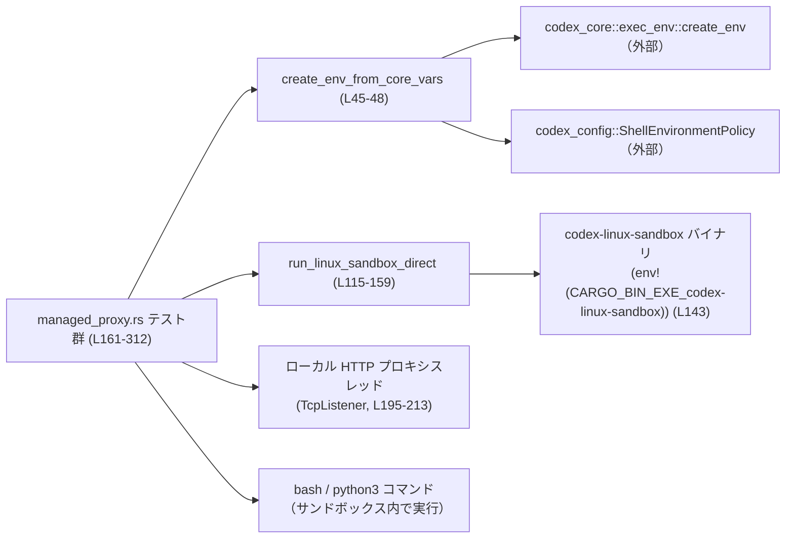
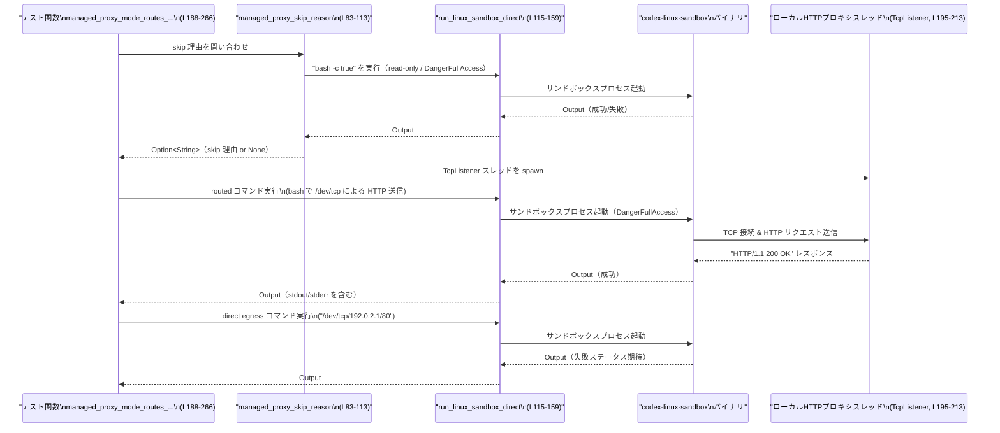

# linux-sandbox/tests/suite/managed_proxy.rs コード解説

## 0. ざっくり一言

`codex-linux-sandbox` バイナリの「managed proxy」モードについて、

- 実行環境の前提（bubblewrap 利用可否・権限）を検出してテストをスキップする補助関数と、
- プロキシ環境変数・ネットワーク・AF_UNIX ソケットに関する挙動を検証する非同期テスト

をまとめた Linux 向け統合テストファイルです。  
（linux-sandbox/tests/suite/managed_proxy.rs）

---

## 1. このモジュールの役割

### 1.1 概要

このモジュールは **Linux 上の codex Linux サンドボックスの「managed proxy」機能**を検証するために存在し、主に次の機能を提供します。

- bubblewrap がビルドされていない／権限が足りない環境を検出し、関連テストをスキップするヘルパー [`should_skip_bwrap_tests`], [`managed_proxy_skip_reason`][L62-L75][L83-L113]。
- サンドボックス起動ヘルパー [`run_linux_sandbox_direct`][L115-L159]（共通の引数組み立て・環境変数設定・タイムアウト処理を担当）。
- managed proxy モードの以下の性質を検証する非同期テスト:
  - プロキシ環境変数未設定時に **fail-closed** になること[L161-L186]。
  - HTTP_PROXY 経由でローカルプロキシにルーティングされつつ、直接外部 egress がブロックされること[L188-L266]。
  - ユーザーコマンドによる AF_UNIX ソケット生成が拒否されること[L268-L312]。

（行番号は linux-sandbox/tests/suite/managed_proxy.rs を対象とします。）

### 1.2 アーキテクチャ内での位置づけ

このテストファイルは、以下のコンポーネントと連携します。

- `codex_config::types::ShellEnvironmentPolicy` と `codex_core::exec_env::create_env` を使って、テスト用の環境変数マップを構築します[L45-L48]。
- `codex_protocol::protocol::SandboxPolicy` を JSON シリアライズし、`codex-linux-sandbox` バイナリに `--sandbox-policy` として渡します[L115-L137]。
- `tokio::process::Command` で `env!("CARGO_BIN_EXE_codex-linux-sandbox")` によるサンドボックスバイナリを非同期プロセスとして起動します[L143-L151]。
- ローカルの `TcpListener` と OS スレッドを使い、HTTP プロキシとして振る舞う小さなサーバーをテスト内で立ち上げます[L195-L213]。
- サンドボックス内で `bash` や `python3` を実行し、ネットワーク・ソケットに対する制限を間接的に検証します[L171-L177][L222-L227][L291-L295]。

依存関係を簡略化した図です。



### 1.3 設計上のポイント

コードから読み取れる設計上の特徴は次のとおりです。

- **テスト前提条件の明示的な検査**  
  - bubblewrap バイナリがビルドされていない／権限がないケースを `should_skip_bwrap_tests` + `managed_proxy_skip_reason` で検出し、テスト全体をスキップするようにしています[L62-L75][L83-L113]。
- **環境変数の一元管理とクリーニング**
  - `create_env_from_core_vars` でコア側のポリシーに沿った環境を構築した上で[L45-L48]、`strip_proxy_env` でさまざまな形式のプロキシ環境変数（大文字・小文字）を削除しています[L50-L56]。
  - サンドボックス起動時には `env_clear()` で OS 既定の環境を一度消し、明示的に構築した環境のみを使います[L143-L148]。
- **プロセス実行の共通化とタイムアウト**
  - `run_linux_sandbox_direct` が全テストで共通のプロセス起動ロジック（引数組み立て・policy の JSON 化・タイムアウト・エラーハンドリング）を担当します[L115-L159]。
  - `tokio::time::timeout` により、サンドボックスコマンドが指定ミリ秒（ここでは 4000ms）を超えてブロックした場合に panic でテストを失敗させます[L151-L154]。
- **並行性**
  - サンドボックス本体の実行は `tokio` の非同期ランタイム上で行い、ローカル HTTP プロキシは `std::thread::spawn` した OS スレッドで処理します[L200-L213]。
  - テストスレッドとプロキシスレッド間の通信にはチャネル (`std::sync::mpsc::channel()`) を利用し、共有可変状態を持たない構造になっています[L200-L210]。
- **エラー条件の「文字列ベース」な判定**
  - bubblewrap 未ビルドや権限不足は stderr の特定文字列で判定します[L18-L26][L58-L60][L77-L81]。  
    これにより、実装内部の詳細に依存せず、「観測できる出力」に対してテストを組んでいます。

---

## 2. 主要な機能一覧（コンポーネントインベントリー）

### 2.1 定数一覧

| 名前 | 種別 | 役割 / 用途 | 定義位置 |
|------|------|-------------|----------|
| `BWRAP_UNAVAILABLE_ERR` | `&'static str` | bubblewrap 未利用可能時に stderr に含まれるエラーメッセージ断片 | `linux-sandbox/tests/suite/managed_proxy.rs:L18-L18` |
| `NETWORK_TIMEOUT_MS` | `u64` | サンドボックスコマンド実行のタイムアウト（ミリ秒）。全テストで 4000ms を使用 | L19-L19 |
| `MANAGED_PROXY_PERMISSION_ERR_SNIPPETS` | `&[&'static str]` | managed proxy 初期化に関する権限エラーを検出するための文字列断片群 | L20-L26 |
| `PROXY_ENV_KEYS` | `&[&'static str]` | 削除対象となるプロキシ関連環境変数キー一覧（大文字） | L28-L43 |

### 2.2 関数一覧

#### ヘルパー関数

| 関数名 | 概要 | 非同期 | 定義位置 |
|--------|------|--------|----------|
| `create_env_from_core_vars() -> HashMap<String, String>` | `ShellEnvironmentPolicy::default()` と `create_env` により、コア実行環境ポリシーに沿った環境変数マップを構築 | いいえ | L45-L48 |
| `strip_proxy_env(env: &mut HashMap<String, String>)` | 典型的なプロキシ環境変数（大文字・小文字）を `env` から削除し、テストの前提を整える | いいえ | L50-L56 |
| `is_bwrap_unavailable_output(output: &Output) -> bool` | `output.stderr` に `BWRAP_UNAVAILABLE_ERR` が含まれるかどうかで、bubblewrap 未利用可能かを判定 | いいえ | L58-L60 |
| `should_skip_bwrap_tests() -> bool` | 読み取り専用ポリシーで簡単なコマンドを実行し、その結果から bubblewrap 未利用可能かを判定 | はい | L62-L75 |
| `is_managed_proxy_permission_error(stderr: &str) -> bool` | `MANAGED_PROXY_PERMISSION_ERR_SNIPPETS` のいずれかが `stderr` に含まれるかを判定 | いいえ | L77-L81 |
| `managed_proxy_skip_reason() -> Option<String>` | bubblewrap 未利用可能・または managed proxy が権限不足で初期化できない場合に、その理由文字列を返す | はい | L83-L113 |
| `run_linux_sandbox_direct(command, sandbox_policy, allow_network_for_proxy, env, timeout_ms) -> Output` | `codex-linux-sandbox` バイナリを指定ポリシー・環境変数・タイムアウトで実行する共通ヘルパー | はい | L115-L159 |

#### テスト関数（`#[tokio::test]`）

| 関数名 | 概要 | 定義位置 |
|--------|------|----------|
| `managed_proxy_mode_fails_closed_without_proxy_env()` | managed proxy モードでプロキシ環境変数がない場合に、サンドボックスがエラーメッセージ付きで fail-closed することを検証 | L161-L186 |
| `managed_proxy_mode_routes_through_bridge_and_blocks_direct_egress()` | HTTP_PROXY を指定するとローカルプロキシスレッドへ HTTP 経由でルーティングされる一方、直接 egress（/dev/tcp での外部接続）がブロックされることを検証 | L188-L266 |
| `managed_proxy_mode_denies_af_unix_creation_for_user_command()` | サンドボックス内のユーザーコマンド（python3）が AF_UNIX ソケットを生成しようとした際に、PermissionError で失敗することを検証 | L268-L312 |

---

## 3. 公開 API と詳細解説

### 3.1 型一覧

このファイル内で **新しく定義される構造体・列挙体などの型はありません**。  
外部クレート・標準ライブラリの型としては、以下が重要です（簡略）。

- `std::collections::HashMap<String, String>` – 環境変数のキー・値を保持します[L45-L48][L50-L56]。
- `codex_protocol::protocol::SandboxPolicy` – サンドボックスの権限ポリシーを表す型として利用されます（詳細は当該クレート側に依存）[L6-L6][L68-L68][L94-L94]。
- `std::process::Output` – 子プロセスの終了ステータス・stdout・stderr を保持します[L13-L13][L58-L60][L115-L159]。

### 3.2 関数詳細（7 件）

#### `run_linux_sandbox_direct(command: &[&str], sandbox_policy: &SandboxPolicy, allow_network_for_proxy: bool, env: HashMap<String, String>, timeout_ms: u64) -> Output`  

（linux-sandbox/tests/suite/managed_proxy.rs:L115-L159）

**概要**

- `codex-linux-sandbox` バイナリを、指定されたコマンド・サンドボックスポリシー・環境変数・タイムアウトで実行し、その `Output` を返す非同期ヘルパーです。
- テストでは、全てのサンドボックス実行がこの関数経由で行われます[L171-L177][L222-L232][L257-L263][L291-L300]。

**引数**

| 引数名 | 型 | 説明 |
|--------|----|------|
| `command` | `&[&str]` | サンドボックス内で実行するコマンドと引数（例: `&["bash", "-c", "true"]`）[L116-L120] |
| `sandbox_policy` | `&SandboxPolicy` | サンドボックスの権限・ファイルシステムアクセスなどを決めるポリシー。JSON にシリアライズされて `--sandbox-policy` 引数として渡されます[L126-L135] |
| `allow_network_for_proxy` | `bool` | managed proxy 用にネットワークを許可するフラグ。true の場合 `--allow-network-for-proxy` が追加されます[L137-L139] |
| `env` | `HashMap<String, String>` | 子プロセスに設定する環境変数群。`env_clear()` 後に `envs(env)` で全て設定されます[L143-L148] |
| `timeout_ms` | `u64` | `tokio::time::timeout` に渡すタイムアウト値（ミリ秒）。`NETWORK_TIMEOUT_MS` を使用しています[L151-L154][L19-L19] |

**戻り値**

- `std::process::Output`  
  子プロセスの終了ステータス・stdout・stderr を含むオブジェクトです。`Result` ではなく、エラー時は `panic!` でテストを失敗させる設計です[L151-L158]。

**内部処理の流れ**

1. カレントディレクトリを取得します。失敗した場合は `panic!("cwd should exist: {err}")` で即座にテストを失敗させます[L122-L125]。
2. `sandbox_policy` を `serde_json::to_string` で JSON 文字列に変換します。失敗時は `panic!("policy should serialize: {err}")` となります[L126-L129]。
3. 以下の引数を `args` ベクタに構築します[L131-L141]。
   - `--sandbox-policy-cwd <cwd>`
   - `--sandbox-policy <policy_json>`
   - `--allow-network-for-proxy`（フラグが true の場合のみ）[L137-L139]
   - `"--"` + ユーザー指定 `command`（可変長）[L140-L141]
4. `Command::new(env!("CARGO_BIN_EXE_codex-linux-sandbox"))` でサンドボックスバイナリを指定し、カレントディレクトリ・環境変数・標準入出力を設定します[L143-L150]。
5. `tokio::time::timeout(Duration::from_millis(timeout_ms), cmd.output())` で非同期にプロセス終了を待ち、タイムアウトした場合は `panic!("sandbox command should not time out: {err}")` となります[L151-L154]。
6. プロセスの起動自体が `Err` の場合も `panic!("sandbox command should execute: {err}")` となります[L155-L158]。
7. 正常に `Output` が得られた場合、それを呼び出し元に返します[L155-L157]。

**Examples（使用例）**

テスト内での代表的な使用例です（簡略化）。

```rust
#[tokio::test]
async fn example_run_sandbox() {
    let mut env = create_env_from_core_vars();                 // コアポリシーに沿った環境を構築
    strip_proxy_env(&mut env);                                // プロキシ関連の環境変数を削除
    env.insert("HTTP_PROXY".into(), "http://127.0.0.1:9".into());

    let output = run_linux_sandbox_direct(
        &["bash", "-c", "true"],                              // サンドボックス内で実行するコマンド
        &SandboxPolicy::DangerFullAccess,                     // ポリシー
        /*allow_network_for_proxy*/ true,                     // managed proxy 用にネットワーク許可
        env,
        NETWORK_TIMEOUT_MS,
    ).await;

    assert!(output.status.success());                         // 成功したことを確認
}
```

**Errors / Panics**

- `std::env::current_dir()` が失敗した場合に panic[L122-L125]。
- `serde_json::to_string(sandbox_policy)` が失敗した場合に panic[L126-L129]。
- `tokio::time::timeout` がタイムアウトした場合に panic（コマンドが `timeout_ms` 以内に終わらなかった場合）[L151-L154]。
- `cmd.output().await` が `Err` を返した場合に panic（プロセス起動に失敗した場合など）[L155-L158]。
- これらはいずれもテストを即座に失敗させることを意図した実装です。

**Edge cases（エッジケース）**

- `command` が空スライスの場合の挙動は、このファイルからはわかりませんが、サンドボックスバイナリ側の `--` 以降の処理に依存します（引数は `args.push("--"); args.extend(command)` で渡されます）[L140-L141]。
- `timeout_ms` が非常に小さい値の場合、サンドボックス起動前後のオーバーヘッドでタイムアウトし、panic になる可能性があります。
- `env` に必要な変数（例えば `HTTP_PROXY`）が含まれていない場合、そのテストごとの期待に応じてサンドボックス内でエラーが発生します（例: fail-closed テスト[L171-L185]）。

**使用上の注意点**

- 非同期関数なので、`tokio` などの非同期ランタイム上で `.await` する必要があります。
- テスト以外の場所で再利用する場合、panic ベースのエラーハンドリングはライブラリ API には適さない可能性がありますが、このファイルはテスト専用です。
- `env_clear()` を呼んでいるため、OS 環境変数が一切引き継がれません。必要な変数はすべて `env` に明示的に設定する必要があります[L143-L148]。

---

#### `managed_proxy_skip_reason() -> Option<String>`  

（linux-sandbox/tests/suite/managed_proxy.rs:L83-L113）

**概要**

- managed proxy 関連テストを実行する前に、**テストをスキップすべき理由**があるかどうかを判定します。
- bubblewrap 未利用可能、または managed proxy モードの初期化に必要な権限がない場合、テストをスキップするためのメッセージを返します。

**引数**

- 引数はありません。

**戻り値**

- `Option<String>`
  - `None` – テストを実行してよい（skip しない）場合。
  - `Some(reason)` – テストをスキップすべき場合。その理由を記述した文字列。

**内部処理の流れ**

1. `should_skip_bwrap_tests().await` を呼び出し、bubblewrap がビルドされていない／利用できないかを判定します[L84-L85]。
   - true の場合 `"vendored bwrap was not built in this environment"` を返します[L85-L85]。
2. 利用可能な場合は `create_env_from_core_vars` で環境を構築し、`strip_proxy_env` でプロキシ関連環境変数を削除します[L88-L89]。
3. `HTTP_PROXY` だけを `http://127.0.0.1:9` に設定した環境で、`SandboxPolicy::DangerFullAccess` を用いて `bash -c true` を実行します[L90-L98]。
4. その `Output` のステータスが成功（`status.success()`）なら skip 理由はないので `None` を返します[L100-L101]。
5. 失敗していれば stderr を文字列に変換し[L104-L104]、`is_managed_proxy_permission_error` で権限エラーであるかを判定します[L105-L106]。
   - 権限エラーの場合は `"managed proxy requires kernel namespace privileges unavailable here: <stderr>"` という形式のメッセージを返します[L106-L109]。
   - そうでなければ skip 理由なしとして `None` を返します[L112-L112]。

**Examples（使用例）**

すべてのテスト関数の冒頭で、以下のように使用されています。

```rust
#[tokio::test]
async fn example_skip_wrapper() {
    if let Some(skip_reason) = managed_proxy_skip_reason().await { // skip 理由を確認
        eprintln!("skipping managed proxy test: {skip_reason}");  // 理由を標準エラーに出力
        return;                                                   // テスト本体を実行しない
    }

    // ここに本来の検証ロジックを書く
}
```

**Errors / Panics**

- 内部で `run_linux_sandbox_direct` を呼び出しているため、その中で発生する panic（ディレクトリ取得失敗・ポリシーシリアライズ失敗・プロセス起動失敗・タイムアウト）はそのまま伝播します[L92-L99][L115-L159]。
- `String::from_utf8_lossy(&output.stderr)` は不正な UTF-8 を許容し、panic しません[L104-L104]。

**Edge cases（エッジケース）**

- `bash -c true` が成功するが managed proxy の初期化自体がサイレントに失敗するようなケースが存在するかどうかは、このコードからはわかりません。ここでは終了ステータスのみを見ています[L100-L101]。
- stderr の内容が `MANAGED_PROXY_PERMISSION_ERR_SNIPPETS` に含まれない権限エラーの場合、`None` を返してしまうため、「実質的にテストは失敗する」形になります[L105-L112]。

**使用上の注意点**

- skip 理由の判定は **テストごとに行われている**ため、複数テストで繰り返し呼び出した場合、毎回サンドボックスプロセスが起動します（性能への影響はテスト規模に依存）。
- stdout ではなく **stderr のみ** で権限エラーを判定している点に注意が必要です[L104-L106]。

---

#### `should_skip_bwrap_tests() -> bool`  

（linux-sandbox/tests/suite/managed_proxy.rs:L62-L75）

**概要**

- vendored bubblewrap（`bwrap`）がこのビルド環境で利用できるかどうかを判定し、利用できない場合には managed proxy 関連テストをスキップすべきと判断します。
- 具体的には、読み取り専用ポリシーで無害なコマンドを実行し、その stderr に `BWRAP_UNAVAILABLE_ERR` が含まれるかを検査します。

**引数**

- 引数はありません。

**戻り値**

- `bool` –  
  - `true`: bubblewrap が利用できず、テストをスキップすべきと判断した場合。  
  - `false`: テストを実行して問題ないと判断した場合。

**内部処理の流れ**

1. `create_env_from_core_vars()` を呼び出し、コア側のポリシーに沿った環境変数マップを取得します[L63-L63]。
2. `strip_proxy_env` でプロキシ関連環境変数を削除します[L64-L64]。
3. `SandboxPolicy::new_read_only_policy()` を使い、`bash -c true` を実行するサンドボックスを起動します[L66-L72]。
4. 得られた `Output` を `is_bwrap_unavailable_output` に渡し、stderr に `BWRAP_UNAVAILABLE_ERR` が含まれていれば `true` を返します[L73-L74]。

**Examples（使用例）**

`managed_proxy_skip_reason` から使用されています[L84-L85]。単体で呼ぶ例は次のとおりです。

```rust
#[tokio::test]
async fn example_check_bwrap() {
    if should_skip_bwrap_tests().await {
        eprintln!("bwrap is unavailable; skipping tests");
    } else {
        // テストを続行
    }
}
```

**Errors / Panics**

- 内部で `run_linux_sandbox_direct` を使用しているため、同関数が起こす panic が発生し得ます[L66-L73][L115-L159]。
- `String::from_utf8_lossy` を利用する `is_bwrap_unavailable_output` 側では panic は発生しません[L58-L60]。

**Edge cases（エッジケース）**

- bubblewrap が利用できない場合でも、`BWRAP_UNAVAILABLE_ERR` 以外のメッセージを出すような実装に変更された場合、この関数は `false` を返してしまう可能性があります。
- `SandboxPolicy::new_read_only_policy()` の具体的挙動はこのファイルからは不明ですが、テスト目的からは「安全に常に成功すること」が期待されていると解釈できます（ただしコード上の保証ではありません）[L68-L68]。

**使用上の注意点**

- 実行ごとにサンドボックスプロセスを 1 回起動するため、頻繁に呼び出すとテスト時間が増える可能性があります。
- この関数は「テストスキップのためだけ」に利用することが意図されており、一般的な bwrap 検査用 API とは位置づけが異なります。

---

#### `strip_proxy_env(env: &mut HashMap<String, String>)`  

（linux-sandbox/tests/suite/managed_proxy.rs:L50-L56）

**概要**

- 与えられた環境変数マップから、典型的なプロキシ関連のキーを削除します。
- 大文字のキー（例: `HTTP_PROXY`）と、その小文字版（`http_proxy`）の両方を削除します。

**引数**

| 引数名 | 型 | 説明 |
|--------|----|------|
| `env` | `&mut HashMap<String, String>` | プロキシ関連のキーを削除する対象の環境変数マップ |

**戻り値**

- なし（`()`）。`env` が in-place で変更されます。

**内部処理の流れ**

1. `PROXY_ENV_KEYS` の各キー（大文字）に対して for ループで処理します[L51-L55]。
2. `env.remove(*key)` で大文字のキーを削除します[L52-L52]。
3. `key.to_ascii_lowercase()` で小文字版のキー文字列を作成し、それに対応するエントリも削除します[L53-L54]。

**Examples（使用例）**

```rust
let mut env = create_env_from_core_vars();              // たくさんの環境変数を含むマップ
env.insert("HTTP_PROXY".into(), "http://proxy:8080".into());
env.insert("https_proxy".into(), "http://proxy:8443".into());

strip_proxy_env(&mut env);                              // プロキシ関連キーをすべて削除

assert!(!env.contains_key("HTTP_PROXY"));
assert!(!env.contains_key("https_proxy"));
```

テストでは、サンドボックス実行前に必ず呼び出され、ホスト側のプロキシ設定の影響を排除しています[L63-L64][L89-L89][L168-L169][L215-L216][L287-L288]。

**Errors / Panics**

- `HashMap::remove` は存在しないキーに対して呼び出しても panic しないため、この関数自体が panic するケースはコード上存在しません[L51-L55]。

**Edge cases（エッジケース）**

- `to_ascii_lowercase` を使っているため、マルチバイト文字列をキーに使う場合の挙動は ASCII ベースになりますが、ここではすべて英字大文字で定義されているため問題にはなりません[L28-L43]。
- `Proxy` のように大文字小文字が混在したキー（たとえば `Http_Proxy`）は削除されません。このテストでは主要な形だけを対象としていることがわかります。

**使用上の注意点**

- この関数は `HashMap` の所有者ではなく、**可変参照** を受け取るため、呼び出し側で `mut` なマップを用意する必要があります。
- テストの独立性を保つために、サンドボックス実行前には毎回呼び出されている点が重要です。

---

#### `managed_proxy_mode_routes_through_bridge_and_blocks_direct_egress()`  

（`#[tokio::test]`、linux-sandbox/tests/suite/managed_proxy.rs:L188-L266）

**概要**

- managed proxy モードが次の 2 条件を満たすことを検証する統合テストです。
  1. サンドボックス内の HTTP リクエストが、ローカルで立ち上げた HTTP プロキシスレッドを経由してルーティングされる（橋渡しされる）こと[L195-L213][L222-L247][L249-L255]。
  2. 一方で、サンドボックス内から直接外部アドレスに `/dev/tcp` 経由で接続する試みが失敗すること（direct egress のブロック）[L257-L265]。

**引数・戻り値**

- テスト関数のため、引数・戻り値はありません（`async fn` で、`#[tokio::test]` により `Result` 型も使用していません）。

**内部処理の流れ**

1. `managed_proxy_skip_reason` を呼び出し、スキップが必要か確認します。`Some(reason)` の場合はメッセージを出力して `return` します[L190-L193]。
2. `TcpListener::bind((Ipv4Addr::LOCALHOST, 0))` でローカルホストの任意の空きポートにバインドし、HTTP プロキシとして振る舞うリスナーを作成します[L195-L199]。
3. `std::sync::mpsc::channel()` でリクエスト文字列を送るチャネルを作成し、一つの OS スレッドを `std::thread::spawn` で起動します[L200-L213]。
   - スレッド側で `listener.accept()` により接続を受け付け[L202-L202]、
   - 読み取ったリクエストを `String::from_utf8_lossy` -> `String` に変換してチャネルに送信し[L206-L209]、
   - `HTTP/1.1 200 OK` の固定レスポンスをクライアントに返します[L210-L212]。
4. テストスレッド側では、`HTTP_PROXY` を `http://127.0.0.1:<proxy_port>` に設定します[L215-L220]。
5. `run_linux_sandbox_direct` を用いて、サンドボックス内で `bash` シェルを実行し、次のようなシェルスクリプトを実行します[L222-L227]。
   - `HTTP_PROXY` からホスト名とポートを抽出。
   - `/dev/tcp/${host}/${port}` を用いてプロキシに TCP 接続。
   - HTTP リクエスト行 `GET http://example.com/ HTTP/1.1` を送信。
   - 最初のレスポンス行を読み取り、標準出力に出力。
6. `routed_output` のステータスが成功かを検証し、stdout に `HTTP/1.1 200 OK` が含まれることを確認します[L235-L247]。
7. チャネルからリクエスト文字列を受け取り、`"GET http://example.com/ HTTP/1.1"` を含んでいること（絶対形式の HTTP リクエストであること）を検証します[L249-L255]。
8. 最後に、`HTTP_PROXY` を設定した同じ環境で、`echo hi > /dev/tcp/192.0.2.1/80` を実行し、ステータスが失敗（`success() == false`）であることを確認します[L257-L265]。

**Examples（使用例）**

テスト自体が使用例です。新しいテストを書く場合のテンプレートとして利用できます。

```rust
#[tokio::test]
async fn example_route_and_block() {
    if let Some(_reason) = managed_proxy_skip_reason().await {
        return;                                             // 実行前にスキップ判定
    }

    // 省略: プロキシスレッドを立ち上げる処理（L195-L213 と同様）

    let mut env = create_env_from_core_vars();
    strip_proxy_env(&mut env);
    env.insert("HTTP_PROXY".into(), "http://127.0.0.1:12345".into());

    let output = run_linux_sandbox_direct(
        &["bash", "-c", ".... HTTP リクエストを投げるスクリプト ...."],
        &SandboxPolicy::DangerFullAccess,
        true,
        env,
        NETWORK_TIMEOUT_MS,
    ).await;

    assert!(output.status.success());
}
```

**Errors / Panics**

- `TcpListener::bind` / `local_addr` / `accept` / `set_read_timeout` / `read` / `write_all` / `send` に対する `expect()` により、これら I/O 操作が失敗した場合は panic します[L195-L213]。
- `recv_timeout` がタイムアウトした場合も `expect("expected proxy request")` により panic します[L249-L251]。
- サンドボックス実行に関する panic はすべて `run_linux_sandbox_direct` 経由で発生し得ます[L222-L233][L257-L264]。

**Edge cases（エッジケース）**

- プロキシスレッドが何らかの理由で起動に失敗した場合、サンドボックス側の接続は失敗し、`routed_output` が失敗ステータスとなります。この場合、テストは `assert_eq!(..., true)` によって失敗します[L235-L242]。
- `recv_timeout(Duration::from_secs(3))` がタイムアウトした場合（サンドボックスからのリクエストが来ない場合）、テストは panic し、問題の切り分けが必要になります[L249-L251]。
- `192.0.2.1` は「ドキュメント用」IP アドレスであり、実際には到達できないことが多いですが、ここでは「直接 egress ができないこと」を確認する目的で使われています[L257-L263]。どの層でブロックされているか（ルーティング、ファイアウォール、サンドボックス）はこのコードからは特定できません。

**使用上の注意点**

- プロキシスレッドはブロック I/O を使用しているため、`tokio` の非同期ランタイムから分離する目的で OS スレッド上で動作させています[L200-L213]。
- テストはローカルホストの TCP ポートに依存するため、極端に制限された環境（例: ループバックインターフェースが利用できないコンテナ）では失敗する可能性があります。
- HTTP リクエストのパースは単純に文字列検索で行っており、プロトコル上の細かい検証は行っていません[L249-L255]。

---

#### `managed_proxy_mode_denies_af_unix_creation_for_user_command()`  

（`#[tokio::test]`、linux-sandbox/tests/suite/managed_proxy.rs:L268-L312）

**概要**

- managed proxy モードでは、ユーザーコマンド（ここでは `python3`）が **AF_UNIX ソケット**を作成しようとした場合に、`PermissionError` として拒否されることを検証するテストです。
- これにより、ユーザーコードがサンドボックス外とのローカル IPC を AF_UNIX 経由で行うことを防ぐポリシーを確認しています（ただし、具体的なポリシーはサンドボックス実装側に依存します）。

**内部処理の流れ**

1. `managed_proxy_skip_reason` でスキップ理由がないか確認し、必要に応じて `return` します[L270-L273]。
2. 事前条件として `python3` が利用可能かどうかをチェックします。
   - `Command::new("bash").arg("-c").arg("command -v python3 >/dev/null").status().await` を実行し、ステータスが成功かどうかを見ます[L275-L281]。
   - 利用不可ならば「python3 is unavailable」と標準エラーに出力し、テストをスキップします[L282-L284]。
3. 環境を構築し、プロキシ関連を削除しつつ `HTTP_PROXY` に `http://127.0.0.1:9` を設定します[L287-L290]。
4. `run_linux_sandbox_direct` を用いて、以下の Python スクリプトをサンドボックス内で実行します[L291-L300]。
   - `socket.socket(socket.AF_UNIX, socket.SOCK_STREAM)` を試行。
   - `PermissionError` が発生したら `sys.exit(0)`。
   - その他の `OSError` が発生したら `sys.exit(2)`。
   - 例外が発生しなければ `sys.exit(1)`。
5. 終了コードが `Some(0)`（PermissionError による clean な拒否）であることを `assert_eq!` で検証します[L304-L307]。

**Examples（使用例）**

テスト自体が使用例です。AF_UNIX 制限に関する新たなテストを書くときのテンプレートとして利用できます。

```rust
#[tokio::test]
async fn example_unix_socket_denied() {
    if let Some(_reason) = managed_proxy_skip_reason().await {
        return;
    }

    // python3 が使えるかどうか確認（L275-L281 と同様）

    let mut env = create_env_from_core_vars();
    strip_proxy_env(&mut env);
    env.insert("HTTP_PROXY".into(), "http://127.0.0.1:9".into());

    let output = run_linux_sandbox_direct(
        &["python3", "-c", "import socket; socket.socket(socket.AF_UNIX);"],
        &SandboxPolicy::DangerFullAccess,
        true,
        env,
        NETWORK_TIMEOUT_MS,
    ).await;

    // 実際のテストでは exit code によって PermissionError を確認
}
```

**Errors / Panics**

- `python3` チェックの `status().await` が `Err` の場合は `expect("python3 probe should execute")` により panic します[L279-L280]。
- AF_UNIX 作成テストの実行中に `run_linux_sandbox_direct` 内で発生し得る panic はそのまま伝播します[L291-L300][L115-L159]。
- `output.status.code()` が `Some(0)` でない場合、`assert_eq!` によりテストが失敗します[L304-L311]。

**Edge cases（エッジケース）**

- python3 の実装やバージョンによって、AF_UNIX 作成時のエラー種別が `PermissionError` 以外の `OSError` になる可能性があります。その場合は exit code 2 となり、テストは失敗します（ここでは strict に PermissionError を期待）[L295-L295]。
- AF_UNIX 作成が成功してしまう環境では exit code 1 となり、やはりテストは失敗します（sandbox の制限が緩い、もしくは無効な場合）[L295-L295]。

**使用上の注意点**

- AF_UNIX ソケット制限は OS とカーネル機能に依存するため、このテストが通るには特定の名前空間／seccomp などの設定が必要と推測されますが、詳細はこのファイルからは読み取れません。
- python3 の存在確認を行っているため、python3 がインストールされていない CI 環境でもテスト全体が失敗することはなく、スキップされる設計です[L275-L284]。

---

#### `managed_proxy_mode_fails_closed_without_proxy_env()`  

（`#[tokio::test]`、linux-sandbox/tests/suite/managed_proxy.rs:L161-L186）

**概要**

- managed proxy モードにおいて、プロキシ環境変数が何も設定されていない場合には、サンドボックスが **fail-closed**（安全側に倒れて失敗）し、適切なエラーメッセージを出すことを検証するテストです。

**内部処理の流れ**

1. `managed_proxy_skip_reason` により、スキップすべきかを確認します[L163-L166]。
2. 環境を構築し、`strip_proxy_env` でプロキシ関連の環境変数を全て削除します[L168-L169]。
3. `SandboxPolicy::DangerFullAccess` と `allow_network_for_proxy = true` で `bash -c true` を実行します[L171-L177]。
4. ステータスが成功でない（`success() == false`）ことを `assert_eq!` で検証します[L180-L180]。
5. stderr に `"managed proxy mode requires proxy environment variables"` が含まれることを `assert!` で確認します[L181-L185]。

**Examples / Errors / Edge cases / 注意点**

- 使用例はテストそのものです。
- エラーや panic は、`run_linux_sandbox_direct` 内と、`assert` での失敗に限定されます。
- 「プロキシ環境変数が 1 つもない」という条件のみを検証しており、環境変数があっても無効な値であるケースなどは別テスト（または別の場所）で扱われる可能性がありますが、このファイルからはわかりません。

---

### 3.3 その他の関数

上記で詳細を記載していない補助関数の一覧です。

| 関数名 | 役割（1 行） | 定義位置 |
|--------|--------------|----------|
| `create_env_from_core_vars() -> HashMap<String, String>` | `ShellEnvironmentPolicy::default()` と `create_env` を使って、コアポリシーに沿った環境変数マップを構築します | L45-L48 |
| `is_bwrap_unavailable_output(output: &Output) -> bool` | `output.stderr` に `BWRAP_UNAVAILABLE_ERR` が含まれるかをチェックし、bubblewrap 未利用可能かを判定します | L58-L60 |
| `is_managed_proxy_permission_error(stderr: &str) -> bool` | `MANAGED_PROXY_PERMISSION_ERR_SNIPPETS` のいずれかが `stderr` に含まれているかどうかで、managed proxy の権限エラーかどうかを判定します | L77-L81 |

---

## 4. データフロー

### 4.1 代表的なシナリオ: プロキシ経由ルーティングと direct egress ブロック

`managed_proxy_mode_routes_through_bridge_and_blocks_direct_egress` テストにおけるデータフローを示します[L188-L266]。

- テスト開始時に、まず `managed_proxy_skip_reason` を通じて環境が適切か確認します[L190-L193]。
- ローカル HTTP プロキシスレッド（`TcpListener`）が立ち上がり、サンドボックスからの接続を待ちます[L195-L213]。
- サンドボックス内の `bash` スクリプトが `HTTP_PROXY` を用いて `/dev/tcp/host/port` に接続し、HTTP リクエストを送信します[L222-L227]。
- プロキシスレッドがリクエストを受け取り、固定レスポンスを返し、チャネルでリクエスト内容をテストスレッドに渡します[L202-L212][L249-L251]。
- 続けて direct egress の試行（`/dev/tcp/192.0.2.1/80`）が行われ、これは失敗することが期待されています[L257-L265]。

これをシーケンス図で表します。



このフローから分かるポイント:

- テストは常に **skip 判定 → 実際の検証** という 2 段階構成になっています[L190-L193]。
- サンドボックスとローカルプロキシの通信は TCP で行われ、アプリケーションレベルでは HTTP をやり取りします[L202-L212]。
- direct egress のブロックは、終了ステータスが失敗であることを検証することで確認されています[L257-L265]。

---

## 5. 使い方（How to Use）

このファイルはテスト用モジュールですが、ここにあるヘルパー関数とパターンは、他の統合テストを追加する際のテンプレートとして利用できます。

### 5.1 基本的な使用方法

新しい managed proxy 関連テストを書く場合の典型的な流れです。

1. テスト関数の先頭で `managed_proxy_skip_reason` を呼んでスキップ判定を行う。
2. `create_env_from_core_vars` で環境マップを構築し、`strip_proxy_env` でクリーンにする。
3. 必要なプロキシ環境変数やその他の設定を `env` に追加する。
4. `run_linux_sandbox_direct` でサンドボックスを起動し、`Output` のステータス・stdout・stderr を検証する。

簡略なコード例:

```rust
#[tokio::test]
async fn new_managed_proxy_test() {
    if let Some(reason) = managed_proxy_skip_reason().await {          // 1. skip 判定
        eprintln!("skipping test: {reason}");
        return;
    }

    let mut env = create_env_from_core_vars();                         // 2. 環境作成
    strip_proxy_env(&mut env);

    env.insert("HTTP_PROXY".into(), "http://127.0.0.1:9".into());      // 3. 必要な設定

    let output = run_linux_sandbox_direct(                             // 4. サンドボックス実行
        &["bash", "-c", "echo test"],
        &SandboxPolicy::DangerFullAccess,
        true,                                                          // allow_network_for_proxy
        env,
        NETWORK_TIMEOUT_MS,
    ).await;

    assert!(output.status.success());                                  // 結果の検証
}
```

### 5.2 よくある使用パターン

- **スキップとテスト本体の共通パターン**  
  すべてのテストが同じ `if let Some(skip_reason) = managed_proxy_skip_reason().await` のパターンで開始します[L163-L166][L190-L193][L270-L273]。
- **ネットワークを使うテスト**
  - ローカル `TcpListener` を OS スレッドで起動し、テストスレッドから `HTTP_PROXY` をそのポートに向けて設定するパターン[L195-L220]。
  - サンドボックス内から `/dev/tcp` を用いてプロキシに接続し、HTTP レスポンスを読み取るパターン[L222-L247]。
- **外部コマンドの前提確認**
  - `python3` の有無を `bash -c "command -v python3"` でチェックし、利用できない場合はテスト自体をスキップするパターン[L275-L284]。

### 5.3 よくある間違い

このコードから推測される、誤用しやすいポイントを挙げます。

```rust
// 誤り例: OS 環境をそのまま引き継いでしまう
let mut env = std::env::vars().collect::<HashMap<_, _>>();
// これを run_linux_sandbox_direct に渡すと、ホストの HTTP_PROXY などが残る可能性がある

// 正しい例: create_env_from_core_vars + strip_proxy_env を使う
let mut env = create_env_from_core_vars();              // コアポリシーに沿った環境
strip_proxy_env(&mut env);                              // プロキシ関連を削除
```

```rust
// 誤り例: skip 判定を行わずに直接テスト本体を実行
#[tokio::test]
async fn bad_test() {
    // managed_proxy_skip_reason を呼んでいない
    let env = create_env_from_core_vars();
    // ...
}

// 正しい例: 先に skip 判定を行う
#[tokio::test]
async fn good_test() {
    if let Some(reason) = managed_proxy_skip_reason().await {
        eprintln!("skipping: {reason}");
        return;
    }
    // ここからテスト本体
}
```

### 5.4 使用上の注意点（まとめ）

- このファイルは `#![cfg(target_os = "linux")]` でガードされており、**Linux 以外ではコンパイルされません**[L1-L1]。
- `env!("CARGO_BIN_EXE_codex-linux-sandbox")` に依存しているため、`codex-linux-sandbox` バイナリが `cargo test` 実行時にビルドされている必要があります[L143-L143]。
- すべてのサンドボックス実行は 4000ms のタイムアウトを持っており、ハングすると panic でテストが失敗します[L19-L19][L151-L154]。
- ネットワーク関連のテストはローカルホストの TCP 機能に依存し、ループバックが利用できない環境では失敗する可能性があります[L195-L213]。
- AF_UNIX ソケット制限テストは python3 の存在に依存し、なければ自動的にスキップされます[L275-L285]。

---

## 6. 変更の仕方（How to Modify）

### 6.1 新しい機能（テスト）を追加する場合

managed proxy に関する新しい挙動をテストしたい場合、典型的なステップは次のとおりです。

1. **テストスケルトンの作成**
   - `#[tokio::test]` + `async fn` でテスト関数を定義します。
2. **スキップロジックの組み込み**
   - 冒頭で `managed_proxy_skip_reason().await` を呼び、`Some(reason)` の場合は `return` します[L163-L166][L190-L193][L270-L273]。
3. **環境の準備**
   - `create_env_from_core_vars` で `HashMap<String, String>` を構築し、`strip_proxy_env` でプロキシ関連を削除します[L45-L48][L50-L56]。
   - テストに必要な環境変数（例: `HTTP_PROXY`, `HTTPS_PROXY`）を `env.insert` で追加します。
4. **必要であればローカルサーバーや補助スレッドを起動**
   - ネットワークを使うテストの場合、`TcpListener` + `std::thread::spawn` + `mpsc::channel` のパターンを流用します[L195-L213][L200-L210]。
5. **`run_linux_sandbox_direct` を使ってサンドボックスを実行**
   - 適切な `SandboxPolicy` と `allow_network_for_proxy` を指定して呼び出します[L171-L177][L222-L232][L291-L300]。
6. **結果の検証**
   - `Output` の `status`, `stdout`, `stderr` を `assert!` や `assert_eq!` で検証します[L180-L185][L235-L247][L304-L311]。

### 6.2 既存の機能を変更する場合

- **エラーメッセージやフォーマットを変更する場合**
  - `BWRAP_UNAVAILABLE_ERR` や `MANAGED_PROXY_PERMISSION_ERR_SNIPPETS` に含まれる文字列に依存しているため、その内容を変更した場合はテスト側の定数も合わせて更新する必要があります[L18-L26][L58-L60][L77-L81]。
- **プロキシ環境変数の扱いを変更する場合**
  - 新しいプロキシ環境変数をサポートした場合は `PROXY_ENV_KEYS` に追加し、`strip_proxy_env` で削除されるようにすることで、テストの一貫性を保てます[L28-L43][L50-L56]。
- **サンドボックスポリシー API の変更**
  - `SandboxPolicy::new_read_only_policy` や `SandboxPolicy::DangerFullAccess` のシグネチャや挙動が変わった場合、テストが失敗する可能性があります。その場合、テストが期待している「読取専用」「フルアクセス」の意味を再確認し、適切なポリシーに差し替える必要があります[L68-L68][L94-L94][L173-L173][L228-L229][L297-L297]。
- **タイムアウトやパフォーマンスに関する変更**
  - `NETWORK_TIMEOUT_MS` を変更すると、テストの許容時間が変わります。サンドボックスの起動時間が増加した場合は値を調整することを検討する必要があります[L19-L19][L151-L154]。
- 変更の影響範囲を確認する際は、このファイル内での関数呼び出し関係（2.2 節）と、文字列依存の判定箇所（`contains(...)` を用いている場所）を優先して確認すると効率的です。

---

## 7. 関連ファイル

このモジュールと密接に関係する外部モジュール・バイナリです（パスはコード上から推測できる範囲に留めます）。

| パス / モジュール | 役割 / 関係 |
|-------------------|------------|
| `codex_config::types::ShellEnvironmentPolicy` | `create_env_from_core_vars` で利用される環境ポリシー型。どの環境変数を許可するかといった設定を担っていると考えられますが、詳細は当該クレートに依存します[L4-L4][L45-L47]。 |
| `codex_core::exec_env::create_env` | コア側のルールに沿って環境変数マップを生成する関数。テストで使う環境の初期値を提供します[L5-L5][L45-L48]。 |
| `codex_protocol::protocol::SandboxPolicy` | サンドボックスポリシーを表す型。テストでは `new_read_only_policy` と `DangerFullAccess` の 2 種類が使用されています[L6-L6][L68-L68][L94-L94][L173-L173][L228-L229][L297-L297]。 |
| `codex-linux-sandbox` バイナリ | `env!("CARGO_BIN_EXE_codex-linux-sandbox")` で参照されるテスト対象のバイナリ。`run_linux_sandbox_direct` を通じて起動されます[L143-L151]。 |
| `tokio::process::Command` | 非同期に子プロセス（サンドボックス）を起動するために使用されます[L16-L16][L143-L151]。 |
| `linux-sandbox/tests/suite/managed_proxy.rs`（本ファイル） | managed proxy モードに関する統合テストと、それを支えるヘルパー関数群を定義します。 |

このファイル単体では、他のテストファイルとの関係性やサンドボックス実装の詳細は分かりませんが、上記の依存関係を通じて codex 全体のサンドボックス機能の一部分を検証していることが読み取れます。
