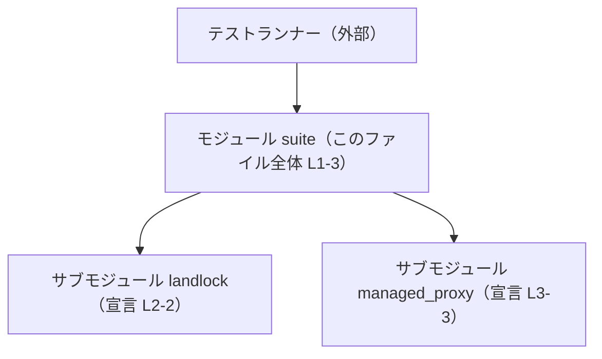
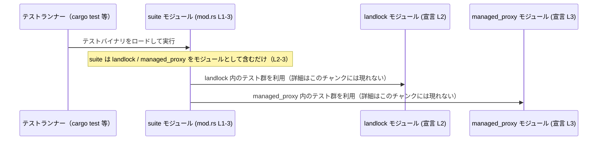

# linux-sandbox/tests/suite/mod.rs コード解説

## 0. ざっくり一言

`linux-sandbox/tests/suite/mod.rs` は、統合テストをサブモジュールとして束ねる「テストスイート用ルートモジュール」です（コメントより、統合テストをモジュールに集約していることが分かります。`linux-sandbox/tests/suite/mod.rs:L1-1`）。

---

## 1. このモジュールの役割

### 1.1 概要

- このモジュールは、かつて個別ファイルとして存在していた統合テストを、`landlock` および `managed_proxy` というサブモジュールとしてまとめる役割を持っています（`linux-sandbox/tests/suite/mod.rs:L1-3`）。
- 自身はテストロジックを実装せず、テスト本体を含むサブモジュールを宣言するだけのシンプルな構造です（`mod landlock;`、`mod managed_proxy;`。`linux-sandbox/tests/suite/mod.rs:L2-3`）。

### 1.2 アーキテクチャ内での位置づけ

このファイルは `tests/suite/` 配下にあり、Rust プロジェクトにおける「統合テスト群」の一部であることが位置づけとして読み取れます（パスとコメントより）。

テスト実行時の概念的な関係を示すと、次のようになります。



- `Runner` は `cargo test` などのテストランナーを表します（一般的な Rust のテストメカニズムに基づく説明です）。
- `Suite`（このファイル全体）は、`landlock` と `managed_proxy` モジュールを「テストスイート」としてまとめる役割だけを担います（`linux-sandbox/tests/suite/mod.rs:L1-3`）。
- `landlock` / `managed_proxy` の内部に実際のテスト関数が存在すると考えられますが、その中身はこのチャンクには現れません。

### 1.3 設計上のポイント

コードから読み取れる設計上の特徴は次のとおりです。

- **責務の分割**  
  - このファイルはサブモジュールの宣言のみを行い、テストの具体的な実装は各モジュールに委譲する構造になっています（`mod landlock;`、`mod managed_proxy;`。`linux-sandbox/tests/suite/mod.rs:L2-3`）。
- **状態・ロジックを持たない**  
  - 関数・型・定数の定義はなく、実行時に評価されるロジックも存在しません（`linux-sandbox/tests/suite/mod.rs:L1-3`）。
- **テストの集約**  
  - コメントより、「以前は個別ファイルだった統合テストを、モジュールとして集約している」ことが明示されています（`// Aggregates all former standalone integration tests as modules.` `linux-sandbox/tests/suite/mod.rs:L1-1`）。
- **安全性・エラーハンドリング・並行性**  
  - 実行時ロジックがないため、このファイル単体では所有権、エラー処理、並行性に関する特別な設計は登場しません。

---

## 2. 主要な機能一覧

このファイル自体に「処理を行う関数」はありませんが、テストスイートとして次の機能を提供します（いずれもモジュール宣言に基づく機能です）。

- `landlock` テストモジュールの集約: Landlock 関連の統合テストを含むサブモジュールをテストスイートに組み込む宣言（`linux-sandbox/tests/suite/mod.rs:L2-2`）。
- `managed_proxy` テストモジュールの集約: managed proxy 関連の統合テストを含むサブモジュールをテストスイートに組み込む宣言（`linux-sandbox/tests/suite/mod.rs:L3-3`）。

---

## 3. 公開 API と詳細解説

### 3.1 型一覧（構造体・列挙体など）

このファイルには構造体・列挙体などの型定義は存在しません（`linux-sandbox/tests/suite/mod.rs:L1-3`）。

#### 3.1.1 コンポーネント（モジュール）一覧

ユーザー指定の「コンポーネントインベントリー」に従い、このファイルで定義されるモジュールを整理します。

| 名前 | 種別 | 役割 / 用途 | 定義位置（根拠） |
|------|------|-------------|------------------|
| `suite` | モジュール | テストスイートのルートモジュール。このファイル全体として暗黙に定義され、統合テストをサブモジュールとして束ねます。 | `linux-sandbox/tests/suite/mod.rs:L1-3`（ファイルパスと Rust のモジュール規則による） |
| `landlock` | モジュール | 以前はスタンドアロンだった統合テストの一部を含むサブモジュールとして宣言されています。具体的なテスト内容はこのチャンクには現れません。 | `linux-sandbox/tests/suite/mod.rs:L2-2` |
| `managed_proxy` | モジュール | 同様に、統合テストの一部を含むと考えられるサブモジュールとして宣言されています。中身はこのチャンクには現れません。 | `linux-sandbox/tests/suite/mod.rs:L3-3` |

> 備考: `landlock` / `managed_proxy` の具体的なテスト関数・型は、このチャンクのコードには一切現れないため、本レポートでは「詳細不明」とします。

### 3.2 関数詳細（最大 7 件）

このファイルには関数定義が 1 つも存在しないため、詳細解説すべき関数はありません（`linux-sandbox/tests/suite/mod.rs:L1-3`）。

### 3.3 その他の関数

- 該当なし（このファイルに関数定義はありません）。

---

## 4. データフロー

### 4.1 概念的な処理シナリオ

このファイルが関与する典型的なシナリオは「統合テストの実行」です。  
Rust の一般的なテストメカニズムを前提とした概念図は次のとおりです（テスト関数自体はこのチャンクには存在しないため、あくまで高レベルな関係図です）。



要点:

- `suite` モジュールは「入り口」としてテストバイナリに読み込まれ、そこから `landlock` と `managed_proxy` モジュールのテストが利用されます。
- このファイル内にはデータ構造や関数が存在しないため、「データの加工・変換」といった意味でのデータフローはありません。
- 実際のテストロジックや入出力の詳細は `landlock` / `managed_proxy` 側にのみ存在し、このチャンクには現れません。

---

## 5. 使い方（How to Use）

### 5.1 基本的な使用方法

このモジュールの「使い方」は、主に **新しい統合テストモジュールの追加・削除** です。  
代表的な変更例として、新しいテストモジュール `new_feature` を追加する場合を示します。

```rust
// linux-sandbox/tests/suite/mod.rs

// 既存の統合テストモジュール
mod landlock;        // Landlock 関連のテストを集約（宣言のみ。中身は別ファイル）    // L2
mod managed_proxy;   // managed proxy 関連のテストを集約（宣言のみ）              // L3

// 新しく追加したい統合テストモジュール
mod new_feature;     // new_feature.rs または new_feature/mod.rs に定義されたテストを集約
```

- 併せて、同じディレクトリ配下に `new_feature` モジュールのソースファイル（通常は `new_feature.rs` または `new_feature/mod.rs` のいずれか）が必要になります。
- そのファイル内に `#[test]` 属性を付けたテスト関数を定義することで、`cargo test` 実行時にテストランナーから認識されるようになります（これは一般的な Rust のテストルールに基づく説明です）。

### 5.2 よくある使用パターン

- **テスト領域ごとにモジュールを分割する**  
  - 機能単位（例: Landlock、managed proxy）ごとに 1 モジュールを作成し、このファイルで `mod xxx;` と宣言するパターンです。
- **テストの整理・統合**  
  - 以前は `tests/landlock.rs` のようにファイル単位で存在していた統合テストを、`suite` モジュール配下の `landlock` などに整理し直す用途がコメントからうかがえます（`linux-sandbox/tests/suite/mod.rs:L1-1`）。

### 5.3 よくある間違い

Rust のモジュール規則とこのファイルの役割から、起こりそうな誤用例と正しい例を示します。

```rust
// 間違い例: 存在しないモジュールを宣言している
mod landlock;
mod managed_proxy;
mod new_feature;  // new_feature.rs / new_feature/mod.rs が存在しない場合、コンパイルエラーになる

// 正しい例: 対応するソースファイルを用意してからモジュール宣言する
mod landlock;
mod managed_proxy;
mod new_feature;  // tests/suite/new_feature.rs など、対応するファイルを追加した上で宣言する
```

- `mod new_feature;` に対応するソースファイルが存在しない場合、コンパイル時に「モジュールファイルが見つからない」といったエラーになります。
- これは Rust の一般的なモジュール解決ルールによるものであり、このファイルにも直接適用されます。

### 5.4 使用上の注意点（まとめ）

- **対応するファイルの存在が前提**  
  - `mod landlock;` / `mod managed_proxy;` は、それぞれに対応するソースファイルの存在を前提とします。ファイル名は通常 `landlock.rs` または `landlock/mod.rs` などですが、このチャンクからはどちらかまでは特定できません。
- **テストロジックは別ファイルに置く**  
  - このファイルにテストロジックを書いても構いませんが、現状はモジュール宣言専用の構造になっているため、テストはサブモジュール側にまとめる設計になっています（`linux-sandbox/tests/suite/mod.rs:L1-3`）。
- **安全性・並行性**  
  - 実行時コードがないため、このファイル自体から生じるメモリ安全性や並行実行に関するリスクはありません。

---

## 6. 変更の仕方（How to Modify）

### 6.1 新しい機能（テスト領域）を追加する場合

1. **新しいテストモジュール用ファイルを作成する**  
   - 例: `tests/suite/new_feature.rs`（または `tests/suite/new_feature/mod.rs`）。  
   - その中に `#[test]` 付きの関数を定義する（このチャンクには現れません）。
2. **`mod` 宣言を追加する**  
   - 本ファイルに `mod new_feature;` を追記します（`linux-sandbox/tests/suite/mod.rs`）。
3. **`cargo test` を実行して確認する**  
   - 新規モジュールが正しくコンパイル・テスト実行に組み込まれているか確認します。

### 6.2 既存の機能（テストモジュール）を変更する場合

- **モジュール名を変更したい場合**
  - `mod landlock;` を `mod landlock_v2;` のように変更する場合は、対応するソースファイル名も同様に変更する必要があります。
  - 変更後に、テストコードからの参照（例: `use crate::suite::landlock::*;` のようなものがある場合）も合わせて更新する必要があります。これらの参照はこのチャンクには現れないため、実際のコードベースで検索する必要があります。
- **モジュールを削除する場合**
  - 不要になったテストモジュールについては、`mod xxx;` 宣言を削除し、対応するソースファイルも削除します。
  - 誤って宣言だけを残したり、ファイルだけ残したりすると、コンパイルエラーや未使用コードが発生する可能性があります。

---

## 7. 関連ファイル

このモジュールと密接に関係するファイルは、`mod` 宣言が参照するサブモジュールのソースファイルです。

| パス（候補・種別） | 役割 / 関係 |
|--------------------|-------------|
| `landlock` モジュールのソースファイル（例: `tests/suite/landlock.rs` または `tests/suite/landlock/mod.rs`） | `mod landlock;`（`linux-sandbox/tests/suite/mod.rs:L2-2`）に対応するモジュール本体。Landlock 関連の統合テストが定義されていると考えられますが、具体的な内容はこのチャンクには現れません。 |
| `managed_proxy` モジュールのソースファイル（例: `tests/suite/managed_proxy.rs` または `tests/suite/managed_proxy/mod.rs`） | `mod managed_proxy;`（`linux-sandbox/tests/suite/mod.rs:L3-3`）に対応するモジュール本体。managed proxy 関連の統合テストが定義されていると考えられますが、こちらも内容はこのチャンクには現れません。 |

> 注: 上記の具体的なファイル名（`.rs` / `mod.rs`）は Rust の標準的なモジュール規則に基づく候補であり、このチャンクだけからは実際にどちらが使われているかは断定できません。

---

### Bugs / Security / Contracts / Edge Cases について

- **Bugs / Security**  
  - このファイルには実行時ロジックがないため、このファイル単体から直接生じるバグやセキュリティ上の問題は読み取れません（`linux-sandbox/tests/suite/mod.rs:L1-3`）。
- **Contracts（前提条件）**  
  - `mod xxx;` に対応するソースファイルが存在することが前提条件です。存在しない場合はコンパイルエラーになります。
- **Edge Cases**  
  - このファイルに関してエッジケースとなりうるのは、「宣言したモジュールに対応するファイルが存在しない」「ファイルはあるが `mod` 宣言を削除してしまった」といった構成上の不整合のみです。実行時の振る舞いに関するエッジケースは、このファイルからは読み取れません。

以上が、本チャンク（`linux-sandbox/tests/suite/mod.rs:L1-3`）から読み取れる範囲での、コンポーネント一覧・データフローを含む客観的な解説です。
