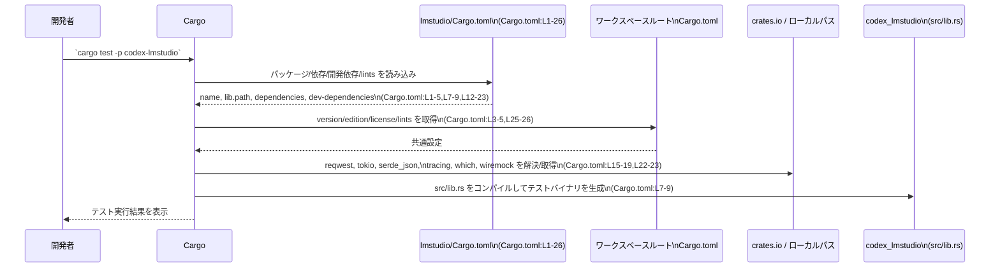

# lmstudio/Cargo.toml コード解説

## 0. ざっくり一言

このファイルは、`codex-lmstudio` パッケージの Cargo マニフェストであり、ライブラリクレート `codex_lmstudio` のエントリポイントと、依存クレート・開発時依存・ワークスペース共通設定（バージョン／edition／ライセンス／lints）を定義しています（`Cargo.toml:L1-5,L7-9,L12-23,L25-26`）。

---

## 1. このモジュールの役割

### 1.1 概要

- このファイルは **パッケージとライブラリのメタデータ** を定義します。
  - パッケージ名 `codex-lmstudio` を宣言し、バージョン・edition・ライセンスはワークスペースに委譲しています（`version.workspace`, `edition.workspace`, `license.workspace`）（`Cargo.toml:L1-5`）。
  - ライブラリクレート名 `codex_lmstudio` と、エントリポイント `src/lib.rs` を指定しています（`Cargo.toml:L7-9`）。
- また、実装で利用可能な外部クレート（HTTP クライアント、非同期ランタイム、JSON、ロギング、外部バイナリ探索）と、テスト用のモックライブラリ・ランタイムを宣言しています（`Cargo.toml:L12-23`）。
- lints はワークスペース共通設定を継承するよう構成されています（`Cargo.toml:L25-26`）。

### 1.2 アーキテクチャ内での位置づけ

このマニフェストから読み取れる範囲では、`codex_lmstudio` はワークスペース内ライブラリとして、コアロジックを持つとみられるローカルクレート `codex-core` と `codex-model-provider-info` に依存しつつ、HTTP/非同期処理やロギングなどの周辺機能を外部クレートに委ねる構成になっています（`Cargo.toml:L12-19`）。

以下の Mermaid 図は、このファイルに現れる依存関係のみを表したものです。

```mermaid
graph TD
    subgraph "codex-lmstudio ライブラリ (Cargo.toml:L1-9)"
        LM["codex_lmstudio\n(lib)"]
    end

    LM -->|ローカル依存| CORE["codex-core\n(path = ../core)\n(Cargo.toml:L13)"]
    LM -->|ローカル依存| MPI["codex-model-provider-info\n(path = ../model-provider-info)\n(Cargo.toml:L14)"]
    LM -->|HTTP/ストリーム| REQ["reqwest 0.12\nfeatures=[\"json\",\"stream\"]\n(Cargo.toml:L15)"]
    LM -->|JSON| SER["serde_json 1\n(Cargo.toml:L16)"]
    LM -->|非同期ランタイム| TOK["tokio 1\nfeatures=[\"rt\"]\n(Cargo.toml:L17)"]
    LM -->|ロギング| TR["tracing 0.1.44\nfeatures=[\"log\"]\n(Cargo.toml:L18)"]
    LM -->|外部バイナリ探索| WH["which 8.0\n(Cargo.toml:L19)"]

    subgraph "テスト専用依存 (Cargo.toml:L21-23)"
        WM["wiremock 0.6\n(Cargo.toml:L22)"]
        TOK_DEV["tokio 1\nfeatures=[\"full\"]\n(Cargo.toml:L23)"]
    end

    LM -.テスト時のみ.-> WM
    LM -.テスト時のみ.-> TOK_DEV
```

※ 図は **この Cargo.toml に書かれた依存関係のみ** を示しており、実際に各依存がどのように使われているかは `src/lib.rs` などの実装コードを確認する必要があります。

### 1.3 設計上のポイント

このファイルから読み取れる設計上の特徴は次のとおりです。

- **ライブラリクレートとしての提供**  
  `[lib]` セクションで `name = "codex_lmstudio"` と `path = "src/lib.rs"` を指定しており（`Cargo.toml:L7-9`）、バイナリ（`[[bin]]`）ではなくライブラリとして機能を提供する構成です。

- **ワークスペース共通設定の活用**  
  `version.workspace = true` / `edition.workspace = true` / `license.workspace = true` により（`Cargo.toml:L3-5`）、バージョン・edition・ライセンスはワークスペースのルート `Cargo.toml` に一元管理されています。  
  同様に lints も `workspace = true` で共通化されています（`Cargo.toml:L25-26`）。

- **ローカルクレートへの依存**  
  `codex-core` と `codex-model-provider-info` を `path` 依存で参照しており（`Cargo.toml:L13-14`）、このクレートはそれらの上に成り立つ高レベルな機能を持つ可能性があります。ただし、具体的な役割はこのチャンクからは分かりません。

- **非同期 HTTP + JSON を前提とした依存構成**  
  - HTTP クライアントとして `reqwest`（features: `"json"`, `"stream"`）（`Cargo.toml:L15`）  
  - 非同期ランタイムとして `tokio`（features: `"rt"`）（`Cargo.toml:L17`）  
  - JSON シリアライズ/デシリアライズとして `serde_json`（`Cargo.toml:L16`）  
  が依存として宣言されています。これにより、「非同期 HTTP + JSON」が実装の基本スタックになることが示唆されますが、実際の API 形態はこのチャンクには現れません。

- **ロギングと外部バイナリ探索の利用**  
  - 構造化ロギング用ライブラリ `tracing`（features: `"log"`）（`Cargo.toml:L18`）  
  - 実行可能ファイルの探索を行う `which`（`Cargo.toml:L19`）  
  が依存に含まれています。`which` の利用は、外部プログラムやツールの存在確認を行う可能性を示しますが、用途はこのチャンクからは特定できません。

- **本番コードとテストでの tokio 機能差**  
  - 通常依存の `tokio` は `features = ["rt"]`（`Cargo.toml:L17`）  
  - 開発依存（`[dev-dependencies]`）の `tokio` は `features = ["full"]`（`Cargo.toml:L23`）  
  となっており、テスト時にはより多機能な tokio 機能群に依存する構成であることがわかります。Cargo の仕様上、テストビルドではこれらの機能が合成されます。

---

## 2. 主要な機能一覧

このファイル自体は **設定ファイル** であり、実行時の関数やメソッドは定義していません。ここでは「このマニフェストによってどのような機能を持つクレートとして構成されているか」を、依存関係ベースで整理します。

- ライブラリクレート `codex_lmstudio` の定義（`[package]` と `[lib]`）（`Cargo.toml:L1-5,L7-9`）
- ローカルクレート `codex-core`・`codex-model-provider-info` に依存する高レベルライブラリとしての位置づけ（`Cargo.toml:L13-14`）
- 非同期 HTTP クライアントスタック（`reqwest` + `tokio` + `serde_json`）（`Cargo.toml:L15-17`）
- 構造化ロギング（`tracing`）（`Cargo.toml:L18`）
- 外部バイナリ探索（`which`）（`Cargo.toml:L19`）
- テストにおける HTTP モックと非同期ランタイム（`wiremock`, `tokio` full）（`Cargo.toml:L21-23`）
- ワークスペース一元管理のバージョン／edition／ライセンス／lints 設定（`Cargo.toml:L3-5,L25-26`）

### 2.1 コンポーネントインベントリー（このチャンクに現れる要素）

| コンポーネント | 種別 | 用途（このチャンクから分かる範囲） | 根拠 |
|----------------|------|--------------------------------------|------|
| `codex-lmstudio` | Cargo パッケージ | ワークスペース内の 1 パッケージとして定義されるライブラリ。version / edition / license はワークスペースに委譲。 | `Cargo.toml:L1-5` |
| `codex_lmstudio` | ライブラリクレート名 | 実装の公開 API が定義されるクレート名。エントリポイントは `src/lib.rs`。 | `Cargo.toml:L7-9` |
| `codex-core` | ローカル依存クレート | `../core` ディレクトリにあるクレートへのパス依存。役割はこのチャンクからは不明。 | `Cargo.toml:L13` |
| `codex-model-provider-info` | ローカル依存クレート | `../model-provider-info` ディレクトリにあるクレート。役割はこのチャンクからは不明。 | `Cargo.toml:L14` |
| `reqwest` | 依存クレート | HTTP クライアントライブラリ。JSON ハンドリングとストリーム機能を有効化。 | `Cargo.toml:L15` |
| `serde_json` | 依存クレート | JSON のシリアライズ／デシリアライズ機能を提供。 | `Cargo.toml:L16` |
| `tokio`（通常依存） | 依存クレート | 非同期ランタイム。`rt` 機能のみ有効化されており、本番コードから利用可能。 | `Cargo.toml:L17` |
| `tracing` | 依存クレート | 構造化ロギング／トレースのためのクレート。`log` 機能を有効化。 | `Cargo.toml:L18` |
| `which` | 依存クレート | PATH 上から実行可能ファイルを探索するユーティリティ。 | `Cargo.toml:L19` |
| `wiremock` | 開発依存クレート | HTTP 通信をモックするためのテスト用ライブラリ。 | `Cargo.toml:L22` |
| `tokio`（dev-dependency） | 開発依存クレート | テスト／例などで利用される tokio。`full` 機能を有効化。 | `Cargo.toml:L23` |
| ワークスペース lints | 設定 | lints をワークスペース共通設定から継承。警告方針などはワークスペース側に定義。 | `Cargo.toml:L25-26` |

---

## 3. 公開 API と詳細解説

### 3.1 型一覧（構造体・列挙体など）

このファイルには **Rust の型定義（構造体・列挙体など）は一切含まれていません**。  
ただし、「公開 API を提供する単位」としての **ライブラリクレート** を 1 つ定義しています。

| 名前 | 種別 | 役割 / 用途 | 根拠 |
|------|------|------------|------|
| `codex_lmstudio` | ライブラリクレート | このクレートの公開 API（関数・構造体など）は `src/lib.rs` に定義される。内容はこのチャンクには現れない。 | `Cargo.toml:L7-9` |

> このチャンクには `src/lib.rs` の内容が含まれていないため、**公開 API の関数や型の詳細は不明** です。「公開APIとコアロジック」の具体的な説明は、`src/lib.rs` などの実装ファイルを参照する必要があります。

### 3.2 関数詳細（最大 7 件）

このファイルは Cargo の設定ファイルであり、**関数・メソッド・非同期タスクなどの実装は一切含みません**。  
したがって、本セクションで説明できる「関数」はありません。

- `codex_lmstudio` クレートがどのような関数や非同期 API を公開しているかは、`src/lib.rs` やその配下のソースコードを別途確認する必要があります（`Cargo.toml:L7-9`）。

### 3.3 その他の関数

- このチャンクには **ヘルパー関数・ラッパー関数を含むいかなる関数定義も存在しません**。  
  したがって、列挙可能な「その他の関数」もありません。

---

## 4. データフロー

このファイルには実行時ロジックがないため、「ランタイムでのデータフロー」は読み取れません。ここでは **ビルド時に Cargo がこのファイルをどのように利用するか** という観点で、データ（設定情報）の流れを説明します。

### 4.1 Cargo によるビルド時のフロー

概要：

1. 開発者が `cargo build` や `cargo test -p codex-lmstudio` などを実行する。
2. Cargo は `lmstudio/Cargo.toml` を読み込んで、パッケージメタデータ・依存関係・開発依存・lints 設定を取得する（`Cargo.toml:L1-5,L7-9,L12-23,L25-26`）。
3. ワークスペースルートの `Cargo.toml` から、共通の `version` / `edition` / `license` / `lints` 設定を取得する（`Cargo.toml:L3-5,L25-26`）。
4. 指定された依存クレートを crates.io やローカルパスから取得し、`src/lib.rs` をエントリポイントとしてライブラリをビルドする（`Cargo.toml:L7-9,L12-19`）。
5. テスト時には `[dev-dependencies]` のクレートも含めてビルドし、テストコードを実行する（`Cargo.toml:L21-23`）。

#### シーケンス図



> この図は「Cargo がどのようにマニフェスト情報を取り扱うか」を示したものであり、`codex_lmstudio` クレート内部での処理フロー（例えば HTTP リクエスト → レスポンス処理など）は、このチャンクからは不明です。

---

## 5. 使い方（How to Use）

### 5.1 基本的な使用方法

このファイルで定義された `codex_lmstudio` クレートを別のクレートから利用する典型的な流れは次のとおりです。

1. ワークスペースの別パッケージから `codex-lmstudio` を依存として追加する。
2. Rust コード内で `codex_lmstudio` クレートを `use` して公開 API を呼び出す。

#### 依存として追加する例（別パッケージ側 Cargo.toml）

```toml
[dependencies]
codex-lmstudio = { path = "lmstudio" }  # lmstudio ディレクトリへの相対パス
```

#### コード側からクレートを参照する例

```rust
// codex-lmstudio クレートをスコープに持ち込む                         // lmstudio/Cargo.toml の [lib] name に対応
use codex_lmstudio;                                                      // Cargo.toml:L7-9

fn main() {                                                              // エントリポイント
    // 実際の公開 API（関数や型）は src/lib.rs に定義されており、       // このチャンクには API の詳細はない
    // ここでは具体的な関数名などは特定できません。                   // 実装側を確認する必要がある
    //
    // 例: codex_lmstudio::...() といった形で呼び出すことが想定されますが、
    //     関数名や引数はこのチャンクからは不明です。
}
```

> 公開 API の関数名・型情報がこのチャンクにないため、**コンパイル可能な具体例を示すことはできません**。利用時には `src/lib.rs` のドキュメントやコードを確認する必要があります。

### 5.2 よくある使用パターン

- このチャンクには公開 API が現れていないため、`codex_lmstudio` の「よくある呼び出しパターン」（例: `client.stream_completion(...)` のような形）は不明です。
- ただし、依存関係（`reqwest`, `tokio`, `serde_json`, `tracing`）から、
  - 非同期コンテキスト（`tokio` ランタイム）で
  - HTTP + JSON ベースの処理
  - ロギング（`tracing`）
  を行う API が含まれている可能性が高いことは推測できますが、**このチャンクだけでは断定できません**。

### 5.3 よくある間違い

このマニフェストに関連して起こりうる誤用例とその修正例を示します。

#### 依存を追加せずにクレートを使おうとする

```rust
// 間違い例：Cargo.toml に codex-lmstudio を追加せずにクレートを参照している

use codex_lmstudio;  // error[E0432]: unresolved import `codex_lmstudio`

fn main() {}
```

```toml
# 別パッケージ側 Cargo.toml
[dependencies]
# codex-lmstudio のエントリがない
```

**正しい例：Cargo.toml に依存を追加する**

```toml
# 別パッケージ側 Cargo.toml
[dependencies]
codex-lmstudio = { path = "lmstudio" }  # lmstudio ディレクトリを指す依存を追加
```

```rust
use codex_lmstudio;  // Cargo が依存を解決できるため正常にコンパイルされる

fn main() {}
```

### 5.4 使用上の注意点（まとめ）

このチャンクから読み取れる範囲での注意点は次のとおりです。

- **非同期ランタイム前提の可能性**  
  - `tokio` と `reqwest` に依存しているため（`Cargo.toml:L15,L17`）、`codex_lmstudio` の公開 API に `async fn` が含まれる可能性があります。  
  - その場合、利用側は `tokio` ランタイム（例: `#[tokio::main]`）上で API を呼び出す必要があります。  
  - 実際に非同期 API が存在するか、存在するならどのような契約（引数・戻り値・エラー型）かは、このチャンクには現れません。

- **HTTP・外部バイナリに伴うセキュリティ配慮**  
  - HTTP 通信（`reqwest`）と外部バイナリ探索（`which`）の依存から、このクレートがネットワークや外部ツールと連携する可能性があります（`Cargo.toml:L15,L19`）。  
  - 実装側では、TLS 検証、入力検証、実行可能ファイルパスの安全性などを考慮する必要がありますが、それらが実際にどう扱われているかは、このチャンクでは不明です。

- **ワークスペース共通設定への依存**  
  - version / edition / license / lints がワークスペース側に依存しているため（`Cargo.toml:L3-5,L25-26`）、単体でこのパッケージだけを切り出してビルドすることは想定されていません。  
  - ワークスペース外でビルドしようとすると、これらの設定が見つからず問題になる可能性があります。

---

## 6. 変更の仕方（How to Modify）

### 6.1 新しい機能を追加する場合（依存の追加など）

**例：新たな外部ライブラリを利用する機能を実装する場合**

1. **依存クレートを追加する**
   - 新しい機能で必要なクレートを `[dependencies]` に追加します。
   - 例として、追加するクレート `foo` がある場合：

   ```toml
   [dependencies]
   codex-core = { path = "../core" }                  # 既存
   codex-model-provider-info = { path = "../model-provider-info" }
   reqwest = { version = "0.12", features = ["json", "stream"] }
   serde_json = "1"
   tokio = { version = "1", features = ["rt"] }
   tracing = { version = "0.1.44", features = ["log"] }
   which = "8.0"
   foo = "0.1"                                       # 新規依存
   ```

   （既存の依存は `Cargo.toml:L12-19` 参照）

2. **必要に応じて dev-dependencies にも追加する**
   - テストでのみ必要なクレートは `[dev-dependencies]` に追加します（`Cargo.toml:L21-23` を参照）。

3. **ワークスペースとの整合性を保つ**
   - 可能であれば **バージョン方針をワークスペース全体で揃える** ことが推奨されますが、このチャンクからワークスペース全体のポリシーまでは分かりません。

### 6.2 既存の機能を変更する場合（依存や設定の更新）

**依存バージョンや機能を変更する際のポイント**

- **HTTP スタックの更新（例：`reqwest` のバージョン変更）**  
  - `reqwest` の `version` フィールドを更新します（`Cargo.toml:L15`）。  
  - バージョンアップに伴う API 変更の影響は `src/lib.rs` などの実装側で確認する必要があります。

- **tokio 機能セットの調整**  
  - 本番コードでより多くの tokio 機能が必要になった場合、`[dependencies]` の `tokio` features を変更します（`Cargo.toml:L17`）。  
  - 既に `[dev-dependencies]` では `features = ["full"]` が指定されているため（`Cargo.toml:L23`）、本番側の機能を増やすとテストと本番の差異が小さくなりますが、その分依存が重くなる可能性があります。

- **ワークスペース共通設定の変更**  
  - `version.workspace = true` などの設定を変更して個別バージョンを持たせることも可能ですが（`Cargo.toml:L3-5`）、ワークスペース全体の整合性が崩れる可能性があります。  
  - このチャンクだけではワークスペース全体の方針が分からないため、変更前にワークスペースルートを確認する必要があります。

- **Contracts / Edge Cases の観点**  
  - このファイル単体からは、「どの API がどの前提条件を持つか」といった契約（Contracts）やエッジケースは読み取れません。  
  - ただし、`reqwest` や `tokio` を利用する API では、一般的に「非同期コンテキストであること」「ブロッキング I/O を行わないこと」「HTTP エラーを Result で返すこと」などが重要な契約となる傾向があります。これらの詳細は実装コード側で確認する必要があります。

---

## 7. 関連ファイル

この Cargo マニフェストと強く関連するファイル・ディレクトリを整理します。

| パス | 役割 / 関係 | 根拠 |
|------|-------------|------|
| `lmstudio/src/lib.rs` | `codex_lmstudio` ライブラリクレートのエントリポイント。公開 API とコアロジックが定義されると考えられる。 | `path = "src/lib.rs"`（`Cargo.toml:L7-9`） |
| `core/`（`../core`） | ローカルクレート `codex-core` のディレクトリ。具体的な役割はこのチャンクからは不明。 | `codex-core = { path = "../core" }`（`Cargo.toml:L13`） |
| `model-provider-info/`（`../model-provider-info`） | ローカルクレート `codex-model-provider-info` のディレクトリ。具体的な役割はこのチャンクからは不明。 | `codex-model-provider-info = { path = "../model-provider-info" }`（`Cargo.toml:L14`） |
| ワークスペースルート `Cargo.toml` | `version.workspace`, `edition.workspace`, `license.workspace`, `lints.workspace` などの共通設定を定義している。 | `Cargo.toml:L3-5,L25-26` |
| `tests/`（存在する場合） | `wiremock` と `tokio`（full）を利用したテストコードが置かれる可能性があるが、このチャンクには具体的なファイル情報はない。 | dev-dependencies `wiremock`, `tokio`（`Cargo.toml:L21-23`） |

---

### Bugs / Security / Tests / 性能・並行性に関する補足（このチャンクからわかる範囲）

- **Bugs / Security**  
  - このファイル単体から特定のバグや既知の脆弱性の有無は判断できません。  
  - ただし、HTTP 通信と外部バイナリ探索を行う可能性があるため（`Cargo.toml:L15,L19`）、実装側では入力検証・TLS 設定・外部コマンドパスの検証などのセキュリティ対策が重要になります。

- **Contracts / Edge Cases**  
  - API レベルの契約やエッジケースは、このチャンクには現れません。  
  - Cargo レベルでは、ワークスペース設定が存在しない環境でこのパッケージ単独をビルドしようとすると設定不足になる可能性がある点がエッジケースといえます（`Cargo.toml:L3-5,L25-26`）。

- **Tests**  
  - `wiremock` と `tokio`（full）の dev-dependency から、HTTP 通信と非同期処理を含むテストが書かれている可能性が高いですが（`Cargo.toml:L21-23`）、具体的なテスト内容やカバレッジはこのチャンクからは分かりません。

- **Performance / Scalability / 並行性**  
  - 非同期ランタイムとして `tokio` を利用しているため（`Cargo.toml:L17,L23`）、並行性は tokio のタスクモデルに依存します。  
  - パフォーマンスやスケーラビリティ上の特性（例: 同時接続数、スループット）は、`src/lib.rs` 側の設計と `reqwest` / `tokio` の使い方次第であり、このチャンクからは評価できません。

以上が、この `lmstudio/Cargo.toml` に基づいて客観的に説明できる内容です。実際の公開 API とコアロジックの詳細は、`src/lib.rs` および依存クレート `../core`, `../model-provider-info` のコードを読む必要があります。
