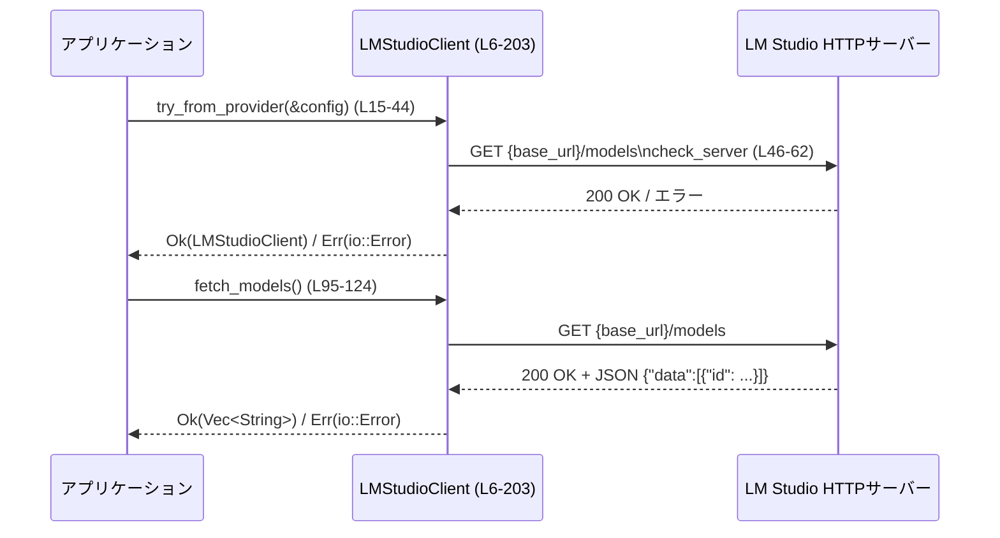

# lmstudio/src/client.rs コード解説

## 0. ざっくり一言

LM Studio のローカルサーバーと `lms` CLI に対して、  
モデル一覧取得・モデルロード・モデルダウンロードを行う非同期クライアント `LMStudioClient` を提供するモジュールです（`lmstudio/src/client.rs:L6-10`）。

---

## 1. このモジュールの役割

### 1.1 概要

- このモジュールは **LM Studio（ローカル LLM サーバー）との連携** を行うために存在し、次の機能を提供します。
  - `codex_core::config::Config` に定義されたプロバイダ情報から `LMStudioClient` を構築し、サーバーの疎通確認を行う（`try_from_provider`、`check_server`）。  
    根拠: `lmstudio/src/client.rs:L15-44, L46-62`
  - HTTP 経由で利用可能なモデル一覧を取得する（`fetch_models`）。  
    根拠: `lmstudio/src/client.rs:L95-124`
  - HTTP 経由でモデルロード（ウォームアップ）リクエストを送信する（`load_model`）。  
    根拠: `lmstudio/src/client.rs:L64-92`
  - `lms` CLI を検出し、外部プロセスとして起動してモデルをダウンロードする（`find_lms(_with_home_dir)`, `download_model`）。  
    根拠: `lmstudio/src/client.rs:L126-166, L168-190`

### 1.2 アーキテクチャ内での位置づけ

アプリケーション、設定、LM Studio サーバー、`lms` CLI との関係は次のようになります。

```mermaid
graph TD
    App["呼び出し側アプリケーション"]
    Config["Config\n(codex_core::config::Config)\n※別ファイル / このチャンクには現れない"]
    ProviderInfo["LMSTUDIO_OSS_PROVIDER_ID\n(codex_model_provider_info)\n※別クレート / このチャンクには現れない"]
    Client["LMStudioClient\n(lmstudio/src/client.rs:L6-203)"]
    Server["LM Studio HTTP サーバー\n(/models, /responses)"]
    LmsCli["lms CLI コマンド"]

    App -->|設定を読み込む| Config
    Config -->|model_providers から取得\n(L15-24)| Client
    ProviderInfo -->|ID 定数参照\n(L18, L22)| Client
    Client -->|GET /models で疎通確認\ncheck_server(L46-62)| Server
    Client -->|GET /models\nfetch_models(L95-124)| Server
    Client -->|POST /responses\nload_model(L64-92)| Server
    Client -->|"lms get --yes MODEL"\ndownload_model(L168-190)| LmsCli
```

- `Config` や `LMSTUDIO_OSS_PROVIDER_ID` の具体的定義場所は、このチャンクには現れません。名前空間から別クレート／別モジュールであることのみが分かります。

### 1.3 設計上のポイント

- **責務の分割**
  - HTTP 通信はすべて `reqwest::Client` に集約し、`LMStudioClient` がそれをラップします（`L7-9, L32-35`）。
  - `lms` CLI 検出と起動は `find_lms(_with_home_dir)` と `download_model` に分離されています（`L126-166, L168-190`）。
- **状態管理**
  - `LMStudioClient` は `reqwest::Client` と `base_url` のみを保持し、メソッドはすべて `&self` を受け取る読み取り専用です（`L7-9, L46, L65, L95, L168`）。
  - 可変状態や内部キャッシュは持たず、スレッド間で共有してもデータ競合を起こすような可変フィールドはありません（このファイル内の範囲）。
- **エラーハンドリング**
  - パブリックな非同期メソッドはすべて `std::io::Result<T>` を返します（`try_from_provider`, `load_model`, `fetch_models`, `download_model`: `L15, L65, L95, L168`）。
  - 設定やレスポンスフォーマットの不備には `io::ErrorKind::NotFound` / `InvalidData` を使い、HTTP エラーや I/O エラーは `io::Error::other` で文字列メッセージに変換しています（`L20-28, L54-60, L81, L102, L106-112, L119-123, L161-164, L177-185`）。
- **並行性・非同期**
  - HTTP 操作は `async fn` と `.await` を用いた非同期実行になっています（`L15, L41, L46-48, L65-81, L95-102, L168-179`）。
  - 外部プロセス呼び出し（`std::process::Command`）は同期的ですが、`download_model` 自体は `async fn` として宣言されており、`await` 中にスレッドをブロックします（`L168-179`）。  

---

## 2. 主要な機能一覧

> 各行末の「根拠」は定義位置を示します。

- LM Studio プロバイダ設定からクライアントを構築し、サーバーの疎通確認を行う: `try_from_provider`（`lmstudio/src/client.rs:L15-44`）
- LM Studio サーバーの `/models` エンドポイントに HTTP GET して疎通確認を行う: `check_server`（`lmstudio/src/client.rs:L46-62`）
- モデルを空入力・`max_output_tokens=1` で呼び出してロードする: `load_model`（`lmstudio/src/client.rs:L64-92`）
- 利用可能なモデル一覧（モデル ID の `Vec<String>`）を取得する: `fetch_models`（`lmstudio/src/client.rs:L95-124`）
- `lms` 実行ファイルを PATH とホームディレクトリ配下から探索する: `find_lms`, `find_lms_with_home_dir`（`lmstudio/src/client.rs:L126-166`）
- `lms get --yes <model>` を実行してモデルをダウンロードする: `download_model`（`lmstudio/src/client.rs:L168-190`）
- テスト専用に生ホスト URL から `LMStudioClient` を組み立てる: `from_host_root`（`lmstudio/src/client.rs:L192-203`）

---

## 3. 公開 API と詳細解説

### 3.1 型一覧（構造体・列挙体など）

| 名前             | 種別   | 役割 / 用途                                                                 | 定義位置 |
|------------------|--------|-------------------------------------------------------------------------------|----------|
| `LMStudioClient` | 構造体 | LM Studio HTTP サーバーおよび `lms` CLI に対するクライアント。`reqwest::Client` と `base_url` を保持する。 | `lmstudio/src/client.rs:L6-10` |

- `#[derive(Clone)]` によりクライアントインスタンスを安価に複製できます（`L6`）。  
  - これにより、非同期タスクごとにクライアントをクローンして再利用する設計になっていると解釈できます。

### 3.2 関数詳細（主要 7 件）

#### `LMStudioClient::try_from_provider(config: &Config) -> std::io::Result<Self>`

**概要**

- 設定 `Config` から LM Studio 用プロバイダ設定を取得し、`LMStudioClient` を構築した上でサーバー疎通確認を行います（`L15-44`）。

**引数**

| 引数名   | 型                      | 説明                                                                 |
|----------|-------------------------|------------------------------------------------------------------------|
| `config` | `&Config`               | `model_providers` を含む設定オブジェクト（`codex_core::config::Config`。このチャンクには定義が現れません）。 |

**戻り値**

- `Ok(LMStudioClient)`  
  - `base_url` および `reqwest::Client` を持ち、LM Studio サーバーに接続可能なクライアント。
- `Err(std::io::Error)`  
  - プロバイダ設定が存在しない、`base_url` が設定されていない、あるいはサーバー疎通に失敗した場合。

**内部処理の流れ**

1. `config.model_providers.get(LMSTUDIO_OSS_PROVIDER_ID)` でビルトイン LM Studio プロバイダを取得し、存在しなければ `NotFound` エラー（`L16-24`）。
2. プロバイダの `base_url` を取り出し、`None` の場合は `InvalidData` エラーを返す（`L25-30`）。
3. `reqwest::Client::builder().connect_timeout(5秒).build()` で HTTP クライアントを構築し、構築に失敗した場合はデフォルトの `Client::new()` にフォールバック（`L32-35`）。
4. `LMStudioClient { client, base_url: base_url.to_string() }` でインスタンス生成（`L37-40`）。
5. 生成したインスタンスで `check_server().await?` を呼び出し、疎通確認に失敗した場合はその `io::Error` を呼び出し元に伝播（`L41`）。
6. 問題なければ `Ok(client)` を返す（`L43`）。

**Examples（使用例）**

LM Studio 用プロバイダが `Config` に定義されている前提で、クライアントを構築する例です。

```rust
use std::io;                                        // io::Result を使うため
use codex_core::config::Config;                     // Config 型（定義は別モジュール）

async fn init_client(config: &Config) -> io::Result<LMStudioClient> {
    // Config から LMStudioClient を構築し、サーバー疎通確認も行う
    let client = LMStudioClient::try_from_provider(config).await?; 
    Ok(client)                                       // 成功時はクライアントを返す
}
```

**Errors / Panics**

- `Err(io::ErrorKind::NotFound)`  
  - `model_providers` に `LMSTUDIO_OSS_PROVIDER_ID` が存在しない場合（`L16-24`）。
- `Err(io::ErrorKind::InvalidData)`  
  - プロバイダの `base_url` が `None` の場合（`L25-30`）。
- `Err(io::ErrorKind::Other)`  
  - `check_server()` が失敗した場合（ネットワークエラーや HTTP ステータスエラー）。`check_server` の項参照。
- **panic の可能性**  
  - この関数内では `unwrap` は使用しておらず、`unwrap_or_else` でビルダーエラーを吸収しているため、コード上は panic しません（`L32-35`）。

**Edge cases（エッジケース）**

- `base_url` が空文字列 (`Some("")`) の場合でも、エラーにはならずそのまま使用します（`L25-30, L37-40`）。
- サーバーが起動していない場合やポートが異なる場合は `check_server` が失敗し、`io::ErrorKind::Other` として返ります（`L41`）。

**使用上の注意点**

- `async fn` であるため、Tokio 等の非同期ランタイム上で `.await` して呼び出す必要があります（`L15`）。
- `Config` 側で `LMSTUDIO_OSS_PROVIDER_ID` および `base_url` を正しく設定しておくことが前提です（`L16-30`）。
- ネットワークが不安定な環境では `check_server` の時点で失敗し得るため、呼び出し側でリトライ戦略を持つ設計も考えられます（`L41, L46-62`）。

---

#### `LMStudioClient::check_server(&self) -> io::Result<()>`

**概要**

- LM Studio サーバーが応答可能かどうかを、`GET {base_url}/models` で確認する内部メソッドです（`L46-62`）。

**引数**

| 引数名 | 型              | 説明                                  |
|--------|-----------------|---------------------------------------|
| `&self` | `&LMStudioClient` | クライアントインスタンス。`base_url` と HTTP クライアントを利用する。 |

**戻り値**

- `Ok(())`  
  - `/models` への HTTP リクエストが成功し、ステータスコードが 2xx の場合。
- `Err(std::io::Error)`  
  - リクエスト送信エラー、または非 2xx ステータスコードの場合。

**内部処理の流れ**

1. `base_url` の末尾の `/` を削除し、`{base_url}/models` を URL として組み立てる（`L47`）。
2. `self.client.get(&url).send().await` で HTTP リクエストを送り、`Result` として受け取る（`L48`）。
3. `if let Ok(resp) = response` で送信自体の成功/失敗を分岐（`L50`）。
   - 送信成功時:
     - `resp.status().is_success()` で 2xx を判定し、成功なら `Ok(())`（`L51-52`）。
     - それ以外は `"Server returned error: {status} {LMSTUDIO_CONNECTION_ERROR}"` というメッセージで `io::Error::other` を返す（`L54-57`）。
   - 送信失敗時:
     - `LMSTUDIO_CONNECTION_ERROR` メッセージのみで `io::Error::other` を返す（`L59-60`）。

**Examples（使用例）**

テストでは `from_host_root` と組み合わせて疎通確認の動作を検証しています。

```rust
// テスト用にモックサーバーの URL からクライアントを作成（L192-203）
let client = LMStudioClient::from_host_root(server.uri());   // &str -> String 変換して base_url に設定
// /models が 200 を返す場合に Ok(()) になることを確認（L312-323）
client.check_server().await.expect("server check should pass");
```

**Errors / Panics**

- `Err(io::ErrorKind::Other)` が返る主な条件:
  - DNS 失敗、接続タイムアウトなどで `send().await` 自体が `Err` になる場合（`L48-50, L59-60`）。
  - サーバーが 4xx/5xx など非 2xx ステータスを返す場合（`L51-58`）。
- panic はこの関数内にはありません。

**Edge cases（エッジケース）**

- `base_url` が末尾 `/` で終わっていても `trim_end_matches('/')` により URL が二重スラッシュになりません（`L47`）。
- サーバーが HTTP ではなく TLS を要求しているなど、プロトコル不一致の場合も `send().await` 側のエラーとして `Other` になります。

**使用上の注意点**

- 外部とのネットワーク接続の有無に依存するため、テストでは `codex_core::spawn::CODEX_SANDBOX_NETWORK_DISABLED_ENV_VAR` を見てスキップする実装になっています（`L211-219, L303-310, L327-334`）。
- エラーメッセージにはユーザー向けのインストール案内文言が含まれます（`LMSTUDIO_CONNECTION_ERROR`, `L12, L55, L60`）。

---

#### `LMStudioClient::load_model(&self, model: &str) -> io::Result<()>`

**概要**

- 指定したモデルを LM Studio サーバー側でロードするために、空入力・最大出力トークン 1 のリクエストを `/responses` に送信します（`L64-92`）。

**引数**

| 引数名 | 型       | 説明                   |
|--------|----------|------------------------|
| `&self` | `&LMStudioClient` | HTTP クライアントおよび `base_url` を利用する。 |
| `model` | `&str`   | ロードしたいモデルの ID（例: `"openai/gpt-oss-20b"`）。 |

**戻り値**

- `Ok(())`  
  - HTTP ステータスコードが 2xx の場合。
- `Err(std::io::Error)`  
  - リクエスト送信エラーまたは非 2xx ステータスの場合。

**内部処理の流れ**

1. `base_url` の末尾 `/` を取り除き、`{base_url}/responses` を URL として生成（`L66`）。
2. JSON ボディとして `{ "model": model, "input": "", "max_output_tokens": 1 }` を作成（`L68-72`）。
3. `POST` リクエストを送り、`Content-Type: application/json` ヘッダと JSON ボディを設定（`L74-80`）。
4. `send().await` のエラーは `"Request failed: {e}"` の文字列で `io::Error::other` に変換（`L81`）。
5. レスポンスのステータスコードが `is_success()` なら `tracing::info!` でログを出し `Ok(())`（`L83-85`）。
6. それ以外は `"Failed to load model: {status}"` で `io::Error::other` を返す（`L87-90`）。

**Examples（使用例）**

```rust
use std::io;

async fn ensure_model_loaded(client: &LMStudioClient, model: &str) -> io::Result<()> {
    // モデルをロード（ウォームアップ）。成功すると info ログが出る（L83-85）
    client.load_model(model).await?; 
    Ok(())
}
```

**Errors / Panics**

- HTTP 送信に失敗した場合:  
  - `Err(io::ErrorKind::Other)` で `"Request failed: {e}"` というエラーメッセージ（`L81`）。
- サーバーが非 2xx を返した場合:  
  - `Err(io::ErrorKind::Other)` で `"Failed to load model: {status}"`（`L87-90`）。
- panic はありません。

**Edge cases（エッジケース）**

- 存在しない `model` を指定した場合:  
  - サーバー実装に依存しますが、この関数側では非 2xx ステータスとしてエラーにします（`L83-90`）。
- 入力は常に空文字列 `""` で固定のため、サーバー側で「起動だけ行う」用途に使われます（`L68-71`）。

**使用上の注意点**

- `load_model` はモデルをロードするだけで、レスポンス内容は利用していません（`L83-86`）。エラーメッセージもステータスコードのみです。
- モデル名はそのままログメッセージに含まれるため、機密情報をモデル ID として使う場合はログ出力ポリシーに注意が必要です（`L84`）。

---

#### `LMStudioClient::fetch_models(&self) -> io::Result<Vec<String>>`

**概要**

- LM Studio サーバー上で利用可能なモデル一覧を `/models` エンドポイントから取得し、`Vec<String>` として返します（`L95-124`）。

**引数**

| 引数名 | 型       | 説明 |
|--------|----------|------|
| `&self` | `&LMStudioClient` | `base_url` と HTTP クライアントを使用する。 |

**戻り値**

- `Ok(Vec<String>)`  
  - 各要素は `data` 配列内のオブジェクトの `id` フィールド値（`String`）です（`L108-116`）。
- `Err(std::io::Error)`  
  - HTTP 送信エラー、非 2xx ステータスコード、JSON パース失敗、`data` 配列が存在しない場合。

**内部処理の流れ**

1. `base_url` から `{base_url}/models` を生成（`L96`）。
2. `GET` リクエストを送り、送信エラーは `"Request failed: {e}"` で `io::Error::other` に変換（`L97-102`）。
3. ステータスコードが `is_success()` の場合のみ JSON を読み出す。それ以外は `"Failed to fetch models: {status}"` でエラー（`L104, L118-122`）。
4. `response.json().await` で JSON をパースし、失敗した場合は `InvalidData` エラー `"JSON parse error: {e}"`（`L105-107`）。
5. `json["data"].as_array()` から配列を取得し、存在しなければ `InvalidData` エラー `"No 'data' array in response"`（`L108-112`）。
6. `data` 配列の各要素から `["id"]` を `as_str()` で取り出し、`Some(&str)` のものだけを `String` 化して収集（`L113-116`）。

**Examples（使用例）**

```rust
use std::io;

async fn list_models(client: &LMStudioClient) -> io::Result<()> {
    let models = client.fetch_models().await?;          // モデル ID 一覧を取得（L95-124）
    for id in &models {
        println!("available model: {}", id);           // 各モデル ID を表示
    }
    Ok(())
}
```

**テストでの確認**

- 正常系: モックサーバーが `{"data":[{"id":"openai/gpt-oss-20b"}]}` を返すとき、`Vec` にその ID が含まれることをテスト（`L211-241`）。
- `data` 配列がない場合: `"No 'data' array in response"` を含むエラーになることをテスト（`L243-272`）。
- HTTP 500 の場合: `"Failed to fetch models: 500"` を含むエラーになることをテスト（`L274-299`）。

**Errors / Panics**

- `Err(io::ErrorKind::Other)`:
  - リクエスト送信エラー `"Request failed: {e}"`（`L97-102`）。
  - 非 2xx ステータス `"Failed to fetch models: {status}"`（`L118-122`）。
- `Err(io::ErrorKind::InvalidData)`:
  - JSON パースエラー `"JSON parse error: {e}"`（`L105-107`）。
  - `data` 配列が存在しない場合 `"No 'data' array in response"`（`L108-112`）。
- panic はありません。

**Edge cases（エッジケース）**

- `data` 配列内の要素で `id` フィールドが欠けているものは `filter_map` により無視されます（`L113-115`）。
- `data` が空配列の場合、空 `Vec<String>` が返ります（`L108-117`）。

**使用上の注意点**

- エラーメッセージ文字列に依存したテストが存在するので、文言を変更する場合はテストの修正が必要です（`L265-271, L291-299`）。
- 返却値は単にモデル ID の文字列一覧であり、メタ情報（説明やサイズなど）は含まれません。

---

#### `LMStudioClient::download_model(&self, model: &str) -> std::io::Result<()>`

**概要**

- `lms` CLI を利用して指定モデルをダウンロードするために、`lms get --yes <model>` コマンドを実行します（`L168-190`）。

**引数**

| 引数名 | 型       | 説明                          |
|--------|----------|-------------------------------|
| `&self` | `&LMStudioClient` | クライアントインスタンス（HTTP は使わず CLI のみ）。 |
| `model` | `&str`   | ダウンロードしたいモデルの ID。 |

**戻り値**

- `Ok(())`  
  - `lms get --yes <model>` プロセスが正常終了ステータスを返した場合。
- `Err(std::io::Error)`  
  - `lms` が見つからない、プロセス起動に失敗、または終了ステータスが失敗の場合。

**内部処理の流れ**

1. `Self::find_lms()?` で `lms` 実行ファイルのパスを取得（`L169`）。
2. `eprintln!("Downloading model: {model}")` で標準エラーに進捗を出力（`L170`）。
3. `std::process::Command::new(&lms)` でコマンドを生成し、`args(["get", "--yes", model])` を設定（`L172-173`）。
4. `stdout` は親プロセスから継承し、`stderr` は破棄（`Stdio::inherit()`, `Stdio::null()`: `L174-175`）。
5. `.status()` でプロセスを同期的に実行し、起動失敗時は `"Failed to execute '{lms} get --yes {model}': {e}"` として `io::Error::other`（`L176-179`）。
6. プロセスの終了コードが成功でなければ `"Model download failed with exit code: {code}"` でエラー（`L181-185`）。
7. 成功時は `tracing::info!` でログを出し、`Ok(())`（`L188-189`）。

**Examples（使用例）**

```rust
use std::io;

async fn download_if_needed(client: &LMStudioClient, model: &str) -> io::Result<()> {
    // モデルを lms CLI でダウンロードする（L168-190）
    client.download_model(model).await?;                  
    Ok(())
}
```

**Errors / Panics**

- `find_lms()` が `Err(NotFound)` を返した場合、そのまま伝播します（`L169, L127-129, L158-165`）。
- コマンド起動に失敗した場合:
  - `"Failed to execute '...'` メッセージで `io::ErrorKind::Other`（`L176-179`）。
- 終了コードが非 0 の場合:
  - `"Model download failed with exit code: {code}"` で `io::ErrorKind::Other`（`L181-185`）。
- panic はありません。

**Edge cases（エッジケース）**

- `status.code()` が `None` の場合（シグナル終了など）は `unwrap_or(-1)` により `-1` として出力されます（`L183-185`）。
- `stderr` が `Stdio::null()` に設定されているため、`lms` 側のエラーメッセージはコンソールに表示されません（`L175`）。

**使用上の注意点**

- 関数自体は `async` ですが、中で `std::process::Command::status()` を同期呼び出ししているため、その間は実行スレッドをブロックします（`L172-177`）。  
  非同期ランタイム上で大量に並列実行するとスレッド枯渇の可能性があります。
- `lms` が見つからない場合のエラーメッセージは `"LM Studio not found. Please install LM Studio from https://lmstudio.ai/"` です（`L161-164`）。この文言に依存したテストもあります（`L355-366`）。

---

#### `LMStudioClient::find_lms_with_home_dir(home_dir: Option<&str>) -> std::io::Result<String>`

**概要**

- `lms` 実行ファイルのパスを、PATH とホームディレクトリ配下のデフォルト位置から探索する内部ヘルパー関数です（`L131-166`）。

**引数**

| 引数名   | 型               | 説明 |
|----------|------------------|------|
| `home_dir` | `Option<&str>` | `Some` の場合はホームディレクトリとして扱うパス。テスト用にモックパスを指定可能（`L138-140`）。`None` の場合は環境変数 `HOME`（Unix）または `USERPROFILE`（Windows）から取得（`L141-149`）。 |

**戻り値**

- `Ok(String)`  
  - 見つかった `lms` 実行ファイルのパス。PATH 上で見つかった場合は `"lms"` 固定、それ以外はホームディレクトリ配下のフルパス。
- `Err(std::io::Error)`  
  - PATH とホームディレクトリ配下の両方で `lms` が見つからない場合。

**内部処理の流れ**

1. まず `which::which("lms")` を試し、成功すれば `"lms".to_string()` を返す（`L132-135`）。
2. 失敗した場合、`home_dir` 引数が `Some` ならそれを使用し、`None` なら OS ごとのホームディレクトリ環境変数から取得（`L138-149`）。
3. Unix の場合 `"{home}/.lmstudio/bin/lms"`, Windows の場合 `"{home}/.lmstudio/bin/lms.exe"` を `fallback_path` とする（`L152-156`）。
4. `Path::new(&fallback_path).exists()` で存在確認し、存在すればそのパスを返す（`L158-160`）。
5. どこにも存在しない場合は `NotFound` エラー `"LM Studio not found. Please install LM Studio from https://lmstudio.ai/"` を返す（`L161-164`）。

**Examples（使用例）**

テストではホームディレクトリをモックして、環境変数に依存しない形で動作を確認しています（`L369-387`）。

```rust
#[test]
fn test_find_lms_with_mock_home() {
    // Unix の場合の例（L372-378）
    #[cfg(unix)]
    {
        let result = LMStudioClient::find_lms_with_home_dir(Some("/test/home"));
        if let Err(e) = result {
            assert!(e.to_string().contains("LM Studio not found"));
        }
    }
}
```

**Errors / Panics**

- `Err(io::ErrorKind::NotFound)`:
  - PATH 上にもホームディレクトリ配下にも `lms` が存在しない場合（`L132-135, L158-165`）。
- 環境変数 `HOME` / `USERPROFILE` の取得に失敗した場合は `unwrap_or_default()` で空文字列となりますが、それ自体はエラーにはなりません（`L143, L147`）。
- panic はありません。

**Edge cases（エッジケース）**

- `home_dir` が `Some("")` の場合、`fallback_path` は `"/.lmstudio/bin/lms"` のようなパスになり、存在確認のみが行われます（`L138-140, L152-156`）。
- Unix / Windows 以外のターゲットに対するフォールバックは、このファイルには記述がなく、その場合の挙動は不明です（`#[cfg(unix)]`, `#[cfg(windows)]` のみが存在: `L141-149, L152-156`）。  

**使用上の注意点**

- エラーメッセージ `"LM Studio not found. Please install LM Studio from https://lmstudio.ai/"` に依存したテストがあります（`L355-366`）。
- 実際に `lms` がインストールされていても、PATH やホームディレクトリが特殊な構成だと検出に失敗することがあります。

---

#### `LMStudioClient::from_host_root(host_root: impl Into<String>) -> Self`（テスト用）

**概要**

- 主にテストで使用する低レベルコンストラクタで、生のホストルート URL を直接指定して `LMStudioClient` を生成します（`L192-203`）。

**属性**

- `#[cfg(test)]` により、テストビルド時のみコンパイルされます（`L193`）。

**引数**

| 引数名     | 型                  | 説明 |
|------------|---------------------|------|
| `host_root` | `impl Into<String>` | `base_url` に設定する生のホストルート（例: `"http://localhost:1234"`）。 |

**戻り値**

- 疎通確認や設定検証を行わずに生成された `LMStudioClient`。

**内部処理の流れ**

1. `reqwest::Client::builder().connect_timeout(5秒).build()` を試し、失敗した場合は `Client::new()` にフォールバック（`L195-198`）。
2. `Self { client, base_url: host_root.into() }` でインスタンス生成（`L199-202`）。

**Examples（使用例）**

テストでの使用例（`L211-241`）:

```rust
let server = wiremock::MockServer::start().await;     // モック HTTP サーバー起動（別クレート）
let client = LMStudioClient::from_host_root(server.uri()); // モックサーバーの URI を base_url に設定
let models = client.fetch_models().await.expect("fetch models");
```

**Errors / Panics**

- 戻り値は `Self` であり `Result` ではないため、エラーは発生しません。
- `reqwest::Client` のビルダーエラーは `unwrap_or_else` で吸収されます（`L195-198`）。

**使用上の注意点**

- 本来はテスト用ですが、`cfg(test)` を外すことで本番でも利用可能なコンストラクタになります。その場合、`try_from_provider` と異なり `check_server` を実行しない点に注意が必要です。

---

#### `LMStudioClient::load_model`, `fetch_models`, `download_model` の並行性・安全性に関する共通点

- いずれも `&self` を受け取り、内部で `self` の状態を変更しません（`L65, L95, L168`）。
- Rust の所有権・借用ルール上、共有参照 `&self` から可変状態を操作していないため、このファイルの範囲ではデータ競合の原因となる共有可変状態は存在しません。
- ただし `download_model` 内の `std::process::Command::status()` はブロッキングであり、非同期タスクのスケジューリングに影響し得ます（`L172-177`）。

---

### 3.3 その他の関数

| 関数名                           | 役割（1 行）                                                                                   | 定義位置 |
|----------------------------------|------------------------------------------------------------------------------------------------|----------|
| `LMStudioClient::find_lms()`     | `which::which("lms")` を呼び出し、`find_lms_with_home_dir(None)` を通じて `lms` のパスを取得する薄いラッパー。 | `lmstudio/src/client.rs:L127-129` |

---

## 4. データフロー

ここでは代表的なシナリオとして、「設定からクライアントを構築し、モデル一覧を取得する」流れを説明します。

### 処理の要点

1. アプリケーションは `Config` を読み込み、`LMStudioClient::try_from_provider` でクライアントを生成します（`L15-44`）。
2. その過程で `check_server` により `/models` エンドポイントの疎通確認が行われます（`L46-62`）。
3. 生成されたクライアントで `fetch_models` を呼び出すと、再度 `/models` へ HTTP GET を送り、JSON をパースして `Vec<String>` を返します（`L95-124`）。

### シーケンス図



- `try_from_provider` 内部で `check_server` が必ず呼ばれるため、クライアント生成時点で最低一度はサーバー疎通確認が行われる設計になっています（`L41`）。

---

## 5. 使い方（How to Use）

### 5.1 基本的な使用方法

LM Studio サーバーがローカルで起動している前提で、クライアントの初期化からモデル一覧取得・モデルロード・ダウンロードまでの流れの例です。

```rust
use std::io;                                              // io::Result を使う
use codex_core::config::Config;                           // Config 型（定義は別モジュール）

async fn example_flow(config: &Config) -> io::Result<()> {
    // 1. Config から LMStudioClient を初期化（サーバー疎通チェック付き）(L15-44)
    let client = LMStudioClient::try_from_provider(config).await?;

    // 2. 利用可能なモデル一覧を取得 (L95-124)
    let models = client.fetch_models().await?;
    println!("available models: {:?}", models);

    // 3. 先頭のモデルをロード（ウォームアップ）(L64-92)
    if let Some(first) = models.first() {
        client.load_model(first).await?;
    }

    // 4. 必要に応じて lms CLI でモデルをダウンロード (L168-190)
    if let Some(first) = models.first() {
        client.download_model(first).await?;
    }

    Ok(())
}
```

### 5.2 よくある使用パターン

1. **クライアントのクローンを複数タスクで共有**

```rust
use std::io;

async fn fetch_in_parallel(client: &LMStudioClient) -> io::Result<()> {
    let c1 = client.clone();                               // Clone 派生（L6）
    let c2 = client.clone();

    // 非同期タスクを 2 つ起動してそれぞれで fetch_models を呼ぶ例
    let h1 = tokio::spawn(async move { c1.fetch_models().await });
    let h2 = tokio::spawn(async move { c2.fetch_models().await });

    let (r1, r2) = tokio::join!(h1, h2);                   // 並列に待機
    let _ = r1??;                                          // Result<Result<..>> を二重に ? で展開
    let _ = r2??;

    Ok(())
}
```

- `LMStudioClient` 自体は `Clone` であり、メソッドは `&self` なので、共有して並列に使いやすい構造になっています（`L6-9, L95`）。

1. **テスト環境でのモックサーバー利用**

- `from_host_root` を用いて、モックサーバーの URL を `base_url` に設定するパターンがテストで使われています（`L211-241`）。

### 5.3 よくある間違い

```rust
// 間違い例: 非同期コンテキスト外で .await しようとしている
// fn bad_usage(config: &Config) {
//     let client = LMStudioClient::try_from_provider(config).await.unwrap(); // コンパイルエラー
// }

// 正しい例: async fn 内で .await する
async fn good_usage(config: &Config) -> std::io::Result<()> {
    let client = LMStudioClient::try_from_provider(config).await?; // OK (L15-44)
    let models = client.fetch_models().await?;                     // OK (L95-124)
    println!("{:?}", models);
    Ok(())
}
```

```rust
// 間違い例: エラーを無視してしまう
async fn ignore_errors(client: &LMStudioClient) {
    let _ = client.fetch_models().await;           // 結果を無視してしまい、失敗に気づけない
}

// 正しい例: Result を扱う
async fn handle_errors(client: &LMStudioClient) {
    match client.fetch_models().await {
        Ok(models) => println!("models: {:?}", models),
        Err(e) => eprintln!("failed to fetch models: {e}"),
    }
}
```

### 5.4 使用上の注意点（まとめ）

- **非同期ランタイム前提**
  - 主要メソッドは `async fn` であり、Tokio 等のランタイム上で `.await` して利用する必要があります（`L15, L65, L95, L168`）。
- **エラー型の統一**
  - すべて `std::io::Result` に揃えられており、HTTP エラーや JSON パースエラーも `io::ErrorKind::Other` / `InvalidData` にまとめられています（`L81, L102, L105-112, L119-123, L161-164, L177-185`）。
- **外部プロセスのブロッキング**
  - `download_model` は内部で同期的な `std::process::Command::status()` を呼び出すため、大きなモデルをダウンロードする間はスレッドをブロックします（`L172-177`）。
- **テストとの契約**
  - エラーメッセージの文言（例: `"No 'data' array in response"`, `"Failed to fetch models: 500"`, `"LM Studio not found"` 等）に依存したテストが複数存在します（`L265-271, L291-299, L355-366`）。文言変更時はテスト更新が必要です。
- **観測性（ログ）**
  - `load_model` と `download_model` は成功時に `tracing::info!` でログ出力します（`L84, L188`）。
  - ダウンロード開始時には `eprintln!` で進捗が表示されますが、`lms` の `stderr` は破棄される点に注意してください（`L170, L175`）。

---

## 6. 変更の仕方（How to Modify）

### 6.1 新しい機能を追加する場合

1. **新しい LM Studio エンドポイントへの HTTP 呼び出しを追加したい場合**

   - 追加場所: `impl LMStudioClient` ブロック内（`L14-204`）。
   - 参考にすべき関数:
     - URL の組み立て: `check_server`（`L47`）、`fetch_models`（`L96`）、`load_model`（`L66`）。
     - エラー処理・ログ: `load_model`（`L81-90`）、`fetch_models`（`L102-123`）。
   - 手順:
     1. `base_url.trim_end_matches('/')` からパス付き URL を作る。
     2. `reqwest::Client` を使って HTTP リクエストを送る。
     3. `.await` の I/O エラーを `io::Error::other` などに変換。
     4. ステータスコード判定と JSON パースを行い、`io::Result` で返却。

2. **`lms` CLI に新しいサブコマンドを追加したい場合**

   - 追加場所: `download_model` 付近（`L168-190`）。
   - 再利用すべき関数: `find_lms` / `find_lms_with_home_dir`（`L127-166`）。
   - 手順:
     1. `let lms = Self::find_lms()?;` でコマンドパスを取得。
     2. `Command::new(&lms).args([...])` でサブコマンドと引数を設定。
     3. `stdout`/`stderr` の扱いを設計に合わせて選択（現在は `inherit`/`null`）。
     4. 終了コードをチェックし、`io::Error::other` で失敗を返す。

### 6.2 既存の機能を変更する場合

- **エラーメッセージの変更**

  - 影響範囲:
    - `fetch_models` の `"No 'data' array in response"` に依存するテスト（`L243-272, L265-271`）。
    - `"Failed to fetch models: 500"` に依存するテスト（`L274-299, L291-299`）。
    - `"LM Studio not found"` に依存するテスト（`L355-366`）。
    - `"Server returned error: 404"` に依存するテスト（`L326-351`）。
  - 文言変更時は、対応するテストの `contains(...)` 部分も更新する必要があります。

- **JSON 形式の取り扱い変更**

  - 現状、`fetch_models` は `data` 配列と各要素の `id` フィールドの存在を前提としています（`L108-116`）。
  - 別のフィールド名を使いたい場合や、構造を変えたい場合は、この部分と関連テスト `test_fetch_models_*`（`L211-299`）を同時に修正する必要があります。

- **`check_server` の判定条件変更**

  - 現在は単純に `status().is_success()` で 2xx のみを成功として扱います（`L51`）。
  - 例えば 3xx リダイレクトも成功とみなしたい場合は、この条件を変更することになりますが、`test_check_server_*`（`L302-351`）の期待値も確認する必要があります。

- **ターゲットプラットフォームの拡張**

  - `find_lms_with_home_dir` は Unix と Windows のみを意識した `#[cfg]` 付き実装になっています（`L141-149, L152-156`）。
  - 他のターゲット（例: WASM）で利用したい場合は、`cfg` 属性を見直すか、ターゲットごとに別実装を用意する必要があります。

---

## 7. 関連ファイル

| パス / シンボル                                    | 役割 / 関係 |
|----------------------------------------------------|-------------|
| `codex_core::config::Config`                      | LM Studio プロバイダ情報（`model_providers` と `base_url`）を提供する設定型。定義場所のパスはこのチャンクには現れませんが、`try_from_provider` で利用されています（`L15-30`）。 |
| `codex_model_provider_info::LMSTUDIO_OSS_PROVIDER_ID` | LM Studio 用のビルトインプロバイダ ID 定数。`Config` 内の `model_providers` からプロバイダを取り出すキーとして利用（`L18, L22`）。 |
| `codex_core::spawn::CODEX_SANDBOX_NETWORK_DISABLED_ENV_VAR` | ネットワーク関連テストをスキップするための環境変数名。テストコードで参照されます（`L213-217, L245-249, L276-280, L304-308, L328-332`）。 |
| `wiremock`（クレート）                            | HTTP サーバーをモックするために利用。`fetch_models` や `check_server` のテストで使用（`L221-236, L253-261, L284-289, L312-317, L336-341`）。 |
| `tokio`（クレート）                               | 非同期テストランタイム。`#[tokio::test]` で `async fn` テストを実行（`L211, L243, L275, L302, L326`）。 |
| `lms` CLI（外部コマンド）                         | モデルダウンロードに使用される LM Studio のコマンドラインツール。`find_lms(_with_home_dir)` および `download_model` から起動されます（`L127-166, L168-190`）。 |

このチャンクには他の Rust ファイルは現れませんが、上記の外部型・定数・クレートと連携して `LMStudioClient` の機能が構成されています。
