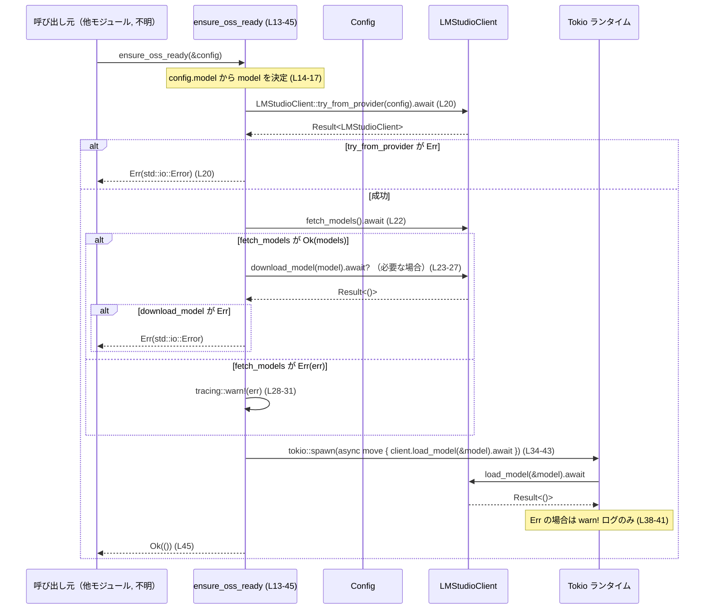

# lmstudio/src/lib.rs

## 0. ざっくり一言

LM Studio のローカル OSS モデル環境を初期化するためのヘルパ関数と、LMStudioClient 型の再エクスポートを提供するモジュールです（`ensure_oss_ready` がコアロジック）。  
（根拠: `lmstudio/src/lib.rs:L1-7,13-45`）

---

## 1. このモジュールの役割

### 1.1 概要

- このモジュールは、`--oss` オプション使用時に LM Studio のローカル環境を準備する役割を持ちます。  
  （根拠: ドキュメントコメント `lmstudio/src/lib.rs:L9-12`）
- 具体的には、LM Studio サーバへ接続できるか確認し、対象モデルがローカルに存在しなければダウンロードし、その後モデルのロードをバックグラウンドで開始します。  
  （根拠: `ensure_oss_ready` 本体 `lmstudio/src/lib.rs:L13-43`）

### 1.2 アーキテクチャ内での位置づけ

- 上位レイヤ（CLI やサービス層など）は設定 `Config` を用意し、このモジュールの `ensure_oss_ready` を呼び出して LM Studio 側の準備を行う想定です（呼び出し元はこのチャンクには現れません）。
- 実際の LM Studio との通信やモデルのダウンロード／ロードは、内部モジュール `client` にある `LMStudioClient` が担当します。  
  （根拠: `mod client;` と `pub use client::LMStudioClient;` `lmstudio/src/lib.rs:L1-3`）
- 設定値は外部クレート `codex_core::config::Config` に依存します。  
  （根拠: `use codex_core::config::Config;` `lmstudio/src/lib.rs:L4`）
- 非同期処理には Tokio ランタイム、ログ出力には `tracing` が利用されています。  
  （根拠: `tokio::spawn` と `tracing::warn!` の使用 `lmstudio/src/lib.rs:L34-43,28-31`）

Mermaid による簡易依存関係図です（このファイルのコード範囲のみを対象）:

```mermaid
graph TD
  Caller["呼び出し元（他モジュール／CLI 等, 不明）"]
  Ensure["ensure_oss_ready (L13-45)"]
  Client["LMStudioClient（client モジュール, 詳細不明）"]
  Tokio["Tokio ランタイム"]
  ConfigType["Config（codex_core::config）"]

  Caller -->|Config を渡す| Ensure
  ConfigType --> Ensure
  Ensure -->|try_from_provider| Client
  Ensure -->|fetch_models / download_model| Client
  Ensure -->|spawn(非同期タスク)| Tokio
  Tokio -->|load_model 実行| Client
```

### 1.3 設計上のポイント

- 単一の公開関数 `ensure_oss_ready` が、モデル選択・存在確認・ダウンロード・ロード開始までを一括でオーケストレーションする構造です。  
  （根拠: `lmstudio/src/lib.rs:L13-43`）
- モデル名は設定値 `config.model` が優先され、未指定の場合はデフォルト定数 `DEFAULT_OSS_MODEL` が使われます。  
  （根拠: マッチ式 `lmstudio/src/lib.rs:L14-17` と定数定義 `L6-7`）
- LM Studio への接続確立 (`try_from_provider`) とモデルのダウンロード (`download_model`) に失敗した場合は `std::io::Result` を通じてエラーが伝播しますが、モデル一覧取得 (`fetch_models`) の失敗は警告ログを出すだけで非致命扱いにしている点が特徴です。  
  （根拠: `?` の利用 `L20,25` と `match` の Err 分岐 `L22-31`）
- モデルのロード (`load_model`) は `tokio::spawn` でバックグラウンドタスクとして実行し、この関数の戻り値には含めない設計です。  
  （根拠: `tokio::spawn` と内部 `async move` `lmstudio/src/lib.rs:L34-43`）

---

## 2. 主要な機能一覧

- LMStudioClient の再エクスポート: 他モジュールから `crate::lmstudio::LMStudioClient` として利用できるようにする。
- `DEFAULT_OSS_MODEL` 定数: `--oss` 指定でモデル名未指定の場合に利用するデフォルトの OSS モデル名を定義。
- `ensure_oss_ready`: LM Studio ローカルサーバへの接続確認、モデル存在確認と必要に応じたダウンロード、モデルロードのバックグラウンド実行を行う。

### 2.1 コンポーネントインベントリー

このチャンクで確認できる主要コンポーネントの一覧です。

| 名前 | 種別 | 役割 / 用途 | 定義・出現位置 |
|------|------|-------------|----------------|
| `client` | 内部モジュール | LMStudioClient の実装を含むモジュール（このチャンクには中身は現れない） | `lmstudio/src/lib.rs:L1-1` |
| `LMStudioClient` | 型（詳細不明, 再エクスポート） | LM Studio サーバとの通信クライアント。`try_from_provider` / `fetch_models` / `download_model` / `load_model` などを提供していると推測されるが、このチャンクには定義がない。 | 再エクスポート宣言: `lmstudio/src/lib.rs:L3-3` |
| `Config` | 外部構造体 | アプリケーション設定。ここでは `config.model` を通じてモデル名指定に利用。定義は `codex_core::config` 側にあり、このチャンクには現れない。 | 利用箇所: `lmstudio/src/lib.rs:L4,13-17` |
| `DEFAULT_OSS_MODEL` | 定数 `&'static str` | `--oss` 指定かつモデル名未指定時に使用するデフォルトモデル名 `"openai/gpt-oss-20b"` を保持。 | 定義: `lmstudio/src/lib.rs:L6-7` |
| `ensure_oss_ready` | 非同期関数 | LM Studio クライアントの初期化、モデル存在チェックとダウンロード、モデルロードのバックグラウンド実行を行う公開 API。 | 定義: `lmstudio/src/lib.rs:L9-45` |

---

## 3. 公開 API と詳細解説

### 3.1 型一覧（構造体・列挙体など）

このモジュール自身は新しい構造体や列挙体を定義していませんが、公開・使用している型を整理します。

| 名前 | 種別 | 役割 / 用途 | 定義元 / 根拠 |
|------|------|-------------|----------------|
| `LMStudioClient` | 型（クライアント型, 詳細不明） | LM Studio サーバとの通信を担当。`try_from_provider`, `fetch_models`, `download_model`, `load_model` メソッドがこのチャンクから確認できる。 | 再エクスポート: `pub use client::LMStudioClient;`（`lmstudio/src/lib.rs:L3-3`） |
| `Config` | 構造体（外部） | 設定値を保持する型。ここでは `config.model` フィールドからモデル名を取得している。 | `use codex_core::config::Config;` と `config.model` の利用（`lmstudio/src/lib.rs:L4,14`） |

※ `LMStudioClient` と `Config` の内部フィールドや詳細な API は、このチャンクには現れません。

### 3.2 関数詳細

#### `ensure_oss_ready(config: &Config) -> std::io::Result<()>`

**概要**

- `--oss` モード用に LM Studio のローカル環境を準備する非同期関数です。  
  （根拠: ドキュメントコメント `lmstudio/src/lib.rs:L9-12`）
- モデル名の決定 → LMStudioClient の初期化 → モデル一覧取得と必要ならダウンロード → モデルロードのバックグラウンド実行、という流れで処理します。  
  （根拠: 本文 `lmstudio/src/lib.rs:L14-43`）

**シグネチャと非同期性**

```rust
pub async fn ensure_oss_ready(config: &Config) -> std::io::Result<()>
```

- `async fn` なので、呼び出し側は `.await` する必要があります。
- 戻り値は `std::io::Result<()>` で、I/O 的な失敗（LMStudioClient の初期化やダウンロード失敗など）をエラーとして返します。  
  （根拠: シグネチャ `lmstudio/src/lib.rs:L13`）

**引数**

| 引数名 | 型 | 説明 |
|--------|----|------|
| `config` | `&Config` | アプリケーション全体の設定。ここでは `config.model` からモデル名（任意）を取得します。（根拠: `lmstudio/src/lib.rs:L13-17`） |

**戻り値**

- `Ok(())`  
  - LM Studio への接続確立と、必要ならモデルのダウンロードまでが成功したことを意味します。  
    （根拠: `LMStudioClient::try_from_provider` と `download_model` に対する `?` と、最後の `Ok(())` `lmstudio/src/lib.rs:L20,25,45`）
  - モデルの「ロード完了」までは保証しません。ロード処理はバックグラウンドで行われ、完了や失敗はこの戻り値には反映されません。  
    （根拠: `tokio::spawn` による非同期タスク生成 `lmstudio/src/lib.rs:L34-43`）
- `Err(std::io::Error)`  
  - LMStudioClient 初期化 (`try_from_provider`) やモデルダウンロード (`download_model`) が失敗した場合に返されます。  
    （根拠: `?` 演算子の使用 `lmstudio/src/lib.rs:L20,25`）

**内部処理の流れ（アルゴリズム）**

1. **モデル名の決定**  
   - `config.model.as_ref()` をマッチして、`Some(model)` ならそのモデル名、`None` なら `DEFAULT_OSS_MODEL` を選びます。  
     （根拠: `lmstudio/src/lib.rs:L14-17`）

2. **LMStudioClient の生成（接続確認）**  
   - `LMStudioClient::try_from_provider(config).await?` を呼び出し、設定に基づいて LM Studio サーバに接続可能なクライアントを生成します。  
   - ここで失敗した場合は `Err` で早期リターンします。  
     （根拠: `lmstudio/src/lib.rs:L20`）

3. **モデル一覧の取得とダウンロード判定**  
   - `lmstudio_client.fetch_models().await` を実行し、結果を `match` で分岐します。  
     （根拠: `lmstudio/src/lib.rs:L22`）
   - `Ok(models)` の場合:  
     - `models.iter().any(|m| m == model)` で、目的の `model` が一覧に含まれるか確認します。  
     - 含まれない場合は `lmstudio_client.download_model(model).await?` を実行し、モデルをダウンロードします。ここでのエラーは `?` により呼び出し元へ伝播します。  
       （根拠: `lmstudio/src/lib.rs:L23-27`）
   - `Err(err)` の場合:  
     - モデル一覧取得の失敗は致命的エラーとはせず、`tracing::warn!` で警告ログを出すだけで処理を継続します。  
       （根拠: `lmstudio/src/lib.rs:L28-31`）

4. **モデルロードのバックグラウンド実行**  
   - コメント `// Load the model in the background` の通り、モデルロードは非同期タスクとしてバックグラウンドで実行します。  
     （根拠: `lmstudio/src/lib.rs:L34`）
   - `tokio::spawn` の中で、`lmstudio_client.clone()` と `model.to_string()` をキャプチャし、`client.load_model(&model).await` を呼び出します。  
     （根拠: `lmstudio/src/lib.rs:L35-42`）
   - `load_model` が失敗した場合は `tracing::warn!` で警告ログを出すのみで、呼び出し元にはエラーを返しません。  
     （根拠: `if let Err(e) = client.load_model(&model).await { tracing::warn!(...) }` `lmstudio/src/lib.rs:L38-41`）

5. **正常終了**  
   - バックグラウンドタスクをスケジュールした後、`Ok(())` を返して関数を終了します。  
     （根拠: `lmstudio/src/lib.rs:L45`）

簡易フローチャート:

```mermaid
flowchart TD
  A["ensure_oss_ready (L13-45)"] --> B["config.model 取得 (L14-17)"]
  B --> C["LMStudioClient::try_from_provider (L20)"]
  C -->|Err| E["Err(std::io::Error) で早期終了"]
  C -->|Ok client| D["fetch_models (L22-27)"]

  D -->|Ok(models)| F{"models に model があるか (L24)"}
  F -->|Yes| G["ダウンロード不要 (スキップ)"]
  F -->|No| H["download_model(model) (L25)"]
  H -->|Err| E

  D -->|Err(err)| I["warn! ログのみ (L28-31)"]

  G --> J["tokio::spawn で load_model 実行 (L34-43)"]
  H --> J
  I --> J

  J --> K["Ok(()) を返す (L45)"]
```

**Examples（使用例）**

以下は Tokio ランタイム上で `ensure_oss_ready` を呼び出す最小限の例です。  
`Config` の生成方法はこのチャンクからは分からないため、コメントで省略しています。

```rust
use codex_core::config::Config;                 // Config 型をインポート（lmstudio/src/lib.rs:L4 と同じ）
use lmstudio::ensure_oss_ready;                // このモジュールの関数を利用
use lmstudio::LMStudioClient;                  // 必要ならクライアント型も使用可能（再エクスポート, L3）

#[tokio::main]                                  // Tokio ランタイムを起動
async fn main() -> std::io::Result<()> {
    // アプリケーション設定を読み込む（詳細は codex_core 側の実装次第）
    let mut config: Config = /* 設定読み込み処理 */;

    // 明示的にモデル名を指定したい場合は config.model を設定する（型は Option<...> と推測される）
    // ここでは "openai/gpt-oss-20b" を指定する例（DEFAULT_OSS_MODEL と同じ）
    // config.model = Some("openai/gpt-oss-20b".to_string());

    // LM Studio の OSS 環境を準備する
    ensure_oss_ready(&config).await?;          // 失敗時は std::io::Error として伝播

    // 以降で LMStudioClient を使って推論リクエストなどを行う想定
    Ok(())
}
```

**Errors / Panics**

- `Result::Err` になる主な条件（コードから読み取れる範囲）:
  - `LMStudioClient::try_from_provider(config).await` が失敗した場合。  
    （根拠: `?` による伝播 `lmstudio/src/lib.rs:L20`）
  - `lmstudio_client.download_model(model).await` が失敗した場合。  
    （根拠: `?` による伝播 `lmstudio/src/lib.rs:L25`）
- `fetch_models` や `load_model` のエラーは `Result` に含まれず、ログ出力のみにとどまります。  
  （根拠: `match` の Err 分岐 `lmstudio/src/lib.rs:L22-31` と `if let Err(e) = client.load_model(...)` `L38-41`）
- パニックを明示的に発生させるコード（`panic!` など）はこのチャンクにはありません。

**Edge cases（エッジケース）**

コードから分かる代表的なケース:

- `config.model` が `None` の場合  
  - `model` には `DEFAULT_OSS_MODEL` が設定されます。  
    （根拠: `None => DEFAULT_OSS_MODEL` `lmstudio/src/lib.rs:L16`）
- `config.model` が `Some` だが LM Studio のモデル一覧に存在しない場合  
  - `fetch_models` が成功し、`any(|m| m == model)` が `false` の場合、`download_model(model)` が呼ばれます。  
    （根拠: `if !models.iter().any(|m| m == model) { download_model ... }` `lmstudio/src/lib.rs:L23-26`）
- `fetch_models` 自体が失敗する場合  
  - 警告ログを出力しつつ、そのままモデルロードのバックグラウンドタスクへ進みます。  
    - モデルが実際には存在しない場合でも `load_model` が呼ばれ、そこで失敗して警告ログが出る可能性があります。  
    （根拠: Err 分岐で `warn!` のみ `lmstudio/src/lib.rs:L28-31` および後続の `tokio::spawn` `L34-43`）
- `tokio::spawn` によるモデルロードタスクが失敗する場合  
  - `load_model` が `Err` を返すと、そのエラーは `tracing::warn!` のログとしてのみ観測され、呼び出し元には伝わりません。  
    （根拠: `if let Err(e) = client.load_model(&model).await { tracing::warn!(...) }` `lmstudio/src/lib.rs:L38-41`）

**使用上の注意点**

- **非同期コンテキスト必須**  
  - `async fn` であり内部で `.await` を行うため、Tokio などの非同期ランタイム上から呼び出す必要があります。
- **モデルロード完了の保証はしない**  
  - `ensure_oss_ready` が `Ok(())` を返しても、モデルロードはまだ進行中である可能性があります（`tokio::spawn` でバックグラウンド実行のため）。  
  - モデルロード完了を待ちたい場合は、別の同期メカニズムが必要ですが、このチャンクからは提供されていません。
- **`fetch_models` 失敗時の挙動**  
  - モデル一覧取得に失敗しても処理は続行されるため、「存在確認とダウンロード」の保証はそのケースでは弱くなります。  
    （ドキュメントコメントには「Checks if the model exists locally and downloads it if missing」とありますが、`fetch_models` 失敗時にはチェックできません。`lmstudio/src/lib.rs:L9-12,22-31`）
- **複数回呼び出し時の負荷**  
  - `ensure_oss_ready` を何度も呼ぶと、その都度 `fetch_models` と必要に応じた `download_model`、さらに `load_model` タスクの `tokio::spawn` が走ります。  
  - 同じモデルに対しての繰り返し呼び出しでは、冗長なロードタスクが増える可能性があります（ただし `load_model` の実際の挙動は不明）。
- **ログ出力の扱い**  
  - 失敗時の情報は `tracing::warn!` でのみ観測でき、戻り値には現れないケースがあります（`fetch_models` / `load_model`）。運用時はログ設定が重要です。  
    （根拠: `lmstudio/src/lib.rs:L28-31,38-41`）

**補足: 想定しうる問題点とセキュリティ観点（このチャンクから読み取れる範囲）**

- **ロギングに含まれる情報**  
  - ログにはエラー内容 `err` や `e` とともにモデル名 `model` が含まれます。  
    - `"Failed to query local models from LM Studio: {}."`  
    - `"Failed to load model {}: {}"`  
    （根拠: `tracing::warn!` 呼び出し `lmstudio/src/lib.rs:L30,40`）
  - エラー型の中身次第では、ホスト名やパスなどの情報がログに露出する可能性がありますが、ここからは詳細は分かりません。
- **バックグラウンドタスクの失敗が外から見えない**  
  - モデルロード失敗が戻り値に現れないため、呼び出し側が「準備済み」と誤解するリスクがあります。  
    （根拠: `tokio::spawn` にハンドルを保持せず、エラーをログのみにしている `lmstudio/src/lib.rs:L34-43`）

### 3.3 その他の関数

- このチャンクには `ensure_oss_ready` 以外の関数定義はありません。

---

## 4. データフロー

### 4.1 代表的な処理シナリオ

「設定に従って OSS モデルを準備する」というシナリオでのデータの流れです。

1. 呼び出し元が `Config` を構築し、`ensure_oss_ready(&config).await` を呼び出す。  
   （根拠: 引数と用途 `lmstudio/src/lib.rs:L13-17`）
2. `ensure_oss_ready` 内で `config.model` から使用モデル名 `model` が決定される。  
   （根拠: `lmstudio/src/lib.rs:L14-17`）
3. `LMStudioClient::try_from_provider(config)` に `&Config` が渡され、LM Studio サーバへの接続や設定が行われる。  
   （根拠: `lmstudio/src/lib.rs:L20`）
4. `LMStudioClient` を通じてモデル一覧の取得、必要に応じたダウンロードを実行する。  
   （根拠: `lmstudio/src/lib.rs:L22-27`）
5. 最後に、決定された `model` 名とクライアントのクローンをバックグラウンドタスクに渡し、`load_model(&model)` を実行する。  
   （根拠: `lmstudio/src/lib.rs:L35-42`）

### 4.2 シーケンス図



---

## 5. 使い方（How to Use）

### 5.1 基本的な使用方法

`ensure_oss_ready` を CLI やサーバ起動時の初期化ステップで呼び出す想定の例です。

```rust
use codex_core::config::Config;               // 設定型（外部クレート, lmstudio/src/lib.rs:L4）
use lmstudio::ensure_oss_ready;              // 本モジュールの公開関数
// use lmstudio::LMStudioClient;             // 必要ならクライアントも利用可能

#[tokio::main]                                // Tokio ランタイムを起動
async fn main() -> std::io::Result<()> {
    // 1. 設定を構築・読み込みする
    let mut config: Config = /* ... 設定読み込み ... */;

    // 2. モデル名を指定しない場合は DEFAULT_OSS_MODEL が使われる
    // config.model = None; // 型はコード上 Option<...> として扱われている (L14)

    // 3. LM Studio のローカル OSS 環境を準備する
    ensure_oss_ready(&config).await?;

    // 4. 以降で推論処理などを実行
    Ok(())
}
```

### 5.2 よくある使用パターン

1. **モデルを明示指定するパターン**

```rust
// "my-org/my-model" というモデルを使いたい場合の設定例
let mut config: Config = /* ... */;
config.model = Some("my-org/my-model".to_string());      // model フィールドに明示的に設定 (L14 参照)

ensure_oss_ready(&config).await?;                        // 必要ならダウンロードとロードが行われる
```

1. **デフォルトモデルに任せるパターン**

```rust
let mut config: Config = /* ... */;
// model を設定しない（None のまま）か、明示的に None を設定する
config.model = None;                                     // この場合 DEFAULT_OSS_MODEL が使われる (L16)

ensure_oss_ready(&config).await?;
```

### 5.3 よくある間違い

```rust
// 間違い例: 非 async コンテキストから直接呼び出す
fn main() {
    let config: Config = /* ... */;
    // ensure_oss_ready(&config); // コンパイルエラー: async 関数なので .await が必要
}

// 正しい例: Tokio ランタイム上で .await する
#[tokio::main]
async fn main() -> std::io::Result<()> {
    let config: Config = /* ... */;
    ensure_oss_ready(&config).await?; // OK
    Ok(())
}
```

```rust
// 間違い例: ensure_oss_ready 完了を「モデルロード完了」と誤解する
ensure_oss_ready(&config).await?;
// ここで直ちにモデル使用を前提とした処理を行うと、
// 実際には load_model がまだ完了していない可能性がある（L34-43）。

// 正しい理解: ensure_oss_ready は「準備開始」までを保証し、
// モデルロードはバックグラウンドで進行する。
```

### 5.4 使用上の注意点（まとめ）

- この関数は **非同期** であり、Tokio などのランタイム上から `.await` する前提です。
- 戻り値 `Ok(())` は「接続と必要なダウンロードまでが成功した」ことを意味し、  
  「モデルロード完了」までは保証しない点に注意が必要です。  
  （根拠: `tokio::spawn` によるバックグラウンド実行 `lmstudio/src/lib.rs:L34-43`）
- モデル一覧取得の失敗 (`fetch_models`) は致命エラーではなく、ログ出力のみで処理が進行します。  
  必ずモデルが存在・ダウンロード済みになるわけではないため、後続処理でのエラーも考慮する必要があります。  
  （根拠: `lmstudio/src/lib.rs:L22-31`）
- ログ（`tracing::warn!`）に依存する部分があるため、運用時にはログレベル設定とログ収集が重要です。  
  （根拠: `lmstudio/src/lib.rs:L28-31,38-41`）

---

## 6. 変更の仕方（How to Modify）

### 6.1 新しい機能を追加する場合

このモジュールに新しい OSS 関連機能を追加する際の入口となるのは `ensure_oss_ready` です。

- **例: モデルロード完了を待つ機能を追加したい場合**
  1. `ensure_oss_ready` とは別に、モデルロード状態を問い合わせる関数を `lmstudio/src/lib.rs` か `client` モジュール側に追加する。  
     （このチャンクではロード状態管理の仕組みは見えないため、実装方針は不明です。）
  2. あるいは、新しい公開関数を追加し、`LMStudioClient` の API を利用してモデル状態確認や同期ロードを行う。

- **例: `--oss` オプションに追加の挙動（キャッシュクリアなど）を入れたい場合**
  1. その処理を `ensure_oss_ready` の最初や最後に追加し、`Config` や `LMStudioClient` を使って必要な操作を行う。  
     （前後に影響する I/O エラーは `std::io::Result` の契約に合わせて扱う必要があります。）

### 6.2 既存の機能を変更する場合

- **モデル選択ロジックを変更する場合**
  - `config.model` と `DEFAULT_OSS_MODEL` の扱いは `let model = match config.model.as_ref() { ... }` に集中しているため、  
    モデル優先順位や別のデフォルトを導入したい場合はここを変更します。  
    （根拠: `lmstudio/src/lib.rs:L14-17`）
- **エラーの扱いを変えたい場合**
  - `fetch_models` 失敗時にも `Err` を返すようにしたい場合は、`match` の Err 分岐で `warn!` の代わりに `return Err(...)` を追加するなどの変更を行います。  
    （根拠: 現状は `warn!` のみ `lmstudio/src/lib.rs:L28-31`）
  - `load_model` 失敗を呼び出し元に伝えたい場合は、`tokio::spawn` の設計を変更するか、別 API で同期的にロードする必要があります。
- **影響範囲の確認**
  - `ensure_oss_ready` は `pub` なので、クレート外からも利用されている可能性があります。  
    シグネチャ変更やエラー挙動の変更は、呼び出し側のコードに影響する点に注意します。  
    （根拠: `pub async fn` `lmstudio/src/lib.rs:L13`）

---

## 7. 関連ファイル

このチャンクから確実に分かる関連モジュール・ファイルです。

| パス / モジュール | 役割 / 関係 |
|------------------|------------|
| `lmstudio/src/client.rs`（推定） / `crate::lmstudio::client` | `mod client;` によりインクルードされている内部モジュール。`LMStudioClient` 型および `try_from_provider`, `fetch_models`, `download_model`, `load_model` などの実装が含まれていると考えられますが、このチャンクには内容は現れません。（根拠: `mod client;` と `pub use client::LMStudioClient;` `lmstudio/src/lib.rs:L1-3`） |
| `codex_core::config` モジュール | `Config` 型を提供し、設定値（特に `model` フィールド）を通じて本モジュールにモデル名を渡します。（根拠: `use codex_core::config::Config;` `lmstudio/src/lib.rs:L4`） |

※ 物理的なファイルパス（例: `codex_core/src/config.rs`）はこのチャンクからは分からないため、モジュールパスのみを記載しています。

---

### このチャンクに存在しない情報について

- `LMStudioClient` の内部実装（どのように LM Studio と通信するか、どのプロトコルを使うか 等）はこのチャンクには現れません。
- `Config` 構造体の全フィールドや生成方法も、このチャンクからは分かりません。ここで分かるのは `config.model` が `Option` 的に扱われていることのみです。  
  （根拠: `config.model.as_ref()` `lmstudio/src/lib.rs:L14`）
- テストコードやベンチマークはこのチャンクには含まれていません。
