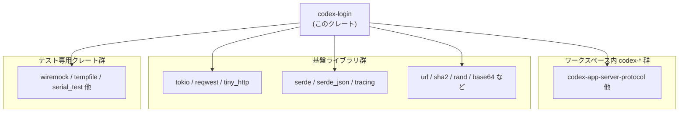
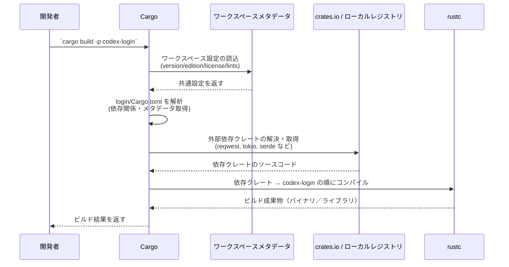

# login/Cargo.toml

## 0. ざっくり一言

`login/Cargo.toml` は、Rust クレート `codex-login` のパッケージ情報と依存クレート（本番用・テスト用）を定義する Cargo マニフェストです（login/Cargo.toml:L1-5, L10-43, L45-53）。

---

## 1. このモジュールの役割

### 1.1 概要

- このファイルは、Rust のビルドツール Cargo が参照する **マニフェスト** です。
- クレート名 `codex-login` と、バージョン・エディション・ライセンスをワークスペースから継承する設定を持ちます（login/Cargo.toml:L1-5）。
- コード内で利用可能な依存クレート（非同期ランタイム、HTTP クライアント、シリアライゼーション、テスト支援ツールなど）を宣言します（login/Cargo.toml:L10-43, L45-53）。
- 実際の公開 API やコアロジック（関数・構造体）は **このファイルには含まれていません**。それらは通常 `src/` 以下の Rust ソースに定義されますが、このチャンクには記述がありません。

### 1.2 アーキテクチャ内での位置づけ

このファイルから分かるのは「`codex-login` クレートがどのクレートに依存しているか」です。  
依存関係は次のようなグルーピングで捉えられます（login/Cargo.toml:L10-43, L45-53）。

- **ワークスペース内の codex 系クレート群**  
  `codex-app-server-protocol`, `codex-api`, `codex-client`, `codex-config`, `codex-keyring-store`, `codex-model-provider-info`, `codex-otel`, `codex-protocol`, `codex-terminal-detection`, `codex-utils-template` など（login/Cargo.toml:L14-23）。
- **インフラ／ユーティリティ系クレート**  
  `tokio`, `reqwest`, `tiny_http`, `serde`, `serde_json`, `tracing`, `url`, `urlencoding`, `once_cell`, `os_info`, `rand`, `sha2`, `base64`, `webbrowser`, `thiserror` など（login/Cargo.toml:L11-13, L24-32, L33-43）。
- **テスト支援クレート**  
  `anyhow`, `core_test_support`, `keyring`, `pretty_assertions`, `regex-lite`, `serial_test`, `tempfile`, `wiremock`（login/Cargo.toml:L45-53）。

これを抽象化して依存関係の位置づけを図示すると、次のようになります。



この図は、`codex-login` がワークスペース内外の複数コンポーネントを利用する「上位レイヤ」のクレートであることを示しています。ただし、**どのクレートをどう呼び出しているかという実行時のコールグラフ・データフローは、この Cargo.toml だけからは分かりません**。

### 1.3 設計上のポイント

Cargo.toml から読み取れる設計上の特徴は次の通りです。

- **ワークスペース一元管理**  
  - `version.workspace = true`, `edition.workspace = true`, `license.workspace = true` により、バージョン・エディション・ライセンスをワークスペースで共通管理しています（login/Cargo.toml:L3-5）。
  - `[lints] workspace = true` により、コンパイラリント（警告／制約）もワークスペース側で共通設定していると分かります（login/Cargo.toml:L7-8）。
- **非同期・並行実行を前提とした技術スタック**  
  - `tokio` に `rt-multi-thread`, `macros`, `io-std`, `process`, `signal` といった機能が有効化されています（login/Cargo.toml:L33-39）。  
    これは、マルチスレッドな非同期ランタイム上で I/O・プロセス管理・シグナル処理を行うコードを書ける前提になっていることを意味します。
  - `reqwest` に `json` と `blocking` 機能が有効であり（login/Cargo.toml:L27）、非同期 API だけでなく同期（blocking）API も利用可能な設定です。
- **HTTP／ブラウザ／ローカル環境統合**  
  - `tiny_http` による軽量 HTTP サーバ（login/Cargo.toml:L32）、`webbrowser` による OS デフォルトブラウザの起動（login/Cargo.toml:L43）、`os_info` による OS 情報の取得（login/Cargo.toml:L25）が利用可能です。
  - これらは「ローカル環境でブラウザを開き、HTTP ベースの何らかのやりとりを行う」ようなワークフローが組まれる可能性を示唆しますが、実際のフローはこのファイルからは確定できません。
- **シリアライゼーションとエラー処理の基盤**  
  - `serde` + `serde_json` によるシリアライズ／デシリアライズ（login/Cargo.toml:L28-29）と、`thiserror`, `anyhow` によるエラー型／エラーラップ（login/Cargo.toml:L31, L46）が利用可能です。
  - これにより、ドメイン固有のエラー型定義と、高レベルのエラー伝播を組み合わせたエラー処理が構成されることが多いですが、具体的な設計はこのチャンクには現れません。

---

## 2. 主要な機能一覧

Cargo.toml 自体は **実行時の機能・関数を提供しません**。ここでは「どのような種類の機能を実現できるような依存構成になっているか」という観点で整理します。

- 非同期 I/O と並行処理基盤  
  - `tokio`（`rt-multi-thread`, `macros`, `io-std`, `process`, `signal`）（login/Cargo.toml:L33-39）
- HTTP クライアント／サーバ通信  
  - `reqwest`（HTTP クライアント、JSON・blocking 機能付き）（login/Cargo.toml:L27）  
  - `tiny_http`（シンプルな HTTP サーバ）（login/Cargo.toml:L32）  
  - `wiremock`（HTTP モック、テスト用）（login/Cargo.toml:L53）
- シリアライゼーションとデータフォーマット  
  - `serde` + `serde_json`（構造体と JSON 間のシリアライズ）（login/Cargo.toml:L28-29）  
  - `chrono` + `serde` 機能（日時型とシリアライズ）（login/Cargo.toml:L13）  
  - `base64`, `sha2`（エンコード／ハッシュ）（login/Cargo.toml:L12, L30）
- 設定・環境情報・ユーティリティ  
  - `codex-config`, `os_info`, `once_cell`, `rand`, `url`, `urlencoding`, `webbrowser` など（login/Cargo.toml:L17, L24-26, L41-43）
- エラー処理／ロギング  
  - `thiserror`, `anyhow`（型安全なエラーと汎用エラーラップ）（login/Cargo.toml:L31, L46）  
  - `tracing`（構造化ログ／トレーシング）（login/Cargo.toml:L40）
- テスト関連  
  - `pretty_assertions`, `regex-lite`, `serial_test`, `tempfile`, `wiremock`, `core_test_support`, `keyring`（login/Cargo.toml:L47-53）

これらは「何が **使えるように設定されているか**」の一覧であり、**実際にどのような API が公開されているか／どう組み合わせているかはこのチャンクには現れません**。

---

## 3. 公開 API と詳細解説

### 3.1 型一覧（構造体・列挙体など）

このファイルは TOML のマニフェストであり、**Rust の構造体・列挙体などの型定義は一切含まれていません**（login/Cargo.toml:L1-53）。

要求されていた「関数／構造体のインベントリー表」に関しては、このチャンクでは次のようになります。

| 名前 | 種別 | 定義元 | 備考 |
|------|------|--------|------|
| （なし） | - | - | `login/Cargo.toml` には Rust の型定義は現れません |

### 3.2 関数詳細

同様に、Cargo.toml は構成情報のみを持ち、**Rust の関数定義やメソッド実装は含みません**（login/Cargo.toml:L1-53）。

- このため、「公開 API」「コアロジック」の具体的な関数シグネチャやアルゴリズムは、このチャンクには現れません。
- 実際のコードは一般に `login/src/` 以下に存在しますが、その内容はこのファイルからは読み取れません。

### 3.3 その他の関数

補助関数やラッパー関数についても、Cargo.toml からは一切情報が得られません。

---

## 3.x 依存コンポーネントインベントリー

ユーザー指定の「コンポーネントインベントリー」を、このファイルに現れる「依存クレート」という観点で整理します。

### 3.x.1 本番用依存クレート

| クレート名 | 種別 | 役割の概要（一般的な意味） | 根拠 |
|-----------|------|---------------------------|------|
| `async-trait` | 外部クレート | 非同期関数を含むトレイトを記述するためのマクロを提供します。 | login/Cargo.toml:L11 |
| `base64` | 外部クレート | Base64 エンコード／デコード処理用です。 | login/Cargo.toml:L12 |
| `chrono` | 外部クレート | 日時処理ライブラリ。`features = ["serde"]` により serde 連携が有効です。 | login/Cargo.toml:L13 |
| `codex-app-server-protocol` | ワークスペース内 | `workspace = true` の codex 系クレート。用途はこのチャンクからは不明です。 | login/Cargo.toml:L14 |
| `codex-api` | ワークスペース内 | 同上。用途はこのチャンクからは不明です。 | login/Cargo.toml:L15 |
| `codex-client` | ワークスペース内 | 同上。 | login/Cargo.toml:L16 |
| `codex-config` | ワークスペース内 | 同上。 | login/Cargo.toml:L17 |
| `codex-keyring-store` | ワークスペース内 | 同上。名前から鍵ストア関連と推測されますが、このチャンクからは確定できません。 | login/Cargo.toml:L18 |
| `codex-model-provider-info` | ワークスペース内 | 同上。用途は不明です。 | login/Cargo.toml:L19 |
| `codex-otel` | ワークスペース内 | OpenTelemetry 連携を想起させますが、用途はこのチャンクからは確定できません。 | login/Cargo.toml:L20 |
| `codex-protocol` | ワークスペース内 | プロトコル関連の codex クレートと推測されますが、詳細不明です。 | login/Cargo.toml:L21 |
| `codex-terminal-detection` | ワークスペース内 | ターミナル検出に関わる可能性がありますが、詳細不明です。 | login/Cargo.toml:L22 |
| `codex-utils-template` | ワークスペース内 | ユーティリティ／テンプレート関連と推測されますが、詳細不明です。 | login/Cargo.toml:L23 |
| `once_cell` | 外部クレート | 遅延初期化の静的変数など、一度だけ初期化されるセルを提供します。 | login/Cargo.toml:L24 |
| `os_info` | 外部クレート | OS 種別やバージョンの情報を取得するライブラリです。 | login/Cargo.toml:L25 |
| `rand` | 外部クレート | 乱数生成ライブラリです。 | login/Cargo.toml:L26 |
| `reqwest` | 外部クレート | HTTP クライアントライブラリ。`json`, `blocking` 機能が有効です。 | login/Cargo.toml:L27 |
| `serde` | 外部クレート | シリアライズ／デシリアライズ基盤。`derive` 機能によりマクロ派生が利用可能です。 | login/Cargo.toml:L28 |
| `serde_json` | 外部クレート | JSON 形式とのシリアライズ／デシリアライズを提供します。 | login/Cargo.toml:L29 |
| `sha2` | 外部クレート | SHA-2 系ハッシュ関数の実装です。 | login/Cargo.toml:L30 |
| `thiserror` | 外部クレート | カスタムエラー型を簡易に実装するためのマクロを提供します。 | login/Cargo.toml:L31 |
| `tiny_http` | 外部クレート | 軽量な同期型 HTTP サーバライブラリです。 | login/Cargo.toml:L32 |
| `tokio` | 外部クレート | 非同期実行ランタイム（`rt-multi-thread`, `macros`, `process`, `signal` などの機能付き）です。 | login/Cargo.toml:L33-39 |
| `tracing` | 外部クレート | 構造化ログ／トレース収集のためのライブラリです。 | login/Cargo.toml:L40 |
| `url` | 外部クレート | URL のパース・生成等を行います。 | login/Cargo.toml:L41 |
| `urlencoding` | 外部クレート | URL エンコード／デコード処理を提供します。 | login/Cargo.toml:L42 |
| `webbrowser` | 外部クレート | OS 標準ブラウザを起動し URL を開く機能を提供します。 | login/Cargo.toml:L43 |

### 3.x.2 テスト用依存クレート（dev-dependencies）

| クレート名 | 種別 | 役割の概要（一般的な意味） | 根拠 |
|-----------|------|---------------------------|------|
| `anyhow` | 外部クレート | エラーを型消去して扱うための汎用エラーライブラリです。 | login/Cargo.toml:L46 |
| `core_test_support` | ワークスペース内 | ワークスペース共通のテスト支援クレートと推測されますが、詳細は不明です。 | login/Cargo.toml:L47 |
| `keyring` | 外部クレート | OS の資格情報ストア（キーチェーンなど）との連携を提供します。 | login/Cargo.toml:L48 |
| `pretty_assertions` | 外部クレート | テスト失敗時に見やすい差分表示を行うアサーションマクロです。 | login/Cargo.toml:L49 |
| `regex-lite` | 外部クレート | 軽量な正規表現ライブラリです。 | login/Cargo.toml:L50 |
| `serial_test` | 外部クレート | テストをシリアル（逐次）に実行させるためのアトリビュートを提供します。 | login/Cargo.toml:L51 |
| `tempfile` | 外部クレート | 自動削除される一時ファイル／ディレクトリを扱うためのライブラリです。 | login/Cargo.toml:L52 |
| `wiremock` | 外部クレート | HTTP サーバのモックを提供し、HTTP ベースのコードのテストに使用できます。 | login/Cargo.toml:L53 |

---

## 4. データフロー

### 4.1 Cargo によるビルド時データフロー

このファイル単体からは実行時の「ログイン処理」などのデータフローは分かりませんが、**ビルド時** に Cargo がどのようにこのファイルを利用しているかは一般的な Rust の挙動として説明できます。

代表的なビルド時フローは次のようになります。



この図は、**Cargo が `login/Cargo.toml`（L1-53）を起点に依存グラフを構築し、コンパイルを進めていく**ことを表しています。

- コンポーネント間でやり取りされる「データ」は、主に
  - 依存クレートのメタデータ
  - ダウンロードされたクレートのソースコード
  - コンパイルされたバイナリ
  です。
- `tokio`, `reqwest` などを用いた実行時データフロー（HTTP リクエスト・レスポンスなど）は、ソースコード側の設計に依存し、このチャンクからは把握できません。

---

## 5. 使い方（How to Use）

ここでは、「この Cargo.toml の設定を前提として、クレート内で依存クレートをどう使えるか」「Cargo.toml をどう変更すればよいか」という観点で説明します。

### 5.1 基本的な使用方法（依存クレートの利用例）

`reqwest` と `tokio` が依存として宣言されているため（login/Cargo.toml:L27, L33-39）、`codex-login` クレート内の Rust コードでは次のような HTTP 通信を行うことができます。

```rust
// 非同期ランタイム tokio を利用した main 関数を定義する                    // tokio のマクロを使って非同期 main 関数を定義
#[tokio::main]                                                              // Cargo.toml で `tokio` の `macros` 機能が有効なので使用可能
async fn main() -> Result<(), Box<dyn std::error::Error>> {                 // 非同期 main。エラーを Box<dyn Error> で返す
    // HTTP クライアントを生成する                                           // reqwest のクライアントを作成
    let client = reqwest::Client::new();                                    // `reqwest` は Cargo.toml で依存として宣言済み

    // GET リクエストを送り、JSON としてレスポンスを受け取る                 // ある URL に GET を送り、JSON をパース
    let resp = client                                                       // クライアントに対してメソッドチェーンで操作
        .get("https://example.com/api")                                     // GET リクエストを構築
        .send()                                                             // リクエストを送信（非同期）
        .await?                                                             // Future を待機し、エラーなら ? で伝播
        .json::<serde_json::Value>()                                        // JSON レスポンスを serde_json::Value としてパース
        .await?;                                                            // こちらも Future を待機し、エラーは ? で伝播

    // 結果を表示する                                                         // 得られた JSON を標準出力に表示
    println!("{:#}", resp);                                                 // 整形して表示する

    Ok(())                                                                  // 成功を表す Ok(()) を返す
}
```

このコードはあくまで **一般的な利用例** であり、実際に `codex-login` 内にこの関数が存在するかどうかは、このチャンクからは分かりません。

### 5.2 よくある使用パターン

Cargo.toml の設定から推測できる「依存クレートの典型的な使い方」をいくつか示します。

1. **同期（blocking）HTTP クライアントの利用**

   `reqwest` の `blocking` 機能が有効なため（login/Cargo.toml:L27）、非同期ランタイムを使わずに同期的に HTTP 通信を行うこともできます。

   ```rust
   // 同期ブロッキング API を使ったリクエスト                                 // 非同期ランタイムなしで HTTP リクエストを送る例
   fn fetch_sync() -> Result<String, reqwest::Error> {                       // 文字列のレスポンスボディを返す関数
       // ブロッキングクライアントを作成する                                  // Sync な Client を生成
       let client = reqwest::blocking::Client::new();                        // `blocking` 機能が有効なので利用可能

       // GET リクエストを送り、レスポンスボディを文字列で取得                // GET で取得し、text() で String に変換
       let body = client                                                     // クライアントを通してリクエストを送信
           .get("https://example.com")                                       // URL を指定
           .send()?                                                          // リクエスト送信。失敗時は Err を返す
           .text()?;                                                         // レスポンスボディを String として取得する

       Ok(body)                                                              // 結果を呼び出し元に返す
   }
   ```

2. **`tracing` によるログ出力**

   `tracing` が依存に含まれているため（login/Cargo.toml:L40）、構造化ログを出力できます。

   ```rust
   // tracing を用いたログの例                                               // 構造化ログを出すための簡単な例
   fn do_something() {                                                       // 何らかの処理を行う関数
       tracing::info!(target: "codex-login", "Start processing login");      // info レベルでログを出力
       // ... 実際の処理 ...                                                 // 実際の処理がここに入る
       tracing::info!(target: "codex-login", "Finish processing login");     // 終了ログを出力
   }
   ```

### 5.3 よくある間違い

Cargo.toml と依存クレートの組み合わせから、起こりがちな誤用例とその対策を一般論として挙げます。

1. **非同期ランタイム上でのブロッキング I/O の多用**

```rust
// 問題になりうる例: tokio の非同期コンテキスト内で blocking API を直接呼ぶ
#[tokio::main]
async fn main() {
    // NG になりうる: 非同期コンテキストで blocking クライアントを直接使用
    let client = reqwest::blocking::Client::new();
    // ここでの send() はスレッドをブロックするため、ランタイム性能に影響しうる
    let _ = client.get("https://example.com").send().unwrap();
}
```

- 一般には、`tokio` の非同期タスク内では `reqwest::Client` の非同期 API を使う方が望ましいです。
- もし blocking API を使う必要がある場合は、`tokio::task::spawn_blocking` 等で隔離するパターンがよく用いられます。

1. **Cargo.toml に依存を追加し忘れる**

```rust
// NG 例: Cargo.toml に serde_json を追加せずにコード側で use している
use serde_json::Value;  // -> コンパイルエラー: crate `serde_json` not found
```

- この場合、Cargo.toml に `serde_json` を追加した上でビルドする必要があります（このプロジェクトではすでに追加済み: login/Cargo.toml:L29）。

### 5.4 使用上の注意点（まとめ）

- **前提条件**
  - `codex-login` のビルドには、宣言された依存クレート（特に `tokio`, `reqwest`, `serde` 等）が利用可能な Rust ツールチェーンが必要です（login/Cargo.toml:L11-32, L33-43）。
  - ワークスペースにおけるバージョンやリント設定はワークスペース側で管理されているため、本クレート単体で変更できない場合があります（login/Cargo.toml:L3-5, L7-8）。
- **安全性・セキュリティ上の注意**
  - `webbrowser` により OS のブラウザを起動でき、`tiny_http` によりローカル HTTP サーバを起動できるため、**ユーザーが意図しない URL を開かないこと、不要なポートを公開しないこと**が重要になります（login/Cargo.toml:L32, L43）。
  - `keyring` や `codex-keyring-store` は資格情報の保存に関わる可能性があるため、**平文保存の有無やアクセス権限**に注意が必要ですが、具体的な扱いはこのチャンクからは不明です（login/Cargo.toml:L18, L48）。
  - `sha2`, `rand` などの暗号関連機能を使う際は、**暗号学的に安全な使い方（適切なアルゴリズム・乱数生成・ソルト管理など）**が求められますが、実際の実装はこのファイルには現れません（login/Cargo.toml:L26, L30）。
- **エラー処理**
  - `thiserror`, `anyhow` の両方が含まれており（login/Cargo.toml:L31, L46）、**ライブラリ側で型付きエラー（thiserror）、アプリケーション側で anyhow によるラップ**という構成が一般的ですが、ここでは推測に留まります。
- **並行性**
  - `rt-multi-thread` を有効にした `tokio` は複数スレッドでタスクを実行できます（login/Cargo.toml:L33-39）。共有状態を扱う際には、Rust の並行性原則（`Send`/`Sync` の実装、ミューテックスなど）に従う必要がありますが、具体的な状態管理コードはこのチャンクには存在しません。

---

## 6. 変更の仕方（How to Modify）

### 6.1 新しい機能を追加する場合（依存の追加）

新機能の実装に新しいクレートが必要な場合は、次の手順で Cargo.toml を変更します。

1. **依存クレートを選定する**
   - 例: YAML を扱いたい → `serde_yaml` など。
2. **`[dependencies]` または `[dev-dependencies]` に追記**

   ```toml
   [dependencies]
   # 既存の依存...
   serde_yaml = "0.9"  # 追加したいクレートとバージョンを指定
   ```

3. **`cargo build` / `cargo test` で確認**
   - 依存解決やコンパイルエラーがないか確認します。

**注意点**

- このプロジェクトは `version.workspace = true` などワークスペース管理を行っているため（login/Cargo.toml:L3-5）、**バージョン指定もワークスペースルート側で行うルール**になっている可能性があります。  
  その場合、バージョン記述はルートの Cargo.toml に追加する必要があります（このチャンクにはルート側の内容は現れません）。
- 同様に、`workspace = true` で管理されている依存を個別クレートだけで変更すると、ワークスペースのポリシーと齟齬が出る可能性があります。

### 6.2 既存の機能を変更する場合（依存・機能フラグの変更）

既存コードの変更に伴って依存や機能フラグを変更する場合の一般的な観点です。

- **依存の削除**
  - あるクレートをコードから完全に使わなくなった場合、`[dependencies]` から行を削除し、`cargo build` で問題ないか確認します。
- **機能フラグの変更**
  - 例: `tokio` の `signal` 機能を使わなくなった場合、機能指定から `signal` を削除できます（login/Cargo.toml:L33-39）。
  - 機能を削るとコンパイルエラー（該当機能に依存する API が使えなくなる）になるため、**関連コード全体を確認してから行う必要があります**。
- **影響範囲の確認**
  - 依存クレートを変更すると、そのクレートを利用しているすべての関数・モジュールに影響します。  
    影響範囲はソースコード検索（例: `rg "reqwest" login/src`）などで確認するのが一般的ですが、本チャンクにはソースツリー情報がないため、具体的な場所は不明です。

---

## 7. 関連ファイル

このチャンクには、他ファイルのパスは明示されていません。ただし、Cargo と Rust の一般的な構造から、次のような関連があると考えられます（ただし、**パスは推測であり、このファイルには現れません**）。

| パス / 名前 | 役割 / 関係 |
|------------|------------|
| `login/Cargo.toml` | 本クレート `codex-login` のマニフェスト。依存関係とパッケージ情報を定義します（login/Cargo.toml:L1-53）。 |
| （ワークスペースルートの）`Cargo.toml` | `version.workspace = true` などの設定から、バージョン・エディション・ライセンス・lints を一元管理していると推測される親マニフェストです（login/Cargo.toml:L3-5, L7-8）。 |
| `codex-*` 各クレート（例: `codex-api`, `codex-client`） | `workspace = true` により同一ワークスペース内の別クレートであることが分かりますが、具体的なパスはこのチャンクには現れません（login/Cargo.toml:L14-23, L47）。 |

実際に公開 API やコアロジックを調べるには、`codex-login` クレートの `src/` 以下のソースコードおよび、依存する codex 系クレートのソースコードを参照する必要がありますが、それらはこのチャンク中には含まれていません。
