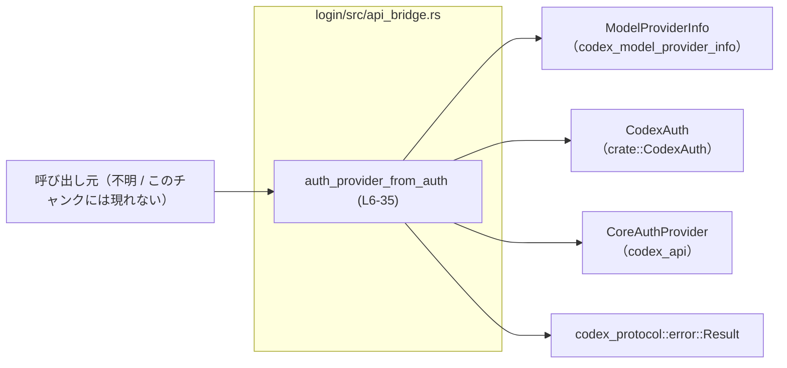
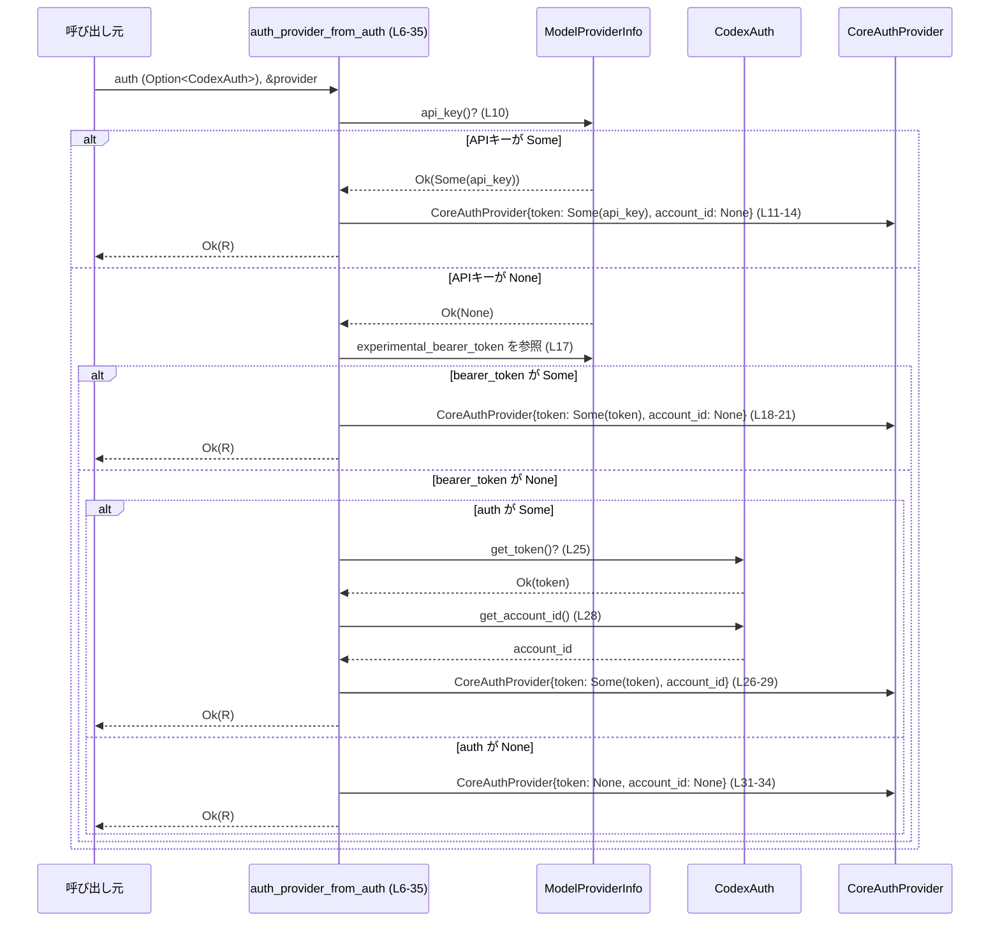

# login/src/api_bridge.rs

## 0. ざっくり一言

`CodexAuth` と `ModelProviderInfo` から、呼び出し側（codex_api）が使う `CoreAuthProvider` を組み立てるための、認証情報ブリッジ関数を 1 つだけ提供するモジュールです（根拠: `login/src/api_bridge.rs:L1-35`）。

---

## 1. このモジュールの役割

### 1.1 概要

- このモジュールは、**モデルプロバイダやユーザ設定から取得した認証情報を、`CoreAuthProvider` 形式に変換する**ために存在します。
- 優先順位付きで複数のソース（`ModelProviderInfo` 内の API キー / bearer トークン / `CodexAuth`）からトークンを取り出し、`CoreAuthProvider` を返します（根拠: `if let` 連鎖 `L10-35`）。

### 1.2 アーキテクチャ内での位置づけ

このファイル自身は 1 関数のみですが、外部コンポーネントとの関係は次のようになります。



- 呼び出し元は不明ですが、`pub fn` なのでクレート外からも利用される可能性があります（根拠: `pub fn auth_provider_from_auth` `L6`）。
- `ModelProviderInfo` から API キー / bearer トークンを取得し（`provider.api_key()?` と `provider.experimental_bearer_token`、根拠: `L10-11, L17`）、なければ `CodexAuth` を使ってトークンとアカウント ID を取得します（根拠: `L24-29`）。
- 結果は `CoreAuthProvider` として返され、その型は `codex_protocol::error::Result` でラップされています（根拠: 戻り値型 `L9`）。

### 1.3 設計上のポイント

- **優先順位付きのトークン解決**  
  1. `ModelProviderInfo::api_key()`  
  2. `ModelProviderInfo.experimental_bearer_token`  
  3. `CodexAuth` のトークン  
  4. いずれも無い場合はトークンなし  
  という優先順位で分岐しています（根拠: `L10-15, L17-22, L24-35`）。
- **状態を持たない純粋関数**  
  グローバル変数や内部状態を持たず、引数から出力を決めるだけの関数になっています（根拠: ファイル全体に `static` やフィールド定義が無い `L1-36`）。
- **エラー伝播は `?` による早期リターン**  
  - `provider.api_key()?` と `auth.get_token()?` で発生したエラーを、そのまま呼び出し元へ伝播します（根拠: `L10, L25`）。
- **同期・シングルスレッド前提のシンプルな処理**  
  async やスレッド操作は一切なく、`&ModelProviderInfo` の不変参照だけを読み取るため、関数自体はスレッドセーフになりやすい構造です（根拠: 引数シグネチャ `L7-8`）。

---

## 2. 主要な機能一覧とコンポーネントインベントリー

### 2.1 主要機能

- 認証プロバイダ作成: `auth_provider_from_auth`  
  `ModelProviderInfo` と `CodexAuth` から `CoreAuthProvider` を構築し、エラーを `codex_protocol::error::Result` で返却します（根拠: `L6-9, L10-35`）。

### 2.2 コンポーネント一覧（定義・利用）

#### 関数

| 名前 | 種別 | 役割 / 用途 | 定義行 |
|------|------|------------|--------|
| `auth_provider_from_auth` | 公開関数 | 認証情報ソースから `CoreAuthProvider` を構築し返す | `login/src/api_bridge.rs:L6-35` |

#### 型（このファイル「内で参照している」もの）

| 名前 | 所属 | 種別 | このファイルでの役割 | 使用行 |
|------|------|------|----------------------|--------|
| `CoreAuthProvider` | `codex_api` | 構造体 | 呼び出し側が利用する認証情報コンテナ。`token` と `account_id` フィールドが存在することが分かります（型詳細はこのチャンクには現れない）。 | `L1, L11-13, L18-20, L26-28, L31-33` |
| `ModelProviderInfo` | `codex_model_provider_info` | 構造体（と推測される） | モデルプロバイダに紐づく API キーや bearer トークンを保持。`api_key()` メソッドと `experimental_bearer_token` フィールドが存在します。 | `L2, L8, L10-11, L17` |
| `CodexAuth` | `crate` | 型（詳細不明） | 呼び出し元が持つ認証情報。`get_token()` と `get_account_id()` メソッドを提供します。 | `L4, L7, L24-29` |
| `codex_protocol::error::Result` | `codex_protocol::error` | 型エイリアス or ジェネリック型 | 戻り値のエラーラッパ。成功時に `CoreAuthProvider` を内包します。具体的なエラー型定義はこのチャンクには現れません。 | `L9` |

※ `CoreAuthProvider`・`ModelProviderInfo`・`CodexAuth` の定義本体はこのチャンクには現れません。ここでは「このファイルから観測できる範囲」のみを記載しています。

---

## 3. 公開 API と詳細解説

### 3.1 型一覧（このファイルで新たに定義される型）

このファイル内で**新たに定義されている**構造体・列挙体・型エイリアスはありません（根拠: `L1-36` に `struct` / `enum` / `type` が存在しない）。

### 3.2 関数詳細

#### `auth_provider_from_auth(auth: Option<CodexAuth>, provider: &ModelProviderInfo) -> codex_protocol::error::Result<CoreAuthProvider>`

**概要**

- モデルプロバイダの設定情報と任意の `CodexAuth` から、`CoreAuthProvider` を構築して返す関数です（根拠: シグネチャ `L6-9`）。
- トークンのソースには優先順位があり、`ModelProviderInfo` 内の API キー／bearer トークンが `CodexAuth` より優先されます（根拠: `L10-22` と `L24-29` の順序）。
- 何も取得できない場合でも `Ok(CoreAuthProvider { token: None, account_id: None })` を返し、エラーにはしません（根拠: `L31-34`）。

**引数**

| 引数名 | 型 | 説明 |
|--------|----|------|
| `auth` | `Option<CodexAuth>` | 追加の認証情報。`Some` の場合に `get_token()` と `get_account_id()` が利用されます（根拠: `L24-29`）。`None` の場合は無視されます（根拠: `else` 節 `L30-35`）。 |
| `provider` | `&ModelProviderInfo` | モデルプロバイダ設定。`api_key()` メソッドと `experimental_bearer_token` フィールドから認証情報を取得します（根拠: `L10-11, L17`）。不変参照なので、関数内で `provider` は変更されません。 |

**戻り値**

- `codex_protocol::error::Result<CoreAuthProvider>`  
  - **成功 (`Ok`)**: 選択されたトークンおよびアカウント ID を含む `CoreAuthProvider`（根拠: `Ok(CoreAuthProvider { ... })` が複数箇所 `L11-14, L18-21, L26-29, L31-34`）。
  - **失敗 (`Err`)**: `provider.api_key()` または `auth.get_token()` 呼び出し時のエラーをそのままラップしたもの（根拠: `?` 演算子 `L10, L25`）。具体的なエラー型はこのチャンクには現れません。

**内部処理の流れ（アルゴリズム）**

1. `provider.api_key()` を呼び出し、その結果に `?` を適用します（根拠: `L10`）。  
   - エラーなら即座に `Err` として呼び出し元に返されます（Rust の `?` の挙動）。
   - `Ok(Some(api_key))` の場合:
     - `CoreAuthProvider { token: Some(api_key), account_id: None }` を作成して `Ok(...)` を返し、関数を終了します（根拠: `L11-14`）。
   - `Ok(None)` の場合:
     - 次のステップに進みます。

2. `provider.experimental_bearer_token.clone()` を評価し、`Some(token)` なら  
   `CoreAuthProvider { token: Some(token), account_id: None }` を返します（根拠: `L17-21`）。  
   - `clone()` の詳細な挙動はこのチャンクには現れませんが、トークン値を複製していることが分かります。

3. 上記 2 つが `None` の場合、`auth` をパターンマッチします（根拠: `L24-30`）。  
   - `Some(auth)` の場合:
     1. `auth.get_token()?` でトークンを取得します（根拠: `L25`）。ここでも `?` によりエラーは即座に伝播します。
     2. `auth.get_account_id()` でアカウント ID を取得します（根拠: `L28`）。
     3. `CoreAuthProvider { token: Some(token), account_id: auth.get_account_id() }` を `Ok(...)` で返します（根拠: `L26-29`）。
   - `None` の場合:
     - `CoreAuthProvider { token: None, account_id: None }` を返します（根拠: `L31-34`）。

4. いずれの場合も、panic を発生させる明示的な処理はありません（`unwrap` や `expect` が存在しない、根拠: `L1-36`）。

**処理フローダイアグラム**

```mermaid
flowchart TD
  A["開始<br/>auth_provider_from_auth (L6-35)"] --> B["provider.api_key()? (L10)"]
  B -->|Err| Z["Err を返して終了"]
  B -->|Ok(Some(api_key))| C["CoreAuthProvider{token: Some(api_key), account_id: None} を返す (L11-14)"]
  B -->|Ok(None)| D["experimental_bearer_token を確認 (L17)"]
  D -->|Some(token)| E["CoreAuthProvider{token: Some(token), account_id: None} を返す (L18-21)"]
  D -->|None| F["auth を確認 (L24)"]
  F -->|Some(auth)| G["auth.get_token()? & get_account_id() (L25, L28)"]
  G -->|Err| Z
  G -->|Ok(token)| H["CoreAuthProvider{token: Some(token), account_id: auth.get_account_id()} を返す (L26-29)"]
  F -->|None| I["CoreAuthProvider{token: None, account_id: None} を返す (L31-34)"]
```

**Examples（使用例）**

このチャンクには `CodexAuth` や `ModelProviderInfo` の具体的な生成方法が現れないため、擬似的な例を示します。

```rust
use codex_model_provider_info::ModelProviderInfo;       // L2 に対応
use codex_api::CoreAuthProvider;                         // L1 に対応

use crate::login::api_bridge::auth_provider_from_auth;   // この関数
use crate::CodexAuth;                                    // L4 に対応

fn build_auth_provider_example() -> codex_protocol::error::Result<CoreAuthProvider> {
    // ModelProviderInfo の具体的な作り方はこのチャンクには現れないので、
    // ここでは placeholder で表現します。
    let provider: ModelProviderInfo = /* プロバイダ設定を構築 */ unimplemented!();

    // CodexAuth も同様に placeholder
    let auth: CodexAuth = /* ユーザの認証情報を構築 */ unimplemented!();

    // auth を優先したい場合でも、この関数の仕様上は
    // provider に API キー／bearer トークンがあるとそちらが優先されます。
    let core_auth = auth_provider_from_auth(Some(auth), &provider)?; // L6-9 相当

    Ok(core_auth)
}
```

**Errors / Panics**

- **`Err` になる条件**
  - `provider.api_key()` がエラーを返した場合（根拠: `provider.api_key()?` `L10`）。
  - `auth` が `Some` の場合に `auth.get_token()` がエラーを返した場合（根拠: `auth.get_token()?` `L25`）。
  - それ以外の箇所で `?` や `unwrap` は使用されていないため、ここから読み取れるエラー源はこの 2 箇所のみです。
- **panic の可能性**
  - 明示的な `panic!` や `unwrap` / `expect` は存在しないため、この関数自身から読み取れる panic 要因はありません（根拠: `L1-36`）。

**Edge cases（エッジケース）**

- `provider.api_key()` が `Ok(Some(api_key))` を返す場合  
  - `experimental_bearer_token` や `auth` は一切参照されません（根拠: `return Ok(CoreAuthProvider { ... })` `L11-14`）。
- `provider.api_key()` が `Ok(None)` で、`experimental_bearer_token` が `Some(token)` の場合  
  - `auth` は参照されません（根拠: `return Ok(CoreAuthProvider { ... })` `L18-21`）。
- `provider.api_key()` が `Ok(None)`、`experimental_bearer_token` が `None` で、`auth` が `Some` の場合  
  - `auth.get_token()` や `auth.get_account_id()` が使用されます（根拠: `L24-29`）。
- `auth` が `None` で、`provider.api_key()` も `experimental_bearer_token` も `None` の場合  
  - `token: None, account_id: None` の `CoreAuthProvider` が返り、認証情報なしの状態になります（根拠: `L31-34`）。
- `provider.api_key()` や `auth.get_token()` が返すエラー内容・型  
  - このチャンクには現れないため、具体的なエラー種別やメッセージは不明です。

**使用上の注意点**

- **トークンソースの優先順位**  
  呼び出し側が「どのソースのトークンを最優先したいか」を設計する際、この関数の優先順位（API キー > bearer トークン > `CodexAuth` > なし）と整合している必要があります（根拠: `L10-22, L24-35`）。
- **エラー処理**  
  - `provider.api_key()` / `auth.get_token()` のエラーがそのまま呼び出し元に伝播するため、呼び出し元で `Result` を適切にハンドリングする必要があります（根拠: `?` `L10, L25`）。
- **並行性**  
  - 引数として不変参照 `&ModelProviderInfo` と所有権を持つ `Option<CodexAuth>` を受け取り、内部で共有可変状態を持たないため、この関数自体はスレッド間で安全に呼び出しやすい構造になっています。ただし、`ModelProviderInfo` / `CodexAuth` の実装がスレッドセーフかどうかはこのチャンクには現れません。
- **トークン値の扱い**  
  - この関数内ではトークン値のマスキングやログ出力は行っておらず、単純に値をフィールドに詰め替えているだけです（根拠: `CoreAuthProvider { token: Some(...), ... }` 以外にログ処理がない `L11-13, L18-20, L26-28`）。  
    ログやトレースが追加される箇所でトークンを出力しないように注意する必要があります（ただし、本ファイルにはログ出力自体が存在しません）。

**潜在的な Bugs / Security 観点（このチャンクから読み取れる範囲）**

- **意図と異なる優先順位の可能性**  
  - 呼び出し側が「`CodexAuth` を常に優先する」ことを期待している場合でも、この関数は `ModelProviderInfo` の API キー／bearer トークンを優先します（根拠: `L10-22` が `auth` より前）。  
    これはバグと断定はできませんが、仕様を確認すべきポイントになります。
- **認証情報なしでの実行**  
  - すべてのソースが空でも `Ok` を返すため、「認証情報が無いときはエラーにしたい」ような呼び出し側では追加チェックが必要です（根拠: `L31-34`）。
- **トークン値の検証なし**  
  - トークン値の形式検証やスコープ検証は行っていません。`CoreAuthProvider` を使う下流コンポーネント側で検証する設計と推測されますが、このチャンクだけでは断定できません。

### 3.3 その他の関数

このファイルにその他の関数は存在しません（根拠: `L1-36`）。

---

## 4. データフロー

この関数を 1 回呼び出したときに、データがどのように流れるかをシーケンス図で示します。



要点:

- **最初の問い合わせ先は常に `ModelProviderInfo::api_key()`** であり、その結果によって以降の経路が早期に決まります（根拠: `L10-15`）。
- `CodexAuth` が使われるのは、他のソースがすべて空のときに限られます（根拠: `L24` 以降の `if let Some(auth)` ブロック `L24-29`）。
- どの経路を通っても、最終的には `CoreAuthProvider` が `Ok` で返されます（エラーが起きた場合を除く）。

---

## 5. 使い方（How to Use）

### 5.1 基本的な使用方法

`ModelProviderInfo` と `CodexAuth` を用意し、`auth_provider_from_auth` を呼び出して `CoreAuthProvider` を取得します。

```rust
use codex_model_provider_info::ModelProviderInfo;
use codex_api::CoreAuthProvider;
use codex_protocol::error::Result;

use crate::login::api_bridge::auth_provider_from_auth;
use crate::CodexAuth;

fn build_auth_provider(
    provider: &ModelProviderInfo,
    auth: Option<CodexAuth>,
) -> Result<CoreAuthProvider> {
    // provider に API キーや experimental_bearer_token がある場合はそれが優先される
    // （auth は無視される可能性がある点に注意）
    let core_auth = auth_provider_from_auth(auth, provider)?; // L6-9

    // core_auth.token / core_auth.account_id を下流の API クライアントに渡すことが想定されます
    Ok(core_auth)
}
```

### 5.2 よくある使用パターン

1. **プロバイダごとの固定 API キーを優先し、ユーザごとのトークンをフォールバックにする**

```rust
fn resolve_auth(provider: &ModelProviderInfo, user_auth: Option<CodexAuth>)
    -> codex_protocol::error::Result<CoreAuthProvider>
{
    // provider に API キーが設定されていればそれを使用し、
    // 無ければ experimental_bearer_token、さらに無ければ user_auth の順に試される。
    auth_provider_from_auth(user_auth, provider)
}
```

1. **ユーザの `CodexAuth` だけを使いたい場合**

```rust
fn user_only_auth(user_auth: CodexAuth)
    -> codex_protocol::error::Result<CoreAuthProvider>
{
    // provider に認証情報を持たせたくない場合は、
    // 認証情報を持たないダミーの ModelProviderInfo を渡す必要があります。
    let provider: ModelProviderInfo = /* 認証情報を持たない形で構築 */ unimplemented!();

    auth_provider_from_auth(Some(user_auth), &provider)
}
```

※ `ModelProviderInfo` の「認証情報を持たない状態」の作り方は、このチャンクには現れません。

### 5.3 よくある間違い

```rust
// 誤りの例: provider に API キーが設定されていることを忘れている
let provider = /* API キー付きで構築されている */ unimplemented!();
let auth = Some(/* ユーザトークン */ unimplemented!());

// 期待: ユーザトークンが使われる
// 実際: provider.api_key() が Some のため、auth は無視される（L10-15）
let core_auth = auth_provider_from_auth(auth, &provider)?; // 期待と異なる経路になる可能性
```

```rust
// 正しい例: 優先順位を理解した上で設定を行う
let provider = /* トークンを持たない状態で構築 */ unimplemented!();
let auth = Some(/* ユーザトークン */ unimplemented!());

// provider がトークンを持たないため、auth が使用される（L24-29）
let core_auth = auth_provider_from_auth(auth, &provider)?;
```

### 5.4 使用上の注意点（まとめ）

- `ModelProviderInfo` に認証情報が入っていると、`CodexAuth` は無視される場合がある。
- 認証情報が見つからなくても `Ok` が返るため、「必ず認証が必要」な場面では `token` が `None` でないことを呼び出し側で確認する必要がある。
- エラーは `provider.api_key()` または `auth.get_token()` からのみ発生し得る。これらの実装仕様を確認した上で、エラー処理を行うことが望ましい。

---

## 6. 変更の仕方（How to Modify）

### 6.1 新しい機能を追加する場合

例: 新しい認証ソース（例: 環境変数、別の設定オブジェクト）を追加したい場合。

1. 新しいソースからトークンを取得する関数や型を、適切なモジュールに定義する（このファイルには新しい型定義はないので、既存の構造に合わせる）。
2. `auth_provider_from_auth` 内の `if let` 連鎖に、新しい優先順位の分岐を追加する（根拠: 現在は `L10-15` → `L17-22` → `L24-29` の 3 段階）。
3. 追加分岐が `Result` を返すなら `?` を使うかどうかを決め、エラー伝播の仕様を明確にする。
4. 呼び出し元で、新しいソースに関する設定・初期化を行う。

### 6.2 既存の機能を変更する場合

- **優先順位を変更する**  
  - 例: `CodexAuth` を一番優先したい  
    - `if let Some(auth) = auth` ブロック（`L24-29`）を前方に移動し、`provider.api_key()` や `experimental_bearer_token` より先に評価する。
    - 影響範囲として、`auth_provider_from_auth` を利用しているすべての呼び出し元の挙動が変わるため、全呼び出し箇所で仕様に合致するか確認が必要です。
- **「トークンなし」をエラー扱いにする**  
  - `else` ブロック（`L30-35`）で `Ok(CoreAuthProvider { token: None, ... })` を返している箇所を、`Err(...)` に変更することで実現できますが、新たなエラー型やメッセージの設計が必要です。
- 変更時には:
  - `CoreAuthProvider` を利用する下流コードが、`token` / `account_id` の有無に依存したロジックを持っていないか確認する。
  - `codex_protocol::error::Result` のエラー型契約（どのエラーが流れてくるか）を壊していないか確認する。

---

## 7. 関連ファイル

このファイルと密接に関係するが、このチャンクには定義が現れないコンポーネントを列挙します。

| パス / クレート | 役割 / 関係 |
|-----------------|------------|
| `codex_api::CoreAuthProvider` | 認証情報を保持する型。`token` と `account_id` フィールドを持ち、`auth_provider_from_auth` の戻り値として利用されます（根拠: 構造体リテラル `L11-13, L18-20, L26-28, L31-33`）。 |
| `codex_model_provider_info::ModelProviderInfo` | モデルプロバイダ設定。`api_key()` メソッドと `experimental_bearer_token` フィールドを通じて認証情報を提供します（根拠: `L2, L8, L10-11, L17`）。定義本体はこのチャンクには現れません。 |
| `crate::CodexAuth` | 呼び出し元側の認証情報型。`get_token()` と `get_account_id()` メソッドを提供し、`auth_provider_from_auth` のフォールバック用トークンソースとして利用されます（根拠: `L4, L7, L24-29`）。 |
| `codex_protocol::error::Result` | エラー付き戻り値型。`auth_provider_from_auth` の戻り値として利用され、`provider.api_key()` / `auth.get_token()` のエラーを運びます（根拠: `L9, L10, L25`）。 |

このチャンクにはテストコード（`tests` モジュールや `#[cfg(test)]`）は存在しないため、テストは別ファイルまたは別モジュールで管理されているか、まだ用意されていないものと考えられます（ただし、実在するかどうかはこのチャンクからは判断できません）。
