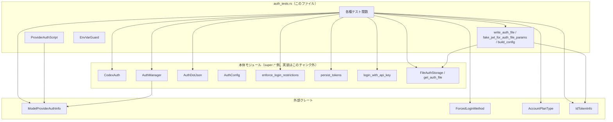
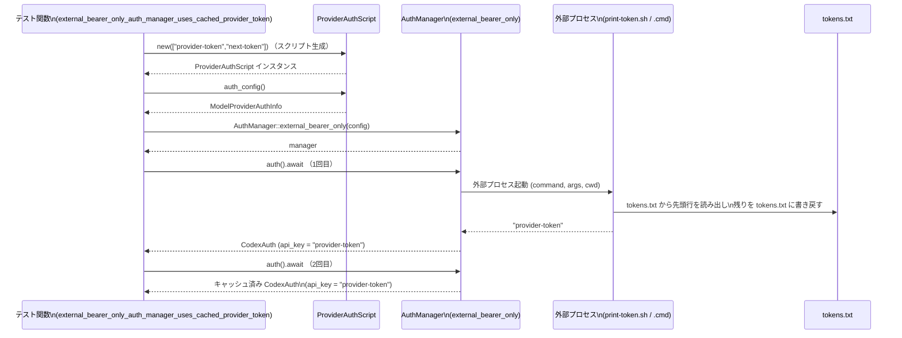
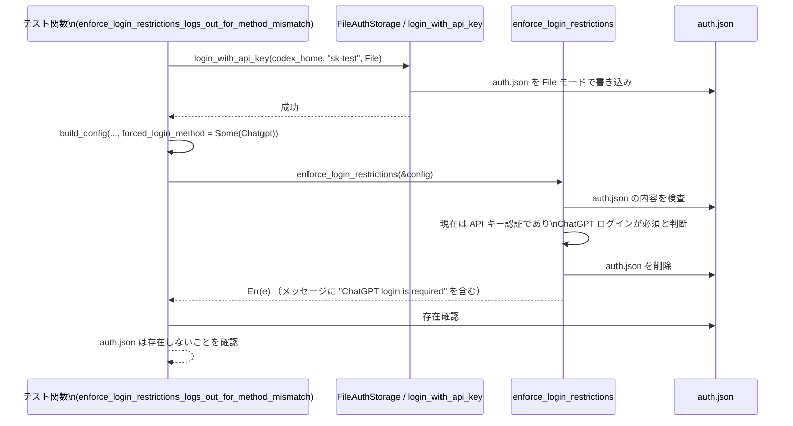

# login/src/auth/auth_tests.rs

## 0. ざっくり一言

認証モジュール（`CodexAuth`・`AuthManager`・`enforce_login_restrictions` など）の挙動を検証するテスト群と、そのための補助ユーティリティ（偽の `auth.json` 作成、外部コマンドでのベアラートークン供給、環境変数ガードなど）をまとめたファイルです。

---

## 1. このモジュールの役割

### 1.1 概要

- このモジュールは **認証情報の保存・読み込み・制約チェック・外部プロバイダ連携** が正しく動作することを検証するためのテストを提供します。
- 具体的には次のような振る舞いをテストします。
  - `auth.json` からの API キー・ChatGPT トークン読み込みと優先順位
  - `enforce_login_restrictions` によるログイン方法・ワークスペース制約の強制
  - `AuthManager::external_bearer_only` による外部コマンドベースのベアラートークン取得とキャッシュ
  - ChatGPT プラン種別文字列から内部 `AccountPlanType` へのマッピング
- 併せて、これらをテストするためのユーティリティ（偽 JWT 生成、`auth.json` 書き出し、テスト用外部スクリプトの生成など）も定義しています。

### 1.2 アーキテクチャ内での位置づけ

このファイルは親モジュール（`super::*`、つまり `crate::auth` 系）に実装されている本番用ロジックに依存する**テスト専用モジュール**です。概略の依存関係は次の通りです。



> 注: 親モジュール側の実装（`CodexAuth` や `AuthManager` など）はこのチャンクには含まれておらず、ここでは **テストから分かる範囲の振る舞いのみ** を記述します。

### 1.3 設計上のポイント

コードから読み取れる設計の特徴を箇条書きにします。

- **テスト対象の責務の分割**
  - ファイルベース認証（`auth.json`）の永続化・読み込み (`persist_tokens`, `login_with_api_key`, `CodexAuth::from_auth_storage`, `logout`, `save_auth` など)
  - 認証方法・ワークスペース強制 (`enforce_login_restrictions`)
  - 外部プロバイダからのベアラートークン取得 (`AuthManager::external_bearer_only`, `UnauthorizedRecovery`)
  - プラン種別マッピング (`account_plan_type`)
- **状態管理**
  - テストでは `tempfile::TempDir` を用いて毎回別の一時ディレクトリ配下に `auth.json` 等を作成し、他テストと状態が混ざらないようにしています。
  - `AuthManager::shared` は `Arc` で共有され（`UnauthorizedRecovery { manager: Arc::clone(&manager), .. }`）、スレッド間共有が可能な設計であることが分かります。
- **エラーハンドリング方針**
  - テスト側では本番 API の戻り値に対して `expect("...")` / `expect_err("...")` を使用し、成功・失敗どちらも明示的に検証しています。
  - 外部ベアラー連携では、外部コマンド失敗時に `AuthManager::auth().await` が `None` を返すことを確認しています。
- **並行性・安全性**
  - 非同期処理には `#[tokio::test]` を利用し、非同期な `AuthManager::auth` や `UnauthorizedRecovery::next` をテストしています。
  - グローバル環境変数 `CODEX_API_KEY_ENV_VAR` の書き換えは `EnvVarGuard` で RAII 的に管理し、テスト終了時に元の値を復元しています。
  - `#[serial(codex_api_key)]` アトリビュート（`serial_test` クレート由来と推測されますが、型情報はこのチャンクにはありません）を用いて「CODex API key を使うテスト」を直列化し、グローバル状態の競合を避けています。

---

## 2. 主要な機能一覧

このファイルでカバーしている主な機能領域は次の通りです。

- 認証トークン永続化の検証
  - `refresh_without_id_token`: `persist_tokens` が `id_token` 未指定時に既存の JWT を保持することを確認。
  - `login_with_api_key_overwrites_existing_auth_json`: API キーでログインした際に `auth.json` のトークン情報がクリアされることを確認。
- 認証情報読み込みの検証
  - `missing_auth_json_returns_none`: `auth.json` 不在時に `CodexAuth::from_auth_storage` が `Ok(None)` を返すことを確認。
  - `pro_account_with_no_api_key_uses_chatgpt_auth`: ChatGPT Pro JWT のみがある場合に ChatGPT 認証モードが選択されることを確認。
  - `loads_api_key_from_auth_json`: `auth.json` の OPENAI_API_KEY が優先され、トークン無しで API Key モードになることを確認。
- ログアウト・制約強制
  - `logout_removes_auth_file`: `logout` が `auth.json` を削除することを確認。
  - `enforce_login_restrictions_*`: ログイン方法 (`ForcedLoginMethod`) とワークスペース ID 制約の組み合わせによる挙動を検証。
- 外部ベアラートークン連携
  - `AuthManager::external_bearer_only` を使った外部コマンド連携:
    - トークンのキャッシュ挙動 (`external_bearer_only_auth_manager_uses_cached_provider_token`)
    - 自動リフレッシュ無効化 (`refresh_interval_ms = 0`) の挙動
    - 外部コマンド失敗時の挙動 (`auth()` が `None` を返す)
  - `UnauthorizedRecovery` による外部リフレッシュ手順の検証。
- プラン種別・メタデータの扱い
  - `AuthDotJson::from_external_tokens` が ChatGPT メタデータ欠如時にエラーを返すことの確認。
  - ChatGPT プラン文字列の `AccountPlanType` へのマッピング（`plan_type_maps_*` 系テスト）。
- テストユーティリティ
  - `write_auth_file`: 与えられたパラメータから `auth.json` を構築し、ダミーの JWT を埋め込む。
  - `fake_jwt_for_auth_file_params`: ChatGPT メタデータ入りのフェイク JWT を生成。
  - `ProviderAuthScript`: テスト用の外部コマンドを生成し、トークン文字列を逐次的に返すスクリプトを構築。
  - `EnvVarGuard`: 環境変数を一時的に上書きし、Drop 時に元に戻す RAII ガード。
  - `build_config`: テスト用 `AuthConfig` の組み立て。

### 2.1 コンポーネント一覧（このファイル内に定義される型・関数）

> 行番号は元のファイルが行番号付きで提供されていないため、ここでは `auth_tests.rs:L?-?` と表記します。

#### 型（構造体）

| 名前 | 種別 | 役割 / 用途 | 根拠 |
|------|------|------------|------|
| `ProviderAuthScript` | 構造体 | テスト用に外部コマンドとトークンファイル (`tokens.txt`) を準備し、`ModelProviderAuthInfo` を生成するためのヘルパーです。 | auth_tests.rs:L?-? |
| `AuthFileParams` | 構造体 | `write_auth_file` で `auth.json` を生成する際に必要なパラメータ（API キー、ChatGPT プラン種別、アカウント ID）をまとめるためのヘルパーです。 | auth_tests.rs:L?-? |
| `EnvVarGuard` | 構造体（`#[cfg(test)]`） | テスト中に特定の環境変数を一時的に上書きし、スコープ終了時に元に戻す RAII ガードです。 | auth_tests.rs:L?-? |

#### 関数・メソッド（テスト以外）

| 名前 | 種別 | 役割 / 概要 | 根拠 |
|------|------|------------|------|
| `ProviderAuthScript::new(tokens: &[&str]) -> std::io::Result<Self>` | 関連関数 | 指定されたトークン列を `tokens.txt` に書き出し、それを 1 行ずつ返す外部スクリプト（Unix: `print-token.sh` / Windows: `print-token.cmd`）を生成します。 | auth_tests.rs:L?-? |
| `ProviderAuthScript::new_failing() -> std::io::Result<Self>` | 関連関数 | 常に非ゼロ終了コードを返す外部スクリプト（`fail.sh` 等）を生成します。 | auth_tests.rs:L?-? |
| `ProviderAuthScript::auth_config(&self) -> ModelProviderAuthInfo` | メソッド | コマンド・引数・タイムアウト・リフレッシュ間隔・カレントディレクトリを含む `ModelProviderAuthInfo` を JSON からデシリアライズして生成します。 | auth_tests.rs:L?-? |
| `write_auth_file(params: AuthFileParams, codex_home: &Path) -> std::io::Result<String>` | 関数 | `AuthFileParams` からダミー JWT を生成し、`auth.json` に OPENAI_API_KEY・トークン群・`last_refresh` を書き出します。戻り値は書き込まれた JWT 文字列です。 | auth_tests.rs:L?-? |
| `fake_jwt_for_auth_file_params(params: &AuthFileParams) -> std::io::Result<String>` | 関数 | ChatGPT ユーザ ID・プラン種別・アカウント ID を含むペイロードを持つフェイク JWT 文字列を生成します。 | auth_tests.rs:L?-? |
| `build_config(codex_home: &Path, forced_login_method: Option<ForcedLoginMethod>, forced_chatgpt_workspace_id: Option<String>) -> AuthConfig` | `async fn` | テスト用の `AuthConfig` を構築します。`auth_credentials_store_mode` は常に `File` に設定されます。 | auth_tests.rs:L?-? |
| `EnvVarGuard::set(key: &'static str, value: &str) -> EnvVarGuard` | メソッド | 指定された環境変数を上書きし、元の値を `EnvVarGuard` に保持します。 | auth_tests.rs:L?-? |
| `EnvVarGuard::drop(&mut self)` | Drop 実装 | ガード破棄時に環境変数を元の値に戻す、または削除します。 | auth_tests.rs:L?-? |

#### テスト関数（代表）

テスト関数は多いため概要のみ列挙します。

| テスト名 | 概要 | 根拠 |
|---------|------|------|
| `refresh_without_id_token` | `persist_tokens` が `id_token` 不在でも既存 JWT を保持しつつ access/refresh を更新することを検証。 | auth_tests.rs:L?-? |
| `login_with_api_key_overwrites_existing_auth_json` | API キーログイン時に `auth.json` のトークン情報がクリアされることを検証。 | auth_tests.rs:L?-? |
| `missing_auth_json_returns_none` | `auth.json` がない場合 `CodexAuth::from_auth_storage` が `Ok(None)` を返すことを検証。 | auth_tests.rs:L?-? |
| `pro_account_with_no_api_key_uses_chatgpt_auth` | ChatGPT Pro JWT のみ存在する場合、ChatGPT モードとユーザメタデータが正しく設定されることを検証。 | auth_tests.rs:L?-? |
| `loads_api_key_from_auth_json` | `auth.json` の OPENAI_API_KEY から API キー認証を構築し、トークンがない場合 `get_token_data` がエラーを返すことを検証。 | auth_tests.rs:L?-? |
| `logout_removes_auth_file` | `logout` が `auth.json` を削除し、真偽値で削除有無を返すことを検証。 | auth_tests.rs:L?-? |
| `unauthorized_recovery_reports_mode_and_step_names` | `UnauthorizedRecovery` の `mode_name` / `step_name` が種別に応じた文字列を返すことを検証。 | auth_tests.rs:L?-? |
| `refresh_failure_is_scoped_to_the_matching_auth_snapshot` | トークンリフレッシュ失敗が、失敗時点の `CodexAuth` スナップショットにのみ紐づくことを検証。 | auth_tests.rs:L?-? |
| `external_auth_tokens_without_chatgpt_metadata_cannot_seed_chatgpt_auth` | ChatGPT メタデータを含まない外部トークンから `AuthDotJson` を構築しようとするとエラーになることを検証。 | auth_tests.rs:L?-? |
| `external_bearer_only_auth_manager_uses_cached_provider_token` | 外部ベアラー用 `AuthManager` がトークンをキャッシュし、連続呼び出しで外部コマンドを毎回実行しないことを検証。 | auth_tests.rs:L?-? |
| `external_bearer_only_auth_manager_disables_auto_refresh_when_interval_is_zero` | `refresh_interval_ms = 0` で自動リフレッシュが無効になり、`auth()` 再呼び出しでもトークンが更新されないことを検証。 | auth_tests.rs:L?-? |
| `external_bearer_only_auth_manager_returns_none_when_command_fails` | 外部コマンドが失敗した場合、`auth()` が `None` を返すことを検証。 | auth_tests.rs:L?-? |
| `unauthorized_recovery_uses_external_refresh_for_bearer_manager` | ベアラー専用マネージャの `unauthorized_recovery` が外部リフレッシュを実行し、新しいトークンを反映することを検証。 | auth_tests.rs:L?-? |
| `enforce_login_restrictions_logs_out_for_method_mismatch` | API キーでログインしている状態で ChatGPT ログインが必須になった場合、エラーとともに `auth.json` が削除されることを検証。 | auth_tests.rs:L?-? |
| `enforce_login_restrictions_logs_out_for_workspace_mismatch` | ChatGPT ワークスペース ID が強制された値と異なる場合、エラーとともに `auth.json` が削除されることを検証。 | auth_tests.rs:L?-? |
| `enforce_login_restrictions_allows_matching_workspace` | ワークスペース ID が一致する場合、制限チェックが成功し `auth.json` が残ることを検証。 | auth_tests.rs:L?-? |
| `enforce_login_restrictions_allows_api_key_if_login_method_not_set_but_forced_chatgpt_workspace_id_is_set` | ログイン方法が強制されておらず、ワークスペース ID だけが指定されている場合、API キー利用を許可することを検証。 | auth_tests.rs:L?-? |
| `enforce_login_restrictions_blocks_env_api_key_when_chatgpt_required` | ChatGPT ログインが必須なとき、環境変数ベースの API キーでは要件を満たさないことを検証。 | auth_tests.rs:L?-? |
| `plan_type_maps_*` 系 4 テスト | ChatGPT プラン文字列と `AccountPlanType` の対応付け（Pro / SelfServeBusinessUsageBased / EnterpriseCbpUsageBased / Unknown）を検証。 | auth_tests.rs:L?-? |
| `missing_plan_type_maps_to_unknown` | プラン種別が欠落している場合に `AccountPlanType::Unknown` となることを検証。 | auth_tests.rs:L?-? |

---

## 3. 公開 API と詳細解説

このファイル自体は本番コードを「公開」してはいませんが、テストユーティリティとして再利用しやすいもの、またテストから挙動がよく分かる本体 API を中心に説明します。

### 3.1 型一覧（主要な型）

ここでは、このファイル内定義の型と、テストで頻出する外部型のうち主要なものを整理します。

| 名前 | 種別 | 役割 / 用途 | 根拠 |
|------|------|-------------|------|
| `ProviderAuthScript` | 構造体 | テスト用の外部コマンドとトークンファイルを準備し、その設定を `ModelProviderAuthInfo` に変換する。 | auth_tests.rs:L?-? |
| `AuthFileParams` | 構造体 | `write_auth_file` で `auth.json` を生成するためのパラメータコンテナ。 | auth_tests.rs:L?-? |
| `EnvVarGuard` | 構造体 | 環境変数の一時変更と自動復元を行う RAII ガード（`#[cfg(test)]`）。 | auth_tests.rs:L?-? |
| `CodexAuth` | 構造体（親モジュール） | 認証状態（API キー・トークン・プラン情報等）を表す。`from_auth_storage` や `from_auth_dot_json`、`account_plan_type` などのメソッドがテストから利用されている。 | 利用箇所: `missing_auth_json_returns_none` 他 |
| `AuthManager` | 構造体（親モジュール） | 認証状態の管理とリフレッシュ・外部ベアラー連携などを行う。`shared`・`external_bearer_only`・`auth`・`unauthorized_recovery` などのメソッドが利用されている。 | 利用箇所: `unauthorized_recovery_*` など |
| `AuthDotJson` | 構造体（親モジュール） | `auth.json` の内容を表すデータ構造。`from_external_tokens` や `get_current_auth_json` 経由で使用される。 | 利用箇所: `pro_account_with_no_api_key_uses_chatgpt_auth` 他 |
| `AuthConfig` | 構造体（親モジュール） | `enforce_login_restrictions` の引数となる設定。`build_config` から構築される。 | 利用箇所: `enforce_login_restrictions_*`  |
| `ExternalAuthTokens` | 構造体（親モジュール） | 外部認証から得たトークンのコンテナ。`access_token_only` というコンストラクタが使われている。 | 利用箇所: `external_auth_tokens_without_chatgpt_metadata_*` |
| `TokenData` | 構造体（親モジュール） | `AuthDotJson` 内のトークンセット（`IdTokenInfo` / access / refresh / account_id）を表す。 | 利用箇所: `pro_account_with_no_api_key_uses_chatgpt_auth` |
| `IdTokenInfo` | 構造体（`crate::token_data`） | JWT の内容をパースした情報（メール、プラン、ユーザ ID、アカウント ID、元 JWT 文字列）を保持する。 | 利用箇所: `pro_account_with_no_api_key_uses_chatgpt_auth` |
| `AuthMode` | 列挙体（`codex_app_server_protocol`） | 認証モード（`Chatgpt` / `ApiKey` 等）を表す。`auth.auth_mode()` の戻り値として使用。 | 利用箇所: 複数テスト |
| `ApiAuthMode` | 列挙体（親モジュール） | API キー由来のモード種別（`ApiKey` 等）を表す。`AuthDotJson.auth_mode` フィールドにも使われる。 | 利用箇所: `logout_removes_auth_file` 他 |
| `ForcedLoginMethod` | 列挙体（`codex_protocol::config_types`） | 強制されるログイン方法（`Chatgpt` 等）を表す。`AuthConfig.forced_login_method` に保存される。 | 利用箇所: `enforce_login_restrictions_*` |
| `ModelProviderAuthInfo` | 構造体（`codex_protocol::config_types`） | 外部プロバイダ用の認証スクリプト設定（コマンド・引数・タイムアウト等）を表す。 | 利用箇所: `ProviderAuthScript::auth_config` |
| `AccountPlanType` | 列挙体（`codex_protocol::account`） | アカウントのプラン種別（Pro / SelfServeBusinessUsageBased / EnterpriseCbpUsageBased / Unknown など）を表す。 | 利用箇所: `plan_type_maps_*`  |
| `InternalPlanType` / `InternalKnownPlan` | 列挙体（`codex_protocol::auth`） | JWT 内に記録される ChatGPT プラン種別を表す内部表現。`IdTokenInfo.chatgpt_plan_type` に使用される。 | 利用箇所: `pro_account_with_no_api_key_uses_chatgpt_auth` |

### 3.2 関数詳細（7 件）

#### `write_auth_file(params: AuthFileParams, codex_home: &Path) -> std::io::Result<String>`

**概要**

- テスト用に、指定ディレクトリ配下に `auth.json` を作成します。
- `AuthFileParams` からフェイク JWT を生成し、OPENAI_API_KEY とトークン情報、`last_refresh` を JSON として書き込みます。
- 戻り値として、書き込んだ `id_token`（フェイク JWT）の文字列を返します。

**引数**

| 引数名 | 型 | 説明 |
|--------|----|------|
| `params` | `AuthFileParams` | `openai_api_key`・`chatgpt_plan_type`・`chatgpt_account_id` を含むパラメータ。 |
| `codex_home` | `&Path` | `auth.json` を配置するディレクトリパス。`get_auth_file(codex_home)` でファイルパスが決まります。 |

**戻り値**

- `std::io::Result<String>`  
  - `Ok(jwt)` : 書き込みに成功し、埋め込まれた JWT 文字列 `jwt` を返します。  
  - `Err(e)` : ファイル書き込みや JSON シリアライズに失敗した場合の I/O エラーです。

**内部処理の流れ**

1. `fake_jwt_for_auth_file_params(&params)` を呼び出し、条件に応じたペイロードを含むフェイク JWT 文字列を生成します。
2. `get_auth_file(codex_home)` で `auth.json` のフルパスを取得します。
3. 次のような JSON オブジェクトを構築します（`serde_json::json!` を利用）。

   ```jsonc
   {
     "OPENAI_API_KEY": "...",          // params.openai_api_key
     "tokens": {
       "id_token": "header.payload.sig",  // 偽の JWT
       "access_token": "test-access-token",
       "refresh_token": "test-refresh-token"
     },
     "last_refresh": "..."             // Utc::now() の値（具体的な型はこのチャンク外で定義）
   }
   ```

4. `serde_json::to_string_pretty` で整形済み JSON 文字列にシリアライズします。
5. `std::fs::write` で `auth.json` に書き込みます。
6. 最後にフェイク JWT 文字列を `Ok(fake_jwt)` として返します。

**Examples（使用例）**

テストでの典型的な使用例です（`pro_account_with_no_api_key_uses_chatgpt_auth` より）。

```rust
let codex_home = tempdir().unwrap();                     // 一時ディレクトリを作成
let fake_jwt = write_auth_file(
    AuthFileParams {
        openai_api_key: None,                            // API キー無し
        chatgpt_plan_type: Some("pro".to_string()),      // Pro プラン
        chatgpt_account_id: None,
    },
    codex_home.path(),
).expect("failed to write auth file");                   // auth.json を作成

// 後続のテストで load_auth 等からこの auth.json を読み込む
```

**Errors / Panics**

- `Err` になりうるケース
  - `fake_jwt_for_auth_file_params` 内の JSON シリアライズや base64 エンコード中に I/O エラーが発生した場合。
  - `serde_json::to_string_pretty`・`std::fs::write` でディスク書き込みに失敗した場合。
- この関数自身は `panic!` を起こしませんが、テスト側で `.expect("...")` を使っているため、`Err` が返るとテストはパニック終了します。

**Edge cases（エッジケース）**

- `params.openai_api_key == None` の場合  
  → JSON 上の `"OPENAI_API_KEY"` フィールドは `null` になります（実際の読み込み側がどう扱うかは親モジュール側の実装次第です）。
- `params.chatgpt_plan_type == None` の場合  
  → JWT ペイロード内の `chatgpt_plan_type` キーは追加されません。
- `params.chatgpt_account_id == None` の場合  
  → JWT ペイロード内に `chatgpt_account_id` は含まれません。

**使用上の注意点**

- 実運用コードではなく**テスト専用ユーティリティ**とみなすべき実装です。`last_refresh` に現在時刻を書き込むため、本番環境での利用は想定されていないと考えられます。
- 親モジュール側のフォーマットに依存しているため、`auth.json` のスキーマが変わった場合にはこの関数も合わせて更新する必要があります。

---

#### `fake_jwt_for_auth_file_params(params: &AuthFileParams) -> std::io::Result<String>`

**概要**

- ChatGPT ユーザ ID・プラン種別・アカウント ID を含む JSON ペイロードを生成し、それを base64 URL セーフ形式でエンコードした「フェイク JWT」（署名はダミー）を返します。
- 実際の署名検証は行われないテスト前提のトークンです。

**引数**

| 引数名 | 型 | 説明 |
|--------|----|------|
| `params` | `&AuthFileParams` | プラン種別 (`chatgpt_plan_type`) やアカウント ID (`chatgpt_account_id`) を含むパラメータ。 |

**戻り値**

- `Ok(jwt_string)` : `header.payload.sig` 形式の JWT 風文字列。
- `Err(e)` : 内部の JSON シリアライズが失敗した場合の I/O エラー。

**内部処理の流れ**

1. ローカル構造体 `Header { alg: "none", typ: "JWT" }` を定義・インスタンス化。
2. `auth_payload` として、最低限次のキーを持つ JSON を生成します。

   ```jsonc
   {
     "chatgpt_user_id": "user-12345",
     "user_id": "user-12345"
   }
   ```

3. `params.chatgpt_plan_type` が `Some` の場合は、`auth_payload["chatgpt_plan_type"]` に文字列を追加します。
4. `params.chatgpt_account_id` が `Some` の場合は、`auth_payload["chatgpt_account_id"]` に文字列を追加します。
5. `payload` として次のような JSON を構築します。

   ```jsonc
   {
     "email": "user@example.com",
     "email_verified": true,
     "https://api.openai.com/auth": { ...auth_payload... }
   }
   ```

6. ヘッダとペイロードをそれぞれ `serde_json::to_vec` でバイト列にし、`base64::engine::general_purpose::URL_SAFE_NO_PAD` でエンコードします。
7. 署名は固定バイト列 `"sig"` を同じエンコーダでエンコードしたものを利用します。
8. `"{header_b64}.{payload_b64}.{signature_b64}"` という文字列を `Ok` で返します。

**Examples（使用例）**

```rust
let params = AuthFileParams {
    openai_api_key: None,
    chatgpt_plan_type: Some("pro".to_string()),
    chatgpt_account_id: Some("org_mine".to_string()),
};

let jwt = fake_jwt_for_auth_file_params(&params).unwrap(); // テスト内で使用
println!("fake jwt: {jwt}");
```

**Errors / Panics**

- JSON シリアライズ（`serde_json::to_vec`）が失敗した場合に `Err` を返します。
- base64 エンコード部分は I/O エラーを投げないため、通常は JSON 関連の失敗のみがエラー要因となります。

**Edge cases**

- `params.chatgpt_plan_type` / `params.chatgpt_account_id` が `None` の場合は、それぞれペイロード内にキーが追加されません。
- 署名アルゴリズムは `"none"` と明示されています。これは **実際の認証用途には使えない安全でない JWT** であり、テスト専用です。

**使用上の注意点**

- 署名検証が行われないため、本番コードでは決して利用してはいけません。
- `IdTokenInfo` 側のパーサが「このペイロード構造」を前提としているため、フィールド名を変える場合はパーサおよびテストの両方の更新が必要です。

---

#### `build_config(codex_home: &Path, forced_login_method: Option<ForcedLoginMethod>, forced_chatgpt_workspace_id: Option<String>) -> AuthConfig`

**概要**

- テスト用に `AuthConfig` 構造体を簡易に構築するヘルパー `async fn` です。
- 実際には同期処理しか行っていませんが、テストコード側で `async` コンテキストから扱いやすいように `async fn` として定義されています。

**引数**

| 引数名 | 型 | 説明 |
|--------|----|------|
| `codex_home` | `&Path` | 認証情報（`auth.json` など）を配置する基準ディレクトリ。 |
| `forced_login_method` | `Option<ForcedLoginMethod>` | 強制するログイン方法（例: `Some(ForcedLoginMethod::Chatgpt)`）。 |
| `forced_chatgpt_workspace_id` | `Option<String>` | 強制する ChatGPT ワークスペース ID（例: `"org_mine"`）。 |

**戻り値**

- `AuthConfig`  
  - フィールド:
    - `codex_home`: `codex_home.to_path_buf()`
    - `auth_credentials_store_mode`: 常に `AuthCredentialsStoreMode::File`
    - `forced_login_method`: 引数のまま
    - `forced_chatgpt_workspace_id`: 引数のまま

**内部処理の流れ**

1. `AuthConfig` リテラルを生成し、そのまま返すだけです。
2. 非同期処理は行っておらず、`async fn` であること以外は純粋な構造体初期化です。

**Examples（使用例）**

```rust
let codex_home = tempdir().unwrap();

let config = build_config(
    codex_home.path(),
    Some(ForcedLoginMethod::Chatgpt),          // ChatGPT ログインを強制
    Some("org_mine".to_string()),             // ワークスペース ID を強制
).await;

// enforce_login_restrictions に渡す
let result = super::enforce_login_restrictions(&config);
```

**Errors / Panics**

- この関数は `Result` を返さず、内部でパニックを起こす処理もありません。

**Edge cases**

- いずれの `Option` 引数も `None` の場合、ログイン方法やワークスペース制約が設定されていない `AuthConfig` が返ります。
- `auth_credentials_store_mode` は固定で `File` なので、他のストアモードをテストしたい場合は別のヘルパーが必要になります（このチャンクには存在しません）。

**使用上の注意点**

- テストで使うことを前提とした関数であり、本番コードから直接呼び出すには設定値が限定的です。
- `async fn` ですが、内部で `await` は一切使っていないため、同期処理として見なしてよいです。

---

#### `ProviderAuthScript::new(tokens: &[&str]) -> std::io::Result<ProviderAuthScript>`

**概要**

- テスト用に「毎回最初のトークンを返し、返したトークンをファイルから削除する」外部スクリプトと、そのスクリプトが参照する `tokens.txt` を生成します。
- Unix と Windows で異なるスクリプトファイルを生成し、`command` と `args` を設定します。

**引数**

| 引数名 | 型 | 説明 |
|--------|----|------|
| `tokens` | `&[&str]` | 外部スクリプトから順に返したいトークンのリスト。1 行 1 トークンとして `tokens.txt` に書き込まれます。 |

**戻り値**

- `Ok(ProviderAuthScript { tempdir, command, args })` : 成功時。  
  - `tempdir`: スクリプトと `tokens.txt` を保持する一時ディレクトリ。
  - `command`: 実行するコマンドパス（Unix: `./print-token.sh`、Windows: `cmd.exe`）。
  - `args`: コマンド引数（Windows では `["/d","/s","/c",".\\print-token.cmd"]`）。
- `Err(e)`: ファイル書き込みやパーミッション変更に失敗した場合の I/O エラー。

**内部処理の流れ**

1. `TempDir` を作成し、その配下に `tokens.txt` を生成。
2. `tokens` 配列の各要素を、OS に応じた改行コード（Unix: `\n`, Windows: `\r\n`）付きで `tokens.txt` に書き込む。
3. OS ごとにスクリプトを生成。
   - **Unix (`print-token.sh`)**

     ```sh
     #!/bin/sh
     first_line=$(sed -n '1p' tokens.txt)
     printf '%s\n' "$first_line"
     tail -n +2 tokens.txt > tokens.next
     mv tokens.next tokens.txt
     ```

     - 1 行目を取得して表示。
     - 2 行目以降を `tokens.txt` に上書きし、先頭行を削除。

   - **Windows (`print-token.cmd`)**

     ```cmd
     @echo off
     setlocal EnableExtensions DisableDelayedExpansion
     set "first_line="
     <tokens.txt set /p "first_line="
     if not defined first_line exit /b 1
     setlocal EnableDelayedExpansion
     echo(!first_line!
     endlocal
     more +1 tokens.txt > tokens.next
     move /y tokens.next tokens.txt >nul
     ```

     - 1 行目を読み取って表示し、残りを `tokens.txt` に戻す。
     - トークンが尽きた場合は exit code 1 で終了。

4. Unix では `chmod 755` 相当で実行権限を付与。
5. `ProviderAuthScript` インスタンスを構築し、返す。

**Examples（使用例）**

```rust
let script = ProviderAuthScript::new(&["provider-token", "next-token"]).unwrap();
let auth_config = script.auth_config();        // ModelProviderAuthInfo を取得
let manager = AuthManager::external_bearer_only(auth_config); // 親モジュール側の関数
```

**Errors / Panics**

- `tempfile::tempdir`、`std::fs::write`、`std::fs::metadata`、`std::fs::set_permissions` 等で I/O エラーが発生すると `Err` を返します。
- テスト側で `.unwrap()` を使用しているため、エラーはテストのパニックとして報告されます。

**Edge cases**

- `tokens` が空配列の場合  
  → `tokens.txt` は空ファイルとなり、スクリプトは実行時に即座に失敗（Windows スクリプトでは `exit /b 1`）することが想定されます。この挙動自体はテストでは直接検証されていません。
- トークンが尽きたあとの挙動  
  → Windows スクリプトには「トークンが無いときに非ゼロ終了コードで落ちる」ロジックが含まれており、Unix スクリプトでも `sed` / `tail` の結果として空出力になるため、`AuthManager` 側で失敗として扱うことが期待されます（ただし実装はこのチャンク外です）。

**使用上の注意点**

- 一時ディレクトリ (`tempdir`) は `ProviderAuthScript` のライフタイム中のみ有効であり、インスタンスが Drop されると削除されます。
- テスト外でこのスクリプト生成ロジックを使うと、任意コマンド実行の足掛かりになるため、本番コードには流用しないことが安全上重要です。

---

#### `ProviderAuthScript::auth_config(&self) -> ModelProviderAuthInfo`

**概要**

- `ProviderAuthScript` が保持する `command`・`args`・`cwd` と、固定の `timeout_ms`・`refresh_interval_ms` を元に `ModelProviderAuthInfo` を生成します。
- `ModelProviderAuthInfo` は `serde_json::from_value` により JSON からデシリアライズされます。

**引数**

- なし（`self` のみ）

**戻り値**

- `ModelProviderAuthInfo`  
  - フィールド（JSON によると）:
    - `command`: `self.command`（例: `"./print-token.sh"` や `"cmd.exe"`）
    - `args`: `self.args`（例: Windows の `["/d","/s","/c",".\\print-token.cmd"]`）
    - `timeout_ms`: `10_000`
    - `refresh_interval_ms`: `60_000`
    - `cwd`: `self.tempdir.path()`

**内部処理の流れ**

1. `serde_json::json!` で上記フィールドを含む JSON 値を構築します。
2. `serde_json::from_value` を呼び出し、`ModelProviderAuthInfo` にデシリアライズします。
3. 失敗した場合は `expect("provider auth config should deserialize")` によりテストがパニックします。

**Examples（使用例）**

```rust
let script = ProviderAuthScript::new(&["provider-token", "next-token"]).unwrap();
let mut auth_config = script.auth_config();
auth_config.refresh_interval_ms = 0;                 // テストではリフレッシュ無効化のために上書き
let manager = AuthManager::external_bearer_only(auth_config);
```

**Errors / Panics**

- `serde_json::from_value` が失敗した場合、`expect` によりテストがパニックします。
- この関数は `Result` を返さないため、呼び出し側でエラー処理を行うことはできません。

**Edge cases**

- `self.command` や `self.args` が空文字列・空配列であっても、構造体としては生成されます。外部プロセスの開始が失敗するかどうかは親モジュール側の実装次第です。
- `cwd` が既に削除されたディレクトリを指している場合（`ProviderAuthScript` のライフタイム外で使用した場合など）、外部プロセス起動時に失敗する可能性があります。

**使用上の注意点**

- `timeout_ms` と `refresh_interval_ms` はこの関数内で固定値として設定されています。テストでは、呼び出し後に `refresh_interval_ms` を 0 に上書きすることで、自動リフレッシュ無効化を検証しています。
- 本番コードで `ModelProviderAuthInfo` を直接構築する場合は、テスト向けのこの値に依存せず、適切なタイムアウトやリフレッシュ間隔を設定する必要があります。

---

#### `AuthManager::external_bearer_only(config: ModelProviderAuthInfo) -> AuthManager`（本体コード、挙動のみ）

**概要**

- 外部コマンド（`config.command`・`config.args`）からベアラー（API キー相当のトークン）を取得し、それを使った認証を管理する `AuthManager` を生成するファクトリ関数です。
- このファイルのテストから、**トークンのキャッシュ挙動**・**自動リフレッシュの有無**・**外部コマンド失敗時の挙動** が読み取れます。

**引数**

| 引数名 | 型 | 説明 |
|--------|----|------|
| `config` | `ModelProviderAuthInfo` | 外部コマンド名、引数、タイムアウト、リフレッシュ間隔、実行ディレクトリ (`cwd`) などの設定。 |

**戻り値**

- `AuthManager`（正確な型定義はこのチャンクには現れませんが、テストでは `manager.auth().await` や `manager.auth_mode()` などが使用されています）。

**テストから分かる挙動**

- `manager.auth().await` の戻り値
  - 成功時: `Option<CodexAuth>` のような型で、`Some(auth)` を返し、`auth.api_key()` で取得できるトークンは外部スクリプトの出力に基づきます。
  - 失敗時: `None` を返します（`external_bearer_only_auth_manager_returns_none_when_command_fails`）。
- **トークンキャッシュ**
  - `ProviderAuthScript` のスクリプトは呼び出すたびにファイル先頭行を削除するため、**毎回別のトークン**を出力します。
  - しかし `external_bearer_only_auth_manager_uses_cached_provider_token` では、2 回連続の `auth().await` で **両方とも `"provider-token"`** が返ることが確認されています。
  - このことから、`AuthManager` はトークンをキャッシュし、毎回外部コマンドを実行しているわけではないと分かります。
- **自動リフレッシュ**
  - デフォルトでは `refresh_interval_ms = 60000` （1 分）に設定されており、この間隔で内部的に更新する仕組みがあると推測されます（実装はこのチャンクにはありません）。
  - `refresh_interval_ms = 0` に設定した場合、`external_bearer_only_auth_manager_disables_auto_refresh_when_interval_is_zero` で示されるように、自動リフレッシュは行われず、`auth().await` を繰り返してもトークンは変わりません。
- **`auth_mode` と `get_api_auth_mode`**
  - `auth_mode()` は `Some(AuthMode::ApiKey)` を返すことが検証されています。
  - `get_api_auth_mode()` は `Some(ApiAuthMode::ApiKey)` を返しています。

**Examples（使用例）**

```rust
let script = ProviderAuthScript::new(&["provider-token", "next-token"]).unwrap();
let mut auth_config = script.auth_config();

// 自動リフレッシュを無効化したい場合
auth_config.refresh_interval_ms = 0;

let manager = AuthManager::external_bearer_only(auth_config);
let first = manager
    .auth()
    .await
    .and_then(|auth| auth.api_key().map(str::to_string));

let second = manager
    .auth()
    .await
    .and_then(|auth| auth.api_key().map(str::to_string));

assert_eq!(first.as_deref(), Some("provider-token"));
assert_eq!(second.as_deref(), Some("provider-token"));
```

**Errors / Panics**

- 外部コマンドが失敗した場合（`new_failing` で生成されるスクリプト）、`auth().await` は `None` を返すことがテストで確認されています。
- どのようなエラー型が内部で使われているかはこのチャンクからは分かりませんが、少なくとも呼び出し側に対しては `Option` ベースのインターフェイスとなっています。

**Edge cases**

- `refresh_interval_ms = 0` の場合
  - 自動リフレッシュが行われず、手動の `UnauthorizedRecovery` を使ってトークンを更新する想定であることが `unauthorized_recovery_uses_external_refresh_for_bearer_manager` から分かります。
- 外部コマンドが空文字列や存在しないパスの場合の挙動は、このファイルからは分かりません（テストされていません）。

**使用上の注意点**

- 外部コマンドの設定はユーザ入力等から構成される可能性があるため、本番コードではコマンドインジェクションやパス検証などのセキュリティ対策が必要です（このファイルではテスト用スクリプトのみを使っています）。
- `auth().await` が `None` を返し得るため、呼び出し側は常に `Option` を考慮したエラーハンドリングが必要です。

---

#### `enforce_login_restrictions(config: &AuthConfig) -> Result<_, _>`（本体コード、挙動のみ）

**概要**

- 現在の認証状態（`auth.json`、環境変数 API キー等）と `AuthConfig` に設定された制約（`forced_login_method` / `forced_chatgpt_workspace_id`）を照らし合わせ、要件を満たさない場合にエラーを返す関数です。
- テストから、要件不一致時には **`auth.json` を削除しつつエラーを返す** 挙動が確認できます。

**引数**

| 引数名 | 型 | 説明 |
|--------|----|------|
| `config` | `&AuthConfig` | `codex_home`・`auth_credentials_store_mode`・`forced_login_method`・`forced_chatgpt_workspace_id` を含む設定。 |

**戻り値**

- `Result<_, _>`  
  - 成功時 (`Ok(_)`): 制約を満たしており、既存の認証状態がそのまま利用可能。
  - 失敗時 (`Err(e)`): 制約違反があり、`e.to_string()` でユーザ向けエラーメッセージを取得可能。

**テストから分かる挙動（契約）**

1. **ログイン方法の強制 (`ForcedLoginMethod::Chatgpt`)**
   - 既存の認証状態が API キー（`auth.json`・または環境変数 `CODEX_API_KEY_ENV_VAR`）である場合、次の挙動となります。
     - `Err(e)` が返る。
     - エラーメッセージに `"ChatGPT login is required"` が含まれる。
     - `codex_home/auth.json` が存在する場合、それが削除される。  
       （テスト: `enforce_login_restrictions_logs_out_for_method_mismatch`、`enforce_login_restrictions_blocks_env_api_key_when_chatgpt_required`）
2. **ワークスペース ID の強制 (`forced_chatgpt_workspace_id`)**
   - 現在の ChatGPT アカウント ID（JWT の `chatgpt_account_id`）と `forced_chatgpt_workspace_id` が異なる場合:
     - `Err(e)` が返る。
     - エラーメッセージに `"workspace org_mine"` のように期待値が含まれる。
     - `auth.json` が削除される。  
       （テスト: `enforce_login_restrictions_logs_out_for_workspace_mismatch`）
   - 一致する場合:
     - `Ok(..)` が返る。
     - `auth.json` は保持される。  
       （テスト: `enforce_login_restrictions_allows_matching_workspace`）
3. **`forced_login_method` 未設定 + `forced_chatgpt_workspace_id` のみ設定**
   - API キーでログインしている状態でも制約をパスする。
   - `auth.json` は保持される。  
     （テスト: `enforce_login_restrictions_allows_api_key_if_login_method_not_set_but_forced_chatgpt_workspace_id_is_set`）

**Examples（使用例）**

```rust
let codex_home = tempdir().unwrap();
login_with_api_key(codex_home.path(), "sk-test", AuthCredentialsStoreMode::File)
    .expect("seed api key");

let config = build_config(
    codex_home.path(),
    Some(ForcedLoginMethod::Chatgpt),
    None,
).await;

let err = super::enforce_login_restrictions(&config)
    .expect_err("expected method mismatch to error");

assert!(err.to_string().contains("ChatGPT login is required"));
assert!(!codex_home.path().join("auth.json").exists());
```

**Errors / Panics**

- 戻り値は `Result` 互換の型であり、`expect` / `expect_err` によるパニックは **テスト側** の責務です。
- 実際のエラー型（構造体か enum かなど）はこのファイルからは分かりませんが、`Display` を実装していることは `err.to_string()` の利用から分かります。

**Edge cases**

- `auth_credentials_store_mode` が `File` 以外になった場合の挙動は、このファイルからは分かりません（常に `File` でテストされています）。
- ChatGPT 認証状態で `forced_login_method` が `None` かつ `forced_chatgpt_workspace_id` も `None` の場合は、制約チェックは通ると考えられますが、テストが無いため断定はできません。

**使用上の注意点**

- 制約違反の際に `auth.json` が削除されるため、本番コードでこの関数を呼ぶ場合は、**ユーザの再ログインが必要になること** を前提に UX を設計する必要があります。
- 環境変数ベースの API キー (`CODEX_API_KEY_ENV_VAR`) を利用する場合も制約の対象となるため、CI などで強制チャットログイン設定を有効にする場合には事前に動作確認が必要です。

---

#### `EnvVarGuard::set(key: &'static str, value: &str) -> EnvVarGuard` & `Drop`

**概要**

- テスト中に環境変数を一時的に設定し、スコープを抜けたときに元の値を復元するための RAII ガードです。
- `unsafe` ブロック内で `env::set_var` / `env::remove_var` を呼び、グローバル状態変更であることを明示しています。

**引数**

| 引数名 | 型 | 説明 |
|--------|----|------|
| `key` | `&'static str` | 環境変数名。ライフタイム `'static` が要求されます。 |
| `value` | `&str` | 設定する値。 |

**戻り値**

- `EnvVarGuard`  
  - `key`: 環境変数名。
  - `original`: 変更前の値（`Option<OsString>`）。

**内部処理の流れ**

1. `env::var_os(key)` で元の値を取得し、`original` に保存。
2. `unsafe` ブロック内で `env::set_var(key, value)` を呼び出し、新しい値を設定。
3. `EnvVarGuard { key, original }` を返す。
4. `Drop` 実装では `unsafe` ブロック内で:
   - `original` が `Some` なら `env::set_var(self.key, value)` で復元。
   - `None` なら `env::remove_var(self.key)` で削除。

**Examples（使用例）**

```rust
#[tokio::test]
async fn enforce_login_restrictions_blocks_env_api_key_when_chatgpt_required() {
    let _guard = EnvVarGuard::set(CODEX_API_KEY_ENV_VAR, "sk-env"); // テスト中のみ有効
    let codex_home = tempdir().unwrap();

    let config = build_config(
        codex_home.path(),
        Some(ForcedLoginMethod::Chatgpt),
        None,
    ).await;

    let err = super::enforce_login_restrictions(&config)
        .expect_err("environment API key should not satisfy forced ChatGPT login");

    assert!(err.to_string().contains(
        "ChatGPT login is required, but an API key is currently being used."
    ));
} // ここで _guard が Drop され、環境変数が元に戻る
```

**Errors / Panics**

- `env::set_var` / `env::remove_var` は通常パニックを発生させませんが、環境変数名・値に不正な文字が含まれる場合などに OS 依存の挙動となりえます。
- この構造体自身は `Result` を返さないため、環境変数操作の失敗はテスト全体のパニックとして表面化します。

**Edge cases**

- 同じ環境変数に対して複数の `EnvVarGuard` がネストされた場合、最後にドロップされたガードが設定を上書きすることになります。このような使い方はこのファイルでは行われていません。
- マルチスレッドで並行に環境変数を操作するテストがある場合、`EnvVarGuard` の操作と干渉する可能性がありますが、`#[serial(codex_api_key)]` により一部のテストは直列化されています。

**使用上の注意点**

- 環境変数はプロセス全体のグローバル状態であり、テスト間で共有されます。そのため、このようなガードと `serial` テストを組み合わせ、競合を避けるのが安全です。
- `unsafe` ブロックを使っているのは「グローバル状態を弄る危険な操作である」ことを明示するためと考えられますが、`std::env::set_var` 自体は安全関数であり、言語仕様上 `unsafe` は不要です。

---

### 3.3 その他の関数

上記以外の関数は主にテストシナリオを表現するものであり、以下のような役割を持ちます。

| 関数名 | 役割（1 行） | 根拠 |
|--------|--------------|------|
| `refresh_without_id_token` | `persist_tokens` が `id_token = None` でも既存 JWT を保持し、access/refresh だけ更新することを検証。 | auth_tests.rs:L?-? |
| `login_with_api_key_overwrites_existing_auth_json` | 既存 `auth.json` のトークンが、API キーログイン時にクリアされることを検証。 | auth_tests.rs:L?-? |
| `missing_auth_json_returns_none` | 認証ファイル不在時に `CodexAuth::from_auth_storage` が `None` を返すことを検証。 | auth_tests.rs:L?-? |
| `pro_account_with_no_api_key_uses_chatgpt_auth` | Pro プラン JWT のみ存在する場合に ChatGPT モードとユーザメタデータが設定されることを検証。 | auth_tests.rs:L?-? |
| `loads_api_key_from_auth_json` | `auth.json` の API キーを利用して API Key モードになること、およびトークン無し時に `get_token_data()` がエラーになることを検証。 | auth_tests.rs:L?-? |
| `logout_removes_auth_file` | `logout` が `auth.json` を削除し、削除された場合に `true` を返すことを検証。 | auth_tests.rs:L?-? |
| `unauthorized_recovery_reports_mode_and_step_names` | `UnauthorizedRecoveryMode` と `UnauthorizedRecoveryStep` に対する `mode_name` / `step_name` のマッピングを検証。 | auth_tests.rs:L?-? |
| `refresh_failure_is_scoped_to_the_matching_auth_snapshot` | `AuthManager` がトークンリフレッシュ失敗を「その時点の `CodexAuth` スナップショット」にだけ紐付けることを検証。 | auth_tests.rs:L?-? |
| `external_auth_tokens_without_chatgpt_metadata_cannot_seed_chatgpt_auth` | ChatGPT メタデータ無しの外部トークンから ChatGPT 認証を作れないことを検証。 | auth_tests.rs:L?-? |
| `external_bearer_only_auth_manager_uses_cached_provider_token` | 外部ベアラートークンのキャッシュ挙動を検証。 | auth_tests.rs:L?-? |
| `external_bearer_only_auth_manager_disables_auto_refresh_when_interval_is_zero` | `refresh_interval_ms = 0` で自動リフレッシュが無効になることを検証。 | auth_tests.rs:L?-? |
| `external_bearer_only_auth_manager_returns_none_when_command_fails` | 外部コマンド失敗時に `auth()` が `None` を返すことを検証。 | auth_tests.rs:L?-? |
| `unauthorized_recovery_uses_external_refresh_for_bearer_manager` | ベアラーマネージャの `unauthorized_recovery` による外部リフレッシュを検証。 | auth_tests.rs:L?-? |
| `enforce_login_restrictions_*` 一連 | ログイン方法・ワークスペース制約の組み合わせによる `enforce_login_restrictions` の挙動を検証。 | auth_tests.rs:L?-? |
| `plan_type_maps_*` & `missing_plan_type_maps_to_unknown` | JWT の `chatgpt_plan_type` 文字列から `AccountPlanType` へのマッピングを検証。 | auth_tests.rs:L?-? |

---

## 4. データフロー

ここでは、代表的な 2 つのシナリオについてデータフロー（シーケンス）を示します。

### 4.1 外部ベアラートークン取得とキャッシュ

`external_bearer_only_auth_manager_uses_cached_provider_token` テストに基づいて、トークン取得の流れを示します。



要点:

- スクリプトは呼ばれるたびに `tokens.txt` の先頭行を削っていく設計ですが、`AuthManager` 側のキャッシュにより 2 回目以降の `auth()` 呼び出しでは外部プロセスが再度実行されないことがテストで確認されています。
- `refresh_interval_ms` を 0 にしたテストでは、自動リフレッシュも行われないことが確認されています。

### 4.2 ログイン制約チェックと `auth.json` の削除

`enforce_login_restrictions_logs_out_for_method_mismatch` を例に、ログイン制約チェックの流れを示します。



要点:

- `enforce_login_restrictions` は制約違反時に `auth.json` を削除する責務を持つことがテストから明らかです。
- 環境変数ベースの API キー (`CODEX_API_KEY_ENV_VAR`) を利用している場合でも、同様のメッセージとエラーが返されます。

---

## 5. 使い方（How to Use）

このファイルはテストモジュールですが、本体 API の利用例としても参考になるため、いくつかパターンを整理します。

### 5.1 基本的な使用方法（auth.json を用いた認証読み込み）

`write_auth_file` と `load_auth` の連携例です。

```rust
use tempfile::tempdir;
use crate::auth::{AuthCredentialsStoreMode};
use crate::auth::auth_tests::{AuthFileParams, write_auth_file}; // 実際には適切なモジュールパスを参照
// use super::load_auth; はテストモジュール内からの利用例

#[tokio::main]
async fn main() {
    let codex_home = tempdir().unwrap();

    // テスト用に auth.json を作成
    let _jwt = write_auth_file(
        AuthFileParams {
            openai_api_key: None,
            chatgpt_plan_type: Some("pro".to_string()),
            chatgpt_account_id: None,
        },
        codex_home.path(),
    ).expect("failed to write auth file");

    // 本体側の API を通じて認証情報を読み込む
    let auth = crate::auth::load_auth(
        codex_home.path(),
        /* enable_codex_api_key_env */ false,
        AuthCredentialsStoreMode::File,
    ).unwrap().unwrap();

    assert_eq!(auth.auth_mode(), AuthMode::Chatgpt);
}
```

> 実際のモジュールパスはプロジェクト構成によります。この例は **テスト内と同等の使い方** を示すためのものです。

### 5.2 よくある使用パターン

1. **API キーでのログインと制約チェック**

   ```rust
   let codex_home = tempdir().unwrap();
   login_with_api_key(codex_home.path(), "sk-test", AuthCredentialsStoreMode::File)
       .expect("seed api key");

   let config = build_config(
       codex_home.path(),
       Some(ForcedLoginMethod::Chatgpt),   // ChatGPT ログイン必須
       None,
   ).await;

   let err = enforce_login_restrictions(&config).expect_err("should require ChatGPT");
   assert!(err.to_string().contains("ChatGPT login is required"));
   ```

2. **外部ベアラー認証マネージャの利用**

   ```rust
   let script = ProviderAuthScript::new(&["provider-token", "next-token"]).unwrap();
   let mut auth_config = script.auth_config();
   auth_config.refresh_interval_ms = 0;          // 自動リフレッシュ無効化

   let manager = AuthManager::external_bearer_only(auth_config);

   let first = manager.auth().await
       .and_then(|auth| auth.api_key().map(str::to_string));

   assert_eq!(first.as_deref(), Some("provider-token"));

   // UnauthorizedRecovery を使った明示的なリフレッシュ
   let mut recovery = manager.unauthorized_recovery();
   assert!(recovery.has_next());
   let _ = recovery.next().await.expect("external refresh should succeed");
   ```

3. **環境変数 API キーの一時設定**

   ```rust
   let _guard = EnvVarGuard::set(CODEX_API_KEY_ENV_VAR, "sk-env");
   // このスコープ内では CODEX_API_KEY_ENV_VAR が "sk-env" に設定されている

   let config = build_config(codex_home.path(), Some(ForcedLoginMethod::Chatgpt), None).await;
   let err = enforce_login_restrictions(&config).expect_err("should reject env api key");

   // スコープを抜けると自動的に元の値に戻る
   ```

### 5.3 よくある間違い

```rust
// 間違い例: テストで実際のホームディレクトリを使ってしまう
let codex_home = std::path::Path::new("~/.codex");
// ここで write_auth_file を呼ぶと本物の auth.json を上書きしてしまう可能性がある

// 正しい例: 常に tempfile::tempdir() を利用し、一時ディレクトリ上でテストする
let codex_home = tempfile::tempdir().unwrap();
let _jwt = write_auth_file(/*...*/, codex_home.path()).unwrap();
```

```rust
// 間違い例: 環境変数を書き換えてテストし、元に戻さない
std::env::set_var(CODEX_API_KEY_ENV_VAR, "sk-env");
// 他のテストや本番コードがこの値に影響を受ける

// 正しい例: EnvVarGuard を使ってスコープ内に変更を閉じ込める
let _guard = EnvVarGuard::set(CODEX_API_KEY_ENV_VAR, "sk-env");
// _guard が Drop されるときに元の値に戻る
```

### 5.4 使用上の注意点（まとめ）

- **ファイルシステムへの影響**
  - テストでは必ず `tempdir()` を使用しており、本番の設定ディレクトリを直接触らないようにしています。新しいテストを追加する場合も同様の方針が推奨されます。
- **グローバル状態（環境変数）**
  - 環境変数はプロセス全体に影響するため、`EnvVarGuard` と `serial` テスト属性を組み合わせて競合を避ける設計になっています。
- **外部コマンドの実行**
  - 本番コードも `ModelProviderAuthInfo` に基づき外部コマンドを実行すると考えられますが、このファイルではテスト用スクリプトのみを使用しています。
  - 実運用ではコマンドパスや引数の検証、タイムアウト設定、標準出力のフォーマットチェックなどがセキュリティ上重要です。
- **JWT の扱い**
  - テストで生成する JWT は署名検証を考慮していない「フェイク」です。本番コードで再利用すべきではありません。

---

## 6. 変更の仕方（How to Modify）

### 6.1 新しい機能を追加する場合（テスト追加）

- **ファイルベース認証周り**
  - 新しいフィールドを `auth.json` に追加する場合、`AuthDotJson` 本体とともに `write_auth_file`（および場合によっては `fake_jwt_for_auth_file_params`）を更新し、そのフィールドを検証するテストを追加するのが自然です。
- **ログイン制約ロジック**
  - `enforce_login_restrictions` に新しい制約（例: 組織レベルのロールチェック）を導入する場合、既存の `enforce_login_restrictions_*` テストに倣って、条件組み合わせごとの期待値（成功 / 失敗・auth.json の削除有無・エラーメッセージ）を網羅するテストを追加するのが有効です。
- **外部ベアラー連携**
  - 自動リフレッシュ戦略の変更や、トークン有効期限の導入など、`AuthManager::external_bearer_only` の挙動を変える場合は、`ProviderAuthScript` を使ったテストを拡張し、「いつ外部コマンドが再実行されるべきか」を検証するシナリオを追加できます。

### 6.2 既存の機能を変更する場合（注意点）

- **`auth.json` スキーマ変更**
  - `AuthDotJson` / `FileAuthStorage` / `write_auth_file` / `logout` / `load_auth` のすべてに影響しうるため、関連テスト（特に `pro_account_with_no_api_key_uses_chatgpt_auth` や `loads_api_key_from_auth_json`）を走らせて挙動の一貫性を確認する必要があります。
- **ChatGPT プランマッピング**
  - `account_plan_type` を変更する場合、`plan_type_maps_*` 系テストを更新する必要があります。
  - 未知のプラン文字列が `Unknown` にマップされることは安全側の挙動であるため、維持するかどうかを明示的に判断する必要があります。
- **ログイン制約エラーメッセージ**
  - テストは `err.to_string().contains("...")` で部分一致を検証しているため、メッセージの変更が許容されるかどうかを確認した上で、テストも更新する必要があります。
- **外部コマンドインターフェイス**
  - `ModelProviderAuthInfo` のフィールド名や意味を変更する場合、`ProviderAuthScript::auth_config` の JSON 構築も合わせて変更する必要があります。

---

## 7. 関連ファイル

このモジュールと密接に関係するファイル・モジュールは次の通りです（ファイルパスは、このチャンクから推測できる範囲でモジュール単位で記述します）。

| モジュール / パス | 役割 / 関係 |
|-------------------|------------|
| `crate::auth`（親モジュール、`super::*`） | `CodexAuth`・`AuthManager`・`AuthDotJson`・`AuthConfig`・`enforce_login_restrictions`・`login_with_api_key`・`logout` など認証ロジックの本体を提供します。 |
| `crate::auth::storage` | `FileAuthStorage`・`get_auth_file` を定義し、`auth.json` の保存・読み込みパスを管理します。 |
| `crate::token_data` | `IdTokenInfo` を定義し、JWT ペイロードから内部表現への変換を扱います。 |
| `codex_app_server_protocol` | `AuthMode` を定義し、サーバ側プロトコルにおける認証モード表現を提供します。 |
| `codex_protocol::account` | `PlanType`（ここでは `AccountPlanType` という別名）を提供し、アカウントのプラン種別を表します。 |
| `codex_protocol::auth` | `PlanType`（内部表現）と `KnownPlan` を定義し、JWT 内のプラン表現と内部プラン型の変換に用いられます。 |
| `codex_protocol::config_types` | `ForcedLoginMethod` と `ModelProviderAuthInfo` を定義し、ログイン制約や外部プロバイダ認証設定のスキーマを提供します。 |

このファイルは、これら本体モジュールと外部クレートが意図したとおりに連携しているかを検証するための「安全ネット」として機能しています。
