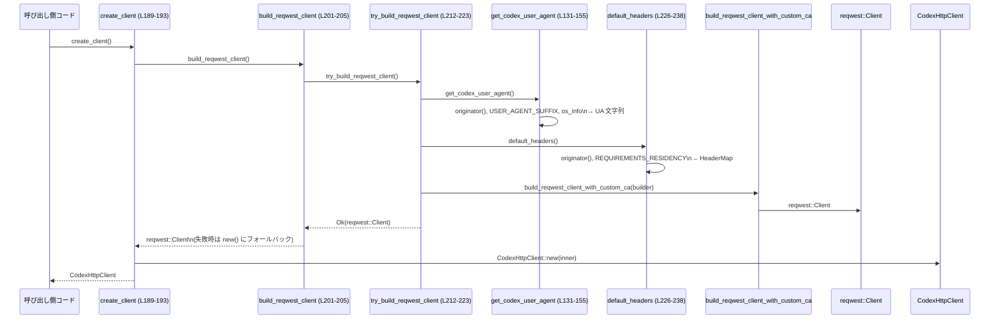

# login/src/auth/default_client.rs

## 0. ざっくり一言

Codex 用の HTTP クライアント（`reqwest::Client` / `CodexHttpClient`）を、共通の `User-Agent`・`originator` ヘッダー・任意の residency ヘッダー・カスタム CA 設定付きで構築するためのモジュールです（`crate::default_client` / `codex_login::default_client` からの利用を想定）（`login/src/auth/default_client.rs:L1-5`）。

---

## 1. このモジュールの役割

### 1.1 概要

- Codex クライアントが共通して使う HTTP 設定（`User-Agent` 文字列・`originator` ヘッダー・residency ヘッダー）を一元的に生成します（`L33-36`,`L40-47`,`L226-238`）。
- `reqwest::Client` に対して Codex 固有の CA 設定（`CODEX_CA_CERTIFICATE` / `SSL_CERT_FILE`）を適用しつつ、失敗時にはロギングの上で通常のクライアントにフォールバックする「デフォルトクライアント」を構築します（`L195-205`,`L212-224`）。
- プロセス単位のグローバル設定として、`originator` や residency 要件、`User-Agent` のサフィックスを管理します（`L33-36`,`L45-47`,`L91-97`）。

### 1.2 アーキテクチャ内での位置づけ

主な依存関係とデータの流れを図示します。

```mermaid
graph TD
  subgraph This file
    UA[get_codex_user_agent (L131-155)]
    Orig[originator (L99-118)]
    Headers[default_headers (L226-238)]
    TryC[try_build_reqwest_client (L212-223)]
    BuildC[build_reqwest_client (L201-205)]
    CreateC[create_client (L190-193)]
  end

  subgraph External crates
    CodexClient[CodexHttpClient (codex_client)]
    CAHelper[build_reqwest_client_with_custom_ca (codex_client)]
    ResidReq[ResidencyRequirement (codex_config)]
    UAHelper[user_agent (codex_terminal_detection)]
    Reqwest[reqwest::Client]
  end

  CreateC --> BuildC --> TryC --> CAHelper --> Reqwest --> CodexClient
  UA --> TryC
  UAHelper --> UA
  Orig --> UA
  Orig --> Headers
  ResidReq --> Headers
```

- 呼び出し側コードは通常 `codex_login::default_client::create_client` または `build_reqwest_client` を起点に、このモジュールを利用します（`L189-205`）。
- `try_build_reqwest_client` が中心となり、`get_codex_user_agent`・`default_headers`・`build_reqwest_client_with_custom_ca` を組み合わせて `reqwest::Client` を構築します（`L212-224`）。
- グローバル設定は `LazyLock` + `Mutex` / `RwLock` で保持され、任意のスレッドから安全にアクセスできます（`L33`,`L45-47`）。

### 1.3 設計上のポイント

- **グローバル設定の集中管理**  
  - `USER_AGENT_SUFFIX`（`Mutex<Option<String>>`）、`ORIGINATOR`（`RwLock<Option<Originator>>`）、`REQUIREMENTS_RESIDENCY`（`RwLock<Option<ResidencyRequirement>>`）として、プロセス全体に影響する設定を保持します（`L33`,`L45-47`）。
- **環境変数によるオーバーライド**  
  - `originator` は `CODEX_INTERNAL_ORIGINATOR_OVERRIDE_ENV_VAR` 環境変数があればそれを優先し、なければコード側の設定・デフォルトを使う構造になっています（`L35`,`L55-60`,`L99-118`）。
  - sandbox 環境検出は `CODEX_SANDBOX=seatbelt` という環境変数で行います（`L241-242`）。
- **ヘッダー安全性の確保**  
  - `User-Agent` は `sanitize_user_agent` で HTTP ヘッダーとして不正な文字を除去／置換し、最終的に必ず `HeaderValue` として受理される値にフォールバックします（`L131-155`,`L162-187`）。
  - `originator` ヘッダーも `HeaderValue::from_str` による検証を通してから利用されます（`L55-73`,`L76-79`）。
- **エラーハンドリング方針**  
  - `set_default_originator` は `Result` でバリデーションエラーや初期化済みエラーを返しますが、クライアント構築系 (`build_reqwest_client`) は互換性維持のため、失敗してもログを出して標準クライアントにフォールバックする設計です（`L76-89`,`L195-205`）。
- **並行性**  
  - すべてのグローバル可変状態は `Mutex` / `RwLock` 越しにアクセスされており、このファイル内には `unsafe` ブロックはありません（`L14-16`,`L33`,`L45-47`）。
  - ロックが poison された場合は、`set_default_originator` では `AlreadyInitialized` とみなされ、residency 設定では警告ログを出して設定をスキップする挙動になっています（`L81-83`,`L91-97`）。

---

## 2. 主要な機能一覧

- デフォルト originator の設定・取得: `set_default_originator`, `originator`（`L76-89`,`L99-118`）
- first-party originator 判定ユーティリティ: `is_first_party_originator`, `is_first_party_chat_originator`（`L120-129`）
- Codex 用 `User-Agent` 文字列生成とサニタイズ: `get_codex_user_agent`, `sanitize_user_agent`（`L131-155`,`L162-187`）
- residency 要件設定とヘッダー生成: `set_default_client_residency_requirement`, `default_headers`（`L91-97`,`L226-238`）
- サンドボックス環境検出: `is_sandboxed`（`L241-242`）
- Codex 用 HTTP クライアント構築:
  - `try_build_reqwest_client`: 失敗を返す詳細版（`L212-223`）
  - `build_reqwest_client`: ログ + フォールバック付きの infallible ラッパー（`L201-205`）
  - `create_client`: `CodexHttpClient` ラッパーの生成（`L189-193`）
- 再公開 API:
  - `CodexRequestBuilder`（`L9`）
  - `ResidencyRequirement`（`L38`）

---

## 3. 公開 API と詳細解説

### 3.0 コンポーネント一覧（インベントリー）

主な型・定数・関数の一覧です。

| 名前 | 種別 | 公開 | 役割 / 用途 | 定義位置 |
|------|------|------|------------|----------|
| `USER_AGENT_SUFFIX` | `static LazyLock<Mutex<Option<String>>>` | `pub` | `User-Agent` に付与するサフィックスをプロセス全体で保持する | `login/src/auth/default_client.rs:L18-33` |
| `DEFAULT_ORIGINATOR` | `const &str` | `pub` | デフォルトの originator 文字列 (`"codex_cli_rs"`) | `L34` |
| `CODEX_INTERNAL_ORIGINATOR_OVERRIDE_ENV_VAR` | `const &str` | `pub` | originator を上書きする内部用環境変数名 | `L35` |
| `RESIDENCY_HEADER_NAME` | `const &str` | `pub` | residency ヘッダー名 (`"x-openai-internal-codex-residency"`) | `L36` |
| `ResidencyRequirement` | 型再公開 | `pub use` | residency 要件（例: `Us`）を表す enum を他 crate から再公開 | `L38` |
| `Originator` | `struct` | `pub` | originator の文字列表現と、対応する `HeaderValue` を保持 | `L40-44` |
| `ORIGINATOR` | `static LazyLock<RwLock<Option<Originator>>>` | `crate` 内 | デフォルト originator をキャッシュするグローバル | `L45` |
| `REQUIREMENTS_RESIDENCY` | `static LazyLock<RwLock<Option<ResidencyRequirement>>>` | `crate` 内 | デフォルト residency 要件をキャッシュするグローバル | `L46-47` |
| `SetOriginatorError` | `enum` | `pub` | `set_default_originator` のエラー種別 | `L49-53` |
| `CodexRequestBuilder` | 型再公開 | `pub use` | Codex 用リクエストビルダ型を他 crate から再公開（挙動詳細はこのチャンクには現れません） | `L9` |
| `get_originator_value` | 関数 | private | env / 引数 / デフォルトから `Originator` を構築する共通処理 | `L55-74` |
| `set_default_originator` | 関数 | `pub` | プロセス全体のデフォルト originator を 1 度だけ設定する | `L76-89` |
| `set_default_client_residency_requirement` | 関数 | `pub` | デフォルトの residency 要件を設定する | `L91-97` |
| `originator` | 関数 | `pub` | 現在有効な originator を取得（必要に応じて初期化・キャッシュ） | `L99-118` |
| `is_first_party_originator` | 関数 | `pub` | originator が first-party クライアントかどうかを判定 | `L120-125` |
| `is_first_party_chat_originator` | 関数 | `pub` | first-party のチャット originator かどうかを判定 | `L127-129` |
| `get_codex_user_agent` | 関数 | `pub` | Codex 用の `User-Agent` 文字列を構築し、サニタイズする | `L131-155` |
| `sanitize_user_agent` | 関数 | private | `User-Agent` 文字列の検証とサニタイズ・フォールバックを行う | `L162-187` |
| `create_client` | 関数 | `pub` | デフォルト設定付き `CodexHttpClient` を生成する | `L189-193` |
| `build_reqwest_client` | 関数 | `pub` | 失敗時にログ＆フォールバックするデフォルト `reqwest::Client` 構築関数 | `L201-205` |
| `try_build_reqwest_client` | 関数 | `pub` | CA ロード失敗などを `Result` で返す、詳細版クライアント構築関数 | `L212-223` |
| `default_headers` | 関数 | `pub` | `originator` と residency 要件を含むデフォルトヘッダーを生成 | `L226-238` |
| `is_sandboxed` | 関数 | private | sandbox 環境かどうかを `CODEX_SANDBOX` 環境変数で判定 | `L241-242` |
| `tests` | モジュール | `cfg(test)` | テストコード（中身はこのチャンクには現れません） | `L245-247` |

### 3.1 型一覧（構造体・列挙体など）

| 名前 | 種別 | 役割 / 用途 | 主なフィールド / バリアント | 定義位置 |
|------|------|-------------|-----------------------------|----------|
| `Originator` | 構造体 | originator の文字列と HTTP ヘッダー値をまとめて保持する | `value: String`（文字列表現）、`header_value: HeaderValue`（ヘッダー用に検証済みの値） | `L40-44` |
| `SetOriginatorError` | 列挙体 | `set_default_originator` の失敗理由を表現する | `InvalidHeaderValue`, `AlreadyInitialized` | `L49-53` |
| `ResidencyRequirement` | 列挙体（再公開） | residency 要件（例: `Us`）を表す。定義は `codex_config` 内で行われ、このファイルには現れません | 現時点では `Us` のみがマッチ アームに現れる | `L38`,`L233-235` |

---

### 3.2 関数詳細（重要な 7 件）

#### `set_default_originator(value: String) -> Result<(), SetOriginatorError>`

**概要**

- グローバルなデフォルト originator を 1 度だけ設定する関数です（`L76-89`）。
- HTTP ヘッダーとして不正な値は拒否し、すでに設定済みの場合はエラーを返します。

**引数**

| 引数名 | 型 | 説明 |
|--------|----|------|
| `value` | `String` | 設定したい originator の文字列（環境変数による上書きがある場合は後述） |

**戻り値**

- `Ok(())` : 設定に成功した場合。
- `Err(SetOriginatorError)` : ヘッダーとして不正な値、またはすでに初期化済み・ロック取得失敗などの場合（`L49-53`,`L76-86`）。

**内部処理の流れ**

1. `HeaderValue::from_str(&value)` で、引数 `value` が HTTP ヘッダーとして有効か検証する。無効なら `InvalidHeaderValue` を返す（`L76-79`）。
2. `get_originator_value(Some(value))` を呼び出し、環境変数 `CODEX_INTERNAL_ORIGINATOR_OVERRIDE_ENV_VAR` を考慮した `Originator` を構築する（`L55-60`,`L80`）。
   - このとき、環境変数が設定されていれば、引数 `value` よりも環境変数の値が優先されます（`L55-60`）。
3. グローバル静的 `ORIGINATOR` の書き込みロックを取得する。ロック取得に失敗した場合（lock が poison された場合も含む）は `AlreadyInitialized` を返す（`L81-83`）。
4. ロック中に `guard.is_some()` で既に originator が設定されているかを確認し、設定済みであれば `AlreadyInitialized` を返す（`L84-86`）。
5. 未設定であれば `*guard = Some(originator);` により値を格納し、`Ok(())` を返す（`L87-88`）。

**Examples（使用例）**

基本的な設定例です（エラー処理込み）。

```rust
use codex_login::default_client::{
    set_default_originator,
    SetOriginatorError,
};

fn init_originator() -> Result<(), SetOriginatorError> {
    // "my_tool" を originator として登録する
    set_default_originator("my_tool".to_string())?;
    Ok(())
}
```

**Errors / Panics**

- `Err(SetOriginatorError::InvalidHeaderValue)`  
  - 引数 `value` が `HeaderValue::from_str(&value)` でエラーとなった場合（`L76-79`）。
- `Err(SetOriginatorError::AlreadyInitialized)`  
  - `ORIGINATOR.write()` のロック取得に失敗した場合（poison など）（`L81-83`）。  
  - あるいは、`ORIGINATOR` にすでに値が入っている場合（`L84-86`）。
- panic  
  - この関数内には `unwrap` や `expect` はなく、明示的な `panic!` もありません。ロックやヘッダー変換の失敗は `Result` で処理されています。

**Edge cases（エッジケース）**

- 環境変数 `CODEX_INTERNAL_ORIGINATOR_OVERRIDE_ENV_VAR` が設定されている場合、`get_originator_value` は引数 `value` よりも環境変数を優先します（`L55-60`）。  
  → `set_default_originator` の呼び出し側が指定した値が実際には使われない可能性があります。
- ロックが poison されている場合、`ORIGINATOR.write()` が `Err` を返し、`AlreadyInitialized` と同一視されます（`L81-83`）。  
  実際には「初期化済み」ではなく「ロック失敗」であっても区別されません。
- 2 回目以降の呼び出しは常に `AlreadyInitialized` になる設計です（`L84-86`）。

**使用上の注意点**

- originator を変更する必要がある場合でも、一度 `set_default_originator` で設定した後は再度変更できません。プロセス起動時など、早いタイミングで一度だけ呼ぶ前提の API です。
- 内部で `get_originator_value` を利用しているため、運用環境で `CODEX_INTERNAL_ORIGINATOR_OVERRIDE_ENV_VAR` が設定されていると、コードから渡した `value` は無視されます（`L55-60`,`L80`）。
- ロック poison により `AlreadyInitialized` が返っているケースもあり得るため、「本当に初期化済みかどうか」を厳密には判別できません。

---

#### `originator() -> Originator`

**概要**

- 現在有効な originator を取得する関数です（`L99-118`）。
- すでに `ORIGINATOR` にキャッシュされていればそれを返し、なければ環境変数とデフォルトから構築します。

**引数**

- 引数なし。

**戻り値**

- `Originator` 構造体。`value` は文字列表現、`header_value` は HTTP ヘッダーとして検証済みの値です（`L40-44`）。

**内部処理の流れ**

1. `ORIGINATOR.read()` で読み取りロックを試み、`Some(originator)` が格納されていればそれをクローンして返す（`L99-104`）。
2. まだキャッシュされておらず、環境変数 `CODEX_INTERNAL_ORIGINATOR_OVERRIDE_ENV_VAR` が設定されている場合:
   1. `get_originator_value(None)` で env / デフォルトに基づく `Originator` を構築（`L55-60`,`L106-108`）。
   2. `ORIGINATOR.write()` で書き込みロックを取得できれば、未設定なら `Some(originator.clone())` を設定し、すでに設定済みならそれを返す（`L108-113`）。
   3. いずれにしても、この分岐では originator を返します（`L107-115`）。
3. 環境変数が未設定の場合は、`get_originator_value(None)` を呼び出して、その結果をそのまま返します（キャッシュはしません）（`L116-117`）。

**Examples（使用例）**

```rust
use codex_login::default_client::originator;

fn log_originator() {
    let orig = originator();
    // value はロギング用途などに利用できる
    println!("originator = {}", orig.value);
}
```

**Errors / Panics**

- `originator` 自体は `Result` を返さず、ロック取得失敗（poison）時も単にキャッシュ処理をスキップする構造になっています（`if let Ok(guard) = ...` パターン、`L99-104`,`L108-113`）。
- `get_originator_value` 内で `HeaderValue::from_str` が失敗した場合は、ログ出力後に `DEFAULT_ORIGINATOR` にフォールバックするため、panic にはなりません（`L61-73`）。

**Edge cases（エッジケース）**

- 読み取りロック / 書き込みロックがどちらも失敗した場合でも、`get_originator_value` の戻り値は返されるため、originator 自体は取得できますが、キャッシュされないことがあります（`L99-104`,`L108-113`）。
- 環境変数が未設定な場合は、毎回 `get_originator_value(None)` が呼ばれ、結果がキャッシュされないため、その都度環境変数参照と `HeaderValue` 変換を行います（`L116-117`）。

**使用上の注意点**

- `originator` の値を変更したい場合は、`set_default_originator` を用いますが、`originator()` はキャッシュを参照するため、`set_default_originator` の呼び出しタイミングよりも後に呼び出す必要があります。
- 環境変数 `CODEX_INTERNAL_ORIGINATOR_OVERRIDE_ENV_VAR` を利用する設計の場合、コードからの設定より常に優先されることに注意が必要です（`L55-60`,`L106-107`）。

---

#### `get_codex_user_agent() -> String`

**概要**

- Codex 用の `User-Agent` 文字列を構築し、HTTP ヘッダーとして有効になるようにサニタイズして返します（`L131-155`）。
- originator・パッケージバージョン・OS 情報・端末由来の `user_agent()`・グローバルサフィックス `USER_AGENT_SUFFIX` を組み合わせます。

**引数**

- 引数なし。

**戻り値**

- サニタイズ済みの `User-Agent` 文字列（`sanitize_user_agent` を通過した値）（`L153-155`）。

**内部処理の流れ**

1. `env!("CARGO_PKG_VERSION")` からビルド時に埋め込まれたパッケージバージョンを取得（`L132`）。
2. `os_info::get()` で OS の種別・バージョン・アーキテクチャ情報を取得（`L133`,`L136-141`）。
3. `originator()` を呼び出し、`Originator` の `value` を取得（`L134`,`L40-44`）。
4. これらをもとに `prefix` 文字列を組み立てる（例: `codex_cli_rs/1.2.3 (OS VERSION; ARCH) <terminal_ua>`）（`L135-142`）。
5. `USER_AGENT_SUFFIX.lock().ok().and_then(|guard| guard.clone())` でグローバルサフィックスを取得し、空白・空文字を取り除いたうえで、存在すれば `" (...)"` 形式で `suffix` を構築（`L143-151`）。
6. `candidate = format!("{prefix}{suffix}")` で最終候補文字列を作り、`sanitize_user_agent(candidate, &prefix)` でサニタイズとフォールバックを行う（`L153-155`）。

**Examples（使用例）**

`User-Agent` をログに出力する例です。

```rust
use codex_login::default_client::get_codex_user_agent;

fn debug_ua() {
    let ua = get_codex_user_agent();
    println!("Codex UA = {}", ua);
}
```

**Errors / Panics**

- `USER_AGENT_SUFFIX.lock()` でロック取得に失敗した場合は `ok()` により `None` と見なされ、サフィックスが付与されないだけになります（`L143-147`）。
- `sanitize_user_agent` の中で `HeaderValue::from_str` が利用されますが、失敗時はフォールバック処理が行われるため panic は発生しません（`L162-187`）。

**Edge cases（エッジケース）**

- `USER_AGENT_SUFFIX` に制御文字や非 ASCII 文字が含まれている場合、`sanitize_user_agent` で `' '..='~'` 以外の文字は `_` に置き換えられます（`L167-170`）。
- `user_agent()` や OS 情報に起因して `prefix` が不正な場合でも、`fallback` として `prefix` を再検証し、それも不正なら最終的に `originator().value` にフォールバックします（`L176-185`）。

**使用上の注意点**

- `USER_AGENT_SUFFIX` はプロセスグローバルであり、複数スレッド・複数クライアントで共有されます。そのため、サフィックスの変更はすべての新規クライアントの UA に影響します。
- UA の形式はここで固定されており、変更するとサーバ側の解析ロジックなどに影響する可能性があります。そのため、変更する場合は互換性への影響を確認する必要があります。

---

#### `sanitize_user_agent(candidate: String, fallback: &str) -> String`

**概要**

- `candidate` 文字列が HTTP ヘッダーとして有効か検証し、不正な場合はサニタイズおよびフォールバックを行う内部用ユーティリティ関数です（`L162-187`）。

**引数**

| 引数名 | 型 | 説明 |
|--------|----|------|
| `candidate` | `String` | 検証対象の `User-Agent` 文字列候補 |
| `fallback` | `&str` | サニタイズ後も不正な場合に利用する代替文字列（通常は `prefix`） |

**戻り値**

- HTTP ヘッダーとして有効と `HeaderValue::from_str` が判断する文字列。`candidate`／サニタイズ後／`fallback`／`originator().value` のいずれかになります（`L162-187`）。

**内部処理の流れ**

1. `HeaderValue::from_str(candidate.as_str())` が成功すれば、そのまま `candidate` を返す（`L163-165`）。
2. 失敗した場合、`candidate.chars()` で 1 文字ずつ走査し、`' '..='~'`（ASCII の可視文字）でない文字を `_` に置き換えた `sanitized` を構築する（`L167-170`）。
3. `sanitized` が空でなく、かつ `HeaderValue::from_str(sanitized.as_str())` が成功した場合:
   - 警告ログを出力し、`sanitized` を返す（`L171-175`）。
4. それでも失敗した場合、`fallback` が `HeaderValue` として有効なら:
   - 警告ログを出力し、`fallback.to_string()` を返す（`L176-180`）。
5. `fallback` も不正な場合、警告ログを出して `originator().value` を返す（`L181-186`）。

**Examples（使用例）**

内部利用専用ですが、イメージとしての呼び出しです。

```rust
use codex_login::default_client::get_codex_user_agent;

// 実際には get_codex_user_agent 内からのみ利用されている
fn example() {
    let ua = get_codex_user_agent();
    println!("{}", ua);
}
```

**Errors / Panics**

- すべての分岐で `HeaderValue::from_str` の結果を `is_ok()` で検査しており、エラーは panic ではなく制御フローで扱っています（`L162-187`）。
- `originator()` の呼び出しも panic しない設計のため（前述）、この関数は panic しません。

**Edge cases（エッジケース）**

- `candidate` が空文字の場合でも、`sanitized` が空のため `fallback` → `originator().value` にフォールバックする可能性があります（`L167-186`）。
- `candidate` に改行文字やタブ・非 ASCII 文字が含まれている場合は、すべて `_` に置き換えられます（`L167-170`）。

**使用上の注意点**

- セキュリティの観点では、`User-Agent` に制御文字や改行を混入させてヘッダーインジェクションを試みるような入力に対しても、ここで `_` に置き換えられるため、安全性が高まっています。
- `fallback` も最終的に不正であれば `originator().value` に落ちるため、`originator().value` が常に `HeaderValue` として有効であることが前提になります（`get_originator_value` の実装により担保されています、`L61-73`）。

---

#### `try_build_reqwest_client() -> Result<reqwest::Client, BuildCustomCaTransportError>`

**概要**

- Codex 用のデフォルト `reqwest::Client` を構築し、カスタム CA ロードなどの失敗を `Result` で返す関数です（`L212-223`）。
- `BuildCustomCaTransportError` 型のエラーを利用しており、詳細なエラー内容が必要な呼び出し側向けの API です。

**引数**

- 引数なし。

**戻り値**

- `Ok(reqwest::Client)` : 正常に Codex 用クライアントを構築できた場合。
- `Err(BuildCustomCaTransportError)` : カスタム CA 適用など構築処理中にエラーが発生した場合（`L223`）。

**内部処理の流れ**

1. `get_codex_user_agent()` で UA 文字列を取得（`L213`）。
2. `reqwest::Client::builder()` でビルダーを構築し、以下を設定（`L215-218`）:
   - `.user_agent(ua)` : UA を設定。ヘッダー値としては既に `sanitize_user_agent` により検証済み（`L131-155`）。
   - `.default_headers(default_headers())` : originator / residency ヘッダーを設定（`L226-238`）。
3. `is_sandboxed()` が `true` の場合は `builder = builder.no_proxy()` でプロキシを無効化（`L219-221`,`L241-242`）。
4. 最後に `build_reqwest_client_with_custom_ca(builder)` を呼び出して、カスタム CA 環境変数に応じたクライアントを構築する（`L223`）。

**Examples（使用例）**

```rust
use codex_login::default_client::try_build_reqwest_client;

fn main() -> Result<(), Box<dyn std::error::Error>> {
    let client = try_build_reqwest_client()?; // エラー内容を詳細に扱いたい場合
    // ここで reqwest::Client を利用した処理を行う（詳細はこのチャンクには現れません）
    Ok(())
}
```

**Errors / Panics**

- `BuildCustomCaTransportError` の詳細は `codex_client` クレート側にあり、このチャンクには現れませんが、カスタム CA の読み込みや `reqwest::Client` 構築に起因するエラーと推測できます（根拠: 関数名とコメント `L208-211`）。
- 関数内で `unwrap` / `expect` は使用されていないため、この関数自体は panic しません。

**Edge cases（エッジケース）**

- `default_headers()` が空の `HeaderMap` を返すケース（residency 未設定など）は、単にヘッダーが付かないだけでエラーにはなりません（`L226-238`）。
- `is_sandboxed()` は `CODEX_SANDBOX=seatbelt` のケースのみ `true` になり、それ以外はプロキシ設定がそのまま利用されます（`L241-242`）。

**使用上の注意点**

- 失敗理由を呼び出し側で扱いたい場合は、この `try_*` 関数を利用し、エラーをログや UI に表示することができます。
- フォールバックを伴う `build_reqwest_client` と違い、ここではエラーがそのまま表に出るため、呼び出し側で必ず `Result` を処理する必要があります。

---

#### `build_reqwest_client() -> reqwest::Client`

**概要**

- Codex 用デフォルト `reqwest::Client` の「失敗しない」ラッパー関数です（`L201-205`）。
- `try_build_reqwest_client` での構築に失敗した場合、警告ログを出力した上で `reqwest::Client::new()` にフォールバックします。

**引数**

- 引数なし。

**戻り値**

- 常に `reqwest::Client` を返します。CA 設定が反映されているかどうかは内部処理の結果によります（`L201-205`）。

**内部処理の流れ**

1. `try_build_reqwest_client()` を呼び出す（`L202`）。
2. `unwrap_or_else(|error| { ... })` でエラーを捕捉し、次の処理を行う（`L202-205`）:
   - `tracing::warn!(error = %error, "failed to build default reqwest client");` で警告ログを出力。
   - `reqwest::Client::new()` を返してフォールバック。

**Examples（使用例）**

```rust
use codex_login::default_client::build_reqwest_client;

fn main() {
    // 失敗時も panic せず、標準設定のクライアントが返る
    let client = build_reqwest_client();
    // ここで client を利用する
}
```

**Errors / Panics**

- `try_build_reqwest_client` のエラーは `unwrap_or_else` により握りつぶされるため、呼び出し側に `Result` は返されません（`L202-205`）。
- `reqwest::Client::new()` が panic する可能性はここからは読み取れませんが、一般的には panic しない想定のコンストラクタです（仕様詳細はこのチャンクには現れません）。

**Edge cases（エッジケース）**

- カスタム CA の設定に失敗した場合でも、プロキシ設定など一部は期待通りにならない可能性がありますが、HTTP クライアント自体は必ず返ります。

**使用上の注意点**

- 「カスタム CA が必ず設定されている」ことを前提とした設計を行うと、このフォールバック挙動のために期待外れの接続先が利用される可能性があります。
- そのような厳密な要件がある場合は、`try_build_reqwest_client` を使い、エラー時にはクライアント生成自体を中止する方が安全です。

---

#### `default_headers() -> HeaderMap`

**概要**

- Codex 用 HTTP リクエストに付与するデフォルトヘッダーを構築します（`L226-238`）。
- `originator` ヘッダーと、必要なら residency ヘッダー（`x-openai-internal-codex-residency`）を追加します。

**引数**

- 引数なし。

**戻り値**

- `HeaderMap` : `originator` および必要に応じて residency ヘッダーがセットされたマップ（`L226-238`）。

**内部処理の流れ**

1. `HeaderMap::new()` で空のヘッダーマップを作成（`L227`）。
2. `originator().header_value` を取得し、`"originator"` というキーで挿入（`L228`）。
3. residency 要件について:
   - `REQUIREMENTS_RESIDENCY.read()` で読み取りロックを取得し（`L229`）、
   - `Some(requirement)` が格納されていて、かつ既に residency ヘッダーが入っていなければ（`!headers.contains_key(RESIDENCY_HEADER_NAME)`）、`match` で具体値に応じたヘッダー値を設定（`L229-236`）。
   - 現状のコードでは `ResidencyRequirement::Us` のみが存在し、値 `"us"` を挿入しています（`L233-235`）。
4. 完成した `headers` を返す（`L238`）。

**Examples（使用例）**

```rust
use codex_login::default_client::{default_headers, set_default_client_residency_requirement, ResidencyRequirement};

fn example() {
    set_default_client_residency_requirement(Some(ResidencyRequirement::Us));
    let headers = default_headers();
    // headers["originator"] / headers["x-openai-internal-codex-residency"] などにアクセスできる
}
```

**Errors / Panics**

- `REQUIREMENTS_RESIDENCY.read()` でロック取得に失敗した場合は `if let Ok(guard) = ...` が成立せず、単に residency ヘッダーが追加されないだけになります（`L229-232`）。
- `originator()` および `HeaderValue::from_static("us")` は panic しない設計となっており、この関数内での panic 要因は見当たりません（`L61-73`,`L233-235`）。

**Edge cases（エッジケース）**

- `set_default_client_residency_requirement(None)` を設定すると、以後の `default_headers()` では residency ヘッダーが付与されません（`L91-97`,`L229-236`）。
- ヘッダー挿入前に外側で `HeaderMap` を用意して `RESIDENCY_HEADER_NAME` をすでにセットしている場合、この関数の単独利用ではその状態は想定されていませんが、内部では `!headers.contains_key(...)` をチェックしているため、二重挿入はしない構造になっています（`L231`）。この `headers` はこの関数内で新規に作られているため、実際には常に未設定です。

**使用上の注意点**

- residency 要件を必ず付与したい場合は、`default_headers()` を呼び出す前に `set_default_client_residency_requirement(Some(...))` を行っておく必要があります。
- グローバルな `REQUIREMENTS_RESIDENCY` はプロセス全体の挙動に影響するため、テストコードなどで一時的に変更した場合は元に戻すなどの考慮が必要です。

---

#### `create_client() -> CodexHttpClient`

**概要**

- `build_reqwest_client` で構築した `reqwest::Client` を `CodexHttpClient::new(inner)` でラップし、Codex 専用クライアントを作る関数です（`L189-193`）。

**引数**

- 引数なし。

**戻り値**

- `CodexHttpClient` : 詳細は `codex_client` クレートに定義されており、このチャンクには現れません（`L8`,`L190-193`）。

**内部処理の流れ**

1. `build_reqwest_client()` を呼び、デフォルト設定付き `reqwest::Client` を取得（`L191`）。
2. `CodexHttpClient::new(inner)` を呼び出し、ラップして返す（`L192`）。

**Examples（使用例）**

```rust
use codex_login::default_client::create_client;

fn main() {
    let client = create_client();
    // client を使って Codex へのリクエストを送る（具体的な API はこのチャンクには現れません）
}
```

**Errors / Panics**

- `build_reqwest_client` はエラー時もフォールバックするため、`create_client` は `Result` を返しません（`L189-193`,`L201-205`）。
- `CodexHttpClient::new` の振る舞い（panic の有無）はこのチャンクには現れません。

**使用上の注意点**

- CA 設定の失敗など、`build_reqwest_client` 内部で発生したエラーはログに記録されるだけで呼び出し側に伝搬しないため、厳密な証明書検証要件がある場合は `try_build_reqwest_client` と `CodexHttpClient::new` を直接組み合わせる必要があります（後者の存在はこのチャンクからは読み取れませんが、`create_client` の構造から推測されます、`L190-193`）。

---

### 3.3 その他の関数

| 関数名 | 公開 | 役割（1 行） | 定義位置 |
|--------|------|--------------|----------|
| `set_default_client_residency_requirement(enforce_residency: Option<ResidencyRequirement>)` | `pub` | デフォルトの residency 要件をグローバルに設定する（ロック取得失敗時は警告ログのみ） | `L91-97` |
| `is_first_party_originator(originator_value: &str) -> bool` | `pub` | originator が `"codex_cli_rs"`, `"codex-tui"`, `"codex_vscode"`, `"Codex "` プレフィックスのいずれかか判定する | `L120-125` |
| `is_first_party_chat_originator(originator_value: &str) -> bool` | `pub` | originator が `"codex_atlas"` または `"codex_chatgpt_desktop"` かどうかを判定する | `L127-129` |
| `get_originator_value(provided: Option<String>) -> Originator` | private | env / 引数 / デフォルトから `Originator` を構築し、ヘッダーバリデーション・フォールバックを行う | `L55-74` |
| `is_sandboxed() -> bool` | private | `CODEX_SANDBOX` 環境変数が `"seatbelt"` の場合に `true` を返す | `L241-242` |

---

## 4. データフロー

### 4.1 代表的な処理シナリオ：クライアント構築

`create_client` 呼び出しから、実際に `reqwest::Client` が構築されるまでの流れです。



- `User-Agent` は常に `get_codex_user_agent` 経由で構築・サニタイズされます（`L131-155`,`L162-187`）。
- `originator` ヘッダーは `default_headers` 内でのみ挿入され、クライアント構築時点の `ORIGINATOR` / 環境変数設定に依存します（`L226-238`）。
- residency ヘッダーは `set_default_client_residency_requirement` により事前に設定されていれば付与されます（`L91-97`,`L226-237`）。
- `build_reqwest_client_with_custom_ca` の詳細なデータフローは `codex_client` クレート側にあり、このチャンクには現れません。

---

## 5. 使い方（How to Use）

### 5.1 基本的な使用方法

最小限の設定で Codex クライアントを作る例です。

```rust
use codex_login::default_client::create_client;

fn main() {
    // デフォルト設定（DEFAULT_ORIGINATOR, residency 未指定等）でクライアントを生成する
    let client = create_client();

    // ここで client を使って Codex への HTTP 通信を行う
    // （CodexHttpClient の具体的なメソッドはこのチャンクには現れません）
}
```

### 5.2 よくある使用パターン

#### 5.2.1 originator の明示的設定 + residency 要件設定

```rust
use codex_login::default_client::{
    set_default_originator,
    set_default_client_residency_requirement,
    ResidencyRequirement,
    create_client,
};

fn main() -> Result<(), Box<dyn std::error::Error>> {
    // プロセス起動時に一度だけ originator を設定する
    set_default_originator("my_cli_tool".to_string())?;

    // 全クライアントに対して US residency を要求する
    set_default_client_residency_requirement(Some(ResidencyRequirement::Us));

    // これ以降に作成されるクライアントには、上記の設定が反映される
    let client = create_client();

    Ok(())
}
```

- `set_default_originator` は 1 度しか成功しないため、アプリケーション初期化時に呼ぶのが自然です（`L76-89`）。
- residency は `Option` のため、必要に応じて `Some(...)` / `None` を切り替えできます（`L91-97`）。

#### 5.2.2 User-Agent サフィックスの設定

`USER_AGENT_SUFFIX` は `Mutex<Option<String>>` として公開されているため、直接書き換えます（`L33`）。

```rust
use std::ops::DerefMut;
use codex_login::default_client::{USER_AGENT_SUFFIX, get_codex_user_agent};

fn main() {
    {
        // lock を取り、User-Agent サフィックスを設定する
        let mut guard = USER_AGENT_SUFFIX.lock().expect("suffix lock poisoned");
        *guard.deref_mut() = Some("my-feature".to_string());
    } // ロックはここで解放される

    let ua = get_codex_user_agent();
    println!("UA = {}", ua); // ここに " (my-feature)" が含まれる
}
```

- `get_codex_user_agent` 呼び出し時の値が利用されるため、クライアントを作る前にサフィックスを設定する必要があります（`L143-151`）。

### 5.3 よくある間違い

```rust
use codex_login::default_client::set_default_originator;

// 間違い例: 初期化タイミングを複数箇所に分散させている
fn init_a() {
    let _ = set_default_originator("tool_a".to_string());
}
fn init_b() {
    let _ = set_default_originator("tool_b".to_string()); // ここは AlreadyInitialized になる
}

// 正しい例: プロセス初期化の単一箇所で設定する
fn init() {
    let _ = set_default_originator("tool_a".to_string());
}
```

- `set_default_originator` は 2 回目以降は `AlreadyInitialized` となるため、「最後に呼んだ方が勝つ」とはなりません（`L84-86`）。
- originator を切り替える必要がある設計ではなく、「プロセス全体で一意」の前提です。

### 5.4 使用上の注意点（まとめ）

- **グローバル状態の影響範囲**  
  - `USER_AGENT_SUFFIX`・`ORIGINATOR`・`REQUIREMENTS_RESIDENCY` はすべてプロセス全体に対して共有されます（`L33`,`L45-47`）。  
    テストやプラグインなどで一時的に変更する場合、元に戻さないと他のコードに影響します。
- **環境変数の優先順位**  
  - `CODEX_INTERNAL_ORIGINATOR_OVERRIDE_ENV_VAR` が設定されていると、`set_default_originator` の引数よりもこの環境変数が優先されます（`L55-60`,`L80`,`L106-107`）。
  - sandbox 判定は `CODEX_SANDBOX=seatbelt` に依存し、この値以外では `is_sandboxed()` は `false` です（`L241-242`）。
- **セキュリティ / 安全性**  
  - `User-Agent` は `sanitize_user_agent` により、制御文字や非 ASCII を `_` に置き換えた上で検証・フォールバックされます（`L162-187`）。  
    これによりヘッダーインジェクションなどのリスクが低減しています。
  - `originator` と residency ヘッダーも、`HeaderValue::from_str` / `HeaderValue::from_static` を通じて安全な形式のみ利用しています（`L61-73`,`L233-235`）。
- **エラーとログ**  
  - originator 設定に関する失敗は `Result` で呼び出し側へ返却されますが（`L76-89`）、クライアント構築の失敗は `build_reqwest_client` 内でログに記録された後、フォールバックされるため、呼び出し側からは検出できません（`L201-205`）。
  - residency 設定のロック取得に失敗した場合は、警告ログを出して設定をスキップする挙動になっています（`L91-97`）。

---

## 6. 変更の仕方（How to Modify）

### 6.1 新しい機能を追加する場合

- **新しい residency 要件を追加する**  
  1. `codex_config::ResidencyRequirement` enum に新しいバリアントを追加する（このチャンクには定義が現れません）。  
  2. `default_headers` の `match requirement { ... }` に新しいバリアントを追加し、対応する `HeaderValue` を設定する（`L233-235`）。
- **first-party originator 判定の拡張**  
  - 新しい first-party クライアントが増えた場合:
    - `is_first_party_originator` / `is_first_party_chat_originator` に対応する文字列を追加する（`L120-125`,`L127-129`）。
- **User-Agent フォーマットの変更**  
  - 形式を変える場合は `get_codex_user_agent` 内の `format!` 呼び出しを編集します（`L135-142`）。  
  - 変更によりサーバ側の UA 解析やログ処理に影響する可能性があるため、互換性を確認する必要があります。

### 6.2 既存の機能を変更する場合の注意点

- **originator 関連**  
  - `get_originator_value` は env → 引数 → デフォルトの優先順位で値を決める契約になっており（`L55-60`）、この優先順位を変えると `set_default_originator` や `originator` の挙動が変わります。
  - `SetOriginatorError::AlreadyInitialized` はロック取得失敗も含むため（`L81-83`）、これを変更すると呼び出し側のエラー処理との整合性に注意が必要です。
- **クライアント構築のエラー処理**  
  - `build_reqwest_client` が「必ずクライアントを返す」ことを前提にしているコードが存在する可能性があります（`L201-205`）。  
    `Result` を返す API に切り替える場合は、呼び出し側全体の影響範囲を確認する必要があります。
- **ロックと並行性**  
  - `LazyLock` + `Mutex` / `RwLock` によるスレッドセーフな初期化・アクセスが行われているため（`L33`,`L45-47`）、これを別の機構（例: `static mut`）に置き換えると安全性に影響します。
- **テスト**  
  - このファイルには `#[cfg(test)] mod tests;` があり、`default_client_tests.rs` でテストが定義されていますが内容はこのチャンクには現れません（`L245-247`）。  
    挙動を変更した場合は、当該テストファイルの更新が必要です。

---

## 7. 関連ファイル

| パス / クレート | 役割 / 関係 |
|----------------|------------|
| `codex_client` クレート | `CodexHttpClient`, `CodexRequestBuilder`, `BuildCustomCaTransportError`, `build_reqwest_client_with_custom_ca` を提供。HTTP クライアントのラッパーと CA 設定ロジックの実装はこのクレート側にあります（`L7-10`,`L189-193`,`L212-224`）。 |
| `codex_config::ResidencyRequirement` | residency 要件 enum の定義。`default_headers` 内でヘッダー値にマッピングされます（`L38`,`L233-235`）。 |
| `codex_terminal_detection::user_agent` | 端末・環境依存の `User-Agent` 文字列を返すヘルパー。`get_codex_user_agent` で利用されています（`L11`,`L135-142`）。 |
| `os_info` クレート | OS 名・バージョン・アーキテクチャ情報を取得するために利用されています（`L133`,`L136-141`）。 |
| `login/src/auth/default_client_tests.rs` | `#[path = "default_client_tests.rs"]` で参照されるテストコード。内容はこのチャンクには現れませんが、このモジュールの挙動を検証するために利用されます（`L245-247`）。 |
| `crate::default_client` / `codex_login::default_client` | ドキュメントコメントによると、このモジュールはこれらのモジュール経由で他の crate から利用される想定です（`L1-5`）。 |

このドキュメントは、`login/src/auth/default_client.rs` 内に現れる情報のみに基づいており、その他のファイルやクレートについては、このチャンクから読み取れる範囲のみを記述しています。
