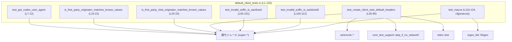
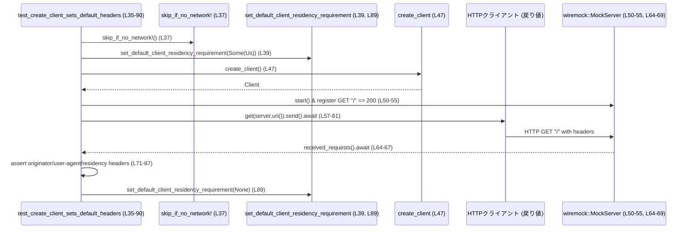

# login/src/auth/default_client_tests.rs

## 0. ざっくり一言

`default_client_tests.rs` は、認証まわりの「デフォルト HTTP クライアント」とユーザーエージェント関連の **公開 API の契約（ヘッダや文字列フォーマット、サニタイズ挙動）** を検証するテストをまとめたモジュールです（根拠: `default_client_tests.rs:L7-12, L15-22, L25-33, L35-90, L93-112, L116-124`）。

---

## 1. このモジュールの役割

### 1.1 概要

このモジュールは、親モジュール（`use super::*`）が提供する以下の機能の挙動をテストしています。

- Codex 用ユーザーエージェント文字列の生成 (`get_codex_user_agent`)（L7-12, L116-124）
- クライアント originator が「ファーストパーティ」かどうかの判定 (`is_first_party_originator`, `is_first_party_chat_originator`)（L15-22, L25-33）
- デフォルト HTTP クライアントのヘッダ設定 (`create_client`, `set_default_client_residency_requirement`, `RESIDENCY_HEADER_NAME`)（L35-90）
- ユーザーエージェント文字列のサニタイズ (`sanitize_user_agent`)（L93-112）

これにより、API 利用側から見た仕様（どんなヘッダが必ず付き、UA がどのようなフォーマット・制約を持つか）を固定化する役割を担っています。

### 1.2 アーキテクチャ内での位置づけ

このファイルは「テストモジュール」であり、親モジュール（`super`）の機能を呼び出して検証しています。主な依存関係は以下です。

- 親モジュール (`super::*`, `super::sanitize_user_agent`)（L1-2, L93-112）
- ネットワーク環境に応じたテストスキップヘルパー (`core_test_support::skip_if_no_network!`)（L3, L37）
- HTTP モックサーバ (`wiremock`) を用いたヘッダ検証（L41-55, L64-69）
- macOS 固有の UA フォーマット検証 (`regex_lite::Regex`)（L117-123）
- 非同期ランタイム (`#[tokio::test]`)（L35）

Mermaid 図でテストと依存先の関係を示すと、次のようになります。



### 1.3 設計上のポイント

コードから読み取れる設計上の特徴は以下です。

- **テストを通じて公開 API の契約を固定**
  - ユーザーエージェントのフォーマットやヘッダの有無など、「外部から観測できる仕様」をテストで明文化しています（L7-12, L35-90, L93-112, L116-124）。
- **HTTP クライアントの副作用的な設定を明示テスト**
  - `set_default_client_residency_requirement` 呼び出し → `create_client` → 発行されるリクエストヘッダ、という間接的な効果をテストしています（L39-40, L47-49, L64-87）。
- **OS 依存の挙動は条件付きテスト**
  - macOS 固有の UA フォーマット検証は `#[cfg(target_os = "macos")]` 付きテストに分離されています（L115-123）。
- **セキュリティを意識したサニタイズの検証**
  - UA 末尾に含まれる制御文字 `\r` や `\0` を `_` に置き換える挙動をテストしており、HTTP ヘッダインジェクションや不正文字の排除を前提とした設計であると解釈できます（根拠: L93-101, L103-112）。

---

## 2. コンポーネント一覧（関数・外部 API）

### 2.1 このファイル内で定義される関数

| 名前 | 種別 | 行範囲 | 役割 / 用途 |
|------|------|--------|-------------|
| `test_get_codex_user_agent` | テスト関数 (`#[test]`) | L7-12 | `get_codex_user_agent` の返す文字列が `originator().value + "/"` で始まることを検証します（L7-11）。 |
| `is_first_party_originator_matches_known_values` | テスト関数 | L15-22 | `is_first_party_originator` が既知の originator 文字列に対して true/false を期待通り返すことを検証します（L16-21）。 |
| `is_first_party_chat_originator_matches_known_values` | テスト関数 | L25-33 | チャット系 originator に対する `is_first_party_chat_originator` の振る舞いを検証します（L26-32）。 |
| `test_create_client_sets_default_headers` | 非同期テスト関数 (`#[tokio::test]`) | L35-90 | `create_client` が生成する HTTP クライアントのデフォルトヘッダ（`originator`, `user-agent`, `RESIDENCY_HEADER_NAME`）を検証します（L39-40, L47-49, L64-87）。 |
| `test_invalid_suffix_is_sanitized` | テスト関数 | L93-101 | `sanitize_user_agent` が UA サフィックス中の `\r` を `_` に置換することを検証します（L93-100）。 |
| `test_invalid_suffix_is_sanitized2` | テスト関数 | L103-112 | `sanitize_user_agent` が UA サフィックス中の `\0` を `_` に置換することを検証します（L103-111）。 |
| `test_macos` | テスト関数（macOS のみ） | L116-124 | macOS 上での UA 文字列フォーマットが特定の正規表現にマッチすることを検証します（L116-124）。 |

### 2.2 このファイルから利用される外部コンポーネント

> ※「定義元」は `use super::*` などから推測できる範囲で記載し、実際のファイルパスはこのチャンクには現れません。

| 名前 | 種別 | 定義元（推定） | 利用行 | 役割 / 契約（テストから読み取れるもの） |
|------|------|----------------|--------|----------------------------------------|
| `get_codex_user_agent()` | 関数 | 親モジュール (`super`) | L8, L78, L118 | Codex 用ユーザーエージェント文字列を返します。`originator().value + "/"` で始まり（L7-11）、macOS では OS 情報・アーキテクチャを含む特定フォーマットに従います（L116-123）。 |
| `originator()` | 関数 | 親モジュール | L9, L75, L119 | `value` フィールド（おそらく `String`/`&str`）を持つ構造体を返します。`value` が UA プレフィクスおよび `originator` ヘッダの値として利用されます（L9-11, L71-75, L118-120）。 |
| `DEFAULT_ORIGINATOR` | 定数 | 親モジュール | L16, L31 | デフォルトの originator 文字列。`is_first_party_originator` では true（L16）、`is_first_party_chat_originator` では false と期待されています（L31）。 |
| `is_first_party_originator(&str) -> bool` | 関数 | 親モジュール | L16-21 | 与えられた originator がファーストパーティクライアントかどうかを判定します（L16-21）。 |
| `is_first_party_chat_originator(&str) -> bool` | 関数 | 親モジュール | L26-32 | チャット系のファーストパーティクライアントかどうかを判定します（L26-32）。 |
| `ResidencyRequirement` | 列挙体（推定） | 親モジュール | L39 | `Us` バリアントが存在します。デフォルトクライアントに課すデータレジデンシ要件を表す型と解釈できます（L39-40, L84-87）。 |
| `set_default_client_residency_requirement(Option<ResidencyRequirement>)` | 関数 | 親モジュール | L39, L89 | デフォルトクライアントのレジデンシ要件を設定・リセットします。`Some(Us)` 設定後に作ったクライアントがレジデンシヘッダ `"us"` を付与することがテストされています（L39-40, L84-87）。 |
| `create_client()` | 関数 | 親モジュール | L47 | HTTP クライアントを生成します。このクライアントで送信したリクエストに、`originator`, `user-agent`, `RESIDENCY_HEADER_NAME` のデフォルトヘッダが付与されることがテストされています（L47-49, L64-87）。 |
| `RESIDENCY_HEADER_NAME` | 定数 | 親モジュール | L85 | レジデンシ要件を表す HTTP ヘッダ名。`set_default_client_residency_requirement(Some(Us))` 後は `"us"` が設定されることが期待されています（L84-87）。 |
| `sanitize_user_agent(String, &str) -> String` | 関数 | 親モジュール | L1, L98-100, L108-110 | ユーザーエージェント文字列をサニタイズします。少なくとも UA 内の `\r` と `\0` を `_` に置換する挙動が前提とされています（L93-101, L103-112）。 |
| `skip_if_no_network!` | マクロ | `core_test_support` | L37 | ネットワーク利用が許可されていない環境ではテストをスキップするためのマクロです（L3, L37）。 |
| `wiremock::{Mock, MockServer, ResponseTemplate, matchers}` | 型・関数 | `wiremock` クレート | L41-45, L50-55, L64-69 | ローカル HTTP モックサーバを立て、`create_client` が送るリクエストのヘッダを検証するために使用されています（L50-55, L64-69）。 |
| `regex_lite::Regex` | 型 | `regex_lite` クレート | L117, L120-123 | macOS UA フォーマットを正規表現で検証するための軽量正規表現ライブラリです（L117-123）。 |

---

## 3. 公開 API と詳細解説

> このセクションでは、**親モジュールが提供し、このテストから契約が読み取れる主要な関数** を説明します。  
> 実装本体はこのファイルには存在せず、ここで述べる内容はあくまでテストコードから読み取れる仕様です。

### 3.1 型一覧（構造体・列挙体など）

このファイル自身では型定義はありませんが、テストから以下の外部型の存在が読み取れます。

| 名前 | 種別 | 定義元（推定） | フィールド / バリアント | 役割 / 用途 |
|------|------|----------------|-------------------------|-------------|
| `ResidencyRequirement` | 列挙体 | 親モジュール (`super`) | `Us` バリアント（L39） | デフォルト HTTP クライアントに課すデータレジデンシ（例: US 領域にデータを置く）を表現する型と解釈できます（L39-40, L84-87）。 |
| `Originator`（仮称） | 構造体（推定） | 親モジュール | `value` フィールド（L9, L75, L119） | `originator()` の戻り値型と推定されます。`value` がクライアント識別用文字列として UA プレフィクスやヘッダに利用されます（L7-11, L71-75, L118-120）。 |

> `Originator` という名前はあくまで説明用の仮称であり、このチャンクには具体的な型名は現れません（`originator().value` から「何らかの構造体で value フィールドを持つ」とだけ分かります）。

---

### 3.2 関数詳細（親モジュールの主要 API）

#### `get_codex_user_agent() -> String`

**概要**

- Codex クライアント用のユーザーエージェント文字列を構築して返す関数です（L7-12, L116-124）。
- クライアント originator や OS 情報などを含んだフォーマットに従います。

**引数**

- 引数はありません（L7-8, L118）。

**戻り値**

- 型: `String`（推定。テストでは所有権を持つ文字列として扱われています）
- 意味:
  - Codex クライアント用 UA。少なくとも次の性質を持ちます（テストからの契約）:
    - `originator().value + "/"` で始まる（L7-11）。
    - macOS では、以下の正規表現にマッチするフォーマットを持つ（L116-123）。

      ```text
      ^{originator}/\d+\.\d+\.\d+ \(Mac OS \d+\.\d+\.\d+; (x86_64|arm64)\) (\S+)$
      ```

      ここで `{originator}` は `originator().value` を正規表現用にエスケープしたものです（L118-121）。

**内部処理の流れ（推測可能な範囲）**

このチャンクには実装がないため詳細は不明ですが、テストから次のような処理が行われていると解釈できます。

- `originator().value` と、アプリケーションバージョン（`x.y.z` 形式）を結合して `"originator/version"` を作っている（L7-11, L120-121）。
- 少なくとも macOS の場合、OS 名とバージョン、CPU アーキテクチャ (`x86_64` または `arm64`) を括弧内に含める（L120-121）。
- 最後に空白区切りで何らかのサフィックス（`\S+`）を付与している（L121）。

これ以上の詳細なアルゴリズム（例えば OS ごとの違いやサフィックスの意味）は、このファイルからは分かりません。

**Examples（使用例）**

このテスト関数自体が代表的な利用例です。

```rust
// Codex 用のユーザーエージェント文字列を取得する
let user_agent = get_codex_user_agent();                 // L8

// originator().value を用いた接頭辞で始まっていることを確認
let originator = originator().value;                     // L9
let prefix = format!("{originator}/");                   // L10
assert!(user_agent.starts_with(&prefix));                // L11
```

macOS 上では、より厳密な形式が検証されています。

```rust
#[test]
#[cfg(target_os = "macos")]
fn test_macos() {
    use regex_lite::Regex;
    let user_agent = get_codex_user_agent();             // L118
    let originator = regex_lite::escape(originator().value.as_str()); // L119

    // originator/version (Mac OS x.y.z; arch) suffix
    let re = Regex::new(&format!(
        r"^{originator}/\d+\.\d+\.\d+ \(Mac OS \d+\.\d+\.\d+; (x86_64|arm64)\) (\S+)$"
    )).unwrap();                                         // L120-122

    assert!(re.is_match(&user_agent));                   // L124
}
```

**Errors / Panics**

- この関数自体は `Result` を返さず、テストからは失敗パスは観測されません（L8, L118）。
- `test_macos` 内では正規表現のコンパイルに `unwrap()` を用いているため、正規表現リテラルが不正ならテストが panic しますが、これは UA 生成ではなくテストの問題です（L120-123）。

**Edge cases（エッジケース）**

- OS が macOS の場合のフォーマットは上記正規表現で固定されています（L115-123）。
- それ以外の OS でのフォーマットや、バージョン情報が取得できなかった場合の挙動はこのチャンクには現れません。

**使用上の注意点**

- UA 文字列は `sanitize_user_agent` と組み合わせて利用される前提があり、無効な制御文字を含めないことが期待されます（サフィックスのサニタイズは `sanitize_user_agent` でテストされています、L93-112）。
- OS 依存のフォーマット（特に macOS）に依存したパースロジックを実装する場合は、この正規表現を契約として扱う必要があります。

---

#### `is_first_party_originator(originator: &str) -> bool`

**概要**

- 渡された originator 文字列が「ファーストパーティクライアント」であるかどうかを判定する関数です（L15-22）。

**引数**

| 引数名 | 型 | 説明 |
|--------|----|------|
| `originator` | `&str` | クライアントを識別する文字列（例: `"codex-tui"`, `"codex_cli"`）。 |

**戻り値**

- 型: `bool`
- 意味:
  - `true`: ファーストパーティクライアントとして扱われる originator。
  - `false`: サードパーティまたは未知の originator。

**テストから読み取れる契約（具体的な値）**

`is_first_party_originator_matches_known_values` のアサーションから、少なくとも以下が保証されます（L16-21）。

- `true` になる値:
  - `DEFAULT_ORIGINATOR`（L16）
  - `"codex-tui"`（L17）
  - `"codex_vscode"`（L18）
  - `"Codex Something Else"`（L19）
- `false` になる値:
  - `"codex_cli"`（L20）
  - `"Other"`（L21）

関数名とテストから、「Codex 製 GUI/IDE クライアント（TUI, VS Code など）や既定 originator はファーストパーティ、それ以外はそうでない」という分類ロジックがあると解釈できますが、一般化された判定条件（前方一致など）はこのファイルからは読み取れません。

**Examples（使用例）**

```rust
// 既定 originator はファーストパーティとして扱われる
assert_eq!(is_first_party_originator(DEFAULT_ORIGINATOR), true); // L16

// GUI/IDE クライアントはファーストパーティ
assert_eq!(is_first_party_originator("codex-tui"), true);        // L17
assert_eq!(is_first_party_originator("codex_vscode"), true);     // L18

// CLI やその他はファーストパーティではない
assert_eq!(is_first_party_originator("codex_cli"), false);       // L20
assert_eq!(is_first_party_originator("Other"), false);           // L21
```

**Errors / Panics**

- `Result` 型ではなく `bool` を返しており、テストからは panic 条件は見えません（L16-21）。

**Edge cases**

- 大文字・小文字の扱い:
  - `"Codex Something Else"` のように頭文字のみ大文字のケースでも `true` になっています（L19）。判定ロジックがどの程度ケースインセンシティブなのかは、このチャンクからは断定できません。
- 未知の originator:
  - `"Other"` は `false` になるため、ホワイトリスト方式の判定である可能性があります（L21）。

**使用上の注意点**

- 判定結果に応じて権限や機能を切り替える場合、このテストでカバーされていない originator をどう扱うか（デフォルト false とするかなど）を設計側で明確にする必要があります。

---

#### `is_first_party_chat_originator(originator: &str) -> bool`

**概要**

- チャット系の originator が「ファーストパーティチャットクライアント」であるかどうかを判定する関数です（L25-33）。

**引数**

| 引数名 | 型 | 説明 |
|--------|----|------|
| `originator` | `&str` | チャットクライアントを識別する文字列（例: `"codex_atlas"`）。 |

**戻り値**

- 型: `bool`
- 意味:
  - `true`: ファーストパーティのチャットクライアント。
  - `false`: それ以外。

**テストから読み取れる契約**

`is_first_party_chat_originator_matches_known_values` から（L26-32）:

- `true` になる値:
  - `"codex_atlas"`（L26）
  - `"codex_chatgpt_desktop"`（L28-29）
- `false` になる値:
  - `DEFAULT_ORIGINATOR`（L31）
  - `"codex_vscode"`（L32）

つまり、「チャット専用クライアントのみ true、一般クライアントや VS Code 拡張は false」という分類がなされています。

**Examples（使用例）**

```rust
// チャット専用クライアントはファーストパーティチャットとして扱われる
assert_eq!(is_first_party_chat_originator("codex_atlas"), true);          // L26
assert_eq!(is_first_party_chat_originator("codex_chatgpt_desktop"), true);// L28-29

// 一般的な originator はチャット用途ではファーストパーティ扱いにならない
assert_eq!(is_first_party_chat_originator(DEFAULT_ORIGINATOR), false);    // L31
assert_eq!(is_first_party_chat_originator("codex_vscode"), false);        // L32
```

**Errors / Panics**

- `bool` を返す純粋関数として利用されており、テストからは panic 条件は見えません（L26-32）。

**Edge cases**

- 文字列のフォーマットやプレフィクスルール（例: `"codex_"` から始まるかどうか）などは、このテストからは読み取れません。
- 新しいチャット originator を追加した際には、この関数とテストの両方を更新する必要があります。

**使用上の注意点**

- 非チャットの originator であっても `is_first_party_originator` では true になりうる点に注意が必要です。チャット専用のロジックを書く場合は両関数の違いを意識する必要があります。

---

#### `sanitize_user_agent(user_agent: String, prefix: &str) -> String`

**概要**

- ユーザーエージェント文字列をサニタイズし、HTTP ヘッダなどに安全に載せられる形式へ整形する関数です（L1, L93-101, L103-112）。
- テストからは **改行 (`\r`) やヌル (`\0`) を `_` に置換する挙動** が確認できます。

**引数**

| 引数名 | 型 | 説明 |
|--------|----|------|
| `user_agent` | `String` | 生のユーザーエージェント文字列。プレフィクス + サフィックスを含む形式で渡されています（L98-99, L108-109）。 |
| `prefix` | `&str` | UA のプレフィクス部分（例: `"codex_cli_rs/0.0.0"`）。テストでは、戻り値でもこのプレフィクスが保たれていることが前提になっています（L94, L98-99, L104, L108-109）。 |

**戻り値**

- 型: `String`
- 意味:
  - サニタイズされたユーザーエージェント文字列。少なくとも次の性質を持ちます。

**テストから読み取れる契約**

1. `\r` を含むサフィックスの扱い（L93-101）

   ```rust
   let prefix = "codex_cli_rs/0.0.0";                     // L94
   let suffix = "bad\rsuffix";                            // L95

   assert_eq!(
       sanitize_user_agent(format!("{prefix} ({suffix})"), prefix), // L98-99
       "codex_cli_rs/0.0.0 (bad_suffix)"                           // L100
   );
   ```

   - `"bad\rsuffix"` が `"bad_suffix"` に変換されていることから、少なくとも `\r` は `_` に置き換えられます。

2. `\0` を含むサフィックスの扱い（L103-112）

   ```rust
   let prefix = "codex_cli_rs/0.0.0";                     // L105
   let suffix = "bad\0suffix";                            // L106

   assert_eq!(
       sanitize_user_agent(format!("{prefix} ({suffix})"), prefix), // L108-109
       "codex_cli_rs/0.0.0 (bad_suffix)"                           // L110
   );
   ```

   - `"bad\0suffix"` も同様に `"bad_suffix"` となり、少なくとも `\0` も `_` に置き換えられています。

**内部処理の流れ（推測可能な範囲）**

実装はこのチャンクにはありませんが、テストから次の制約が読み取れます。

- `prefix` 部分（`"codex_cli_rs/0.0.0"`）はそのまま維持される（L94, L98-100, L105, L108-110）。
- `prefix` の後ろのサフィックス部分（括弧内）は、以下の制御文字を `_` に置き換える:
  - キャリッジリターン (`\r`)（L95-100）
  - ヌル文字 (`\0`)（L106-111）
- それ以外の文字種の扱い（他の制御文字や非 ASCII 文字など）はこのテストだけでは分かりません。

**Examples（使用例）**

```rust
let prefix = "codex_cli_rs/0.0.0";                        // プレフィクス
let suffix = "bad\rsuffix";                               // 制御文字を含むサフィックス

// プレフィクス + サフィックス形式の UA をサニタイズする
let ua = format!("{prefix} ({suffix})");                  // "codex_cli_rs/0.0.0 (bad\rsuffix)"
let sanitized = sanitize_user_agent(ua, prefix);          // L98-99

assert_eq!(sanitized, "codex_cli_rs/0.0.0 (bad_suffix)"); // L100
```

**Errors / Panics**

- テストでは常に `sanitize_user_agent` が正常に文字列を返す前提で書かれており、`Result` 型や panic は観測されません（L98-100, L108-110）。

**Edge cases**

- 少なくとも `\r` と `\0` を含むサフィックスは `_` に置換されます（L95, L106）。
- プレフィクスがどのように決定されるかや、`prefix` と `user_agent` の整合性が取れていない場合の挙動は、このチャンクでは不明です。

**使用上の注意点**

- UA を HTTP ヘッダに載せる前に、この関数でサニタイズすることにより、CRLF インジェクションやヌル終端に関する問題を防ぐことが意図されていると解釈できます（テストで制御文字を除去している点からの推測）。
- プレフィクス部分を正しく指定しないと意図しない部分もサニタイズ対象になる可能性がありますが、その挙動はこのチャンクからは判断できません。

---

#### `create_client() -> Client`（具体型は不明）

**概要**

- デフォルト設定済みの HTTP クライアントを生成する関数です（L47）。
- このクライアントから送信されるリクエストには、少なくとも以下のヘッダが自動的に付与されることがテストされています（L71-87）。
  - `originator`
  - `user-agent`
  - `RESIDENCY_HEADER_NAME`（具体的な文字列名は外部定数）

**引数**

- 引数はありません（L47）。

**戻り値**

- 型: HTTP クライアント型（`client.get(...).send().await` が可能な型。`reqwest::Client` に似たインターフェースですが、正確な型名はこのチャンクには現れません）（L57-61）。
- 意味:
  - デフォルトヘッダが設定済みの HTTP クライアント。

**内部処理の流れ（アルゴリズムの観測可能な部分）**

テスト `test_create_client_sets_default_headers` から読み取れるフローは次のとおりです（L35-90）。

1. レジデンシ要件を設定する（L39-40）。

   ```rust
   set_default_client_residency_requirement(Some(ResidencyRequirement::Us)); // L39
   ```

2. `create_client` を呼び出してクライアントを取得する（L47）。

   ```rust
   let client = create_client();                           // L47
   ```

3. `wiremock::MockServer` 上に GET `/` のモックを登録し（L50-55）、クライアントで GET リクエストを送信する（L57-61）。

4. `MockServer::received_requests()` から受信リクエストを取得し、最初のリクエストのヘッダを検証する（L64-69）。

   - `originator` ヘッダ:
     - 値は `originator().value` と一致する必要があります（L71-75）。
   - `user-agent` ヘッダ:
     - 値は `get_codex_user_agent()` と一致する必要があります（L77-82）。
   - `RESIDENCY_HEADER_NAME` ヘッダ:
     - 値は `"us"` である必要があります（L84-87）。

5. 最後に `set_default_client_residency_requirement(None)` を呼び出して設定をリセットしています（L89）。

**Examples（使用例）**

テストがそのまま基本的な使用例になっています。

```rust
// ネットワーク利用可能な場合のみ実行
skip_if_no_network!();                                     // L37

// デフォルトクライアントに US レジデンシ要件を課す
set_default_client_residency_requirement(Some(ResidencyRequirement::Us)); // L39

// デフォルトヘッダ付きのクライアントを取得
let client = create_client();                              // L47

// モックサーバに対して GET リクエストを送信
let server = MockServer::start().await;                    // L50
// ... モック登録省略 ...
let resp = client.get(server.uri()).send().await           // L57-61
    .expect("failed to send request");

// 送信されたリクエストのヘッダを検査
let requests = server.received_requests().await.expect("..."); // L64-67
let headers = &requests[0].headers;                        // L69

assert_eq!(
    headers.get("originator").unwrap().to_str().unwrap(),
    originator().value                                     // L71-75
);
assert_eq!(
    headers.get("user-agent").unwrap().to_str().unwrap(),
    get_codex_user_agent()                                 // L77-82
);
assert_eq!(
    headers.get(RESIDENCY_HEADER_NAME).unwrap().to_str().unwrap(),
    "us"                                                   // L84-87
);

// 設定を元に戻す
set_default_client_residency_requirement(None);            // L89
```

**Errors / Panics**

- `create_client` 自体のエラー条件はテストからは分かりません。
- ネットワーク送信エラー (`send().await`) は `expect("failed to send request")` で panic として扱われています（L57-61）。
- ヘッダ取得や文字列変換で `unwrap()` を使用しているため、ヘッダが欠落していたり非 UTF-8 の場合はテストが panic します（L71-82, L84-87）。これは「ヘッダが必ず存在し、UTF-8 である」という契約を確認する意図と考えられます。

**Edge cases**

- レジデンシ要件を設定していない状態 (`None`) でのヘッダの有無や値は、このテストでは検証されていません。
- 複数回 `create_client` を呼び出した場合のキャッシュや共有などの挙動は不明です。

**使用上の注意点**

- `set_default_client_residency_requirement` によるグローバルな設定変更が `create_client` の挙動に影響する API デザインである可能性があります（関数名と引数からの推測）。マルチスレッド環境で並行に異なる要件を扱う場合は注意が必要です。
- デフォルトヘッダに依存するサーバ側ロジック（originator や UA による認可など）が存在する場合、この契約を変更すると後方互換性に影響します。

---

#### `set_default_client_residency_requirement(requirement: Option<ResidencyRequirement>)`

**概要**

- デフォルト HTTP クライアントに適用する「レジデンシ要件」（例: US 居住要件）を設定・リセットする関数です（L39, L89）。

**引数**

| 引数名 | 型 | 説明 |
|--------|----|------|
| `requirement` | `Option<ResidencyRequirement>` | `Some(ResidencyRequirement::Us)` のように要件を設定するか、`None` で設定を無効化／リセットします（L39, L89）。 |

**戻り値**

- 戻り値は利用されておらず、このチャンクからは型は分かりません（L39, L89）。
- 関数名から、副作用のみを持ち戻り値が `()` である可能性が高いですが、確定ではありません。

**テストから読み取れる契約**

- `Some(ResidencyRequirement::Us)` を設定した後に `create_client()` で生成したクライアントは、`RESIDENCY_HEADER_NAME` ヘッダに `"us"` を付加します（L39-40, L84-87）。
- テストの最後で `set_default_client_residency_requirement(None)` を呼んでいることから、テスト間で設定が残らないようにリセットしていると考えられます（L89）。

**Examples（使用例）**

```rust
// US レジデンシ要件を有効化
set_default_client_residency_requirement(Some(ResidencyRequirement::Us)); // L39

// ... クライアントを作成して利用 ...

// テスト終了時や設定解除時にリセット
set_default_client_residency_requirement(None);                           // L89
```

**Errors / Panics**

- この関数に対してエラー処理や panic ハンドリングはテスト上確認されておらず、不正値に対する挙動も不明です（L39, L89）。

**Edge cases**

- 同時に複数の異なる要件を設定した場合（並行呼び出し）や、連続で上書きした場合の挙動は、このチャンクからは分かりません。

**使用上の注意点**

- グローバル／スレッドローカルな設定を更新している可能性があり（名前からの推測）、テストのように「設定→使用→リセット」というパターンを守ることが重要になります。
- マルチスレッドテストや並列実行環境では、この設定が他のテストに影響しないよう配慮が必要です。

---

### 3.3 その他の関数（このファイル内のテスト関数）

このファイルで定義される関数はすべてテスト用であり、外部から呼び出される公開 API ではありません。

| 関数名 | 行範囲 | 役割（1 行） |
|--------|--------|--------------|
| `test_get_codex_user_agent` | L7-12 | `get_codex_user_agent` が `originator().value + "/"` で始まることを確認します。 |
| `is_first_party_originator_matches_known_values` | L15-22 | 代表的な originator に対する `is_first_party_originator` の真偽を検証します。 |
| `is_first_party_chat_originator_matches_known_values` | L25-33 | チャット系 originator に対する `is_first_party_chat_originator` の真偽を検証します。 |
| `test_create_client_sets_default_headers` | L35-90 | `create_client` の生成するリクエストヘッダ（originator, UA, residency）を検証します。 |
| `test_invalid_suffix_is_sanitized` | L93-101 | UA サフィックス内の `\r` が `_` に置き換わることを検証します。 |
| `test_invalid_suffix_is_sanitized2` | L103-112 | UA サフィックス内の `\0` が `_` に置き換わることを検証します。 |
| `test_macos` | L116-124 | macOS 上の UA フォーマットが所定の正規表現に合致することを検証します。 |

---

## 4. データフロー

ここでは、もっともリッチなシナリオである `test_create_client_sets_default_headers` のデータフローを整理します（L35-90）。

### 4.1 処理の要約

- レジデンシ要件を `Us` に設定する。
- デフォルト HTTP クライアントを生成する。
- ローカル `MockServer` に対して GET リクエストを送信し、その際のヘッダを検査する。
- テスト後にレジデンシ要件をリセットする。

### 4.2 シーケンス図（Mermaid）



この図から分かるポイント:

- レジデンシ設定は `create_client` 呼び出し前に行われ、その設定がクライアントに反映されます（L39-40, L47-49, L84-87）。
- `Client` は通常の HTTP クライアントとして `get().send().await` パターンで利用され、`wiremock` によりヘッダが検査されています（L57-61, L64-69）。

---

## 5. 使い方（How to Use）

ここでは、このテストから読み取れる **公開 API の典型的な利用方法** をまとめます。

### 5.1 基本的な使用方法（HTTP クライアントとヘッダ）

テストに基づく、デフォルトクライアントの典型的な利用フローは次のようになります。

```rust
// ネットワークが使えない環境ではスキップされる想定
skip_if_no_network!();                                    // L37

// 1. レジデンシ要件を設定する
set_default_client_residency_requirement(Some(ResidencyRequirement::Us)); // L39

// 2. デフォルトクライアントを取得する
let client = create_client();                             // L47

// 3. 通常の HTTP クライアントとして利用する
let resp = client
    .get("https://example.com")  // 実際のコードでは任意の URL
    .send()
    .await
    .expect("failed to send request");                    // L57-61

assert!(resp.status().is_success());

// 4. （任意）テストなどでヘッダを検査する場合は、MockServer 相当で受信ヘッダをチェック

// 5. 設定をリセットする
set_default_client_residency_requirement(None);           // L89
```

このフローから:

- `create_client` を直接使うだけで、originator / UA / レジデンシといった共通ヘッダが自動で付きます（L71-87）。
- レジデンシ要件は `create_client` の前に設定する必要があります（L39-40, L47-49）。

### 5.2 よくある使用パターン

1. **ファーストパーティ判定での分岐**

```rust
let orig = "codex_vscode";

if is_first_party_originator(orig) {                      // L17-18
    // ファーストパーティ向けの扱い
}

if is_first_party_chat_originator(orig) {                 // L32
    // チャットクライアント向けの扱い
}
```

1. **UA の生成とサニタイズ**

```rust
let ua = get_codex_user_agent();                          // L8, L118

// 必要に応じて追加情報を括弧内サフィックスとして付与し、サニタイズ
let prefix = format!("{}/1.0.0", originator().value);     // テストの UA 形式を真似た例
let raw = format!("{prefix} (my_app\rspecial)");          // 制御文字を含む例
let ua_sanitized = sanitize_user_agent(raw, &prefix);     // L98-100, L108-110
```

### 5.3 よくある間違い

テストから推測できる「ありがちな誤用」とその対比です。

```rust
// 間違い例: サニタイズせずに UA をヘッダに設定してしまう
let prefix = "codex_cli_rs/0.0.0";
let suffix = "bad\rsuffix";
let ua = format!("{prefix} ({suffix})");

// そのまま HTTP ヘッダに使用すると、\r によるヘッダインジェクションのリスクがある
// request.headers_mut().insert("user-agent", ua.parse().unwrap());

// 正しい例: sanitize_user_agent を通してから使用する
let sanitized = sanitize_user_agent(ua, prefix);          // L98-100
// request.headers_mut().insert("user-agent", sanitized.parse().unwrap());
```

```rust
// 間違い例: レジデンシ要件の設定とクライアント生成の順序を逆にする
let client = create_client();                             // L47
set_default_client_residency_requirement(Some(ResidencyRequirement::Us));

// この場合、client に "us" ヘッダが付くかどうかはこのチャンクからは保証されない

// 正しい例: テストと同様に先に設定してからクライアントを生成する
set_default_client_residency_requirement(Some(ResidencyRequirement::Us)); // L39
let client = create_client();                             // L47
```

### 5.4 使用上の注意点（まとめ）

- **グローバル設定の扱い**
  - `set_default_client_residency_requirement` はグローバル／プロセス全体の設定を変更している可能性があり（関数名と引数からの推測）、テストのように使用範囲を限定し、終了時に `None` でリセットする運用が前提とみられます（L39-40, L89）。
- **サニタイズの前提**
  - UA に追加情報を含める場合は、`sanitize_user_agent` を通して制御文字を取り除くことが安全性上重要です（L93-112）。
- **OS 依存フォーマット**
  - macOS の UA フォーマットは正規表現で厳密にテストされているため（L116-124）、この仕様を変更する場合はクライアント・サーバ双方の互換性に注意が必要です。
- **テストの並列実行**
  - グローバル設定を変更する API（レジデンシ要件など）は、テストの並列実行時に他のテストと干渉しないように設計・実行設定を行う必要があります。この点について実装のスレッド安全性はこのチャンクからは判断できません。

---

## 6. 変更の仕方（How to Modify）

### 6.1 新しい機能を追加する場合（例: 新しい originator やヘッダ）

1. **親モジュールに新機能を追加**
   - 例: 新しいチャットクライアント `"codex_newchat"` をファーストパーティとして扱う場合:
     - `is_first_party_chat_originator` の実装を更新（定義はこのチャンクにはありません）。
2. **契約テストを追加または更新**
   - 本ファイルの該当テスト（`is_first_party_chat_originator_matches_known_values`）に新しいアサーションを追加します（L25-33）。
3. **UA/ヘッダに影響する変更の場合**
   - UA フォーマットを変更する場合は:
     - `test_get_codex_user_agent`（L7-12）
     - `test_macos`（macOS の場合、L116-124）
   - HTTP ヘッダを変更する場合は:
     - `test_create_client_sets_default_headers`（L35-90）
   を更新し、期待する新しい仕様を反映させます。

### 6.2 既存の機能を変更する場合の注意点

- **originator 判定ロジックの変更**
  - `is_first_party_originator` や `is_first_party_chat_originator` の条件を変更する際には、既存のテストに記述された具体的な値（L16-21, L26-32）が契約の一部になっていることを意識する必要があります。
- **UA フォーマットの変更**
  - macOS 用 UA 正規表現（L120-121）は特に厳密です。
  - バージョン形式や OS 表記、アーキテクチャ名称 (`x86_64`, `arm64`) を変更する場合は、テストの正規表現と整合性を取る必要があります。
- **レジデンシ要件ヘッダの変更**
  - `RESIDENCY_HEADER_NAME` や `"us"` という値を変更する場合は、`test_create_client_sets_default_headers` の該当アサーション（L84-87）を更新する必要があります。
- **サニタイズ仕様の拡張**
  - `sanitize_user_agent` に新たな制御文字やフォーマットチェックを追加する場合は、対応するテストを追加します（L93-112）。

---

## 7. 関連ファイル

このモジュールはテスト専用であり、主に親モジュールおよび外部ライブラリと関係します。

| パス / モジュール | 役割 / 関係 |
|------------------|------------|
| 親モジュール (`super`, 実ファイルパスはこのチャンクには未記載) | `get_codex_user_agent`, `originator`, `is_first_party_originator`, `is_first_party_chat_originator`, `create_client`, `set_default_client_residency_requirement`, `sanitize_user_agent`, `DEFAULT_ORIGINATOR`, `RESIDENCY_HEADER_NAME`, `ResidencyRequirement` など、本テストが対象とするコアロジックを提供します（L1-2, L7-9, L15-21, L25-33, L39-40, L47, L71-75, L77-87, L93-112, L118-120）。 |
| `core_test_support` クレート | `skip_if_no_network!` マクロを提供し、ネットワークが利用できない環境でのテストスキップを実現します（L3, L37）。 |
| `wiremock` クレート | `MockServer` や `Mock`, `ResponseTemplate` を通じて HTTP リクエストのヘッダ検証用モックサーバを提供します（L41-45, L50-55, L64-69）。 |
| `regex_lite` クレート | macOS の UA フォーマット検証に用いる軽量な正規表現ライブラリです（L117-123）。 |
| `tokio` クレート | `#[tokio::test]` 属性により、非同期テスト用ランタイムを提供します（L35）。 |

このファイルのテストは、これら関連モジュール／ライブラリによって実装された挙動を「外部仕様」として固定する役割を持ちます。
