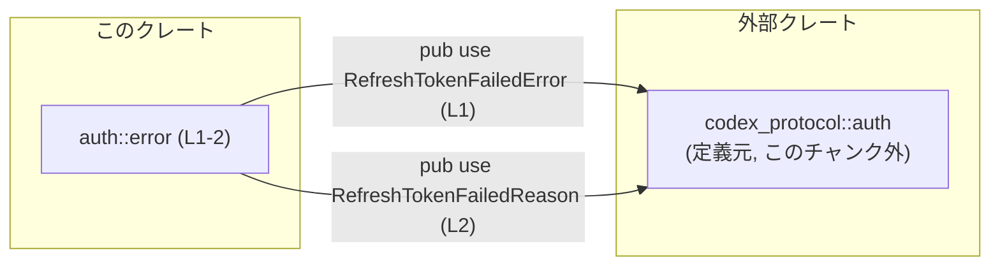
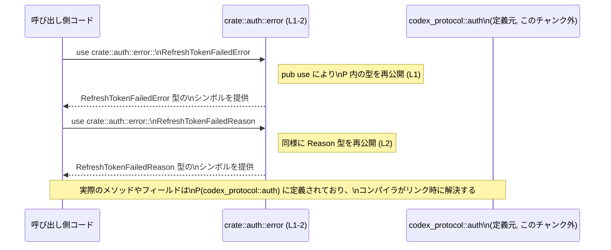

# login\src\auth\error.rs コード解説

## 0. ざっくり一言

`codex_protocol::auth` に定義されているリフレッシュトークン関連のエラー型を、このクレートの `auth::error` モジュールとして再公開するためのファイルです（`pub use` のみ、`login\src\auth\error.rs:L1-2`）。

---

## 1. このモジュールの役割

### 1.1 概要

- このモジュールは、**外部クレート `codex_protocol` の `auth` モジュールにあるエラー型**を再エクスポートし、クレート内の他のコードから利用しやすくするために存在しています（`L1-2`）。
- 具体的には、`RefreshTokenFailedError` と `RefreshTokenFailedReason` の 2 つの型を `pub use` しています（`L1-2`）。

### 1.2 アーキテクチャ内での位置づけ

このモジュールは「エラー型の窓口」として機能し、外部クレート `codex_protocol::auth` に依存しています。



- 呼び出し側コードは、`crate::auth::error` からエラー型をインポートするだけで、実体は `codex_protocol::auth` にある定義をそのまま利用できます。

### 1.3 設計上のポイント

- **API 集約**  
  別クレート `codex_protocol` のエラー型を、このクレートの `auth` ドメイン配下で一元的に公開する構造になっています（`L1-2`）。
- **状態なし・ロジックなし**  
  関数定義やフィールド定義はなく、再エクスポートのみで内部状態を持ちません（`L1-2`）。
- **エラーハンドリングの一貫性**  
  リフレッシュトークン失敗時のエラー表現をこの 2 型に統一する設計意図が命名と配置から推測されますが、詳細な挙動は `codex_protocol::auth` 側の実装に依存し、このチャンクからは分かりません。

---

## 2. 主要な機能一覧

- `RefreshTokenFailedError` の再エクスポート: リフレッシュトークン処理失敗を表すエラー型（と推測される）を `auth::error` 名前空間から利用可能にする（`L1`）。
- `RefreshTokenFailedReason` の再エクスポート: 失敗理由を表す型（と推測される）を `auth::error` 名前空間から利用可能にする（`L2`）。

---

## 3. 公開 API と詳細解説

### 3.1 型一覧（構造体・列挙体など）

このファイル内では新たな型定義は行っておらず、すべて外部定義の型を再公開しています。

| 名前 | 種別 | 役割 / 用途 | 定義元 | 根拠 |
|------|------|-------------|--------|------|
| `RefreshTokenFailedError` | 外部型（詳細不明） | リフレッシュトークンの失敗時に用いるエラー型である可能性が高いですが、このチャンクには定義が存在しないため、構造やトレイト実装は不明です。 | `codex_protocol::auth::RefreshTokenFailedError` | `pub use codex_protocol::auth::RefreshTokenFailedError;`（`login\src\auth\error.rs:L1`） |
| `RefreshTokenFailedReason` | 外部型（詳細不明） | 失敗理由を表す補助的な型（列挙体など）である可能性がありますが、同様にこのチャンクからは詳細不明です。 | `codex_protocol::auth::RefreshTokenFailedReason` | `pub use codex_protocol::auth::RefreshTokenFailedReason;`（`login\src\auth\error.rs:L2`） |

> 種別（構造体／列挙体など）は定義がこのチャンクに存在しないため、断定できません。

#### 安全性・エラー・並行性に関する補足

- このファイルには `unsafe` キーワードは一切登場せず、メモリ安全性に関わる特別な処理は行っていません（`L1-2`）。
- エラー型としての詳細な性質（`std::error::Error` 実装の有無など）は `codex_protocol::auth` 側の実装に依存し、このチャンクからは判断できません。
- スレッド／非同期処理に関するコードは存在せず、並行性に直接関わる要素はありません（`L1-2`）。

### 3.2 関数詳細（最大 7 件）

このファイルには関数定義が 1 つも存在しません（`login\src\auth\error.rs:L1-2` はすべて `pub use` 文）。  
そのため、詳解すべき関数 API はありません。

### 3.3 その他の関数

- 該当なし（関数定義が存在しません）。

---

## 4. データフロー

このファイル自体は実行時の処理ロジックを持たず、コンパイル時の名前解決にのみ関与します。  
ただし、「呼び出し側がどのようにエラー型へアクセスするか」という観点で、名前解決のフローを示すと次のようになります。



- 上記は**ランタイムの呼び出しフローではなく、コンパイル時の名前解決の流れ**を概念的に表現したものです。
- このファイルは、`codex_protocol::auth` にある定義への導線を提供するだけで、データの変換や状態変更は一切行いません（`L1-2`）。

---

## 5. 使い方（How to Use）

### 5.1 基本的な使用方法

このモジュールを利用する典型的なパターンは、「クレート内からエラー型をインポートして関数シグネチャ等に使う」形です。

```rust
// auth::error モジュールからエラー型をインポートする               // このクレート内での利用例
use crate::auth::error::{                                     // crate ルートから auth::error をたどる
    RefreshTokenFailedError,                                  // リフレッシュ失敗エラー型
    RefreshTokenFailedReason,                                 // 失敗理由を表す型
};

// リフレッシュトークン処理で共通に使う Result 型のエイリアス例
type RefreshResult<T> = Result<T, RefreshTokenFailedError>;   // Err 側に RefreshTokenFailedError を指定

// リフレッシュトークン処理の関数シグネチャ例
fn refresh_token_flow() -> RefreshResult<()> {                // 成功時は ()、失敗時は RefreshTokenFailedError
    // 実装内容は codex_protocol::auth 側の API に依存するため、このチャンクからは書けません。
    // ここではダミー実装として unimplemented!() を置いています。
    unimplemented!()                                          // 呼び出すとパニックするプレースホルダ
}

// エラーと理由を受け取って処理する関数例
fn handle_refresh_error(                                      // リフレッシュ失敗時のハンドラ例
    err: RefreshTokenFailedError,                             // エラーそのもの
    reason: RefreshTokenFailedReason,                         // 失敗理由（詳細の型はこのチャンクからは不明）
) {
    // err / reason にどのようなフィールドやメソッドがあるかは
    // codex_protocol::auth 側の定義を参照する必要があります。
}
```

- ここでは、**型として利用する**ことに焦点を置き、内部構造には立ち入りません。

### 5.2 よくある使用パターン

1. **専用の Result 型エイリアスを定義する**

```rust
use crate::auth::error::RefreshTokenFailedError;              // エラー型をインポート

// リフレッシュトークン処理に特化した Result 型
type RefreshResult<T> = Result<T, RefreshTokenFailedError>;   // エラー型を統一する

fn some_refresh_operation() -> RefreshResult<()> {            // 戻り値で一貫したエラー型を使用
    // 実際の処理は省略（このチャンクからは書けません）
    unimplemented!()
}
```

- これにより、リフレッシュ周りの関数群でエラー型が統一され、呼び出し側が扱いやすくなります。

1. **ハンドラ関数でまとめて受け取る**

```rust
use crate::auth::error::{                                     // 2 つの型をまとめてインポート
    RefreshTokenFailedError,
    RefreshTokenFailedReason,
};

fn log_refresh_failure(                                       // ログ出力専用ハンドラの例
    error: RefreshTokenFailedError,                           // エラー本体
    reason: RefreshTokenFailedReason,                         // 失敗理由
) {
    // 実際のログ出力処理などは codex_protocol::auth の API に依存します。
}
```

### 5.3 よくある間違い

コードから直接読み取れる「誤用」はありませんが、プロジェクトの方針としては次のような差異が生じる可能性があります。

```rust
// （パターン A）外部クレートから直接インポートする例
use codex_protocol::auth::RefreshTokenFailedError;            // このファイルの L1 と同じ定義元だが、直接インポート

// （パターン B）このモジュール経由でインポートする例
use crate::auth::error::RefreshTokenFailedError;              // error.rs の pub use (L1) を経由してインポート
```

- 両者は**型としては同一**ですが、
  - パターン B のように **`auth::error` を経由する方が、このクレートの「公式なエラー窓口」を揃えやすい**
  という設計方針を採るケースが多いです。
- どちらを採用するかはプロジェクトのコーディング規約によります。このファイル自体はどちらも禁止していません。

### 5.4 使用上の注意点（まとめ）

- **定義の実体は外部クレートにある**  
  型の意味・フィールド・メソッド・実装トレイトなどは `codex_protocol::auth` 側に依存します。このファイル単体からは詳細を判断できません（`L1-2`）。
- **バージョン変更時のコンパイルエラー**  
  `codex_protocol::auth` から `RefreshTokenFailedError` や `RefreshTokenFailedReason` が削除・リネームされると、この `pub use` 行（`L1-2`）がコンパイルエラーになります。
- **並行性・パフォーマンス**  
  このファイルには処理ロジックや I/O はなく、`pub use` のみなので、単体ではパフォーマンスやスレッド安全性への影響はほぼありません。

---

## 6. 変更の仕方（How to Modify）

### 6.1 新しい機能を追加する場合

このファイルに新しい機能を追加するとすれば、同様のパターンで**別のエラー型を再エクスポートする**ことが自然です。

1. `codex_protocol::auth`（または別のモジュール）に新しいエラー型が追加されていることを確認する。
2. 本ファイルに `pub use` を追加する。

```rust
// 例: 新しいエラー型 NewAuthError を追加で再公開する場合
pub use codex_protocol::auth::NewAuthError;                   // 実際にこの型が存在するかどうかはこのチャンクからは不明
```

- 実際にどの型を追加できるかは、`codex_protocol::auth` の定義を確認する必要があります。

### 6.2 既存の機能を変更する場合

`L1-2` の `pub use` を変更すると、**公開 API が変化**するため、影響範囲に注意が必要です。

- **型名を差し替える場合**

```rust
// 変更前
pub use codex_protocol::auth::RefreshTokenFailedError;        // L1

// 変更後（例: エイリアス名を変える）
pub use codex_protocol::auth::RefreshTokenFailedError
    as TokenRefreshError;
```

- 影響:
  - 既に `RefreshTokenFailedError` を直接参照しているコードはコンパイルエラーになります。
  - API の「契約」としての型名が変わるため、クレート外に公開されている場合は破壊的変更になります。

- **定義元のモジュールを変更する場合**

```rust
// 変更前
pub use codex_protocol::auth::RefreshTokenFailedError;        // L1

// 変更後（例: 定義が移動した場合）
pub use codex_protocol::new_auth::RefreshTokenFailedError;    // new_auth は仮のモジュール名
```

- 影響:
  - 呼び出し側のコード上では `crate::auth::error::RefreshTokenFailedError` というパスは変わらないため、**内部依存の変更を隠蔽**できます。
  - ただし、意味や挙動（フィールド内容など）が変わった場合は、実質的には契約の変更となる可能性があります。

**契約／エッジケース（コンパイル観点）**

- `codex_protocol::auth` 側から対象の型が消えると、`pub use` 行が解決できずコンパイルエラーになる（`L1-2` が失敗）。
- 型のシグネチャはこのファイルでは固定しておらず、**完全に外部に委譲**しているため、このファイル側では API の安定性を保証できません。

---

## 7. 関連ファイル

このファイルと密接に関係するモジュール／ファイルは次のとおりです。

| パス / モジュール | 役割 / 関係 |
|------------------|------------|
| `codex_protocol::auth` | `RefreshTokenFailedError` と `RefreshTokenFailedReason` の**定義元モジュール**です。このファイルから `pub use` されており、実際の構造体／列挙体の定義やトレイト実装はすべてそちらにあります（`login\src\auth\error.rs:L1-2` を根拠とする）。 |
| `crate::auth` | このファイルが `src/auth/error.rs` に存在することから、Rust の標準的なモジュール規約により `auth` モジュールのサブモジュールであると推測されます。ただし、`mod auth;` 等の定義はこのチャンクには現れません。 |

---

### このファイル単体でのバグ・セキュリティ観点のまとめ

- コードは `pub use` の 2 行のみであり（`L1-2`）、**ロジック・メモリアクセス・I/O・`unsafe`** などは一切含まれていません。
- したがって、このファイル単体から実行時のバグやセキュリティ脆弱性が生じる要素は見当たりません。
- 実際のエラー型の内容や、安全性・並行性・エラーハンドリング戦略は `codex_protocol::auth` 側の設計に依存し、このチャンクからは判断できません。
