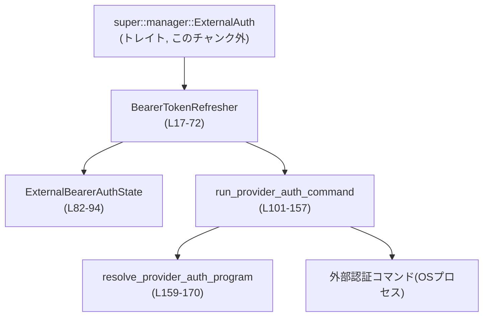
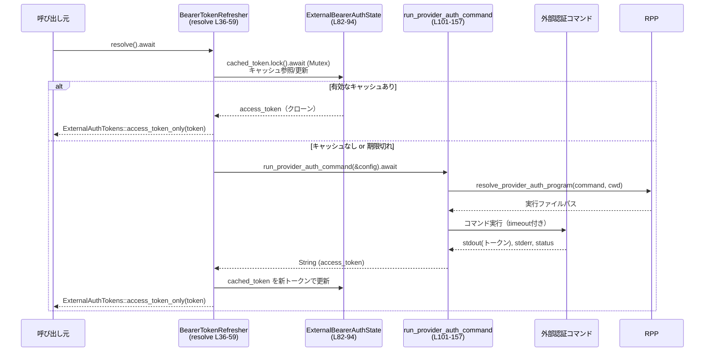

# login/src/auth/external_bearer.rs

## 0. ざっくり一言

外部コマンドを実行してベアラーアクセストークンを取得し、一定時間キャッシュしつつ `ExternalAuth` トレイトとして提供するモジュールです（非同期／tokio 前提）。  
外部プロバイダ用の認証コマンドをラップし、エラー処理やタイムアウト・パス解決も一括で行います。

---

## 1. このモジュールの役割

### 1.1 概要

- このモジュールは、**外部の認証コマンド**を使ってモデルプロバイダ向けのアクセストークンを取得する役割を持ちます。
- `ExternalAuth` トレイトの実装として、上位コードからは「トークンを解決・リフレッシュするコンポーネント」として利用されます（`ExternalAuth` 実装: `BearerTokenRefresher`、login/src/auth/external_bearer.rs:L31-72）。
- トークンを `tokio::sync::Mutex` 付きの共有状態にキャッシュし、`refresh_interval` に基づいて再取得タイミングを制御します（L38-47, L40-42）。

### 1.2 アーキテクチャ内での位置づけ

`ExternalAuth` 実装として、上位の認証マネージャから呼び出され、tokio の子プロセス機能を使って外部コマンドを実行する構造になっています。



- `ExternalAuth` トレイトは `super::manager` モジュールにあり、このファイルはその実装クラスとして位置づけられます（L1-L3）。
- 実際のコマンド内容・引数・タイムアウトなどは `ModelProviderAuthInfo` に保持され、このモジュールはそれを消費します（L6, L101-119）。

### 1.3 設計上のポイント

- **状態管理**
  - 状態は `ExternalBearerAuthState` に集約され、`Arc` + `tokio::sync::Mutex` で共有されます（L17-20, L82-85）。
  - `BearerTokenRefresher` 自体は `Clone` 可能で、複製しても同じ内部状態を共有します（`#[derive(Clone)]` L17）。
- **非同期・並行性**
  - 外部コマンド実行は `tokio::process::Command` と `tokio::time::timeout` を用いた非同期処理です（L101-114）。
  - キャッシュへのアクセスは `tokio::sync::Mutex` により同期化されます（L38, L66, L84）。
- **エラーハンドリング**
  - すべての外部コマンド関連の失敗（起動失敗・タイムアウト・非ゼロ終了・非 UTF-8 出力・空トークン）は `io::Error::other` で詳細なメッセージをつけてラップされます（L112-120, L121-126, L128-139, L142-147, L149-153）。
- **パス解決**
  - コマンド名が絶対パスか、相対パスか、単なる実行ファイル名かで挙動を変えています（L159-169）。

---

## 2. 主要な機能一覧

- ベアラートークンリフレッシャ: 外部コマンドからトークンを取得し、`ExternalAuth` として提供・更新する。
- トークンキャッシュ: 取得済みトークンと取得時刻をメモリ内にキャッシュし、`refresh_interval` に従って再利用・再取得を制御する。
- 外部認証コマンド実行: `ModelProviderAuthInfo` に基づき、tokio 非同期プロセスでコマンドを実行し、標準出力からトークン文字列を取り出す。
- コマンドパス解決: コマンド文字列を絶対パス／相対パス／PATH 検索の 3 パターンで解決する。

---

## 3. 公開 API と詳細解説

### 3.1 型一覧（構造体など）

このファイルで定義される主な型の一覧です。

| 名前                         | 種別     | 公開範囲    | 役割 / 用途 | 定義位置 |
|------------------------------|----------|-------------|------------|----------|
| `BearerTokenRefresher`       | 構造体   | `pub(crate)`| `ExternalAuth` 実装。外部コマンドからのベアラートークン取得・キャッシュを提供 | login/src/auth/external_bearer.rs:L17-20 |
| `ExternalBearerAuthState`    | 構造体   | private     | 設定とトークンキャッシュをまとめた内部状態 | L82-85 |
| `CachedExternalBearerToken`  | 構造体   | private     | 実際のアクセストークン文字列と、その取得時刻 | L96-99 |

関連する外部型（このファイルには定義なし）:

- `super::manager::ExternalAuth`, `ExternalAuthTokens`, `ExternalAuthRefreshContext`（L1-L3）
- `codex_protocol::config_types::ModelProviderAuthInfo`（L6）
- `codex_app_server_protocol::AuthMode`（L5）

これらの正確な定義内容はこのチャンクには現れないため、詳細は不明です。

### 3.1.1 コンポーネント（関数・メソッド）インベントリー

| 名前 / シグネチャ（概要）                             | 種別        | 役割（1 行） | 定義位置 |
|-------------------------------------------------------|-------------|--------------|----------|
| `BearerTokenRefresher::new`                          | 関数（assoc）| 設定から新しいリフレッシャを構築 | L23-27 |
| `impl ExternalAuth for BearerTokenRefresher::auth_mode` | メソッド   | 認証モードを `ApiKey` として返す | L32-34 |
| `impl ExternalAuth for BearerTokenRefresher::resolve` | asyncメソッド | キャッシュされたトークン取得または外部コマンド実行 | L36-59 |
| `impl ExternalAuth for BearerTokenRefresher::refresh` | asyncメソッド | 外部コマンドでトークンを強制的に再取得しキャッシュを更新 | L61-72 |
| `impl fmt::Debug for BearerTokenRefresher::fmt`      | メソッド    | 構造体名のみの簡易デバッグ表現 | L75-79 |
| `ExternalBearerAuthState::new`                       | 関数（assoc）| 内部状態の新規構築（空のキャッシュを持つ） | L88-93 |
| `run_provider_auth_command`                          | async関数   | 認証コマンドを非同期実行してトークン文字列を返す | L101-157 |
| `resolve_provider_auth_program`                      | 関数        | コマンド名から実行ファイルパスを解決 | L159-170 |

---

### 3.2 関数詳細（重要なもの）

#### `BearerTokenRefresher::new(config: ModelProviderAuthInfo) -> Self`

**概要**

- モデルプロバイダ認証設定を受け取り、共有可能な `BearerTokenRefresher` を構築します。
- 内部では `ExternalBearerAuthState` を生成し、`Arc` で共有する形にラップします。

**引数**

| 引数名  | 型                        | 説明 |
|---------|--------------------------|------|
| `config`| `ModelProviderAuthInfo`  | 外部認証コマンドやタイムアウトなどを含む設定。具体的な中身はこのチャンクには現れません。 |

**戻り値**

- `BearerTokenRefresher`  
  内部状態を共有するリフレッシャインスタンスです。`Clone` しても状態は共有されます（L17-20, L23-27）。

**内部処理の流れ**

1. `ExternalBearerAuthState::new(config)` を呼び出して内部状態を構築します（L25, L88-93）。
2. その状態を `Arc` で包んで `state` フィールドに格納します（L19, L25）。

**Examples（使用例）**

`ModelProviderAuthInfo` の具体的なコンストラクタはこのチャンクにはないため疑似コードになります。

```rust
// 認証情報の設定を用意する（具体的なAPIはこのチャンク外）
let auth_info: ModelProviderAuthInfo = /* ... */;

// リフレッシャを生成する
let refresher = BearerTokenRefresher::new(auth_info);

// ExternalAuth トレイトとして使う場合（例）
use super::manager::ExternalAuth;
let mode = refresher.auth_mode();
```

**Errors / Panics**

- この関数自体は単純な構築処理であり、`Result` を返さず、パニックを起こすようなコードも含まれていません（L23-27, L88-93）。

**Edge cases（エッジケース）**

- `config` に不正な値が入っている場合の扱いは、この関数内ではチェックされません。実際のバリデーションや失敗は、後続の `run_provider_auth_command` やコンフィグ生成側に依存します。

**使用上の注意点**

- `config` は `BearerTokenRefresher` のライフタイム中ずっと内部に保持されるため、機密情報（コマンドパスなど）を含む場合は、その点を前提に設計する必要があります（L82-84）。

**根拠**

- 構造体定義とコンストラクタ実装: login/src/auth/external_bearer.rs:L17-20, L23-27, L82-85, L88-93

---

#### `impl ExternalAuth for BearerTokenRefresher::resolve(&self) -> io::Result<Option<ExternalAuthTokens>>`

**概要**

- 現在有効なアクセストークンを取得します。
- キャッシュが有効であればキャッシュを使い、期限切れまたは未取得の場合は外部認証コマンドを実行して新たにトークンを取得・キャッシュします（L36-59）。

**引数**

| 引数名 | 型              | 説明 |
|--------|----------------|------|
| `&self`| `&BearerTokenRefresher` | 共有されたリフレッシャインスタンスへの参照 |

**戻り値**

- `io::Result<Option<ExternalAuthTokens>>`
  - `Ok(Some(tokens))`: トークンが取得できた場合（この実装では成功時は常に `Some` を返しています）。
  - `Err(e)`: 外部コマンド実行・エンコードなどで失敗した場合。
  - `Ok(None)` はこの実装では返していませんが、トレイトの設計上 `Option` になっていると推測されます（このチャンクからは意図は断定できません）。

**内部処理の流れ**

1. `self.state.cached_token` の `Mutex` を `lock().await` でロックし、キャッシュへの排他的アクセスを取得します（L37-38, L84）。
2. キャッシュが存在する (`Some`) 場合:
   - `self.state.config.refresh_interval()` を呼び出し、更新間隔が設定されているか確認します（L40）。
   - 設定ありなら、`cached_token.fetched_at.elapsed()` が `refresh_interval` 未満かを比較します（L41）。
   - 設定なしなら常にキャッシュを利用します（L42）。
   - 利用可能と判断した場合、キャッシュのアクセストークンをクローンし、`ExternalAuthTokens::access_token_only` でラップして即座に返します（L44-47）。
3. キャッシュがないか、有効期限切れの場合:
   - `run_provider_auth_command(&self.state.config).await?` を呼び出して外部コマンドから新しいトークンを取得します（L51）。
   - 取得したトークン文字列を `CachedExternalBearerToken` に格納し、`cached_token` に保存します（L52-55）。
4. 最後に、新しいトークンで `ExternalAuthTokens::access_token_only` を構築して返します（L58）。

**Examples（使用例）**

```rust
use super::manager::{ExternalAuth, ExternalAuthTokens};

async fn use_token(refresher: &BearerTokenRefresher) -> std::io::Result<()> {
    // トークンを解決する（キャッシュ利用 or コマンド実行）
    if let Some(tokens) = refresher.resolve().await? {
        // access_token_only なので、おそらくアクセストークン文字列のみ保持している
        // 具体的な取り出し方法は ExternalAuthTokens の定義に依存します
        // ここでは仮に Authorization ヘッダとして使う利用イメージです。
        // let access_token = tokens.access_token();
        // http_request.headers_mut().insert("Authorization", format!("Bearer {access_token}"));
    }
    Ok(())
}
```

**Errors / Panics**

- `run_provider_auth_command` がエラーを返した場合、その `io::Error` がそのまま伝播します（`?` 演算子, L51）。
- `Mutex::lock().await` がパニックする可能性は通常の tokio::Mutex と同様ですが、このコードからは特別なパニック条件は追加されていません。
- トークン文字列が空・非 UTF-8 などのケースは `run_provider_auth_command` 内でエラーに変換されます（L142-153）。

**Edge cases（エッジケース）**

- `refresh_interval()` が `None` の場合  
  - キャッシュが存在すれば常にそれを使い、期限切れ判定を行いません（L40-42）。
- キャッシュが存在しない場合  
  - 毎回 `run_provider_auth_command` が実行されます（L39, L51-56）。
- 複数タスクから同時に `resolve` が呼ばれた場合  
  - `cached_token` の `Mutex` により、キャッシュ更新とコマンド実行判定は逐次的に行われます（L38）。  
  - ただし、**この実装では `run_provider_auth_command` 呼び出し中もロックが保持されたままになる**（後述の使用上の注意参照）。

**使用上の注意点**

- `resolve` は非同期関数であり、tokio ランタイム内で `await` する前提です。
- 実装上、`Mutex` ロック取得後に `run_provider_auth_command(...).await` を呼んでいるため、**外部コマンドの実行中は他のタスクがキャッシュにアクセスできません**（L38, L51）。  
  これにより同一インスタンスへの並行アクセスは直列化され、コマンドの多重実行は避けられますが、高頻度アクセス時には待ち時間が増える可能性があります。
- 戻り値が `Option` であるため、呼び出し側は `None` の可能性も考慮したコードを書く必要があります（この実装では `Some` しか返していませんが、トレイトの将来変更に備えた型設計の可能性があります）。

**根拠**

- キャッシュ処理とロック: L36-47, L38, L40-42  
- コマンド実行とキャッシュ更新: L51-56  
- 戻り値生成: L58  

---

#### `impl ExternalAuth for BearerTokenRefresher::refresh(&self, _context: ExternalAuthRefreshContext) -> io::Result<ExternalAuthTokens>`

**概要**

- キャッシュ有無や期限に関わらず、**外部コマンドからトークンを強制的に再取得**します（L61-72）。
- 取得後、そのトークンをキャッシュに保存します。

**引数**

| 引数名    | 型                           | 説明 |
|-----------|-----------------------------|------|
| `&self`   | `&BearerTokenRefresher`     | リフレッシャインスタンス |
| `_context`| `ExternalAuthRefreshContext`| リフレッシュ時のコンテキスト情報。現在の実装では未使用（プレースホルダー）です（L61-63）。 |

**戻り値**

- `io::Result<ExternalAuthTokens>`  
  成功時は新しいトークンを包んだ `ExternalAuthTokens` を返します（L71）。失敗時は `run_provider_auth_command` に起因する `io::Error` です（L65）。

**内部処理の流れ**

1. `run_provider_auth_command(&self.state.config).await?` を呼んで新しいトークン文字列を取得します（L65）。
2. `self.state.cached_token.lock().await` でロックを取得し、キャッシュ内容を `Some(CachedExternalBearerToken { ... })` に更新します（L66-70）。
3. 最後に、`ExternalAuthTokens::access_token_only(access_token)` を返します（L71）。

**Examples（使用例）**

```rust
use super::manager::{ExternalAuth, ExternalAuthRefreshContext};

async fn force_refresh(refresher: &BearerTokenRefresher) -> std::io::Result<()> {
    // コンテキストの作り方はこのチャンクにはないため疑似コードです
    let ctx = ExternalAuthRefreshContext { /* ... */ };

    let tokens = refresher.refresh(ctx).await?;
    // 新しいトークンを使って後続処理を行う
    Ok(())
}
```

**Errors / Panics**

- `run_provider_auth_command` のエラーがそのまま伝播します（L65）。
- `Mutex` ロック取得部分では通常の tokio::Mutex と同様のパニック条件以外の追加ロジックはありません。

**Edge cases（エッジケース）**

- 複数タスクが同時に `refresh` を呼び出す場合  
  - 複数の外部コマンドが並列実行され、それぞれの完了後にキャッシュが更新されます。  
    最終的には最後に完了した呼び出しのトークンがキャッシュに残ることになります（L65-70）。
- `_context` は未使用ですが、将来的な機能拡張のためにインターフェース上保持されていると考えられます（このチャンクからは詳細不明）。

**使用上の注意点**

- `resolve` と異なり、**毎回必ず外部コマンドが実行される**ため、頻繁に呼び出すとプロセス起動コストが高くなります。
- キャッシュ更新は `run_provider_auth_command` の後に短時間だけロックを保持して行われるため、`resolve` と比べるとロック保持時間が短い構造になっています（L65-70）。

**根拠**

- 処理フロー: login/src/auth/external_bearer.rs:L61-72  

---

#### `async fn run_provider_auth_command(config: &ModelProviderAuthInfo) -> io::Result<String>`

**概要**

- 認証用外部コマンドを非同期で実行し、その標準出力からアクセストークン文字列を取り出す関数です（L101-157）。
- 実行前にパス解決を行い、タイムアウト、起動失敗、非ゼロ終了、非 UTF-8 出力、空トークンなどをすべて `io::Error` として返します。

**引数**

| 引数名  | 型                            | 説明 |
|---------|------------------------------|------|
| `config`| `&ModelProviderAuthInfo`     | コマンド文字列、引数リスト、カレントディレクトリ、タイムアウトなどを含む設定（このチャンクからは `command`, `cwd`, `args`, `timeout`, `timeout_ms` フィールドが読み取れます）。 |

**戻り値**

- `io::Result<String>`  
  成功時はトリム済みのアクセストークン文字列。失敗時は原因を説明する `io::Error`。

**内部処理の流れ**

1. `resolve_provider_auth_program(&config.command, &config.cwd)?` でコマンドパスを解決します（L102, L159-169）。
2. `tokio::process::Command` を生成し、引数・カレントディレクトリ・標準入出力の扱い・`kill_on_drop(true)` を設定します（L103-110）。
3. `tokio::time::timeout(config.timeout(), command.output())` で、コマンドの実行をタイムアウト付きで待ちます（L112-113）。
   - タイムアウト発生時: `"provider auth command`{}`timed out after {} ms"` というメッセージで `io::Error::other` を返します（L114-120）。
   - プロセス起動エラー時: `"failed to start"` のメッセージで `io::Error::other` を返します（L121-126）。
4. 正常にプロセスが完了した場合:
   - `output.status.success()` で終了ステータスを確認し、失敗の場合は `stderr` の内容を取り出してエラーに含めます（L128-139）。
5. 成功ステータスの場合:
   - `String::from_utf8(output.stdout)` で stdout を UTF-8 文字列へ変換し、失敗時は `"wrote non-UTF-8 data to stdout"` のメッセージでエラーを返します（L142-147）。
   - `stdout.trim().to_string()` で前後の空白を除去した文字列を取得し、空文字列であれば `"produced an empty token"` としてエラーを返します（L148-153）。
6. 最終的に、得られたアクセストークン文字列を `Ok(access_token)` として返します（L156）。

**Examples（使用例）**

この関数は内部利用のみですが、同様のパターンで外部コマンドを呼ぶ例として利用できます。

```rust
async fn example(config: &ModelProviderAuthInfo) -> std::io::Result<()> {
    let token = run_provider_auth_command(config).await?;
    println!("Got token: {}", token);
    Ok(())
}
```

**Errors / Panics**

- タイムアウト（`tokio::time::timeout`）: `timeout()` の値を超過すると `io::Error`（`other`）が返ります（L112-120）。
- プロセス起動失敗（パス不正・権限など）: 起動時のエラーを含む `io::Error` が返ります（L121-126）。
- 非ゼロ終了ステータス: ステータスと `stderr` 内容を含む `io::Error` が返ります（L128-139）。
- 非 UTF-8 出力: `stdout` が UTF-8 として解釈できない場合、エラーになります（L142-147）。
- 空トークン: トリム後の文字列が空の場合もエラーとなります（L148-153）。
- パニックを起こすコードは含まれていません。

**Edge cases（エッジケース）**

- コマンドが何も出力しない、もしくは空白のみを出力する  
  → トリム後の長さが 0 となり、 `"produced an empty token"` エラーが返ります（L148-153）。
- 非同期タスクがキャンセルされた場合  
  → 呼び出し側が `Future` をドロップした時点で `kill_on_drop(true)` によりプロセスが kill されることが期待されます（L110）。
- コマンド文字列が PATH 上に存在しない場合  
  → `Command::new` の起動時にエラーとなり、 `"failed to start"` メッセージのエラーになります（L121-126）。

**使用上の注意点**

- この関数は OS プロセスを起動するため、呼び出し頻度が高いと性能に影響します。通常は `resolve` のキャッシュ機構と組み合わせて利用することが前提の構造です（L36-47, L51-56）。
- `ModelProviderAuthInfo` の各フィールド（`command`, `cwd`, `args`, `timeout`, `timeout_ms`）の妥当性はこの関数では検証されません。設定ミスはそのまま起動失敗やタイムアウトとして現れます。

**根拠**

- 関数全体: login/src/auth/external_bearer.rs:L101-157  
- エラー各種: L112-120, L121-126, L128-139, L142-147, L149-153  

---

#### `fn resolve_provider_auth_program(command: &str, cwd: &Path) -> io::Result<PathBuf>`

**概要**

- 与えられたコマンド文字列から、実際に実行するプログラムのパスを決定する関数です（L159-170）。
- 絶対パス・相対パス・単なるファイル名の 3 通りを区別します。

**引数**

| 引数名   | 型         | 説明 |
|----------|-----------|------|
| `command`| `&str`    | 設定されたコマンド文字列 |
| `cwd`    | `&Path`   | 作業ディレクトリ。相対パス解決に使用。 |

**戻り値**

- `io::Result<PathBuf>`  
  実装上は常に `Ok(PathBuf)` を返しており、この関数内で `Err` になる経路は存在しません（L159-169）。

**内部処理の流れ**

1. `Path::new(command)` でパスオブジェクトを構築します（L160）。
2. パスが絶対パスであれば、そのまま `to_path_buf` して返します（L161-163）。
3. 絶対パスでない場合、`path.components().count() > 1` かどうかを判定します（L165）。
   - `>` 1 の場合: ディレクトリ区切りを含むパスなので `cwd.join(path)` として返します（L165-167）。
   - そうでない場合: 単なるファイル名として `PathBuf::from(command)` を返します（L169）。
     - このケースでは PATH 検索は `Command::new` 側に委ねられます（間接的、L103）。

**Examples（使用例）**

```rust
use std::path::Path;

fn example() -> std::io::Result<()> {
    let cwd = Path::new("/home/user");
    assert_eq!(
        resolve_provider_auth_program("/bin/echo", cwd)?,
        PathBuf::from("/bin/echo")
    );
    assert_eq!(
        resolve_provider_auth_program("scripts/auth.sh", cwd)?,
        cwd.join("scripts/auth.sh")
    );
    assert_eq!(
        resolve_provider_auth_program("auth-cli", cwd)?,
        PathBuf::from("auth-cli")
    );
    Ok(())
}
```

**Errors / Panics**

- この関数内では `Err` を返すコードはありません。`io::Result` を返していますが、現時点では常に成功として振る舞います（L159-170）。
- パニックを引き起こすような処理もありません。

**Edge cases（エッジケース）**

- `command` が空文字列の場合  
  - `Path::new("")` は有効な `Path` ですが、`components().count()` が 0 になる可能性があります。その場合は `PathBuf::from("")` が返るため、後続の `Command::new` で起動エラーになると考えられます（このチャンクからは `Command::new` の挙動のみ推測）。
- `cwd` に存在しない相対パスを指定した場合  
  - パス解決自体は成功し `PathBuf` が返りますが、実際の起動時には失敗する可能性があります。

**使用上の注意点**

- 実行可能ファイルの存在チェックや実行権限の確認などはこの関数では行われません。起動の成否は `run_provider_auth_command` 側でハンドリングされます。
- コマンド名にディレクトリ区切りが含まれるかどうかで扱いが変わるため、意図したパス解決になるよう設定側で注意が必要です。

**根拠**

- 実装全体: login/src/auth/external_bearer.rs:L159-170  

---

### 3.3 その他の関数・メソッド

| 名前 | 役割（1 行） | 定義位置 |
|------|--------------|----------|
| `impl ExternalAuth for BearerTokenRefresher::auth_mode(&self) -> AuthMode` | 認証方法を `AuthMode::ApiKey` として上位に通知します（ベアラートークンもこのモードで扱われる設計） | L32-34 |
| `impl fmt::Debug for BearerTokenRefresher::fmt` | 構造体名「BearerTokenRefresher」だけを出力する簡易デバッグ表現を提供します（内部状態は出力しない） | L75-79 |
| `ExternalBearerAuthState::new(config: ModelProviderAuthInfo) -> Self` | 設定を保持し、トークンキャッシュを `None` で初期化した状態オブジェクトを作成します | L88-93 |

---

## 4. データフロー

ここでは `resolve` が呼ばれてトークンを取得する代表的なフローを示します。



- キャッシュの有効性判定は `refresh_interval` と `fetched_at.elapsed()` で行われます（L40-42）。
- 外部コマンド実行部分は `run_provider_auth_command` にカプセル化されています（L51, L65, L101-157）。
- `refresh` フローでは、必ず「キャッシュあり」のルートを通る前に `run_provider_auth_command` が呼ばれる形になります（L61-72）。

---

## 5. 使い方（How to Use）

### 5.1 基本的な使用方法

`ModelProviderAuthInfo` や `ExternalAuth` の詳細はこのチャンクにはありませんが、一般的な利用イメージは次のようになります。

```rust
use std::io;
use login::auth::external_bearer::BearerTokenRefresher;
use codex_protocol::config_types::ModelProviderAuthInfo;
use super::manager::{ExternalAuth, ExternalAuthTokens};

async fn example_use() -> io::Result<()> {
    // 1. 外部認証コマンドの設定を準備する（擬似コード）
    let auth_info: ModelProviderAuthInfo = /* 外部コマンド, args, cwd, timeout などを設定 */;

    // 2. リフレッシャを構築する
    let refresher = BearerTokenRefresher::new(auth_info);

    // 3. トークンを解決する（初回は外部コマンド実行、以降はキャッシュ利用の可能性）
    if let Some(tokens) = refresher.resolve().await? {
        // ここで tokens を使って API クライアントを設定するなどの処理を行う
        // 具体的な使い方は ExternalAuthTokens のAPIに依存
    }

    Ok(())
}
```

### 5.2 よくある使用パターン

1. **通常のリクエスト前に `resolve` を呼ぶ**
   - 各リクエスト前に `resolve` を呼び、必要なら自動でトークンを更新させるパターンです。
   - キャッシュが有効な間は外部コマンドを呼ばずに済みます（L38-47）。

2. **一定間隔で `refresh` を呼ぶ**
   - バックグラウンドタスクなどで定期的に `refresh` を実行し、トークンを事前に更新しておくパターンです。
   - 本番では `resolve` は常にキャッシュから即座に取得できることが期待されます。

### 5.3 よくある間違い（想定）

このファイルから推測できる誤用例と正しい使い方です。

```rust
// 誤りの可能性: io::Result を無視している
async fn wrong(refresher: &BearerTokenRefresher) {
    // エラーを無視して unwrap などすると、起動失敗やタイムアウトでパニックになる
    let _tokens = refresher.resolve().await.unwrap();
}

// 正しい例: エラーを適切に伝播・処理する
async fn correct(refresher: &BearerTokenRefresher) -> std::io::Result<()> {
    match refresher.resolve().await? {
        Some(tokens) => {
            // トークン利用処理
        }
        None => {
            // Option の None に備えた処理（トレイト設計上の可能性）
        }
    }
    Ok(())
}
```

### 5.4 使用上の注意点（まとめ）

- **非同期ランタイム前提**
  - `resolve`, `refresh`, `run_provider_auth_command` はいずれも非同期関数であり、tokio などのランタイム上で `await` する必要があります（L36, L61, L101）。
- **並行性・ロック**
  - `resolve` では `Mutex` ロックを取得後に外部コマンド実行を `await` しています（L38, L51）。  
    これにより、同じ `BearerTokenRefresher` に対する複数の `resolve` 呼び出しは、コマンドの実行中も含めて直列化されます。
  - `refresh` では外部コマンド実行の後に短時間だけロックを取得してキャッシュ更新を行います（L65-70）。  
    そのため、`refresh` を多重に呼ぶと外部コマンドは並列実行される可能性があります。
- **エラー処理**
  - 認証コマンド実行に関するさまざまな失敗はすべて `io::Error` で返されます。  
    呼び出し側でログ出力やリトライなどを行う設計が必要です（L112-120, L121-126, L128-139, L142-147, L149-153）。
- **セキュリティ**
  - アクセストークンは `String` としてメモリ上に保持されます（L96-98, L52-55）。このファイル内ではトークンのマスキングや明示的なゼロクリアは行っていません。
  - エラーメッセージには `config.command` や終了ステータス、`stderr` が含まれますが、トークン文字列そのものは含めていません（L115-118, L137-139, L144-146, L151-153）。
- **テスト**
  - このファイル内には `#[cfg(test)]` やテスト関数は存在せず、ユニットテストに関する情報はこのチャンクには現れません。

---

## 6. 変更の仕方（How to Modify）

### 6.1 新しい機能を追加する場合

例として「トークンのフォーマット変更」や「追加の検証ロジック」を導入する際の入口を整理します。

- **トークン取得ロジックを拡張したい場合**
  - 外部コマンド実行後の処理を変更・拡張する場合は `run_provider_auth_command` が主な入口になります（L101-157）。
    - 例: 標準出力が JSON の場合にパースして特定フィールドを取り出す、など。
- **キャッシュポリシーを変更したい場合**
  - 有効期限の扱いやキャッシュ戦略は `resolve` 内で実装されています（L38-47）。
  - `ModelProviderAuthInfo::refresh_interval()` の返り値に応じた分岐がありますが、その定義はこのチャンク外です（L40-42）。
- **認証モードを変えたい場合**
  - `auth_mode` メソッドで `AuthMode::ApiKey` を返している部分を変更します（L32-34）。  
    ただし、`AuthMode` の他のバリアントや上位コードの期待値はこのチャンクからは分からないため、変更時には `codex_app_server_protocol::AuthMode` の定義を確認する必要があります。

### 6.2 既存の機能を変更する場合の注意点

- **影響範囲の確認**
  - `BearerTokenRefresher` は `ExternalAuth` トレイトとして利用されるため、トレイトの契約（メソッドの意味・戻り値の型など）を満たすように変更する必要があります（L1-L3, L31-72）。
- **前提条件・契約**
  - `resolve` の `Option<ExternalAuthTokens>` の意味づけを変更する場合、呼び出し側の `None` ハンドリングコードへの影響を確認する必要があります。
  - `run_provider_auth_command` のエラーメッセージフォーマットを変更すると、エラーメッセージをパースしているようなコードがある場合に影響しうるため、利用箇所の確認が必要です（このチャンクにはそのようなコードは現れません）。
- **テスト**
  - このファイル内にはテストがないため、変更時は上位モジュール（`super::manager` やそれを利用するコード）のテストを確認・追加する必要があります。  
    実際のテストファイルの場所や内容はこのチャンクからは分かりません。
- **パフォーマンス**
  - `resolve` 内でのロック保持範囲を変更する場合、並行性とコマンド多重実行のトレードオフがあります。
    - ロック範囲を狭めると並列 `resolve` 呼び出しが増え、外部コマンドが多重実行される可能性があります。
    - ロック範囲を広げるとコマンド多重実行は防げますが、待ち時間が増加します。

---

## 7. 関連ファイル・モジュール

このファイルと密接に関係すると考えられるモジュールと型です。ファイルパスはこのチャンクには明示されていないものもあります。

| パス / モジュール              | 役割 / 関係 |
|--------------------------------|------------|
| `super::manager`（実際のファイルパス不明） | `ExternalAuth`, `ExternalAuthTokens`, `ExternalAuthRefreshContext` の定義元。`BearerTokenRefresher` はこのトレイトを実装し、このモジュールから利用されます（L1-L3, L31-72）。 |
| `codex_protocol::config_types::ModelProviderAuthInfo` | 外部認証コマンドの設定を保持する型。`command`, `cwd`, `args`, `timeout`, `timeout_ms`, `refresh_interval` などが参照されています（L6, L40, L101-119）。 |
| `codex_app_server_protocol::AuthMode` | 認証方式を表す列挙体と推測されます。この実装では `AuthMode::ApiKey` を返しています（L5, L32-34）。 |
| `tokio::process::Command` / `tokio::time` | 外部コマンドの非同期実行とタイムアウト制御に使用されています（L14, L101-114）。 |

これらのモジュール・型の詳細な定義や追加の挙動は、このチャンクには現れないため不明です。
