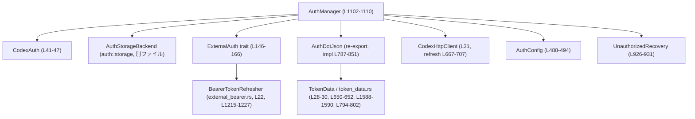
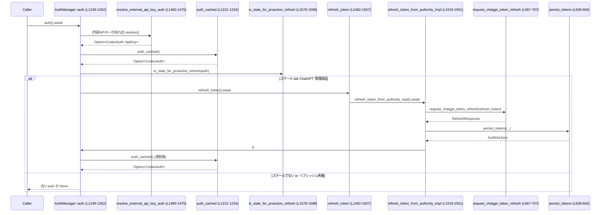
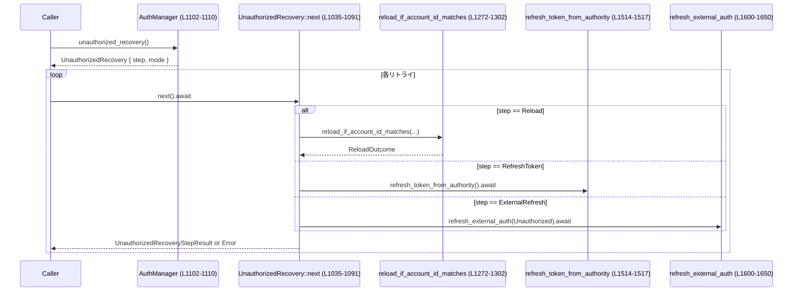

# login/src/auth/manager.rs

## 0. ざっくり一言

`auth.json`・環境変数・外部プロセスなど複数ソースから認証情報を読み込み・キャッシュし、トークン更新やログアウト、401時の自動リカバリを一元的に扱う認証マネージャです（`AuthManager` と `CodexAuth` 周辺、根拠: `login/src/auth/manager.rs:L41-L47`, `L1102-L1110`）。

---

## 1. このモジュールの役割

### 1.1 概要

このモジュールは次の問題を解決します。

- CLI / アプリが **API キー / ChatGPT OAuth / 外部連携トークン** のどれでログインしているかを統一的に扱うこと  
- `auth.json`・環境変数・外部認証プロバイダなど、複数のソースから取得した認証情報を **スレッド安全にキャッシュ** しつつ、期限切れ時に適切に更新すること  
- 管理者が要求するログイン手段や ChatGPT workspace（account id）制約を **強制・違反時に自動ログアウト** すること（根拠: `AuthConfig` と `enforce_login_restrictions`, `L488-L494`, `L496-L569`）

### 1.2 アーキテクチャ内での位置づけ

主なコンポーネントと依存関係を簡略化して示します。



- `AuthManager` が中心となり、`CodexAuth`（現在の認証状態）を `CachedAuth` として `RwLock` で保持します（`L853-L860`, `L1102-L1109`）。
- 認証情報の永続化は `AuthStorageBackend` / `AuthDotJson`（別ファイル）の責務で、ここから `load_auth` / `save_auth` 経由で利用されます（`L598-L637`, `L466-L473`）。
- ChatGPT OAuth トークンの更新は `CodexHttpClient` を通じて OpenAI Auth サーバに対して行います（`request_chatgpt_token_refresh`, `L667-L707`）。
- 外部管理の認証（ホストアプリやカスタムモデルプロバイダ）は `ExternalAuth` トレイトで抽象化され、`BearerTokenRefresher` などの実装に委譲されます（`L146-L166`, `L1215-L1227`）。
- 401 応答時の自動リカバリは `UnauthorizedRecovery` 状態マシンが担当し、`AuthManager` を呼び出します（`L908-L925`, `L926-L931`, `L1035-L1091`）。

### 1.3 設計上のポイント

- **認証ソースの優先順位**  
  `load_auth` は以下の優先順位で認証を決定します（`L598-L637`）。
  1. 環境変数 `CODEX_API_KEY`（API キー）  
  2. Ephemeral ストア内の `auth.json`（外部 ChatGPT トークン）  
  3. 要求されたストアモードに応じた永続ストアの `auth.json`  
- **認証モードの統一表現**  
  `CodexAuth` enum で API キー・ChatGPT 管理トークン・外部 ChatGPT トークンを一本化し、AuthMode / ApiAuthMode で外部プロトコルと対応付けています（`L41-L47`, `L230-L243`）。
- **スレッド安全なキャッシュ**  
  - 認証状態は `CachedAuth` を `RwLock` で保護しており、多数の読者と少数の書き込みを想定した構造になっています（`L853-L860`, `L1104-L1109`）。
  - トークン更新処理は `AsyncMutex<()>` で直列化され、同時更新による競合を防ぎます（`L1108`, `L1482-L1484`, `L1514-L1516`）。
- **エラーモデルの分離（Rust らしい安全性）**  
  - トークン更新に関しては `RefreshTokenError` で **永続エラー（Permanent）** と **一時エラー（Transient）** を区別し、`AuthManager` が永続エラーをキャッシュして不要な再試行を避けます（`L88-L94`, `L168-L175`, `L1277-L1344`）。
  - 永続エラーの理由は `RefreshTokenFailedReason` によって型安全に表現されます（`classify_refresh_token_failure`, `L710-L737`）。
- **401 時のリカバリ・ポリシー**  
  - 管理された ChatGPT 認証では「ディスクからの再ロード → OAuth リフレッシュ」の順で試行します。  
  - 外部認証では `ExternalAuth::refresh` を 1 回だけ呼び出すポリシーです（`UnauthorizedRecoveryMode`, `L902-L906`, `UnauthorizedRecovery::next`, `L1035-L1091`）。
- **環境に依存した制約の強制**  
  - ログイン方法 (API / ChatGPT) や ChatGPT workspace ID を `AuthConfig` で指定し、違反時には `logout_all_stores` で Ephemeral / 永続両方をクリアしてからエラーを返します（`L488-L494`, `L496-L569`, `L571-L596`）。

---

## 2. 主要な機能一覧

- 認証モードの統一表現: `CodexAuth` による API キー / ChatGPT / 外部トークンの抽象化（`L41-L47`）。
- 認証情報の読み込みと優先順位決定: `load_auth` と `AuthManager::new` / `AuthManager::load_auth_from_storage`（`L598-L637`, `L1153-L1176`, `L1346-L1354`）。
- 認証情報のキャッシュとスレッド安全な提供: `AuthManager::auth_cached` / `AuthManager::auth`（`L1231-L1234`, `L1249-L1262`）。
- トークンの期限管理とプロアクティブリフレッシュ: `AuthManager::is_stale_for_proactive_refresh` と `AuthManager::auth` 内のチェック（`L1578-L1598`, `L1254-L1261`）。
- OAuth リフレッシュフロー: `request_chatgpt_token_refresh` と `refresh_and_persist_chatgpt_token`（`L667-L707`, `L1655-L1672`）。
- 外部認証との連携: `ExternalAuth` トレイトと `AuthManager::refresh_external_auth`, `AuthManager::resolve_external_api_key_auth`（`L146-L166`, `L1600-L1650`, `L1460-L1475`）。
- 401 応答時のリカバリ状態マシン: `UnauthorizedRecovery` と `next()`（`L908-L925`, `L926-L931`, `L1035-L1091`）。
- ログイン制限の強制: `AuthConfig` と `enforce_login_restrictions`（`L488-L494`, `L496-L569`）。
- logout / login ヘルパー: `logout`, `logout_all_stores`, `login_with_api_key`, `login_with_chatgpt_auth_tokens`（`L423-L429`, `L586-L596`, `L431-L444`, `L447-L463`）。
- 環境変数経由の API キー取得: `read_openai_api_key_from_env`, `read_codex_api_key_from_env`（`L407-L412`, `L414-L419`）。

---

## 3. 公開 API と詳細解説

### 3.1 型一覧（構造体・列挙体など）

| 名前 | 種別 | 役割 / 用途 | 定義位置 |
|------|------|-------------|----------|
| `CodexAuth` | enum | API キー / ChatGPT / 外部 ChatGPT トークンを表す高レベルな認証モード | `manager.rs:L41-L47` |
| `ApiKeyAuth` | struct | `CodexAuth::ApiKey` の内部表現（API キー文字列） | `L49-L52` |
| `ChatgptAuth` | struct | 管理された ChatGPT 認証の状態（`ChatgptAuthState` + ストレージ） | `L54-L58` |
| `ChatgptAuthTokens` | struct | 外部管理の ChatGPT トークン用状態（ストレージなし） | `L60-L63` |
| `ChatgptAuthState` | struct | `AuthDotJson` と HTTP クライアントを束ねた内部状態 | `L65-L69` |
| `RefreshTokenError` | enum | トークン更新失敗を「永続/一時」に分類するエラー型 | `L88-L94` |
| `ExternalAuthTokens` | struct | 外部認証プロバイダから受け取るアクセストークン＋ChatGPT メタデータ | `L96-L100` |
| `ExternalAuthChatgptMetadata` | struct | ChatGPT アカウント ID とプラン種別のメタデータ | `L102-L106` |
| `ExternalAuthRefreshReason` | enum | 外部認証リフレッシュの理由（現状 Unauthorized のみ） | `L135-L138` |
| `ExternalAuthRefreshContext` | struct | 外部リフレッシュ時に渡すコンテキスト（理由・旧アカウント ID） | `L140-L144` |
| `ExternalAuth` | trait | 外部認証プロバイダのインターフェース (`auth_mode` / `resolve` / `refresh`) | `L146-L166` |
| `AuthConfig` | struct | ログイン制限をかけるときに利用する設定値集合 | `L488-L494` |
| `CachedAuth` | struct | キャッシュされた `CodexAuth` と永続リフレッシュ失敗状態 | `L853-L860` |
| `AuthScopedRefreshFailure` | struct | 特定の `CodexAuth` に紐づく永続リフレッシュ失敗 | `L862-L866` |
| `UnauthorizedRecoveryStep` | enum | リカバリステップ種別（Reload/RefreshToken/ExternalRefresh/Done） | `L886-L891` |
| `ReloadOutcome` | enum | reload の結果（変更あり/なし/スキップ） | `L893-L900` |
| `UnauthorizedRecoveryMode` | enum | 管理型 / 外部型のリカバリモード | `L902-L906` |
| `UnauthorizedRecovery` | struct | 401 応答時のリカバリ状態マシン | `L926-L931` |
| `UnauthorizedRecoveryStepResult` | struct | `next()` 実行後、認証状態が変わったかどうかの結果 | `L933-L936`, `L938-L941` |
| `AuthManager` | struct | 認証状態の単一ソース・トゥルースとなる管理者 | `L1102-L1110` |
| `AuthManagerConfig` | trait | `AuthManager` を構築するための設定ビューを抽象化 | `L1118-L1126` |
| `RefreshRequest` | struct | OAuth リフレッシュリクエスト用の JSON ボディ | `L765-L770` |
| `RefreshResponse` | struct | OAuth リフレッシュレスポンスの JSON ボディ | `L772-L777` |

> `AuthDotJson` 自体の定義は別ファイルですが、本モジュールに `impl AuthDotJson` が存在し、外部トークンからの生成やストレージモード決定を拡張しています（`L787-L851`）。

### 3.2 関数詳細（主要 7 件）

#### 1. `load_auth(codex_home, enable_codex_api_key_env, auth_credentials_store_mode) -> io::Result<Option<CodexAuth>>`

**概要**

- 各種ソース（環境変数・Ephemeral ストア・永続ストア）から認証情報を読み込み、優先順位に従って `CodexAuth` を構築します（`L598-L637`）。
- 読み込み失敗時には `Err` を返し、存在しない場合は `Ok(None)` を返します。

**引数**

| 引数名 | 型 | 説明 |
|--------|----|------|
| `codex_home` | `&Path` | 認証ストレージのベースディレクトリ |
| `enable_codex_api_key_env` | `bool` | `CODEX_API_KEY` 環境変数を認証ソースとして有効にするか |
| `auth_credentials_store_mode` | `AuthCredentialsStoreMode` | 使用するストア種別（Ephemeral / File / Keyring / Auto 等） |

**戻り値**

- `Ok(Some(CodexAuth))`: いずれかのソースから認証情報を取得できた場合  
- `Ok(None)`: 認証情報が存在しない場合  
- `Err(std::io::Error)`: ストレージ読み込み等で I/O エラーが発生した場合  

**内部処理の流れ**

1. クロージャ `build_auth` で `AuthDotJson` → `CodexAuth` への変換を準備（`L603-L605`）。
2. `enable_codex_api_key_env` が `true` かつ `CODEX_API_KEY` がセットされていれば、最優先で API キー認証を返す（`L607-L610`）。
3. Ephemeral ストア（in-memory）から `auth.json` を読み込み、あれば `ChatgptAuthTokens` 等として返す（`L612-L621`）。
4. 呼び出し側が Ephemeral モードを明示した場合はここで終了 (`Ok(None)`)、永続ストアは利用しない（`L623-L626`）。
5. 永続ストアから `auth.json` を読み込み、なければ `Ok(None)` を返す（`L628-L633`）。
6. 読み込んだ `auth.json` を `build_auth` で `CodexAuth` に変換して返す（`L635-L636`）。

**Examples（使用例）**

テストやツールから直接認証を読み込む簡単な例です。

```rust
use std::path::Path;
use codex_config::types::AuthCredentialsStoreMode;
use login::auth::manager::load_auth_dot_json; // 実際のコードでは AuthManager の利用が推奨

// codex_home ディレクトリを指定する                             
let codex_home = Path::new("/home/user/.codex");

// Ephemeral 以外のストアを使用し、環境変数は無効にして読み込む
let auth = login::auth::manager::load_auth(
    codex_home,
    /* enable_codex_api_key_env */ false,
    AuthCredentialsStoreMode::File,
)?;

// Some ならログイン済み、None なら未ログイン
if let Some(codex_auth) = auth {
    println!("Auth mode: {:?}", codex_auth.api_auth_mode());
}
```

**Errors / Panics**

- 失敗は `std::io::Error` として返されます。`create_auth_storage().load()` の I/O 失敗などが該当します（`L618-L620`, `L630-L633`）。
- パニックは使用していません。

**Edge cases（エッジケース）**

- `enable_codex_api_key_env == true` かつ `CODEX_API_KEY` がセットされている場合、`auth.json` の内容は無視されます（`L607-L610`）。
- `AuthCredentialsStoreMode::Ephemeral` の場合、永続ストアは全く参照されません（`L623-L626`）。
- Ephemeral に `auth.json` が存在し、永続ストアにも異なる `auth.json` がある場合でも、Ephemeral が優先されます（`L612-L621`）。

**使用上の注意点**

- プロダクションコードではこの関数を直接使わず、`AuthManager` を経由して利用することが意図されています（コメント: `L475-L480`）。
- 認証ソースの優先順位を変更したい場合は、この関数のロジックを変更する必要があります。

> 根拠: `login/src/auth/manager.rs:L598-L637`

---

#### 2. `enforce_login_restrictions(config: &AuthConfig) -> io::Result<()>`

**概要**

- 既存のログイン状態に対して、  
  - ログイン手段（API キー / ChatGPT）  
  - ChatGPT workspace ID（アカウント ID）  
 という制約を強制し、違反時にはログアウトしてエラーを返します（`L496-L569`）。

**引数**

| 引数名 | 型 | 説明 |
|--------|----|------|
| `config` | `&AuthConfig` | 制限したいログイン方法・workspace ID を含む設定 |

**戻り値**

- 制約に合致すれば `Ok(())`。  
- 制約に違反する場合、`logout_all_stores` を実行した上で `Err(std::io::Error)` を返します（`L522-L527`, `L560-L564`, `L571-L584`）。

**内部処理の流れ**

1. `load_auth` を `enable_codex_api_key_env=true` で呼び出し、現在の `CodexAuth` を取得（`L497-L501`）。
2. `forced_login_method` が設定されていれば、実際の `auth.auth_mode()` と比較し、矛盾があればメッセージ付きで `logout_with_message` を呼びます（`L506-L528`）。
3. `forced_chatgpt_workspace_id` が設定されている場合:
   - 現在の認証が ChatGPT 系でない場合は何もしない（`L531-L534`）。
   - `get_token_data` でトークン情報を取得できなければ、エラーをログアウトメッセージに含めてログアウト（`L536-L547`）。
   - `id_token.chatgpt_account_id` と `expected_account_id` を比較し、異なっていればログアウト＋エラー（`L549-L565`）。
4. いずれの制約にも違反していなければ `Ok(())`（`L568`）。

**Examples（使用例）**

```rust
use std::path::PathBuf;
use codex_protocol::config_types::ForcedLoginMethod;
use codex_config::types::AuthCredentialsStoreMode;
use login::auth::manager::{AuthConfig, enforce_login_restrictions};

// 認証ストアなどの設定を構築する
let config = AuthConfig {
    codex_home: PathBuf::from("/home/user/.codex"),
    auth_credentials_store_mode: AuthCredentialsStoreMode::File,
    forced_login_method: Some(ForcedLoginMethod::Chatgpt), // ChatGPT ログインを強制
    forced_chatgpt_workspace_id: Some("workspace-123".to_string()),
};

// 制約を適用する
if let Err(err) = enforce_login_restrictions(&config) {
    eprintln!("Login restriction violated: {err}");
    // ここでプロセス終了や再ログイン誘導などを行う
}
```

**Errors / Panics**

- 戻り値の `Err` は「制約違反」と「auth.json 削除失敗」の両方を含み得ます。  
  - 削除失敗時は `"Failed to remove auth.json: {err}"` 付きメッセージになります（`L579-L582`）。
- `logout_with_message` は `std::io::Error::other` でラップするだけで、パニックは発生しません（`L571-L584`）。

**Edge cases**

- 認証が存在しない場合 (`load_auth` が `Ok(None)` を返すケース) は、制限はスキップされます（`L497-L505`）。
- `forced_chatgpt_workspace_id` が設定されているが、トークンの `chatgpt_account_id` が `None` の場合は制約違反としてログアウトされます（`L549-L559`）。
- `forced_login_method` と `forced_chatgpt_workspace_id` の両方が設定されている場合は、両方のチェックが順番に行われます。

**使用上の注意点**

- この関数は現在のログイン状態を破壊的に変更する可能性がある（ログアウトする）ため、起動時などに一度だけ呼び出す設計が自然です。
- 外部認証（`ExternalAuth`）だけを使う構成では、`load_auth` の結果が `None` になりうる点に注意が必要です。

> 根拠: `login/src/auth/manager.rs:L488-L494`, `L496-L569`, `L571-L596`

---

#### 3. `AuthManager::auth(&self) -> Option<CodexAuth>`

**概要**

- 現在の認証状態を返すメイン API です。  
- 外部 API キー認証が設定されていれば、それを解決し、そうでなければキャッシュされた認証を返します。  
- 管理された ChatGPT 認証の場合には、トークンが古いと判断されたときにプロアクティブにリフレッシュを試みます（`L1249-L1262`, `L1578-L1598`）。

**引数 / 戻り値**

- 引数: なし（`&self` のみ）  
- 戻り値: 現在有効と認識している `CodexAuth`。エラー時や未ログイン時は `None`。

**内部処理の流れ**

1. 外部 API キー認証が設定されている場合、`resolve_external_api_key_auth` で `ExternalAuth::resolve` を呼び出して `CodexAuth::ApiKey` を構築し、返します（`L1250-L1252`, `L1460-L1475`）。
2. そうでなければ `auth_cached()` で `CachedAuth.auth` を取得し、`None` なら `None` を返します（`L1254-L1255`）。
3. `is_stale_for_proactive_refresh` が `true` の場合、`refresh_token()` を呼び出します（`L1255-L1257`, `L1578-L1598`, `L1482-L1507`）。
   - リフレッシュがエラーになった場合はログを出力し（`tracing::error!`）、古い `auth` をそのまま返します（`L1256-L1260`）。
4. 最後に `auth_cached()` を再度呼び出し、リフレッシュ後の最新状態を返します（`L1261-L1262`）。

**Examples（使用例）**

```rust
use std::sync::Arc;
use codex_config::types::AuthCredentialsStoreMode;
use login::auth::manager::AuthManager;

// AuthManager を構築する（実運用では shared_from_config を使うことが多い）
let manager = AuthManager::shared(
    "/home/user/.codex".into(),
    /* enable_codex_api_key_env */ true,
    AuthCredentialsStoreMode::Auto,
);

// 非同期コンテキスト内で現在の認証を取得する
let maybe_auth = manager.auth().await;
if let Some(auth) = maybe_auth {
    // API キーまたは Bearer トークン文字列を取得
    let token = auth.get_token().expect("token should be available");
    println!("Using token: {}", token);
}
```

**Errors / Panics**

- この関数自体は `Result` を返さず、エラーはログに記録した上で古い認証を返します（`L1256-L1260`）。
- 内部で `resolve_external_api_key_auth` や `refresh_token` を呼び出していますが、それらのエラーはログ出力にとどめています。
- `auth_cached` は `RwLock::read().ok()` を使用し、ロック取得失敗時は `None` を返すためパニックにはなりません（`L1231-L1234`）。

**Edge cases**

- 外部 API キー認証が設定されている場合、`auth_cached` に保存された内部 `CodexAuth` は無視されます（`L1250-L1252`, `L1564-L1569`）。
- ChatGPT 認証で `is_stale_for_proactive_refresh` が `true` でも、リフレッシュが失敗した場合には古いトークンで処理を続行します。

**使用上の注意点**

- async 関数であり、`.await` が必要です（`L1249` に `pub async fn`）。
- 認証が存在しない（未ログイン、ロード失敗）場合は `None` になるので、呼び出し側で必ず `Option` のハンドリングが必要です。

> 根拠: `login/src/auth/manager.rs:L1231-L1234`, `L1249-L1262`, `L1578-L1598`, `L1460-L1475`

---

#### 4. `AuthManager::refresh_token(&self) -> Result<(), RefreshTokenError>`

**概要**

- 管理された ChatGPT 認証のトークンを、**アカウント ID が一致する場合に限って** リフレッシュする関数です（`L1482-L1507`）。
- 他のプロセスやインスタンスがすでにトークンを更新している場合は、リフレッシュをスキップします。

**引数 / 戻り値**

- 引数: なし（`&self` のみ）  
- 戻り値: 成功時は `Ok(())`。失敗時は `RefreshTokenError`（Permanent または Transient）。

**内部処理の流れ**

1. `refresh_lock`（`AsyncMutex<()>`）を取得し、同時リフレッシュを防止（`L1483-L1484`）。
2. `auth_cached` から現在の認証を取得。API キー認証の場合は何もしないで `Ok(())`（`L1485-L1490`）。
3. 現在認証から `expected_account_id` を取得（`L1491-L1493`）。
4. `reload_if_account_id_matches` を呼び出し、ディスク上の `auth.json` を必要に応じて再読み込み（`L1495-L1507`, `L1272-L1302`）。
   - `ReloadedChanged`: 他インスタンスですでに更新済み → リフレッシュ不要として `Ok(())`。
   - `ReloadedNoChange`: ディスク状態が変化していない → `refresh_token_from_authority_impl` を呼び出す（`L1500-L1501`）。
   - `Skipped`: アカウントIDが一致しない、または不明 → 永続エラー（account mismatch）として返す（`L1501-L1506`）。

**Examples（使用例）**

```rust
// manager は AuthManager の Arc など
if let Err(err) = manager.refresh_token().await {
    if let Some(reason) = err.failed_reason() {
        eprintln!("Refresh failed permanently: {:?}", reason);
    } else {
        eprintln!("Refresh failed transiently: {}", err);
    }
}
```

**Errors / Panics**

- `AuthManager::refresh_token_from_authority_impl` からの `RefreshTokenError` をそのまま返します（`L1500-L1501`, `L1519-L1551`）。
- アカウント ID 不一致の場合は `RefreshTokenFailedReason::Other` と `REFRESH_TOKEN_ACCOUNT_MISMATCH_MESSAGE` を持つ `Permanent` エラーになります（`L1501-L1506`, `L84`）。
- パニックは使用していません。

**Edge cases**

- 現在の認証が `None`（未ログイン）の場合は、`auth_cached` が `None` を返し、そのまま `ReloadOutcome::Skipped` 経路には入りません（先に `auth_before_reload` が `None` になり、`expected_account_id` も `None` となるため `reload_if_account_id_matches` で Skipped → Permanent エラーになります）。
- 外部 ChatGPT トークン（`CodexAuth::ChatgptAuthTokens`）はこの関数では扱われず、`refresh_token_from_authority_impl` 内で `refresh_external_auth` が呼ばれます（`L1530-L1535`）。

**使用上の注意点**

- プロアクティブリフレッシュ (`AuthManager::auth`) とは別に、明示的なリフレッシュを行いたい場合に利用できます。
- 複数プロセスが同じ `auth.json` を共有している前提を考慮し、アカウント ID 比較によるガードが入っています。

> 根拠: `login/src/auth/manager.rs:L1272-L1302`, `L1482-L1507`, `L1519-L1551`, `L84`

---

#### 5. `AuthManager::refresh_token_from_authority(&self) / _impl`

**概要**

- 現在の認証モードに応じて、適切なトークン発行元（OAuth サーバ or 外部認証）に対してリフレッシュを依頼します（`L1514-L1551`）。
- 成功時には `reload()` を実行し、`auth_cached` に新しいトークンを反映します。

**引数 / 戻り値**

- 引数: なし  
- 戻り値: `Result<(), RefreshTokenError>`

**内部処理の流れ（`_impl`）**

1. `auth_cached()` で現在の `CodexAuth` を取得。なければ何もせず `Ok(())`（`L1522-L1525`）。
2. `refresh_failure_for_auth` により、同じ認証に対する永続エラーが既に記録されていれば、すぐにそのエラーを `Permanent` として返す（`L1526-L1528`, `L1236-L1244`, `L1327-L1344`）。
3. 現在の `auth` に応じて分岐（`L1530-L1545`）:
   - `ChatgptAuthTokens`: 外部 ChatGPT トークン → `refresh_external_auth(Unauthorized)` を呼び出す（`L1532-L1535`, `L1600-L1650`）。
   - `Chatgpt(chatgpt_auth)`: 管理された ChatGPT → `refresh_and_persist_chatgpt_token` を呼ぶ（`L1536-L1544`, `L1655-L1672`）。
   - `ApiKey`: 何もしないで `Ok(())`（`L1545-L1545`）。
4. 結果が `Permanent` だった場合、現在の `auth` が変わっていなければ `permanent_refresh_failure` に記録する（`L1547-L1549`, `L1327-L1344`）。

**Examples（使用例）**

```rust
// 401 応答を受けて手動でトークンを更新したいケース
if let Err(err) = manager.refresh_token_from_authority().await {
    // ユーザへのエラーメッセージなどに利用
    eprintln!("Could not refresh token from authority: {}", err);
}
```

**Errors / Panics**

- `request_chatgpt_token_refresh` や `ExternalAuth::refresh` で発生した I/O エラーは `RefreshTokenError::Transient` になります（`L667-L707`, `L1619-L1623`）。
- OAuth リフレッシュで 401 応答となり、`classify_refresh_token_failure` が `Expired` 等を返した場合は `Permanent` となります（`L696-L701`, `L710-L737`）。
- パニックは使用していません。

**Edge cases**

- `ChatgptAuth` の `current_token_data` が `None` の場合、「Token data is not available.」というメッセージ付きの `Transient` エラーになります（`L1536-L1543`）。
- 外部認証だが `external_auth` が設定されていない場合は `refresh_external_auth` 内で `Transient` エラーになります（`L1604-L1608`）。

**使用上の注意点**

- 同じ認証スナップショットに対する永続エラーはキャッシュされるため、無駄な再試行を避けられますが、`auth` が変化した後も古いエラーを保持しないように `set_cached_auth` でクリアされる設計です（`L1356-L1365`）。
- `refresh_token` とは異なり、アカウント ID 一致のチェックは行わず「今キャッシュされているもの」を前提にします。

> 根拠: `login/src/auth/manager.rs:L1514-L1551`, `L1327-L1344`, `L1655-L1672`, `L667-L707`, `L710-L737`

---

#### 6. `AuthManager::refresh_external_auth(&self, reason: ExternalAuthRefreshReason)`

**概要**

- 外部認証プロバイダ（`ExternalAuth` 実装）に対して認証のリフレッシュを依頼し、結果を Ephemeral ストアに保存して `AuthManager` のキャッシュを更新します（`L1600-L1650`）。

**引数**

| 引数名 | 型 | 説明 |
|--------|----|------|
| `reason` | `ExternalAuthRefreshReason` | リフレッシュの理由（現状 Unauthorized のみを想定） |

**戻り値**

- 成功時は `Ok(())`。  
- 外部認証が未設定、メタデータ不足、workspace ID の不一致などは `RefreshTokenError::Transient` として返されます。

**内部処理の流れ**

1. `external_auth()` を通じて設定済み `ExternalAuth` を取得。なければ `Transient` エラー（`"external auth is not configured"`）を返す（`L1604-L1608`, `L1443-L1448`）。
2. 現在の `CodexAuth` から `previous_account_id` を取得（`L1610-L1613`）。
3. `ExternalAuthRefreshContext` を構築し、`external_auth.refresh(context)` を await（`L1614-L1623`）。
4. `auth_mode() == AuthMode::ApiKey` の場合は、ストアを書き換えずに `Ok(())`（API キーはメモリ上でのみ扱う）として終了（`L1623-L1625`）。
5. ChatGPT 系の場合:
   - `chatgpt_metadata` が `None` ならエラー（`L1626-L1629`）。
   - `forced_chatgpt_workspace_id` が設定されており、かつ返ってきた `account_id` が異なればエラー（`L1631-L1639`）。
6. `AuthDotJson::from_external_tokens` で Ephemeral 用 `auth.json` を構築し `save_auth` で保存（`L1641-L1647`, `L787-L816`）。
7. `self.reload()` でキャッシュを再読み込み（`L1648-L1649`）。

**Examples（使用例）**

401 応答時に `UnauthorizedRecovery` から呼ばれる想定ですが、直接呼び出すことも可能です。

```rust
use login::auth::manager::ExternalAuthRefreshReason;

// Unauthorized な応答を受けた文脈での手動リフレッシュ
if let Err(err) = manager
    .refresh_external_auth(ExternalAuthRefreshReason::Unauthorized)
    .await
{
    eprintln!("External auth refresh failed: {}", err);
}
```

**Errors / Panics**

- 外部認証未設定・メタデータ欠如・workspace ID 不一致といった論理エラーは全て `Transient(std::io::Error::other(...))` で表現されます（`L1604-L1608`, `L1626-L1629`, `L1631-L1639`）。
- パニックは使用していません。

**Edge cases**

- `AuthMode::ApiKey` の外部認証の場合、`save_auth` は呼ばれず、Ephemeral ストアは更新されません（`L1623-L1625`）。
- `forced_chatgpt_workspace_id` が設定されている構成では、外部プロバイダが異なる workspace のトークンを返した場合にエラーになります。

**使用上の注意点**

- この関数は `refresh_lock` によってガードされていません。`refresh_token_from_authority` 経由で呼ぶ場合はロックが取得されていますが、それ以外のパスで呼ぶ場合に同時実行される可能性がある点に注意が必要です（`L1514-L1516` と `L1600-L1650` の関係）。
- 外部プロバイダは `ExternalAuth` トレイトの契約に従い、必要な `chatgpt_metadata` を返す必要があります。

> 根拠: `login/src/auth/manager.rs:L1443-L1448`, `L1600-L1650`, `L787-L816`

---

#### 7. `UnauthorizedRecovery::next(&mut self) -> Result<UnauthorizedRecoveryStepResult, RefreshTokenError>`

**概要**

- API 呼び出しが 401 を返した際に、**1 回の再試行につき 1 回だけ** 呼び出されるリカバリステップ実行関数です（`L908-L925`, `L1035-L1091`）。
- 現在のステップ（Reload / RefreshToken / ExternalRefresh）に応じて `AuthManager` のメソッドを呼び分けます。

**引数 / 戻り値**

- 引数: `&mut self`（内部のステップ状態が進むため可変参照）  
- 戻り値:  
  - 成功時: `Ok(UnauthorizedRecoveryStepResult { auth_state_changed: Some(true/false) })`  
  - 特定のケース: `auth_state_changed` が `None`（実質 no-op）  
  - 永続的にこれ以上何もできない場合: `Err(Permanent(...))`

**内部処理の流れ**

1. `has_next()` が `false` の場合、`Permanent` エラー `"No more recovery steps available."` を返す（`L1036-L1041`, `L969-L988`）。
2. 現在の `step` に応じて分岐（`L1043-L1086`）:
   - `Reload`:
     - `AuthManager::reload_if_account_id_matches` を呼び出し、結果に応じて `auth_state_changed` を設定（`L1045-L1060`, `L1272-L1302`）。
     - `ReloadOutcome::Skipped` の場合、`Done` に遷移しつつ認証不整合エラー（account mismatch）を `Permanent` として返す（`L1061-L1067`）。
     - 次のステップを `RefreshToken` にセット。
   - `RefreshToken`:
     - `AuthManager::refresh_token_from_authority` を呼び出し、その成功後に `Done` に遷移（`L1070-L1075`）。
   - `ExternalRefresh`:
     - `AuthManager::refresh_external_auth(Unauthorized)` を呼び出し、その成功後に `Done` に遷移（`L1077-L1085`）。
3. `Done` の場合は何もせず `auth_state_changed: None` を返す（`L1086-L1090`）。

**Examples（使用例）**

401 応答時のリトライループでの利用例（擬似コード）:

```rust
use login::auth::manager::UnauthorizedRecoveryStepResult;

// 401 応答を受け取った直後
let mut recovery = manager_arc.unauthorized_recovery();

// 最大 2 回程度のリカバリを試みるイメージ
while recovery.has_next() {
    match recovery.next().await {
        Ok(UnauthorizedRecoveryStepResult { auth_state_changed: Some(true) }) => {
            // 認証状態が変わったので、リクエストを再送してみる
        }
        Ok(_) => {
            // 状態変化なしだが、次のステップに進む
        }
        Err(err) => {
            // 永続エラーなど -> リカバリ不能として扱う
            eprintln!("Unauthorized recovery failed: {}", err);
            break;
        }
    }
}
```

**Errors / Panics**

- アカウント ID 不一致や、そもそも ChatGPT 認証でない場合、あるいは外部認証が設定されていない場合など `has_next()` が false になる条件は `unavailable_reason()` で文字列として確認できます（`L990-L1017`）。
- パニックは使用していません。`AuthManager` 内部のロックは `ok()` で失敗を無視しています（`L1231-L1234` など）。

**Edge cases**

- API キー認証 (`has_external_api_key_auth()`) の場合、`mode` が `External` になり、`step` が `ExternalRefresh` から始まります（`L945-L960`）。ただし `has_next()` の判定ロジックにより、外部認証がない場合は何も行われません。
- `ChatGPT` 認証で、`reload_if_account_id_matches` が `Skipped` を返す（アカウント ID 不一致または不明）場合、即座に `Permanent` エラーとなります（`L1061-L1067`）。

**使用上の注意点**

- 呼び出し側は `has_next()` が `true` である間のみ `next()` を呼ぶ必要があります。
- ステップが `Done` に到達した後に `next()` を呼ぶと `"No more recovery steps available."` の永続エラーになります（`L1035-L1041`）。

> 根拠: `login/src/auth/manager.rs:L908-L925`, `L926-L931`, `L969-L988`, `L990-L1017`, `L1035-L1091`, `L1272-L1302`

---

### 3.3 その他の関数・ヘルパー一覧

代表的なものを抜粋します。

| 関数名 | 役割 | 定義位置 |
|--------|------|----------|
| `CodexAuth::from_auth_storage` | `auth.json` とストアモードから `CodexAuth` を構築 | `L219-L228` |
| `CodexAuth::get_token_data` / `get_token` / `get_account_id` など | 現在のトークンやアカウント情報を取得 | `L266-L287`, `L289-L303` |
| `CodexAuth::account_plan_type` | 内部プランを外部向け `AccountPlanType` にマッピング | `L305-L337` |
| `AuthManager::new` / `shared` / `shared_from_config` | `AuthManager` の構築ユーティリティ | `L1148-L1177`, `L1412-L1437` |
| `AuthManager::reload` / `logout` | `auth.json` 再読み込み、ログアウト操作 | `L1264-L1270`, `L1553-L1562` |
| `AuthManager::get_api_auth_mode` / `auth_mode` | 現在の AuthMode / ApiAuthMode の問い合わせ | `L1564-L1576` |
| `read_openai_api_key_from_env` / `read_codex_api_key_from_env` | 環境変数から API キーを読み込み | `L407-L419` |
| `login_with_api_key` / `login_with_chatgpt_auth_tokens` | シンプルな `auth.json` を書き込むログインヘルパー | `L431-L444`, `L447-L463` |
| `save_auth` / `load_auth_dot_json` | 任意の `AuthDotJson` を保存・読み込み（主にテスト用途） | `L465-L486` |
| `persist_tokens` | リフレッシュレスポンスをストレージに反映し `last_refresh` を更新 | `L639-L663` |
| `request_chatgpt_token_refresh` | OAuth トークンリフレッシュ HTTP 呼び出し | `L667-L707` |
| `classify_refresh_token_failure` / `extract_refresh_token_error_code` | 401 応答ボディから原因コードを抽出し、`RefreshTokenFailedReason` に分類 | `L710-L737`, `L739-L763` |

---

## 4. データフロー

ここでは、代表的な 2 つのフローを示します。

### 4.1 通常の認証取得とプロアクティブリフレッシュ

`AuthManager::auth` がどのようにストレージ・ネットワークを利用するかの流れです。



> 根拠: `login/src/auth/manager.rs:L1231-L1234`, `L1249-L1262`, `L1460-L1475`, `L1482-L1507`, `L1519-L1551`, `L1578-L1598`, `L667-L707`, `L639-L663`

### 4.2 401 応答時のリカバリ（UnauthorizedRecovery）

401 を受け取った後に `UnauthorizedRecovery` を使って再試行を行う流れです。



> 根拠: `login/src/auth/manager.rs:L939-L941`, `L945-L967`, `L969-L988`, `L1035-L1091`, `L1272-L1302`, `L1514-L1517`, `L1600-L1650`

---

## 5. 使い方（How to Use）

### 5.1 基本的な使用方法

#### 5.1.1 `AuthManager` の構築とトークン取得

```rust
use std::sync::Arc;
use codex_config::types::AuthCredentialsStoreMode;
use login::auth::manager::{AuthManager, AuthManagerConfig, CodexAuth};

// 例として簡単な Config 実装を定義する                              
struct SimpleConfig {
    home: std::path::PathBuf,                               // codex_home のパス
}
impl AuthManagerConfig for SimpleConfig {
    fn codex_home(&self) -> std::path::PathBuf {
        self.home.clone()
    }
    fn cli_auth_credentials_store_mode(&self) -> AuthCredentialsStoreMode {
        AuthCredentialsStoreMode::Auto
    }
    fn forced_chatgpt_workspace_id(&self) -> Option<String> {
        None
    }
}

#[tokio::main]
async fn main() -> std::io::Result<()> {
    let cfg = SimpleConfig {
        home: "/home/user/.codex".into(),                   // Codex のホームディレクトリ
    };

    // 設定から AuthManager を構築する
    let manager: Arc<AuthManager> =
        AuthManager::shared_from_config(&cfg, /* enable_codex_api_key_env */ true);

    // 現在の認証状態を取得する（必要に応じてプロアクティブにリフレッシュ）
    if let Some(auth) = manager.auth().await {
        // API キーまたは Bearer トークン文字列を取得する
        let token = auth.get_token().expect("token available");

        // ここで HTTP クライアントの Authorization ヘッダなどに設定して利用する
        println!("Using token: {}", token);
    } else {
        eprintln!("Not logged in");
    }

    Ok(())
}
```

> 根拠: `login/src/auth/manager.rs:L1118-L1126`, `L1425-L1437`, `L1249-L1262`, `L278-L287`

### 5.2 よくある使用パターン

#### パターン A: API キーのみで動かす CLI

- `AuthManager::shared` を `enable_codex_api_key_env = true` で構築し、`CODEX_API_KEY` か `OPENAI_API_KEY` によって認証させる（読み取りは `read_codex_api_key_from_env`, `read_openai_api_key_from_env`）（`L404-L419`）。
- `AuthManager::auth` から `CodexAuth::ApiKey` を取得し、`get_token()` で文字列を使う（`L278-L287`）。

#### パターン B: ChatGPT ログインとトークン自動更新

- CLI などで一度 `login_with_chatgpt_auth_tokens` または別のフローで `auth.json` を作成（`L447-L463`）。
- `AuthManager::auth` を継続的に呼ぶことで、トークンの期限切れに応じた自動リフレッシュが行われる（`L1249-L1262`, `L1578-L1598`）。

#### パターン C: 外部認証プロバイダとの連携

- `ExternalAuth` を実装した型（例: `BearerTokenRefresher`）を作成し、`AuthManager::set_external_auth` で登録（`L1214-L1228`, `L1373-L1377`）。
- 401 応答時には `UnauthorizedRecovery` を利用し、`ExternalRefresh` ステップで `ExternalAuth::refresh` が呼ばれる（`L945-L960`, `L1057-L1085`）。

### 5.3 よくある間違いと正しい使い方

```rust
// 間違い例: auth.json を直接読み込んでトークンを取得している
use login::auth::manager::load_auth_dot_json;

let raw = load_auth_dot_json(codex_home, store_mode)?; // テスト用 API
// ここから直接トークンを使うと、他プロセスの更新やリフレッシュを見逃す

// 正しい例: AuthManager 経由で現在の認証を取得する
use login::auth::manager::AuthManager;

let manager = AuthManager::shared(codex_home.into(), true, store_mode);
let auth = manager.auth().await; // リフレッシュや外部認証解決を含む
```

> 根拠: `login/src/auth/manager.rs:L475-L480`, `L1249-L1262`

その他の典型的な誤用（実装から推測）:

- `CodexAuth::get_token_data` を API キー認証状態で呼び出す → `"Token data is not available."` エラー（`L266-L276`）。
- 非同期ランタイム外で `AuthManager::auth().await` を呼ぼうとする → コンパイルエラー（言語仕様上）。

### 5.4 使用上の注意点（まとめ）

- **スレッド安全性**  
  - 認証状態は `RwLock<CachedAuth>` で保護されるため、多数の読み取りと時折の書き込みに適しています（`L853-L860`, `L1104-L1109`）。
  - トークンリフレッシュは `AsyncMutex<()>` により直列化され、並行更新による race を避けています（`L1108`, `L1482-L1484`, `L1514-L1516`）。

- **エラーと契約**  
  - トークン更新関連 API は `RefreshTokenError` を返し、「再試行しても無意味な永続エラー」と「一時的な I/O エラー」を明確に区別します（`L88-L94`, `L168-L175`）。
  - `AuthManager::auth` はエラーを Result ではなくログに出す設計なので、呼び出し側は必ず `Option` をチェックする必要があります（`L1249-L1262`）。

- **セキュリティ上の注意**  
  - トークンやエラーボディは `tracing::error!` でログに出力されますが、リフレッシュ成功レスポンス（実トークン）はログしていません（`L697-L703`）。ログレベルの設定に注意が必要です。
  - `AuthDotJson` によるトークン永続化はファイル権限やストア種別に依存するため、機密情報の扱いに注意する必要があります（`L466-L473`, 別ファイルのストレージ実装が関与）。

- **制約設定**  
  - `forced_chatgpt_workspace_id` を利用する場合、外部認証プロバイダが返す workspace ID も一致している必要があります（`L159-L163`, `L1631-L1639`）。
  - ログイン方法の制限は `enforce_login_restrictions` で一括して行われます。

---

## 6. 変更の仕方（How to Modify）

### 6.1 新しい機能を追加する場合

#### 例: 新しい AuthMode を追加したい（推測ベースの一般論）

1. **プロトコル側の拡張**  
   - `codex_app_server_protocol::AuthMode` / `ApiAuthMode` に新しいバリアントを追加（このチャンクには出現しませんが依存しています: `L17-L18`）。
2. **`CodexAuth` の拡張**  
   - `CodexAuth` enum に新しいバリアントを追加し、`auth_mode` / `api_auth_mode` の `match` に分岐を追加する（`L230-L243`）。
3. **`AuthDotJson::resolved_mode` / `storage_mode` の更新**  
   - 新モードの永続化方針（Ephemeral / managed）をここで決定する（`L831-L850`）。
4. **`load_auth` の優先順位に組み込む**  
   - 新モードに対応したストレージからの復元ロジックを `build_auth` 経由で追加（`L603-L605`, `L618-L621`, `L629-L636`）。
5. **リカバリロジックへの反映**  
   - `UnauthorizedRecovery` での扱い（Managed/External どちらに属するか）を決め、`new` / `has_next` / `next` を調整（`L945-L967`, `L969-L988`, `L1035-L1091`）。

### 6.2 既存の機能を変更する場合

- **ストレージの優先順位を変えたい場合**  
  - `load_auth` 内の分岐順序を変更するとともに、コメントも更新する必要があります（`L607-L626`）。
  - 影響範囲: `AuthManager::new` / `reload` / `load_auth_from_storage` を通じて全体に波及（`L1153-L1176`, `L1264-L1270`, `L1346-L1354`）。

- **トークン有効期限の基準を変えたい場合**  
  - `is_stale_for_proactive_refresh` のロジックを書き換えます（`L1578-L1598`）。
  - 「JWT の exp を使うか」「last_refresh から何日で期限切れとみなすか」などを変更可能です。

- **401 リカバリのステップを増減したい場合**  
  - `UnauthorizedRecoveryStep` enum と `UnauthorizedRecovery::next` の `match` 分岐を編集（`L886-L891`, `L1035-L1086`）。
  - `has_next` / `unavailable_reason` もステップと整合するように調整する必要があります（`L969-L988`, `L990-L1017`）。

変更の際は、関連テスト（`auth_tests.rs`, `L1675-L1677`）と外部呼び出し元（他クレート）への影響を確認する必要があります。

---

## 7. 関連ファイル

| パス | 役割 / 関係 |
|------|------------|
| `login/src/auth/storage.rs`（推定） | `AuthStorageBackend`・`AuthDotJson` の定義とファイル/キーリングストア実装。`create_auth_storage` 経由で利用されます（`L23-L25`, `L421-L429`, `L466-L473`, `L639-L663`）。 |
| `login/src/auth/external_bearer.rs` | 外部モデルプロバイダ向けの bearer トークンリフレッシャ `BearerTokenRefresher` 実装。`AuthManager::external_bearer_only` から使用されます（`L22`, `L1214-L1228`）。 |
| `login/src/auth/util.rs`（推定） | `try_parse_error_message` の定義。OAuth リフレッシュ失敗時のメッセージ整形に利用（`L26`, `L702-L705`）。 |
| `login/src/default_client.rs` | `CodexHttpClient` を生成する `create_client`。OAuth リフレッシュ HTTP 呼び出しや ChatGPTAuthState で使用（`L27`, `L193-L205`, `L369-L373`, `L667-L685`）。 |
| `login/src/token_data.rs` | `TokenData` 型および `parse_chatgpt_jwt_claims` / `parse_jwt_expiration`。トークンのパースと有効期限判定に使用（`L28-L30`, `L650-L652`, `L1588-L1590`, `L794-L802`）。 |
| `codex_protocol::auth`（外部クレート） | `KnownPlan`, `PlanType`, `RefreshTokenFailedError`, `RefreshTokenFailedReason`。プラン種別とリフレッシュ失敗理由の型を提供（`L34-L37`, `L710-L737`）。 |
| `login/src/auth/auth_tests.rs` | 本モジュールに対するテストコード。`#[cfg(test)]` と `#[path = "auth_tests.rs"]` で参照されています（`L6-L7`, `L1675-L1677`）。内容はこのチャンクには現れません。 |

---

## 補足: 潜在的な問題点・セキュリティとテストに関するメモ

- **Mutex の `unwrap()`**  
  - `ChatgptAuthState.auth_dot_json` のロック取得に `unwrap()` を使っており、ポイズンされた場合にパニックになります（`L346-L347`, `L387-L388`）。`#[expect(clippy::unwrap_used)]` が付いているため意図的ですが、障害時の挙動として理解しておく必要があります。
- **ログ出力に含まれる情報**  
  - トークンリフレッシュ失敗時にはステータスとレスポンスボディ全体が `error!` ログに出るため、バックエンドのエラーメッセージに機密情報が含まれていないか確認が必要です（`L696-L703`）。
- **テスト**  
  - テストは `auth_tests.rs` に分離されており、`serial_test::serial` を使っていることから、ストレージ（ファイル/キーリング）を実際に操作するテストが存在すると推測できます（`L6-L7`, `L1675-L1677`）。このチャンクには具体的なテスト内容は現れていません。

以上が本ファイルの公開 API・コアロジック・データフローおよび使用上の注意点の整理です。
