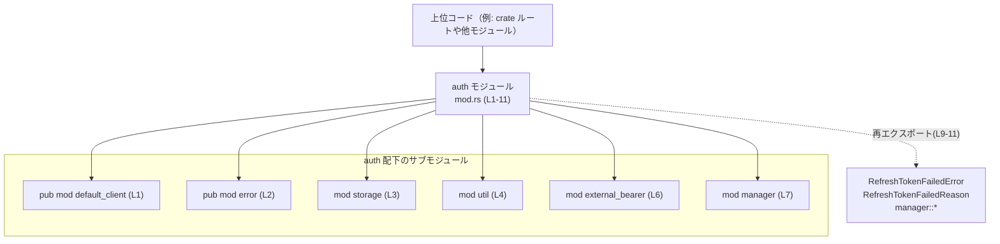

# login\src\auth\mod.rs

## 0. ざっくり一言

- 認証（auth）周辺のサブモジュールを束ね、エラー型と「manager」モジュール由来の公開 API を再エクスポートする「入口モジュール」です（`mod.rs:L1-2,L9-11`）。
- 実際のビジネスロジック（トークン管理・ストレージアクセス等）は、`default_client` / `error` / `storage` / `util` / `external_bearer` / `manager` といった下位モジュール側に実装されており、このファイルには含まれていません（`mod.rs:L1-7`）。

---

## 1. このモジュールの役割

### 1.1 概要

- このモジュールは、`auth` 名前空間配下のサブモジュールを宣言し（`mod.rs:L1-7`）、そのうち `error` と `manager` から一部の型・シンボルを上位に再エクスポートします（`mod.rs:L9-11`）。
- これにより、利用側は `crate::auth::RefreshTokenFailedError` などの名前でエラー型や manager 由来の API にアクセスできます（`mod.rs:L9-11`）。
- 認証のコアロジックやストレージ実装などの詳細はすべてサブモジュール側にあり、このファイルは「構成と公開範囲の定義」に専念しています（`mod.rs:L1-7`）。

### 1.2 アーキテクチャ内での位置づけ

このファイルは `auth` モジュールのルートとして、下位モジュールと上位コードの仲立ちをします。



- `default_client` と `error` は `pub mod` のため、`crate::auth::default_client` / `crate::auth::error` として直接アクセスできます（`mod.rs:L1-2`）。
- `storage` / `util` / `external_bearer` / `manager` は `mod` だけで `pub` が付いていないため、モジュールとしては内部専用です（`mod.rs:L3-4,L6-7`）。
- ただし `manager` の公開アイテムは `pub use manager::*;` によって `auth` 直下から再エクスポートされています（`mod.rs:L11`）。

### 1.3 設計上のポイント

- **モジュール集約によるファサード**  
  - `pub use manager::*;` により、`manager` モジュールの公開アイテムを `auth` 直下にまとめています（`mod.rs:L11`）。
  - これにより、利用側は `auth::Xxx` という浅いパスで主要な API にアクセスできる設計になっています。

- **エラー型の一元公開**  
  - `RefreshTokenFailedError` / `RefreshTokenFailedReason` を `error` モジュールから再エクスポートし（`mod.rs:L9-10`）、エラー型の利用パスを固定しています。
  - エラー処理の呼び出し元は、`auth` モジュールの公開 API の一部としてこれらの型を扱えます。

- **内部実装と公開 API の分離**  
  - `storage` / `util` / `external_bearer` / `manager` を非公開モジュールとして隠蔽し（`mod.rs:L3-4,L6-7`）、実装詳細への直接依存を避けています。
  - 変更時には、基本的にこの `mod.rs` の再エクスポート定義を維持することで、上位コードとの互換性を保てます。

- **安全性・並行性について**  
  - このファイルには `unsafe` キーワードや `async`、スレッド関連 API などは一切登場せず（`mod.rs:L1-11`）、モジュール構成のみを定義しています。
  - メモリ安全性や並行性制御の詳細は、下位モジュール（特に `manager` や `storage`）側の実装に依存します。このチャンクだけからは判断できません。

---

## 2. 主要な機能一覧（コンポーネントインベントリー）

このチャンクに現れるコンポーネント（モジュール・再エクスポート）の一覧です。

### 2.1 モジュール・再エクスポート一覧

| 名称 | 種別 | 公開範囲 | 役割 / 用途（このチャンクから分かる範囲） | 根拠 |
|------|------|----------|------------------------------------------|------|
| `default_client` | サブモジュール | 公開 (`pub mod`) | 認証関連の「デフォルトクライアント」を提供するモジュール名と解釈できますが、実装はこのチャンクにはありません。 | `mod.rs:L1` |
| `error` | サブモジュール | 公開 (`pub mod`) | 認証関連のエラー型や結果を定義するモジュール名と推測できますが、詳細はこのチャンクにはありません。 | `mod.rs:L2` |
| `storage` | サブモジュール | 内部 (`mod`) | 認証情報やトークンの保存を扱うモジュール名と推測されますが、実装は不明です。 | `mod.rs:L3` |
| `util` | サブモジュール | 内部 (`mod`) | 汎用的なユーティリティ処理を提供するモジュール名と考えられますが、コードはこのチャンクには現れません。 | `mod.rs:L4` |
| `external_bearer` | サブモジュール | 内部 (`mod`) | 「外部の bearer（トークン）」に関連する処理を担うモジュール名と推測されますが、詳細は不明です。 | `mod.rs:L6` |
| `manager` | サブモジュール | 内部 (`mod`) | 認証・トークン管理の「マネージャ」機能を持つモジュール名と推測されます。公開 API は `pub use manager::*;` で再エクスポートされています。 | `mod.rs:L7,L11` |
| `RefreshTokenFailedError` | 型（具体的な種別不明） | 公開（`pub use`） | リフレッシュトークン処理の失敗を表すエラー型と考えられますが、構造体か列挙体かなどはこのチャンクからは分かりません。 | `mod.rs:L9` |
| `RefreshTokenFailedReason` | 型（具体的な種別不明） | 公開（`pub use`） | エラーの発生理由を表す型と考えられますが、具体的なバリアントやフィールドは不明です。 | `mod.rs:L10` |
| `manager::*` | 複数の型/関数など | 公開（`pub use`） | `manager` モジュール内の公開アイテムをまとめて外部に公開しています。具体的な名前や種別はこのチャンクには現れません。 | `mod.rs:L11` |

> 備考:  
> 上記の「役割 / 用途」のうち、「〜と推測されます」「〜と考えられます」と記載している部分は、名称とファイル構成からの推測であり、実際の実装やビジネスロジックはこのチャンクだけでは断定できません。

### 2.2 関数・構造体のインベントリー

- このファイル自体には、関数・構造体・列挙体・トレイトなどの定義は一切含まれていません（`mod.rs:L1-11`）。
- `RefreshTokenFailedError` / `RefreshTokenFailedReason` および `manager::*` 由来の各種関数・型は、このチャンクでは宣言元が見えないため、個々のシンボル名やシグネチャを列挙することはできません。

---

## 3. 公開 API と詳細解説

### 3.1 型一覧（構造体・列挙体など）

このチャンクから「名前」と「公開されていること」が分かる型は以下の 2 つです。

| 名前 | 種別 | 役割 / 用途 | 根拠 |
|------|------|-------------|------|
| `RefreshTokenFailedError` | 具体的な種別は不明（構造体か列挙体など） | リフレッシュトークン更新処理の失敗を表すエラー型と解釈できますが、このチャンクからは中身・フィールド・実装トレイトは分かりません。 | `mod.rs:L9` |
| `RefreshTokenFailedReason` | 具体的な種別は不明 | エラーの種類・理由を表現する型名と解釈できますが、どのようなバリアントがあるかなどは不明です。 | `mod.rs:L10` |

> 種別（構造体 / 列挙体 など）を断定する情報は `mod.rs` には無いため、「不明」と記載しています。正確な情報は `error` モジュールの定義ファイルを参照する必要があります。

### 3.2 関数詳細（最大 7 件）

- このファイルには関数定義が存在せず（`mod.rs:L1-11`）、また `pub use manager::*;` による再エクスポート部分では個々の関数名が示されていないため、関数シグネチャを特定することができません。
- したがって、このセクションで「関数ごとの詳細解説」を行うことはできません。関数の一覧と仕様は `manager` モジュールのソースコード側にあります。

### 3.3 その他の関数

- このチャンク内に「その他の関数」も含め、いかなる関数定義も出現していません（`mod.rs:L1-11`）。
- `manager` 由来の公開関数群は存在する可能性が高いですが、名前や個数をこのチャンクだけから列挙することはできません。

---

## 4. データフロー

### 4.1 モジュールレベルの「公開インターフェース」フロー（確定情報）

実際の「関数呼び出しの流れ」はこのチャンクでは分かりませんが、「どのモジュール経由でどの型にアクセスするか」といった公開インターフェースレベルのデータフローは、ある程度記述できます。

```mermaid
sequenceDiagram
    participant Caller as 上位コード
    participant Auth as auth モジュール<br/>(mod.rs L1-11)
    participant ErrMod as error モジュール<br/>(L2, 再エクスポート L9-10)
    participant MgrMod as manager モジュール<br/>(L7, 再エクスポート L11)

    Caller->>Auth: use crate::auth::RefreshTokenFailedError; (L9)
    Auth->>ErrMod: 型を再エクスポート（コンパイル時解決, L9-10）
    Caller->>Auth: use crate::auth::*; (L11)
    Auth->>MgrMod: manager の公開アイテムを再エクスポート（コンパイル時, L11)

    Note over Caller,Auth: 実際の関数呼び出しやデータ処理の流れは<br/>error / manager の実装に依存し、このチャンクには現れません。
```

- 上位コードは `auth` モジュールを経由して、`error` / `manager` 内の API にアクセスします（`mod.rs:L2,L7,L9-11`）。
- `auth` モジュールはあくまでコンパイル時の名前解決を簡略化する「窓口」であり、実際のデータ処理は `error` / `manager` などのサブモジュール側で行われます。
- したがって、このファイルは「データフローの起点」と「公開インターフェースの整形」を担い、実際のロジックフローは別ファイルに委ねられています。

### 4.2 実際の処理フローについて

- ユーザー認証やトークンリフレッシュなどの「実処理におけるデータフロー（どの関数が何を返し、どこでエラーが生成されるか）」は、このチャンクの情報だけでは追跡できません。
- 特に以下は **不明** です。
  - どの関数が `RefreshTokenFailedError` を生成するか
  - `manager` 内の状態管理や `storage` / `external_bearer` との連携方法
  - 並行実行（`async` / スレッド）を使うかどうか

---

## 5. 使い方（How to Use）

このファイルから確実に分かる「使い方」は、主にモジュールのインポート方法とエラー型の利用方法に限られます。

### 5.1 基本的な使用方法（エラー型の利用）

`RefreshTokenFailedError` を利用側から参照する最小限の例です。

```rust
// auth モジュールからエラー型を直接インポートする                     // mod.rs:L9-10 により、このパスで参照可能
use crate::auth::{RefreshTokenFailedError, RefreshTokenFailedReason};     

// 例: 何らかの認証処理からエラーを受け取る関数のシグネチャ
fn handle_refresh_error(err: RefreshTokenFailedError) {                   // 実際のフィールド/メソッドは error モジュール側を参照する必要がある
    // ここで err をログ出力したり、ユーザー向けメッセージに変換したりする
    // ただし、このチャンクからは err の中身が分からないため、具体例は示せません。
}
```

- 上記は「型をどうインポートするか」の例であり、`RefreshTokenFailedError` / `RefreshTokenFailedReason` の中身やメソッドは、このチャンクからは不明です。

### 5.2 モジュールのインポートパターン

サブモジュールを使う場合のインポートパターンです（中身は不明ですが、名前解決の方法だけ示します）。

```rust
// default_client / error は pub mod のため、モジュールとして直接参照可能          // mod.rs:L1-2
use crate::auth::default_client;
use crate::auth::error;

// manager の公開アイテムは auth 直下に再エクスポートされている                  // mod.rs:L7,L11
use crate::auth::*;   // ここに manager::* 由来の型/関数が含まれる
```

- `storage` / `util` / `external_bearer` / `manager` は非公開モジュールであるため、`crate::auth::storage` のように直接参照することはできません（`mod.rs:L3-4,L6-7`）。
- これら内部モジュールの公開アイテムを利用したい場合は、`auth` モジュール経由で再エクスポートされているかどうか（`pub use` の有無）を確認する必要があります。

### 5.3 よくある間違い（推測されるパターン）

このファイル構造から想定される、ありがちな誤用と正しい利用例です。

```rust
// 誤りの可能性が高い例: 内部モジュールに直接依存してしまう
// use crate::auth::manager;        // mod.rs では manager は pub mod ではないため、外部からは参照できない（コンパイルエラー）

// 正しいパターン: auth モジュールが公開しているシンボル経由で利用する
use crate::auth::*;                 // manager::* が auth 直下に再エクスポートされる（mod.rs:L11）
```

- 内部モジュール（`mod` のみの宣言）への直接依存は、モジュール設計から見ると意図されていないと解釈できます（`mod.rs:L3-4,L6-7`）。
- 公開 API は `pub mod` / `pub use` を通じて露出しているものに限定して利用することが前提条件になります。

### 5.4 使用上の注意点（まとめ）

- **公開パスの前提**  
  - `RefreshTokenFailedError` / `RefreshTokenFailedReason` に依存するコードは、`crate::auth::RefreshTokenFailedError` というパスに依存しているとみなせます（`mod.rs:L9-10`）。このパスを変更すると上位コードが壊れるため、移動時には注意が必要です。
- **内部モジュールへの直接依存禁止**  
  - `storage` / `util` / `external_bearer` / `manager` は非公開モジュールであるため、外部からの直接参照を前提とした設計は避ける必要があります（`mod.rs:L3-4,L6-7`）。
- **並行性やエラー仕様の詳細は別ファイル依存**  
  - エラーのバリアント、非同期処理の有無、スレッド安全性などはこのチャンクでは判断できません。`error` / `manager` / `storage` など、実装ファイル側のドキュメントやコードを確認する必要があります。

---

## 6. 変更の仕方（How to Modify）

このファイルは主に「モジュール構成」と「公開範囲」を定義しているため、変更はその二点に関わります。

### 6.1 新しい機能を追加する場合

1. **新しいモジュールを追加する**  
   - 例: 新しい認証方式を追加する場合、`auth` 配下に `new_method` モジュールを作成し、ここに `mod new_method;` または `pub mod new_method;` を追加します（`mod.rs:L1-7` と同様の書き方）。
   - 公開したいかどうかで `pub mod` / `mod` を使い分けます。

2. **新しいエラー型を公開する**  
   - `error` モジュール内に型を定義し（定義位置はこのチャンクからは不明ですが、Rust の慣例では `auth/error.rs` か `auth/error/mod.rs` に存在します）、この `mod.rs` に `pub use error::NewErrorType;` を追加すると、`crate::auth::NewErrorType` というパスで公開できます（`mod.rs:L9-10` と同じパターン）。

3. **manager 由来の API を追加する**  
   - `manager` モジュール内で公開アイテム（`pub fn` / `pub struct` など）を追加し（定義位置は `auth/manager.rs` などと推測されます）、`pub use manager::*;` があるため、特に `mod.rs` 側で追加作業をしなくても自動的に `auth` 直下から利用可能になります（`mod.rs:L11`）。
   - ただし、`manager` 内の公開範囲を変えると `auth` の公開 API も変わるため、呼び出し元への影響を確認する必要があります。

### 6.2 既存の機能を変更する場合

- **エラー型の移動・名称変更**
  - `RefreshTokenFailedError` / `RefreshTokenFailedReason` の名前を変更したり、`error` 以外のモジュールに移動したりする場合、この `mod.rs` の `pub use` 行（`mod.rs:L9-10`）も合わせて変更する必要があります。
  - これを変更すると、`crate::auth::RefreshTokenFailedError` に依存する既存コードがコンパイルエラーになる可能性があります。

- **内部モジュールの公開範囲変更**
  - 例えば `mod manager;` を `pub mod manager;` に変更すると（`mod.rs:L7`）、`crate::auth::manager` というパスが新たに公開されます。
  - これにより利用側が `auth::manager` に直接依存し始めると、将来的なリファクタリング時の制約になるため、「意図した公開 API」かどうかをよく検討する必要があります。

- **再エクスポートの削除**
  - `pub use manager::*;` を削除すると（`mod.rs:L11`）、これまで `auth` 直下から利用できた `manager` の型・関数がすべて見えなくなります。
  - これは API 互換性に大きな影響を与えるため、削除前に利用箇所の洗い出しが必要です。

---

## 7. 関連ファイル

この `mod.rs` が参照しているサブモジュールの定義ファイルです。Rust のモジュール規約から、以下のいずれかのパスに存在します（このチャンクからはどちらかを特定できません）。

| パス（候補） | 役割 / 関係 | 根拠 |
|-------------|------------|------|
| `login/src/auth/default_client.rs` または `login/src/auth/default_client/mod.rs` | `pub mod default_client;` で宣言されるモジュール。本モジュールから公開されており、認証用の「デフォルトクライアント」機能を提供すると推測されます。 | `mod.rs:L1` |
| `login/src/auth/error.rs` または `login/src/auth/error/mod.rs` | `pub mod error;` で宣言されるエラー関連モジュール。`RefreshTokenFailedError` / `RefreshTokenFailedReason` の定義元と考えられます。 | `mod.rs:L2,L9-10` |
| `login/src/auth/storage.rs` または `login/src/auth/storage/mod.rs` | `mod storage;` で宣言される内部用ストレージモジュール。トークンや認証情報の保存に関わる可能性がありますが、詳細は不明です。 | `mod.rs:L3` |
| `login/src/auth/util.rs` または `login/src/auth/util/mod.rs` | `mod util;` で宣言される内部ユーティリティモジュール。認証処理共通の補助関数などが置かれていると推測されます。 | `mod.rs:L4` |
| `login/src/auth/external_bearer.rs` または `login/src/auth/external_bearer/mod.rs` | `mod external_bearer;` で宣言される内部モジュール。外部の bearer トークンとの連携を扱う可能性があります。 | `mod.rs:L6` |
| `login/src/auth/manager.rs` または `login/src/auth/manager/mod.rs` | `mod manager;` と `pub use manager::*;` の対象となるモジュール。認証の「マネージャ」機能を提供する中核モジュールと推測されます。 | `mod.rs:L7,L11` |

---

### Bugs / Security / Contracts / Edge Cases（このチャンクから分かる範囲）

- **Bugs / Security**  
  - このファイルはモジュール宣言と再エクスポートのみで構成されており（`mod.rs:L1-11`）、実行時処理や入力検証を行うコードが存在しません。そのため、このファイル単体からバグやセキュリティホールを判断することはできません。
- **Contracts（契約）**  
  - 契約として明示されているのは、「`auth` モジュールを通じて `RefreshTokenFailedError` / `RefreshTokenFailedReason` および `manager` の公開アイテムが参照できる」という公開 API です（`mod.rs:L9-11`）。
  - 呼び出し元はこのパス（名前空間）を契約として利用しているとみなせるため、変更時には後方互換性を意識する必要があります。
- **Edge Cases**  
  - 実行時エッジケース（空入力・期限切れトークンなど）は、すべて下位モジュールの実装に委ねられており、このチャンクからは一切読み取れません。

以上が、このチャンク（`login\src\auth\mod.rs`）から読み取れる範囲での詳細な解説です。
