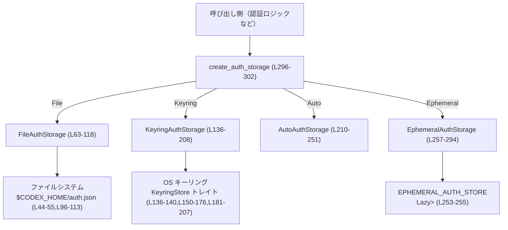
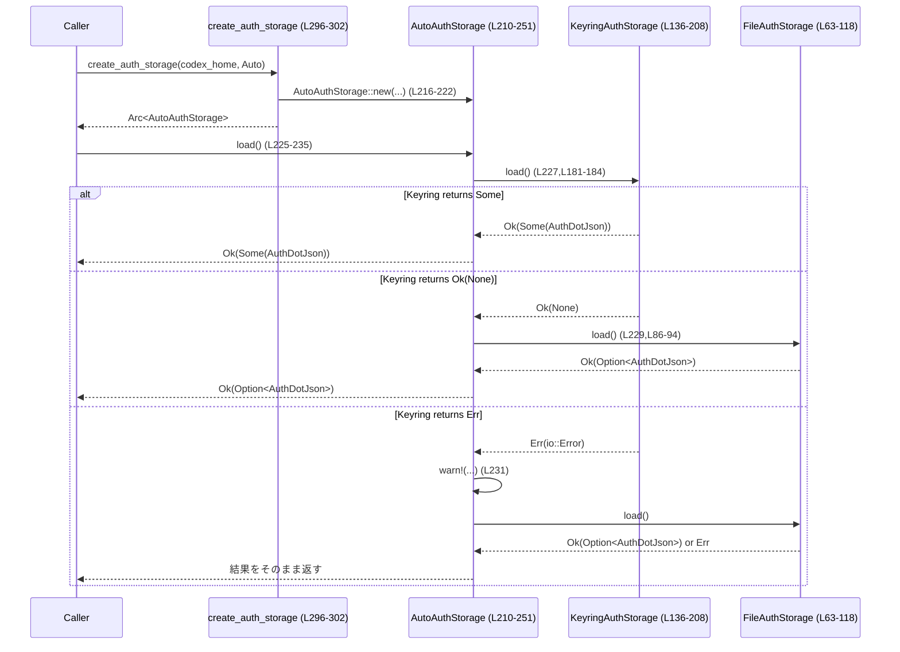

# login/src/auth/storage.rs

## 0. ざっくり一言

`AuthDotJson` 形式の認証情報を、**ファイル / OS キーリング / 自動選択 / プロセス内メモリ**の 4 通りで保存・読み出しするストレージ層を実装するモジュールです。（根拠: `login/src/auth/storage.rs:L28-42,L63-317`）

---

## 1. このモジュールの役割

### 1.1 概要

- このモジュールは、CLI などが利用する認証情報（トークン・API キーなど）を安全かつ一貫したインターフェースで保存・取得するために存在します。（`AuthStorageBackend` トレイト）（根拠: L57-61）
- 保存先として、ファイル (`auth.json`), OS のキーリングストア、キーリング＋ファイル自動フォールバック、プロセス内の一時メモリを切り替え可能にします。（根拠: L63-118,L136-208,L210-251,L257-294,L304-316）
- 呼び出し側は `create_auth_storage` でストレージを生成し、`load` / `save` / `delete` を通じて認証情報を扱います。（根拠: L57-61,L296-302）

### 1.2 アーキテクチャ内での位置づけ

このモジュールは「認証情報の永続化レイヤ」として、上位の認証ロジックと、下位の OS キーリング・ファイルシステム・プロセス内メモリの間に位置します。



- `create_auth_storage` が `AuthCredentialsStoreMode` に応じて各ストレージ実装を選択します。（根拠: L296-302,L304-316）
- Auto モードでは Keyring ストアを優先し、失敗時にはファイルストアへフォールバックします。（根拠: L225-245）

### 1.3 設計上のポイント

- **責務分割**
  - 共通インターフェース: `AuthStorageBackend` トレイトが `load` / `save` / `delete` を定義。（根拠: L57-61）
  - 実装ごとに構造体を分離: `FileAuthStorage` / `KeyringAuthStorage` / `AutoAuthStorage` / `EphemeralAuthStorage`。（根拠: L63-66,L136-140,L210-214,L257-260）
- **キー計算の一元化**
  - `compute_store_key` が `codex_home` パスからハッシュを作り、キーリングやメモリストア用の短いキーに変換。（根拠: L120-134）
- **エラーハンドリング方針**
  - すべてのストレージ操作は `std::io::Result` を返し、IO エラーと JSON シリアライズ／デシリアライズのエラーを `std::io::Error::other` などに変換して統一。（根拠: L48-55,L75-82,L96-113,L150-162,L165-176,L181-207,L267-276,L280-293）
  - リカバリ可能なケース（ファイルがない場合など）は `Ok(None)` などで表現。（根拠: L86-94,L48-55）
- **並行性**
  - `AuthStorageBackend: Send + Sync` により、どのバックエンドもスレッド安全であることを要求。（根拠: L57）
  - 共有が必要なリソースには `Arc` や `Mutex` を使用（キーリングストア、グローバルメモリストア）。 （根拠: L17-18,L136-140,L210-214,L253-255）
- **セキュリティ**
  - ファイル保存時に（UNIX では）パーミッション `0o600` を指定して、所有者のみ読み書き可能。（根拠: L103-107）
  - キーリング保存では OS のセキュアストレージを使用し、保存キー自体はハッシュで短縮。（根拠: L120-134,L150-162,L165-176,L181-207）

### 1.4 コンポーネントインベントリー（型・トレイト・グローバル）

| 名前 | 種別 | 役割 / 用途 | 定義位置 |
|------|------|-------------|----------|
| `AuthDotJson` | 構造体 | `$CODEX_HOME/auth.json` の JSON 構造を表す。認証モード・OpenAI API キー・トークン・最終更新時刻を格納。 | `login/src/auth/storage.rs:L28-42` |
| `AuthStorageBackend` | トレイト | 認証情報ストレージの共通インターフェース (`load` / `save` / `delete`) を定義。`Debug + Send + Sync` を要求。 | L57-61 |
| `FileAuthStorage` | 構造体 | `$CODEX_HOME/auth.json` によるファイルベースのストレージ実装。 | L63-66,L68-83,L85-118 |
| `KeyringAuthStorage` | 構造体 | OS キーリング (`KeyringStore`) に保存するストレージ実装。ファイル削除も兼ねる。 | L136-140,L142-178,L180-208 |
| `AutoAuthStorage` | 構造体 | キーリングストレージを優先し、失敗や未設定時にファイルストレージへフォールバックする複合ストレージ。 | L210-214,L216-223,L225-251 |
| `EphemeralAuthStorage` | 構造体 | プロセス内グローバル `HashMap` を用いて、実行中のみ有効な一時的ストレージを提供。 | L257-260,L262-276,L279-293 |
| `EPHEMERAL_AUTH_STORE` | `Lazy<Mutex<HashMap<...>>>` | `codex_home` ごとの `AuthDotJson` を保持するグローバルなインメモリマップ。`EphemeralAuthStorage` から利用される。 | L253-255 |
| `KEYRING_SERVICE` | 定数文字列 | キーリングストアで利用する「サービス名」。 | L120 |

### 1.5 コンポーネントインベントリー（関数・メソッド）

| 名前 | 種別 | 役割 / 用途 | 定義位置 |
|------|------|-------------|----------|
| `get_auth_file(codex_home: &Path)` | 関数 | `$CODEX_HOME/auth.json` のフルパスを組み立てる。 | L44-46 |
| `delete_file_if_exists(codex_home: &Path)` | 関数 | `auth.json` を削除し、存在していたかを `bool` で返す。 | L48-55 |
| `FileAuthStorage::new` | メソッド | ファイルストレージのコンストラクタ。`codex_home` を保持。 | L68-71 |
| `FileAuthStorage::try_read_auth_json` | メソッド | `auth.json` を開いて文字列として読み込み、`AuthDotJson` にデシリアライズ。 | L73-82 |
| `FileAuthStorage::load` | メソッド | `auth.json` を読み込み、存在しなければ `Ok(None)` を返す。 | L85-94 |
| `FileAuthStorage::save` | メソッド | `AuthDotJson` を JSON として `auth.json` に保存（パーミッション設定を含む）。 | L96-113 |
| `FileAuthStorage::delete` | メソッド | `auth.json` を削除。`delete_file_if_exists` の薄いラッパー。 | L115-117 |
| `compute_store_key(codex_home: &Path)` | 関数 | `codex_home` のパスから SHA-256 ハッシュを計算し、キーリングやメモリストアで使う短いキーを生成。 | L122-134 |
| `KeyringAuthStorage::new` | メソッド | キーリングストレージのコンストラクタ。`codex_home` と `Arc<dyn KeyringStore>` を保持。 | L142-148 |
| `KeyringAuthStorage::load_from_keyring` | メソッド | キーリングから文字列を取得し、`AuthDotJson` にデシリアライズ。 | L150-162 |
| `KeyringAuthStorage::save_to_keyring` | メソッド | キーリングに文字列を保存。失敗時は warn ログを出しつつエラーに変換。 | L165-176 |
| `KeyringAuthStorage::load` | メソッド | `compute_store_key` でキーを計算し、キーリングから `AuthDotJson` をロード。 | L180-184 |
| `KeyringAuthStorage::save` | メソッド | `AuthDotJson` を JSON 文字列にシリアライズしてキーリングに保存し、フォールバック用ファイルを削除。 | L186-195 |
| `KeyringAuthStorage::delete` | メソッド | キーリングとファイルから認証情報を削除し、どちらかで削除できたかを返す。 | L197-207 |
| `AutoAuthStorage::new` | メソッド | Keyring と File の両バックエンドを内部に保持するストレージを構築。 | L216-222 |
| `AutoAuthStorage::load` | メソッド | まずキーリングから読み込み、失敗または未設定時にはファイルから読み込む。 | L225-235 |
| `AutoAuthStorage::save` | メソッド | まずキーリングへの保存を試み、失敗時にファイルへフォールバック保存。 | L237-244 |
| `AutoAuthStorage::delete` | メソッド | Keyring ストレージの削除を呼び出し、結果的にキーリングとファイルの両方から削除。 | L247-250 |
| `EphemeralAuthStorage::new` | メソッド | エフェメラルストレージのコンストラクタ。`codex_home` を保持。 | L262-265 |
| `EphemeralAuthStorage::with_store` | メソッド | グローバルな `Mutex<HashMap<...>>` をロックし、クロージャに渡して操作するヘルパ。 | L267-276 |
| `EphemeralAuthStorage::load` | メソッド | `with_store` を使ってメモリストアから `AuthDotJson` を取得（クローン）する。 | L279-282 |
| `EphemeralAuthStorage::save` | メソッド | `with_store` を使ってメモリストアに `AuthDotJson` を保存（クローン）する。 | L284-288 |
| `EphemeralAuthStorage::delete` | メソッド | `with_store` を使ってメモリストアから要素を削除し、存在していたかを返す。 | L291-293 |
| `create_auth_storage` | 関数 | `AuthCredentialsStoreMode` に応じて適切な `AuthStorageBackend` 実装を `Arc` で返すファクトリ。 | L296-302 |
| `create_auth_storage_with_keyring_store` | 関数 | テストや差し替え用に、任意の `Arc<dyn KeyringStore>` を受け取れる内部ファクトリ。 | L304-316 |

---

## 2. 主要な機能一覧

- 認証情報 JSON 型定義: `AuthDotJson` による `$CODEX_HOME/auth.json` フォーマットの表現。（L28-42）
- ストレージ抽象化: `AuthStorageBackend` トレイトによる共通 API (`load` / `save` / `delete`) の提供。（L57-61）
- ファイルストレージ: `FileAuthStorage` による `auth.json` の読み書き・削除。（L63-118）
- キーリングストレージ: `KeyringAuthStorage` による OS キーリングへの保存・ロード・削除とファイル削除。（L136-208）
- 自動ストレージ: `AutoAuthStorage` による Keyring 優先＋ File フォールバックの読込／保存／削除。（L210-251）
- エフェメラルストレージ: `EphemeralAuthStorage` とグローバル `EPHEMERAL_AUTH_STORE` によるプロセス内インメモリ保存。（L253-255,L257-294）
- ストレージファクトリ: `create_auth_storage` / `create_auth_storage_with_keyring_store` によるストレージ種別の生成。（L296-316）
- ストアキー計算: `compute_store_key` による `codex_home` からの短いキー生成（キーリング・インメモリ共通）。 （L122-134）

---

## 3. 公開 API と詳細解説

### 3.1 型一覧（構造体・列挙体など）

| 名前 | 種別 | 役割 / 用途 | 主なフィールド | 定義位置 |
|------|------|-------------|----------------|----------|
| `AuthDotJson` | 構造体 | 認証設定ファイル `auth.json` の内容を表現するデータ構造。 | `auth_mode: Option<AuthMode>` / `openai_api_key: Option<String>` / `tokens: Option<TokenData>` / `last_refresh: Option<DateTime<Utc>>` | L28-41 |
| `AuthStorageBackend` | トレイト | すべてのストレージ実装が従うべきインターフェース。`load` / `save` / `delete` を定義。スレッド安全 (`Send + Sync`) を要求。 | — | L57-61 |
| `FileAuthStorage` | 構造体 | ファイルベースの永続ストレージ。`codex_home` のパスを保持し、`auth.json` にアクセス。 | `codex_home: PathBuf` | L63-66 |
| `KeyringAuthStorage` | 構造体 | OS キーリングを利用したストレージ。`codex_home` と `Arc<dyn KeyringStore>` を保持。 | `codex_home: PathBuf`, `keyring_store: Arc<dyn KeyringStore>` | L136-140 |
| `AutoAuthStorage` | 構造体 | `KeyringAuthStorage` と `FileAuthStorage` の複合。Keyring を優先し、失敗時に File へフォールバック。 | `keyring_storage: Arc<KeyringAuthStorage>`, `file_storage: Arc<FileAuthStorage>` | L210-214 |
| `EphemeralAuthStorage` | 構造体 | 実行中のみ有効なグローバルインメモリストアにアクセスするバックエンド。 | `codex_home: PathBuf` | L257-260 |

> `AuthDotJson` は `Deserialize + Serialize + Clone + Debug + PartialEq` を derive しており、JSON シリアライズ／デシリアライズ・比較・ログ出力が容易です。（根拠: L29）

---

### 3.2 関数詳細（主要 7 件）

#### 1. `create_auth_storage(codex_home: PathBuf, mode: AuthCredentialsStoreMode) -> Arc<dyn AuthStorageBackend>`

**概要**

- 指定された `codex_home` と保存モード (`File` / `Keyring` / `Auto` / `Ephemeral`) に応じて、適切なストレージ実装を `Arc<dyn AuthStorageBackend>` として生成するファクトリ関数です。（根拠: L296-302,L304-316）

**引数**

| 引数名 | 型 | 説明 |
|--------|----|------|
| `codex_home` | `PathBuf` | 認証情報を紐づけるベースディレクトリ（通常 `$CODEX_HOME`）。ストレージ種別に関わらずキー計算などにも利用されます。 |
| `mode` | `AuthCredentialsStoreMode` | 保存先を表すモード。`File` / `Keyring` / `Auto` / `Ephemeral` の 4 種類がこのファイルから確認できます。 （根拠: L304-316） |

**戻り値**

- `Arc<dyn AuthStorageBackend>`  
  選択されたストレージ実装を指すスレッド安全な参照カウント付きポインタです。（根拠: L296-302）

**内部処理の流れ**

1. デフォルトのキーリングストアとして `DefaultKeyringStore` を `Arc` で生成。（L300）
2. 内部関数 `create_auth_storage_with_keyring_store` に `codex_home`・`mode`・キーリングストアを渡す。（L301）
3. 内部関数では `match mode { ... }` で各モードに対応する実装を `Arc::new` で包んで返します。（L304-316）

**Examples（使用例）**

典型的な利用例として、Auto モードでストレージを生成し、認証情報をロードするコードです。

```rust
use std::path::PathBuf;
use std::io;
use codex_config::types::AuthCredentialsStoreMode;
use login::auth::storage::{create_auth_storage, AuthDotJson}; // 実際のパスはクレート構成に依存

fn load_auth() -> io::Result<Option<AuthDotJson>> {
    let codex_home = PathBuf::from("/path/to/codex_home"); // CODEX_HOME 相当のパス
    // Auto モードでストレージを生成する
    let storage = create_auth_storage(codex_home, AuthCredentialsStoreMode::Auto);
    // 認証情報を読み込む（存在しない場合は Ok(None)）
    storage.load()
}
```

**Errors / Panics**

- この関数自体は `Result` を返さず、panic も起こしていません。（根拠: L296-302）
- 内部の `Arc::new` や構造体の `new` は現状パニックを起こす可能性はありません。

**Edge cases（エッジケース）**

- `codex_home` が存在しないディレクトリであっても、そのまま `PathBuf` として保持されるだけで、ここでは検証されません。実際のエラーは各バックエンドの `load` / `save` 時に発生します。

**使用上の注意点**

- 呼び出し後は `Arc<dyn AuthStorageBackend>` をクローンして複数スレッドから安全に共有できます（トレイトに `Send + Sync` 制約があるため）。（根拠: L57）
- `mode` の値に応じてストレージの耐久性・セキュリティ特性が変わるため、用途に応じて選択する必要があります（例: `Ephemeral` はプロセス終了時に消える）。これは `create_auth_storage_with_keyring_store` の `match` から読み取れます。（根拠: L304-316）

---

#### 2. `FileAuthStorage::load(&self) -> std::io::Result<Option<AuthDotJson>>`

**概要**

- `$CODEX_HOME/auth.json` を開いて `AuthDotJson` として読み込みます。ファイルが存在しない場合はエラーにせず `Ok(None)` を返します。（根拠: L85-94）

**引数**

- `&self`: 内部に保持している `codex_home: PathBuf` を用いてファイルパスを決定します。（根拠: L63-66,L86-88）

**戻り値**

- `Ok(Some(AuthDotJson))`: ファイルが存在し、正常に読み込めた場合。
- `Ok(None)`: ファイルが存在しない場合（`NotFound`）。 （根拠: L88-91）
- `Err(std::io::Error)`: その他の IO エラーや JSON パースエラー。（根拠: L88-92）

**内部処理の流れ**

1. `get_auth_file(&self.codex_home)` で `auth.json` のパスを取得。（L87）
2. `try_read_auth_json` を呼び出してファイルを開き、文字列として読み込み、`AuthDotJson` にデシリアライズ。（L88,L75-82）
3. `match` で結果を分岐：
   - `Ok(auth)` の場合はそのまま返す。
   - `Err(err)` で `err.kind() == NotFound` の場合は `Ok(None)` を返す。（L90）
   - その他のエラーはそのまま `Err(err)` として返す。（L91）

**Examples（使用例）**

```rust
use std::path::PathBuf;
use std::io;
use login::auth::storage::FileAuthStorage;

fn read_from_file() -> io::Result<()> {
    let codex_home = PathBuf::from("/tmp/codex");             // 認証ファイルを置くディレクトリ
    let storage = FileAuthStorage::new(codex_home);           // ストレージを構築
    match storage.load()? {                                   // ファイルから読み込み
        Some(auth) => println!("Loaded: {:?}", auth),         // 読み込めた場合
        None => println!("No auth.json found"),               // ファイルが存在しない場合
    }
    Ok(())
}
```

**Errors / Panics**

- `File::open` / `read_to_string` / `serde_json::from_str` / `serde_json::from_str` に起因するエラーが `std::io::Error` として返ります。（根拠: L75-82）
- パニックを起こすコードはありません。

**Edge cases**

- `auth.json` の内容が壊れていて JSON としてパースできない場合、`serde_json::from_str` のエラーが `std::io::Error` に変換されて `Err` になります。（根拠: L75-82）
- ファイルは存在するがパーミッション不足で開けない場合も `Err` になります（`File::open` 経由）。 （根拠: L75-76）

**使用上の注意点**

- 「ないことは正常」と見なす API なので、呼び出し側は `Ok(None)` を想定した分岐を書いておく必要があります。
- 認証情報の破損（不正 JSON）は例外ではなく `Err` として通知されるため、上位でユーザに再ログインを促す等の処理を組み合わせることが想定されます（これはコードから推測されますが、具体的な上位ロジックはこのチャンクには現れません）。

---

#### 3. `FileAuthStorage::save(&self, auth_dot_json: &AuthDotJson) -> std::io::Result<()>`

**概要**

- `AuthDotJson` を JSON 文字列にシリアライズし、`$CODEX_HOME/auth.json` に保存します。ディレクトリがなければ作成し、UNIX ではパーミッション `0o600` を設定します。（根拠: L96-113）

**引数**

| 引数名 | 型 | 説明 |
|--------|----|------|
| `&self` | `&FileAuthStorage` | 内部の `codex_home` を利用して保存先を決定。 |
| `auth_dot_json` | `&AuthDotJson` | 保存対象の認証情報。 |

**戻り値**

- `Ok(())`: 保存に成功した場合。
- `Err(std::io::Error)`: ディレクトリ作成・シリアライズ・ファイルオープン・書き込み・フラッシュのいずれかでエラーが発生した場合。

**内部処理の流れ**

1. `get_auth_file(&self.codex_home)` で保存先パスを決定。（L97）
2. 親ディレクトリがあれば `std::fs::create_dir_all(parent)?;` で作成。（L99-101）
3. `serde_json::to_string_pretty(auth_dot_json)?` で JSON にシリアライズ。（L102）
4. `OpenOptions::new()` でファイルを開く設定を作成し、`truncate(true).write(true).create(true)` を設定。（L103-104）
5. UNIX の場合のみ `options.mode(0o600);` でパーミッションを 600 に設定。（L105-107）
6. `options.open(auth_file)?` でファイルを開き、`write_all` と `flush` で内容を書き込む。（L109-111）

**Examples（使用例）**

```rust
use std::path::PathBuf;
use std::io;
use chrono::Utc;
use codex_app_server_protocol::AuthMode;
use login::auth::storage::{FileAuthStorage, AuthDotJson};

fn write_to_file() -> io::Result<()> {
    let codex_home = PathBuf::from("/tmp/codex");
    let storage = FileAuthStorage::new(codex_home);

    let auth = AuthDotJson {
        auth_mode: Some(AuthMode::OpenAiApiKey), // 実際のバリアント名はこのチャンクには現れません
        openai_api_key: Some("sk-...".to_string()),
        tokens: None,
        last_refresh: Some(Utc::now()),
    };

    storage.save(&auth)?; // auth.json に保存
    Ok(())
}
```

**Errors / Panics**

- `serde_json::to_string_pretty` 失敗時（構造が循環しているなど）は `std::io::Error` に変換されて `Err` になります。（根拠: L102）
- UNIX 以外の OS ではパーミッション設定は行われず、デフォルトのファイルパーミッションに依存します（これは条件付きコンパイルから読み取れます）。 （根拠: L103-107）
- パニックを起こす可能性があるコードはこの関数内にはありません。

**Edge cases**

- `auth_file.parent()` が `None`（ルート直下など）の場合は `create_dir_all` は呼ばれません。（L99-101）
- ディスクフルや I/O エラーが発生した場合、`write_all` または `flush` で `Err` が返ります。（L110-111）

**使用上の注意点**

- 認証情報をファイルに平文で保存するため、パーミッション管理が重要です。UNIX では `0o600` に設定されますが、Windows では OS のデフォルト ACL に依存する点に注意が必要です。
- 書き込み頻度が高いとディスク I/O 負荷が増えるため、必要なタイミングに絞って呼び出すのが望ましいです（これは一般的な注意であり、コード中では明示されていません）。

---

#### 4. `KeyringAuthStorage::load(&self) -> std::io::Result<Option<AuthDotJson>>`

**概要**

- `compute_store_key` で生成したキーを使い、OS キーリングから認証情報文字列を読み込み、`AuthDotJson` にデシリアライズします。（根拠: L180-184）

**引数**

- `&self`: 内部の `codex_home` と `keyring_store` を利用します。（根拠: L136-140,L181-183）

**戻り値**

- `Ok(Some(AuthDotJson))`: キーリングに保存済みの認証情報を取得できた場合。
- `Ok(None)`: キーリングに該当キーが存在しない場合。（根拠: L150-162,L181-184）
- `Err(std::io::Error)`: キーリング操作や JSON デシリアライズに失敗した場合。

**内部処理の流れ**

1. `compute_store_key(&self.codex_home)?` でキー文字列（例: `"cli|abcdef0123456789"`）を生成。（L181-183,L122-134）
2. `load_from_keyring(&key)` を呼び出し、キーリングから値を取得。（L183,L150-162）
3. `load_from_keyring` 内では:
   - `keyring_store.load(KEYRING_SERVICE, key)` を呼び出す。（L151）
   - `Ok(Some(serialized))` の場合は `serde_json::from_str` で `AuthDotJson` にデシリアライズ。（L152-156）
   - `Ok(None)` の場合は `Ok(None)` を返す。（L157）
   - `Err(error)` の場合は `std::io::Error::other` でメッセージ付きエラーに変換。（L158-161）

**Examples（使用例）**

```rust
use std::path::PathBuf;
use std::io;
use codex_keyring_store::DefaultKeyringStore;
use login::auth::storage::KeyringAuthStorage;

fn read_from_keyring() -> io::Result<()> {
    let codex_home = PathBuf::from("/home/user/.codex");
    let keyring_store = std::sync::Arc::new(DefaultKeyringStore);
    let storage = KeyringAuthStorage::new(codex_home, keyring_store);

    if let Some(auth) = storage.load()? {
        println!("Loaded from keyring: {:?}", auth);
    } else {
        println!("No auth in keyring");
    }
    Ok(())
}
```

**Errors / Panics**

- キーリング API (`keyring_store.load`) が返すエラーは、メッセージ文字列に変換され、`ErrorKind::Other` の `std::io::Error` としてラップされます。（根拠: L158-161）
- JSON デシリアライズに失敗した場合も `std::io::Error::other` を通じて通知されます。（L152-156）
- パニックを起こすコードはありません。

**Edge cases**

- `compute_store_key` は内部で `canonicalize().unwrap_or_else(...)` を使っているため、パスの正規化に失敗してもエラーにはならず、元のパスを使います。（L123-126）  
  その結果、パスの状態（存在するかどうか）により、同じ `codex_home` 文字列でも異なるキーになる可能性があります。
- キーリングに保存されているデータが古いフォーマットや別用途の JSON の場合、パースエラーとなり `Err` が返ります。

**使用上の注意点**

- キーリングが利用できない環境（コンテナ内など）では、`keyring_store.load` がエラーとなる可能性があり、その場合 `Err` が返ります。
- 同じ `codex_home` から常に同じキーを得たい場合、`codex_home` パスの与え方（絶対／相対、シンボリックリンク経由など）に注意が必要です。

---

#### 5. `KeyringAuthStorage::save(&self, auth: &AuthDotJson) -> std::io::Result<()>`

**概要**

- `AuthDotJson` を JSON 文字列にシリアライズし、`compute_store_key` で生成したキーでキーリングに保存します。成功時にはフォールバック用の `auth.json` ファイルを削除します。（根拠: L186-195）

**引数**

| 引数名 | 型 | 説明 |
|--------|----|------|
| `&self` | `&KeyringAuthStorage` | `codex_home` と `keyring_store` を利用。 |
| `auth` | `&AuthDotJson` | 保存対象の認証情報。 |

**戻り値**

- `Ok(())`: キーリングへの保存（およびファイル削除処理）が成功した場合。
- `Err(std::io::Error)`: シリアライズ・キーリング保存のいずれかでエラーが発生した場合。

**内部処理の流れ**

1. `compute_store_key(&self.codex_home)?` でキーを生成。（L187）
2. `serde_json::to_string(auth).map_err(std::io::Error::other)?` で JSON 文字列を生成。（L189）
3. `save_to_keyring(&key, &serialized)?` でキーリングに保存。（L190,L165-176）
4. キーリング保存が成功した場合のみ、`delete_file_if_exists(&self.codex_home)` でフォールバックファイルの削除を試みる。（L191-193）
   - 削除失敗時は warn ログを出すが、エラーとしては返さない。（L191-193）

**Examples（使用例）**

```rust
use std::sync::Arc;
use std::path::PathBuf;
use std::io;
use codex_keyring_store::DefaultKeyringStore;
use login::auth::storage::{KeyringAuthStorage, AuthDotJson};

fn save_to_keyring(auth: &AuthDotJson) -> io::Result<()> {
    let codex_home = PathBuf::from("/home/user/.codex");
    let keyring_store = Arc::new(DefaultKeyringStore);
    let storage = KeyringAuthStorage::new(codex_home, keyring_store);

    storage.save(auth) // 失敗すれば Err(..)
}
```

**Errors / Panics**

- `serde_json::to_string` 失敗時には `std::io::Error::other` に変換されます。（L189）
- `keyring_store.save` の失敗も `std::io::Error::other` で包み、メッセージには `"failed to write OAuth tokens to keyring: ..."` が含まれます。（L165-176）
- ファイル削除 (`delete_file_if_exists`) の失敗は warn ログに残されますが、`save` の戻り値には影響しません。（L191-193）
- パニックを起こすコードはありません。

**Edge cases**

- キーリングへの保存に成功した後、フォールバックファイルの削除に失敗しても `Ok(())` が返るため、ファイルに認証情報が残る可能性があります。（L191-193）
- キーリングが利用できない環境では `save` そのものが `Err` になるため、Auto モードのようなフォールバック機構を利用しない限り保存は失敗します。

**使用上の注意点**

- この実装単体では失敗時のフォールバック（ファイル保存）は行いません。フォールバックが必要な場合は `AutoAuthStorage` を通じて利用する設計です。（Auto の `save` 実装参照: L237-244）
- エラーメッセージにキーリングエラーの `error.message()` が含まれるため、ログレベルやログ出力先の設定に注意が必要です（ただし、`error.message()` の内容に秘密情報が含まれるかどうかは `KeyringStore` 実装次第であり、このチャンクには現れません）。

---

#### 6. `EphemeralAuthStorage::with_store<F, T>(&self, action: F) -> std::io::Result<T>`

**概要**

- グローバルな `EPHEMERAL_AUTH_STORE: Lazy<Mutex<HashMap<...>>>` をロックし、`compute_store_key` で生成したキーとともに操作用クロージャに渡すヘルパメソッドです。ロード／セーブ／削除がこのメソッドを通じて一貫して実装されています。（根拠: L253-255,L267-276,L279-293）

**引数**

| 引数名 | 型 | 説明 |
|--------|----|------|
| `&self` | `&EphemeralAuthStorage` | 内部の `codex_home` からキーを計算するために利用。 |
| `action` | `F` | `FnOnce(&mut HashMap<String, AuthDotJson>, String) -> std::io::Result<T>` なクロージャ。ストアとキーを受け取って任意の操作を実行します。 |

**戻り値**

- `std::io::Result<T>`: `action` が返す結果をそのまま返します。`EPHEMERAL_AUTH_STORE` のロック取得失敗時などは `Err` になります。

**内部処理の流れ**

1. `compute_store_key(&self.codex_home)?` でキー文字列を生成。（L271）
2. `EPHEMERAL_AUTH_STORE.lock()` でグローバル `Mutex<HashMap<...>>` をロック。（L272-273）
3. ロックに失敗した場合（ポイズンなど）は、`std::io::Error::other("failed to lock ephemeral auth storage")` に変換。（L273-274）
4. ロック取得に成功した場合、`action(&mut store, key)` を呼び出して結果を返す。（L275）

`load` / `save` / `delete` はそれぞれ以下のように `with_store` を利用しています。（根拠: L279-293）

- `load`: `Ok(store.get(&key).cloned())`
- `save`: `store.insert(key, auth.clone()); Ok(())`
- `delete`: `Ok(store.remove(&key).is_some())`

**Examples（使用例）**

`with_store` を直接使うことは通常ありませんが、構造を理解するための擬似コード例です。

```rust
use std::io;
use login::auth::storage::EphemeralAuthStorage;
use login::auth::storage::AuthDotJson;

fn count_entries(store: &EphemeralAuthStorage) -> io::Result<usize> {
    store.with_store(|map, _key| {
        // _key は現在の codex_home 用キーだが、ここではマップ全体のサイズを返す
        Ok(map.len())
    })
}
```

**Errors / Panics**

- `compute_store_key` は現在の実装ではエラーを返しません（内部で `unwrap_or_else` によって `canonicalize` のエラーを握り潰しているため）が、型としては `std::io::Result` を返すため、将来の変更に備えています。（根拠: L122-134）
- `Mutex::lock` がポイズンされている場合などは `Err(std::io::Error)` に変換されます。（L272-274）
- `action` 内で発生したエラーはそのまま呼び出し元に伝播します。

**Edge cases**

- `EPHEMERAL_AUTH_STORE` のロックが一度ポイズンされると、その後のすべての操作が `Err("failed to lock ephemeral auth storage")` になる可能性があります。（L272-274）
- 同じ `codex_home` を使う複数スレッドからのアクセスは `Mutex` により直列化されます。

**使用上の注意点**

- エフェメラルストレージはプロセス内のグローバルな `HashMap` であり、プロセスが終了するとデータは失われます。永続化目的での使用は不適切です。
- 多数の `codex_home` を扱う場合、このグローバル `HashMap` のサイズが増加します。明示的なクリーンアップは `delete` を呼ぶしかありません。

---

#### 7. `compute_store_key(codex_home: &Path) -> std::io::Result<String>`

**概要**

- `codex_home` パスから SHA-256 ハッシュを計算し、先頭 16 文字を用いて `"cli|{truncated}"` 形式の短いキー文字列を生成します。キーリングおよびエフェメラルストアのキーとして使われます。（根拠: L122-134）

**引数**

| 引数名 | 型 | 説明 |
|--------|----|------|
| `codex_home` | `&Path` | 認証ストアを識別するベースディレクトリ。 |

**戻り値**

- `Ok(String)`: 生成されたキー文字列。
- 現在の実装では `Err` は発生しませんが、シグネチャは将来的な拡張に備えて `std::io::Result<String>` となっています。

**内部処理の流れ**

1. `codex_home.canonicalize().unwrap_or_else(|_| codex_home.to_path_buf())` でパスを正規化し、失敗時には元のパスをそのまま使用。（L124-126）
2. `to_string_lossy` でパスを文字列に変換。（L127）
3. `Sha256::new()` でハッシュコンテキストを作成し、`update(path_str.as_bytes())` で入力。（L128-129）
4. `finalize()` でダイジェストを取り出し、`format!("{digest:x}")` で 16 進文字列に変換。（L130-131）
5. `hex.get(..16).unwrap_or(&hex)` で先頭 16 文字（64 ビット相当）を取り出し、`format!("cli|{truncated}")` でプレフィックス `"cli|"` を付与。（L132-133）

**Examples（使用例）**

```rust
use std::path::Path;
use login::auth::storage::compute_store_key;

fn key_example() {
    let path = Path::new("/home/user/.codex");
    let key = compute_store_key(path).expect("key computation cannot fail currently");
    println!("store key: {}", key); // 例: "cli|1a2b3c4d5e6f7890"
}
```

**Errors / Panics**

- 関数内で `?` を使っていないため、`Err` を返す経路はありません。（L123-133）
- `unwrap_or_else` を使っているので、`canonicalize` の失敗によるパニックは発生しません。（L124-126）
- `hex.get(..16).unwrap_or(&hex)` の `unwrap_or` は安全で、スライス取得が失敗しても元の文字列を返すだけです。（L132）

**Edge cases**

- `codex_home` が存在しないパスの場合、`canonicalize` は失敗し、元のパス文字列がそのままハッシュの入力になります。（L124-126）
- 異なる `codex_home` でも、理論上は 16 文字にトランケートしたハッシュの衝突が発生する可能性がありますが、その確率は非常に低いです（ここでは一般論であり、具体的な確率計算はこのチャンクには現れません）。
- 同じディレクトリを異なる表現（例: `/home/user/.codex` と `/home/user/../user/.codex`）で渡した場合でも、`canonicalize` が成功する限り同じキーが生成されます。

**使用上の注意点**

- キーリングやメモリストアで同じ `codex_home` を共有したい場合は、常に同じ絶対パス表現を使用することが望ましいです。
- `Result` 型ですが現在は常に `Ok` を返す実装であり、`?` を使う呼び出し側は将来の仕様変更にも備えた形になっています。

---

### 3.3 その他の関数

| 関数名 | 役割（1 行） | 定義位置 |
|--------|--------------|----------|
| `get_auth_file` | `$CODEX_HOME` から `auth.json` パスを組み立てる。 | L44-46 |
| `delete_file_if_exists` | `auth.json` を削除し、存在有無を `bool` で返す。 | L48-55 |
| `FileAuthStorage::new` | ファイルストレージのコンストラクタ。 | L68-71 |
| `FileAuthStorage::try_read_auth_json` | ファイルを開いて文字列に読み込み、`AuthDotJson` にパースする。 | L73-82 |
| `FileAuthStorage::delete` | `delete_file_if_exists` を呼び出すラッパー。 | L115-117 |
| `KeyringAuthStorage::new` | キーリングストレージのコンストラクタ。 | L142-148 |
| `KeyringAuthStorage::load_from_keyring` | キーリングから JSON 文字列を読み込み、`AuthDotJson` にパースする。 | L150-162 |
| `KeyringAuthStorage::save_to_keyring` | キーリングに JSON 文字列を保存し、失敗時には warn ログを出す。 | L165-176 |
| `AutoAuthStorage::new` | Keyring と File のバックエンドを内包するストレージを構築する。 | L216-222 |
| `AutoAuthStorage::load` | Keyring 優先 + File フォールバックで認証情報を読み込む。 | L225-235 |
| `AutoAuthStorage::save` | Keyring 保存に失敗した場合に File 保存へフォールバックする。 | L237-244 |
| `AutoAuthStorage::delete` | Keyring ストレージの削除を呼び出し、ファイル削除も含めて処理する。 | L247-250 |
| `EphemeralAuthStorage::new` | エフェメラルストレージのコンストラクタ。 | L262-265 |
| `EphemeralAuthStorage::load` | グローバルマップから `AuthDotJson` を読み込む。 | L279-282 |
| `EphemeralAuthStorage::save` | グローバルマップに `AuthDotJson` を保存する。 | L284-288 |
| `EphemeralAuthStorage::delete` | グローバルマップから認証情報を削除し、存在有無を返す。 | L291-293 |
| `create_auth_storage_with_keyring_store` | 任意の `KeyringStore` 実装を差し込んでストレージを生成する内部ファクトリ。 | L304-316 |

---

### 3.4 Rust 特有の安全性・エラー処理・並行性・セキュリティのポイント

- **所有権とクローン**
  - `AuthDotJson` は `Clone` を実装しており、エフェメラルストアなどで `clone()` を用いて内部状態から独立した値を返しています。（根拠: L29,L279-288）
- **エラー処理**
  - IO 操作・JSON シリアライズ／デシリアライズ・キーリング操作などすべてを `std::io::Result` に統一しており、呼び出し側から見て一貫したインターフェースになっています。（根拠: L48-55,L75-82,L96-113,L150-162,L165-176,L181-207,L267-276,L279-293）
  - サードパーティのエラー (`serde_json::Error`, `KeyringStore` のエラー) は `std::io::Error::other` によってラップされ、テキストメッセージに変換されています。（根拠: L150-162,L165-176,L189）
- **並行性**
  - `AuthStorageBackend` に `Send + Sync` 制約があるため、どのバックエンドもスレッド間で安全に共有できる設計です。（根拠: L57）
  - 共有されるストア (`KeyringStore`, `FileAuthStorage`, `KeyringAuthStorage`, `AutoAuthStorage`) は `Arc` に包まれており、参照カウント付きで共有されます。（根拠: L136-140,L210-214,L296-316）
  - グローバルなインメモリストア `EPHEMERAL_AUTH_STORE` は `Mutex<HashMap<...>>` で保護され、データ競合を防いでいます。（根拠: L253-255,L267-276）
- **セキュリティ**
  - ファイル保存では UNIX 環境で `0o600` パーミッションを設定し、認証情報へのアクセスを所有者に限定しています。（根拠: L103-107）
  - キーリング保存では OS によるセキュアストレージを利用していると推測できますが、実装詳細は `KeyringStore` に依存し、このチャンクには現れません。
  - キーリングやインメモリストアで利用するキーには、パスそのものではなく SHA-256 のハッシュを用いており、パス情報の露出をある程度抑えています。（根拠: L122-134）

---

## 4. データフロー

### 4.1 代表的なシナリオ: Auto モードで認証情報をロード

Auto モードでは、以下のようなフローで認証情報をロードします。（根拠: L225-235,L296-316）

1. 呼び出し側が `create_auth_storage(codex_home, AuthCredentialsStoreMode::Auto)` を呼ぶ。（L296-302,L304-316）
2. `create_auth_storage_with_keyring_store` が `AutoAuthStorage` を構築して返す。（L304-316）
3. 呼び出し側が `storage.load()` を呼ぶと、内部では:
   - `keyring_storage.load()` が呼ばれ、キーリングからのロードが試行される。（L227）
   - 成功して `Some(auth)` が得られればそれを返す。（L228）
   - `Ok(None)` の場合は `file_storage.load()` を呼び出し、ファイルからロードする。（L229）
   - `Err(err)` の場合は warn ログを出し、その後 `file_storage.load()` を試みる。（L231-233）



---

## 5. 使い方（How to Use）

### 5.1 基本的な使用方法

典型的なフローは「ストレージの初期化 → 認証情報のロード → （更新して）保存」です。

```rust
use std::path::PathBuf;
use std::io;
use chrono::Utc;
use codex_config::types::AuthCredentialsStoreMode;
use codex_app_server_protocol::AuthMode;
use login::auth::storage::{create_auth_storage, AuthDotJson};

fn main() -> io::Result<()> {
    let codex_home = PathBuf::from("/home/user/.codex");          // CODEX_HOME 相当のパス
    let mode = AuthCredentialsStoreMode::Auto;                     // Auto モードを選択
    let storage = create_auth_storage(codex_home, mode);           // ストレージを生成

    // 認証情報を読み込む
    let mut auth = match storage.load()? {
        Some(a) => a,                                              // 既存情報を取得
        None => AuthDotJson {                                      // なければ新規作成
            auth_mode: Some(AuthMode::OpenAiApiKey),               // 実際のバリアントはこのチャンク外
            openai_api_key: None,
            tokens: None,
            last_refresh: None,
        },
    };

    // 必要に応じて auth を更新
    auth.last_refresh = Some(Utc::now());

    // 更新内容を保存
    storage.save(&auth)?;

    Ok(())
}
```

- `storage` は `Arc<dyn AuthStorageBackend>` なので、必要であれば `storage.clone()` で複数箇所から利用できます。（根拠: L296-302）

### 5.2 よくある使用パターン

1. **File モードのみを使う**

   - 明示的にファイルだけを使いたい場合は `AuthCredentialsStoreMode::File` を選択します。
   - これにより、キーリングが利用できない環境やテストなどで挙動を固定できます。（根拠: L304-316）

2. **Keyring モードで OS キーリングに保存**

   - `AuthCredentialsStoreMode::Keyring` を選択すると、`KeyringAuthStorage` が使われます。（根拠: L310-313）
   - ファイルシステムに平文の資格情報を残したくない場合に有用です。

3. **Ephemeral モードでテスト／一時用途**

   - `AuthCredentialsStoreMode::Ephemeral` を選択すると、プロセス内のグローバルマップにのみ保存されます。（根拠: L315）
   - テストや一時的な認証情報保持に向いており、プロセス終了時に自動的に消えます。

### 5.3 よくある（起こりうる）誤用と正しい使い方

```rust
use std::path::PathBuf;
use codex_config::types::AuthCredentialsStoreMode;
use login::auth::storage::create_auth_storage;

// 誤り例: codex_home の指定が毎回異なる
fn wrong_usage() {
    let storage1 = create_auth_storage(PathBuf::from("codex"), AuthCredentialsStoreMode::Auto);
    let storage2 = create_auth_storage(PathBuf::from("./codex"), AuthCredentialsStoreMode::Auto);
    // compute_store_key の結果が異なる可能性があり、
    // 同じユーザでも別のストアとして扱われてしまう可能性がある（根拠: L122-134）。
}

// 正しい例: 常に絶対パスを使うなど、一貫した codex_home を渡す
fn correct_usage() {
    let codex_home = std::fs::canonicalize("codex").unwrap();
    let storage = create_auth_storage(codex_home, AuthCredentialsStoreMode::Auto);
    // 以降、この storage を再利用する
}
```

- `compute_store_key` がパスに依存してキーを計算するため、`codex_home` の表現が変わると別のストアとして扱われます。（根拠: L122-134）

### 5.4 使用上の注意点（まとめ）

- **エラー処理**
  - すべての操作が `std::io::Result` を返すため、`?` で伝播するか、`match` で明示的に扱う必要があります。
  - `load` は `Ok(None)` を返す可能性がある点に注意してください（ファイル・キーリング両方）。 （根拠: L48-55,L86-94,L150-162,L181-184,L225-235）
- **並行性**
  - `Arc<dyn AuthStorageBackend>` と `Send + Sync` 制約により、複数スレッドからの利用が可能ですが、エフェメラルストアは内部で `Mutex` による排他制御が入るため高頻度アクセスではボトルネックになり得ます。（根拠: L57,L253-255,L267-276）
- **セキュリティ**
  - ファイルモードでは、UNIX 環境でのパーミッション設定 (`0o600`) に頼っているため、Windows のような環境では OS デフォルトのアクセス権に依存します。（根拠: L103-107）
  - Keyring モードでは OS のセキュアストレージを前提としているため、コンテナ環境などキーリングの実装が制限される場合には動作を確認する必要があります。

---

## 6. 変更の仕方（How to Modify）

### 6.1 新しい機能を追加する場合

**例: 新しいストレージバックエンドを追加する**

1. **新しい構造体の定義**
   - 例: `struct NewBackendAuthStorage { /* 必要なフィールド */ }`
   - `AuthStorageBackend` を `impl` し、`load` / `save` / `delete` を実装します。（既存実装を参考にできます）（根拠: L57-61,L63-118,L136-208,L210-251,L257-294）

2. **ファクトリへの統合**
   - `AuthCredentialsStoreMode` に新しいバリアントを追加（この定義は他ファイルのため、このチャンクには現れません）。
   - `create_auth_storage_with_keyring_store` の `match mode` に新バリアントを追加し、`Arc::new(NewBackendAuthStorage::new(...))` を返却するようにします。（根拠: L304-316）

3. **キー計算の利用（必要なら）**
   - `compute_store_key` を再利用することで、他のバックエンドと同じキー空間を利用できます。（根拠: L122-134）

4. **テスト**
   - `#[cfg(test)] mod tests;` で参照される `storage_tests.rs` にテストを追加するのが自然と考えられますが、その内容はこのチャンクには現れません。（根拠: L319-321）

### 6.2 既存の機能を変更する場合

- **`AuthStorageBackend` の契約変更**
  - `load` / `save` / `delete` の戻り値や意味を変える場合、すべての実装 (`FileAuthStorage` / `KeyringAuthStorage` / `AutoAuthStorage` / `EphemeralAuthStorage`) を修正する必要があります。（根拠: L57-61,L63-118,L136-208,L210-251,L257-294）
- **`compute_store_key` のロジック変更**
  - キー計算を変えると、既存のキーリングエントリおよびエフェメラルストアのキーと互換性がなくなるため、移行戦略（旧キーも読む等）が必要になります。（根拠: L122-134,L150-162,L181-184,L267-276）
- **Auto モードのフォールバック戦略の変更**
  - `AutoAuthStorage::load` / `save` の分岐ロジックを変更する場合、Keyring が利用できない環境での挙動が変わるため、CLI 全体の UX に影響します。（根拠: L225-235,L237-244）
- **エフェメラルストアのスレッド安全性**
  - `Mutex` から別の同期プリミティブに変更する場合、ロックエラー（ポイズン）の扱いや API (`with_store`) のシグネチャへの影響を確認する必要があります。（根拠: L253-255,L267-276）

---

## 7. 関連ファイル

| パス | 役割 / 関係 |
|------|------------|
| `login/src/auth/storage_tests.rs` | このモジュールのテストコードが置かれていることが `#[path = "storage_tests.rs"]` から分かりますが、具体的なテスト内容はこのチャンクには現れません。（根拠: L319-321） |
| `login/src/token_data.rs`（推定パス） | `AuthDotJson.tokens: Option<TokenData>` の定義元。トークンの詳細な構造はこのチャンクには現れません。（根拠: L21,L37-38） |
| `codex_app_server_protocol` crate | `AuthMode` 型の定義元。認証モードの種類はこのチャンクには現れません。（根拠: L22,L31-32） |
| `codex_config::types` | `AuthCredentialsStoreMode` 型の定義元。各モードの意味づけは列挙子名とこのファイル内の `match` から推測できます。（根拠: L23,L304-316） |
| `codex_keyring_store` crate | `DefaultKeyringStore`・`KeyringStore` の定義元。実際のキーリング操作の実装はこのチャンクには現れません。（根拠: L24-25,L136-140,L150-162,L165-176,L181-207,L296-302） |

---

### Bugs / Security / Contracts / Edge Cases（補足）

- **潜在的な挙動差（キー計算と canonicalize）**
  - `compute_store_key` が `canonicalize().unwrap_or_else` を使っているため、ディレクトリ存在有無などにより、同じ文字列表現の `codex_home` が異なるキーになる可能性があります（例: 保存時は存在せず、ロード時には存在するなど）。（根拠: L124-126）
  - これはバグではなく設計上のトレードオフとみなせますが、`codex_home` の扱いには注意が必要です。

- **エフェメラルストアのロック失敗**
  - `Mutex::lock` に失敗すると `"failed to lock ephemeral auth storage"` という `io::Error` を返し、具体的な原因（ポイズンかどうか）は分からなくなります。（根拠: L272-274）
  - ログも出さないためデバッグ時の観測性は限定的です。

- **セキュリティ上の考慮**
  - ファイル保存時のパーミッションは UNIX で `0o600` に制限されており、他ユーザからの読み取りを防ぎますが、バックアップやログには含まれません。
  - キーリング関連の失敗メッセージを warn ログに出力しているため（例: `"failed to write OAuth tokens to keyring: ..."`, `"failed to load CLI auth from keyring: ..."`）、ログに出力される内容（特に `error.message()` 部分）が秘密情報を含まないことが前提になっています。（根拠: L158-161,L165-176,L231,L241）
    - 実際に秘密情報が含まれるかは `KeyringStore` 実装次第であり、このチャンクには現れません。

- **Performance / Scalability**
  - ファイルストレージは都度ファイルを開いて読み書きするため、高頻度で呼び出すとディスク I/O が増えます。（根拠: L75-82,L96-113）
  - エフェメラルストアはグローバル `Mutex` による直列化のため、並行な大量アクセスではスループット上のボトルネックとなり得ます。（根拠: L253-255,L267-276）

- **Observability**
  - 失敗時には `tracing::warn!` で警告ログが出力される箇所が複数あり、キーリングやフォールバックファイルの削除失敗を観測できます。（根拠: L169-175,L191-193,L231,L241）
  - エフェメラルストアのロック失敗はログに記録されないため、必要に応じて追加のログ出力を検討できます。
