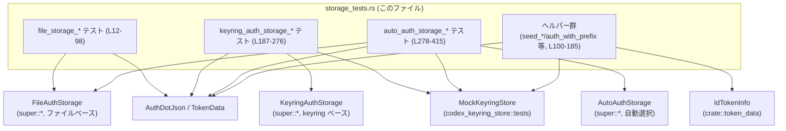
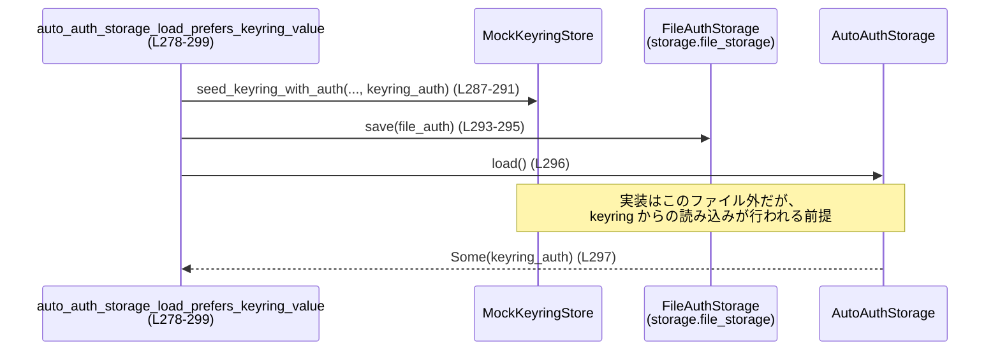

# login/src/auth/storage_tests.rs コード解説

---

## 0. ざっくり一言

このファイルは、認証情報ストレージの 3 種類の実装（ファイル・キーチェーン・自動選択）について、保存・読み込み・削除とフォールバック挙動を検証するテスト群を定義しています（`login/src/auth/storage_tests.rs` 全体）。

---

## 1. このモジュールの役割

### 1.1 概要

- このモジュールは、`FileAuthStorage`・`KeyringAuthStorage`・`AutoAuthStorage` と、それらが扱う `AuthDotJson`/`TokenData` の **入出力の契約をテストで固定する** 役割を持ちます。
- 具体的には、以下の動作を検証します。
  - ファイルベースストレージの保存・読込・削除と、実ファイル (`auth.json`) への反映（`file_storage_*` テスト群、L12-98）。
  - キーリング（OS キーチェーン）ストレージの保存・読込・削除、及び **fallback ファイル** の扱い（`keyring_auth_storage_*` テスト群、L187-276）。
  - 自動ストレージ (`AutoAuthStorage`) が keyring とファイルをどう優先・フォールバックするか（`auto_auth_storage_*` テスト群、L278-415）。

### 1.2 アーキテクチャ内での位置づけ

このファイルは「テスト層」にあり、親モジュール（`super::*`）で定義されているストレージ実装にのみ依存します。外部サービスとは直接やり取りせず、`MockKeyringStore` や一時ディレクトリ (`tempdir`) を使って **副作用をテスト用に閉じ込め** ています。



※ `FStore` / `KStore` / `AStore` の実体はこのファイルには現れず、`use super::*;`（L1）のみから分かります。

### 1.3 設計上のポイント

コードから読み取れる特徴を整理します。

- **責務の分割**
  - 各ストレージ実装ごとに「load/save/delete」のテストがあり、さらに **優先順位やフォールバック** を `AutoAuthStorage` テストでまとめて検証しています（L278-415）。
  - キーリング操作関連の共通処理は
    - `seed_keyring_and_fallback_auth_file_for_delete`（L100-113）
    - `seed_keyring_with_auth`（L115-127）
    - `assert_keyring_saved_auth_and_removed_fallback`（L129-145）
    にヘルパーとしてまとめられています。

- **状態管理**
  - ストレージ実装自体は外部モジュールですが、テストは
    - `tempdir()` で毎回新しいディレクトリを作成（例: L14, L34, L57）
    - `MockKeyringStore::default()` で毎回新しいモックを生成（例: L190, L225, L254）
    することで、テストケース間の状態が干渉しないようにしています。

- **エラーハンドリング方針**
  - 各テストは `anyhow::Result<()>` を返し、`?` で I/O エラーなどを伝播しています（例: 関数シグネチャ L12-13, L55-56 など）。
  - 重要な部分では `anyhow::Context` でエラーにメッセージを付与しています（例: L23-27, L48-50）。
  - キーリング操作のエラーは `MockKeyringStore::set_error` で明示的に注入し、そのときのフォールバック動作を検証しています（L323-325, L368-368）。

- **並行性**
  - 2 つのテストが `#[tokio::test]` で async として定義されています（L12, L32）。
    - 非同期ストレージ API に対するテストであることが推測されますが、内部で並列実行やスレッド共有はこのファイルには現れません。
  - 他のテストは同期テストで、主にファイル I/O とモックへのアクセスのみです。

---

## 2. 主要な機能一覧

このファイルが提供する「機能」（= テスト観点）を整理します。

- ファイルストレージ:
  - `file_storage_load_returns_auth_dot_json`: 保存した `AuthDotJson` を `load` で取得できることの検証（L12-30）。
  - `file_storage_save_persists_auth_dot_json`: `save` 後のファイル内容が期待どおりであることの検証（L32-53）。
  - `file_storage_delete_removes_auth_file`: `delete` が `auth.json` を削除し、成功を `bool` で返すことの検証（L55-72）。
- エフェメラルストレージ:
  - `ephemeral_storage_save_load_delete_is_in_memory_only`: `Ephemeral` モードがメモリのみで完結し、ディスクに `auth.json` を残さないことの検証（L74-98）。
- キーリングストレージ:
  - `keyring_auth_storage_load_returns_deserialized_auth`: keyring から JSON を読み込み `AuthDotJson` にデシリアライズできること（L187-210）。
  - `keyring_auth_storage_compute_store_key_for_home_directory`: `compute_store_key` が特定のホームディレクトリ表現に対して安定なキーを生成すること（L212-220）。
  - `keyring_auth_storage_save_persists_and_removes_fallback_file`: save によって keyring に保存され、fallback ファイルが削除されること（L222-249）。
  - `keyring_auth_storage_delete_removes_keyring_and_file`: delete によって keyring エントリと fallback ファイルが削除されること（L251-276）。
- 自動ストレージ (`AutoAuthStorage`):
  - `auto_auth_storage_load_prefers_keyring_value`: keyring とファイルの両方に値があるとき keyring を優先して返すこと（L278-299）。
  - `auto_auth_storage_load_uses_file_when_keyring_empty`: keyring が空のときファイルを利用すること（L301-313）。
  - `auto_auth_storage_load_falls_back_when_keyring_errors`: keyring 読み込みエラー時にファイルへフォールバックすること（L315-332）。
  - `auto_auth_storage_save_prefers_keyring`: save 時に keyring 保存が成功すると、keyring を正とし fallback ファイルを削除すること（L335-358）。
  - `auto_auth_storage_save_falls_back_when_keyring_errors`: save 時に keyring 保存が失敗した場合、fallback ファイルに保存すること（L360-389）。
  - `auto_auth_storage_delete_removes_keyring_and_file`: delete が keyring とファイルの両方から削除すること（L391-415）。
- テスト用ヘルパー:
  - `seed_keyring_and_fallback_auth_file_for_delete`: keyring と fallback ファイルを同時に作るセットアップ（L100-113）。
  - `seed_keyring_with_auth`: `AuthDotJson` を keyring に保存するセットアップ（L115-127）。
  - `assert_keyring_saved_auth_and_removed_fallback`: keyring への保存と fallback 削除をまとめて検証（L129-145）。
  - `id_token_with_prefix`: 任意プレフィックス付きメール/アカウントを含む `IdTokenInfo` を生成（L147-171）。
  - `auth_with_prefix`: 上記トークンを使った `AuthDotJson` を生成（L173-185）。

---

## 3. 公開 API と詳細解説

このファイル自体には `pub` な関数はありませんが、テストを通して **外部 API (`FileAuthStorage` / `KeyringAuthStorage` / `AutoAuthStorage`) の契約** が分かるため、それを中心に整理します。

### 3.1 型一覧（構造体・列挙体など）

※ ここでは「このファイルで利用されている主要な型」を列挙します（定義は親モジュールや他クレートにあります）。

| 名前 | 種別 | 役割 / 用途 | 根拠 |
|------|------|-------------|------|
| `AuthDotJson` | 構造体 | 認証情報を JSON 形式で表したデータ。`auth_mode` / `openai_api_key` / `tokens` / `last_refresh` フィールドが使われています（例: L16-21, L36-41）。 | `storage_tests.rs:L16-21, L36-41` |
| `AuthMode` | 列挙体 | 認証モード。`ApiKey` や `Chatgpt` といったバリアントが利用されています（L17, L37, L59, L81, L195, L233）。 | `storage_tests.rs:L17, L37, L59, L81, L195, L233` |
| `TokenData` | 構造体 | `id_token` / `access_token` / `refresh_token` / `account_id` をまとめた認証トークン情報（L177-182, L235-240）。 | `storage_tests.rs:L177-182, L235-240` |
| `FileAuthStorage` | 構造体 | ファイル (`auth.json`) を使った認証情報ストレージ。`new` / `save` / `load` / `delete` / `try_read_auth_json` をテストから利用（例: L15, L23-27, L43-50, L67-68）。 | `storage_tests.rs:L15, L23-27, L43-50, L67-68` |
| `KeyringAuthStorage` | 構造体 | OS キーリングをバックエンドにしたストレージ。`new` / `save` / `load` / `delete` をテストから利用（例: L191-194, L207-208, L226-229, L244, L255-258, L264）。 | `storage_tests.rs:L191-194, L207-208, L226-229, L244, L255-258, L264` |
| `AutoAuthStorage` | 構造体 | keyring とファイルの自動選択ストレージ。`new` / `save` / `load` / `delete` と内部の `file_storage` フィールドをテストから利用（例: L282-285, L293-295, L296-297, L305, L308-309, L319-322, L329-330, L338-341, L347-348, L363-366, L371-372, L379-381, L395-397, L403-404）。 | `storage_tests.rs:L282-285, L293-297, L305, L308-309, L319-322, L329-330, L338-341, L347-348, L363-366, L371-372, L379-381, L395-397, L403-404` |
| `AuthCredentialsStoreMode` | 列挙体 | ストレージモード。`File` と `Ephemeral` がテストで使われています（L64, L79）。 | `storage_tests.rs:L64, L79` |
| `MockKeyringStore` | 構造体 | keyring 動作を模倣するテスト用モック。`save` / `saved_value` / `contains` / `set_error` などを使用（例: L108-110, L135-137, L190-190, L201-205, L225, L254-255, L260-262, L287-291, L281-282, L305, L323-325, L337-338, L342-343, L368-368, L384-385, L393-394, L399-401, L407-408）。 | `storage_tests.rs:L108-110, L135-137, L190-190, L201-205, L225, L254-255, L260-262, L281-282, L287-291, L305, L323-325, L337-338, L342-343, L368, L384-385, L393-394, L399-401, L407-408` |
| `IdTokenInfo` | 構造体 | ChatGPT JWT のクレームからパースされた ID トークン情報（L147-171）。`parse_chatgpt_jwt_claims` の戻り値として利用。 | `storage_tests.rs:L147-171` |

### 3.2 重要な関数の詳細

ここでは、テストによって **ストレージ API の契約がよく表れている** 関数を 7 個選び、詳しく説明します。

---

#### `file_storage_load_returns_auth_dot_json() -> anyhow::Result<()>` （L12-30）

**概要**

- `FileAuthStorage` の `save` / `load` が、同じ `AuthDotJson` をやり取りできることを検証する async テストです（L12-30）。
- これにより「ファイルストレージは JSON を損なわずにラウンドトリップできる」という契約が固定されています。

**引数**

- なし（テスト関数です）。

**戻り値**

- `anyhow::Result<()>`  
  - 途中の `tempdir` やファイル I/O、`save` / `load` がエラーを返した場合、`Err` として返却されテスト失敗になります（L14-15, L23-27）。

**内部処理の流れ**

1. 一時ディレクトリを作成（`tempdir()?`、L14）。
2. そのパスを渡して `FileAuthStorage::new` を生成（L15）。
3. `AuthDotJson` を組み立て（L16-21）。
4. `storage.save(&auth_dot_json)` を呼び出し、`context("failed to save auth file")` でエラーをラップ（L23-25）。
5. `storage.load()` を呼び出し、`context("failed to load auth file")` でエラーをラップ（L27）。
6. 読み込んだ値が `Some(auth_dot_json)` と等しいことを `assert_eq!` で検証（L28）。

**Examples（使用例）**

テスト自体が典型的な使い方を示しています。

```rust
let codex_home = tempdir()?;                                      // テスト用の一時ディレクトリを作成
let storage = FileAuthStorage::new(codex_home.path().to_path_buf()); // ディレクトリを指定してストレージを初期化

let auth = AuthDotJson { /* フィールドを設定 */ };               // 保存したい認証情報

storage.save(&auth)?;                                             // 認証情報を保存
let loaded = storage.load()?;                                     // 認証情報を読み込み

assert_eq!(Some(auth), loaded);                                   // 保存したものと同じか検証
```

**Errors / Panics**

- `tempdir()?` が失敗すると `Err` を返しテスト失敗（L14）。
- `FileAuthStorage::save` / `load` がエラーを返した場合、`context` に設定したメッセージ付きで `Err` を返します（L23-27）。
- パニックを起こすコードはこのテスト関数内にはありません。

**Edge cases（エッジケース）**

- 認証情報の `tokens` が `None` のケース（L19）について、正しく保存・復元できることを確認しています。
- 空の `openai_api_key` などのケースはこのテストでは扱っていません（コード上にも現れません）。

**使用上の注意点**

- `FileAuthStorage` を利用するコードは、このテストから「`load` はファイルが存在するとき `Some(AuthDotJson)` を返す」という前提で設計できます。
- ファイルが存在しない場合の挙動（`None` を返すかエラーか）は、このテストからは直接分かりません。

---

#### `ephemeral_storage_save_load_delete_is_in_memory_only() -> anyhow::Result<()>` （L74-98）

**概要**

- `AuthCredentialsStoreMode::Ephemeral` を使ったストレージが **完全にメモリ上だけで動作し、ディスクにファイルを残さない** ことを検証するテストです（L74-98）。

**引数**

- なし。

**戻り値**

- `anyhow::Result<()>`（I/O エラー等を伝播します）。

**内部処理の流れ**

1. 一時ディレクトリを作成（L76）。
2. `create_auth_storage(..., AuthCredentialsStoreMode::Ephemeral)` でエフェメラルなストレージを生成（L77-80）。
3. `AuthDotJson` を作成（L81-86）。
4. `save` → `load` で `Some(auth_dot_json)` が返ることを検証（L88-90）。
5. `delete` を呼んで `true` が返ることを検証（L92-93）。
6. 再度 `load` すると `None` が返ることを確認（L94-95）。
7. `get_auth_file(dir.path()).exists()` が `false` であることを確認し、ディスクにファイルがないことを担保（L96）。

**Errors / Panics**

- `create_auth_storage` 内部のエラーやファイル操作があれば `?` によってテスト失敗となります。
- パニックは使用していません。

**Edge cases**

- `delete` した後の `load` が `None` であることを明示的に検証しており、「削除済み状態の扱い」が契約として固定されています（L94-95）。
- 「保存前の `load` の挙動」は、このテストでは確認していません。

**使用上の注意点**

- `Ephemeral` モードでは、テストが示すようにディスク上に `auth.json` が生成されないことが期待されます（L96）。
- セキュリティの観点では、機密情報をディスクに残したくない場合に利用できるモードであると読み取れます（ただし実装の詳細はこのファイル外です）。

---

#### `keyring_auth_storage_load_returns_deserialized_auth() -> anyhow::Result<()>` （L187-210）

**概要**

- keyring に保存された JSON 文字列が、`KeyringAuthStorage::load` を通して `AuthDotJson` に正しくデシリアライズされることを検証するテストです（L187-210）。

**引数**

- なし。

**戻り値**

- `anyhow::Result<()>`。

**内部処理の流れ**

1. 一時ディレクトリを作成（L189）。
2. `MockKeyringStore::default()` でモック keyring を生成（L190）。
3. `KeyringAuthStorage::new` でストレージを初期化（L191-194）。
4. `expected` な `AuthDotJson` を用意（L195-200）。
5. `seed_keyring_with_auth` で `expected` を keyring に保存（L201-205, L115-127）。
6. `storage.load()?` で認証情報を読み出し（L207）。
7. `Some(expected)` と等しいことを `assert_eq!` で検証（L208）。

**Errors / Panics**

- keyring への保存や読み込み失敗は全て `?` でテスト失敗になります（L201-205, L207）。
- モック側からはパニックを起こしていません（`expect` は使用していない）。

**Edge cases**

- `tokens: None` の `AuthDotJson` を扱っている点（L198-199）から、「トークンなしの状態でも load/save できる」ことが前提であると分かります。
- keyring が空の場合の `load` の挙動は、このテスト単体からは分かりませんが、後述の `AutoAuthStorage` テストと組み合わせると「None 相当またはエラー」とみなしていることが推測できます（ただし実装は不明）。

**使用上の注意点**

- `KeyringAuthStorage` の `load` は、少なくとも「keyring にシリアライズ済み JSON が存在する場合には `Some(AuthDotJson)` を返す」契約になっています。

---

#### `keyring_auth_storage_save_persists_and_removes_fallback_file() -> anyhow::Result<()>` （L222-249）

**概要**

- `KeyringAuthStorage::save` が
  1. keyring に `AuthDotJson` をシリアライズして保存し（L244-244）、  
  2. 既存の fallback ファイル (`auth.json`) を削除する  
  という副作用を持つことを検証するテストです（L222-249）。

**引数**

- なし。

**戻り値**

- `anyhow::Result<()>`。

**内部処理の流れ**

1. 一時ディレクトリとモック keyring を用意（L224-225）。
2. `KeyringAuthStorage::new` でストレージを初期化（L226-229）。
3. `get_auth_file` を使って fallback ファイルパスを取得（L230）。
4. `std::fs::write(&auth_file, "stale")?;` で古い fallback ファイルを作成（L231）。
5. `auth` な `AuthDotJson` を構築（L232-242）。
6. `storage.save(&auth)?;` を呼び出し（L244）。
7. `compute_store_key` で保存に使われたキーを計算（L246）。
8. `assert_keyring_saved_auth_and_removed_fallback` で、keyring にシリアライズ済み JSON が存在し、かつ fallback ファイルが削除されていることを検証（L247-247, L129-145）。

**Errors / Panics**

- I/O エラーや save の失敗は `?` でテスト失敗。
- `assert_keyring_saved_auth_and_removed_fallback` 内部で `saved_value(key).expect("keyring entry should exist");` を呼んでいるため、keyring にエントリが存在しない場合はテストがパニックします（L135-137）。

**Edge cases**

- fallback ファイルに何が書かれていたか（ここでは `"stale"`）は save 時には考慮されず、存在していれば削除されるだけである、という前提が表現されています（L231-232, L140-144）。
- keyring 保存に失敗した場合の挙動は、このテスト自体では確認していません（後述の `AutoAuthStorage` 側で keyring エラー時のフォールバックがテストされています）。

**使用上の注意点**

- `KeyringAuthStorage` を利用するコードでは、「save が成功したならば fallback ファイルを前提にしない」ことが前提となります（fallback は削除されるため）。

---

#### `auto_auth_storage_load_prefers_keyring_value() -> anyhow::Result<()>` （L278-299）

**概要**

- `AutoAuthStorage::load` が、**keyring とファイルの両方に値がある場合には keyring の値を優先して返す** ことを検証するテストです（L278-299）。

**引数**

- なし。

**戻り値**

- `anyhow::Result<()>`。

**内部処理の流れ**

1. 一時ディレクトリとモック keyring（L280-281）。
2. `AutoAuthStorage::new` でストレージを初期化（L282-285）。
3. `auth_with_prefix("keyring")` で keyring 用 `AuthDotJson` を生成（L286, L173-185）。
4. `seed_keyring_with_auth` で keyring に保存（L287-291, L115-127）。
5. `auth_with_prefix("file")` でファイル用 `AuthDotJson` を生成（L293, L173-185）。
6. `storage.file_storage.save(&file_auth)?;` でファイルにも保存（L293-295）。
7. `let loaded = storage.load()?;` を実行（L296）。
8. `assert_eq!(loaded, Some(keyring_auth));` により、keyring の値が返っていることを確認（L297）。

**Errors / Panics**

- I/O や keyring 操作が失敗すれば `?` でテスト失敗。
- パニックは使用していません。

**Edge cases**

- keyring とファイルで **異なる** 内容を保存している点（`keyring` / `file` プレフィックス、L286-293）から、
  - `load` は「両方ある場合に内容をマージする」のではなく、「keyring の値だけを採用する」という契約になっていることが分かります（L296-297）。
- keyring が空のケースは別テストで扱われています（`auto_auth_storage_load_uses_file_when_keyring_empty`, L301-313）。

**使用上の注意点**

- `AutoAuthStorage` を使う側は、「keyring に値があればファイルに何が書かれていようと keyring が優先される」ことを前提とする必要があります。

---

#### `auto_auth_storage_save_falls_back_when_keyring_errors() -> anyhow::Result<()>` （L360-389）

**概要**

- `AutoAuthStorage::save` 実行時に keyring がエラーを返すように設定した場合、
  - keyring には値が保存されず（L384-385）、
  - fallback ファイル (`auth.json`) に保存される（L373-381）
  という **フォールバック挙動** を検証するテストです。

**引数**

- なし。

**戻り値**

- `anyhow::Result<()>`。

**内部処理の流れ**

1. 一時ディレクトリ・モック keyring・`AutoAuthStorage` を用意（L361-366）。
2. `compute_store_key` で keyring に使うキーを算出（L367）。
3. `mock_keyring.set_error(&key, KeyringError::Invalid("error".into(), "save".into()));` により、このキーに対する操作がエラーになるよう設定（L368）。
4. `auth_with_prefix("fallback")` で保存する認証情報を生成（L370, L173-185）。
5. `storage.save(&auth)?;` を実行（L371-372）。
6. `get_auth_file(codex_home.path())` でファイルパスを取得し、`exists()` が `true` であることを確認（L373-377）。
7. `storage.file_storage.load()?` で fallback ファイルから読み込み、`auth` と等しいことを検証（L378-382）。
8. `mock_keyring.saved_value(&key).is_none()` で keyring に値が保存されていないことを確認（L383-385）。

**Errors / Panics**

- `save` 自身は keyring 側のエラーにもかかわらず `?` で成功 (`Ok`) を返していると読み取れます（L371-372 の後に `?` による早期 `Err` が発生していないため）。
- keyring のエラーは `MockKeyringStore` 内部でハンドリングされ、`AutoAuthStorage` がフォールバック処理を行う設計であることがテストから分かります。

**Edge cases**

- keyring 側で明示的にエラーが設定された場合（Invalid エラー、L368）でも、呼び出し側は `save` の `Result` としてはエラーを受け取らず、fallback ファイルへの保存という形で吸収されます。
- セキュリティ的には「keyring に保存できない場合は平文ファイルに保存する」動作となるため、この挙動を許容するかどうかは利用者側のポリシーに依存します（テストはその挙動を期待しています）。

**使用上の注意点**

- `AutoAuthStorage::save` の呼び出し側は、`Result` が `Ok` だからといって「必ず keyring に保存された」とはみなせません。このテストにより、「keyring 保存失敗時にはファイルへのフォールバックが行われる」という契約になっています（L373-385）。

---

#### `auto_auth_storage_delete_removes_keyring_and_file() -> anyhow::Result<()>` （L391-415）

**概要**

- `AutoAuthStorage::delete` が、keyring と fallback ファイルの両方から認証情報を削除し、その結果を `bool` で返すことを検証するテストです（L391-415）。

**引数**

- なし。

**戻り値**

- `anyhow::Result<()>`（内部での I/O / keyring エラーを伝播）。

**内部処理の流れ**

1. 一時ディレクトリ・モック keyring・`AutoAuthStorage` を用意（L392-397）。
2. `seed_keyring_and_fallback_auth_file_for_delete` により、keyring と fallback ファイルの両方を事前に作成（L398-401, L100-113）。
3. `let removed = storage.delete()?;` を呼び出し（L403）。
4. `assert!(removed, "delete should report removal");` で true が返ったことを確認（L405）。
5. `!mock_keyring.contains(&key)` を確認して、keyring エントリが削除されていることを検証（L406-409）。
6. `!auth_file.exists()` を確認して、fallback ファイルも削除されていることを検証（L410-413）。

**Errors / Panics**

- delete がエラーを返せば `?` によってテスト失敗になります（L403）。
- `seed_keyring_and_fallback_auth_file_for_delete` 内部でのエラー（keyring 保存やファイル書き込み）も `?` で伝播します（L108-112）。

**Edge cases**

- keyring と fallback ファイルが両方存在するケースで delete が両方に作用することを確認していますが、「片方だけ存在する場合」の挙動はこのテストでは直接確認していません。

**使用上の注意点**

- delete の戻り値 `bool` は「何らかの削除が行われたかどうか」を示すものと読み取れます（`file_storage_delete_removes_auth_file` など他のテストとの一貫性から、L68-71, L92-93, L264-267, L404-405）。
- 呼び出し側は、`false` の場合に「そもそも保存されていなかった」といった扱いをする設計が自然ですが、詳細な意味は実装側を確認する必要があります。

---

### 3.3 その他の関数一覧

残りのテスト・ヘルパーを簡潔にまとめます。

| 関数名 | 役割（1 行） | 行範囲 |
|--------|--------------|--------|
| `file_storage_save_persists_auth_dot_json` | `save` 後に `try_read_auth_json` で読み直し、ファイル内容が期待どおりか確認（L32-53）。 | `storage_tests.rs:L32-53` |
| `file_storage_delete_removes_auth_file` | `AuthCredentialsStoreMode::File` モードで `delete` がファイルを削除することを確認（L55-72）。 | `storage_tests.rs:L55-72` |
| `seed_keyring_and_fallback_auth_file_for_delete` | keyring と stale な `auth.json` ファイルの双方を生成するヘルパー（L100-113）。 | `storage_tests.rs:L100-113` |
| `seed_keyring_with_auth` | `AuthDotJson` を JSON にシリアライズして keyring に保存するヘルパー（L115-127）。 | `storage_tests.rs:L115-127` |
| `assert_keyring_saved_auth_and_removed_fallback` | keyring に期待どおり保存され、fallback ファイルが削除されているかをまとめて assert するヘルパー（L129-145）。 | `storage_tests.rs:L129-145` |
| `id_token_with_prefix` | 指定プレフィックスに基づくフェイク JWT を生成し、`IdTokenInfo` にパースするヘルパー（L147-171）。 | `storage_tests.rs:L147-171` |
| `auth_with_prefix` | `id_token_with_prefix` を使って、ユニークな内容の `AuthDotJson` を生成するヘルパー（L173-185）。 | `storage_tests.rs:L173-185` |
| `keyring_auth_storage_compute_store_key_for_home_directory` | 特定パス `~/.codex` に対する `compute_store_key` の結果がリテラル `"cli|940db7b1d0e4eb40"` であることをテスト（L212-220）。 | `storage_tests.rs:L212-220` |
| `keyring_auth_storage_delete_removes_keyring_and_file` | `KeyringAuthStorage::delete` が keyring と fallback ファイルを削除することを検証（L251-276）。 | `storage_tests.rs:L251-276` |
| `auto_auth_storage_load_uses_file_when_keyring_empty` | keyring が空のとき `AutoAuthStorage::load` がファイルから読み込むことを検証（L301-313）。 | `storage_tests.rs:L301-313` |
| `auto_auth_storage_load_falls_back_when_keyring_errors` | keyring 読み込みエラー時にファイルへフォールバックする `load` の挙動を検証（L315-332）。 | `storage_tests.rs:L315-332` |
| `auto_auth_storage_save_prefers_keyring` | save 成功時には keyring を正として保存し fallback ファイルを削除する挙動を検証（L335-358）。 | `storage_tests.rs:L335-358` |

---

## 4. データフロー

### 4.1 代表的シナリオ：AutoAuthStorage.load の優先順位

テスト `auto_auth_storage_load_prefers_keyring_value`（L278-299）は、keyring とファイルの両方に異なる値が存在する場合の `AutoAuthStorage::load` の挙動を検証します。

1. テストコードが `auth_with_prefix("keyring")` で keyring 用の `AuthDotJson` を生成し、`seed_keyring_with_auth` で keyring に保存します（L286-291）。
2. 別の `AuthDotJson` (`"file"` プレフィックス) をファイルストレージに保存します（L293-295）。
3. `AutoAuthStorage::load` を呼び出すと、戻り値は `Some(keyring_auth)` となり、ファイルの内容ではなく keyring の内容が採用されます（L296-297）。

これをシーケンス図で表すと以下のようになります。



※ AA → MK, AA → FS の具体的な呼び出し順や条件分岐はこのファイルには現れないため、図中では「前提」としてのみ記述しています。

**要点**

- `AutoAuthStorage::load` は、「keyring に値があるならファイルを無視して keyring を返す」という外部から見た契約になっています（L296-297）。
- これにより、利用者側は「より安全な keyring の値が優先される」と期待できます。

---

## 5. 使い方（How to Use）

ここでは「このテストモジュールをどう読む・どう拡張するか」という観点で整理します。

### 5.1 基本的な使用方法（テストの読み方）

テストは、おおむね次のパターンで書かれています。

```rust
// 1. 一時リソース（ディレクトリ・モック）を用意
let codex_home = tempdir()?;                                         // storage_tests.rs:L14, L34 など
let mock_keyring = MockKeyringStore::default();                      // storage_tests.rs:L190, L225 など

// 2. ストレージ実装を初期化
let storage = AutoAuthStorage::new(
    codex_home.path().to_path_buf(),
    Arc::new(mock_keyring.clone()),
);                                                                    // storage_tests.rs:L282-285

// 3. テスト用の AuthDotJson を組み立て
let auth = auth_with_prefix("test");                                  // storage_tests.rs:L173-185

// 4. 保存・読み込み・削除などの操作を行い
storage.save(&auth)?;                                                 // 例: storage_tests.rs:L347-348

// 5. ファイルや keyring モックの状態を assert で検証
let loaded = storage.load()?;                                         // 例: storage_tests.rs:L296
assert_eq!(Some(auth), loaded);                                       // 例: storage_tests.rs:L297
```

### 5.2 よくある使用パターン

- **ファイルストレージのテスト**
  - `FileAuthStorage::new(tempdir().path().to_path_buf())` で isolated な記憶領域を確保（L15, L35）。
  - `get_auth_file` を用いて、期待される `auth.json` のパスを取得し、ファイルの存在や内容を直接検証（L43-50, L96）。

- **keyring ストレージのテスト**
  - `MockKeyringStore` を使い、`save` / `saved_value` / `contains` で状態を観察（L108-110, L135-137, L260-262, L268-269）。
  - `set_error` を用いてエラーシナリオを明示的に作る（L323-325, L368-368）。

- **自動ストレージのテスト**
  - `storage.file_storage` フィールドに直接アクセスして「ファイル側だけ」の状態も検証（L293-295, L308-309, L378-382）。
  - keyring とファイルの両方に異なる値を保存し、`load` の優先順位を確認する（L286-297）。

### 5.3 よくある間違い（テスト追加時の注意）

このファイルから推測できる、起こりやすそうな誤用例を挙げます。

```rust
// 誤り例: AutoAuthStorage の挙動を検証するのに直接 FileAuthStorage を new してしまう
// （AutoAuthStorage 内部の file_storage と一致しないインスタンスになる）
let file_storage = FileAuthStorage::new(codex_home.path().to_path_buf());
file_storage.save(&auth)?;
// AutoAuthStorage::load の結果と期待がずれてしまう可能性がある

// 正しい例: AutoAuthStorage が内部に保持する file_storage を使う
let storage = AutoAuthStorage::new(codex_home.path().to_path_buf(), Arc::new(mock_keyring.clone()));
storage.file_storage.save(&auth)?;                // storage_tests.rs:L293-295 など
let loaded = storage.load()?;                     // AutoAuthStorage の挙動を直接検証
```

### 5.4 使用上の注意点（まとめ・Bugs/Security 含む）

- **契約の読み取り**
  - `load` の戻り値が `Option<AuthDotJson>` であること、および「存在しない／削除済みの場合には `None`」になることが、複数のテストで前提になっています（例: L90-95, L207-208, L296-297, L310-311, L329-330）。
  - `delete` の戻り値 `bool` は「何か削除したかどうか」を示すフラグと解釈されます（L68-71, L92-93, L264-267, L404-405）。

- **セキュリティ面の性質**
  - `AutoAuthStorage::save` は keyring 保存に失敗した場合でもエラーを返さず、fallback ファイルに保存する挙動を持つことがテストで確認されています（L371-385）。  
    その結果、「keyring が使えない環境では認証情報がディスク上のファイルに平文で残る」可能性があります。
  - 一方、`AuthCredentialsStoreMode::Ephemeral` を使う場合は `auth.json` が生成されないことが保証されており（L74-98）、ディスクに残したくないシナリオ向きであると読み取れます。

- **並行性について**
  - テスト自体はシングルスレッド的に書かれており、共有可変状態を並列に操作するようなパターンはありません。
  - 非同期 I/O の正確なスケジューリングやレースコンディションなどは、このファイルからは分かりません。

---

## 6. 変更の仕方（How to Modify）

### 6.1 新しい機能を追加する場合（テスト観点）

たとえば、ストレージに新たなフィールド（例: `expires_at`）が `AuthDotJson` に追加された場合を考えます。

1. **データ生成ヘルパーの更新**
   - `auth_with_prefix`（L173-185）に新フィールドの設定を追加すると、多くのテストで自動的に新フィールドもカバーされます。

2. **keyring / ファイルの両方をカバー**
   - `seed_keyring_with_auth`（L115-127）を通じて keyring 側のシリアライズ/デシリアライズが新フィールドにも対応しているかを検証できます。
   - `file_storage_*` テストに新フィールドのアサーションを追加すると、ファイル保存側もカバーできます。

3. **フォールバックや優先順位のテスト追加**
   - 新しいストレージモードや優先順位ルールを追加する場合、`auto_auth_storage_*` 一連のテスト（L278-415）を参考に、  
     - 「両方存在する場合」
     - 「どちらか一方が空のとき」
     - 「エラー発生時のフォールバック」  
     の 3 パターンを押さえると挙動が分かりやすくなります。

### 6.2 既存の機能を変更する場合

- **影響範囲の確認**
  - 例えば `AutoAuthStorage::load` の優先順位を変更すると、多数のテスト（L278-299, L301-313, L315-332）が影響を受けます。
  - keyring 保存／削除の契約を変更する場合は、`keyring_auth_storage_*` と `auto_auth_storage_*` の両方のテストを確認する必要があります。

- **契約の維持**
  - 「delete 後は `load` が `None` を返す」（L90-95）、
  - 「keyring 保存に成功したとき fallback ファイルは削除される」（L140-144, L247-247, L350-355）  
    などの契約を変える場合は、利用コード側がこれらの前提に依存していないか確認する必要があります。

- **エッジケースの追加テスト**
  - 新たなエラーケース（例: 破損した JSON, 異常な path）を扱うように実装を変更した場合は、
    - `MockKeyringStore::set_error` を参考にエラーを注入するテストを追加する
    - `auth.json` に異常な内容を書き込んでから `load` するテストを追加する  
    などで契約を明示するのが有用です。

---

## 7. 関連ファイル

このモジュールと密接に関係するファイル・コンポーネントを整理します。

| パス / モジュール | 役割 / 関係 |
|------------------|------------|
| `super::*`（親モジュール。ファイル名からは `storage.rs` 相当が想定されるが、このチャンクには明示されない） | `FileAuthStorage` / `KeyringAuthStorage` / `AutoAuthStorage` / `AuthDotJson` / `TokenData` / `compute_store_key` / `get_auth_file` / `create_auth_storage` / `KEYRING_SERVICE` など、テスト対象の本体を提供します（L1, L15, L64-65, L191-192, L226-227, L282-283, L305, L338-339, L363-364 など）。 |
| `crate::token_data` | `IdTokenInfo` 型および `parse_chatgpt_jwt_claims` 関数を提供し、テスト用 JWT のパースに利用されています（L2, L147-171）。 |
| `codex_keyring_store::tests::MockKeyringStore` | keyring のモック実装。keyring 関連ストレージのテストで一貫して利用されています（L9, L100-110, L115-117, L129-137, L187-190, L222-225, L251-255, L278-282, L301-305, L315-319, L335-339, L360-364, L391-395）。 |
| `keyring::Error` | 実 keyring ライブラリのエラー型。モックにエラーを注入する時に利用されています（L10, L323-325, L368-368）。 |
| `tempfile::tempdir` | テスト用の一時ディレクトリを作成し、ファイルストレージをテスト環境に閉じ込めるために使用されています（L7, L14, L34, L57, L76, L189, L224, L253, L280, L303, L317, L336, L361, L392）。 |

※ 実装ファイル（例: `login/src/auth/storage.rs`）の正確なパスは、このチャンクには現れませんが、`use super::*;`（L1）とファイル名 `storage_tests.rs` から、そのような構成が想定されます。ただしあくまで推測であり、正確なパスはリポジトリ全体を確認する必要があります。
