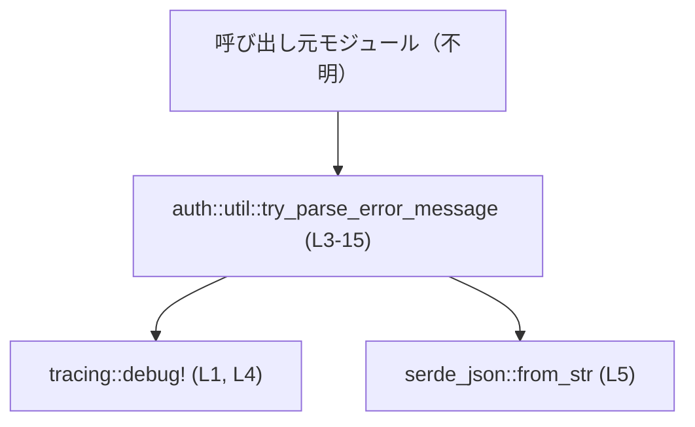
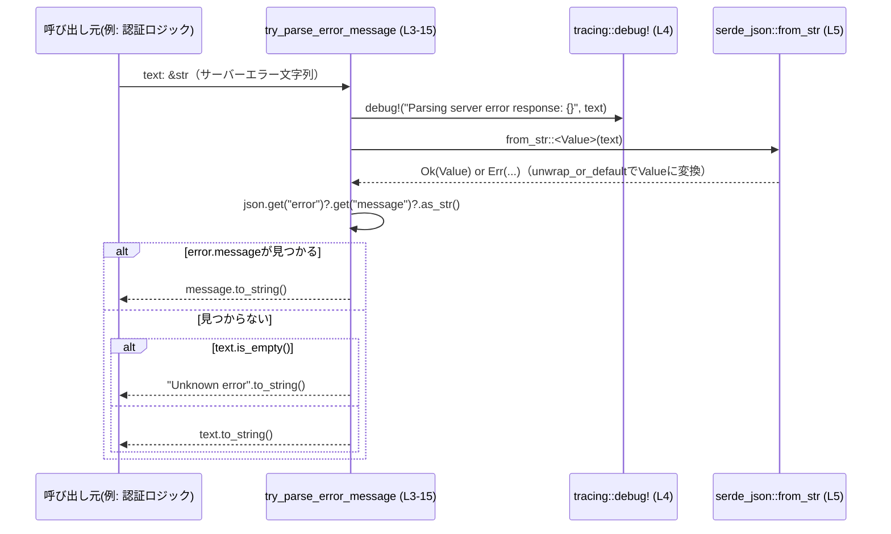

# login/src/auth/util.rs コード解説

## 0. ざっくり一言

サーバーから返ってきたエラーレスポンス文字列から、JSON の `error.message` を優先的に抜き出し、見つからない場合は生の文字列や汎用メッセージを返すユーティリティ関数を提供するモジュールです (login/src/auth/util.rs:L3-15)。

---

## 1. このモジュールの役割

### 1.1 概要

- サーバーエラー応答を表す文字列から、人間が読みやすいエラーメッセージを取り出すために存在するモジュールです (L3-15)。
- OpenAI API のような JSON 形式のエラー (`{"error": {"message": "..."} }`) を想定し、`error.message` があればそれを返します (L6-10)。
- JSON から適切なメッセージを取得できない場合は、元の文字列、あるいは `"Unknown error"` にフォールバックします (L12-15)。

### 1.2 アーキテクチャ内での位置づけ

このファイルは「auth」配下にあり、認証まわりで発生したサーバーエラーを整形する補助ユーティリティとして使われる構造が想定されますが、呼び出し元の具体的なモジュールはこのチャンクには現れません。

依存関係を簡略化すると次のようになります。



### 1.3 設計上のポイント

- **シンプルな純粋関数的設計**  
  - グローバル状態を変更せず、入力 `&str` に対して `String` を返すだけの関数です (L3-15)。
- **ログを伴うエラーパース**  
  - 受け取った文字列をそのまま `debug!` ログに出力してからパースを行います (L4)。
- **例外を発生させない JSON パース**  
  - `serde_json::from_str(..).unwrap_or_default()` を使うことで、パース失敗時もパニックせずデフォルト値にフォールバックします (L5)。
- **段階的なフォールバック戦略**  
  - 1. `error.message` があればそれを返す (L6-10)  
  - 1. 入力が空文字なら `"Unknown error"` を返す (L12-13)  
  - 1. それ以外は元の文字列をそのまま返す (L15)

---

## 2. 主要な機能一覧（コンポーネント一覧）

### 機能の一覧

- エラーレスポンス文字列からのエラーメッセージ抽出
- JSON パース失敗時や非 JSON 入力時のフォールバック処理
- ログ出力によるデバッグ支援

### コンポーネント一覧

| 名前 | 種別 | 可視性 | 役割 / 用途 | 根拠 |
|------|------|--------|-------------|------|
| `try_parse_error_message` | 関数 | `pub(crate)` | サーバーからのエラーレスポンス文字列から、可能なら `error.message` を抽出し、そうでなければ入力文字列や `"Unknown error"` を返す | (L3-15) |
| `tests` | モジュール | `#[cfg(test)]` | `try_parse_error_message` の振る舞いをテストする内部テストモジュール | (L18-45) |
| `try_parse_error_message_extracts_openai_error_message` | テスト関数 | private | OpenAI 形式の JSON エラーから `error.message` が抽出されることを検証 | (L22-37) |
| `try_parse_error_message_falls_back_to_raw_text` | テスト関数 | private | `error.message` がない場合に入力文字列をそのまま返すことを検証 | (L39-44) |

---

## 3. 公開 API と詳細解説

### 3.1 型一覧（構造体・列挙体など）

このファイル内で新たに定義されている構造体・列挙体などの型はありません (L1-45)。  
（`serde_json::Value` は外部クレートの型であり、このファイル内では再定義されていません (L5)。）

---

### 3.2 関数詳細

#### `try_parse_error_message(text: &str) -> String`

**概要**

- サーバーエラーを表す文字列 `text` を JSON として解釈し、`{"error": {"message": "..."} }` 形式で埋め込まれたメッセージを抽出する関数です (L3-10)。
- 期待するフィールドが見つからない場合や JSON でない場合も、パニックせずに `"Unknown error"` または元の文字列にフォールバックします (L12-15)。

**引数**

| 引数名 | 型 | 説明 | 根拠 |
|--------|----|------|------|
| `text` | `&str` | サーバーから返ってきたエラーレスポンス全体の文字列 | (L3) |

**戻り値**

- 型: `String` (L3)  
- 意味:
  - 最優先: `text` が JSON かつ `error.message` フィールドが存在し文字列であれば、その内容を返します (L6-10)。
  - 次点: 上記条件を満たさず、かつ `text` が空文字列の場合は `"Unknown error"` を返します (L12-13)。
  - それ以外: `text` の内容をそのまま返します (L15)。

**内部処理の流れ（アルゴリズム）**

1. 受け取った `text` を `debug!` ログとして出力します (L4)。  
2. `serde_json::from_str::<serde_json::Value>(text)` で `text` を JSON としてパースし、失敗した場合は `Default` 実装に基づく値に置き換えます (`unwrap_or_default`) (L5)。  
   - `from_str` がどのような型を返すかはコード上には明記されていませんが、`unwrap_or_default` が呼ばれているため、`Default` を実装した何らかの型 (`serde_json::Value` と推測されます) を得ています (L5)。  
3. パース結果 `json` に対して、`json.get("error")` で `"error"` プロパティを取り出します (L6)。  
4. 上記が存在する場合にのみ、さらに `error.get("message")` で `"message"` プロパティを取り出します (L7)。  
5. さらにそれが文字列 (`as_str()`) である場合にのみ、その値を `String` に変換し、その場で返します (L8-10)。  
6. この連鎖がどこかで途切れた場合 (`error` が無い、`message` が無い、文字列でない、JSON パース失敗などすべて含む)、次に `text.is_empty()` を確認します (L12)。  
7. 空文字列であれば `"Unknown error"` を返します (L12-13)。  
8. 空文字列でなければ `text` を `String` にコピーして返します (L15)。

この `if let` による連鎖は、すべて成功した場合のみ `return` で早期終了する「ハッピーパス」を実現しています (L6-10)。

**Examples（使用例）**

1. **典型的な JSON エラーからの抽出**

```rust
// サーバーから返ってきた OpenAI 形式のエラーレスポンスを仮定する
let text = r#"{
  "error": {
    "message": "Your refresh token has already been used to generate a new access token. Please try signing in again.",
    "type": "invalid_request_error",
    "param": null,
    "code": "refresh_token_reused"
  }
}"#;

let message = try_parse_error_message(text); // (login/src/auth/util.rs:L3)

// error.message の内容だけが取り出される
assert_eq!(
    message,
    "Your refresh token has already been used to generate a new access token. Please try signing in again."
);
```

この挙動はテスト `try_parse_error_message_extracts_openai_error_message` で検証されています (L22-37)。

1. **JSON だが `error.message` がない場合**

```rust
// error.message という構造にはなっていない JSON
let text = r#"{"message": "test"}"#;

let message = try_parse_error_message(text);

// error.message を見つけられないため、入力文字列そのものが返る
assert_eq!(message, r#"{"message": "test"}"#);
```

この挙動はテスト `try_parse_error_message_falls_back_to_raw_text` で検証されています (L39-44)。

1. **非 JSON / 空文字の場合（推論される挙動）**

```rust
// 非 JSON な文字列
let not_json = "Internal Server Error";
assert_eq!(try_parse_error_message(not_json), "Internal Server Error");

// 空文字列
let empty = "";
assert_eq!(try_parse_error_message(empty), "Unknown error");
```

- 非 JSON 文字列については、`from_str` が失敗してデフォルト値にフォールバックし、`error.message` が見つからず、`text.is_empty()` も偽であるため、入力文字列がそのまま返ると解釈できます (L5-6, L12, L15)。
- 空文字列については、`text.is_empty()` が真となり `"Unknown error"` が返ると解釈できます (L12-13)。  
これらのケースはテストコードには現れていませんが (L22-44)、コードロジックから自然に導かれる挙動です。

**Errors / Panics**

- **パニックに関して**
  - `serde_json::from_str(..)` の結果に対して `unwrap_or_default()` を使用しているため、JSON パース失敗時に `panic!` する経路はありません (L5)。
  - それ以外に `unwrap` 系メソッドや `panic!` 呼び出しは存在しません (L1-15)。  
  → この関数単体ではパニックを起こさない設計になっていると解釈できます。

- **`Result` / `Option` の返却**
  - 戻り値は `String` であり、`Result` や `Option` は使っていません (L3)。  
  - エラー情報は「フォールバックした文字列」の形でのみ表現され、型システム上はエラー状態を区別しません。

**Edge cases（エッジケース）**

- **空文字列 `""` が渡された場合**  
  - `text.is_empty()` が真となり、固定文字列 `"Unknown error"` が返されます (L12-13)。
- **JSON でない文字列**  
  - パースは失敗し、デフォルト値にフォールバックした上で `error.message` 探索に失敗します (L5-8)。  
  - 入力が空でなければ、元の文字列がそのまま返ります (L12, L15)。
- **JSON だが `error` フィールドが存在しない場合**  
  - `json.get("error")` が `None` となり、`if let` ブロックをスキップします (L6-8)。  
  - その後の処理は上記「非 JSON」と同様です。
- **`error` はあるが `message` がない、または文字列でない場合**  
  - `error.get("message")` あるいは `message.as_str()` が失敗し、`if let` ブロックを抜けます (L7-8)。  
  - 結果としてフォールバック処理に進みます (L12-15)。
- **非常に長いエラーメッセージ**  
  - 特別な制限や切り詰め処理はなく、そのまま `String` 化されて返されます (L10, L15)。  
  - メモリ消費は文字列長に比例します。

**使用上の注意点**

- **前提条件**
  - 入力 `text` が JSON である必要はありませんが、`{"error": {"message": "..."}}` 形式である場合に最も意味のある結果が得られます (L6-10)。
- **情報喪失の可能性**
  - JSON パースの成否や、`error.message` が存在しなかったことは呼び出し側には分かりません。結果の `String` からは「どのフォールバック経路を通ったか」が区別できません (L3-15)。
- **ロギングに関する注意**
  - 入力 `text` 全体が `debug!` ログに出力されます (L4)。  
    - ここにアクセストークンや個人情報が含まれる場合、ログにも同じ情報が残る可能性があります。  
    - 実際に問題になるかどうかは、サーバーのエラーメッセージ内容とログ出力設定に依存し、このチャンクだけからは判断できません。
- **並行性（スレッドセーフ性）**
  - 関数内部では引数 `text` から `String` を生成するのみで、共有可変状態を操作していません (L3-15)。  
    → この関数自体はどのスレッドから呼び出しても同じ振る舞いをすると考えられます。
  - ログ出力の実装詳細は `tracing` クレート側に依存し、このファイルからは断定できません (L1, L4)。

---

### 3.3 その他の関数

このファイルには、本番コードとして呼び出される関数は `try_parse_error_message` のみです (L3-15)。  
`#[cfg(test)]` 内のテスト関数は以下のとおりです (L18-45)。

| 関数名 | 役割（1 行） | 根拠 |
|--------|--------------|------|
| `try_parse_error_message_extracts_openai_error_message` | OpenAI 形式の JSON エラーレスポンスから `error.message` を正しく抽出できることを検証するテスト | (L22-37) |
| `try_parse_error_message_falls_back_to_raw_text` | `error.message` 構造でない JSON の場合に入力文字列がそのまま返ることを検証するテスト | (L39-44) |

---

## 4. データフロー

ここでは、典型的な呼び出しシナリオにおけるデータの流れを示します。  
HTTP クライアントなどがサーバーから受け取ったエラー文字列を `try_parse_error_message` に渡し、人間向けメッセージとして利用するケースを想定します。



- この図は、`try_parse_error_message` 内部の主要な呼び出し関係と条件分岐を表しています (L3-15)。
- JSON パース失敗や `error.message` 欠如は、すべて「`error.message` が見つからない」パスに集約されているため、エラーの詳細原因は呼び出し側には露出しません (L5-8, L12-15)。

---

## 5. 使い方（How to Use）

### 5.1 基本的な使用方法

HTTP クライアントで認証 API を呼び出し、エラーレスポンスボディを `String` で受け取ったときに利用する例です。

```rust
use crate::auth::util::try_parse_error_message; // 実際のパスはプロジェクト構成に依存（このチャンクからは不明）

fn handle_auth_error(response_body: String) {
    // サーバーから返ってきたエラー文字列を解析して、ユーザー向けメッセージを取得する
    let message = try_parse_error_message(&response_body); // (login/src/auth/util.rs:L3)

    // 取得したメッセージをログ、UI、エラー型などに反映させる
    eprintln!("Login failed: {}", message);
}
```

- `String` から `&str` への変換は `&response_body` で行います。所有権は `response_body` に残るため、必要に応じて後続処理で再利用できます（Rust の借用の基本動作）。
- `try_parse_error_message` の戻り値は新しい `String` なので、そのまま保持・表示・ラップして利用できます (L3)。

### 5.2 よくある使用パターン

1. **エラー型へのラップ**

```rust
struct AuthError {
    message: String,
}

impl AuthError {
    fn from_server_response(body: &str) -> Self {
        Self {
            message: try_parse_error_message(body), // (L3-15)
        }
    }
}
```

- ライブラリやサービス層のエラー型に、人間向けのメッセージを格納する用途が考えられます。

1. **ログレベルの統一**

```rust
fn log_and_return_error(body: &str) {
    // 内部で debug! ログは出ますが (L4)、ここでさらに info レベルで要約を出す例
    let msg = try_parse_error_message(body);
    tracing::info!("Authentication error: {}", msg);
}
```

- 外部ログには `msg` のみを出力し、内部 debug ログには生のレスポンスを残す、といった使い分けも可能です。

### 5.3 よくある間違い

```rust
// 間違い例: 既に整形されたメッセージに対して再度パースを試みる
let user_friendly = "Unknown error"; // すでに人間向けに整形済みのメッセージ
let parsed = try_parse_error_message(user_friendly);
// ここでは JSON パースが失敗し、結局 "Unknown error" が返るだけで意味がない

// 正しい例: 必ず「サーバーから受け取った raw な文字列」を渡す
let raw_body = r#"{"error":{"message":"Invalid credentials"}}"#;
let parsed = try_parse_error_message(raw_body); // "Invalid credentials" が得られる
```

- 意味的には「raw レスポンス」を入力として期待しているため、すでに整形された文字列に対して使ってもあまり価値がありません (L3-10)。

### 5.4 使用上の注意点（まとめ）

- 入力には**サーバーからの生のエラーレスポンス**を渡すことが前提と解釈できます (L3-4)。
- `error.message` が見つからない場合にどのような文字列が返るか（`"Unknown error"` / 生のテキスト）は、呼び出し側の UX 設計に影響します (L12-15)。
- ログには生のレスポンスが出力されるため、ログポリシーに応じて `debug` ログの有効化やフィルタリングを検討する必要があります (L4)。
- スレッド安全性や非同期実行に関する特別な注意点はコードからは読み取れず、この関数は純粋な同期関数として扱えます (L3-15)。

---

## 6. 変更の仕方（How to Modify）

### 6.1 新しい機能を追加する場合

例: `{"error": "simple message"}` のような別形式もサポートしたい場合。

1. **パースロジックの拡張**
   - `if let Some(error) = json.get("error")` ブロック内に、`error` が文字列であるパターンを追加するのが自然です (L6-10)。
   - 例えば `error.as_str()` を試す分岐を増やすなど。
2. **フォールバック戦略の調整**
   - `"Unknown error"` や「入力そのまま」といったフォールバック方針に変更が必要なら、`text.is_empty()` 判定とその後の `text.to_string()` を修正します (L12-15)。
3. **テストの追加**
   - 対応したい新しい JSON 形式に対して、`#[test]` 関数を `tests` モジュールに追加すると、既存スタイルと揃えやすいです (L18-44)。

### 6.2 既存の機能を変更する場合

- **影響範囲の確認**
  - この関数は `pub(crate)` なので、同一クレート内の複数モジュールから呼ばれている可能性があります (L3)。  
  - 実際の呼び出し元を IDE の参照検索などで確認する必要があります（このチャンクには呼び出し元情報がありません）。
- **契約（前提条件・返り値の意味）**
  - 現状、「`error.message` があればそれを返し、そうでなければ `"Unknown error"` または元の文字列」が契約になっています (L6-15)。  
  - この契約を変える（例: 常に JSON 形式に正規化する）場合、呼び出し側での期待値確認が必要です。
- **テストの更新**
  - 既存テスト 2 件は現在の挙動を前提にしているため (L22-44)、契約変更時はそれに応じて期待値を更新するか、新しい関数名に切り出すなどの対応が必要です。

---

## 7. 関連ファイル

このチャンクには他ファイルに関する情報は現れていませんが、論理的に関連しそうなファイルを種類別に整理すると次のように分類できます。

| パス | 役割 / 関係 |
|------|------------|
| `login/src/auth/util.rs` | 本ファイル。認証関連のエラーメッセージ抽出ユーティリティを提供する (L3-15)。 |
| `login/src/auth/*` | 認証処理（ログインやトークン更新など）を担う他モジュールが存在する可能性がありますが、このチャンクには現れません。 |
| HTTP クライアント実装ファイル | サーバーからのレスポンスボディを受け取り、この関数を呼び出す側として存在するはずですが、パスや名前は不明です。 |

具体的なファイル名・モジュール名は、このチャンクの範囲外のため「不明」となります。
