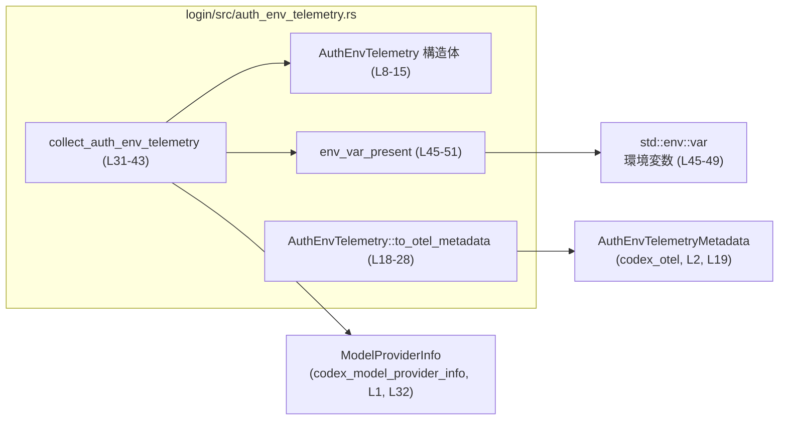
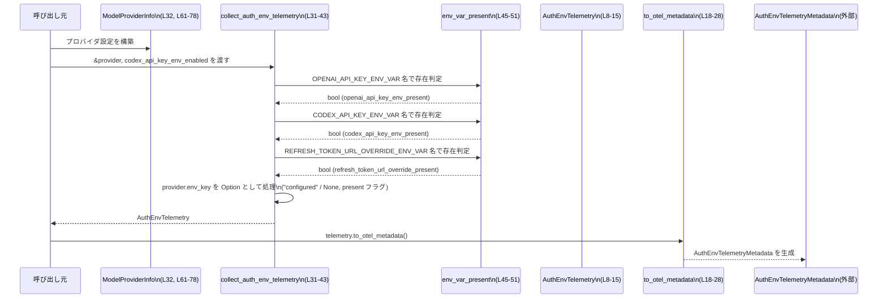

# login/src/auth_env_telemetry.rs コード解説

## 0. ざっくり一言

認証関連の環境変数（OpenAI / Codex の API キーやリフレッシュトークン URL 上書き）について、「設定されているかどうか」だけを集計し、OpenTelemetry 用メタデータに変換するためのテレメトリ補助モジュールです（`AuthEnvTelemetry`, `collect_auth_env_telemetry`, `to_otel_metadata` 定義より判断, `auth_env_telemetry.rs:L8-28, L31-43`）。

---

## 1. このモジュールの役割

### 1.1 概要

- このモジュールは **認証用環境変数の状態を観測可能にする** ために存在し、以下を行います。
  - OpenAI/Codex 用 API キーの環境変数が「存在するか」をブール値で記録する（`auth_env_telemetry.rs:L10-12, L36-38`）。
  - モデルプロバイダ固有の環境変数（`ModelProviderInfo.env_key`）が設定されているかを、名前そのものを送信せずに記録する（`auth_env_telemetry.rs:L13-14, L39-40`）。
  - リフレッシュトークン URL の上書き用環境変数の有無を記録する（`auth_env_telemetry.rs:L15, L41`）。
  - これらを OpenTelemetry 用の `AuthEnvTelemetryMetadata` 型へ変換する（`auth_env_telemetry.rs:L18-28`）。

### 1.2 アーキテクチャ内での位置づけ

このモジュールは、モデルプロバイダ情報とプロセス環境変数からテレメトリ構造体を組み立て、それを別 crate の OpenTelemetry メタデータ型に変換する中間層として配置されています。



- `ModelProviderInfo` は外部 crate `codex_model_provider_info` から提供され、プロバイダ固有の `env_key` 等を保持します（`auth_env_telemetry.rs:L1, L32`）。定義内容の詳細はこのチャンクには現れません。
- `AuthEnvTelemetry` はテレメトリ専用の内部表現です（`auth_env_telemetry.rs:L8-15`）。
- `collect_auth_env_telemetry` が `ModelProviderInfo` と環境変数から `AuthEnvTelemetry` を構築します（`auth_env_telemetry.rs:L31-43`）。
- `env_var_present` が環境変数の有無を判定する共通ロジックをカプセル化しています（`auth_env_telemetry.rs:L45-51`）。
- `AuthEnvTelemetry::to_otel_metadata` が `AuthEnvTelemetryMetadata` に変換します（`auth_env_telemetry.rs:L18-28`）。

このファイル内には、生成された `AuthEnvTelemetryMetadata` を実際に OpenTelemetry で送信する処理は含まれていません（このチャンクには現れません）。

### 1.3 設計上のポイント

- **テレメトリ用の専用構造体**  
  `AuthEnvTelemetry` は認証情報そのものではなく、「環境変数が存在するかどうか」のメタ情報だけを保持する構造体です（`auth_env_telemetry.rs:L8-15`）。
- **秘密情報をテレメトリに載せない設計**  
  - `env_var_present` は値を読み取りますが、返り値は `bool` だけであり、値そのものは `AuthEnvTelemetry` に保存されません（`auth_env_telemetry.rs:L36-41, L45-49`）。
  - `provider_env_key_name` には実際の `env_key` 文字列ではなく、`env_key` が `Some` のとき常に `"configured"` という定数文字列が入ります（`auth_env_telemetry.rs:L13, L39`）。これにより、プロバイダ固有の環境変数名自体もテレメトリには現れません。
- **環境変数存在判定の一元化**  
  `env_var_present` 関数により、  
  - 空文字列や空白のみの値は「存在しない」と扱う（`!value.trim().is_empty()`, `auth_env_telemetry.rs:L47`）。  
  - 非 Unicode な値は「存在する」と扱う（`Err(VarError::NotUnicode(_)) => true`, `auth_env_telemetry.rs:L48`）。  
  といったポリシーが一箇所に集約されています。
- **状態を持たない純粋な処理**  
  このモジュールはグローバルな可変状態を持たず、`std::env::var` を通した環境変数読み取り以外に副作用はありません（`auth_env_telemetry.rs:L45-49`）。Rust の所有権・借用ルールの範囲で、すべて安全な同期関数として実装されています。

---

## 2. 主要な機能一覧（コンポーネントインベントリー）

### 2.1 コンポーネント一覧表

| 名前 | 種別 | 公開 | 役割 / 用途 | 定義位置 |
|------|------|------|-------------|----------|
| `AuthEnvTelemetry` | 構造体 | `pub` | 認証関連の環境変数の存在状況を保持するテレメトリ用コンテナ | `auth_env_telemetry.rs:L8-15` |
| `AuthEnvTelemetry::to_otel_metadata` | メソッド | `pub` | `AuthEnvTelemetry` を `codex_otel::AuthEnvTelemetryMetadata` へ変換する | `auth_env_telemetry.rs:L18-28` |
| `collect_auth_env_telemetry` | 関数 | `pub` | 環境変数および `ModelProviderInfo` から `AuthEnvTelemetry` を構築するメイン API | `auth_env_telemetry.rs:L31-43` |
| `env_var_present` | 関数 | 非公開 (`fn`) | 指定された環境変数名について「有効な値があるか」を判定するユーティリティ | `auth_env_telemetry.rs:L45-51` |
| `tests::collect_auth_env_telemetry_buckets_provider_env_key_name` | テスト関数 | `#[test]` | `env_key` が `Some` のとき `provider_env_key_name` が `"configured"` になることを検証する | `auth_env_telemetry.rs:L59-87` |

### 2.2 機能の箇条書き

- 認証用環境変数の存在判定と集計（OpenAI/Codex API キー、プロバイダ固有キー、リフレッシュトークン URL 上書き）（`auth_env_telemetry.rs:L10-15, L36-41`）。
- 環境変数の有無のみを記録し、値や名前を直接テレメトリに載せない整理（`auth_env_telemetry.rs:L13-14, L39-40, L45-49`）。
- 集計結果を `AuthEnvTelemetryMetadata` に変換し、OpenTelemetry ベースの観測基盤に渡すための前処理（`auth_env_telemetry.rs:L18-28`）。

---

## 3. 公開 API と詳細解説

### 3.1 型一覧（構造体）

#### `AuthEnvTelemetry` 構造体

| フィールド名 | 型 | 説明 | 定義位置 |
|-------------|----|------|----------|
| `openai_api_key_env_present` | `bool` | OpenAI API キー用環境変数が「有効な値」を持つかどうか | `auth_env_telemetry.rs:L10` |
| `codex_api_key_env_present` | `bool` | Codex API キー用環境変数が「有効な値」を持つかどうか | `auth_env_telemetry.rs:L11` |
| `codex_api_key_env_enabled` | `bool` | Codex API キー環境変数機能が有効化されているかどうか（外部から渡されるフラグ） | `auth_env_telemetry.rs:L12` |
| `provider_env_key_name` | `Option<String>` | プロバイダ固有の環境変数が設定されている場合 `"configured"`、それ以外は `None` | `auth_env_telemetry.rs:L13` |
| `provider_env_key_present` | `Option<bool>` | `ModelProviderInfo.env_key` が `Some(name)` のとき、その環境変数 `name` に有効な値があるかどうか (`Some(true/false)`)、`env_key` が `None` のとき `None` | `auth_env_telemetry.rs:L14, L40` |
| `refresh_token_url_override_present` | `bool` | リフレッシュトークン URL 上書き用環境変数が有効な値を持つかどうか | `auth_env_telemetry.rs:L15, L41` |

`AuthEnvTelemetry` 自体には `Debug`, `Clone`, `Default`, `PartialEq`, `Eq` が derive されており、デバッグ表示・複製・比較などが容易です（`auth_env_telemetry.rs:L8`）。

---

### 3.2 関数詳細

#### `collect_auth_env_telemetry(provider: &ModelProviderInfo, codex_api_key_env_enabled: bool) -> AuthEnvTelemetry` （L31-43）

**概要**

- モデルプロバイダ情報とプロセス環境変数の状態から、`AuthEnvTelemetry` 構造体を組み立てるメインの公開関数です（`auth_env_telemetry.rs:L31-42`）。

**引数**

| 引数名 | 型 | 説明 | 根拠 |
|--------|----|------|------|
| `provider` | `&ModelProviderInfo` | 環境変数名などを含むモデルプロバイダ設定。`env_key` フィールドにプロバイダ固有の環境変数名が入る | `auth_env_telemetry.rs:L31-32, L61-78`（テストでの struct 初期化より） |
| `codex_api_key_env_enabled` | `bool` | Codex API キーの環境変数利用が有効かどうか。値はそのまま `AuthEnvTelemetry.codex_api_key_env_enabled` に保存されます | `auth_env_telemetry.rs:L31-34, L38` |

**戻り値**

- `AuthEnvTelemetry`  
  認証関連環境変数の存在情報をまとめた構造体です（`auth_env_telemetry.rs:L35-42`）。

**内部処理の流れ（アルゴリズム）**

1. `OPENAI_API_KEY_ENV_VAR` という定数名で環境変数を調べ、`env_var_present` による判定結果を `openai_api_key_env_present` に格納する（`auth_env_telemetry.rs:L36`）。
2. 同様に `CODEX_API_KEY_ENV_VAR` について判定し、`codex_api_key_env_present` に格納する（`auth_env_telemetry.rs:L37`）。
3. 引数 `codex_api_key_env_enabled` を、そのまま `codex_api_key_env_enabled` フィールドにコピーする（`auth_env_telemetry.rs:L38`）。
4. `provider.env_key` が `Some(_)` の場合、環境変数名の実際の文字列にはアクセスせず、`provider_env_key_name` に `"configured".to_string()` を設定する（`auth_env_telemetry.rs:L39`）。`None` の場合は `provider_env_key_name` も `None` になる。
5. `provider.env_key` を `as_deref()` で `Option<&str>` に変換し、`Some(name)` の場合に `env_var_present(name)` を呼び、その結果 `true/false` を `Some` に包んで `provider_env_key_present` に格納する。`env_key` が `None` の場合は `provider_env_key_present` も `None` になる（`auth_env_telemetry.rs:L40`）。
6. `REFRESH_TOKEN_URL_OVERRIDE_ENV_VAR` という定数名で環境変数を調べ、`env_var_present` の結果を `refresh_token_url_override_present` に格納する（`auth_env_telemetry.rs:L41`）。

**Examples（使用例）**

以下は、この関数を用いて認証テレメトリを収集する簡単な例です。  
`ModelProviderInfo` の具体的な構築方法はこのチャンクには現れないため、ここでは外部から渡される前提で記述しています。

```rust
use codex_model_provider_info::ModelProviderInfo;     // モデルプロバイダ情報（auth_env_telemetry.rs:L1）
use crate::auth_env_telemetry::collect_auth_env_telemetry; // 実際のモジュールパスはこのチャンクからは不明

fn example_collect(provider: ModelProviderInfo) {
    // 環境変数を例として設定する（本番では通常、外部で設定済み）
    std::env::set_var(crate::OPENAI_API_KEY_ENV_VAR, "sk-openai-example"); // L4 に対応
    std::env::set_var(crate::CODEX_API_KEY_ENV_VAR, "sk-codex-example");   // L4 に対応

    // Codex API キー環境変数の機能が有効であるとする
    let codex_api_key_env_enabled = true;

    // テレメトリ情報を収集する
    let telemetry = collect_auth_env_telemetry(&provider, codex_api_key_env_enabled);

    // 結果を利用する（例: ログ出力など）
    println!("OpenAI env present: {}", telemetry.openai_api_key_env_present);
    println!("Codex env present: {}", telemetry.codex_api_key_env_present);
}
```

> 注: `crate::auth_env_telemetry` というモジュールパスや `crate::OPENAI_API_KEY_ENV_VAR` などの定数の定義位置は、このチャンクには現れません。モジュール公開の実際のパスはプロジェクト全体の `lib.rs` / `main.rs` の定義に依存します。

**Errors / Panics**

- `collect_auth_env_telemetry` 自体は `Result` を返さず、**エラーや panic を発生させません**。
  - 内部で呼び出している `env_var_present` は `std::env::var` の `Err` をすべて `bool` にマッピングしており、`unwrap` や `expect` などは使用していません（`auth_env_telemetry.rs:L45-50`）。
- 環境変数アクセスに起因する OS レベルの異常は `VarError` として表現され、その場で `true/false` に変換されます（`auth_env_telemetry.rs:L47-50`）。

**Edge cases（エッジケース）**

- `provider.env_key` が `None` の場合  
  - `provider_env_key_name` は `None`（`map` が呼ばれないため, `auth_env_telemetry.rs:L39`）。
  - `provider_env_key_present` も `None`（`map` が呼ばれないため, `auth_env_telemetry.rs:L40`）。
- `provider.env_key` が `Some("ANY")` だが、該当する環境変数が未設定の場合  
  - `provider_env_key_name` は `Some("configured".to_string())`（`auth_env_telemetry.rs:L39`）。
  - `provider_env_key_present` は `Some(false)`（`env_var_present` が `VarError::NotPresent` を `false` にマップ, `auth_env_telemetry.rs:L40, L49`）。
- OpenAI/Codex/リフレッシュトークンの環境変数が空文字列または空白のみの場合  
  - それぞれの `*_present` フィールドは `false` になります（`!value.trim().is_empty()` による, `auth_env_telemetry.rs:L47`）。
- 環境変数が非 Unicode のデータを含む場合  
  - `env_var_present` が `true` を返すため、`*_present` フィールドは `true` になります（`VarError::NotUnicode(_) => true`, `auth_env_telemetry.rs:L48`）。

**使用上の注意点**

- この関数は **環境変数の「存在判定」専用** であり、値の内容や妥当性（例えば API キー形式の検証）は行いません（コード上で値を保持していないことから, `auth_env_telemetry.rs:L36-41, L45-49`）。
- `provider_env_key_name` は実際の環境変数名ではなく、`"configured"` の固定文字列しか含みません。環境変数名を知る用途には使えません（`auth_env_telemetry.rs:L39`）。
- 環境変数はプロセス全体で共有されるため、テストやマルチスレッド環境でこの関数を多用する場合、`std::env::set_var`/`remove_var` との競合に注意が必要です。ただし Rust の型システム上のデータ競合は発生しません（`auth_env_telemetry.rs:L45-49`）。
- 非 Unicode の値を「存在する」とカウントする挙動（`auth_env_telemetry.rs:L48`）のため、「present == String として利用可能」という意味にはなりません。

---

#### `fn env_var_present(name: &str) -> bool` （L45-51）

**概要**

- 指定された環境変数名について、**「有効な値を持っているかどうか」** を `bool` で返す内部ユーティリティ関数です（`auth_env_telemetry.rs:L45-50`）。

**引数**

| 引数名 | 型 | 説明 | 根拠 |
|--------|----|------|------|
| `name` | `&str` | 調査対象の環境変数名 | `auth_env_telemetry.rs:L45` |

**戻り値**

- `bool`  
  - `true`: 環境変数が設定されており、値が `""` ではなく、空白のみでもない（`trim().is_empty() == false`）、もしくは非 Unicode の値が設定されている場合（`auth_env_telemetry.rs:L47-48`）。
  - `false`: 環境変数が存在しない、または空文字列/空白のみが設定されている場合（`auth_env_telemetry.rs:L47, L49`）。

**内部処理の流れ**

1. `std::env::var(name)` を呼び、環境変数を `Result<String, VarError>` として取得する（`auth_env_telemetry.rs:L46`）。
2. `Ok(value)` の場合、`!value.trim().is_empty()` を評価し、空白以外の文字が含まれていれば `true` を返す（`auth_env_telemetry.rs:L47`）。
3. `Err(VarError::NotUnicode(_))` の場合、環境変数は存在するが `String` として扱えない値を持っているため、`true` を返す（`auth_env_telemetry.rs:L48`）。
4. `Err(VarError::NotPresent)` の場合、環境変数が存在しないため、`false` を返す（`auth_env_telemetry.rs:L49`）。

**Examples（使用例）**

```rust
fn example_env_var_present() {
    // 1. 有効な値を設定
    std::env::set_var("EXAMPLE_KEY", "value");
    assert!(env_var_present("EXAMPLE_KEY")); // "value" は空白でないので true（L47）

    // 2. 空文字列を設定
    std::env::set_var("EXAMPLE_KEY_EMPTY", "");
    assert!(!env_var_present("EXAMPLE_KEY_EMPTY")); // trim() 後も空なので false（L47）

    // 3. 未設定
    std::env::remove_var("EXAMPLE_KEY_MISSING");
    assert!(!env_var_present("EXAMPLE_KEY_MISSING")); // NotPresent => false（L49）
}
```

> 非 Unicode の値を設定する具体例は標準 API だけでは書きにくいため、ここでは概念的な説明にとどめます。`VarError::NotUnicode` の扱いはコードから `true` と読み取れます（`auth_env_telemetry.rs:L48`）。

**Errors / Panics**

- `std::env::var` の戻り値を `match` で網羅しているため、この関数内で panic が発生する可能性はコード上ありません（`auth_env_telemetry.rs:L46-50`）。
- エラー (`VarError`) はすべて `bool` に変換され、呼び出し元には `Result` としては伝播しません。

**Edge cases**

- 値が `"  \n\t"` のような空白だけの場合: `trim()` によって空文字とみなされるため `false`（`auth_env_telemetry.rs:L47`）。
- 値に NULL バイトなど非 Unicode データが含まれている場合: `VarError::NotUnicode` として `true` を返す（`auth_env_telemetry.rs:L48`）。
- 変数が存在しない場合: `false`（`auth_env_telemetry.rs:L49`）。

**使用上の注意点**

- `true` は「環境変数が存在し、かつ空白のみでない文字列、または非 Unicode の値が入っている」ことを意味します。必ずしも「アプリケーションでその値を `String` として利用できる」ことを意味しません（`auth_env_telemetry.rs:L47-48`）。
- 非 Unicode の値を `true` として扱うかどうかは設計ポリシーに依存するため、この挙動を変える場合は呼び出し元全体の期待値を確認する必要があります。このチャンク内の呼び出し元は `collect_auth_env_telemetry` だけです（`auth_env_telemetry.rs:L36-41`）。

---

#### `AuthEnvTelemetry::to_otel_metadata(&self) -> AuthEnvTelemetryMetadata` （L18-28）

**概要**

- `AuthEnvTelemetry` の内容を、外部 crate `codex_otel` が定義する `AuthEnvTelemetryMetadata` 型にコピーする変換メソッドです（`auth_env_telemetry.rs:L18-27`）。

**引数**

| 引数名 | 型 | 説明 | 根拠 |
|--------|----|------|------|
| `&self` | `&AuthEnvTelemetry` | 変換元となるテレメトリ構造体への参照 | `auth_env_telemetry.rs:L18` |

**戻り値**

- `AuthEnvTelemetryMetadata`  
  `openai_api_key_env_present` など、`AuthEnvTelemetry` と同名のフィールドを持つ外部メタデータ型です（`auth_env_telemetry.rs:L19-27`）。`AuthEnvTelemetryMetadata` の定義内容はこのチャンクには現れませんが、フィールド名から同様の役割であると解釈できます。

**内部処理の流れ**

1. 新しい `AuthEnvTelemetryMetadata` インスタンスを構築する（`auth_env_telemetry.rs:L20`）。
2. 各フィールドに `self` の対応する値を代入する（`auth_env_telemetry.rs:L21-27`）。
   - `provider_env_key_name` は `clone()` されるため、`AuthEnvTelemetry` と `AuthEnvTelemetryMetadata` はそれぞれ独立した `String` を持ちます（`auth_env_telemetry.rs:L24`）。

**Examples（使用例）**

```rust
use codex_model_provider_info::ModelProviderInfo;
use crate::auth_env_telemetry::collect_auth_env_telemetry;

fn example_to_otel_metadata(provider: ModelProviderInfo) {
    let telemetry = collect_auth_env_telemetry(&provider, true); // L31-43 の呼び出し

    // OpenTelemetry メタデータへ変換
    let otel_metadata = telemetry.to_otel_metadata();            // L18-28

    // ここで otel_metadata を OTel エクスポータなどに渡す想定
    // 実際の送信処理はこのチャンクには現れません。
}
```

**Errors / Panics**

- ただのフィールドコピー（および `Option<String>` の `clone`）のみであり、panic を引き起こすコードは含まれていません（`auth_env_telemetry.rs:L20-27`）。

**Edge cases**

- `provider_env_key_name` / `provider_env_key_present` が `None` の場合も、そのまま `None` としてコピーされます（`auth_env_telemetry.rs:L24-25`）。
- `Default` 実装で生成した `AuthEnvTelemetry`（すべての bool が `false`, `Option` が `None`）に対して呼び出した場合も、同じ内容の `AuthEnvTelemetryMetadata` が返されます（`AuthEnvTelemetry` の derive より, `auth_env_telemetry.rs:L8`）。

**使用上の注意点**

- このメソッドは純粋な変換であり、副作用はありません。収集タイミングや送信タイミングの制御は呼び出し側で行う必要があります。
- `AuthEnvTelemetryMetadata` のフィールド追加・削除が行われた場合、ここも更新が必要になります（`auth_env_telemetry.rs:L20-27`）。

---

### 3.3 その他の関数・テスト

| 関数名 | 役割（1 行） | 定義位置 |
|--------|--------------|----------|
| `tests::collect_auth_env_telemetry_buckets_provider_env_key_name` | `ModelProviderInfo.env_key` が `Some` のとき、`provider_env_key_name` が `"configured"` に正規化されることを検証するテスト | `auth_env_telemetry.rs:L59-87` |

- このテストでは、`env_key` に `"sk-should-not-leak"` を設定しつつ、テレメトリには `"configured"` だけが出力されることを確認しています（`auth_env_telemetry.rs:L64, L80-86`）。これにより、秘密情報や実際のキー名がテレメトリに漏洩しないことが保証されます。

---

## 4. データフロー

このモジュールを用いた典型的な処理フローは以下の通りです。

1. アプリケーションが `ModelProviderInfo` を構築する（例: 設定ファイルから読み込み）（`auth_env_telemetry.rs:L61-78` のテストを参照）。
2. `collect_auth_env_telemetry` が呼び出され、各種環境変数の有無を `env_var_present` で判定しながら `AuthEnvTelemetry` を構築する（`auth_env_telemetry.rs:L31-43, L45-51`）。
3. 必要に応じて、`AuthEnvTelemetry::to_otel_metadata` を呼び出し、`AuthEnvTelemetryMetadata` に変換する（`auth_env_telemetry.rs:L18-28`）。
4. 変換されたメタデータは、別のコンポーネントから OpenTelemetry エクスポータ等に渡される想定です（このチャンクには現れません）。



---

## 5. 使い方（How to Use）

### 5.1 基本的な使用方法

アプリケーション起動時に一度だけ認証環境変数の状態をテレメトリとして収集し、Observability に利用する典型的なパターンです。

```rust
use codex_model_provider_info::ModelProviderInfo;          // プロバイダ情報（auth_env_telemetry.rs:L1）
use crate::auth_env_telemetry::collect_auth_env_telemetry; // 実際のモジュールパスはプロジェクト構成に依存
use crate::auth_env_telemetry::AuthEnvTelemetry;           // 構造体（auth_env_telemetry.rs:L8-15）

fn main() {
    // 1. 環境変数が外部で設定されている前提（ここでは例としてセット）
    std::env::set_var(crate::OPENAI_API_KEY_ENV_VAR, "sk-openai"); // L4
    std::env::set_var(crate::CODEX_API_KEY_ENV_VAR, "sk-codex");   // L4

    // 2. プロバイダ情報をどこかから取得する（具体的実装はこのチャンクには現れません）
    let provider: ModelProviderInfo = obtain_provider_from_config(); // 仮の関数名

    // 3. Codex API キー環境変数機能が有効かどうか（アプリ設定などから決定）
    let codex_api_key_env_enabled = true;

    // 4. 認証環境変数テレメトリを収集する
    let telemetry: AuthEnvTelemetry =
        collect_auth_env_telemetry(&provider, codex_api_key_env_enabled); // L31-43

    // 5. OpenTelemetry メタデータへ変換し、以降の Observability に利用
    let otel_metadata = telemetry.to_otel_metadata(); // L18-28

    // この metadata をトレース・メトリクス・ログなどに付与する処理は別コンポーネントで行う
}
```

> `obtain_provider_from_config` はプロジェクト固有のロジックを表すダミー関数名です。このチャンクには定義が現れません。

### 5.2 よくある使用パターン

- **アプリケーション起動時に 1 回だけ収集**  
  認証環境変数は通常プロセス起動前に設定されるため、起動時に一度 `collect_auth_env_telemetry` を呼び、その結果をメトリクスやトレースの共通属性として保持するパターンが考えられます（環境変数の読み取りは安価ですが、頻繁に更新されないためです）。
- **プロバイダ切り替え時に再収集**  
  複数の `ModelProviderInfo` を切り替えながら利用する場合、プロバイダ変更時に再度 `collect_auth_env_telemetry` を呼び出して、そのプロバイダ固有の `env_key` に対する状態を記録できます（`auth_env_telemetry.rs:L39-40`）。

### 5.3 よくある間違い

```rust
// 間違い例: provider_env_key_name に実際の環境変数名が入っていると思い込む
let telemetry = collect_auth_env_telemetry(&provider, false);
println!("Env key name: {:?}", telemetry.provider_env_key_name);
// 実際には常に Some("configured") または None であり、本当の env_key 文字列は含まれない（L39）

// 正しい理解:
match telemetry.provider_env_key_name {
    Some(_) => println!("プロバイダ固有の環境変数が設定されている（名前はテレメトリには出さない）"),
    None => println!("プロバイダ固有の環境変数は設定されていない"),
}
```

```rust
// 間違い例: env_var_present の true を「値が有効な Unicode 文字列である」と解釈する
if env_var_present("MY_KEY") {
    // ここで必ず String として利用できると思い込む
}

// 正しい利用: 「存在していそうだが、Unicode ではない可能性もある」
if env_var_present("MY_KEY") {
    match std::env::var("MY_KEY") {
        Ok(val) => println!("値 = {}", val),
        Err(e) => println!("環境変数は存在するが、Unicode で取得できない: {}", e),
    }
}
```

### 5.4 使用上の注意点（まとめ）

- 環境変数はプロセス全体で共有されるため、テストで `std::env::set_var`/`remove_var` を併用する場合、**テストの並列実行との競合** に注意が必要です（ただしこのモジュール自体はスレッドローカル状態を持たず、Rust の型システム上のデータ競合はありません, `auth_env_telemetry.rs:L45-49`）。
- `env_var_present` が非 Unicode の値を `true` として扱うため、テレメトリ上の「present」フラグは「値がアプリケーションで問題なく扱える」ことを保証しません（`auth_env_telemetry.rs:L48`）。
- OpenTelemetry 側でこのメタデータを受け取るダッシュボード等を作る場合、  
  - `*_env_present` は「環境設定が揃っているか」を見る指標として使えますが、  
  - 実際の認証の成否（例: API キーが無効、権限不足など）は別のシグナル（エラーイベント等）で補う必要があります。このファイルには認証処理自体のコードは存在しません。

---

## 6. 変更の仕方（How to Modify）

### 6.1 新しい機能を追加する場合

例: 新しい環境変数 `MY_SERVICE_API_KEY` の存在をテレメトリに追加したい場合。

1. **新しいフィールドを `AuthEnvTelemetry` に追加する**  
   - 例: `pub my_service_api_key_env_present: bool,`  
   - 追加位置や命名は既存フィールドに倣う（`auth_env_telemetry.rs:L10-15` を参考）。
2. **`AuthEnvTelemetry::to_otel_metadata` を更新する**  
   - `AuthEnvTelemetryMetadata` にも同名のフィールドを追加し、`to_otel_metadata` でコピーするコードを追加する（`auth_env_telemetry.rs:L20-27`）。
3. **`collect_auth_env_telemetry` に判定処理を追加する**  
   - 新しい環境変数名用の定数（`MY_SERVICE_API_KEY_ENV_VAR` など）は別ファイルで定義されているはずですが、このチャンクには現れません。
   - `env_var_present(MY_SERVICE_API_KEY_ENV_VAR)` を呼び、その結果を新フィールドに格納するコードを追加する（`auth_env_telemetry.rs:L36-41` と同様の書き方）。
4. **テストを追加/更新する**  
   - 新しいフィールドに対する期待値（`true/false`）を確認するテストケースを `mod tests` に追加する（`auth_env_telemetry.rs:L53-87` を参考）。

### 6.2 既存の機能を変更する場合

- **`env_var_present` の挙動を変更する場合**  
  - 現状は「空白のみの値は false」「非 Unicode は true」という契約になっています（`auth_env_telemetry.rs:L47-48`）。
  - 挙動を変えると `collect_auth_env_telemetry` が返す `*_present` すべての意味が変わるため、ダッシュボードや既存のアラート条件も見直す必要があります。
  - このチャンク内での呼び出し元は `collect_auth_env_telemetry` のみですが、他モジュールから `env_var_present` が呼ばれているかどうかは、このチャンクには現れません。
- **秘密情報をテレメトリに載せない契約の維持**  
  - `provider_env_key_name` に実際の `env_key` を入れるように変更すると、テレメトリに具体的な環境変数名が露出するようになります（現在は `"configured"` 固定, `auth_env_telemetry.rs:L39`）。
  - テスト `collect_auth_env_telemetry_buckets_provider_env_key_name` も `"configured"` を期待しており、この契約が変更されたかどうかの検知に利用されています（`auth_env_telemetry.rs:L83-85`）。
- **フィールド追加・削除時の影響範囲**  
  - `AuthEnvTelemetry` と `AuthEnvTelemetryMetadata` のフィールドは 1:1 でマッピングされているため（`auth_env_telemetry.rs:L20-27`）、片方だけを変更すると不整合が生じます。
  - この不整合はコンパイルエラーとして現れる可能性が高いですが、テレメトリの意味論（ダッシュボードの項目など）も合わせて確認する必要があります。

---

## 7. 関連ファイル

このモジュールと密接に関係するが、このチャンクには定義が現れないコンポーネントをまとめます。

| パス / シンボル | 種別 | 役割 / 関係 |
|----------------|------|------------|
| `crate::OPENAI_API_KEY_ENV_VAR` | 定数 | OpenAI API キー用環境変数名を表す文字列定数。存在判定に使用（`auth_env_telemetry.rs:L5, L36`）。定義位置はこのチャンクには現れません。 |
| `crate::CODEX_API_KEY_ENV_VAR` | 定数 | Codex API キー用環境変数名を表す文字列定数。存在判定に使用（`auth_env_telemetry.rs:L4, L37`）。定義位置はこのチャンクには現れません。 |
| `crate::REFRESH_TOKEN_URL_OVERRIDE_ENV_VAR` | 定数 | リフレッシュトークン URL 上書き用環境変数名を表す文字列定数。存在判定に使用（`auth_env_telemetry.rs:L6, L41`）。 |
| `codex_model_provider_info::ModelProviderInfo` | 構造体 | モデルプロバイダの設定を表す型。`env_key` フィールドが `provider_env_key_*` の情報源になる（`auth_env_telemetry.rs:L1, L32, L61-78`）。定義は外部 crate にあり、このチャンクには現れません。 |
| `codex_model_provider_info::WireApi` | 列挙体 | テストで `ModelProviderInfo.wire_api` を初期化するために使用されている列挙体（`auth_env_telemetry.rs:L56, L68`）。詳細はこのチャンクには現れません。 |
| `codex_otel::AuthEnvTelemetryMetadata` | 構造体 | OpenTelemetry 用のテレメトリメタデータ型。`AuthEnvTelemetry` から `to_otel_metadata` で生成される（`auth_env_telemetry.rs:L2, L19-27`）。 |
| `pretty_assertions::assert_eq` | マクロ | テストでの比較に使われるアサーションマクロ（`auth_env_telemetry.rs:L57, L83-85`）。 |

---

### Bugs / Security 観点（補足）

- **秘密情報漏洩を避ける設計**  
  - テレメトリには環境変数の「値」も「プロバイダ固有の環境変数名」も含まれません（`AuthEnvTelemetry` のフィールド定義と `collect_auth_env_telemetry` の実装より, `auth_env_telemetry.rs:L10-15, L36-41`）。
  - テストで `"sk-should-not-leak"` のような「キーらしい文字列」を `env_key` に渡しても、テレメトリには `"configured"` だけが出力されることが確認されています（`auth_env_telemetry.rs:L64, L80-86`）。
- **挙動上の注意点（潜在的な罠）**  
  - `VarError::NotUnicode` を `true` と扱うため、テレメトリ上は「設定されている」が、実際の使用時には文字列として取得できないという状況がありえます（`auth_env_telemetry.rs:L48`）。これは仕様として明示的に定義されておらず、このチャンクから意図までは読み取れません。
- **並行性**  
  - このモジュールは内部状態を持たず、すべての関数が純粋な計算+`std::env::var` 呼び出しのみで構成されているため、Rust の観点ではスレッド安全です（`auth_env_telemetry.rs:L31-51`）。ただし、プロセス全体の環境変数を書き換える別スレッドが存在する場合、呼び出しごとに結果が変わりうる点には注意が必要です。
