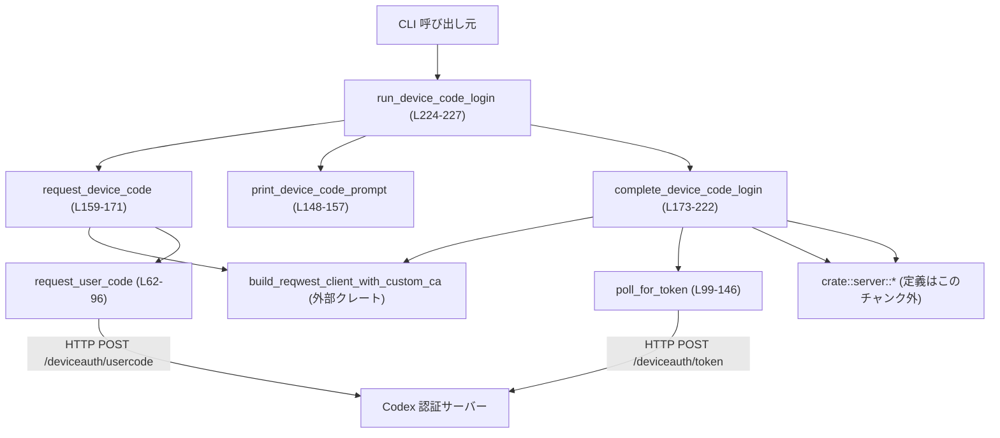
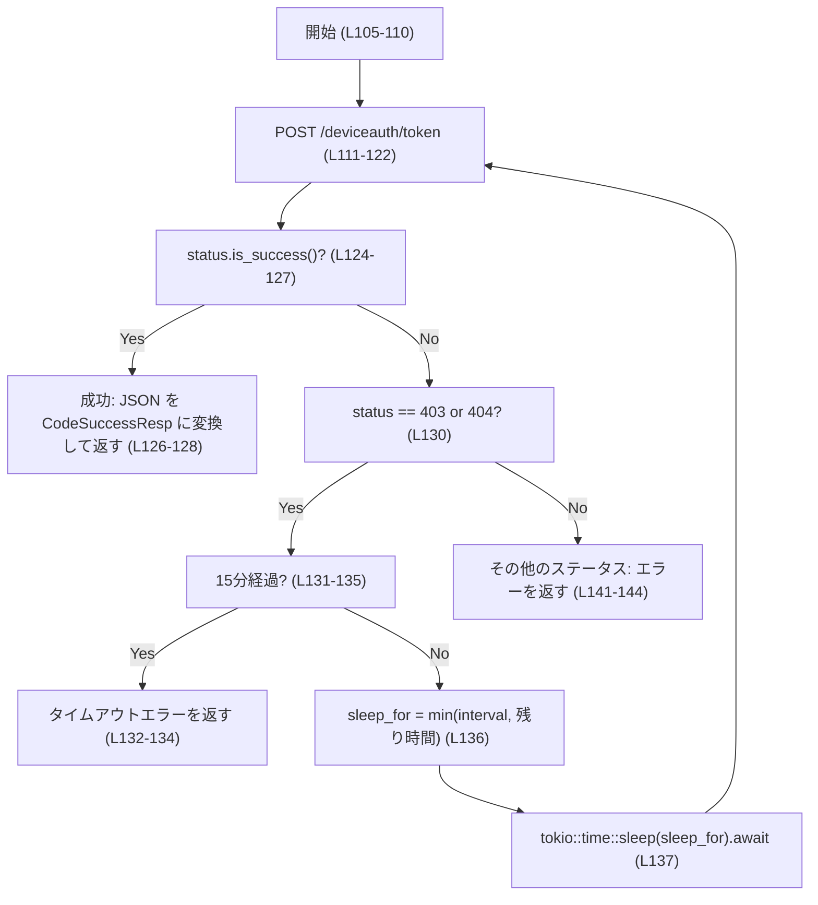
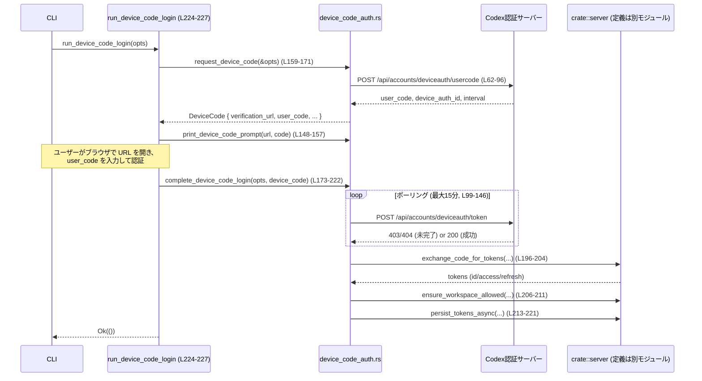

# login\src\device_code_auth.rs

## 0. ざっくり一言

Codex CLI が「デバイスコード認証」で ChatGPT にログインするためのフローを実装するモジュールです。  
デバイスコードの取得、ユーザーへの表示、トークン発行までのポーリング、最終的なトークン交換と保存を行います。

---

## 1. このモジュールの役割

### 1.1 概要

このモジュールは **ブラウザを開ける別端末で認証しつつ、CLI 側でログインを完了するデバイスコードフロー** を実装しています。

- Codex サーバーからデバイスコードとユーザーコードを取得する
- ユーザーにコードと認証 URL を表示する
- サーバー側でユーザーが認証完了するまでポーリングし、認可コード+PKCE 情報を取得する
- 認可コードをトークンに交換し、ワークスペース制約を確認してからローカルに保存する

（根拠: `request_device_code`, `complete_device_code_login`, `run_device_code_login` の処理内容  
`login\src\device_code_auth.rs:L159-227`）

### 1.2 アーキテクチャ内での位置づけ

このモジュールは、CLI の「ログイン処理」の一部として動作し、他のモジュール／外部ライブラリと次のように連携します。

- `codex_client::build_reqwest_client_with_custom_ca` で HTTP クライアントを構築（カスタム CA 対応）  
  （`login\src\device_code_auth.rs:L159-160, L177-177`）
- `crate::server::ServerOptions` からサーバー URL や client_id、保存先などの設定を受け取る  
  （`login\src\device_code_auth.rs:L159-162, L173-179, L214-220`）
- `crate::server` モジュールの関数を呼び出して、コード交換・ワークスペースチェック・トークン保存を実行  
  （`login\src\device_code_auth.rs:L196-205, L206-212, L213-221`）
- PKCE（Proof Key for Code Exchange）用の `PkceCodes` 構造体を生成して、トークン交換に利用  
  （`login\src\device_code_auth.rs:L190-193`）

依存関係の概要を Mermaid で示します（関数名と行番号付き）:



### 1.3 設計上のポイント

- **責務分割**
  - HTTP 通信（ユーザーコード取得・ポーリング）は `request_user_code` と `poll_for_token` に分離  
    （`login\src\device_code_auth.rs:L62-96, L99-146`）
  - ユーザーへのメッセージ表示は `print_device_code_prompt` に切り出し  
    （`login\src\device_code_auth.rs:L148-157`）
  - CLI から利用するメイン入口は `run_device_code_login` の 1 関数  
    （`login\src\device_code_auth.rs:L224-227`）
- **状態管理**
  - デバイスコード関連の状態は `DeviceCode` 構造体で保持し、`device_auth_id` とポーリング間隔 `interval` は非公開フィールドとして内部利用専用にしている  
    （`login\src\device_code_auth.rs:L18-24`）
- **エラーハンドリング**
  - すべての公開 API は `std::io::Result` を返す形で統一され、HTTP エラーや JSON パースエラーなどを `std::io::Error::other` でラップしている  
    （`login\src\device_code_auth.rs:L71, L78, L94-95, L115, L122, L127, L132-134, L141-144, L159-160, L177, L203-204`）
  - 特定の HTTP ステータスコード（404, 403）は別扱いでエラーメッセージやリトライロジックに反映  
    （`login\src\device_code_auth.rs:L80-88, L124-135`）
- **並行性 / 非同期**
  - ネットワーク I/O はすべて `async` 関数と `await` で非同期的に処理される
  - ポーリングは `tokio::time::sleep` を用いて適切に待機しつつ、最大 15 分でタイムアウトする  
    （`login\src\device_code_auth.rs:L107-108, L130-138`）
- **セキュリティ配慮**
  - PKCE を使用してコード交換を行う (`PkceCodes`)  
    （`login\src\device_code_auth.rs:L190-193`）
  - デバイスコードはフィッシング対象である旨をユーザーに警告するメッセージを出力  
    （`login\src\device_code_auth.rs:L151-155`）
  - ワークスペース制限を `ensure_workspace_allowed` で確認  
    （`login\src\device_code_auth.rs:L206-211`）

---

## 2. 主要な機能一覧

このモジュールが提供する主要な機能は次のとおりです。

- デバイスコードの取得: Codex サーバーからデバイス認証のための `user_code` と `device_auth_id` を取得する  
  （`request_device_code`, `request_user_code`）
- 認証手順の表示: ユーザーにブラウザ URL とワンタイムコードを色付きで表示する  
  （`print_device_code_prompt`）
- トークン発行までのポーリング: ユーザーがブラウザでログインを完了するまで定期的にトークンエンドポイントをポーリングする  
  （`poll_for_token`）
- 認可コードの交換とトークン保存: 認可コードをトークンに交換し、ワークスペース制限を確認しつつローカルに保存する  
  （`complete_device_code_login`）
- 全体フローのオーケストレーション: これらを順番に呼び出して CLI ログインを完了する  
  （`run_device_code_login`）

### 2.1 コンポーネントインベントリー（型・関数・定数）

行番号は `login\src\device_code_auth.rs:L開始-終了` 形式です。

#### 型（構造体）

| 名前 | 公開? | 行範囲 | 役割 |
|------|-------|--------|------|
| `DeviceCode` | `pub` | `L18-24` | 認証中のデバイスコード情報を保持する。ユーザーに見せる `verification_url` と `user_code` は公開フィールド、ポーリングに必要な `device_auth_id` と `interval` は非公開。 |
| `UserCodeResp` | private | `L26-33` | `/deviceauth/usercode` 応答 JSON をデシリアライズするための型。`device_auth_id`・`user_code`・ポーリング間隔 `interval` を受け取る。 |
| `UserCodeReq` | private | `L35-38` | `/deviceauth/usercode` リクエスト JSON 用の型。`client_id` のみを送信。 |
| `TokenPollReq` | private | `L40-44` | `/deviceauth/token` ポーリングリクエスト JSON 用の型。`device_auth_id` と `user_code` を送信。 |
| `CodeSuccessResp` | private | `L54-59` | ポーリング成功時の JSON 応答を受け取る型。`authorization_code` と PKCE 用の `code_challenge`・`code_verifier` を保持。 |

#### 関数

| 名前 | 公開? | 非同期? | 行範囲 | 役割 |
|------|-------|---------|--------|------|
| `deserialize_interval` | private | いいえ | `L46-52` | `UserCodeResp.interval` 用のカスタムデシリアライザ。文字列から `u64` に変換する。 |
| `request_user_code` | private | はい | `L62-96` | `/deviceauth/usercode` に POST して `UserCodeResp` を取得する。HTTP と JSON のエラーを `std::io::Error` に変換。 |
| `poll_for_token` | private | はい | `L99-146` | `/deviceauth/token` に一定間隔で POST し、成功するまでポーリングする。最大 15 分でタイムアウト。 |
| `print_device_code_prompt` | private | いいえ | `L148-157` | ANSI カラーを使ってデバイスコード認証の手順を案内するメッセージを標準出力に表示。 |
| `request_device_code` | `pub` | はい | `L159-171` | `ServerOptions` を基にユーザーコードを取得し、`DeviceCode` 構造体にまとめて返す。 |
| `complete_device_code_login` | `pub` | はい | `L173-222` | デバイスコードを使ってトークンを取得し、ワークスペース制限を確認のうえ、トークンを永続化する。 |
| `run_device_code_login` | `pub` | はい | `L224-227` | デバイスコード認証フロー全体の入口。`request_device_code` → `print_device_code_prompt` → `complete_device_code_login` を順に呼び出す。 |

#### 定数

| 名前 | 型 | 行範囲 | 役割 |
|------|----|--------|------|
| `ANSI_BLUE` | `&'static str` | `L14` | 青色表示の ANSI エスケープコード。 |
| `ANSI_GRAY` | `&'static str` | `L15` | グレー表示の ANSI エスケープコード。 |
| `ANSI_RESET` | `&'static str` | `L16` | 色をリセットする ANSI エスケープコード。 |

---

## 3. 公開 API と詳細解説

### 3.1 型一覧（構造体・列挙体など）

公開されている主要な型は `DeviceCode` です。

| 名前 | 種別 | 公開? | 行範囲 | 役割 / 用途 |
|------|------|-------|--------|-------------|
| `DeviceCode` | 構造体 | `pub` | `L18-24` | デバイスコード認証フローの途中状態を表す。`request_device_code` で生成され、`complete_device_code_login` に引き渡される。 |

`DeviceCode` のフィールド構成:

- `verification_url: String` (pub) – ユーザーがブラウザで開くべき URL  
  （`login\src\device_code_auth.rs:L20`）
- `user_code: String` (pub) – ユーザーがブラウザ画面に入力するワンタイムコード  
  （`login\src\device_code_auth.rs:L21`）
- `device_auth_id: String` (private) – サーバー側でデバイス認証セッションを識別する ID  
  （`login\src\device_code_auth.rs:L22`）
- `interval: u64` (private) – ポーリング間隔（秒）  
  （`login\src\device_code_auth.rs:L23`）

公開フィールドと非公開フィールドを分けることで、呼び出し側はユーザーに見せる情報のみを扱い、ポーリングの制御情報は内部ロジックに限定されます（安全性・一貫性の確保）。

---

### 3.2 関数詳細（7 件）

以下の 7 関数を詳しく解説します。

---

#### `run_device_code_login(opts: ServerOptions) -> std::io::Result<()>`  (`L224-227`)

**概要**

デバイスコード認証フロー全体の高水準 API です。  
`opts` からサーバー情報を取得し、デバイスコードをリクエスト→ユーザーに提示→トークン取得・保存までを一括で行います。

**引数**

| 引数名 | 型 | 説明 |
|--------|----|------|
| `opts` | `ServerOptions` | 認証に必要なサーバー URL (`issuer`)、`client_id`、トークン保存先 (`codex_home`)、ワークスペース設定などを含む設定構造体。定義はこのチャンクには現れません。 |

**戻り値**

- `std::io::Result<()>`
  - 成功時: `Ok(())`
  - 失敗時: 中で発生した HTTP/JSON/ワークスペース制限/トークン保存のいずれかのエラーを `std::io::Error` として返します。

**内部処理の流れ**

1. `request_device_code(&opts)` を呼び出し、サーバーからデバイスコード情報を取得 (`L225`)。
2. `print_device_code_prompt` でユーザーに URL とコードを表示 (`L226`)。
3. `complete_device_code_login(opts, device_code)` を呼び出し、ポーリング・コード交換・トークン保存まで実施 (`L227`)。
4. どこかでエラーが発生すると、その `Err` をそのまま呼び出し元に返します。

**使用例**

CLI エントリポイントからの利用例です（`ServerOptions` の詳細はこのチャンクからは不明なため簡略化します）。

```rust
use std::io;                                              // std::io::Result を使う
use crate::server::ServerOptions;                         // ServerOptions 型（定義は別モジュール）
use crate::device_code_auth::run_device_code_login;       // 本モジュールの公開関数

#[tokio::main]                                            // 非同期 main 関数用の属性マクロ
async fn main() -> io::Result<()> {                       // CLI のエントリポイント
    let opts = ServerOptions {
        // フィールドは実際の定義に合わせて初期化する必要があります
        // このチャンクには詳細が無いため省略します
        // issuer: "https://example.com".to_string(),
        // client_id: "my-client-id".to_string(),
        // ...
        ..Default::default()                              // 仮: Default 実装がある場合
    };

    run_device_code_login(opts).await                     // デバイスコードログイン全体を実行
}
```

**Errors / Panics**

- `request_device_code` が返すエラー（例: デバイスコードが取得できない、404 など）  
- `complete_device_code_login` が返すエラー（例: デバイス認証タイムアウト、コード交換失敗、ワークスペース制限、トークン保存失敗）  
※ いずれも `std::io::Error` として返され、panic を起こすコードはこの関数内にはありません。

**Edge cases（エッジケース）**

- ネットワーク断やサーバー不達の場合: 内部の HTTP リクエストが `Err(std::io::Error)` を返し、そのまま伝播します。
- ユーザーがブラウザ側で認証を行わない場合: `complete_device_code_login` 内のポーリングが 15 分でタイムアウトしてエラーになります。

**使用上の注意点**

- 非同期関数なので、`tokio` などの非同期ランタイム内から `.await` 付きで呼び出す必要があります。
- 標準出力にメッセージを出すため、CLI 以外のコンテキスト（GUI アプリ）では直接使うと望まない出力が発生する可能性があります。

---

#### `request_device_code(opts: &ServerOptions) -> std::io::Result<DeviceCode>` (`L159-171`)

**概要**

サーバーからデバイスコード認証用のユーザーコード情報を取得し、それを `DeviceCode` 構造体にまとめて返す関数です。

**引数**

| 引数名 | 型 | 説明 |
|--------|----|------|
| `opts` | `&ServerOptions` | Issuer URL、client_id などを含むサーバー設定。参照で受け取り、所有権は移動しません。 |

**戻り値**

- `std::io::Result<DeviceCode>`
  - 成功時: `DeviceCode`（`verification_url`, `user_code`, `device_auth_id`, `interval` を含む）
  - 失敗時: HTTP クライアント構築・ユーザーコードリクエスト・JSON パースのいずれかの段階での `std::io::Error`

**内部処理の流れ**

1. `build_reqwest_client_with_custom_ca(reqwest::Client::builder())` で HTTP クライアントを構築 (`L159-160`)。
2. `opts.issuer` から末尾の `/` を取り除いて `base_url` を作成 (`L161`)。
3. 認証 API ベース URL `"{base_url}/api/accounts"` を組み立てる (`L162`)。
4. `request_user_code` を呼び出し、`UserCodeResp` を取得 (`L163`)。
5. `DeviceCode` を構築:
   - `verification_url` は `"{base_url}/codex/device"`（ブラウザで開く URL） (`L165-167`)。
   - `user_code`, `device_auth_id`, `interval` は `UserCodeResp` からコピー (`L167-169`)。
6. `Ok(DeviceCode { ... })` として返す (`L165-170`)。

**使用例**

```rust
use std::io;
use crate::server::ServerOptions;
use crate::device_code_auth::request_device_code;

async fn prepare_device_code(opts: &ServerOptions) -> io::Result<()> {
    let device_code = request_device_code(opts).await?;       // デバイスコード情報を取得
    println!("URL: {}", device_code.verification_url);        // ブラウザで開く URL を表示
    println!("Code: {}", device_code.user_code);              // ユーザーに入力してもらうコードを表示
    Ok(())
}
```

**Errors / Panics**

- HTTP クライアント構築に失敗した場合: `build_reqwest_client_with_custom_ca` からのエラーをそのまま `io::Error` として返す (`L159-160`)。
- `/deviceauth/usercode` へのリクエストが失敗、または JSON パースに失敗した場合: `request_user_code` のエラーが伝播します。

**Edge cases**

- `opts.issuer` の末尾に `/` が複数あっても `trim_end_matches('/')` でまとめて削除されます (`L161`)。
- `UserCodeResp.interval` がレスポンスに含まれずデフォルトになる場合: `deserialize_interval` が `default` として `0` を返すのではなく、`#[serde(default, ...)]` によりデフォルト値は `0` として渡される前提です（詳細は serde の仕様に依存し、このチャンクだけでは完全には分かりません）。

**使用上の注意点**

- 戻り値の `DeviceCode` にはポーリングに使う内部情報も含まれるため、そのまま `complete_device_code_login` に渡す前提です。
- `DeviceCode` の `device_auth_id` と `interval` は非公開なので、外部からは変更できません。ポーリングの挙動を変えたい場合はモジュール側のコード変更が必要です。

---

#### `complete_device_code_login(opts: ServerOptions, device_code: DeviceCode) -> std::io::Result<()>` (`L173-222`)

**概要**

取得済みの `DeviceCode` を用いて、サーバーから認可コード＋PKCE 情報をポーリングで受け取り、それをトークンに交換して保存する関数です。  
CLI ログイン処理の後半を担います。

**引数**

| 引数名 | 型 | 説明 |
|--------|----|------|
| `opts` | `ServerOptions` | サーバー URL, client_id, トークン保存設定、ワークスペース制限など。所有権を受け取り、この関数内で消費されます。 |
| `device_code` | `DeviceCode` | 事前に `request_device_code` で取得したデバイスコード情報。所有権を受け取り、この関数内で消費されます。 |

**戻り値**

- `std::io::Result<()>`
  - 成功時: `Ok(())`（トークンが保存済み）
  - 失敗時: ポーリングエラー・コード交換エラー・ワークスペース制限エラー・トークン保存エラーのいずれか

**内部処理の流れ**

1. HTTP クライアントを構築 (`L177`)。
2. `opts.issuer` から `base_url`、`api_base_url` を生成 (`L178-179`)。
3. `poll_for_token` を呼び出し、`CodeSuccessResp`（`authorization_code`, `code_challenge`, `code_verifier`）を取得 (`L181-188`)。
4. `PkceCodes` 構造体を生成 (`L190-193`)。
5. `redirect_uri` を `"{base_url}/deviceauth/callback"` として組み立て (`L194`)。
6. `crate::server::exchange_code_for_tokens` を呼び出し、トークンを取得 (`L196-204`)。
7. `crate::server::ensure_workspace_allowed` で、トークンの `id_token` に基づくワークスペース制限を確認 (`L206-211`)。
8. `crate::server::persist_tokens_async` でローカルにトークンを保存 (`L213-221`)。
9. いずれかの段階でエラーがあれば `Err(io::Error)` を返す。成功時は `Ok(())` を返す。

**使用例**

`run_device_code_login` から内部的に使用されることを想定しているため、外部から直接呼び出す場合の例です。

```rust
use std::io;
use crate::server::ServerOptions;
use crate::device_code_auth::{request_device_code, complete_device_code_login};

async fn login_in_two_steps(opts: ServerOptions) -> io::Result<()> {
    // 1. デバイスコードを取得
    let device_code = request_device_code(&opts).await?;          // デバイスコードを取得

    // 2. ユーザーにどこかで表示（例: GUI 画面）し、その後…
    println!("Open: {}", device_code.verification_url);           // 簡易表示
    println!("Code: {}", device_code.user_code);

    // 3. ポーリングとトークン保存
    complete_device_code_login(opts, device_code).await           // ログイン完了まで実行
}
```

**Errors / Panics**

- `poll_for_token` からのエラー（タイムアウト含む） (`L181-188`)。
- `exchange_code_for_tokens` からのエラーは `"device code exchange failed: {err}"` というメッセージを持つ `io::Error` に変換されます (`L196-204`)。
- `ensure_workspace_allowed` が `Err(message)` を返した場合、`io::ErrorKind::PermissionDenied` で `io::Error` を生成して返します (`L206-211`)。
- `persist_tokens_async` のエラーはそのまま伝播します (`L213-221`)。
- panic を発生させるコードはこの関数内にはありません（`unwrap`, `expect` の使用なし）。

**Edge cases**

- `opts.forced_chatgpt_workspace_id` が `Some` の場合にのみワークスペースチェックが行われるかどうかは、`ensure_workspace_allowed` の実装に依存し、このチャンクでは分かりません (`L206-211`)。
- `persist_tokens_async` に `/*api_key*/ None` を渡しているため、API キーと ID トークンが併用されるようなケースは想定していないように見えます（ただし意図はコードからは断定できません） (`L213-216`)。

**使用上の注意点**

- `opts` と `device_code` の所有権がこの関数に移動するため、呼び出し後にそれらを再利用することはできません（Rust の所有権ルール）。
- ネットワークとディスク I/O の両方を行うため、タイムアウト回りを変更・追加する場合は外側でタイムアウトを管理するなどの設計が必要です。

---

#### `request_user_code(client: &reqwest::Client, auth_base_url: &str, client_id: &str) -> std::io::Result<UserCodeResp>` (`L62-96`)

**概要**

内部 helper 関数です。  
`POST {auth_base_url}/deviceauth/usercode` を行い、デバイス認証の `user_code`, `device_auth_id`, `interval` を取得します。

**引数**

| 引数名 | 型 | 説明 |
|--------|----|------|
| `client` | `&reqwest::Client` | 事前に構築された HTTP クライアント。非同期 HTTP 通信を行う。 |
| `auth_base_url` | `&str` | 認証 API のベース URL（例: `https://example.com/api/accounts`）。 |
| `client_id` | `&str` | OAuth クライアント ID。JSON ボディ内で送信される。 |

**戻り値**

- `std::io::Result<UserCodeResp>`
  - 成功時: `UserCodeResp`（内部構造体）
  - 失敗時: HTTP 送信エラー・非 2xx ステータス・レスポンス body 取得エラー・JSON パースエラー

**内部処理の流れ**

1. URL を `"{auth_base_url}/deviceauth/usercode"` として組み立て (`L67`)。
2. `UserCodeReq { client_id: client_id.to_string() }` を JSON 文字列にシリアライズ (`L68-71`)。
3. `client.post(url)` に `Content-Type: application/json` ヘッダとボディを付与して送信 (`L72-78`)。
4. ステータスコードを検査 (`L80-92`):
   - 2xx 以外の場合:
     - `404 Not Found` のとき: 「device code login is not enabled ...」というメッセージで `io::ErrorKind::NotFound` を返す (`L82-86`)。
     - それ以外: ステータスコードを含むメッセージで `io::Error::other` を返す (`L89-91`)。
5. 2xx の場合:
   - `resp.text().await` で body を文字列として取得 (`L94`)。
   - `serde_json::from_str` で `UserCodeResp` にデシリアライズ (`L95`)。

**Errors / Panics**

- `serde_json::to_string` のエラー → `io::Error::other` (`L68-71`)。
- HTTP 送信エラー → `io::Error::other` (`L76-78`)。
- 非 2xx ステータス → 独自メッセージの `io::Error` (`L80-92`)。
- `resp.text()` 取得エラー → `io::Error::other` (`L94`)。
- JSON パースエラー → `io::Error::other` (`L95`)。

**Edge cases**

- サーバーが `404` を返す場合、メッセージには「device code login is not enabled ...」とあり、デバイスコード認証がサーバー設定で無効化されている状況を想定していると解釈できます (`L83-86`)。
- JSON の `interval` フィールドが文字列以外の型で返ってきた場合、`deserialize_interval` が変換に失敗し JSON パースエラーとなる可能性があります（`L31-32`, `L46-52`）。これはサーバー実装との契約に依存します。

**使用上の注意点**

- この関数は `UserCodeResp`（内部型）を返すため、外部モジュールから直接使うことは想定されていません。通常は `request_device_code` 経由で利用します。
- `client` のライフタイムは呼び出し元で管理する必要がありますが、本モジュールでは毎回新規にクライアントを生成しているため共有前提ではありません（`L159-160, L177`）。

---

#### `poll_for_token(client: &reqwest::Client, auth_base_url: &str, device_auth_id: &str, user_code: &str, interval: u64) -> std::io::Result<CodeSuccessResp>` (`L99-146`)

**概要**

デバイスコード認証の完了を待つためのポーリングロジックを実装する内部関数です。  
成功するまで `/deviceauth/token` に POST を繰り返し、最大 15 分でタイムアウトします。

**引数**

| 引数名 | 型 | 説明 |
|--------|----|------|
| `client` | `&reqwest::Client` | HTTP クライアント。 |
| `auth_base_url` | `&str` | 認証 API のベース URL。 |
| `device_auth_id` | `&str` | サーバー側が紐づけているデバイス認証セッション ID。 |
| `user_code` | `&str` | ユーザーがブラウザ側で入力したコードと同じ値。 |
| `interval` | `u64` | ポーリング間隔（秒）。 `UserCodeResp.interval` から渡される。 |

**戻り値**

- `std::io::Result<CodeSuccessResp>`
  - 成功時: `CodeSuccessResp`（`authorization_code`, `code_challenge`, `code_verifier`）
  - 失敗時: HTTP エラー・JSON パースエラー・タイムアウト・非対応なステータスコードなど

**内部処理の流れ**

1. URL を `"{auth_base_url}/deviceauth/token"` として組み立て (`L106`)。
2. 最大待機時間 `max_wait` を 15 分に設定 (`L107`)。
3. 現在時刻を `Instant::now()` で記録 (`L108`)。
4. 無限ループ (`loop { ... }`) で以下を繰り返す (`L110-145`):
   1. `TokenPollReq { device_auth_id, user_code }` を JSON 文字列にシリアライズ (`L111-115`)。
   2. HTTP POST リクエストを送信 (`L116-122`)。
   3. ステータスコードを取得 (`L124`)。
   4. 分岐:
      - `status.is_success()`（2xx）の場合:
        - `resp.json().await` で `CodeSuccessResp` に変換し、`Ok(..)` で返す (`L126-128`)。
      - ステータスが `FORBIDDEN` または `NOT_FOUND` の場合 (`L130`):
        - 経過時間が `max_wait` 以上なら `"device auth timed out after 15 minutes"` でエラー (`L131-135`)。
        - まだなら `sleep_for = min(interval秒, 残り時間)` を計算し、`tokio::time::sleep(sleep_for).await` してからループ継続 (`L136-138`)。
      - それ以外のステータス:
        - `"device auth failed with status {}"` メッセージの `io::Error` を返してループ終了 (`L141-144`)。

**Mermaid フローチャート（ポーリング処理, L99-146）**



**Errors / Panics**

- JSON シリアライズ・HTTP 送信・JSON デシリアライズのいずれかに失敗した場合、`io::Error::other` が返されます (`L111-115, L116-122, L127`)。
- 15 分タイムアウト時には `"device auth timed out after 15 minutes"` というメッセージでエラー (`L131-135`)。
- 403/404 以外の非成功ステータスコードの場合、ステータスを含むメッセージでエラー (`L141-144`)。
- panic を引き起こすコードは含まれていません。

**Edge cases**

- `interval` が 0 の場合:
  - `Duration::from_secs(interval)` はゼロ秒となり、`sleep_for` は `max_wait - start.elapsed()` との `min` で決まります (`L136`)。
  - `tokio::time::sleep(Duration::from_secs(0))` は即時に戻りますが待ち時間がほぼゼロになり、頻繁なポーリングとなる可能性があります。
- サーバーが 403/404 を返す条件はこのチャンクからは不明ですが、「まだ認証が完了していない」状態として扱われているように見えます。
- 15 分を超えた場合はポーリングを続けず即座にタイムアウトとします。

**使用上の注意点**

- 非公開関数であり、`complete_device_code_login` からのみ呼ばれることを前提としています。
- `interval` はサーバーから指示される値と見なしており、クライアント側で勝手に変更しない前提の設計です（`DeviceCode.interval` が非公開であることと整合的）。

---

#### `print_device_code_prompt(verification_url: &str, code: &str)` (`L148-157`)

**概要**

デバイスコード認証の手順を、カラー付きテキストとして標準出力に表示します。

**引数**

| 引数名 | 型 | 説明 |
|--------|----|------|
| `verification_url` | `&str` | ユーザーがブラウザで開くべき URL。 |
| `code` | `&str` | ブラウザ画面に入力するワンタイムコード。 |

**戻り値**

- なし（返り値のない関数）。副作用として `println!` による出力を行います。

**内部処理の流れ**

1. `env!("CARGO_PKG_VERSION")` でビルド時のパッケージバージョンを取得 (`L149`)。
2. ANSI カラーコードを埋め込んだマルチライン文字列を `println!` で出力 (`L150-156`)。
   - 青 (`ANSI_BLUE`) とグレー (`ANSI_GRAY`) を使用して、URL やコードを強調しています (`L151-155`)。
   - 「Device codes are a common phishing target. Never share this code.」という注意喚起も含まれます (`L155`)。

**使用例**

```rust
use crate::device_code_auth::print_device_code_prompt;

fn show_prompt() {
    let url = "https://example.com/codex/device";          // ブラウザで開く URL
    let code = "ABCD-EFGH";                                // 仮のデバイスコード
    print_device_code_prompt(url, code);                   // 手順を標準出力に表示
}
```

**Errors / Panics**

- `println!` は通常 panic を起こしませんが、標準出力への書き込みに失敗した場合などは潜在的に panic しうる可能性があります。ただしそのような状況は一般的には稀です。
- `env!("CARGO_PKG_VERSION")` はコンパイル時の環境変数取得であり、失敗時にはコンパイルエラーとなるため、ランタイムでの panic は発生しません。

**使用上の注意点**

- 標準出力を使用するため、CLI やログのフォーマットに影響します。テストなどでは出力を抑制したい場合、別層でラップする必要があります。
- ANSI エスケープシーケンスに対応していない端末では色が正しく表示されない可能性があります。

---

#### `deserialize_interval<'de, D>(deserializer: D) -> Result<u64, D::Error>` (`L46-52`)

**概要**

`serde` デシリアライズ用のヘルパー関数です。文字列として送られてきた `interval` フィールドを `u64` に変換します。

**引数**

| 引数名 | 型 | 説明 |
|--------|----|------|
| `deserializer` | `D` where `D: Deserializer<'de>` | `serde` が提供するデシリアライザ。JSON のフィールドから値を読み出すために使われます。 |

**戻り値**

- `Result<u64, D::Error>`
  - 成功時: パースされた `u64` 値
  - 失敗時: `de::Error::custom` でラップされたパースエラー

**内部処理の流れ**

1. `String::deserialize(deserializer)?` でまず文字列として読み込む (`L50`)。
2. `s.trim().parse::<u64>()` で空白を除去し `u64` に変換 (`L51`)。
3. `map_err(de::Error::custom)` でエラーを serde 用のエラー型に変換 (`L51`)。

**使用上の注意点**

- `UserCodeResp.interval` に `#[serde(default, deserialize_with = "deserialize_interval")]` が付いており (`L31-32`)、レスポンス JSON に `interval` が無い場合のデフォルト値の扱いは serde の仕様に依存します。
- サーバーが `interval` を数値型（例: `5`）で返す場合、この関数は `String::deserialize` の段階で失敗します。そのため「文字列で返す」という契約が前提です。

---

### 3.3 その他の関数

上記 7 関数以外の関数は、このファイルにはありません。

---

## 4. データフロー

ここでは、典型的なデバイスコード認証フロー（`run_device_code_login` 呼び出し）のデータの流れを示します。

1. CLI が `run_device_code_login` を呼び出す (`L224-227`)。
2. `request_device_code` が `/deviceauth/usercode` から `user_code`, `device_auth_id`, `interval` を取得し、`DeviceCode` を返す (`L159-171`)。
3. `print_device_code_prompt` が `DeviceCode` の公開フィールドを用いてユーザーに手順を表示する (`L148-157, L225-226`)。
4. `complete_device_code_login` が `poll_for_token` を通じて `/deviceauth/token` をポーリングし、認可コードと PKCE 情報を取得 (`L173-193`)。
5. `exchange_code_for_tokens` でトークンに交換し (`L196-204`)、`ensure_workspace_allowed` で制限をチェック (`L206-211`)、`persist_tokens_async` でトークンを保存する (`L213-221`)。

### Mermaid シーケンス図（login フロー, L159-227）



---

## 5. 使い方（How to Use）

### 5.1 基本的な使用方法

最も単純な利用方法は、CLI のエントリポイントから `run_device_code_login` を 1 回呼び出すことです。

```rust
use std::io;                                              // io::Result のためにインポート
use crate::server::ServerOptions;                         // ログイン設定 (定義は別モジュール)
use crate::device_code_auth::run_device_code_login;       // 本モジュールの公開 API

#[tokio::main]                                            // 非同期 main を実現する tokio マクロ
async fn main() -> io::Result<()> {                       // エラーは io::Result で表現
    let opts = ServerOptions {
        // issuer, client_id, codex_home, forced_chatgpt_workspace_id など
        // 実際のフィールド定義はこのチャンクには含まれていません
        ..Default::default()                              // ここでは簡略化のため Default を利用
    };

    run_device_code_login(opts).await                     // デバイスコード認証フローを実行
}
```

このコードを実行すると、ユーザーはターミナルで URL とコードを受け取り、ブラウザで認証することで CLI のログインが完了します。

### 5.2 よくある使用パターン

#### パターン1: プロンプト表示をカスタム UI に置き換える

ターミナルではなく GUI などでコードを表示したい場合、`request_device_code` と `complete_device_code_login` を別々に使うパターンが考えられます。

```rust
use std::io;
use crate::server::ServerOptions;
use crate::device_code_auth::{request_device_code, complete_device_code_login};

async fn login_with_custom_ui(mut opts: ServerOptions) -> io::Result<()> {
    // 1. デバイスコードを取得
    let device_code = request_device_code(&opts).await?;      // DeviceCode を取得

    // 2. 独自 UI で表示する
    show_in_gui(&device_code.verification_url, &device_code.user_code); // ユーザーに URL とコードを見せる

    // 3. 認証完了を待ってトークン保存
    complete_device_code_login(opts, device_code).await       // ポーリングと保存
}

// GUI 表示用のダミー関数（実装はアプリケーション側で行う）
fn show_in_gui(url: &str, code: &str) {
    // ここにウィンドウの表示ロジックなどを書く
}
```

#### パターン2: タイムアウトやキャンセルを外側で制御する

モジュール内部では 15 分固定のタイムアウトを使用しますが (`L107-108, L131-135`)、それより短いタイムアウトやユーザーキャンセルを外側で制御したい場合、上位レイヤで `tokio::time::timeout` 等を使うパターンが考えられます（コードはこのチャンクには含まれていませんが、設計的には可能です）。

### 5.3 よくある間違い

#### 間違い例1: `request_device_code` の結果を無視して `complete_device_code_login` を直接呼ぶ

```rust
// 間違い例（擬似コード）
let device_code = DeviceCode {
    // 適当な値を作ってしまう
    verification_url: "https://example.com".to_string(),
    user_code: "XXXX-YYYY".to_string(),
    device_auth_id: "fake".to_string(),  // 本来非公開フィールドなので作れない
    interval: 5,
};

// これを complete_device_code_login に渡す → サーバー側の状態と一致せず失敗する
```

`device_auth_id` と `interval` は `DeviceCode` の非公開フィールドであり、外部から直接構築することはできません (`L22-23`)。  
必ず `request_device_code` を通じて正しい値を取得する必要があります。

#### 正しい例

```rust
// 正しい流れ
let device_code = request_device_code(&opts).await?;  // サーバーから正しい値を取得
complete_device_code_login(opts, device_code).await?; // そのままポーリングへ
```

### 5.4 使用上の注意点（まとめ）

- **非同期コンテキスト必須**  
  - `request_device_code`, `complete_device_code_login`, `run_device_code_login` はすべて `async fn` です (`L159, L173, L224`)。
  - `tokio` などのランタイム内から `.await` して呼び出す必要があります。
- **ネットワーク依存**  
  - サーバーとの通信に依存するため、オフライン環境ではログインできません。
- **セキュリティ**  
  - デバイスコードはフィッシングの標的になりやすいため、ユーザーに共有禁止を明示しています (`L155`)。
  - カスタム CA 対応のクライアントを使用しているため、社内 CA や特定の証明書構成などを想定している可能性があります (`L159-160, L177`)。
- **テストについて**  
  - このチャンクにはテストコードは含まれていません。HTTP 通信部分はモック化が必要になることが多いため、`reqwest::Client` を抽象化するなどの工夫がテスト側で必要になる可能性があります（コードからはテスト戦略は不明です）。

---

## 6. 変更の仕方（How to Modify）

### 6.1 新しい機能を追加する場合

例として「ポーリングの最大待機時間を設定可能にする」機能追加を考えます。

1. **設定の追加**
   - `ServerOptions`（別モジュール）の定義に `device_login_max_wait` のようなフィールドを追加（このファイルには定義が無いため、実際の変更箇所は別モジュールです）。
2. **`complete_device_code_login` から `poll_for_token` への引数追加**
   - 現在 `poll_for_token` 内で固定の `Duration::from_secs(15 * 60)` を生成しているため (`L107`)、引数で受け取るよう関数シグネチャを変更します。
3. **呼び出し側更新**
   - `complete_device_code_login` 内の `poll_for_token` 呼び出し箇所に、新しい引数を渡すように変更します (`L181-187`)。
4. **注意点**
   - `poll_for_token` は非公開関数なので、変更の影響範囲はこのモジュール内に限定されます。
   - エラーメッセージ `"device auth timed out after 15 minutes"` (`L132-134`) も合わせて更新する必要があります。

### 6.2 既存の機能を変更する場合

**影響範囲の確認方法**

- `request_device_code` / `complete_device_code_login` / `run_device_code_login` は公開 API であるため (`L159, L173, L224`)、他モジュールから呼ばれている可能性があります。
  - `rg "run_device_code_login"` などで呼び出し箇所を検索するのが一般的です（具体的なコマンド例はこのチャンクにはありませんが、Rust プロジェクトでよく用いられます）。

**注意すべき契約**

- `std::io::Result` を返すインターフェース
  - これらの関数はすべて `std::io::Result` を返すため、エラー種別を変えると呼び出し側のエラーハンドリングに影響します。
- エラーメッセージ
  - `request_user_code` や `poll_for_token` では、ユーザー向けに意味のあるメッセージを返しています (`L83-86, L132-134`)。
  - 文言変更は UX に影響するため、既存のドキュメントやサポートフローとの整合を確認する必要があります。
- デバイスコードの有効期限
  - タイムアウトを 15 分としてハードコードしている箇所 (`L107-108, L132-134`) は、サーバー側の設定と契約している可能性があります。変更する場合はサーバー実装と合わせる必要があります。

**関連するテストや使用箇所の再確認**

- このチャンクにはテストコードが存在しないため、テストファイルは別ディレクトリにあると考えられます（ただし場所は不明です）。
- 公開 API のシグネチャやエラーメッセージを変更する場合、CLI の統合テスト・エンドツーエンドテストが影響を受ける可能性があります。

---

## 7. 関連ファイル

このモジュールと密接に関係するモジュール（ファイルパスはこのチャンクからは分からないためモジュール名で記載します）。

| モジュール / パス | 役割 / 関係 |
|------------------|------------|
| `crate::server` | `ServerOptions` 型、および `exchange_code_for_tokens`, `ensure_workspace_allowed`, `persist_tokens_async` を提供する。デバイスコードログイン後のトークン交換・ワークスペース制限・トークン保存に利用される (`L10, L196-221`)。 |
| `crate::pkce` | `PkceCodes` 型を定義し、認可コードとともに送る PKCE 情報（`code_verifier`, `code_challenge`）を表現する (`L9, L190-193`)。 |
| `codex_client` クレート | `build_reqwest_client_with_custom_ca` により、カスタム CA 設定を持つ `reqwest::Client` を生成する (`L11, L159-160, L177`)。 |
| `reqwest` クレート | HTTP クライアントとして使用され、デバイスコード関連のエンドポイントへリクエストを送信する (`L1, L62-78, L99-122`)。 |
| `serde` / `serde_json` | JSON のシリアライズ・デシリアライズに使用される。`UserCodeReq`, `TokenPollReq`, `UserCodeResp`, `CodeSuccessResp` の変換に関与する (`L2-5, L26-44, L68-71, L94-95, L111-115, L126-127`)。 |

不明な点（例: `ServerOptions` のフィールド構成や `PkceCodes` の実装、`exchange_code_for_tokens` の詳細など）は、このチャンクには定義が無いため、ここでは説明できません。
