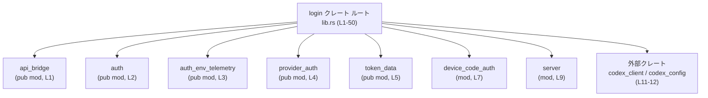

# login/src/lib.rs コード解説

## 0. ざっくり一言

`login/src/lib.rs` は、このクレート全体の **公開 API をまとめるルートモジュール** です。  
各種認証・ログイン処理を担う下位モジュールを定義し、それらの型や関数を再エクスポートして「入口」として提供しています（login/src/lib.rs:L1-5, L7-9, L11-50）。

---

## 1. このモジュールの役割

### 1.1 概要

- このモジュールは、`api_bridge`, `auth`, `auth_env_telemetry`, `provider_auth`, `token_data` などの認証関連モジュールを定義しています（login/src/lib.rs:L1-5）。
- 内部モジュールとして `device_code_auth`, `pkce`, `server` を登録し（login/src/lib.rs:L7-9）、その一部の型・関数を外部向けに再エクスポートしています（login/src/lib.rs:L13-20）。
- 外部クレート `codex_client`, `codex_config` からエラー型や設定モード型をエイリアスとして公開しています（login/src/lib.rs:L11-12）。
- これにより、他のクレートは `login::AuthManager` や `login::run_login_server` のように、ルートから直接認証・ログイン関連の主要 API を利用できます（login/src/lib.rs:L13-20, L23-50）。

### 1.2 アーキテクチャ内での位置づけ

このファイルはクレートのトップレベルにあり、複数のサブモジュールと外部クレートとの接点になっています。



- 破線ではなく直線で `login` → 各モジュール となっているのは、このファイルで `pub mod` / `mod` により依存関係が定義されているためです（login/src/lib.rs:L1-5, L7-9）。
- `codex_client`, `codex_config` からはエラー型・設定モード型を再エクスポートしており、HTTP クライアント構築エラーや認証情報の保存モードを外から扱えるようにしています（login/src/lib.rs:L11-12）。

### 1.3 設計上のポイント

コードから読み取れる範囲での特徴は次のとおりです。

- **ファサード構造**  
  - ほぼすべてが `pub use` による再エクスポートで構成されており、ルートモジュールが「入口 API」をまとめるファサードとして機能しています（login/src/lib.rs:L11-20, L22-50）。
- **責務ごとのモジュール分割**  
  - 設定・状態管理 (`auth`, `token_data`)、環境変数テレメトリ (`auth_env_telemetry`)、プロバイダ別処理 (`provider_auth`)、デバイスコード認証 (`device_code_auth`)、ログイン用サーバ (`server`) などに分かれていることが、モジュール名と re-export から読み取れます（login/src/lib.rs:L1-5, L7, L9, L13-20, L23-50）。
- **内部実装の隠蔽**  
  - `device_code_auth`, `pkce`, `server` は `mod` で宣言されつつ、モジュール自体は公開されていません（login/src/lib.rs:L7-9）。  
    代わりに必要な型・関数のみを `pub use` しており、内部実装の詳細を隠蔽する構造になっています（login/src/lib.rs:L13-20）。
- **安全性・エラーハンドリングに関連する型の再エクスポート**  
  - `BuildLoginHttpClientError` や `RefreshTokenError`, `UnauthorizedRecovery` など、エラー/リカバリ関連と思われる型名がルートから直接公開されています（login/src/lib.rs:L11, L37-38）。  
    ただし、これらの詳細な挙動やエラーハンドリング方針は、このファイルの範囲からは分かりません。

---

## 2. 主要な機能一覧

このファイルが提供する「機能」は、実装そのものではなく **再エクスポートされた API セット** です。  
名称のみから、以下のような分類が可能です（挙動自体はこのチャンクには現れません）。

- 認証設定・状態管理関連（auth モジュール由来、login/src/lib.rs:L23-45）
- デバイスコード認証関連（device_code_auth モジュール由来、login/src/lib.rs:L13-16）
- ログイン HTTP サーバ関連（server モジュール由来、login/src/lib.rs:L17-20）
- プロバイダ別認証マネージャ関連（provider_auth モジュール由来、login/src/lib.rs:L48-49）
- 認証トークン・メタデータ（token_data, ExternalAuth* 系、login/src/lib.rs:L30-34, L50）
- API キー・環境変数関連（`*_ENV_VAR` などの定数、login/src/lib.rs:L28, L35-36, L44）
- 認証環境テレメトリ収集（auth_env_telemetry モジュール由来、login/src/lib.rs:L46-47）
- HTTP クライアント構築エラーと認証保存モード（外部クレート由来、login/src/lib.rs:L11-12）

各機能の具体的なロジック、エラー・並行性の詳細は、下位モジュール側の実装がこのチャンクには含まれていないため不明です。

---

## 3. 公開 API と詳細解説

### 3.1 型一覧（構造体・列挙体など）

このファイルでルートから公開されている主な「型」および「定数」の一覧です。  
型の中身やフィールドは、このチャンクには現れません。

#### モジュール・外部クレート由来の型・定数

| 名前 | 種別（推定） | 元の定義 | 役割 / 用途（このチャンクから分かる範囲） | 根拠 |
|------|--------------|----------|--------------------------------------------|------|
| `BuildLoginHttpClientError` | エラー型（外部型の別名） | `codex_client::BuildCustomCaTransportError` | ログイン用 HTTP クライアント構築時のエラーを表す型エイリアスであることのみ分かります | login/src/lib.rs:L11 |
| `AuthCredentialsStoreMode` | 列挙体等（推定） | `codex_config::types` | 認証情報の保存モードを表す設定値と推測されますが、詳細は不明です | login/src/lib.rs:L12 |
| `DeviceCode` | 型 | `device_code_auth` | デバイスコード認証に関するデータ型であることが名称から推測されます | login/src/lib.rs:L13 |
| `LoginServer` | 型 | `server` | ログイン用のサーバを表す型名ですが、インターフェイスは不明です | login/src/lib.rs:L17 |
| `ServerOptions` | 型 | `server` | ログインサーバの設定オプションを表すと思われる型ですが詳細不明です | login/src/lib.rs:L18 |
| `ShutdownHandle` | 型 | `server` | サーバの停止制御用ハンドルと思われますが詳細不明です | login/src/lib.rs:L19 |
| `AuthConfig` | 型 | `auth` | 認証関連の設定をまとめた型と推測されます | login/src/lib.rs:L23 |
| `AuthDotJson` | 型 | `auth` | `auth.json` のようなファイル表現に対応していそうですが詳細不明です | login/src/lib.rs:L24 |
| `AuthManager` | 型 | `auth` | 認証状態やトークンを管理するコンポーネント名ですが実装は不明です | login/src/lib.rs:L25 |
| `AuthManagerConfig` | 型 | `auth` | `AuthManager` 用の構成情報と思われます | login/src/lib.rs:L26 |
| `CLIENT_ID` | 定数 | `auth` | クライアント ID を表す定数と推測されます | login/src/lib.rs:L27 |
| `CODEX_API_KEY_ENV_VAR` | 定数 | `auth` | Codex API キー格納用の環境変数名と思われます | login/src/lib.rs:L28 |
| `CodexAuth` | 型 | `auth` | Codex 関連の認証情報を持つ型と推測されます | login/src/lib.rs:L29 |
| `ExternalAuth` | 型 | `auth` | 外部サービス向けの認証情報を表す型と思われます | login/src/lib.rs:L30 |
| `ExternalAuthChatgptMetadata` | 型 | `auth` | ChatGPT 関連のメタデータと思われます | login/src/lib.rs:L31 |
| `ExternalAuthRefreshContext` | 型 | `auth` | 認証トークンのリフレッシュ時のコンテキスト情報と推測されます | login/src/lib.rs:L32 |
| `ExternalAuthRefreshReason` | 型 | `auth` | リフレッシュ理由の列挙などと推測されます | login/src/lib.rs:L33 |
| `ExternalAuthTokens` | 型 | `auth` | 外部認証のアクセストークン等をまとめた型名です | login/src/lib.rs:L34 |
| `OPENAI_API_KEY_ENV_VAR` | 定数 | `auth` | OpenAI API キー格納用環境変数名と思われます | login/src/lib.rs:L35 |
| `REFRESH_TOKEN_URL_OVERRIDE_ENV_VAR` | 定数 | `auth` | リフレッシュ URL の上書き用環境変数名と推測されます | login/src/lib.rs:L36 |
| `RefreshTokenError` | エラー型 | `auth` | トークンリフレッシュ時のエラーを表す型名です | login/src/lib.rs:L37 |
| `UnauthorizedRecovery` | 型 | `auth` | 未認証状態からの復旧ロジックに関係する型名です | login/src/lib.rs:L38 |
| `AuthEnvTelemetry` | 型 | `auth_env_telemetry` | 認証関連環境情報のテレメトリデータと思われます | login/src/lib.rs:L46 |
| `TokenData` | 型 | `token_data` | トークンに紐づくデータ構造を表す型名です | login/src/lib.rs:L50 |

> **注意**: 上記の「役割 / 用途」は、名称とモジュール名からの推測を含みます。  
> 実際のフィールド構造やメソッド、エラー条件は、このファイルのチャンクからは分かりません。

### 3.2 関数詳細（最大 7 件）

このファイルには関数本体の実装は含まれておらず、すべて他モジュールからの再エクスポートです。そのため、**シグネチャや内部処理はこのチャンクだけでは不明** です。  
それでも、重要と思われる関数名について、テンプレート形式で「分かること・分からないこと」を整理します。

#### `run_login_server(...)`

**概要**

- ログイン用サーバを起動する関数として再エクスポートされています（login/src/lib.rs:L20）。
- 定義は `server` モジュール側にあり、このチャンクには実装がありません。

**引数**

- このファイルからは一切分かりません。  
  - どのような設定型やハンドラを受け取るかは `server` モジュールの定義を確認する必要があります。

**戻り値**

- 戻り値の型・意味は不明です（このチャンクには現れません）。

**内部処理の流れ（アルゴリズム）**

- 不明です。  
  - サーバ起動やリクエスト処理の詳細は `server` モジュールの実装に依存します。

**Examples（使用例）**

- シグネチャが不明なため、正確にコンパイル可能なコード例はこのチャンクだけでは提示できません。

**Errors / Panics**

- エラー型（たとえば `BuildLoginHttpClientError` 等）と関係があるかどうかも、このファイルだけからは判断できません。

**Edge cases（エッジケース）**

- 不明です。

**使用上の注意点**

- この関数がサーバを起動する性質上、ブロッキング/非ブロッキング、並行処理モデルなどが重要になると考えられますが、このチャンクからは何も断定できません。

---

#### `login_with_api_key(...)`

**概要**

- API キーを用いたログイン処理を行う関数として `auth` モジュールから再エクスポートされています（login/src/lib.rs:L42）。

**引数 / 戻り値 / 内部処理 / エラー / エッジケース / 注意点**

- いずれもこのファイルからは不明です。  
  - API キーの形式、同期/非同期かどうか、エラー型などは `auth` モジュールの定義を参照する必要があります。

---

#### `complete_device_code_login(...)`

**概要**

- デバイスコード認証フローの完了処理を表すと見られる関数が `device_code_auth` から再エクスポートされています（login/src/lib.rs:L14）。

- それ以外の情報（引数・戻り値・エラー）は不明です。

---

#### `run_device_code_login(...)`

**概要**

- デバイスコード認証フローを実行する関数として再エクスポートされています（login/src/lib.rs:L16）。
- 詳細は `device_code_auth` モジュールの実装に依存し、このチャンクにはありません。

---

#### `request_device_code(...)`

**概要**

- デバイスコード取得を行う関数として再エクスポートされています（login/src/lib.rs:L15）。
- デバイスコード認証フロー全体の「最初のステップ」に相当する可能性がありますが、確証はありません。

---

#### `auth_manager_for_provider(...)`

**概要**

- 特定プロバイダ用の `AuthManager` を取得するための関数名として `provider_auth` モジュールから再エクスポートされています（login/src/lib.rs:L48）。

**詳細**

- 引数として「プロバイダを識別する値」などを受け取る可能性がありますが、このチャンクからは不明です。
- 戻り値が `Option` や `Result` かどうかも不明です。

---

#### `required_auth_manager_for_provider(...)`

**概要**

- 指定プロバイダに対する `AuthManager` が必須である状況で利用される関数であると名前から推測されます（login/src/lib.rs:L49）。
- 「見つからなかった場合はエラーを返す」ような振る舞いをしている可能性はありますが、これは推測であり、このチャンクからは確認できません。

---

> 上記 7 関数について、**型・エラー・並行性に関する具体的な情報は全て不明** です。  
> Rust に特有の所有権・借用・`Result` 型・`async`/`await` の利用状況などは、対応するモジュール (`auth`, `device_code_auth`, `server`, `provider_auth`) の実装コードを確認する必要があります。

### 3.3 その他の関数

このファイルで再エクスポートされているその他の関数・メソッド名を一覧にします。  
いずれもシグネチャや内部処理は、このチャンクには現れません。

| 関数名 | 元モジュール | 役割（名前から分かる範囲） | 根拠 |
|--------|--------------|----------------------------|------|
| `auth_provider_from_auth` | `api_bridge` | 認証情報から auth provider を構成する関数名です | login/src/lib.rs:L22 |
| `run_login_server` | `server` | ログイン用サーバ起動（詳細不明） | login/src/lib.rs:L20 |
| `default_client` | `auth` | デフォルト HTTP クライアント等を返す関数名と推測されます | login/src/lib.rs:L39 |
| `enforce_login_restrictions` | `auth` | ログイン制限を適用する関数名です | login/src/lib.rs:L40 |
| `load_auth_dot_json` | `auth` | 認証設定ファイル(`auth.json`?)読み込み関数名です | login/src/lib.rs:L41 |
| `logout` | `auth` | ログアウト処理関数名です | login/src/lib.rs:L43 |
| `read_openai_api_key_from_env` | `auth` | 環境変数から OpenAI API キーを読む関数名です | login/src/lib.rs:L44 |
| `save_auth` | `auth` | 認証情報保存処理関数名です | login/src/lib.rs:L45 |
| `collect_auth_env_telemetry` | `auth_env_telemetry` | 認証関連環境テレメトリ収集関数名です | login/src/lib.rs:L47 |

---

## 4. データフロー

このファイルには実際の処理フローは書かれておらず、**データはすべて下位モジュールで処理** されます。  
ここでは、`lib.rs` が担う「呼び出しの入り口としてのデータの流れ」を、静的な観点で説明します。

1. 外部のアプリケーションコードは `login` クレートを依存に追加し、`login::run_login_server` や `login::AuthManager` などの名前で API を利用します（login/src/lib.rs:L13-20, L23-50）。
2. コンパイラは `pub use` に従って、実際の実装（`server::run_login_server`、`auth::AuthManager` 等）に解決します（login/src/lib.rs:L13-20, L23-50）。
3. 実際の認証処理・トークン処理・HTTP 通信などのデータフローは、対応モジュールで定義されていますが、このチャンクには含まれていません。

これを簡単なシーケンス図で表します。

```mermaid
sequenceDiagram
    %% この図は login/src/lib.rs (L1-50) の範囲で分かる呼び出しの入り口のみを表します
    participant App as アプリケーションコード
    participant Login as login クレート\nlib.rs (L1-50)
    participant Server as server::run_login_server\n(実装は別ファイル)
    participant Auth as auth モジュール\n(実装は別ファイル)

    App->>Login: run_login_server(...)
    Note right of Login: pub use server::run_login_server;\n(login/src/lib.rs:L20)
    Login->>Server: run_login_server(...) を解決

    App->>Login: AuthManager / AuthConfig などを利用
    Note right of Login: pub use auth::AuthManager など\n(login/src/lib.rs:L23-26)
    Login->>Auth: 対応する型・関数に解決

    Note over Server,Auth: ここから先の内部フロー・データ構造は\nこのチャンクには含まれていません
```

- この図は **コンパイル時の名前解決レベル** の流れであり、実際のランタイムでの I/O、並行処理、エラー伝播などは不明です。

---

## 5. 使い方（How to Use）

### 5.1 基本的な使用方法

`lib.rs` は、下位モジュールの型・関数をルート名前空間に再エクスポートする「窓口」です。  
そのため、基本的な利用方法は「`login` クレートから目的の型・関数を `use` する」という形になります。

```rust
// 注意: 型や関数の詳細なシグネチャはこのチャンクからは不明なため、
// ここでは import パターンのみを示します。

use login::{
    // 認証設定・マネージャ
    AuthConfig,
    AuthManager,
    AuthManagerConfig,

    // ログインサーバ関連
    LoginServer,
    ServerOptions,
    ShutdownHandle,
    run_login_server,

    // デバイスコード認証関連
    DeviceCode,
    request_device_code,
    run_device_code_login,
    complete_device_code_login,

    // プロバイダ別マネージャ
    auth_manager_for_provider,
    required_auth_manager_for_provider,

    // テレメトリ
    AuthEnvTelemetry,
    collect_auth_env_telemetry,
};
```

- どの型にどのフィールドがあるか、どの関数が `async` か、どのエラー型を返すかなどは、このファイルでは分からないため、**具体的な呼び出し例はここでは提示できません**。

### 5.2 よくある使用パターン

このチャンクだけでは、典型的な呼び出し順序や組み合わせ（例: 「API キー → AuthManager → run_login_server」など）も把握できません。  
使用パターンは `auth`, `server`, `device_code_auth`, `provider_auth` の実装・ドキュメントに依存します。

### 5.3 よくある間違い

- このファイルにはロジックが無いため、典型的な誤用パターンをコードから直接読み取ることはできません。
- 一般的には、ルートから re-export された API と、モジュール経由 (`login::auth::AuthManager` のような書き方) を混在させると可読性が下がる場合がありますが、これはスタイル上の話であり、このファイルからの事実ではありません。

### 5.4 使用上の注意点（まとめ）

- **型・関数の詳細は元モジュールを確認する**  
  - `lib.rs` はシグネチャを再掲していないため、詳細は `auth`, `server`, `device_code_auth`, `provider_auth`, `auth_env_telemetry`, `token_data` などの実装を参照する必要があります。
- **セキュリティ上の重要性**  
  - 多数の認証・トークン・API キー関連の名前が公開されていることから、このクレートはセキュリティに関わる処理を担っていると考えられます。  
    ただし、具体的なセキュリティ対策や脆弱性の有無は、このチャンクからは判断できません。

---

## 6. 変更の仕方（How to Modify）

### 6.1 新しい機能を追加する場合

`lib.rs` 観点での変更手順を、事実ベースで整理します。

1. **新しいモジュールを追加する場合**
   - 新規ファイル（例: `src/new_feature.rs`）を追加し、その中で実装する。
   - ルートから公開したい場合は、このファイルに `pub mod new_feature;` を追加する（login/src/lib.rs:L1-5 を参照）。

2. **既存モジュール内の新しい型・関数をルートから公開したい場合**
   - 対応するモジュール内に型・関数を定義する。
   - このファイルに `pub use module_name::ItemName;` を追加する（既存の `pub use auth::AuthManager;` などが例、login/src/lib.rs:L23-26）。

3. **外部クレートの型をエイリアスとして公開する場合**
   - `pub use other_crate::Path as PublicName;` の形式を使う（login/src/lib.rs:L11-12 が例）。

### 6.2 既存の機能を変更する場合

- **影響範囲の確認**
  - `lib.rs` で `pub use` されている項目を削除・名称変更すると、**クレート外のすべての利用コードに影響** が出ます（login/src/lib.rs:L11-20, L22-50）。
- **契約（前提条件・返り値の意味など）**
  - ルートが提供する「安定 API」として利用されている可能性が高いため、破壊的変更は慎重な検討が必要です。  
    とはいえ、その契約内容はこのチャンクには書かれていないため、元モジュールのドキュメントやテストを確認する必要があります。
- **テストの再確認**
  - このファイルにはテストは含まれていません。  
    ただし `pub use` の削除・追加に伴い、公開 API が変化するため、クレート全体のテストスイートを実行して影響を確認するのが望ましいです（一般的な指針であり、このファイルに依拠した情報ではありません）。

---

## 7. 関連ファイル

このモジュールと密接に関係するファイル・モジュールは、`mod` / `pub mod` / `pub use` で参照されているものです。

| パス / モジュール | 役割 / 関係（このチャンクから分かる範囲） | 根拠 |
|-------------------|---------------------------------------------|------|
| `src/api_bridge.rs` または `api_bridge` モジュール | `auth_provider_from_auth` を提供し、認証情報とプロバイダの橋渡しを行うモジュール名です | login/src/lib.rs:L1, L22 |
| `src/auth.rs` または `auth` モジュール | 認証設定・マネージャ・API キー環境変数・トークンリフレッシュ等を扱う中心的モジュール名です | login/src/lib.rs:L2, L23-45 |
| `src/auth_env_telemetry.rs` または `auth_env_telemetry` モジュール | 認証関連環境情報のテレメトリ型・関数を提供します | login/src/lib.rs:L3, L46-47 |
| `src/provider_auth.rs` または `provider_auth` モジュール | プロバイダ別の `AuthManager` 取得関数を提供するモジュール名です | login/src/lib.rs:L4, L48-49 |
| `src/token_data.rs` または `token_data` モジュール | `TokenData` 型を提供し、トークン関連データを扱います | login/src/lib.rs:L5, L50 |
| `src/device_code_auth.rs` または `device_code_auth` モジュール | デバイスコード認証関連の型・関数を提供します (`DeviceCode`, `request_device_code` など) | login/src/lib.rs:L7, L13-16 |
| `src/pkce.rs` または `pkce` モジュール | PKCE 関連ロジックを持つと推測されますが、このチャンクでは何も再エクスポートされていません | login/src/lib.rs:L8 |
| `src/server.rs` または `server` モジュール | ログインサーバ (`LoginServer`, `run_login_server` 等) を提供します | login/src/lib.rs:L9, L17-20 |
| 外部クレート `codex_client` | `BuildCustomCaTransportError` 型を提供し、HTTP クライアント構築エラーとして再エクスポートされています | login/src/lib.rs:L11 |
| 外部クレート `codex_config::types` | `AuthCredentialsStoreMode` 型を提供し、認証情報の保存モードとして再エクスポートされています | login/src/lib.rs:L12 |

---

### Bugs / Security / Contracts / Edge Cases について

- **lib.rs 自体のバグ・セキュリティ**  
  - このファイルにはロジックがなく、`pub mod` と `pub use` のみで構成されているため、典型的なバグ（ロジックミス）やセキュリティ脆弱性は内包していません。
  - ただし、認証・トークン関連 API を多数公開しているため、**クレート全体としてはセキュリティクリティカル** な役割を持つと考えられます。  
    実際の安全性・エラー処理・並行性の扱いは、下位モジュールに依存し、このチャンクからは判断できません。

- **Contracts / Edge Cases**  
  - 各 API の前提条件・返り値の意味・エッジケースでの挙動も、このファイルには一切記述がありません。  
    利用時・改修時には、必ず対応モジュールの実装とドキュメントを確認する必要があります。

- **Tests / Performance / Observability**  
  - このファイルにテストコード・ログ出力・メトリクス関連の記述はありません。  
  - パフォーマンスや監視に関する考慮は、実際の処理を行うモジュールに委ねられています。

以上が、`login/src/lib.rs` の範囲から客観的に読み取れる内容です。
