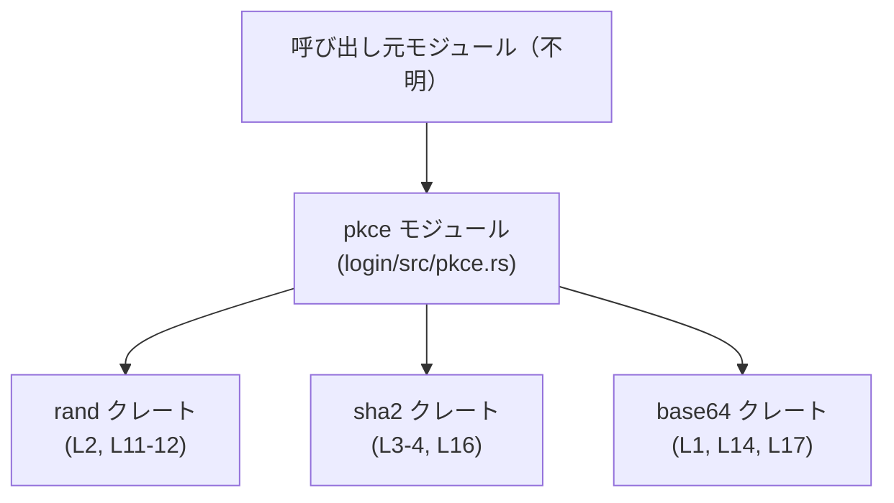
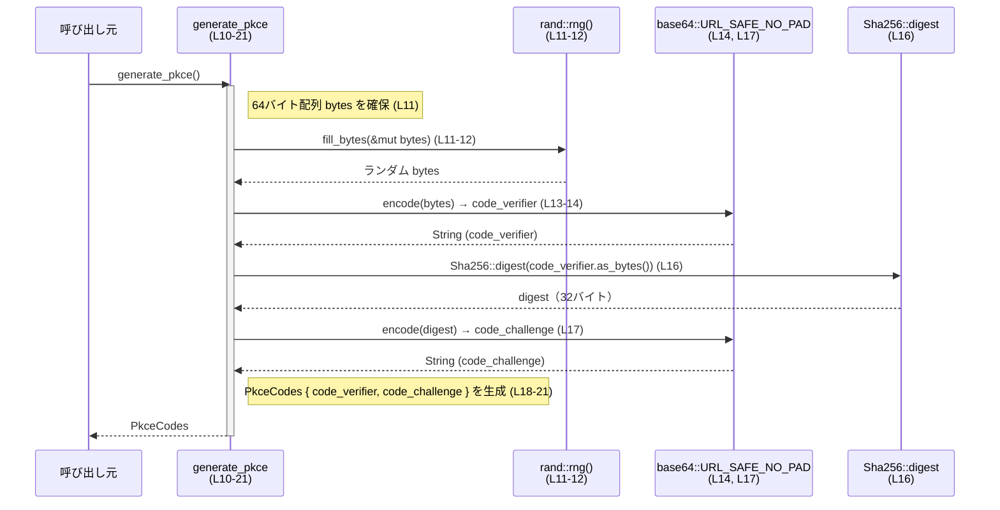

# login/src/pkce.rs コード解説

## 0. ざっくり一言

OAuth2 / OIDC の PKCE（Proof Key for Code Exchange）で使用する **code_verifier / code_challenge のペアを生成するユーティリティ**です（`PkceCodes` と `generate_pkce` を公開）（根拠: `login/src/pkce.rs:L5-10`）。

---

## 1. このモジュールの役割

### 1.1 概要

このモジュールは、認可コードフローなどで利用される PKCE コードペアを生成するために存在し、次の機能を提供します。

- ランダムなバイト列から URL セーフな `code_verifier` を生成する（根拠: `login/src/pkce.rs:L11-14`）
- `code_verifier` の SHA-256 ハッシュを BASE64URL エンコードした `code_challenge` を生成する（根拠: `login/src/pkce.rs:L15-17`）
- 上記 2 つを `PkceCodes` 構造体でまとめて返す（根拠: `login/src/pkce.rs:L5-9, L18-21`）

### 1.2 アーキテクチャ内での位置づけ

このモジュールは以下の外部クレートに依存しています。

- 乱数生成のための `rand`（根拠: `login/src/pkce.rs:L2, L11-12`）
- ハッシュ計算のための `sha2`（根拠: `login/src/pkce.rs:L3-4, L16`）
- BASE64URL エンコードのための `base64`（根拠: `login/src/pkce.rs:L1, L14, L17`）

呼び出し元はこのチャンクには現れていないため、どのコンポーネントから呼ばれるかは不明です。



### 1.3 設計上のポイント

- **純粋なユーティリティ関数**  
  - 状態を持つ構造体やグローバル状態はなく、`generate_pkce` は入力なしで新しい `PkceCodes` を返すだけです（根拠: `login/src/pkce.rs:L10-22`）。
- **暗号学的処理の委譲**  
  - 乱数生成、ハッシュ計算、Base64 エンコードをすべて専用クレートに委譲しています（根拠: `login/src/pkce.rs:L1-4, L11-17`）。
- **エラーを表に出さない設計**  
  - 関数の戻り値は `PkceCodes` であり、`Result` や `Option` を使ったエラー表現は行っていません（根拠: `login/src/pkce.rs:L10`）。
- **デバッグ・複製しやすい値オブジェクト**  
  - `PkceCodes` は `Debug` と `Clone` を自動導出しており、ログ出力や複製が容易です（根拠: `login/src/pkce.rs:L5`）。

---

## 2. 主要な機能一覧

- PKCE コードペア生成: ランダムな `code_verifier` と、それに対応する `code_challenge` を生成して返す（根拠: `login/src/pkce.rs:L10-21`）。

---

## 3. 公開 API と詳細解説

### 3.1 型一覧（構造体・列挙体など）

このファイルで定義される公開構造体は 1 つです。

| 名前        | 種別   | 役割 / 用途                                                                 | フィールド                                      | 根拠 |
|-------------|--------|------------------------------------------------------------------------------|-------------------------------------------------|------|
| `PkceCodes` | 構造体 | PKCE の `code_verifier` と `code_challenge` をまとめて保持する値オブジェクト | `code_verifier: String`, `code_challenge: String` | `login/src/pkce.rs:L5-9` |

補足:

- `#[derive(Debug, Clone)]` により、`Debug` と `Clone` トレイトを実装しています（根拠: `login/src/pkce.rs:L5`）。
  - `Debug`: `{:?}` 形式で中身をログ等に出力可能になります。
  - `Clone`: `clone()` で `PkceCodes` の複製が可能になります。

### 3.2 関数詳細

このファイルの公開関数は 1 つです。

#### `generate_pkce() -> PkceCodes`

**概要**

- 新しい PKCE コードペア（`code_verifier` と `code_challenge`）を生成して返します（根拠: `login/src/pkce.rs:L10-21`）。

**引数**

- 引数はありません（根拠: `login/src/pkce.rs:L10`）。

**戻り値**

- `PkceCodes`  
  - フィールド:
    - `code_verifier`: ランダム 64 バイトを URL セーフな Base64（パディングなし）でエンコードした文字列（根拠: `login/src/pkce.rs:L11-14`）。
    - `code_challenge`: `code_verifier` の SHA-256 ハッシュを URL セーフな Base64（パディングなし）でエンコードした文字列（根拠: `login/src/pkce.rs:L15-17`）。

**内部処理の流れ（アルゴリズム）**

1. 64 バイト固定長のバッファ `bytes` を確保する。初期値は 0 で埋められる（根拠: `login/src/pkce.rs:L11`）。
2. `rand::rng()` から得られる乱数生成器で `bytes` をランダム値で埋める（根拠: `login/src/pkce.rs:L2, L11-12`）。
3. `bytes` を URL セーフ・パディングなしの Base64 形式でエンコードし、`code_verifier` を得る（根拠: `login/src/pkce.rs:L1, L13-14`）。
   - コメントから、「PKCE の Verifier は URL-safe Base64 でパディングなし、長さは 43〜128 文字」と意図されていることが読めます（根拠: `login/src/pkce.rs:L13`）。
4. `code_verifier` を UTF-8 バイト列に変換し（`as_bytes()`）、SHA-256 でハッシュを計算して `digest` を得る（根拠: `login/src/pkce.rs:L3-4, L16`）。
5. `digest` を URL セーフ・パディングなし Base64 でエンコードし、`code_challenge` を得る（根拠: `login/src/pkce.rs:L17`）。
6. 上記 2 つの文字列をフィールドにもつ `PkceCodes` インスタンスを生成して返す（根拠: `login/src/pkce.rs:L5-9, L18-21`）。

**Examples（使用例）**

このファイルがクレートルート直下の `src/pkce.rs` であるため、モジュール名は `crate::pkce` になります（Rust のモジュール規則より）。その前提での使用例です。

```rust
// main.rs など、同一クレート内からの利用例

mod pkce; // `src/pkce.rs` をモジュールとして登録している場合

use crate::pkce::{generate_pkce, PkceCodes}; // PkceCodes 型と関数をインポート

fn main() {
    // 新しい PKCE コードペアを生成する
    let pkce_codes: PkceCodes = generate_pkce();

    // 認可リクエストで code_challenge を送信する
    println!("code_challenge={}", pkce_codes.code_challenge);

    // トークン取得時など、後で code_verifier を利用する
    println!("code_verifier（クライアント側で保持）={}", pkce_codes.code_verifier);
}
```

**Errors / Panics**

- この関数はシグネチャ上はエラーを返さず、常に `PkceCodes` を返す設計です（`Result` や `Option` ではない）（根拠: `login/src/pkce.rs:L10`）。
- 内部で呼び出している以下の処理に依存したパニック可能性がありますが、このファイルだけでは起こりうる条件は分かりません。
  - `rand::rng().fill_bytes(&mut bytes)`（根拠: `login/src/pkce.rs:L11-12`）
  - `URL_SAFE_NO_PAD.encode(...)`（根拠: `login/src/pkce.rs:L14, L17`）
  - `Sha256::digest(...)`（根拠: `login/src/pkce.rs:L16`）
- このモジュール内で明示的に `panic!` を呼び出している箇所はありません（根拠: `login/src/pkce.rs:L1-22` 全体）。

**Edge cases（エッジケース）**

コードには条件分岐や入力パラメータがないため、典型的な「入力に関するエッジケース」はありませんが、以下の点が挙げられます。

- **乱数生成器の状態異常**  
  - `rand::rng()` が内部的に失敗した場合の挙動はこのコードからは分かりません（根拠: `login/src/pkce.rs:L11-12`）。
- **Base64 エンコードの結果長**  
  - 64 バイトを Base64（パディングなし）でエンコードすると、出力は 86 文字になります（一般的な Base64 の仕様と `bytes` の長さからの計算）。
  - コメントが示す 43〜128 文字の範囲内に収まります（根拠: `login/src/pkce.rs:L11, L13-14`）。
- **`code_verifier` の文字集合**  
  - URL セーフ Base64 を利用しているため、`code_verifier` に使用される文字は `A-Z`, `a-z`, `0-9`, `-`, `_` に限定されます（一般的な BASE64URL の仕様と `URL_SAFE_NO_PAD` 使用からの推論。根拠: `login/src/pkce.rs:L1, L14`）。
- **`code_challenge` と `code_verifier` の対応**  
  - `code_challenge` は `code_verifier` から SHA-256 を取った値であり、`code_verifier` を変えると `code_challenge` も変わる関係になっています（根拠: `login/src/pkce.rs:L15-17`）。

**使用上の注意点**

- **秘密情報の扱い**  
  - 一般的に PKCE の `code_verifier` は秘密として扱う必要がありますが、本構造体は `Debug` を実装しているため、`{:?}` でログ出力すると `code_verifier` も含めて表示される点に注意が必要です（根拠: `login/src/pkce.rs:L5-9`）。
- **再利用**  
  - `generate_pkce` は都度新しいランダム値を生成するため、PKCE の利用上は「1 認可リクエストにつき 1 回」程度の利用が想定されますが、その制約自体はコードからは強制されていません。
- **スレッド安全性**  
  - この関数自体は引数もグローバル状態も持たない純粋関数ですが、内部で利用する `rand::rng()` のスレッド安全性は `rand` クレートの実装に依存し、このファイルだけからは判断できません（根拠: `login/src/pkce.rs:L2, L11-12`）。
- **性能**  
  - 単一の SHA-256 計算と Base64 エンコード 2 回、乱数の 64 バイト生成なので、1 回の呼び出しコストは小さい部類です。大量に連続呼び出しする場合の性能特性は、`rand` と `sha2` の実装に依存します。

### 3.3 その他の関数

このファイル内に他の関数は定義されていません（根拠: `login/src/pkce.rs:L1-22` 全体）。

---

## 4. データフロー

`generate_pkce` が呼び出されたときの代表的なデータフローを示します。

1. 呼び出し元が `generate_pkce()` を呼ぶ。
2. 関数内部で乱数バイト列が生成される。
3. 乱数バイト列から `code_verifier` が生成される。
4. `code_verifier` からハッシュを計算し `code_challenge` が生成される。
5. 2 つの値を含む `PkceCodes` が呼び出し元へ返る。



---

## 5. 使い方（How to Use）

### 5.1 基本的な使用方法

典型的には、認可リクエスト前に `generate_pkce` を呼び出してコードペアを生成し、`code_challenge` をサーバに送信、`code_verifier` をクライアント側に保持しておきます。

```rust
mod pkce;

use crate::pkce::generate_pkce; // generate_pkce 関数をインポート

fn main() {
    // PKCE コードペアを生成
    let pkce = generate_pkce();

    // 認可リクエストに code_challenge を付与する想定
    let auth_url = format!(
        "https://example.com/authorize?response_type=code&code_challenge={}&code_challenge_method=S256",
        pkce.code_challenge,
    );

    println!("認可URL: {}", auth_url);

    // code_verifier は後続のトークンエンドポイントへのリクエストまで保持する
    // （セキュアストレージなどに保存することが多い）
    // ここでは例として標準出力に表示している
    println!("保持する code_verifier: {}", pkce.code_verifier);
}
```

### 5.2 よくある使用パターン

1. **シングルスレッド・同期処理内での利用**

   - 必要なタイミングで `generate_pkce()` を呼び、結果を構造体として扱います。

   ```rust
   let pkce = crate::pkce::generate_pkce();      // L10-21 の処理を実行
   let verifier = pkce.code_verifier;            // Verifier を取り出す
   let challenge = pkce.code_challenge;          // Challenge を取り出す
   ```

2. **非同期処理内での利用**

   - 関数自体は同期的なので、`async fn` の中でもそのまま呼び出せます。

   ```rust
   async fn prepare_auth() {
       let pkce = crate::pkce::generate_pkce();  // 非同期コンテキストでも問題なく呼べる
       // ここで HTTP クライアントを使って認可リクエストを送るなどの処理を行う
   }
   ```

### 5.3 よくある間違い（推測される誤用例）

コードから想定される誤用と、その修正例です。

```rust
// 誤り例: code_verifier をログにそのまま出してしまう（秘密情報の漏洩になりうる）
let pkce = crate::pkce::generate_pkce();
println!("DEBUG: {:?}", pkce); // PkceCodes は Debug を実装しているため、両方のコードが出る（L5-9）

// よい例: 必要でない限り code_verifier をログに出さない
println!("DEBUG: code_challenge={}", pkce.code_challenge);
// どうしても verifier のログが必要な場合でも、マスキングするなど配慮する
```

### 5.4 使用上の注意点（まとめ）

- `PkceCodes` は `Debug` を実装しているため、意図せず秘密情報をログに出力しないよう運用で注意が必要です（根拠: `login/src/pkce.rs:L5-9`）。
- `generate_pkce` は毎回新しいランダム値を生成するため、同じ `code_verifier` / `code_challenge` の再計算は行いません（根拠: `login/src/pkce.rs:L11-17`）。
- 大量に連続して呼び出す場合、乱数生成やハッシュ計算のコストが積み重なりますが、このファイル単体から具体的な性能特性は分かりません。
- 並行・並列環境で複数スレッドから `generate_pkce` を呼ぶことは想定しやすいですが、`rand::rng()` のスレッド安全性は `rand` クレートに依存します。

---

## 6. 変更の仕方（How to Modify）

### 6.1 新しい機能を追加する場合

例として、「外部から `code_verifier` を受け取り、それに対応する `code_challenge` だけを計算する関数」を追加したい場合:

1. 同じファイル `login/src/pkce.rs` に新しい関数 `fn compute_challenge(verifier: &str) -> String` のような関数を追加するのが自然です。
2. 既存の `generate_pkce` の後半部分（`Sha256::digest` と Base64 エンコード）を参考にロジックを実装できます（根拠: `login/src/pkce.rs:L15-17`）。
3. 公開 API にする場合は `pub fn ...` とし、呼び出し元から直接利用できるようにします。

### 6.2 既存の機能を変更する場合

代表的な変更パターンと注意点です。

- **ランダムバイト長を変えたい場合**
  - `let mut bytes = [0u8; 64];` の配列長を変更します（根拠: `login/src/pkce.rs:L11`）。
  - 出力される `code_verifier` の長さも変わるため、PKCE 仕様の許容範囲（コメントで示されている 43〜128 文字）を外れないように注意します（根拠: `login/src/pkce.rs:L13-14`）。
- **ハッシュアルゴリズムを変えたい場合**
  - `Sha256::digest` 呼び出し部分を差し替えます（根拠: `login/src/pkce.rs:L16`）。
  - 仕様上、`S256` 以外を利用できるかどうかはプロトコルやサーバ側実装に依存し、このファイルだけでは判断できません。
- **エラー処理を追加したい場合**
  - 現在 `generate_pkce` は `Result` を返さないため、内部エラーを検出・伝播したい場合はシグネチャを `pub fn generate_pkce() -> Result<PkceCodes, E>` のように変更する必要があります（根拠: `login/src/pkce.rs:L10`）。
  - 既存の呼び出し側すべてに対する影響が大きいため、呼び出し箇所の確認が必要です。このチャンクには呼び出し側コードが現れないため、影響範囲は不明です。

---

## 7. 関連ファイル

このチャンクには他ファイルへの直接の参照（`mod` や `use crate::...` など）は存在しないため、関連ファイルは推測に頼ることになります。

| パス        | 役割 / 関係 |
|------------|------------|
| （不明）   | 呼び出し元モジュールやテストコードは、このチャンクには現れません。`generate_pkce` を利用する側の実装は別ファイルにあると考えられますが、具体的なパスはコードからは分かりません。 |

---

### Bugs / Security（補足）

このモジュールから読み取れる、バグ・セキュリティに関するポイントを整理します。

- **Debug 出力による秘密情報露出の可能性**
  - `PkceCodes` が `Debug` を実装しているため、開発時のデバッグログなどで `{:?}` を用いると `code_verifier` もそのまま出力されます（根拠: `login/src/pkce.rs:L5-9`）。
- **RNG の強度**
  - 乱数の質（暗号学的安全性）は `rand::rng()` の挙動に依存し、このファイルからは保証レベルを判断できません（根拠: `login/src/pkce.rs:L2, L11-12`）。

### Contracts / Edge Cases（補足）

- コントラクト（暗黙の前提）
  - 呼び出し側は、返ってきた `code_verifier` を改変せず保存し、後で検証に使用することが前提です。
  - 関数は引数を取らず、呼び出し側の状態には依存しません（根拠: `login/src/pkce.rs:L10`）。
- テスト
  - このチャンクにはテストコードが含まれていません（`#[cfg(test)]` や `mod tests` が存在しない）（根拠: `login/src/pkce.rs:L1-22`）。

以上が、このファイル `login/src/pkce.rs` に基づいて読み取れる情報の整理になります。
