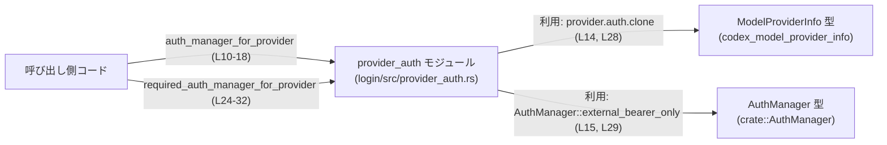
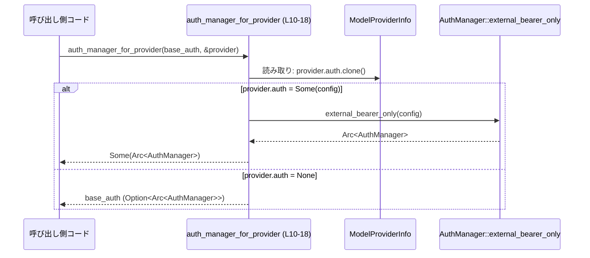

# login/src/provider_auth.rs コード解説

## 0. ざっくり一言

このモジュールは、**モデルプロバイダごとの認証設定 (`ModelProviderInfo`) に基づいて、使用すべき `AuthManager` を選択する小さなユーティリティ関数**を提供しています（`auth_manager_for_provider` / `required_auth_manager_for_provider`、根拠: `provider_auth.rs:L10-18, L24-32`）。

---

## 1. このモジュールの役割

### 1.1 概要

- このモジュールは、**モデルプロバイダ固有の認証設定が存在するかどうか**を判定し、それに応じて
  - プロバイダ専用の bearer-only な `AuthManager` を生成するか
  - 呼び出し側から渡された既存の `AuthManager` をそのまま再利用するか  
  を切り替える役割を持ちます（根拠: `provider_auth.rs:L7-18, L20-32`）。
- 認証状態を持つわけではなく、**純粋関数的なヘルパー**として動作します。

### 1.2 アーキテクチャ内での位置づけ

このモジュールは、他のコードから呼び出されて **「どの `AuthManager` を使うべきか」だけを決定する層**に位置づけられます。

使用している外部コンポーネントは以下です（根拠: `provider_auth.rs:L1-5`）。

- `std::sync::Arc`（共有参照カウント付きスマートポインタ）
- `codex_model_provider_info::ModelProviderInfo`（プロバイダ情報）
- `crate::AuthManager`（認証管理を行う型。詳細はこのチャンクには現れません）

依存関係を簡略図で示すと次のようになります。



> `AuthManager::external_bearer_only` の実装や、`ModelProviderInfo` / `AuthManager` の定義場所・中身は、このチャンクには現れません。

### 1.3 設計上のポイント

- **完全にステートレス**  
  - グローバル状態や内部キャッシュは持たず、引数だけから戻り値を決定します（根拠: 関数内にフィールド・静的変数なし `provider_auth.rs:L10-18, L24-32`）。
- **所有権・並行性への配慮**  
  - 認証マネージャは `Arc<AuthManager>` / `Option<Arc<AuthManager>>` で受け取り・返却しており、**複数スレッドから共有される前提に向いた設計**になっています（根拠: 関数シグネチャ `provider_auth.rs:L10-13, L24-27`）。
- **設定優先ロジック**  
  - `provider.auth` が `Some` のときは必ず `AuthManager::external_bearer_only` を使い、呼び出し元の `AuthManager` を無視します（根拠: `provider_auth.rs:L14-16, L28-30`）。
  - `provider.auth` が `None` のときは、渡された `AuthManager` をそのまま返します（根拠: `provider_auth.rs:L16, L30`）。

---

## 2. 主要な機能一覧

- `auth_manager_for_provider`: プロバイダ固有の認証設定があれば、それに対応した `AuthManager` を返し、なければ呼び出し元の `AuthManager`（`Option`）をそのまま返します（根拠: `provider_auth.rs:L10-18`）。
- `required_auth_manager_for_provider`: 「常に認証が必要なパス」向けに、プロバイダ固有の設定があればその `AuthManager` を、なければ呼び出し元の `AuthManager` を返します（根拠: `provider_auth.rs:L24-32`）。

### 2.1 コンポーネント一覧（関数・型インベントリー）

このチャンクに現れる関数・型の一覧です。

| 種別 | 名前 | 公開性 | シグネチャ / 型 | 役割 / 用途 | 根拠 |
|------|------|--------|-----------------|------------|------|
| 関数 | `auth_manager_for_provider` | `pub` | `fn auth_manager_for_provider(auth_manager: Option<Arc<AuthManager>>, provider: &ModelProviderInfo) -> Option<Arc<AuthManager>>` | プロバイダごとの認証設定に応じて `Option<Arc<AuthManager>>` を選択する | `provider_auth.rs:L10-18` |
| 関数 | `required_auth_manager_for_provider` | `pub` | `fn required_auth_manager_for_provider(auth_manager: Arc<AuthManager>, provider: &ModelProviderInfo) -> Arc<AuthManager>` | 認証必須パス向けに、プロバイダごとの `Arc<AuthManager>` を選択する | `provider_auth.rs:L24-32` |
| 型（利用のみ） | `AuthManager` | 不明（このファイルには定義なし） | `crate::AuthManager` | 認証処理を担うコンポーネント。`Arc` で共有され、`external_bearer_only` 関数を持つことだけが分かる | `provider_auth.rs:L5, L15, L29` |
| 型（利用のみ） | `ModelProviderInfo` | 不明（このファイルには定義なし） | `codex_model_provider_info::ModelProviderInfo` | モデルプロバイダの情報。`auth` フィールドを持ち、それが `Option` であることが分かる | `provider_auth.rs:L3, L14, L28` |
| 型（利用のみ） | `Arc` | 構造体（標準ライブラリ） | `std::sync::Arc<T>` | スレッド安全な参照カウント付きスマートポインタ。`AuthManager` の共有に使用 | `provider_auth.rs:L1, L11, L25` |

※ `AuthManager` / `ModelProviderInfo` の具体的な中身やフィールド構成は、このチャンクには現れません。

---

## 3. 公開 API と詳細解説

### 3.1 型一覧（構造体・列挙体など）

このファイル内で新たに定義される型はありません。  
ただし、外部で定義された以下の型が公開 API の一部として現れます。

| 名前 | 種別 | 定義元 | 役割 / 用途 | 根拠 |
|------|------|--------|------------|------|
| `AuthManager` | 不明（構造体/列挙体/トレイトなどはこのチャンクには現れません） | `crate::AuthManager` | 認証処理を行うコンポーネント。`Arc<AuthManager>` として共有される | `provider_auth.rs:L5, L11, L15, L25, L29` |
| `ModelProviderInfo` | 不明 | `codex_model_provider_info::ModelProviderInfo` | 各モデルプロバイダの設定情報。`auth` という `Option` フィールドを持つ | `provider_auth.rs:L3, L12, L14, L26, L28` |

### 3.2 関数詳細

#### `auth_manager_for_provider(auth_manager: Option<Arc<AuthManager>>, provider: &ModelProviderInfo) -> Option<Arc<AuthManager>>`

**概要**

- プロバイダに「コマンド駆動の認証設定」がある場合、**その設定を使った bearer-only な `AuthManager` を新たに生成して返す**関数です。
- プロバイダにカスタム認証設定がない場合は、**呼び出し元が渡した `auth_manager` をそのまま返します**（根拠: `provider_auth.rs:L14-17`）。

**根拠**

- 関数定義と本体のロジック: `provider_auth.rs:L10-18`。

**引数**

| 引数名 | 型 | 説明 |
|--------|----|------|
| `auth_manager` | `Option<Arc<AuthManager>>` | 呼び出し元が用意した「ベースとなる認証マネージャ」。`None` の場合は「もともと認証不要」などの意味が想定されますが、詳細はこのチャンクからは不明です。 |
| `provider` | `&ModelProviderInfo` | 対象となるモデルプロバイダの情報。`auth` フィールドに、プロバイダ固有の認証設定が格納されていることが分かります。 |

**戻り値**

- `Option<Arc<AuthManager>>`  
  - `Some(Arc<AuthManager>)`: 認証を行う場合のマネージャ。
    - プロバイダにカスタム認証がある場合は、新たに生成した bearer-only マネージャ。
    - ない場合は、引数で渡された `auth_manager`（`Some` のとき）。
  - `None`: 認証を行わないことを意味すると推測できますが、コメント・コードからは明示されていません（`auth_manager` が `None` かつ `provider.auth` も `None` の場合にのみ発生する、根拠: `provider_auth.rs:L14-17`）。

**内部処理の流れ（アルゴリズム）**

1. `provider.auth` を `clone` してローカル変数として取得します（根拠: `provider_auth.rs:L14`）。
2. `match` 式で `provider.auth` の値を分岐します（根拠: `provider_auth.rs:L14-17`）。
   - `Some(config)` の場合:
     1. `AuthManager::external_bearer_only(config)` を呼び出し、新しい `AuthManager` を生成します（根拠: `provider_auth.rs:L15`）。
     2. その結果を `Some(...)` で包んで返します。
   - `None` の場合:
     1. 引数 `auth_manager` をそのまま返します（根拠: `provider_auth.rs:L16`）。

**Examples（使用例）**

コンテキスト内で、ベースの `AuthManager`（`Option<Arc<_>>`）とプロバイダ情報が既にあるケースを想定した例です。

```rust
use std::sync::Arc;                                  // Arc を使用
use crate::AuthManager;                             // AuthManager 型
use codex_model_provider_info::ModelProviderInfo;   // プロバイダ情報
use crate::provider_auth::auth_manager_for_provider;

// 既にどこかで生成済みのベース認証マネージャ（定義はこのチャンクには現れません）
fn handle_provider(
    base_auth: Option<Arc<AuthManager>>,            // 呼び出し元が用意したベース認証
    provider: &ModelProviderInfo,                   // 対象プロバイダ
) {
    // プロバイダ固有の設定を加味した AuthManager を取得
    let auth = auth_manager_for_provider(base_auth, provider);

    // 以降、auth を使ってリクエストの認証などを行う想定
    if let Some(manager) = auth {
        // manager: Arc<AuthManager>
        // 認証付きでリクエスト処理を行う、など
    } else {
        // None の場合は認証なしのリクエスト処理を行う、など
    }
}
```

この例のように、**戻り値が `Option` であるため、そのまま `unwrap()` せず `match` や `if let` で分岐する必要があります。**

**Errors / Panics**

- この関数自身は `Result` を返さず、`?` 演算子も使っていないため、**明示的なエラーは返しません**（根拠: `provider_auth.rs:L10-18`）。
- `panic` を起こしうる可能性は、間接的には以下です。
  - `AuthManager::external_bearer_only(config)` が内部で `panic!` を呼ぶ場合（例えば不正な `config` の場合など）。ただし、これはこのチャンクには現れず、コード上の事実としては不明です（根拠: `provider_auth.rs:L15`）。
- `provider.auth.clone()` 自体は通常 `panic` しませんが、`clone` 実装に依存します。ここでは型が不明のため、詳細は不明です。

**Edge cases（エッジケース）**

- `auth_manager` が `None` かつ `provider.auth` も `None` の場合  
  - 戻り値は `None` になります（根拠: `provider_auth.rs:L14-17`）。
  - この場合、「認証不要」と解釈されることが多いですが、ここでは契約は明示されていません。
- `auth_manager` が `Some` で `provider.auth` が `None` の場合  
  - ベースの `auth_manager` がそのまま返されます（根拠: `provider_auth.rs:L16`）。
- `provider.auth` が重いオブジェクトである場合  
  - 毎回 `clone()` が行われるため、頻繁な呼び出しではコストになる可能性があります（根拠: `provider_auth.rs:L14`）。

**使用上の注意点**

- **Option を必ずハンドリングすること**  
  - 戻り値が `Option<Arc<AuthManager>>` なので、`None` の可能性を無視すると `unwrap()` などでパニックを起こす恐れがあります。
- **`AuthManager` の生成コストに注意**  
  - `provider.auth` が `Some` の場合、毎回 `AuthManager::external_bearer_only` が呼ばれ、新しいインスタンスが生成されると考えられます（根拠: `provider_auth.rs:L14-15`）。
  - 高頻度呼び出しがある場合、必要に応じてキャッシュ層などを別途検討する必要があるかもしれません（ただし本ファイルにはそのような仕組みはありません）。
- **並行性**  
  - `Arc<AuthManager>` を返すため、複数スレッドで同じ `AuthManager` を共有することが容易です。
  - この関数自体は単に値を返すだけで共有状態を持たないため、**スレッドセーフに再利用できます**。
  - ただし、`AuthManager` の内部がスレッドセーフかどうかは、このチャンクからは分かりません。

---

#### `required_auth_manager_for_provider(auth_manager: Arc<AuthManager>, provider: &ModelProviderInfo) -> Arc<AuthManager>`

**概要**

- 「このパスは必ず認証が必要」というケース向けに、**必ず `Arc<AuthManager>` を返す API** です。
- プロバイダがカスタム認証を持つ場合は、その設定に基づく bearer-only マネージャを返し、持たない場合は呼び出し元の `auth_manager` をそのまま返します（根拠: `provider_auth.rs:L28-30`）。

**根拠**

- 関数定義とロジック: `provider_auth.rs:L24-32`。

**引数**

| 引数名 | 型 | 説明 |
|--------|----|------|
| `auth_manager` | `Arc<AuthManager>` | 呼び出し元が用意した既定の認証マネージャ。必ず認証が必要な経路に対して使用されることを想定。 |
| `provider` | `&ModelProviderInfo` | 対象となるモデルプロバイダ情報。`auth` フィールドを持つ。 |

**戻り値**

- `Arc<AuthManager>`  
  - プロバイダ固有の認証設定 (`provider.auth`) が `Some` の場合: その設定に基づき `AuthManager::external_bearer_only(config)` で生成されたマネージャ（根拠: `provider_auth.rs:L28-29`）。
  - `None` の場合: 引数で渡された `auth_manager`（根拠: `provider_auth.rs:L30`）。

**内部処理の流れ（アルゴリズム）**

1. `provider.auth` を `clone()` で取得します（根拠: `provider_auth.rs:L28`）。
2. `match` 式で `Some` / `None` を分岐します（根拠: `provider_auth.rs:L28-30`）。
   - `Some(config)` の場合:
     - `AuthManager::external_bearer_only(config)` の結果をそのまま返します（根拠: `provider_auth.rs:L29`）。
   - `None` の場合:
     - 引数の `auth_manager` をそのまま返します（根拠: `provider_auth.rs:L30`）。

**Examples（使用例）**

認証が必須な API エンドポイントで、プロバイダごとに適切な `AuthManager` を取得する例です。

```rust
use std::sync::Arc;
use crate::AuthManager;
use codex_model_provider_info::ModelProviderInfo;
use crate::provider_auth::required_auth_manager_for_provider;

fn handle_secure_endpoint(
    base_auth: Arc<AuthManager>,                  // すべてのリクエストで使えるベース認証
    provider: &ModelProviderInfo,                 // 対象プロバイダ
) {
    // このエンドポイントは必ず認証が必要なので、Option ではなく Arc を直接取得
    let auth = required_auth_manager_for_provider(Arc::clone(&base_auth), provider);

    // auth: Arc<AuthManager>
    // ここで auth を使ってリクエストに対する認可・トークン付与などを行う想定
}
```

**Errors / Panics**

- この関数も `Result` を返さず、例外的なエラー処理は行っていません（根拠: `provider_auth.rs:L24-32`）。
- 可能な `panic` の要因は、前関数と同様、`AuthManager::external_bearer_only` の実装に依存します（根拠: `provider_auth.rs:L29`）。

**Edge cases（エッジケース）**

- `provider.auth` が `None` の場合  
  - ベースの `auth_manager` がそのまま返されます（根拠: `provider_auth.rs:L30`）。
- `provider.auth` が常に `Some` になるようなプロバイダ  
  - 実質的に、常に新しい bearer-only マネージャが生成される挙動となります（根拠: `provider_auth.rs:L28-29`）。
- `auth_manager` に高価な初期化が含まれていても  
  - `provider.auth` が `Some` の場合には、その `auth_manager` は無視される点に注意が必要です。

**使用上の注意点**

- **必ず認証を要求する API 用**  
  - 戻り値が `Arc<AuthManager>` 固定であるため、「認証があることが前提」のコードで使用しやすくなっています。
- **`AuthManager` の再利用か新規生成かを理解しておくこと**  
  - プロバイダにカスタム設定がある場合、呼び出し側が渡した `auth_manager` は全く使われず、新しい `AuthManager` が返ります。
  - これにより、「常に同じベース認証で処理される」と思い込むと、実際にはプロバイダごとの設定で上書きされている、という認識のズレが生じる可能性があります。
- **並行性**  
  - この関数もステートレスなので、複数スレッドから同時に呼び出しても、関数自身の観点では問題ありません。

### 3.3 その他の関数

- このファイルには、上記 2 関数以外の補助関数やラッパ関数は定義されていません（根拠: `provider_auth.rs` 全体）。

---

## 4. データフロー

ここでは、`auth_manager_for_provider` を使って「プロバイダ固有の認証マネージャ」を決定する処理フローを例示します。

1. 呼び出し側が、ベースの `Option<Arc<AuthManager>>` と `&ModelProviderInfo` を用意します。
2. `auth_manager_for_provider (L10-18)` を呼ぶと、関数内で `provider.auth.clone()` により設定の有無が確認されます。
3. `provider.auth` が `Some(config)` なら `AuthManager::external_bearer_only(config)` で新しいマネージャが生成され、`Some(...)` として返ります。
4. `provider.auth` が `None` なら、引数 `auth_manager` がそのまま返されます。



`required_auth_manager_for_provider (L24-32)` も、`Option` がないことを除けば同様のデータフローで、必ず `Arc<AuthManager>` を返す点だけが異なります。

---

## 5. 使い方（How to Use）

### 5.1 基本的な使用方法

典型的なフローは、「ベース認証マネージャ + プロバイダ情報」から、プロバイダ固有の `AuthManager` を決めるという形です。

```rust
use std::sync::Arc;
use crate::AuthManager;
use codex_model_provider_info::ModelProviderInfo;
use crate::provider_auth::{
    auth_manager_for_provider,
    required_auth_manager_for_provider,
};

// あるリクエスト処理関数の例
fn handle_request(
    base_auth_optional: Option<Arc<AuthManager>>,   // 認証が任意な経路用
    base_auth_required: Arc<AuthManager>,           // 認証必須な経路用
    provider: &ModelProviderInfo,                   // 対象プロバイダ
    path_requires_auth: bool,                       // このリクエストパスが認証必須かどうか
) {
    // プロバイダ固有の認証マネージャ（Option）
    let provider_auth_opt =
        auth_manager_for_provider(base_auth_optional, provider);

    if path_requires_auth {
        // 認証が必須なパスの場合、必ず Arc<AuthManager> が必要
        let base_for_required = Arc::clone(&base_auth_required);

        let auth = required_auth_manager_for_provider(base_for_required, provider);
        // auth: Arc<AuthManager>
        // ここで auth を使ってトークン付与・検証などを行う
    } else {
        // 認証が任意/不要なパスの場合
        match provider_auth_opt {
            Some(auth) => {
                // 認証付きでの処理
            }
            None => {
                // 認証なしでの処理
            }
        }
    }
}
```

### 5.2 よくある使用パターン

- **認証必須パス vs 任意パスの切り分け**
  - 任意パスには `auth_manager_for_provider`（`Option<Arc<_>>` 戻り値）
  - 必須パスには `required_auth_manager_for_provider`（`Arc<_>` 戻り値）
- **共通ベース認証 + プロバイダ上書き**
  - グローバルな `AuthManager` を 1 つだけ用意しておき、プロバイダごとの `provider.auth` が `Some` の場合だけ `external_bearer_only` で上書きする、という使い方が想定されます（根拠: 関数コメント `provider_auth.rs:L7-9, L20-23`）。

### 5.3 よくある間違い

**誤り例: `auth_manager_for_provider` の戻り値を無条件に `unwrap()` する**

```rust
// 誤り例
let auth = auth_manager_for_provider(base_auth_optional, provider);
let manager = auth.unwrap();          // provider.auth と base_auth_optional が両方 None のとき panic!
```

**正しい例: `Option` を安全にハンドリングする**

```rust
let auth = auth_manager_for_provider(base_auth_optional, provider);

if let Some(manager) = auth {
    // manager: Arc<AuthManager>
    // 認証付き処理
} else {
    // 認証なし処理
}
```

**誤り例: 「必ず認証が必要なはず」のコードで `auth_manager_for_provider` を使う**

```rust
// 誤り例: 認証必須なのに Option 戻り値の関数を使っている
let auth = auth_manager_for_provider(Some(base_auth), provider);
// ここで None の可能性を見落とすと、認証なしで処理を進めてしまうリスクがある
```

**正しい例: 認証必須パスでは `required_auth_manager_for_provider` を使う**

```rust
let auth = required_auth_manager_for_provider(base_auth, provider);
// auth は Arc<AuthManager> なので、必ず何らかの認証マネージャが得られる
```

### 5.4 使用上の注意点（まとめ）

- `auth_manager_for_provider` は **Option** を返すため、必ず `None` を考慮する必要があります。
- `required_auth_manager_for_provider` は常に `Arc<AuthManager>` を返すため、**「必ず認証が必要」という前提のコードパスだけ**で使うと分かりやすくなります。
- どちらの関数も、`provider.auth` が `Some` の場合には **ベースの `AuthManager` を無視して新しいマネージャを生成する**点に注意が必要です（根拠: `provider_auth.rs:L14-16, L28-30`）。
- 並行性の観点では、`Arc<AuthManager>` をそのまま返すだけなので、このモジュール自体はスレッドセーフに利用できます。

---

## 6. 変更の仕方（How to Modify）

### 6.1 新しい機能を追加する場合

たとえば「プロバイダの認証設定の種類に応じて、異なる種類の `AuthManager` を返したい」といった機能を追加する場合の一般的な手順です。

1. **`ModelProviderInfo` 側の拡張を確認**  
   - `provider.auth` の型（列挙体のバリアントなど）が増えた場合、その仕様を確認します。  
     ※ 具体的な型はこのチャンクには現れません。
2. **`match provider.auth.clone()` の分岐を拡張**  
   - 現在は `Some(config)` / `None` の 2 パターンのみですが、必要に応じて `Some` 内の情報でさらに分岐を行う処理を追加します（根拠: `provider_auth.rs:L14-17, L28-30`）。
3. **`AuthManager` の生成 API を追加・利用**  
   - `AuthManager::external_bearer_only` 以外の生成関数が用意されている場合、それを呼び出す分岐を追加します。
4. **呼び出し元コードの契約確認**  
   - 戻り値の型（`Option<Arc<AuthManager>>` / `Arc<AuthManager>`）は変えずに動作だけ変えるか、型も変えるかを検討し、呼び出し側の影響範囲を確認します。

### 6.2 既存の機能を変更する場合

- **認証なし (`None`) の扱いを変える場合**
  - `auth_manager_for_provider` の `None` 戻り値の意味合いを変更する場合は、`None` が戻る条件（`auth_manager` が `None` かつ `provider.auth` も `None`）と、それを前提としている呼び出し側のロジックを確認する必要があります。
- **カスタム認証優先ロジックの変更**
  - 現在は `provider.auth` が `Some` の場合、ベースの `auth_manager` を完全に無視しています。  
    「ベース認証 + 追加ヘッダ」のように合成したい場合は、`AuthManager::external_bearer_only` の代わりに、ベース `auth_manager` を引数に取る別の API を導入する必要があるかもしれません。
- **テスト・使用箇所の再確認**
  - このモジュールの公開 API（2 関数）はシンプルなため、変更時には「どのパスでどちらの関数が使われているか」を追い、**認証が抜け落ちないか / 過剰に要求されないか**を重点的に確認するのが実務上重要です。

---

## 7. 関連ファイル

このモジュールと密接に関係する外部コンポーネントをまとめます。

| パス / 識別子 | 役割 / 関係 |
|---------------|------------|
| `login/src/provider_auth.rs` | 本ファイル。プロバイダ別に `AuthManager` を選択するユーティリティ関数を提供する。 |
| `crate::AuthManager` | 認証処理を担う型。`external_bearer_only` 関数を通して本モジュールから利用される（定義場所はこのチャンクには現れません）。 |
| `codex_model_provider_info::ModelProviderInfo` | モデルプロバイダ情報。`auth` フィールドを通じて、プロバイダ固有の認証設定を提供する。 |
| `std::sync::Arc` | スレッドセーフな参照カウント付きポインタ。`AuthManager` の共有管理に使用される。 |

### Bugs / Security / Contracts まとめ（このファイルに関して）

- **バグらしき挙動**は、このチャンクからは特定できません。
- **セキュリティ上のポイント**
  - `auth_manager_for_provider` が `None` を返せるため、「本来認証が必要な場面で `None` を許してしまっていないか」は、呼び出し側の契約として注意が必要です。
  - `required_auth_manager_for_provider` を使うことで、「認証必須パスで `None` が混入する」ことを防ぐ設計になっていると解釈できます（根拠: 関数コメント `provider_auth.rs:L20-23`）。
- **Contracts / Edge Cases**
  - `provider.auth` の `Some` / `None` と、ベースの `auth_manager` の有無の組み合わせが、戻り値の契約に直接影響します。
  - この契約は明示的なドキュメントにはなっていないため、利用側での合意・テストが重要です。
- **Tests / Observability**
  - このファイルにはテストコードやログ出力は含まれていません（根拠: `provider_auth.rs` 全体）。
  - 振る舞いを検証するには、別途テストモジュールや上位レイヤでのログ出力が必要です。
