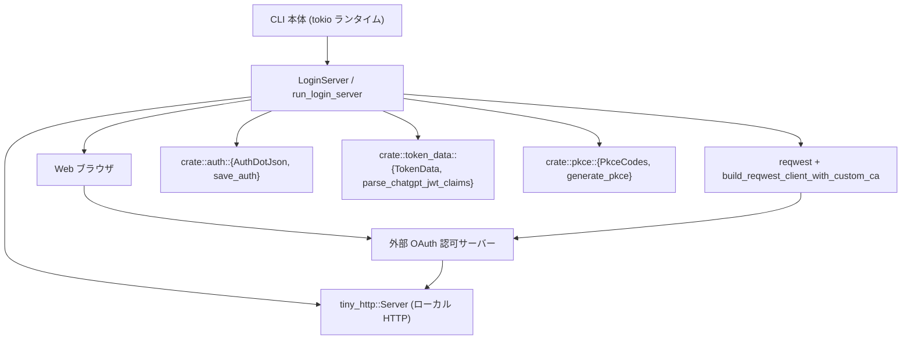
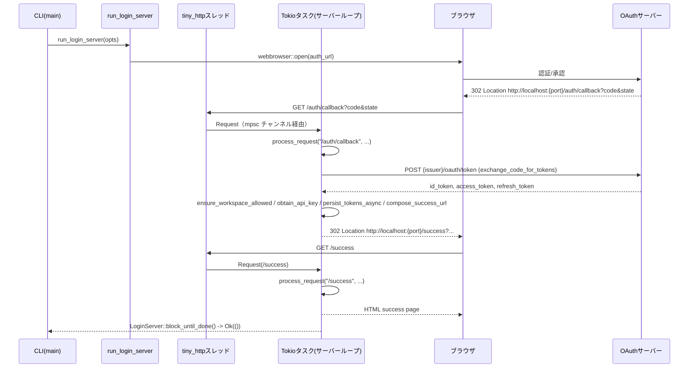

# login\src\server.rs

## 0. ざっくり一言

CLI の対話的ログイン時に使う「ローカルの OAuth コールバック HTTP サーバー」を起動し、  
ブラウザからの `/auth/callback` リクエストを受けてトークン交換・保存・リダイレクトを行うモジュールです。  
ログ出力では認証情報をマスクしつつ、CLI からは詳細なエラー情報を受け取れるように設計されています。

> 注: 提供されたコードには行番号情報が含まれていないため、以下では「server.rs 内の該当関数・型」として参照し、  
> 厳密な `L開始-終了` 行番号は付与していません。

---

## 1. このモジュールの役割

### 1.1 概要

このモジュールは、**CLI ログインのためのローカル OAuth コールバック フロー**を実現します。

- ループバックアドレス (`127.0.0.1`) に短命の HTTP サーバーを起動し、  
  ブラウザ→認証サーバー→ローカルサーバーの OAuth コールバックを受け取ります（`run_login_server`）。
- 受け取った `code` と PKCE コードを使ってトークンエンドポイントと通信し、ID/アクセストークン等を取得します（`exchange_code_for_tokens`）。
- 必要に応じて API キー交換（`obtain_api_key`）とローカル保存（`persist_tokens_async`）を行い、成功・失敗の HTML をレスポンスします。
- ログには URL やトークンをそのまま残さないよう、**URL の機微情報のマスキング**を行います。

### 1.2 アーキテクチャ内での位置づけ

このモジュールは CLI 内で以下のように位置づけられます（主要依存のみを示しています）。



- CLI 本体は `run_login_server` を呼び出し、`LoginServer` ハンドルを受け取ります。
- `LoginServer` 内部では `tiny_http::Server` をスレッドでラップし、Tokio の `mpsc::channel` 経由で非同期処理に橋渡しします。
- コールバック処理では `reqwest` 経由で OAuth サーバーと通信し、トークンを取得した後、`AuthDotJson` と `TokenData` を使ってローカルに保存します。

### 1.3 設計上のポイント

コードから読み取れる特徴を列挙します。

- **責務分割**
  - HTTP サーバー起動 & ライフサイクル: `run_login_server`, `LoginServer`, `ShutdownHandle`, `bind_server`, `send_cancel_request`
  - コールバックルーティング: `process_request`（パス別に `/auth/callback` `/success` `/cancel` を処理）
  - OAuth コアロジック: `build_authorize_url`, `exchange_code_for_tokens`, `obtain_api_key`, `compose_success_url`
  - トークン保存: `persist_tokens_async`
  - ログ・セキュリティ: URL/エラーのマスキング (`redact_sensitive_query_value`, `redact_sensitive_url_parts`, `redact_sensitive_error_url`, `sanitize_url_for_logging`)
  - エラー UI: `login_error_response`, `render_login_error_page`, `html_escape`
- **状態管理**
  - 長期状態を保持する構造体は `ServerOptions`（設定）と `LoginServer`（起動済サーバーのハンドル）のみです。
  - コールバック処理自体は基本的にステートレスで、必要な情報を引数で受け取ります。
- **エラーハンドリング**
  - 外向きの失敗は基本的に `io::Error` で表現されます（`run_login_server`, `exchange_code_for_tokens`, `persist_tokens_async`, `obtain_api_key` など）。
  - CLI/ブラウザ向けのメッセージと、構造化ログ向けの情報を分離し、  
    構造化ログには機微情報を含めず、ユーザーエラーには詳細メッセージを残します。
- **並行性**
  - `tiny_http::Server::recv()` はブロッキング呼び出しなので、専用スレッドで実行し、  
    その結果を `tokio::sync::mpsc::channel` で async ランタイムに橋渡ししています。
  - メインのコールバック処理ループは `tokio::spawn` されたタスク内で `tokio::select!` を使って
    - `shutdown_notify`（`ShutdownHandle` 経由）からのシャットダウン通知
    - `rx.recv()` による新規 HTTP リクエスト  
    を待ち合わせます。
- **接続クローズ制御**
  - tiny_http は `Connection` ヘッダをフィルタリングするため、`send_response_with_disconnect` で  
    直接 HTTP レスポンスを書き、`Connection: close` を追加して確実にソケットを閉じています。
- **セキュリティ**
  - PKCE (`PkceCodes`) と `state` パラメータを利用し、リダイレクトの正当性確認を行います。
  - ログや URL から `code`, `access_token`, `id_token`, `refresh_token` などをマスキングします。
  - 必要に応じて特定 Workspace へのログイン制限を行う `ensure_workspace_allowed` を提供します。

---

## 2. 主要な機能一覧

このモジュールが提供する主な機能です。

- ローカル OAuth コールバックサーバーの起動: `run_login_server`
- 起動済サーバーの制御:
  - 完了待ち: `LoginServer::block_until_done`
  - キャンセル: `LoginServer::cancel`, `LoginServer::cancel_handle`
- ポート競合時の既存サーバー停止: `bind_server` + `send_cancel_request`
- OAuth 認可 URL の組み立て: `build_authorize_url`
- ローカル HTTP リクエストのルーティングと処理: `process_request`
- 認可コード → トークン 交換: `exchange_code_for_tokens`
- ID トークン → API キー 交換: `obtain_api_key`
- トークン・API キーのローカル保存: `persist_tokens_async`
- ログ用の URL / エラーのマスキング:
  - `redact_sensitive_query_value`
  - `redact_sensitive_url_parts`
  - `redact_sensitive_error_url`
  - `sanitize_url_for_logging`
- 成功時リダイレクト URL の組み立て: `compose_success_url`
- JWT からの認証クレーム抽出: `jwt_auth_claims`
- Workspace 制限の検査: `ensure_workspace_allowed`
- 失敗時のエラーページ生成: `login_error_response`, `render_login_error_page`, `html_escape`
- トークンエンドポイントエラーのパース: `parse_token_endpoint_error`
- OAuth callback エラーメッセージの生成: `oauth_callback_error_message`

---

## 3. 公開 API と詳細解説

### 3.1 型一覧（構造体・列挙体など）

| 名前 | 種別 | 可視性 | 役割 / 用途 |
|------|------|--------|-------------|
| `ServerOptions` | 構造体 | `pub` | ローカルログインサーバーの起動設定。`codex_home`, `client_id`, `issuer`, `port` などを保持します。 |
| `LoginServer` | 構造体 | `pub` | 起動済みログインサーバーのハンドル。認可 URL と実ポート、非同期タスクの JoinHandle とシャットダウンハンドルを保持します。 |
| `ShutdownHandle` | 構造体 | `#[derive(Clone, Debug)]` / フィールドは非公開 | ログインサーバーループに終了を通知するためのハンドル。`tokio::sync::Notify` を内部に持ちます。 |
| `HandledRequest` | enum | モジュール内 private | `process_request` が返す結果種別。通常レスポンス・リダイレクト・レスポンス + ループ終了 を表現します。 |
| `ExchangedTokens` | 構造体 | `pub(crate)` | トークンエンドポイントから取得した `id_token`, `access_token`, `refresh_token` をまとめた型です。 |
| `TokenEndpointErrorDetail` | 構造体 | モジュール内 private | トークンエンドポイントエラーの解析結果（エラーコード・メッセージ・表示用メッセージ）を保持します。 |
| `Template` | 外部クレート | `LOGIN_ERROR_PAGE_TEMPLATE` に使用 | HTML テンプレートレンダリング用。`assets/error.html` をパースし、エラーページ生成に利用します。 |

### 3.2 関数詳細（主要 7 件）

#### `run_login_server(opts: ServerOptions) -> io::Result<LoginServer>`

**概要**

ローカル OAuth コールバックサーバーを起動し、ブラウザに開かせる認可 URL と、  
実際にバインドされたポートを含む `LoginServer` ハンドルを返します。

**引数**

| 引数名 | 型 | 説明 |
|--------|----|------|
| `opts` | `ServerOptions` | サーバーの設定。`port`, `issuer`, `client_id`, `codex_home`, `open_browser`, `force_state` 等を含みます。 |

**戻り値**

- `Ok(LoginServer)`:
  - `auth_url`: ブラウザで開く認可 URL
  - `actual_port`: 実際にバインドされたポート（ポート 0 を指定した場合の自動割り当てなどに利用）
  - `server_handle`: コールバック処理用 tokio タスク
  - `shutdown_handle`: シャットダウン通知ハンドル
- `Err(io::Error)`:
  - サーバーバインド失敗、チャネル送信失敗、その他内部エラー時

**内部処理の流れ**

1. PKCE コード生成: `generate_pkce()`。
2. CSRF 防止用の `state` を生成。`opts.force_state` が Some ならそれを使用、なければ `generate_state()` を呼び出します。
3. `bind_server(opts.port)` で `tiny_http::Server` を `127.0.0.1:port` にバインド。
4. 実ポートを `server.server_addr().to_ip()` から取得し、リダイレクト URI (`http://localhost:{actual_port}/auth/callback`) を構築。
5. `build_authorize_url` で認可 URL を生成。
6. `opts.open_browser` が `true` なら `webbrowser::open(&auth_url)` を呼び出し、ブラウザで開く（エラーは無視）。
7. `tiny_http::Server::recv()` をブロッキングで呼び続けるスレッドを `thread::spawn` で起動し、  
   取得した `Request` を `tokio::sync::mpsc::channel<Request>(16)` に `blocking_send` します。
8. `tokio::sync::Notify` を用意し、`tokio::spawn` した async タスク内で以下をループ:
   - `tokio::select!` で `shutdown_notify.notified()` または `rx.recv()` を待つ。
   - `rx.recv()` から `Request` を受け取ったら `process_request(...)` を `await`。
   - `HandledRequest` の種別に応じて:
     - `Response`: `req.respond(response)` を `spawn_blocking` 経由で実行。
     - `ResponseAndExit`: `send_response_with_disconnect` を呼び出し、`result` をループ終了値にする。
     - `RedirectWithHeader`: `302` レスポンスを返す。
9. ループ終了時に `server.unblock()` を呼び、`Server::recv()` をブロック解除してスレッド終了を促す。
10. 最終的な `io::Result<()>` をタスクの戻り値とし、`LoginServer` を返す。

**Examples（使用例）**

```rust
use login::server::{ServerOptions, run_login_server};

#[tokio::main]
async fn main() -> std::io::Result<()> {
    let opts = ServerOptions::new(
        std::path::PathBuf::from("/home/user/.codex"),  // 認証情報保存先ディレクトリ
        "my-client-id".to_string(),                     // OAuth クライアント ID
        None,                                           // workspace 制限なし
        codex_config::types::AuthCredentialsStoreMode::File, // 保存モード
    );

    // ログインサーバー起動
    let server = run_login_server(opts)?;

    println!("Open this URL if the browser did not open automatically:");
    println!("{}", server.auth_url);

    // ログイン完了 or キャンセルまで待つ
    match server.block_until_done().await {
        Ok(()) => println!("Login succeeded"),
        Err(e) => eprintln!("Login failed: {e}"),
    }

    Ok(())
}
```

**Errors / Panics**

- `bind_server` がポート競合や OS エラーで失敗した場合、`io::ErrorKind::AddrInUse` などで `Err` を返します。
- `server_handle` 内でタスクがパニックした場合、`LoginServer::block_until_done` で  
  `io::Error::other("login server thread panicked: ...")` が返ります。
- ブラウザ起動失敗 (`webbrowser::open`) は無視されます（サーバー自体は継続）。

**Edge cases（エッジケース）**

- `opts.port` が既に使われている場合:
  - `bind_server` 内で `/cancel` リクエストを送って既存サーバーに終了を依頼し、再試行します（詳細は `bind_server` を参照）。
- 何もコールバックが来ないまま `ShutdownHandle` でシャットダウンされた場合:
  - `LoginServer::block_until_done` は `"Login was not completed"` な `io::Error` を返します。

**使用上の注意点**

- 非同期タスク (`tokio::spawn`) を利用するため、**Tokio ランタイム上で呼び出す前提**です。
- CLI 実行中にユーザーがログインをキャンセルさせたい場合は、`LoginServer::cancel()` で通知します。
- サーバーは `127.0.0.1` のみにバインドされるため、外部ホストからはアクセスできません。

---

#### `process_request(...) -> HandledRequest`

```rust
async fn process_request(
    url_raw: &str,
    opts: &ServerOptions,
    redirect_uri: &str,
    pkce: &PkceCodes,
    actual_port: u16,
    state: &str,
) -> HandledRequest
```

**概要**

受け取った HTTP リクエスト（`tiny_http::Request` の `url()` 部分）をパースし、  
パスに応じて OAuth コールバック・成功ページ・キャンセル処理などを行います。

**引数**

| 引数名 | 型 | 説明 |
|--------|----|------|
| `url_raw` | `&str` | `Request::url()` の戻り値。パスとクエリのみ（スキーム・ホストなし）です。 |
| `opts` | `&ServerOptions` | サーバー設定。`issuer`, `client_id`, `codex_home`, workspace 制限などを利用します。 |
| `redirect_uri` | `&str` | 認可コード交換時に使用するリダイレクト URI。 |
| `pkce` | `&PkceCodes` | PKCE の code_verifier / code_challenge。 |
| `actual_port` | `u16` | ローカルサーバーの実ポート。`/success` リダイレクト URL 組み立てに使用します。 |
| `state` | `&str` | CSRF 防止用の state 値。コールバックの `state` と一致するか検証します。 |

**戻り値**

- `HandledRequest::Response(Response)`:
  - 単純なレスポンス（`/auth/callback` で状態不一致、エラーなど）。
- `HandledRequest::RedirectWithHeader(Header)`:
  - 成功時に `/success` へリダイレクトさせる 302 Location ヘッダ。
- `HandledRequest::ResponseAndExit { headers, body, result }`:
  - `/success` や `/cancel` のように、レスポンス返却後にサーバーループを終了させるケース。

**内部処理の流れ（主要パス）**

1. `url::Url::parse("http://localhost{url_raw}")` でフル URL に変換；失敗したら `400 Bad Request` を返す。
2. `parsed_url.path()` でルーティング:
   - `/auth/callback`:
     1. クエリパラメータを `HashMap<String, String>` に収集。
     2. `code`, `state`, `error` の有無と `state` 一致の有無をログに記録。
     3. `state` 不一致なら `400 "State mismatch"` を返す。
     4. `error` があれば、`oauth_callback_error_message` でユーザー向けメッセージを組み立て、  
        `login_error_response` でエラーページ（`ResponseAndExit`）を生成。
     5. `code` が存在しない・空なら `missing_authorization_code` としてエラーページ。
     6. `exchange_code_for_tokens` を呼んでトークンを取得。
     7. `ensure_workspace_allowed` で workspace 制限をチェック。
     8. `obtain_api_key` で API キーを取得（失敗しても API キーは `None` として続行）。
     9. `persist_tokens_async` でローカル保存（失敗した場合は `persist_failed` エラー）。
     10. `compose_success_url` を使い `/success?...` URL を生成し、`Location` ヘッダで `RedirectWithHeader` を返す。
   - `/success`:
     - `assets/success.html` の内容を `text/html` として返し、`Ok(())` を伴う `ResponseAndExit`。
   - `/cancel`:
     - `"Login cancelled"` というボディを返し、`io::ErrorKind::Interrupted` を伴う `ResponseAndExit`。
   - その他:
     - `404 Not Found` を返す。

**Errors / Panics**

- 関数自体は `HandledRequest` を返し、`panic!` は使用していません。
- ステート不一致・エラー応答・コード欠如・トークン交換/保存失敗などはすべて  
  `login_error_response` による HTML エラーページと `Err(io::Error)` に集約されます。

**Edge cases**

- URL パース失敗（`url_raw` が不正）の場合は単純に `"Bad Request"` 400。
- `/auth/callback` で `state` クエリが空または欠如している場合:
  - `state_valid == false` となり、"State mismatch" 400 が返ります。
- `exchange_code_for_tokens` が `Err` の場合:
  - `"Token exchange failed: ..."` を含むメッセージでエラーページを返します。
- Workspace 制限が有効 (`opts.forced_chatgpt_workspace_id` が Some) で ID トークンに `chatgpt_account_id` がない場合:
  - 「token did not include an chatgpt_account_id claim」とするエラーメッセージで失敗します。

**使用上の注意点**

- この関数は `run_login_server` 内部からのみ呼ばれる設計で、外部から直接使う前提にはなっていません。
- コールバックハンドラでは `eprintln!` と `tracing` ログの双方を使用しており、  
  CLI でユーザーに見せるログと構造化ログが分離されています。

---

#### `bind_server(port: u16) -> io::Result<Server>`

**概要**

`tiny_http::Server` を `127.0.0.1:{port}` にバインドする補助関数です。  
ポート競合時には既存のログインサーバーに `/cancel` リクエストを送り、一定回数リトライします。

**引数**

| 引数名 | 型 | 説明 |
|--------|----|------|
| `port` | `u16` | バインドしたいポート番号。 |

**戻り値**

- `Ok(Server)`:
  - バインドに成功した HTTP サーバーインスタンス。
- `Err(io::Error)`:
  - 連続した失敗または非 `AddrInUse` エラー。

**内部処理の流れ**

1. `bind_address = "127.0.0.1:{port}"` を作成。
2. 最大 `MAX_ATTEMPTS`（10 回）までループ:
   - `Server::http(&bind_address)` を試行。
   - 成功したら `Ok(server)` を返す。
   - 失敗時、`io::Error` で `AddrInUse` であるか判定。
     - `AddrInUse` の場合:
       - まだ `cancel_attempted == false` なら、一度だけ `send_cancel_request(port)` を呼び、既存サーバーに `/cancel` を送る。
       - `RETRY_DELAY`（200ms）スリープして再試行。
       - 試行回数が `MAX_ATTEMPTS` に達したら `AddrInUse` エラーを返す。
     - その他のエラーの場合:
       - `io::Error::other(err)` で即座に返す。

**Errors / Panics**

- すべて `io::Error` として返却され、`panic!` は利用されていません。
- `send_cancel_request` でのエラーは `eprintln!` に記録されますが、再試行自体は継続します。

**Edge cases**

- `/cancel` を受け取らない古いサーバーが残っている場合、10 回のリトライ後に `AddrInUse` で失敗します。
- `port` に 0 を渡した場合の挙動は tiny_http に依存します（このコードでは特別な扱いはしていません）。

**使用上の注意点**

- `run_login_server` 以外から直接使う場合、既存サーバー側で `/cancel` パスが実装されている前提が暗黙にあります（このファイルでは実装あり）。

---

#### `exchange_code_for_tokens(...) -> io::Result<ExchangedTokens>`

```rust
pub(crate) async fn exchange_code_for_tokens(
    issuer: &str,
    client_id: &str,
    redirect_uri: &str,
    pkce: &PkceCodes,
    code: &str,
) -> io::Result<ExchangedTokens>
```

**概要**

OAuth 認可コード (`code`) を用いて、トークンエンドポイント（`{issuer}/oauth/token`）と通信し、  
`id_token`, `access_token`, `refresh_token` を取得します。

**引数**

| 引数名 | 型 | 説明 |
|--------|----|------|
| `issuer` | `&str` | OAuth サーバーの発行者（例: `"https://auth.openai.com"`）。 |
| `client_id` | `&str` | OAuth クライアント ID。 |
| `redirect_uri` | `&str` | 認可時に使用したリダイレクト URI。 |
| `pkce` | `&PkceCodes` | PKCE コード (`code_verifier`/`code_challenge`)。ここでは `code_verifier` を送信。 |
| `code` | `&str` | 認可コード（`/auth/callback` で受け取る `code` クエリ）。 |

**戻り値**

- `Ok(ExchangedTokens)`:
  - `id_token`, `access_token`, `refresh_token` を含む。
- `Err(io::Error)`:
  - トランスポートエラー、非成功ステータス、JSON パース失敗など。

**内部処理の流れ**

1. `build_reqwest_client_with_custom_ca(reqwest::Client::builder())?` で `reqwest::Client` を生成。
2. 情報漏洩防止のため、`issuer` は `sanitize_url_for_logging` でマスクした値をログに出力。
3. `POST {issuer}/oauth/token` を送信:
   - `Content-Type: application/x-www-form-urlencoded`
   - ボディに `grant_type=authorization_code`, `code`, `redirect_uri`, `client_id`, `code_verifier` を URL エンコードして送信。
4. 送信・受信エラー時:
   - `redact_sensitive_error_url` で URL 内の機微情報をマスクした `reqwest::Error` を `error!(...)` ログに記録し、`io::Error::other(error)` を返す。
5. HTTP ステータスが成功 (`2xx`) でない場合:
   - `resp.text().await` でボディ文字列を取得。
   - `parse_token_endpoint_error` で `TokenEndpointErrorDetail` を生成。
   - `warn!` でステータス・エラーコード・エラーメッセージをログ出力。
   - `"token endpoint returned status {status}: {detail}"` という文字列で `io::Error::other` を返す。
6. ステータス成功の場合:
   - `resp.json::<TokenResponse>().await` で JSON をパースし、`ExchangedTokens` に詰めて `Ok` で返す。

**Errors / Panics**

- すべて `io::Error` として返却し、関数内での `panic!` はありません。
- トランスポートエラー・ステータスエラー・JSON パースエラーのすべてが `io::Error::other` 経由で表現されます。

**Edge cases**

- トークンエンドポイントが JSON 以外のレスポンスを返した場合:
  - `parse_token_endpoint_error` 内でプレーンテキストをそのまま `display_message` として扱い、CLI 側のエラーメッセージに使用します。
- `issuer` がログに出せない形の URL でも `sanitize_url_for_logging` が `<invalid-url>` を返すため、ログは安全です。

**使用上の注意点**

- ネットワーク I/O を伴うため、この関数を高頻度ループで呼び出すと全体のレスポンスが低下する可能性があります。
- API 設計的には `pub(crate)` で、このクレート内部からのみ利用されることを想定しています。

---

#### `persist_tokens_async(...) -> io::Result<()>`

```rust
pub(crate) async fn persist_tokens_async(
    codex_home: &Path,
    api_key: Option<String>,
    id_token: String,
    access_token: String,
    refresh_token: String,
    auth_credentials_store_mode: AuthCredentialsStoreMode,
) -> io::Result<()>
```

**概要**

取得したトークンと API キーをローカル認証ストアに保存します。  
同期処理 `save_auth` を `tokio::task::spawn_blocking` で同期スレッドにオフロードしています。

**引数**

| 引数名 | 型 | 説明 |
|--------|----|------|
| `codex_home` | `&Path` | 認証情報 (`auth.json` 等) を保存するベースディレクトリ。 |
| `api_key` | `Option<String>` | `obtain_api_key` で取得した API キー。失敗した場合は `None`。 |
| `id_token` | `String` | ID トークン（JWT）。 |
| `access_token` | `String` | OAuth アクセストークン。 |
| `refresh_token` | `String` | リフレッシュトークン。 |
| `auth_credentials_store_mode` | `AuthCredentialsStoreMode` | 認証情報保存方式（ファイル、OS キーチェーン等）。 |

**戻り値**

- `Ok(())`: 保存成功。
- `Err(io::Error)`: JWT パースエラー、`save_auth` 失敗、`spawn_blocking` タスクのジョイン失敗など。

**内部処理の流れ**

1. `codex_home` を `PathBuf` にクローンして所有権を移動。
2. `tokio::task::spawn_blocking` で同期タスクを起動:
   - `parse_chatgpt_jwt_claims(&id_token)` で `TokenData` 用の ID トークン部分を解析。
   - `TokenData { id_token, access_token, refresh_token, account_id: None }` を構築。
   - `jwt_auth_claims(&id_token)` から `chatgpt_account_id` を取り出せた場合は `account_id` に設定。
   - `AuthDotJson` 構造体を構築し、`save_auth(&codex_home, &auth, auth_credentials_store_mode)` を呼び出す。
3. `spawn_blocking(...).await` の結果を `await` し、スレッドパニック等があれば `io::Error::other("persist task failed: ...")` に変換。

**Errors / Panics**

- `parse_chatgpt_jwt_claims` や `save_auth` 内のエラーは `io::Error` に変換されて呼び出し元へ伝播します。
- `spawn_blocking` 内で `panic!` が発生した場合も、`await` 時に `io::Error::other("persist task failed: ...")` となります。

**Edge cases**

- ID トークンに期待するクレームが含まれていない場合、`account_id` は `None` のまま保存されます。
- API キー取得に失敗(`None`)の場合でも、トークン情報自体は保存されます。

**使用上の注意点**

- ブロッキング I/O（ファイル書き込み）を `spawn_blocking` にオフロードしているため、  
  呼び出し側は async コンテキストのまま使用できます。
- `codex_home` が存在しない・権限がない場合、`save_auth` が `Err` を返す可能性があります。

---

#### `compose_success_url(port: u16, issuer: &str, id_token: &str, access_token: &str) -> String`

**概要**

ログイン成功後にブラウザをリダイレクトする `/success` URL を組み立てます。  
ID トークンとアクセストークンから組織・プロジェクト・プラン等を読み込み、クエリに付与します。

**引数**

| 引数名 | 型 | 説明 |
|--------|----|------|
| `port` | `u16` | ローカルサーバーポート。`http://localhost:{port}/success` がベースになります。 |
| `issuer` | `&str` | OAuth issuer。`DEFAULT_ISSUER` との比較に使います。 |
| `id_token` | `&str` | ID トークン（JWT）。 |
| `access_token` | `&str` | アクセストークン（JWT）。 |

**戻り値**

- `String`: `http://localhost:{port}/success?id_token=...&needs_setup=...&org_id=...&...` 形式の URL。

**内部処理の流れ**

1. `jwt_auth_claims(id_token)` で `organization_id`, `project_id`, `completed_platform_onboarding`, `is_org_owner` を取得。
2. `jwt_auth_claims(access_token)` で `chatgpt_plan_type` を取得。
3. `needs_setup` を `(未オンボーディング && org オーナー)` かどうかで算出。
4. `issuer == DEFAULT_ISSUER` のときは `platform_url = "https://platform.openai.com"`、  
   そうでなければ `"https://platform.api.openai.org"`。
5. 上記情報をクエリパラメータとして URL エンコードし、`http://localhost:{port}/success?{qs}` を組み立てる。

**セキュリティ上の注意**

- `id_token` をそのまま `id_token` クエリパラメータとして埋め込んでいます。
  - これは**ローカルホスト上の HTTP** へのリダイレクトであり、意図としては CLI と同一マシン上でのみ消費される前提です。
  - ただし、同一マシン上の他プロセスやブラウザ拡張がローカルホストのトラフィックを検査している場合、  
    トークンが観測される可能性があります。

**使用上の注意点**

- この URL はユーザーに直接見せることは前提としていませんが、ブラウザのアドレスバーに表示されるため、  
  スクリーンショット等に写り込まないような運用が望まれます。

---

#### `ensure_workspace_allowed(expected: Option<&str>, id_token: &str) -> Result<(), String>`

**概要**

ID トークンの `chatgpt_account_id` クレームが、期待する Workspace ID と一致するか検証します。  
一致しない場合はユーザーに表示可能なエラーメッセージを返します。

**引数**

| 引数名 | 型 | 説明 |
|--------|----|------|
| `expected` | `Option<&str>` | 許可された Workspace ID。`None` の場合は制限なし。 |
| `id_token` | `&str` | ID トークン（JWT）。 |

**戻り値**

- `Ok(())`: 制限なし、または `chatgpt_account_id` が `expected` と一致。
- `Err(String)`: `chatgpt_account_id` が欠如、または不一致。

**Edge cases**

- `expected == None` の場合は即座に `Ok(())` を返し、トークン内容はチェックしません。
- ID トークンに `chatgpt_account_id` が存在しない場合:
  - `"token did not include an chatgpt_account_id claim."` メッセージで `Err` を返します。

---

#### `obtain_api_key(issuer: &str, client_id: &str, id_token: &str) -> io::Result<String>`

**概要**

認証済み ID トークンを使って OAuth のトークン交換 (`grant_type=urn:ietf:params:oauth:grant-type:token-exchange`) を行い、  
`openai-api-key` 型の API キーを取得します。

**引数**

| 引数名 | 型 | 説明 |
|--------|----|------|
| `issuer` | `&str` | OAuth issuer。 |
| `client_id` | `&str` | OAuth クライアント ID。 |
| `id_token` | `&str` | ID トークン。 |

**戻り値**

- `Ok(String)`: `access_token` フィールドに API キーが入ったレスポンス。
- `Err(io::Error)`: HTTP エラーや JSON パースエラー。

**内部処理の流れ**

1. `build_reqwest_client_with_custom_ca` でクライアントを取得。
2. `POST {issuer}/oauth/token` に `grant_type=...token-exchange`, `requested_token=openai-api-key`,  
   `subject_token=id_token`, `subject_token_type=...id_token` を URL エンコードして送信。
3. ステータスが成功でなければ `"api key exchange failed with status {status}"` を `io::Error::other` で返す。
4. 成功時はレスポンス JSON を `ExchangeResp { access_token }` にデシリアライズし、`access_token` を返す。

**使用上の注意点**

- この関数はログのマスキングを行っていないため、呼び出し元（`process_request`）でエラー時に `ok()` して  
  「API キー取得失敗は致命的ではない」扱いにしています。
- 強制的に API キーが必要な運用に変更したい場合は、この戻り値が `Err` の場合に `login_error_response` を返すような変更が必要です。

---

### 3.3 その他の関数一覧（抜粋）

| 関数名 | 可視性 | 役割（1 行） |
|--------|--------|--------------|
| `ServerOptions::new` | `pub fn` | デフォルトの `issuer` / `port` 付き `ServerOptions` を生成するコンストラクタ。 |
| `LoginServer::block_until_done` | `pub async fn` | 内部タスクの完了を待ち、`io::Result<()>` を返す。 |
| `LoginServer::cancel` | `pub fn` | サーバーループにシャットダウン通知を送る。 |
| `LoginServer::cancel_handle` | `pub fn` | `ShutdownHandle` のクローンを返す。 |
| `ShutdownHandle::shutdown` | `pub fn` | `Notify::notify_waiters` で全待機タスクに終了を通知する。 |
| `generate_state` | private | ランダム 32byte を base64url（パディングなし）でエンコードした `state` を生成。 |
| `send_cancel_request` | private | `GET /cancel` をローカルサーバーに送り、ログインサーバーの自己終了を促す。 |
| `redact_sensitive_query_value` | private | クエリキーがトークン関連なら `<redacted>` を返し、それ以外は元の値を返す。 |
| `redact_sensitive_url_parts` | private | URL のユーザ名/パスワード/フラグメント/機微クエリ値を削除またはマスク。 |
| `redact_sensitive_error_url` | private | `reqwest::Error` が持つ URL をマスクした上でエラーを返す。 |
| `sanitize_url_for_logging` | private | 任意文字列の URL をパースして安全な形にマスクし、ログ用文字列を返す。 |
| `jwt_auth_claims` | private | JWT の 2 番目（payload）セクションを base64url デコードし、`https://api.openai.com/auth` オブジェクトを返す。 |
| `login_error_response` | private | HTML エラーページを生成し、`HandledRequest::ResponseAndExit` として返す。 |
| `is_missing_codex_entitlement_error` | private | 特定のエラーコード/メッセージが Codex 権限不足を表しているか判定する。 |
| `oauth_callback_error_message` | private | OAuth callback の `error` と `error_description` をユーザー向けメッセージに変換する。 |
| `parse_token_endpoint_error` | private | トークンエンドポイントのボディを解析し、`TokenEndpointErrorDetail` に変換する。 |
| `render_login_error_page` | private | `LOGIN_ERROR_PAGE_TEMPLATE` を用いてブランド付きエラーページ HTML を生成する。 |
| `html_escape` | private | テキストを HTML エスケープするヘルパー。 |

---

## 4. データフロー

代表的な「ログイン成功」フローのデータ流れを説明します。

1. CLI が `run_login_server` を呼び出し、`LoginServer` と `auth_url` を受け取ります。
2. `run_login_server` はブラウザを `auth_url` に開きます。
3. ユーザーがブラウザで認証すると、OAuth サーバーは `http://localhost:{port}/auth/callback?code=...&state=...` にリダイレクトします。
4. ローカルログインサーバーの tiny_http スレッドがリクエストを受け取り、Tokio のチャンネル経由で async タスクに渡します。
5. `process_request` が `/auth/callback` を処理し、`exchange_code_for_tokens` → `ensure_workspace_allowed` → `obtain_api_key` → `persist_tokens_async` → `compose_success_url` の順で処理します。
6. 成功したら `Location: http://localhost:{port}/success?...` で 302 リダイレクトを返します。
7. ブラウザが `/success` にアクセスすると、成功ページ HTML を返し、それと同時にサーバーループが `Ok(())` で終了します。



---

## 5. 使い方（How to Use）

### 5.1 基本的な使用方法

典型的な CLI における使用フローです。

```rust
use std::path::PathBuf;
use login::server::{ServerOptions, run_login_server};

#[tokio::main]
async fn main() -> std::io::Result<()> {
    // 1. 設定を用意
    let codex_home = PathBuf::from("/home/user/.codex");
    let client_id = "my-client-id".to_string();
    let workspace_id = None; // Some("workspace-123") で workspace 制限も可能

    let mut opts = ServerOptions::new(
        codex_home,
        client_id,
        workspace_id,
        codex_config::types::AuthCredentialsStoreMode::File,
    );
    // 必要ならポートや issuer を上書き
    // opts.port = 8080;
    // opts.issuer = "https://custom-auth.example.com".to_string();
    // opts.open_browser = false; // 自動ブラウザ起動を無効化

    // 2. ローカルログインサーバー起動
    let server = run_login_server(opts)?;

    println!("If the browser didn't open, visit: {}", server.auth_url);

    // 3. ログイン完了 or キャンセルまで待機
    let result = server.block_until_done().await;

    match result {
        Ok(()) => println!("Login completed successfully."),
        Err(e) => eprintln!("Login did not complete: {e}"),
    }

    Ok(())
}
```

### 5.2 よくある使用パターン

1. **Workspace 制限付きログイン**

```rust
let workspace_id = Some("workspace-123".to_string());

let opts = ServerOptions::new(
    codex_home,
    client_id,
    workspace_id,
    store_mode,
);
// この場合、ensure_workspace_allowed が id_token 内の chatgpt_account_id を検証します。
```

1. **ブラウザ自動起動をオフにして手動で URL を開く**

```rust
let mut opts = ServerOptions::new(codex_home, client_id, None, store_mode);
opts.open_browser = false;

let server = run_login_server(opts)?;
println!("Open this URL in your browser: {}", server.auth_url);
```

1. **途中キャンセル**

```rust
let server = run_login_server(opts)?;

// 別タスクでタイムアウトを設けてキャンセル
let cancel_handle = server.cancel_handle();
tokio::spawn(async move {
    tokio::time::sleep(std::time::Duration::from_secs(300)).await;
    cancel_handle.shutdown(); // 5分経っても完了しなければキャンセル
});

let result = server.block_until_done().await;
```

### 5.3 よくある間違い

```rust
// 間違い例: tokio ランタイム外から block_until_done を呼ぶ
fn main() {
    let opts = /* ... */;
    let server = run_login_server(opts).unwrap();
    // error: cannot `await` in a non-async function
    let _ = server.block_until_done(); // ❌
}

// 正しい例: tokio ランタイム内で await する
#[tokio::main]
async fn main() -> std::io::Result<()> {
    let opts = /* ... */;
    let server = run_login_server(opts)?;
    server.block_until_done().await?;
    Ok(())
}
```

```rust
// 間違い例: ServerOptions::new で issuer/port を変えたつもりで変えていない
let opts = ServerOptions::new(codex_home, client_id, None, store_mode);
// opts.issuer = "..."; を書き忘れている

// 正しい例: new の後でフィールドを明示的に上書き
let mut opts = ServerOptions::new(codex_home, client_id, None, store_mode);
opts.issuer = "https://custom-auth.example.com".to_string();
opts.port = 18080;
```

### 5.4 使用上の注意点（まとめ）

- **非同期ランタイム前提**
  - `run_login_server` 自体は同期関数ですが、内部で `tokio::spawn` を使うため、Tokio ランタイムが必要です。
- **ネットワークとポート**
  - サーバーは `127.0.0.1` にのみバインドし、外部からアクセスできません。
  - デフォルトポート `1455` が他プロセスに専有されている場合、`bind_server` が `/cancel` を送って既存サーバーを終了させようとします。
- **セキュリティ**
  - ログにはトークン・コード・クレデンシャル情報を出さないようマスキング処理が実装されています。
  - 一方、成功時リダイレクト URL のクエリには `id_token` 等が含まれており、ローカルホスト上で消費される想定です。
- **エラー扱い**
  - トークンエンドポイントレスポンスが不正でも、できるだけユーザーに分かりやすいメッセージ（JSON の `error_description` 等）を返すようになっています。
  - 認証ストアへの保存 (`persist_tokens_async`) に失敗した場合は、「サインインは完了したが保存に失敗した」旨のメッセージを返します。

---

## 6. 変更の仕方（How to Modify）

### 6.1 新しい機能を追加する場合

例: 追加の OAuth スコープやクエリパラメータを付与したい場合。

1. **認可 URL への変更**
   - `build_authorize_url` 内の `query` ベクタにスコープやカスタムパラメータを追加します。
   - クエリ値に機微情報が含まれる場合は、ログマスキング対象にしたいキーを `SENSITIVE_URL_QUERY_KEYS` に追加することを検討します。
2. **追加のコールバックパス**
   - 新しいブラウザ→ローカルサーバーのパス (`/auth/extra` など) を扱いたい場合は、`process_request` の `match path.as_str()` に分岐を追加します。
   - 応答がログインの終了条件であれば `HandledRequest::ResponseAndExit` を返し、そうでなければ `Response` に留めます。
3. **保存するクレームの拡張**
   - 追加で保存したい JWT クレームがあれば、`jwt_auth_claims` および `persist_tokens_async` 内で `TokenData` にフィールドを追加し、そのクレームを取り出します。

### 6.2 既存の機能を変更する場合の注意点

- **run_login_server / LoginServer の契約**
  - `block_until_done()` は「*ログイン完了* か *キャンセル/エラー*」のどちらかで終了し、`io::Result<()>` を返す契約です。
  - これを変更する場合、CLI 全体のエラー処理を確認する必要があります。
- **セキュリティ関連の変更**
  - `redact_sensitive_query_value`, `redact_sensitive_url_parts`, `sanitize_url_for_logging` の挙動変更は、  
    ログに機微情報が出ないかどうかに直結するため、影響範囲を慎重に確認する必要があります。
- **JWT パース (`jwt_auth_claims`) の変更**
  - 現在は `"https://api.openai.com/auth"` オブジェクト内のクレームを返す実装です。
  - フォーマット変更に追従する場合、その前後でのエラー挙動（stderr へのメッセージ、空マップ返却）を維持するか検討します。
- **テストの更新**
  - `tests` モジュールでは主に `parse_token_endpoint_error`, `redact_sensitive_url_parts`, `sanitize_url_for_logging`, `render_login_error_page` などがカバーされています。
  - これらの関数を変更する場合、対応するテストの期待値も更新する必要があります。

---

## 7. 関連ファイル

このモジュールと密接に関係する他ファイル・外部依存です（コードから参照されているもの）。

| パス / モジュール | 役割 / 関係 |
|-------------------|------------|
| `crate::auth::AuthDotJson` | ローカル認証情報ファイルのデータ構造。`persist_tokens_async` で構築・保存されます。 |
| `crate::auth::save_auth` | `AuthDotJson` を `codex_home` 配下に保存する同期関数。 |
| `crate::pkce::PkceCodes` | PKCE 用の `code_challenge` / `code_verifier` を保持する型。 |
| `crate::pkce::generate_pkce` | PKCE コード生成関数。`run_login_server` 起動時に利用されます。 |
| `crate::token_data::TokenData` | ID/アクセストークン等をラップする構造体。`persist_tokens_async` で使用。 |
| `crate::token_data::parse_chatgpt_jwt_claims` | ID トークンから ChatGPT 用クレームをパースするヘルパー。 |
| `codex_app_server_protocol::AuthMode` | 認証モードの列挙体。ここでは `AuthMode::Chatgpt` を設定しています。 |
| `codex_config::types::AuthCredentialsStoreMode` | 認証情報の保存方法（ファイル、OS キーチェーンなど）を表す列挙体。 |
| `codex_utils_template::Template` | HTML テンプレートレンダリングライブラリ。エラーページの生成に利用。 |
| `tiny_http::{Server, Request, Response, Header, StatusCode}` | ローカル HTTP サーバー実装。ブロッキング I/O を `thread` + `tokio::mpsc` でラップしています。 |
| `reqwest` + `build_reqwest_client_with_custom_ca` | OAuth サーバーとの HTTPS 通信に使用する HTTP クライアント。カスタム CA 設定に対応。 |

---

以上が `login\src\server.rs` の構造と振る舞いの整理です。  
この説明をもとに、ログインフローの利用・拡張・安全な運用が行いやすくなることを意図しています。
