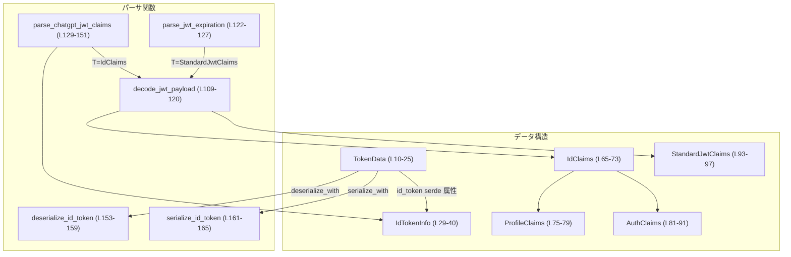

# login/src/token_data.rs コード解説

## 0. ざっくり一言

このモジュールは、ChatGPT 用の認証ファイル（`auth.json` など）に含まれる JWT をパースし、トークン情報 (`TokenData` / `IdTokenInfo`) として扱いやすい形に変換する処理を提供します（`login/src/token_data.rs:L10-L25`, `L27-L40`, `L129-L151`）。

---

## 1. このモジュールの役割

### 1.1 概要

- 認証情報を表現する `TokenData` 構造体と、その中の ID トークン情報 `IdTokenInfo` を定義します（`login/src/token_data.rs:L10-L25`, `L27-L40`）。
- JWT 文字列からペイロードを取り出して JSON としてデコードする共通関数 `decode_jwt_payload` を提供します（`L109-L120`）。
- JWT から有効期限 (`exp`) を取り出す `parse_jwt_expiration` と、ChatGPT 関連のクレームを取り出す `parse_chatgpt_jwt_claims` を提供します（`L122-L127`, `L129-L151`）。
- `TokenData.id_token` の serde カスタム（文字列の JWT ⇔ `IdTokenInfo`）を実装します（`L10-L17`, `L153-L166`）。

### 1.2 アーキテクチャ内での位置づけ

このモジュール内の主な依存関係を示します。



- `TokenData.id_token` の デシリアライズ時に `deserialize_id_token` → `parse_chatgpt_jwt_claims` → `decode_jwt_payload` と呼び出されます（`L10-L17`, `L153-L159`, `L129-L151`, `L109-L120`）。
- JWT の有効期限確認など、他のコードから `parse_jwt_expiration` / `parse_chatgpt_jwt_claims` を直接呼ぶことが想定されます（`L122-L127`, `L129-L151`）。

### 1.3 設計上のポイント

- **責務分割**  
  - トークン全体 (`TokenData`) と ID トークン部分 (`IdTokenInfo`) を分離し、ID トークンに関するロジックは `IdTokenInfo` とパーサ関数に集中させています（`L10-L25`, `L27-L40`, `L129-L151`）。
- **エラーハンドリング**  
  - 専用エラー型 `IdTokenInfoError` を定義し、フォーマット不正・Base64 デコード失敗・JSON デコード失敗を区別して返します（`L99-L107`）。
  - すべて `Result<_, IdTokenInfoError>` で戻す構造であり、パニックを起こすコードは含まれていません（`L109-L120`, `L122-L127`, `L129-L151`）。
- **状態管理**  
  - すべての関数は純粋関数であり、グローバルな可変状態を持ちません。並行実行しても共有可変状態はありません。
- **JWT の扱い**  
  - JWT の署名検証は一切行わず、「ヘッダ.ペイロード.署名」の形式確認と Base64URL デコード、および JSON パースのみを行います（`L109-L120`）。  
    これはセキュリティ面で重要な前提条件です（詳細は後述）。

---

## 2. 主要な機能一覧

- JWT 文字列を構造化されたトークンデータ (`TokenData`, `IdTokenInfo`) に変換する。
- JWT ペイロードを汎用的に Base64URL デコード＋JSON デシリアライズする。
- JWT の `exp` クレームから有効期限 (`DateTime<Utc>`) を取り出す。
- ChatGPT 特有のクレーム（プラン種別、ユーザー ID、アカウント ID）を抽出する。
- `IdTokenInfo` から ChatGPT プランの表示名やワークスペースアカウントかどうかを判定する。

### 2.1 コンポーネント一覧（インベントリー）

| 名前 | 種別 | 公開 | 役割 / 用途 | 定義位置 |
|------|------|------|-------------|----------|
| `TokenData` | 構造体 | `pub` | 認証情報全体（ID トークン、アクセストークン、リフレッシュトークン、アカウント ID）を保持 | `login/src/token_data.rs:L10-L25` |
| `IdTokenInfo` | 構造体 | `pub` | ID トークンから抽出した ChatGPT 関連クレームと生の JWT を保持 | `L27-L40` |
| `IdTokenInfo::get_chatgpt_plan_type` | メソッド | `pub` | `PlanType` からユーザー向け表示名文字列を取得 | `L42-L48` |
| `IdTokenInfo::get_chatgpt_plan_type_raw` | メソッド | `pub` | `PlanType` の生の値文字列を取得 | `L50-L55` |
| `IdTokenInfo::is_workspace_account` | メソッド | `pub` | プランがワークスペースアカウントかどうかを判定 | `L57-L62` |
| `IdClaims` | 構造体 | 非公開 | ID トークンのカスタムクレーム（メール/プロフィール/認可情報）の中間表現 | `L65-L73` |
| `ProfileClaims` | 構造体 | 非公開 | プロフィールに関するクレーム（メールアドレス） | `L75-L79` |
| `AuthClaims` | 構造体 | 非公開 | `chatgpt_plan_type` などの認可クレーム | `L81-L91` |
| `StandardJwtClaims` | 構造体 | 非公開 | 標準 JWT クレームのうち `exp` のみを保持 | `L93-L97` |
| `IdTokenInfoError` | enum | `pub` | JWT パース関連のエラー種別（フォーマット/Base64/JSON） | `L99-L107` |
| `decode_jwt_payload` | 関数 | 非公開 | JWT 文字列からペイロード部分を Base64URL デコードして任意の型に JSON デコード | `L109-L120` |
| `parse_jwt_expiration` | 関数 | `pub` | JWT から `exp` を取り出し `DateTime<Utc>` に変換 | `L122-L127` |
| `parse_chatgpt_jwt_claims` | 関数 | `pub` | JWT から ChatGPT 関連クレームを取り出し `IdTokenInfo` に変換 | `L129-L151` |
| `deserialize_id_token` | 関数 | 非公開 | serde カスタムデシリアライズ：JWT 文字列 → `IdTokenInfo` | `L153-L159` |
| `serialize_id_token` | 関数 | 非公開 | serde カスタムシリアライズ：`IdTokenInfo.raw_jwt` → JWT 文字列 | `L161-L165` |
| `tests` | モジュール | 非公開 | テストコードを外部ファイル `token_data_tests.rs` として参照 | `L168-L170` |

---

## 3. 公開 API と詳細解説

### 3.1 型一覧（主要な公開型）

| 名前 | 種別 | 役割 / 用途 | 主なフィールド | 根拠 |
|------|------|-------------|----------------|------|
| `TokenData` | 構造体 | 認証情報全体。ID トークン（パース済み）、アクセストークン、リフレッシュトークン、アカウント ID をまとめて保持します。 | `id_token: IdTokenInfo`, `access_token: String`, `refresh_token: String`, `account_id: Option<String>` | `login/src/token_data.rs:L10-L25` |
| `IdTokenInfo` | 構造体 | ID トークンから抜き出したフラットな情報（メール、プラン種別、ユーザー ID、アカウント ID、生 JWT）を保持します。 | `email: Option<String>`, `chatgpt_plan_type: Option<PlanType>`, `chatgpt_user_id: Option<String>`, `chatgpt_account_id: Option<String>`, `raw_jwt: String` | `L27-L40` |
| `IdTokenInfoError` | enum | JWT パース時のエラーを表現します。フォーマット不正、Base64 デコードエラー、JSON デコードエラーの 3 種類です。 | `InvalidFormat`, `Base64(DecodeError)`, `Json(serde_json::Error)` | `L99-L107` |

---

### 3.2 関数詳細（7 件）

#### `IdTokenInfo::get_chatgpt_plan_type(&self) -> Option<String>`

**概要**

- `chatgpt_plan_type` フィールドを、ユーザー向けの表示名（`display_name`）または保持している文字列として `Option<String>` で返します（`login/src/token_data.rs:L42-L48`）。
- プラン情報がない場合は `None` を返します。

**根拠**

- `self.chatgpt_plan_type.as_ref().map(|t| match t { PlanType::Known(plan) => plan.display_name().to_string(), PlanType::Unknown(s) => s.clone(), })`（`L42-L47`）。

**引数**

| 引数名 | 型 | 説明 |
|--------|----|------|
| `self` | `&IdTokenInfo` | 対象となる ID トークン情報 |

**戻り値**

- `Option<String>`  
  - `Some(s)`: プラン種別が存在するとき、その表示名または文字列。
  - `None`: `chatgpt_plan_type` が `None` の場合。

**内部処理の流れ**

1. `chatgpt_plan_type` を参照で取り出し `Option<&PlanType>` にする（`as_ref`）（`L42`）。
2. `Option::map` により `PlanType` を `String` に変換：
   - `PlanType::Known(plan)` の場合は `plan.display_name().to_string()`（`L45`）。
   - `PlanType::Unknown(s)` の場合は `s.clone()`（`L46`）。

**Examples（使用例）**

```rust
use login::token_data::{parse_chatgpt_jwt_claims, IdTokenInfo};

fn print_plan(jwt: &str) {
    // 実際には有効な JWT を渡す必要があります
    if let Ok(info) = parse_chatgpt_jwt_claims(jwt) {
        if let Some(plan) = info.get_chatgpt_plan_type() {
            println!("プラン: {}", plan); // プラン名を表示
        }
    }
}
```

**Errors / Panics**

- このメソッド自体は `Result` を返さず、内部でパニックを起こす要素もありません。
- ただし、`IdTokenInfo` がどのように生成されたか（`parse_chatgpt_jwt_claims` の結果など）に応じて、`chatgpt_plan_type` が `None` の場合があります。

**Edge cases（エッジケース）**

- `chatgpt_plan_type == None` の場合: `None` を返します（`L42`）。
- `PlanType::Unknown(s)` の場合: 元の文字列 `s` をそのまま返します（`L46`）。

**使用上の注意点**

- 戻り値が `Option` であるため、常に `match` や `if let` で `None` を扱う必要があります。
- 表示名は `PlanType` 実装に依存しているため、バックエンド側の変更で変わる可能性があります（コードからは詳細不明）。

---

#### `IdTokenInfo::get_chatgpt_plan_type_raw(&self) -> Option<String>`

**概要**

- `chatgpt_plan_type` の「生の値」（`raw_value()` または保持文字列）を返します（`login/src/token_data.rs:L50-L55`）。

**根拠**

- `PlanType::Known(plan) => plan.raw_value().to_string()`（`L52`）。

**引数 / 戻り値**

- 引数・戻り値は `get_chatgpt_plan_type` と同様に `&self` → `Option<String>` です（`L50-L55`）。

**内部処理の流れ**

- `get_chatgpt_plan_type` と同様ですが、`display_name` の代わりに `raw_value` を呼び出します（`L52`）。

**使用上の注意点**

- バックエンドと厳密に一致するプラン識別子を扱いたい場合に使用します。
- やはり `None` の可能性があるため、`Option` の扱いが必要です。

---

#### `IdTokenInfo::is_workspace_account(&self) -> bool`

**概要**

- プランがワークスペースアカウントであるかどうかを `bool` で返します（`login/src/token_data.rs:L57-L62`）。

**根拠**

- `matches!( self.chatgpt_plan_type, Some(PlanType::Known(plan)) if plan.is_workspace_account() )`（`L57-L61`）。

**引数**

| 引数名 | 型 | 説明 |
|--------|----|------|
| `self` | `&IdTokenInfo` | 判定対象のトークン情報 |

**戻り値**

- `true`: `chatgpt_plan_type` が `Some(PlanType::Known(plan))` かつ `plan.is_workspace_account()` が `true`。
- `false`: それ以外のすべてのケース。

**内部処理の流れ**

1. `matches!` マクロで `chatgpt_plan_type` が `Some(PlanType::Known(plan))` 型であるかをパターンマッチ（`L58-L60`）。
2. その場合に限り `plan.is_workspace_account()` が `true` なら `true` を返します（`L60`）。
3. それ以外は `false` を返します。

**Examples**

```rust
fn check_workspace(info: &IdTokenInfo) {
    if info.is_workspace_account() {
        println!("これはワークスペースアカウントです");
    } else {
        println!("個人アカウント、またはプラン不明です");
    }
}
```

**Errors / Panics**

- パニック要因はありません。

**Edge cases**

- `chatgpt_plan_type == None` → 常に `false`。
- `PlanType::Unknown(_)` → パターンにマッチしないため常に `false`（`L59`）。

**使用上の注意点**

- 「ワークスペース」と見なす判定ロジックは `PlanType` 実装の `is_workspace_account` に依存します。ここからは詳細は分かりません。

---

#### `decode_jwt_payload<T: DeserializeOwned>(jwt: &str) -> Result<T, IdTokenInfoError>`

**概要**

- JWT 文字列からペイロード部分を取り出し、Base64URL デコード → JSON デシリアライズを行い、任意の型 `T` に変換します（`login/src/token_data.rs:L109-L120`）。
- JWT の署名やヘッダの検証は行いません。

**根拠**

- `jwt.split('.')` で 3 セグメントを取り出し、ペイロード部分のみ decode して `serde_json::from_slice` を呼んでいます（`L109-L119`）。

**引数**

| 引数名 | 型 | 説明 |
|--------|----|------|
| `jwt` | `&str` | `"header.payload.signature"` 形式の JWT 文字列 |

**戻り値**

- `Result<T, IdTokenInfoError>`  
  - `Ok(T)`: ペイロードを指定型 `T` にデコードできた場合。
  - `Err(IdTokenInfoError)`: 以下のいずれかのエラー。

**内部処理の流れ**

1. `jwt.split('.')` でドット区切りパーツを取得し、`header`, `payload`, `signature` の 3 つを取り出します（`L111-L113`）。
2. 3 つすべてが `Some` かつ非空でないことを確認し、それ以外なら `IdTokenInfoError::InvalidFormat` を返します（`L112-L115`）。
3. `base64::engine::general_purpose::URL_SAFE_NO_PAD.decode(payload_b64)` でペイロードパーツを Base64URL（パディング無し）としてデコードします（`L117`）。
4. デコードしたバイト列を `serde_json::from_slice(&payload_bytes)` で JSON としてパースし、`T` にデシリアライズします（`L118`）。

**Examples**

```rust
use login::token_data::IdTokenInfoError;
use serde::Deserialize;

#[derive(Deserialize)]
struct MyClaims {
    sub: String,
}

fn parse_custom(jwt: &str) -> Result<MyClaims, IdTokenInfoError> {
    login::token_data::decode_jwt_payload::<MyClaims>(jwt)
}
```

**Errors / Panics**

- `InvalidFormat`: パーツ数が 3 でない、またはいずれかが空文字の場合（`L112-L115`）。
- `Base64`: ペイロード部分を Base64URL デコードできない場合（`L117` → `L104`）。
- `Json`: デコードしたペイロードが JSON として解釈できない、または型 `T` にマッピングできない場合（`L118` → `L105-106`）。
- パニックは使用していません（`unwrap` や `expect` などは無い）。

**Edge cases**

- 空文字や `".."` など JWT として不正な文字列 → `InvalidFormat`。
- ペイロードが padding 付き Base64 など、`URL_SAFE_NO_PAD` と互換性のない形式 → `Base64` エラー。
- ペイロードが JSON ではないか、フィールド型が合わない → `Json` エラー。

**使用上の注意点**

- この関数は JWT の署名・アルゴリズム・発行者などの検証を一切行いません。**セキュリティ上の検証ではなく、「中身を見るだけ」の用途に限る必要があります。**
- `DeserializeOwned` 制約により、返り値 `T` は借用を含まない所有データであり、`jwt` のライフタイムに依存しません。

---

#### `parse_jwt_expiration(jwt: &str) -> Result<Option<DateTime<Utc>>, IdTokenInfoError>`

**概要**

- JWT ペイロードから標準クレーム `exp` を取得し、`Utc` 時刻に変換して返します（`login/src/token_data.rs:L122-L127`）。

**根拠**

- `StandardJwtClaims { exp: Option<i64> }` をデコードし、`DateTime::<Utc>::from_timestamp(exp, 0)` に渡しています（`L93-L97`, `L122-L126`）。

**引数**

| 引数名 | 型 | 説明 |
|--------|----|------|
| `jwt` | `&str` | `"header.payload.signature"` 形式の JWT |

**戻り値**

- `Result<Option<DateTime<Utc>>, IdTokenInfoError>`  
  - `Ok(Some(dt))`: `exp` が存在し、`DateTime` に変換できた場合。
  - `Ok(None)`: `exp` が存在しない、または変換できなかった場合。
  - `Err(e)`: `decode_jwt_payload` 由来のエラー（フォーマット/ Base64 / JSON）。

**内部処理の流れ**

1. `decode_jwt_payload::<StandardJwtClaims>(jwt)?` でペイロードを `StandardJwtClaims` に読み込み（`L122-L123`）。
2. `claims.exp.and_then(|exp| DateTime::<Utc>::from_timestamp(exp, 0))` で `exp` が `Some` のときだけ `from_timestamp` を呼び出し（`L124-L126`）。
3. その結果（`Option<DateTime<Utc>>`）を `Ok` で包んで返す（`L124-L126`）。

**Examples**

```rust
use chrono::Utc;
use login::token_data::parse_jwt_expiration;

fn is_expired(jwt: &str, now: chrono::DateTime<Utc>) -> bool {
    match parse_jwt_expiration(jwt) {
        Ok(Some(exp)) => exp <= now,
        Ok(None) => {
            // exp が無い JWT の扱い方は仕様次第
            false
        }
        Err(_) => true, // パースできない場合は保守的に「期限切れ」と扱う例
    }
}
```

**Errors / Panics**

- エラー条件は `decode_jwt_payload` と同じです（`L122-L123`）。
- `from_timestamp` が `Option` を返す形で使用されているため、ここでパニックは発生しません（`L124-L126`）。

**Edge cases**

- `exp` フィールドが存在しない → `Ok(None)`。
- `exp` が非常に大きい/小さい値で `DateTime` に変換できない → `Ok(None)`。
- `exp` が整数以外（例: 文字列）としてエンコードされている → JSON デコード時に `Json` エラー（`L93-L97`）。

**使用上の注意点**

- `Ok(None)` の扱い（`exp` 欄がない JWT）を利用側で明確に決める必要があります。
- こちらも署名検証は行わないため、「本当に信頼して良いトークンか」の判定には別途検証が必要です。

---

#### `parse_chatgpt_jwt_claims(jwt: &str) -> Result<IdTokenInfo, IdTokenInfoError>`

**概要**

- ChatGPT 用に拡張された JWT から、メールアドレスやプラン種別などのクレームを抽出し、`IdTokenInfo` として返します（`login/src/token_data.rs:L129-L151`）。

**根拠**

- `IdClaims`（メール + OpenAI プロフィール + 認可クレーム）に一度デシリアライズし、それを `IdTokenInfo` に組み立てています（`L65-L73`, `L129-L151`）。

**引数**

| 引数名 | 型 | 説明 |
|--------|----|------|
| `jwt` | `&str` | ChatGPT ID トークンを表す JWT |

**戻り値**

- `Result<IdTokenInfo, IdTokenInfoError>`  
  - `Ok(info)`: パースに成功し、必要なフィールドを埋めた `IdTokenInfo`。
  - `Err(e)`: `decode_jwt_payload` 由来のエラー。

**内部処理の流れ**

1. `decode_jwt_payload::<IdClaims>(jwt)?` でペイロードを中間型 `IdClaims` に変換（`L129-L130`）。
2. `email` を決定：  
   - まず `claims.email` を使用し（`L131-L132`）、  
   - `None` の場合は `claims.profile.and_then(|profile| profile.email)` でプロフィール内のメールを参照（`L133`）。
3. 認可クレーム `claims.auth` の有無で分岐（`L135`）：
   - `Some(auth)` の場合:
     - `chatgpt_plan_type: auth.chatgpt_plan_type`（`L139`）
     - `chatgpt_user_id: auth.chatgpt_user_id.or(auth.user_id)`（優先順位付きでユーザー ID をセット）（`L140`）
     - `chatgpt_account_id: auth.chatgpt_account_id`（`L141`）
   - `None` の場合:
     - 上記 3 つのフィールドはすべて `None` をセット（`L143-L148`）。
4. `raw_jwt` フィールドには渡された `jwt` 文字列をそのまま `to_string()` して格納（`L138`, `L145`）。
5. 組み立てた `IdTokenInfo` を `Ok` で返します。

**Examples**

```rust
use login::token_data::parse_chatgpt_jwt_claims;

fn show_user(jwt: &str) {
    match parse_chatgpt_jwt_claims(jwt) {
        Ok(info) => {
            println!("raw_jwt len: {}", info.raw_jwt.len());
            println!("email: {:?}", info.email);
            println!("user id: {:?}", info.chatgpt_user_id);
            println!("plan: {:?}", info.get_chatgpt_plan_type());
        }
        Err(e) => eprintln!("JWT パースエラー: {}", e),
    }
}
```

**Errors / Panics**

- `decode_jwt_payload` からそのままエラーが伝搬します（`L129-L130`）。
- フィールドの取り出し処理では `unwrap` などを使っていないため、パニック要因はありません。

**Edge cases**

- メールアドレスについて：
  - `claims.email` が `Some` → それを使用（`L131-L132`）。
  - `claims.email` が `None` だが `profile.email` が `Some` → プロフィールのメールを使用（`L133`）。
  - 両方 `None` → `IdTokenInfo.email == None`。
- `auth` クレーム全体が存在しない → プラン・ユーザー ID・アカウント ID はすべて `None`（`L135`, `L143-L148`）。
- `chatgpt_user_id` が `None` だが `user_id` が `Some` → `chatgpt_user_id` に `user_id` をセット（`L140`）。
- どちらも `None` → `chatgpt_user_id == None`。

**使用上の注意点**

- `IdTokenInfo.raw_jwt` には元の JWT がそのまま入るため、ログに出す際は情報漏洩（トークン漏れ）に注意が必要です（`L138`, `L145`）。
- `PlanType` の中身や値の意味は外部クレート `codex_protocol` に依存しており、このファイルだけからは詳細を知ることはできません（`L4`, `L34`）。
- 署名検証を行っていないため、この結果だけを信頼して認可判断をすることは危険です。

---

#### `deserialize_id_token<'de, D>(deserializer: D) -> Result<IdTokenInfo, D::Error>`

**概要**

- serde のカスタムデシリアライザとして使用され、JSON 中の ID トークン文字列を `IdTokenInfo` に変換します（`login/src/token_data.rs:L153-L159`）。
- `TokenData.id_token` フィールドに対して `#[serde(deserialize_with = "deserialize_id_token")]` として指定されています（`L13-L17`）。

**根拠**

- `String::deserialize(deserializer)?` で文字列を取得し、それを `parse_chatgpt_jwt_claims` に渡しています（`L157-L158`）。

**引数**

| 引数名 | 型 | 説明 |
|--------|----|------|
| `deserializer` | `D` | serde が内部で使うデシリアライザ |

**戻り値**

- `Result<IdTokenInfo, D::Error>`  
  - 正常時: パースされた `IdTokenInfo`。
  - エラー時: serde 互換のエラー型 `D::Error`。

**内部処理の流れ**

1. `String::deserialize(deserializer)?` で JSON の値を `String` として読み込みます（`L157`）。
2. その文字列を `parse_chatgpt_jwt_claims(&s)` に渡し、`IdTokenInfo` を取得します（`L158`）。
3. `Result<IdTokenInfo, IdTokenInfoError>` を `map_err(serde::de::Error::custom)` で serde エラーに変換して返します（`L158`）。

**Examples**

`TokenData` の定義により、この関数を直接呼ばなくても、serde で `TokenData` をデシリアライズすると自動的に呼ばれます。

```rust
use login::token_data::TokenData;

fn load_auth(json: &str) -> serde_json::Result<TokenData> {
    // auth.json の内容をパースすると、id_token 文字列が内部で IdTokenInfo に変換される
    serde_json::from_str::<TokenData>(json)
}
```

**Errors / Panics**

- JSON 上の `id_token` フィールドが文字列でない場合 → `String::deserialize` がエラー（`L157`）。
- 文字列が不正な JWT の場合 → `parse_chatgpt_jwt_claims` が `IdTokenInfoError` を返し、それが `serde::de::Error::custom` としてラップされます（`L158`）。
- パニックはありません。

**Edge cases**

- `id_token` フィールドが JSON 上に存在しない場合、`TokenData` 側のデフォルト処理に依存します（`#[derive(Default)]` など）。このファイルだけでは JSON スキーマは分かりません。
- 空文字 `""` が `id_token` に入っている場合 → `InvalidFormat` 由来のエラーになります（`L112-L115`）。

**使用上の注意点**

- `TokenData` をシリアライズ/デシリアライズする際、JSON 形式の `id_token` は常に **生の JWT 文字列** （ヘッダ.ペイロード.署名）でなければなりません。
- `IdTokenInfoError` の詳細が serde エラーにラップされるため、利用側でメッセージを解析したい場合はエラーメッセージ文字列に依存することになります。

---

#### `IdTokenInfo` の 2 つのメソッド + `decode_jwt_payload` + `parse_jwt_expiration` + `parse_chatgpt_jwt_claims` + `deserialize_id_token` で合計 7 件説明しました  

残りの補助関数は次節にまとめます。

### 3.3 その他の関数

| 関数名 | 公開 | 役割（1 行） | 定義位置 |
|--------|------|--------------|----------|
| `serialize_id_token<S>(id_token: &IdTokenInfo, serializer: S)` | 非公開 | serde 用カスタムシリアライザ。`IdTokenInfo.raw_jwt` を JSON 文字列として書き出すだけの薄いラッパーです（`serializer.serialize_str(&id_token.raw_jwt)`）。 | `login/src/token_data.rs:L161-L165` |

---

## 4. データフロー

### 4.1 代表的な処理シナリオ：auth.json の読み込み

認証ファイル（例: `auth.json`）に以下のような JSON があるとします（実際の形式はこのファイルからは不明ですが、`id_token` が文字列であることだけは必要です）。

```json
{
  "id_token": "header.payload.signature",
  "access_token": "...",
  "refresh_token": "...",
  "account_id": "..."
}
```

この JSON を `TokenData` にデシリアライズする際の処理フローは次のようになります。

```mermaid
sequenceDiagram
    participant Caller as "呼び出し元"
    participant Serde as "serde_json (外部)"
    participant TokenData as "TokenData (L10-25)"
    participant DeserId as "deserialize_id_token (L153-159)"
    participant ParseClaims as "parse_chatgpt_jwt_claims (L129-151)"
    participant Decode as "decode_jwt_payload (L109-120)"

    Caller->>Serde: TokenData に from_str
    Serde->>TokenData: 各フィールドのデシリアライズ
    Serde->>DeserId: id_token フィールドに対してカスタム反映
    DeserId->>ParseClaims: parse_chatgpt_jwt_claims(jwt)
    ParseClaims->>Decode: decode_jwt_payload&lt;IdClaims&gt;(jwt)
    Decode-->>ParseClaims: IdClaims
    ParseClaims-->>DeserId: IdTokenInfo
    DeserId-->>Serde: IdTokenInfo
    Serde-->>Caller: TokenData インスタンス
```

- `TokenData` の `id_token` フィールドには、パース済みの `IdTokenInfo` が格納されます（`login/src/token_data.rs:L10-L17`, `L153-L159`, `L129-L151`）。
- 同様に、JWT の有効期限だけを知りたい場合は、呼び出し元から `parse_jwt_expiration(jwt)` が直接呼ばれ、内部で `decode_jwt_payload` が使われます（`L122-L127`, `L109-L120`）。

---

## 5. 使い方（How to Use）

### 5.1 基本的な使用方法

`TokenData` を通して JWT を扱う基本的なコードフローの一例です。

```rust
use std::fs;
use login::token_data::{TokenData, parse_jwt_expiration};

fn load_and_inspect(path: &str) -> anyhow::Result<()> {
    // 1. auth.json の読み込み
    let json = fs::read_to_string(path)?; // ファイル I/O は呼び出し側の責務

    // 2. TokenData にデシリアライズ
    let token_data: TokenData = serde_json::from_str(&json)?; // id_token は内部で IdTokenInfo にパースされる

    // 3. IdTokenInfo から情報を取り出す
    println!("email: {:?}", token_data.id_token.email);
    println!("plan(display): {:?}", token_data.id_token.get_chatgpt_plan_type());
    println!("plan(raw): {:?}", token_data.id_token.get_chatgpt_plan_type_raw());
    println!("workspace: {}", token_data.id_token.is_workspace_account());

    // 4. access_token の有効期限をチェック（ID トークンではなく別の JWT でもよい）
    if let Ok(Some(exp)) = parse_jwt_expiration(&token_data.access_token) {
        println!("access_token exp: {}", exp);
    }

    Ok(())
}
```

### 5.2 よくある使用パターン

1. **ID トークンのメタ情報だけ欲しい**  
   → `parse_chatgpt_jwt_claims(jwt)` を直接呼び、`IdTokenInfo` のメソッドでプラン情報などを参照する（`login/src/token_data.rs:L129-L151`, `L42-L62`）。

2. **有効期限だけ確認したい**  
   → `parse_jwt_expiration(jwt)` で `Option<DateTime<Utc>>` として取得し、現在時刻と比較する（`L122-L127`）。

3. **JSON ファイルでトークンを管理したい**  
   → `TokenData` を serde でシリアライズ/デシリアライズし、`id_token` は常に生の JWT 文字列として保存・読み込みする（`L10-L17`, `L153-L166`）。

### 5.3 よくある間違いとセキュリティ上の注意

```rust
use login::token_data::parse_chatgpt_jwt_claims;

// 間違い例: 署名検証なしで認可を行う
fn is_admin_wrong(jwt: &str) -> bool {
    // 署名等を検証していないので、攻撃者が自由に改ざん可能な情報を信用してしまう
    parse_chatgpt_jwt_claims(jwt)
        .ok()
        .and_then(|info| info.get_chatgpt_plan_type_raw())
        .map(|plan| plan == "admin")
        .unwrap_or(false)
}
```

- **問題点**  
  - `decode_jwt_payload` / `parse_chatgpt_jwt_claims` は JWT の署名検証を行いません（`login/src/token_data.rs:L109-L120`）。
  - したがって、攻撃者が署名を無視してペイロード部分だけを改ざんした文字列を渡しても、**パース自体は成功してしまいます**。
- **正しい方向性**  
  - 署名検証や `aud`, `iss` などの検証は、このモジュール外で、認証ライブラリ等を用いて行う必要があります。
  - このモジュールの役割は「中身を見る（デコードする）」ことであり、「信頼できるかを判断する」ことではありません。

### 5.4 使用上の注意点（まとめ）

- **前提条件**
  - JWT 文字列は `"header.payload.signature"` 形式で、ペイロード部分が Base64URL（パディング無し）でエンコードされている必要があります（`login/src/token_data.rs:L109-L117`）。
  - `TokenData.id_token` の JSON 表現は文字列でなければなりません（`L153-L159`）。

- **エラーとエッジケース**
  - フォーマット不正・Base64 不正・JSON 不正はそれぞれ `IdTokenInfoError` のバリアントとして区別されます（`L99-L107`, `L109-L120`）。
  - `parse_jwt_expiration` は `exp` 欄が無い/変換できない場合でもエラーにはせず `Ok(None)` を返します（`L122-L127`）。
  - `parse_chatgpt_jwt_claims` は `auth` クレームが無い場合でも `IdTokenInfo` を返し、プラン種別やユーザー ID は `None` になります（`L135-L148`）。

- **並行性**
  - このモジュールはグローバルな可変状態を持たず、すべての関数とメソッドは引数にだけ依存するため、複数スレッドから同時に呼び出してもスレッド安全と考えられます（コード上に共有可変データが存在しません）。

- **ログ／トレーシング**
  - ログやトレースを出力するコードは含まれていません。エラー情報は `Result` を通じてのみ伝えられるため、必要であれば呼び出し側でログ出力を行う必要があります。

---

## 6. 変更の仕方（How to Modify）

### 6.1 新しい機能を追加する場合

1. **新しいクレームを抽出したい場合**
   - JWT ペイロードに存在する新しいクレームを扱いたい場合、まず中間構造体にフィールドを追加します。
     - 例: `IdClaims` にフィールド追加（`login/src/token_data.rs:L65-L73`）。
     - 必要に応じて `ProfileClaims` や `AuthClaims` にも追加（`L75-L79`, `L81-L91`）。
   - その後、`parse_chatgpt_jwt_claims` 内で `IdTokenInfo` に値をコピーする処理を追加します（`L129-L151`）。

2. **別種の JWT をパースするユーティリティを追加したい場合**
   - すでにある `decode_jwt_payload` を再利用して、専用の中間構造体とパーサ関数を定義する形が自然です（`L109-L120`）。
   - 例:
     - `struct MyNewClaims { ... }`
     - `fn parse_my_new_jwt(jwt: &str) -> Result<MyNewClaims, IdTokenInfoError> { decode_jwt_payload(jwt) }`

3. **シリアライズ形式を拡張したい場合**
   - `TokenData` の JSON 表現を変更したい場合は、`TokenData` に serde 属性を追加・変更します（`L10-L25`）。
   - `id_token` に対して別の表現（例えばオブジェクト形式）を採用したい場合は、`deserialize_id_token` / `serialize_id_token` のロジックを合わせて変更します（`L153-L166`）。

### 6.2 既存の機能を変更する場合の注意

- **影響範囲の確認**
  - `IdTokenInfo` のフィールドを変更すると、`TokenData` やこの型を利用している他モジュールに影響します（`L27-L40`, `L10-L25`）。
  - `IdClaims`, `AuthClaims` などの中間構造体を変更すると、`parse_chatgpt_jwt_claims` のロジックと整合性が必要です（`L65-L73`, `L81-L91`, `L129-L151`）。

- **契約（前提条件・返り値の意味）**
  - `parse_jwt_expiration` が `Ok(None)` を返す条件を変えると、呼び出し側の「期限なし扱い」ロジックに影響します（`L122-L127`）。
  - `parse_chatgpt_jwt_claims` の「`chatgpt_user_id` に `user_id` をフォールバックする」仕様を変えると、ユーザー ID の扱いが変化します（`L140`）。

- **テスト**
  - テストコードは `token_data_tests.rs` に分離されており（`L168-L170`）、このチャンクには内容が含まれていません。
  - 構造体やパーサの振る舞いを変更する際は、関連テストの存在と内容を確認し、必要なら追加・更新する必要があります。

---

## 7. 関連ファイル

| パス / シンボル | 役割 / 関係 |
|----------------|------------|
| `login/src/token_data_tests.rs` | `#[cfg(test)] #[path = "token_data_tests.rs"] mod tests;` として参照されるテストモジュールです。本チャンクには中身がないため、どのケースをカバーしているかは不明です（`login/src/token_data.rs:L168-L170`）。 |
| `codex_protocol::auth::PlanType` | ChatGPT プラン種別を表す外部クレートの型です。`PlanType::Known(plan)` / `PlanType::Unknown(s)` にパターンマッチし、`display_name`, `raw_value`, `is_workspace_account` などのメソッドを使用しています（`L4`, `L34`, `L42-L47`, `L50-L55`, `L57-L62`）。 |
| `base64::engine::general_purpose::URL_SAFE_NO_PAD` | JWT ペイロードの Base64URL デコードに使用するエンジンです。`=` などのパディング無しでデコードします（`L117`）。 |
| `chrono::DateTime`, `chrono::Utc` | `exp` クレームを UTC 時刻として表現するために使用します（`L2-L3`, `L93-L97`, `L122-L127`）。 |

---

以上が、`login/src/token_data.rs` における公開 API・コアロジック・データフロー・エッジケース・セキュリティ上の前提の整理です。
