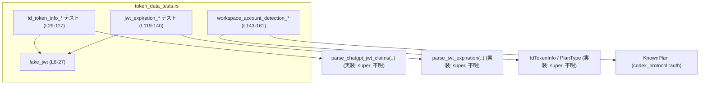
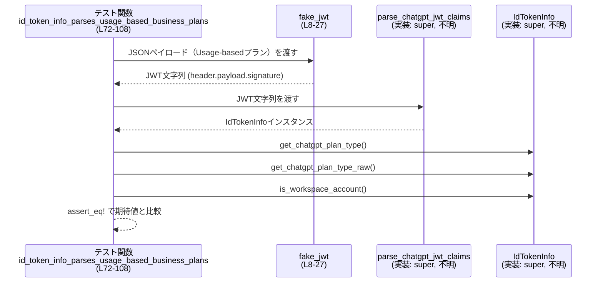
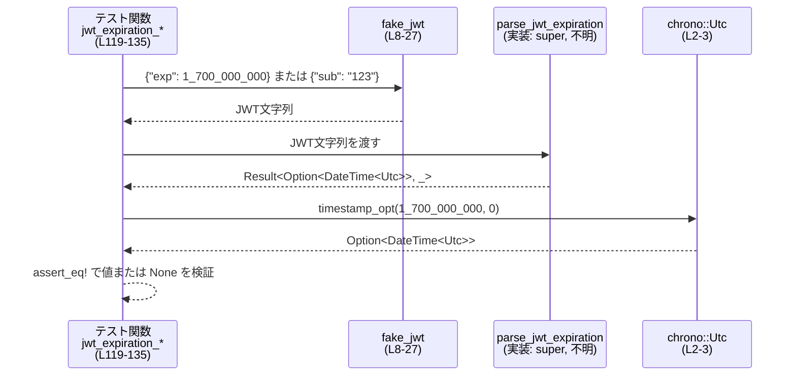

# login/src/token_data_tests.rs コード解説

## 0. ざっくり一言

このファイルは、テスト用の簡易 JWT 文字列を生成するヘルパー関数 `fake_jwt` と、ID トークンをパースする公開 API（`parse_chatgpt_jwt_claims`, `parse_jwt_expiration`, `IdTokenInfo` など）の挙動を検証する単体テスト群で構成されています（`token_data_tests.rs:L1-161`）。  

---

## 1. このモジュールの役割

### 1.1 概要

- このモジュールは **ChatGPT ID トークン関連のパース処理の契約（Contract）** をテストで固定するために存在します。
- 主に次の点を検証しています。
  - JWT から `email` とプラン種別（`chatgpt_plan_type`）が正しく取り出され、人間向けの表記に変換されること（`token_data_tests.rs:L29-90, L145-161`）。
  - JWT の `exp` クレームから有効期限が `Option<DateTime<Utc>>` として解釈されること（`token_data_tests.rs:L119-135`）。
  - JWT 形式が不正な場合に、エラー文字列 `"invalid ID token format"` が返ること（`token_data_tests.rs:L137-140`）。
  - `IdTokenInfo::is_workspace_account` がワークスペース系プランと個人プランを区別すること（`token_data_tests.rs:L143-161`）。

### 1.2 アーキテクチャ内での位置づけ

このファイルは「テストモジュール」であり、同じモジュール階層の実装（`use super::*;`）に対するブラックボックステストを行っています（`token_data_tests.rs:L1`）。

主要な依存関係を簡略化した図です（行番号は本ファイル内の範囲）:



- `fake_jwt` はテスト内でだけ使われる **JWT 生成ユーティリティ** です（`token_data_tests.rs:L8-27`）。
- 実際のパースロジックは `super::*` からインポートされた関数・型に委ねられています（`token_data_tests.rs:L1, L38, L52, L66, L81, L98, L114, L125, L133, L139, L145-158`）。

### 1.3 設計上のポイント（コードから読み取れる範囲）

- **責務の分離**  
  - JWT 文字列の構築は専用関数 `fake_jwt` にまとめられ、個々のテストは「どのクレームを含むか」に集中しています（`token_data_tests.rs:L8-27, L29-27`）。
- **エラーハンドリング方針（テスト側）**
  - パースが成功する前提のテストでは `.expect("should parse")` を使い、失敗時はテスト失敗に直結させています（`token_data_tests.rs:L38, L52, L66, L81, L98, L114, L125, L133`）。
  - 不正な入力に対しては `.expect_err("should fail")` で Result が Err になることを明示的に確認しています（`token_data_tests.rs:L139`）。
- **状態／並行性**
  - すべてのテストは関数レベルで完結しており、共有ミュータブル状態やスレッドは使用していません（`token_data_tests.rs` 全体）。並行性に関する挙動はこのファイルからは分かりません。
- **契約テストとしての側面**
  - エラー文字列 `"invalid ID token format"` のように、**メッセージまで固定**しており、ライブラリ側の変更可能範囲を明確に狭めています（`token_data_tests.rs:L140`）。

---

## 2. 主要な機能一覧（コンポーネントインベントリ）

このファイル内の関数とその役割を列挙します。

- `fake_jwt`: 任意の JSON ペイロードから、署名検証を行わない簡易 JWT 文字列を生成するテスト用ヘルパー（`token_data_tests.rs:L8-27`）。
- `id_token_info_parses_email_and_plan`: `email` と `chatgpt_plan_type="pro"` が正しくパースされ、人間向け表記 `"Pro"` になることを確認（`token_data_tests.rs:L29-41`）。
- `id_token_info_parses_go_plan`: `chatgpt_plan_type="go"` が `"Go"` になることを確認（`token_data_tests.rs:L43-55`）。
- `id_token_info_parses_hc_plan_as_enterprise`: `chatgpt_plan_type="hc"` が `"Enterprise"` と判定され、`is_workspace_account()` が `true` になることを確認（`token_data_tests.rs:L57-70`）。
- `id_token_info_parses_usage_based_business_plans`: Usage-based なビジネス系プラン文字列が、人間向け表記と「生」文字列の両方で正しく扱われ、ワークスペースアカウントとして扱われることを確認（`token_data_tests.rs:L72-108`）。
- `id_token_info_handles_missing_fields`: `email` やプラン情報が欠落している場合でもパース自体は成功し、対応フィールドが `None` になることを確認（`token_data_tests.rs:L110-117`）。
- `jwt_expiration_parses_exp_claim`: `exp` クレームが存在する場合に、有効期限が `Some(DateTime<Utc>)` として返ることを確認（`token_data_tests.rs:L119-127`）。
- `jwt_expiration_handles_missing_exp`: `exp` クレームがない場合に、パースは成功するが `None` が返ることを確認（`token_data_tests.rs:L129-135`）。
- `jwt_expiration_rejects_malformed_jwt`: JWT のフォーマットが不正な場合に `Err` となり、メッセージが `"invalid ID token format"` であることを確認（`token_data_tests.rs:L137-140`）。
- `workspace_account_detection_matches_workspace_plans`: `IdTokenInfo` の `chatgpt_plan_type` に応じて `is_workspace_account()` が期待通りの bool を返すことを確認（`token_data_tests.rs:L143-161`）。

---

## 3. 公開 API と詳細解説

### 3.1 型一覧（構造体・列挙体など）

このファイルで **定義** されている／明示的に **利用** されている主な型です。

| 名前 | 種別 | 役割 / 用途 | 定義 / 使用位置 |
|------|------|-------------|-----------------|
| `Header` | ローカル構造体 | `fake_jwt` 内で JWT ヘッダ部分（`{"alg":"none","typ":"JWT"}`）を JSON シリアライズするための一時的な型です。外部には公開されません。 | 定義: `token_data_tests.rs:L9-17` |
| `IdTokenInfo` | 構造体（外部） | ID トークンから抽出されたクレーム情報を保持する型です。`email` フィールドと `chatgpt_plan_type` フィールド、`is_workspace_account` メソッドが存在することが分かります。型定義自体はこのファイルにはありません。 | 使用: `token_data_tests.rs:L38-40, L52-54, L66-69, L80-90, L114-116, L145-161` |
| `PlanType` | 列挙体（外部） | ChatGPT プラン種別を表現する列挙体です。少なくとも `Known(KnownPlan)` というバリアントを持つことが分かります。定義はこのファイルにはありません。 | 使用: `token_data_tests.rs:L146, L152, L158` |
| `KnownPlan` | 列挙体（外部） | `codex_protocol::auth` からインポートされるプラン種別 enum です。`Business`, `Pro`, `ProLite` などのバリアントが存在します（`token_data_tests.rs:L4, L146, L152, L158`）。 |
| `Utc` | 構造体（タイムゾーン） | `chrono` クレートの UTC タイムゾーン表現で、`timestamp_opt` により `DateTime<Utc>` を生成するために使われています。 | 使用: `token_data_tests.rs:L2-3, L125-126` |

> 注: `IdTokenInfo` や `PlanType` のフィールド構成・完全な API はこのチャンクには現れません。ここに記載しているのはテストコードから観測できる最低限の情報です。

### 3.2 関数・メソッド詳細（重要なもの）

ここでは、このファイルのテストが対象としている公開 API およびテスト内ヘルパーのうち、特に重要なものを取り上げます。

---

#### `fake_jwt(payload: serde_json::Value) -> String`

**概要**

- 任意の JSON ペイロードから、`<base64url(header)>.<base64url(payload)>.<base64url("sig")>` という形式の文字列を生成するテスト専用の JWT 風トークン生成関数です（`token_data_tests.rs:L8-27`）。
- ヘッダは固定で `{"alg":"none","typ":"JWT"}` になります。

**引数**

| 引数名 | 型 | 説明 |
|--------|----|------|
| `payload` | `serde_json::Value` | JWT のペイロード部として埋め込まれる JSON 値です（`token_data_tests.rs:L8, L31-36 など`）。 |

**戻り値**

- 型: `String`  
- 内容: `header.payload.signature` の 3 部分からなる文字列で、各部は Base64 URL-safe（パディングなし）エンコードされた JSON／バイト列です（`token_data_tests.rs:L19-26`）。

**内部処理の流れ**

`token_data_tests.rs:L8-27` のコードから次のように動作していることが分かります。

1. ローカル構造体 `Header { alg: "none", typ: "JWT" }` を定義・生成（`token_data_tests.rs:L9-17`）。
2. ローカル関数 `b64url_no_pad` で、渡されたバイト列を Base64 URL-safe（パディングなし）でエンコード（`token_data_tests.rs:L19-21`）。
3. `header` と `payload` を `serde_json::to_vec` でバイト列にシリアライズし、それぞれ `b64url_no_pad` でエンコード（`token_data_tests.rs:L23-24`）。
4. 署名部分には固定のバイト列 `"sig"` をエンコードしたものを使用（`token_data_tests.rs:L25`）。
5. それぞれを `"."` で連結して最終的な JWT 文字列を返却（`token_data_tests.rs:L26`）。

**Examples（使用例）**

テスト内での典型的な使用です:

```rust
let fake_jwt = fake_jwt(serde_json::json!({
    "email": "user@example.com",                           // email クレーム
    "https://api.openai.com/auth": {                       // OpenAI 固有の名前空間
        "chatgpt_plan_type": "pro"                         // プラン種別
    }
}));                                                       // token_data_tests.rs:L31-36
```

この戻り値が `parse_chatgpt_jwt_claims` や `parse_jwt_expiration` の入力として用いられます（`token_data_tests.rs:L38, L52, L66, L81, L98, L114, L125, L133`）。

**Errors / Panics**

- `serde_json::to_vec` の戻り値に対して `unwrap()` を呼び出しているため、シリアライズに失敗すると panic します（`token_data_tests.rs:L23-24`）。
  - ただし、テストで渡している値はすべて `serde_json::Value` のリテラルであり、通常は失敗しない前提です。
- Base64 エンコードで `panic` する可能性は通常ありません（`base64::engine::general_purpose::URL_SAFE_NO_PAD` は任意のバイト列を受け付けます）。

**Edge cases（エッジケース）**

- `payload` がどのような JSON であっても、`serde_json::to_vec` が成功する限りそのままエンコードされます。このファイルではオブジェクト形式（`json!({ .. })`）のみが使用されており、それ以外の形への挙動はテストされていません。
- ヘッダと署名は固定値なので、「ヘッダに `kid` を入れる」「署名を実際の署名にする」といったケースはこの関数では扱いません。

**使用上の注意点**

- 署名部分は固定文字列 `"sig"` であり、`alg` も `"none"` です。**セキュリティ上、安全な JWT ではなく、あくまでテスト用のダミー** であることに注意が必要です（`token_data_tests.rs:L14-17, L25`）。
- 本番コードでこの関数を利用することは想定されていません（このファイル以外からは参照されていないため）。

---

#### `parse_chatgpt_jwt_claims(..) -> Result<IdTokenInfo, _>`

※ シグネチャの型パラメータやエラー型はこのチャンクには現れません。ここではテストから観測できる挙動のみを記述します。

**概要**

- JWT 文字列から ChatGPT 関連のクレーム（`email`, `chatgpt_plan_type` など）をパースし、`IdTokenInfo` 構造体として返す関数です（`token_data_tests.rs:L38, L52, L66, L81, L98, L114`）。

**引数**

| 引数名 | 型 | 説明 |
|--------|----|------|
| （名前不明） | 文字列参照とみなせる型（例: `&str`） | `fake_jwt` が生成する JWT フォーマットの文字列が渡されています（`token_data_tests.rs:L38, L52, L66, L81, L98, L114`）。 |

**戻り値**

- 型: `Result<IdTokenInfo, E>`（`E` は this file からは不明）
- 成功時 (`Ok`) には `IdTokenInfo` を返し、失敗時 (`Err`) にはエラーを返します。
  - テストでは成功ケースのみ `.expect("should parse")` で利用しており、具体的なエラー型や他のエラー条件は不明です（`token_data_tests.rs:L38, L52, L66, L81, L98, L114`）。

**観測される挙動（テストから分かる契約）**

1. **email クレームの取り扱い**
   - ペイロードに `"email": "user@example.com"` が含まれる場合、`info.email.as_deref()` は `Some("user@example.com")` になります（`token_data_tests.rs:L31-33, L38-40`）。
   - `email` が存在しない場合は `info.email.is_none()` になります（`token_data_tests.rs:L112, L114-115`）。

2. **chatgpt_plan_type の人間向け表記**
   - `"pro"` → `"Pro"`（`token_data_tests.rs:L34-35, L38-40`）。
   - `"go"` → `"Go"`（`token_data_tests.rs:L47-49, L52-54`）。
   - `"hc"` → `"Enterprise"` かつ `is_workspace_account() == true`（`token_data_tests.rs:L61-63, L66-69`）。
   - `"self_serve_business_usage_based"` → `"Self Serve Business Usage Based"`（`token_data_tests.rs:L77-78, L80-85`）。
   - `"enterprise_cbp_usage_based"` → `"Enterprise CBP Usage Based"`（`token_data_tests.rs:L95-96, L98-102`）。

3. **chatgpt_plan_type の「生」文字列**
   - Usage-based プランでは `get_chatgpt_plan_type_raw().as_deref()` が元の文字列（例: `"self_serve_business_usage_based"`）を返します（`token_data_tests.rs:L87-89, L104-106`）。

4. **ワークスペースアカウント判定**
   - `"hc"`, `"self_serve_business_usage_based"`, `"enterprise_cbp_usage_based"` の各プランは `is_workspace_account() == true` となります（`token_data_tests.rs:L69-70, L90, L107`）。

**内部処理の流れ**

- JWT のどのライブラリを使っているか、どのように Base64 デコードを行っているかなど、内部アルゴリズムはこのチャンクには現れません。
- 上記の挙動から、少なくとも:
  - JSON パス `"email"`
  - JSON パス `"https://api.openai.com/auth"."chatgpt_plan_type"`
  
  の二つを読み取り、プラン種別文字列から人間向け表記と内部判定用の値を構築していることが分かります（`token_data_tests.rs:L31-36, L45-50, L59-64, L74-79, L92-97`）。

**Errors / Panics**

- テストでは成功パスにしか `parse_chatgpt_jwt_claims` を使っていないため、どのような入力で `Err` になるかは **このファイルからは分かりません**。
- `.expect("should parse")` を利用しているため、Err が返った場合はテストが panic します（`token_data_tests.rs:L38, L52, L66, L81, L98, L114`）。

**Edge cases（エッジケース）**

- `email` や `chatgpt_plan_type` がない場合でも、パース自体は成功し、対応フィールドが `None` になります（`token_data_tests.rs:L110-117`）。
- `chatgpt_plan_type` の未サポート値に対する挙動は、このチャンクではテストされておらず不明です。

**使用上の注意点**

- エラー型やエラー条件（例: 署名検証エラー、期限切れなど）の仕様は別ファイル側を確認する必要があります。このテストは「フォーマットが正しくデコードできた後」の挙動を主に検証していると考えられます。
- `chatgpt_plan_type` によるワークスペース判定は、**新しいプラン種別を追加する際の仕様変更点**になるため、対応するテストも追加するのが自然です（`token_data_tests.rs:L57-108, L143-161`）。

---

#### `parse_jwt_expiration(..) -> Result<Option<DateTime<Utc>>, _>`

**概要**

- JWT の `exp` クレームから有効期限をパースし、`Option<DateTime<Utc>>` として返す関数です（`token_data_tests.rs:L119-135, L137-140`）。

**引数**

| 引数名 | 型 | 説明 |
|--------|----|------|
| （名前不明） | 文字列参照とみなせる型 | `fake_jwt` が生成する JWT 文字列、または任意の文字列（不正フォーマットを含む）が渡されています（`token_data_tests.rs:L121-123, L131, L139`）。 |

**戻り値**

- 型: `Result<Option<DateTime<Utc>>, E>`（`E` は不明）
  - `Ok(Some(datetime))`: `exp` クレームが存在し、かつ JWT フォーマット・値が有効な場合（`token_data_tests.rs:L121-127`）。
  - `Ok(None)`: `exp` クレームが存在しないが、JWT としてはフォーマット上問題ない場合（`token_data_tests.rs:L129-135`）。
  - `Err(e)`: JWT のフォーマットが不正な場合（`token_data_tests.rs:L137-140`）。

**内部処理の流れ（観測できる範囲）**

- `fake_jwt` で生成した JWT から `exp` を取り出し、`i64` 的な値を `DateTime<Utc>` に変換していることが分かります。
  - `Utc.timestamp_opt(1_700_000_000, 0).single()` と比較しているため、`exp` は Unix 秒として解釈されています（`token_data_tests.rs:L121-123, L125-126`）。

**Errors / Panics**

- `"not-a-jwt"` のような不正な文字列に対しては `Err(e)` が返り、`e.to_string()` は `"invalid ID token format"` になります（`token_data_tests.rs:L137-140`）。
- どの程度のフォーマット不正（例: ドットが足りない、Base64 デコードエラーなど）で Err になるかの詳細はこのチャンクからは分かりません。

**Edge cases（エッジケース）**

- `exp` が存在しない場合でもエラーにはならず、`Ok(None)` を返すことが契約になっています（`token_data_tests.rs:L129-135`）。
- `exp` の値が非常に大きい／負の値などの扱いは、このチャンクではテストされておらず不明です。

**使用上の注意点**

- 呼び出し側では `Result` と `Option` の二段階を適切に扱う必要があります。
  - `Err` → ID トークンフォーマット自体の問題（「トークンとして無効」）。
  - `Ok(None)` → `exp` がないだけで、クレームとしては受理されている状態。
- エラー文字列 `"invalid ID token format"` はテストで固定されているため、ライブラリ側でメッセージを変更するとテストが失敗します（互換性に注意）。

---

#### `IdTokenInfo::is_workspace_account(&self) -> bool`

**概要**

- ID トークンが「ワークスペースアカウント」かどうかを判定するメソッドです（`token_data_tests.rs:L69-70, L90, L107, L145-161`）。

**観測される挙動**

1. `chatgpt_plan_type` が `KnownPlan::Business` の場合は `true`（`token_data_tests.rs:L145-149`）。
2. `chatgpt_plan_type` が `KnownPlan::Pro` または `KnownPlan::ProLite` の場合は `false`（`token_data_tests.rs:L151-156, L157-161`）。
3. `parse_chatgpt_jwt_claims` から得られたプラン種別が `"hc"`, `"self_serve_business_usage_based"`, `"enterprise_cbp_usage_based"` に対応する場合は `true`（`token_data_tests.rs:L69-70, L90, L107`）。

**内部処理**

- 実装はこのファイルにはありませんが、上記挙動から、
  - `chatgpt_plan_type` の値（`PlanType` およびその内部の `KnownPlan` や生文字列）に基づいてブール値を返していることが分かります。

**使用上の注意点**

- 新しい「ワークスペース向けプラン」を追加する場合、このメソッドのロジックとテストケースを同時に拡張する必要があります（`token_data_tests.rs:L57-108, L143-161`）。

---

#### `IdTokenInfo::get_chatgpt_plan_type(&self) -> Option<impl Deref<Target = str>>`

**概要**

- ChatGPT プラン種別を、人間向けの表示用文字列として返すメソッドです（`token_data_tests.rs:L40, L54, L68, L83-85, L100-102, L116`）。

**観測される挙動**

- `"pro"` → `"Pro"`（`token_data_tests.rs:L34-35, L40`）。
- `"go"` → `"Go"`（`token_data_tests.rs:L48-49, L54`）。
- `"hc"` → `"Enterprise"`（`token_data_tests.rs:L62-63, L68`）。
- `"self_serve_business_usage_based"` → `"Self Serve Business Usage Based"`（`token_data_tests.rs:L77-78, L83-85`）。
- `"enterprise_cbp_usage_based"` → `"Enterprise CBP Usage Based"`（`token_data_tests.rs:L95-96, L100-102`）。
- `chatgpt_plan_type` が存在しない場合は `None`（`token_data_tests.rs:L112, L116`）。

**Edge cases / 使用上の注意**

- 未知のプラン文字列の扱いはこのファイルからは分かりません。
- 戻り値は `Option` であるため、呼び出し側で `None` を考慮する必要があります。

---

#### `IdTokenInfo::get_chatgpt_plan_type_raw(&self) -> Option<impl Deref<Target = str>>`

**概要**

- `chatgpt_plan_type` の **「元の文字列」**（例: `"self_serve_business_usage_based"`）を返すメソッドです（`token_data_tests.rs:L87-89, L104-106`）。

**観測される挙動**

- Usage-based プランの例:
  - `"self_serve_business_usage_based"` → `"self_serve_business_usage_based"`（`token_data_tests.rs:L74-79, L87-89`）。
  - `"enterprise_cbp_usage_based"` → `"enterprise_cbp_usage_based"`（`token_data_tests.rs:L92-97, L104-106`）。

**Edge cases / 使用上の注意**

- `chatgpt_plan_type` 自体が存在しない場合は `None` になると考えられますが、このファイルでは明示的にテストされていません（`id_token_info_handles_missing_fields` では `get_chatgpt_plan_type` のみを確認しています: `token_data_tests.rs:L110-117`）。

---

### 3.3 その他の関数（テスト関数一覧）

| 関数名 | 役割（1 行） | 行番号 |
|--------|--------------|--------|
| `id_token_info_parses_email_and_plan` | `email` と `chatgpt_plan_type="pro"` のパース結果を検証する単体テストです。 | `token_data_tests.rs:L29-41` |
| `id_token_info_parses_go_plan` | `chatgpt_plan_type="go"` のパース結果（表示名 `"Go"`）を検証します。 | `token_data_tests.rs:L43-55` |
| `id_token_info_parses_hc_plan_as_enterprise` | `"hc"` プランが `"Enterprise"` と認識され、ワークスペース扱いになることを検証します。 | `token_data_tests.rs:L57-70` |
| `id_token_info_parses_usage_based_business_plans` | Usage-based ビジネスプランの表示名・生文字列・ワークスペース判定をまとめて検証します。 | `token_data_tests.rs:L72-108` |
| `id_token_info_handles_missing_fields` | `email` とプラン情報が欠落した JWT での挙動（`None`）を検証します。 | `token_data_tests.rs:L110-117` |
| `jwt_expiration_parses_exp_claim` | `exp` クレームがある場合に `Some(DateTime<Utc>)` になることを検証します。 | `token_data_tests.rs:L119-127` |
| `jwt_expiration_handles_missing_exp` | `exp` がない JWT に対して `Ok(None)` となることを検証します。 | `token_data_tests.rs:L129-135` |
| `jwt_expiration_rejects_malformed_jwt` | 不正フォーマットの文字列に対してエラーと特定メッセージを返すことを検証します。 | `token_data_tests.rs:L137-140` |
| `workspace_account_detection_matches_workspace_plans` | `IdTokenInfo` の `chatgpt_plan_type` から `is_workspace_account` 判定が正しく行われることを検証します。 | `token_data_tests.rs:L143-161` |

---

## 4. データフロー

### 4.1 代表的シナリオ: Usage-based ビジネスプランの判定

`id_token_info_parses_usage_based_business_plans` を例に、データの流れを説明します（`token_data_tests.rs:L72-108`）。

1. テスト関数内で、Usage-based プランを含む JSON ペイロードが組み立てられる（`token_data_tests.rs:L74-79, L92-97`）。
2. `fake_jwt` により、このペイロードをもつ JWT 文字列が生成される（`token_data_tests.rs:L74-80, L92-98`）。
3. 生成された JWT が `parse_chatgpt_jwt_claims` に渡され、`IdTokenInfo` が返る（`token_data_tests.rs:L80-81, L98`）。
4. `IdTokenInfo` に対して:
   - `get_chatgpt_plan_type()` で表示名を取得。
   - `get_chatgpt_plan_type_raw()` で元の文字列を取得。
   - `is_workspace_account()` でワークスペースアカウントかどうか判定。
   が行われ、期待値と比較される（`token_data_tests.rs:L81-90, L98-107`）。

これをシーケンス図で表すと次のようになります。



### 4.2 代表的シナリオ: 有効期限 (`exp`) の解釈

`jwt_expiration_parses_exp_claim` と `jwt_expiration_handles_missing_exp`（`token_data_tests.rs:L119-135`）では次のようなフローになります。



---

## 5. 使い方（How to Use）

このファイル自体はテストモジュールですが、テストコードは公開 API の典型的な使い方を示す良い参考例になっています。

### 5.1 基本的な使用方法（ID トークンのパース）

`parse_chatgpt_jwt_claims` と `parse_jwt_expiration` を組み合わせて利用する例です。  
（モジュールパスはこのチャンクからは不明なため、仮に `login::token_data` とします。）

```rust
use chrono::{TimeZone, Utc};
use login::token_data::{parse_chatgpt_jwt_claims, parse_jwt_expiration, IdTokenInfo};

fn handle_login(id_token: &str) -> Result<(), Box<dyn std::error::Error>> {
    // IDトークンのクレームをパースする                           // token_data_tests.rs:L38 などと同様
    let info = parse_chatgpt_jwt_claims(id_token)?;                

    // email があるか確認する                                       // token_data_tests.rs:L39-40 と同じパターン
    if let Some(email) = info.email.as_deref() {
        println!("Logged in as {}", email);
    }

    // プラン種別に応じた処理
    if let Some(plan) = info.get_chatgpt_plan_type().as_deref() {   // token_data_tests.rs:L40, L54 など
        println!("User plan: {}", plan);
    }

    // ワークスペースアカウント判定                               // token_data_tests.rs:L69-70, L90, L107, L149-161
    if info.is_workspace_account() {
        println!("Workspace features enabled");
    }

    // 有効期限の確認                                               // token_data_tests.rs:L125-127, L133-134
    match parse_jwt_expiration(id_token)? {
        Some(exp) => {
            if exp < Utc::now() {
                println!("Token has expired");
            }
        }
        None => {
            println!("Token has no exp claim");
        }
    }

    Ok(())
}
```

この例は、テストコードで行われている各検証（email, プラン種別, ワークスペース判定, exp）の組み合わせ的な利用方法です。

### 5.2 よくある使用パターン

1. **email とプランだけを見たい場合**

```rust
let info = parse_chatgpt_jwt_claims(id_token)?;                  // token_data_tests.rs:L38 など

let email = info.email.as_deref();                               // Option<&str>
let plan_display = info.get_chatgpt_plan_type().as_deref();      // Option<&str>

println!("email = {:?}, plan = {:?}", email, plan_display);
```

1. **ワークスペースアカウントだけ判定したい場合**

```rust
let info = parse_chatgpt_jwt_claims(id_token)?;

// ワークスペースアカウントかどうかだけを判定する               // token_data_tests.rs:L69-70, L90, L107, L149-161
if info.is_workspace_account() {
    // ワークスペース向け機能を有効にする
}
```

1. **有効期限のみを検査したい場合**

```rust
match parse_jwt_expiration(id_token)? {                          // token_data_tests.rs:L125, L133
    Some(exp) if exp < chrono::Utc::now() => {
        // 期限切れトークン
    }
    Some(_) => {
        // 有効期限内
    }
    None => {
        // exp が無い → ポリシーに応じて扱いを決める
    }
}
```

### 5.3 よくある間違い（テストから推測できるもの）

```rust
// 間違い例: エラーを無視してしまう
let expires_at = parse_jwt_expiration(id_token).unwrap();     // "not-a-jwt" のような入力で panic の可能性

// 正しい例: Result を適切に扱う
let expires_at = parse_jwt_expiration(id_token)?;              // token_data_tests.rs:L125, L133 のように ? や expect_err を使う
```

```rust
// 間違い例: chatgpt_plan_type の有無を考慮しない
let plan = info.get_chatgpt_plan_type().unwrap();             // プラン情報が無いと panic の可能性

// 正しい例: Option を考慮する
if let Some(plan) = info.get_chatgpt_plan_type().as_deref() { // token_data_tests.rs:L40, L54 などに倣う
    println!("Plan: {}", plan);
}
```

### 5.4 使用上の注意点（まとめ）

- **前提条件**
  - `parse_chatgpt_jwt_claims` と `parse_jwt_expiration` は JWT らしいフォーマットの文字列を前提としていると考えられます（`token_data_tests.rs:L137-140` ではフォーマット違反で Err）。
- **エラー処理**
  - どちらの関数も `Result` を返します。`expect` を使うのはテストコードに限り、本番コードでは `?` や `match` でエラーを扱うほうが安全です（`token_data_tests.rs:L38, L52, L66, L81, L98, L114, L125, L133, L139`）。
- **Option の扱い**
  - `email`, `get_chatgpt_plan_type`, `get_chatgpt_plan_type_raw`, `parse_jwt_expiration` の戻り値はいずれも `Option` を返しうるため、`None` を必ず考慮する必要があります（`token_data_tests.rs:L110-117, L133-135`）。
- **セキュリティ**
  - テストでは `alg = "none"` かつ固定の署名 `"sig"` の JWT を使っています（`token_data_tests.rs:L14-17, L25`）。これは **署名検証を前提としていないテスト用トークン** であり、本番環境のトークン生成には使用してはいけません。

---

## 6. 変更の仕方（How to Modify）

このファイルはテスト専用です。実装変更に追従するためのテストの修正方針をまとめます。

### 6.1 新しい機能（例: 新プラン種別）を追加する場合

1. **実装側でプラン種別を追加**
   - `IdTokenInfo` / `PlanType` / `KnownPlan` 側に新しいプランを追加し、`get_chatgpt_plan_type` / `is_workspace_account` の挙動を決めます（実装はこのチャンクにはありません）。
2. **テスト用 JWT を追加**
   - `fake_jwt` に渡すペイロードに、新しい `chatgpt_plan_type` を含む JSON を追加します（`token_data_tests.rs:L31-36, L45-50, L59-64, L74-79, L92-97` を参考）。
3. **対応するテスト関数を追加**
   - 既存テスト `id_token_info_parses_*` を参考に、新プランに対する表示名・ワークスペース判定を検証するテストを作成します。

### 6.2 既存の機能を変更する場合

- **プラン表示名を変更したい場合**
  - 例: `"hc"` の表示名を `"Enterprise"` から別の文字列に変更する場合、`id_token_info_parses_hc_plan_as_enterprise` の期待値も変更する必要があります（`token_data_tests.rs:L57-70`）。
- **エラー文言を変更したい場合**
  - `parse_jwt_expiration` のエラー文字列 `"invalid ID token format"` を変更する場合、`jwt_expiration_rejects_malformed_jwt` の期待値も更新する必要があります（`token_data_tests.rs:L137-140`）。
- **`exp` の扱いを変更したい場合**
  - `exp` 欠如時に Err にしたい、など仕様を変える場合は、`jwt_expiration_handles_missing_exp` のテスト（現在は `Ok(None)` を期待）を更新します（`token_data_tests.rs:L129-135`）。

変更前後で、**テストの意味（契約）** が変わることを意識し、どの仕様を維持し、どこを変更するかを明確にすることが重要です。

---

## 7. 関連ファイル

このモジュールと密接に関係する外部コンポーネントをまとめます。

| パス / モジュール | 役割 / 関係 |
|-------------------|------------|
| `super` モジュール（正確なファイル名はこのチャンクからは不明） | `use super::*;` により `parse_chatgpt_jwt_claims`, `parse_jwt_expiration`, `IdTokenInfo`, `PlanType` などの実装を提供していると考えられます（`token_data_tests.rs:L1, L38, L52, L66, L81, L98, L114, L125, L133, L145-158`）。 |
| `codex_protocol::auth::KnownPlan` | プラン種別（`Business`, `Pro`, `ProLite` など）を定義する外部クレートの型で、`IdTokenInfo` の `chatgpt_plan_type` と連携してワークスペース判定に使われます（`token_data_tests.rs:L4, L145-158`）。 |
| `chrono` クレート (`Utc`, `TimeZone`) | `exp` クレームの数値を `DateTime<Utc>` に変換するためのユーティリティとして利用されています（`token_data_tests.rs:L2-3, L125-126`）。 |
| `serde_json` / `serde::Serialize` | テスト用 JWT 生成のためにヘッダ・ペイロードを JSON シリアライズする用途で使用されています（`token_data_tests.rs:L6, L9-17, L23-24, L31-36, L45-50, L59-64, L74-79, L92-97, L112, L121-123, L131`）。 |
| `base64::engine::general_purpose::URL_SAFE_NO_PAD` | JWT 形式に適した Base64 URL-safe（パディングなし）エンコードを行うために使用されています（`token_data_tests.rs:L19-21`）。 |
| `pretty_assertions::assert_eq` | 期待値と実際の値の比較に使われるテスト向けアサートマクロで、差分表示を見やすくします（`token_data_tests.rs:L5, L39-40, L53-54, L67-69, L82-90, L100-107, L115-116, L126-127, L134-135, L140, L149-161`）。 |

このファイルは、これらの外部コンポーネントと連携しながら、**ID トークンパース実装の仕様をテストで固定する** 役割を担っています。
