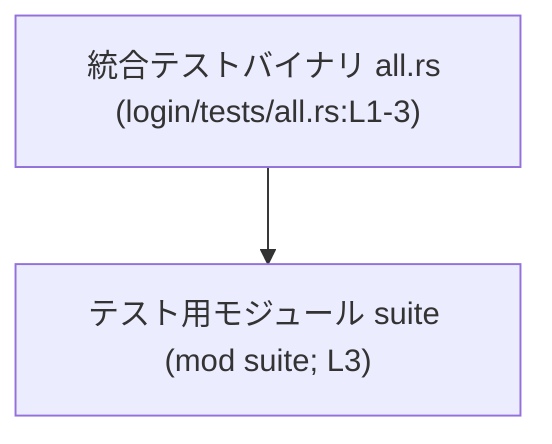

# login/tests/all.rs コード解説

## 0. ざっくり一言

`login/tests/all.rs` は、統合テスト（integration test）用の単一バイナリとして、テスト用サブモジュール群をまとめて取り込むためのエントリーファイルです（`login/tests/all.rs:L1-3`）。

---

## 1. このモジュールの役割

### 1.1 概要

- コメントによると、このファイルは「全テストモジュールを集約する単一の統合テストバイナリ」です（`login/tests/all.rs:L1`）。
- 実際のコードは `mod suite;` だけであり、この宣言によって `suite` モジュール（実体は `tests/suite/` 配下）がコンパイル対象に含まれます（`login/tests/all.rs:L2-3`）。

### 1.2 アーキテクチャ内での位置づけ

- Rust の慣習として、`tests/` ディレクトリ直下の `.rs` ファイルは「統合テストバイナリ」として扱われます。
- このファイルは統合テストバイナリ `all` のエントリとなり、その内部で `suite` モジュールを参照します（`mod suite;`、`login/tests/all.rs:L3`）。
- `suite` モジュールの中身（どのテストがあるか、どのアプリケーションコードに依存するか）は、このチャンクには現れません。

依存関係を簡略化した図は次のとおりです。



### 1.3 設計上のポイント

コードから読み取れる特徴は次のとおりです。

- **役割の限定**  
  - このファイルは実行ロジックやテスト関数を持たず、テストモジュールの集約専用になっています（`login/tests/all.rs:L1-3`）。
- **モジュール分割**  
  - 実際のテストコードは `suite` モジュール以下（`tests/suite/` 配下）に分離され、このファイルには置かれていません（`login/tests/all.rs:L2-3`）。
- **エラーハンドリング・並行性**  
  - 実行時の処理がないため、このファイル単体では実行時エラーハンドリングや並行処理は行いません。
  - コンパイル時には、`mod suite;` に対応するファイルが存在しない場合、コンパイルエラーになるという Rust 言語仕様上の前提があります（`mod suite;`、`login/tests/all.rs:L3`）。

---

## 2. 主要な機能一覧

このファイル単体で提供している機能は次の 1 点のみです。

- **テストモジュールの集約**: `suite` モジュールを取り込むことで、`tests/suite/` 配下のテスト群を 1 つの統合テストバイナリにまとめる（`login/tests/all.rs:L2-3`）。

### 2.1 コンポーネントインベントリー

このチャンク内に現れるコンポーネント（クレートルート・モジュール）の一覧です。

| 名前 | 種別 | 定義場所 | 根拠 | 説明 |
|------|------|----------|------|------|
| （統合テストバイナリ `all`） | クレートルート（統合テスト） | `login/tests/all.rs:L1-3` | ファイルパスとコメント | `tests/` 直下のファイルとして、単一の統合テストバイナリを形成するエントリです。 |
| `suite` | モジュール | `login/tests/all.rs:L3-3` | `mod suite;` | テスト用サブモジュール群をまとめるためのモジュールです。実体はコメントによれば `tests/suite/` 配下にあります（`login/tests/all.rs:L2`）。 |

- 構造体・列挙体・関数・メソッドはこのチャンクには定義されていません（`login/tests/all.rs:L1-3`）。

---

## 3. 公開 API と詳細解説

### 3.1 型一覧（構造体・列挙体など）

このファイルには構造体・列挙体・型エイリアスなどの定義は存在しません（`login/tests/all.rs:L1-3`）。

### 3.2 関数詳細（最大 7 件）

このファイルには関数・メソッド・`#[test]` 関数などは定義されていません（`login/tests/all.rs:L1-3`）。  
したがって、このセクションで詳述すべき関数はありません。

### 3.3 その他の関数

- なし（このチャンクには関数定義が存在しません）。

---

## 4. データフロー

このファイルには実行時ロジックがないため、「実行時データフロー」は存在しません。  
代わりに、コンパイル時のモジュール解決フローを整理します。

### 4.1 コンパイル時のモジュール解決フロー

Rust コンパイラがこのテストバイナリをビルドするときの流れを、コンパイル時データフローとして表現すると次のようになります。

```mermaid
sequenceDiagram
    participant Compiler as "コンパイラ（外部）"
    participant All as "all.rs (login/tests/all.rs:L1-3)"
    participant Suite as "mod suite (login/tests/all.rs:L3)"

    Compiler->>All: all.rs を読み込む
    All-->>Compiler: モジュール宣言 `mod suite;` を提供
    Compiler->>Suite: 対応する `suite` モジュールファイルを探索・読み込み（tests/suite/）
```

- この図はあくまで **コンパイル時** の関係を示します。
- 実際のテスト実行時には、`suite` モジュール内に定義された `#[test]` 関数群がテストハーネスから呼び出されますが、それらはこのチャンクには現れないため具体的な流れは不明です。

---

## 5. 使い方（How to Use）

### 5.1 基本的な使用方法

このファイル自体は直接呼び出す API を持たず、`cargo test` を実行した際にテストハーネスから自動的に利用されます。

- `cargo test` 実行時に、`tests/all.rs` としてこのファイルが統合テストバイナリ `all` としてコンパイルされます。
- `mod suite;` によって `suite` モジュール（`tests/suite/` 配下）が読み込まれ、その中に定義されたテストが実行対象になります（`login/tests/all.rs:L2-3`）。

このファイルに対して開発者が行う典型的な操作は、「新しいテストは `suite` モジュール側に追加し、このファイルはほぼ触らない」という使い方です。

### 5.2 よくある使用パターン

ここでは、あくまで参考として「テストモジュールを分割して管理する」パターンの一例を示します。  
以下は **このチャンクのコードではなく、利用イメージの例** です。

```rust
// login/tests/all.rs                                // 統合テストバイナリのエントリ
mod suite;                                           // tests/suite/ 以下のモジュール群を取り込む

// （参考例）tests/suite/mod.rs                     // suite モジュールの入口（このチャンクには存在しません）
mod user_login;                                      // ログイン関連テスト
mod password_reset;                                  // パスワードリセット関連テスト
```

このように、実際のテストケースは `tests/suite/` 配下の各モジュール（例: `user_login.rs`）に定義し、`all.rs` ではそれらをまとめて取り込む構造にできます。

### 5.3 よくある間違い

このファイルに関連して起こり得る典型的な誤りの例を示します。

```rust
// 誤り例: suite モジュールに対応するファイルが存在しない
// login/tests/all.rs
mod suite;   // tests/suite/mod.rs などがない場合、コンパイルエラーになる
```

```rust
// 正しい例: suite モジュールに対応するファイルを用意する
// login/tests/all.rs
mod suite;   // tests/suite/mod.rs が存在し、そこからさらにサブモジュールを定義する
```

- Rust では `mod suite;` と書くと、対応するファイル（`suite.rs` または `suite/mod.rs`）が必要になります。
- この対応ファイルがない場合、**コンパイル時エラー** となり、テストは実行できません。

### 5.4 使用上の注意点（まとめ）

- **前提条件**
  - `mod suite;` に対応する `suite` モジュールのファイルが `tests/suite/` 配下に存在している必要があります（`login/tests/all.rs:L2-3`）。
- **エラー条件**
  - `suite` モジュールが見つからない場合はコンパイルエラーになります。これは実行時ではなくビルド時に検出されます。
- **並行性・安全性**
  - このファイルには並行処理や共有状態は存在せず、安全性に関する Rust 特有の懸念（所有権・借用など）の対象となる処理もありません。
  - 実際のテストの並行実行は `cargo test` とテストハーネスの設定に依存しますが、ここからは分かりません。

---

## 6. 変更の仕方（How to Modify）

### 6.1 新しい機能（テスト群）を追加する場合

このファイルは最小限のエントリのみを持つため、新しいテスト機能の追加は主に `suite` モジュール側で行うと考えられます。

一般的な手順（このチャンクから推測できる範囲の抽象的な説明）は次のとおりです。

1. `tests/suite/` 配下に新しいテストモジュール用の `.rs` ファイルを追加する。  
   （実際のファイル名・構成はこのチャンクには現れません。）
2. `suite` モジュールの中からそのモジュールを `mod` として取り込む。  
3. 新しいテストケース（`#[test]` 関数など）はそのサブモジュール内に定義する。

このファイル `all.rs` に手を入れる必要があるのは、`suite` 以外の別名モジュールを入口にしたい、といった構成変更を行う場合のみです。

### 6.2 既存の機能を変更する場合

`all.rs` 自体の変更点は限定的です。

- **`suite` というモジュール名を変更したい場合**
  - `mod suite;` を別名（例: `mod integration_suite;`）に変更する必要があります（`login/tests/all.rs:L3`）。
  - それに応じて、対応するファイル名（`integration_suite.rs` または `integration_suite/mod.rs`）も変更する必要があります。
- **影響範囲の確認**
  - このファイルからは `suite` モジュールへの一方向依存のみが見えるため、`suite` 側から逆参照されているかどうかは不明です。
  - 変更後は `cargo test` を実行し、ビルドエラーやテスト失敗の有無を確認することが前提になります。

---

## 7. 関連ファイル

このチャンク内のコメントと `mod` 宣言から、密接に関係すると分かるパスは次のとおりです。

| パス | 役割 / 関係 | 根拠 |
|------|-------------|------|
| `tests/suite/` | `suite` モジュールの実体が置かれるディレクトリ。全テストモジュールがここに集約されるとコメントされています。 | コメント「The submodules live in `tests/suite/`.」（`login/tests/all.rs:L2`） |
| `tests/all.rs`（本ファイル） | 単一の統合テストバイナリとして `suite` モジュールを取り込むエントリ。 | ファイルパスおよびコメント「Single integration test binary that aggregates all test modules.」（`login/tests/all.rs:L1`） |

- これ以外のアプリケーションコードやテストファイルとの関係は、このチャンクには現れません。

---

### まとめ（安全性・エラー・並行性の観点）

- **安全性**: 実行時のロジックがなく、データ構造も持たないため、このファイル単体でのメモリ安全性に関する懸念はありません。
- **エラー**: 主なエラーはコンパイル時の「`suite` モジュールが見つからない」エラーであり、実行時エラーやパニックを発生させるコードは含まれていません。
- **並行性**: スレッドや `async` を使用していないため、このファイル単体で並行性に関する挙動はありません。テストの並行実行はテストハーネス側の責務です。
