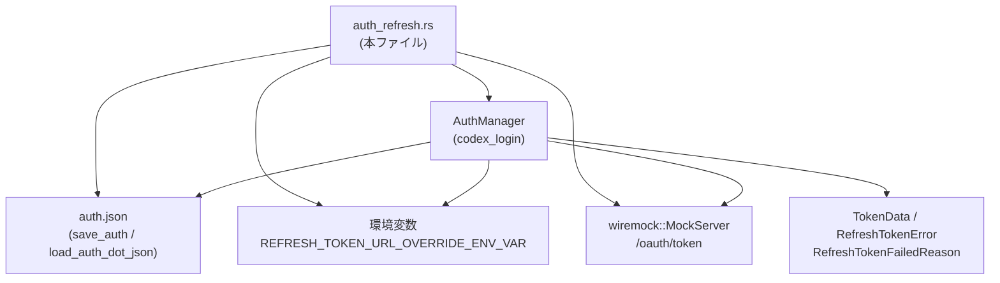
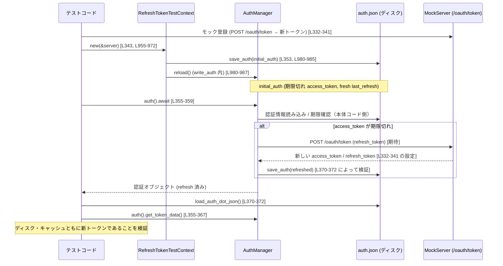

# login/tests/suite/auth_refresh.rs コード解説

## 0. ざっくり一言

このファイルは、`codex_login::AuthManager` の **トークン更新・キャッシュ・リカバリ動作** を、モック HTTP サーバーと一時ディレクトリを使って統合テストするためのスイートです。  
ローカルの `auth.json`、キャッシュされた認証情報、リフレッシュトークン API の応答がどのように連携するかを網羅的に検証しています。

---

## 1. このモジュールの役割

### 1.1 概要

- このモジュールは **AuthManager のリフレッシュトークン処理と未認証リカバリ処理** の仕様をテストで固定するために存在し、次のような機能を検証します。
  - 正常なトークン更新と `auth.json` への保存 [L33-94, L96-157, L327-384, L498-546]  
  - ディスク上の `auth.json` とメモリキャッシュの整合性、変更検知 [L159-211, L386-435, L437-494]  
  - 永続的エラー／一時的エラーの分類と再試行ポリシー [L496-612, L614-693, L695-744]  
  - `unauthorized_recovery()` による二段階リカバリ（ディスク再読込 → リフレッシュ）とその失敗シナリオ [L746-836, L838-915, L917-945]

### 1.2 アーキテクチャ内での位置づけ

このテストファイルは、`codex_login::AuthManager` を中心に、以下のコンポーネントとの連携を検証します。

- `AuthManager`（共有インスタンス、`Arc<AuthManager>`） [L948-952, L961-965]
- ローカル設定／資格情報ファイル `auth.json`（`save_auth` / `load_auth_dot_json`） [L12-13, L974-988]
- リフレッシュトークンエンドポイント（`REFRESH_TOKEN_URL_OVERRIDE_ENV_VAR` でモックサーバーへ差し替え） [L10, L955-960, L991-1004]
- `AuthMode`, `TokenData`, `RefreshTokenError`, `RefreshTokenFailedReason` といったプロトコル型 [L6, L11, L14-16]

依存関係を簡略化した図です。



### 1.3 設計上のポイント

コードから読み取れる特徴を列挙します。

- **一時ディレクトリと環境変数による完全なサンドボックス**  
  - 各テストは `TempDir` を使って独立した `codex_home` を持ち [L955-957], `REFRESH_TOKEN_URL_OVERRIDE_ENV_VAR` をモックサーバーの `/oauth/token` に設定して実行します [L955-960]。
- **テストの直列実行を前提とした環境変数ガード**  
  - `serial_test::serial(auth_refresh)` により、このファイル内のテストは同一「auth_refresh」キーで直列に実行されます [L33, L96, ...]。
  - `EnvGuard` が unsafe で `std::env::set_var/remove_var` を呼びますが、直列実行を前提としたコメントが添えられています [L997-1003, L1007-1015]。
- **エラーハンドリングと分類**  
  - テストの戻り値はすべて `anyhow::Result<()>` で、`Context` を使い失敗時に説明を付与しています [L35-37 など]。
  - `RefreshTokenError` が `Transient`（一時的エラー）かどうか、および `failed_reason()` が `Expired` / `Exhausted` / `Other` を返すことを検証しています [L524-531, L576-585, L721-728]。
- **トークンの状態と時刻に基づく挙動の検証**  
  - `chrono::Utc` と `Duration` を用い、リフレッシュタイムスタンプや JWT の `exp` クレームを変化させてエッジケースを作っています [L50-51, L298-299, L345-346, L394-405]。
- **JWT の簡易生成ユーティリティ**  
  - テスト用に `alg: "none"` なダミー JWT を構成するヘルパーがあります [L1019-1047]。署名や暗号検証は行っていません。

---

## 2. 主要な機能一覧

このファイルが検証する主な機能（= AuthManager の期待される振る舞い）を整理します。

- リフレッシュ成功時に `auth.json` とキャッシュを更新する  
  （`refresh_token_succeeds_updates_storage` [L33-94]）
- `auth.json` が外部で変更されていれば、リフレッシュをスキップして変更を採用する  
  （`refresh_token_skips_refresh_when_auth_changed` [L159-211]）
- キャッシュと `auth.json` の `account_id` が不一致な場合はエラーにする  
  （`refresh_token_errors_on_account_mismatch` [L213-279]）
- アクセストークンの有効期限に応じて、リフレッシュする／しないを切り替える  
  - 有効ならそのまま返す [L281-325]  
  - 期限切れなら即リフレッシュし、結果を保存する [L327-384]
- キャッシュが「古い」場合、ディスクの `auth.json` を再読込する  
  - リフレッシュ API を呼ばずにディスクを優先するケース [L386-435, L437-494]
- リフレッシュトークン関連のエラー種別ごとの扱い
  - `refresh_token_expired` → 永続的エラー (Expired) [L498-546]  
  - `refresh_token_reused` → 永続的エラー (Exhausted)、再試行しない [L548-612, L614-693]  
  - 500 エラー → 一時的エラー (Transient)、failed_reason は None [L695-744]
- `unauthorized_recovery()` による二段階リカバリ
  - 第 1 段: ディスクの `auth.json` 再読込 [L746-807]  
  - 第 2 段: リフレッシュ API を呼び、成功時は保存 [L812-832]
  - account mismatch や AuthMode が `Chatgpt` 以外の場合のエラー [L838-915, L917-945]
- テスト補助コンポーネント
  - `RefreshTokenTestContext` による共通セットアップ（tempdir, env, AuthManager） [L948-989]
  - `EnvGuard` による環境変数の設定／復元 [L991-1016]
  - JWT と `TokenData` を構築するヘルパー群 [L1019-1068]

---

## 3. 公開 API と詳細解説

このファイル自体に `pub` な API はありませんが、**テスト用コンポーネント** として事実上のインターフェースになっているもの（`RefreshTokenTestContext` など）と、AuthManager の振る舞いを規定する代表的なテスト関数を中心に説明します。

### 3.1 型一覧（構造体など）

| 名前 | 種別 | 役割 / 用途 | 定義位置 |
|------|------|-------------|----------|
| `RefreshTokenTestContext` | 構造体 | 各テストの共通セットアップ。`TempDir` と `AuthManager` の共有インスタンス、および環境変数ガードを保持する。 | `auth_refresh.rs:L948-952` |
| `EnvGuard` | 構造体 | 指定した環境変数の元の値を保存し、`Drop` 時に復元する RAII ガード。 | `auth_refresh.rs:L991-994` |
| `Header` | 構造体（ローカル） | `jwt_with_payload` 内部で使用する JWT ヘッダー表現。`alg`, `typ` フィールドを持つ。 | `auth_refresh.rs:L1020-1024` |

> `AuthDotJson`, `AuthManager`, `TokenData`, `IdTokenInfo`, `RefreshTokenError` などは他クレートからの依存であり、このチャンクには定義が現れません（用途のみ分かります） [L6, L8-11, L14-16]。

### 3.2 関数詳細（代表 7 件）

#### `refresh_token_succeeds_updates_storage() -> Result<()>` （テスト）  

位置: `auth_refresh.rs:L33-94`

**概要**

- リフレッシュトークン API への正常な応答により、新しいアクセストークン／リフレッシュトークンが `auth.json` とキャッシュに保存されることを検証します。

**引数**

- なし（テスト関数）

**戻り値**

- `anyhow::Result<()>`  
  - 成功時: `Ok(())`  
  - 失敗時: コンテキスト付きエラー（任意のステップで `?` / `.context()` により伝播）

**内部処理の流れ**

1. ネットワークが使えない環境ならテストをスキップする [L35-37]。
2. `MockServer` を起動し、`POST /oauth/token` に対して 200 で新トークンを返すモックを 1 回分登録する [L38-47]。
3. `RefreshTokenTestContext::new` で tempdir・環境変数・`AuthManager` をセットアップする [L49, L955-972]。
4. 古い `last_refresh` を持つ初期トークンを作成し、`auth.json` に書き込む [L50-58, L980-988]。
5. `auth_manager.refresh_token_from_authority().await` を呼び、リフレッシュ成功を期待する [L60-63]。
6. ディスクから `auth.json` を読み直し、新しいトークンが保存され `last_refresh` が更新されていることを確認する [L65-80, L974-978]。
7. `auth_manager.auth().await` から取得したキャッシュにも同じ新トークンが含まれることを確認する [L82-90]。
8. モックサーバに対して期待通り 1 回のリクエストのみがあったことを検証する [L92]。

**Examples（使用例）**

テスト内での典型的な呼び出しパターンは以下の通りです。

```rust
// コンテキストの作成
let ctx = RefreshTokenTestContext::new(&server)?;        // tempdir, env, AuthManager を準備

// 初期の auth.json を書き込み
ctx.write_auth(&initial_auth)?;                          // ディスクとキャッシュを初期化

// リフレッシュ実行（常に権限元を呼ぶ）
ctx.auth_manager
    .refresh_token_from_authority()
    .await
    .context("refresh should succeed")?;                 // 成功を期待
```

**Errors / Panics**

- `refresh_token_from_authority` が失敗した場合:
  - テストは `Err(_)` を返し、`"refresh should succeed"` というコンテキストで失敗します [L60-63]。
- `load_auth_dot_json`, `save_auth` が失敗した場合も同様に `?` で伝播されます [L58, L70]。

**Edge cases（エッジケース）**

- 古い `last_refresh`（1日前）でも、トークン自体の `exp` クレームはテスト中で考慮していません。このテストは **リフレッシュ成功シナリオ** に集中しています [L50-57]。
- `tokens` または `last_refresh` が `None` の場合はこのテストでは扱っていません（他のテストや本体コード側の仕様となります）。

**使用上の注意点**

- ここでの仕様は、「`refresh_token_from_authority` は必ずリモートを呼び、成功するとストレージとキャッシュを更新する」という契約を暗黙的に定義していると言えます。この契約を変える場合は、このテストも合わせて変更する必要があります。

---

#### `refresh_token_skips_refresh_when_auth_changed() -> Result<()>` （テスト）

位置: `auth_refresh.rs:L159-211`

**概要**

- `auth.json` がテスト開始後に外部から更新されていた場合、`AuthManager::refresh_token()` はリフレッシュ API を呼ばず、ディスク上の `auth.json` の内容を採用することを検証します。

**内部処理の流れ**

1. モックサーバを起動するが `/oauth/token` のモックは登録しない（呼ばれないことを期待） [L164]。
2. 初期 `auth.json` を書き込んで `AuthManager` にロードさせる [L167-175]。
3. `save_auth` を直接呼んで、`auth.json` に別のトークン (`disk_tokens`) を書き込む [L177-188]。
4. `auth_manager.refresh_token().await` を呼び、「リフレッシュはスキップされる」ことを期待する [L190-193]。
5. ディスクから読み直した `auth.json` が `disk_auth` と等しいことを確認（`refresh_token` がディスクを書き戻していない）[L195-197]。
6. `auth_manager.auth_cached()` のキャッシュ内容が `disk_tokens` であることを確認（ディスクの変更はキャッシュに反映される）[L198-205]。
7. モックサーバに対する受信リクエストが 0 件であることを確認 [L207-208]。

**Errors / Panics**

- `refresh_token()` がエラーを返すとテスト自体が失敗します [L190-193]。

**Edge cases**

- ディスクの `auth.json` はトークン内容のみ異なり、`account_id` は同じ `Some("account-id")` のままです [L168-173, L177-183]。
- `last_refresh` は初期値のままで、時刻の変化による挙動はこのテストでは見ていません。

**使用上の注意点**

- この挙動により、外部プロセスやユーザ操作によって `auth.json` が更新された場合に、AuthManager は「自分でリフレッシュする前にディスクの変更を尊重する」ことが保証されます。
- テストは「サーバーが呼ばれていないこと」を確認しているため [L207-208]、将来の変更で余計なリトライロジックを入れる際は注意が必要です。

---

#### `refresh_token_errors_on_account_mismatch() -> Result<()>` （テスト）

位置: `auth_refresh.rs:L213-279`

**概要**

- キャッシュされているトークンとディスク上の `auth.json` のトークンで `account_id` が異なる場合、`refresh_token()` は **永続的エラー (Other)** を返し、リフレッシュ API を呼ばないことを検証します。

**内部処理の流れ**

1. `/oauth/token` に対して成功応答を返すモックを登録するが、`expect(0)` として「呼ばれない」はずと設定する [L218-227]。
2. 初期 `auth.json` を書き込み、キャッシュには `account_id: "account-id"` のトークンが入る [L229-238, L1057-1067]。
3. `save_auth` でディスクの `auth.json` を上書きする。このとき `disk_tokens.account_id` を `Some("other-account")` に変更する [L240-247]。
4. `auth_manager.refresh_token().await` を呼び、エラーを取り出す [L254-259]。
5. そのエラーの `failed_reason()` が `Some(RefreshTokenFailedReason::Other)` であることを確認する [L260]。
6. ディスク上の `auth.json` は `disk_auth` のままであることを確認（リカバリのためにロールバックされない）[L262-263]。
7. サーバーへのリクエストが 0 件であることを確認 [L265-266]。
8. `auth_cached()` のキャッシュ内トークンは依然として初期トークンであり、ディスクの変更は反映されていないことを確認 [L268-275]。

**Errors / Panics**

- `refresh_token()` が返すエラーは `RefreshTokenError` であり、`failed_reason()` により `Other` と分類されます [L260]。
- `auth_cached()` が `None` を返した場合は `.context("auth should be cached after refresh")?` によりテストが失敗します [L268-271]。

**Edge cases**

- account mismatch が発生した場合:
  - ディスクは新しい（別アカウント）トークンを保持したまま [L240-247, L262-263]。
  - キャッシュは古い（元のアカウント）トークンを保持したまま [L268-275]。
- この状態は「人が誤って別アカウントの `auth.json` をコピーしてしまった」ような場面を想定していると考えられますが、コード上では意図のコメントはありません。

**使用上の注意点**

- AuthManager の利用者側から見ると、「アカウントが変わったように見えるがキャッシュは古いまま」という状態が起こりうるため、UI などでこのエラーをユーザに明示する必要があると解釈できます。
- テストは `expect(0)` でモックサーバが呼ばれないことを保証しているため、account mismatch → リモート問い合わせという挙動への変更はテスト破壊になります。

---

#### `refreshes_token_when_access_token_is_expired() -> Result<()>` （テスト）

位置: `auth_refresh.rs:L327-384`

**概要**

- アクセストークンの `exp` クレームがすでに過去である場合、`auth_manager.auth().await` の呼び出しによりトークンが自動的にリフレッシュされることを検証します。

**内部処理の流れ**

1. `/oauth/token` に対して「新しいトークン」を返すモックを登録する（1 回だけ期待）[L332-341]。
2. `access_token_with_expiration(Utc::now() - 1h)` で、有効期限が 1 時間前に切れているアクセストークンを生成する [L345-346, L1053-1055]。
3. そのトークンを含む `auth.json` を書き込み、`last_refresh` は 1 日前とする（リフレッシュ自体は比較的新しい）[L343-353]。
4. `auth_manager.auth().await` を呼び、その結果から `get_token_data()` でトークンを取り出す [L355-367]。
5. トークンがモックサーバから返ってきた新しい値（`"new-access-token"`, `"new-refresh-token"`）に置き換わっていることを検証する [L360-368]。
6. ディスクから読み直した `auth.json` の `tokens` も同じく更新されていること、および `last_refresh` が 1 日前以上に進んでいることを確認する [L370-380]。
7. モックサーバの `verify()` を呼び、期待通りの呼び出しがあったことを確認する [L382]。

**Edge cases**

- `last_refresh` は「まだ新しい」（1 日前）にもかかわらず、アクセストークンの期限切れによりリフレッシュが行われている点が重要です [L343-346]。
- つまり AuthManager は `last_refresh` だけでなく、トークン自身の `exp` の両方を見ていると推測されますが、判定ロジック自体はこのチャンクには現れません。

**使用上の注意点**

- 同様の仕様を依存側で前提とする場合、「`auth()` を呼べば、期限切れトークンは自動でリフレッシュされる」という契約に依存することになります。
- テストは `auth()` 呼び出し一発でリフレッシュまで終わる前提です [L355-367]。将来 `auth()` と `refresh()` を完全分離する設計変更があれば、このテストは見直し対象になります。

---

#### `refresh_token_does_not_retry_after_permanent_failure() -> Result<()>` （テスト）

位置: `auth_refresh.rs:L548-612`

**概要**

- リフレッシュトークン API が `refresh_token_reused` エラーを返した場合、AuthManager はこれを「永続的に消費されたトークン (Exhausted)」と扱い、**以降の `refresh_token()` 呼び出しではリモートへの再リクエストを行わない**ことを検証します。

**内部処理の流れ**

1. `/oauth/token` に対して 401 + `{ "error": { "code": "refresh_token_reused" } }` を返すモックを 1 回だけ登録する [L553-563]。
2. 初期トークンと `last_refresh` を含む `auth.json` を書き込む [L565-574]。
3. `refresh_token()` を 1 回呼び、エラーを取り出す [L576-581]。
   - `failed_reason()` が `Some(Exhausted)` であることを検証する [L582-585]。
4. `refresh_token()` を再度呼び、再び `Exhausted` エラーが返ることを確認する [L587-596]。
   - このときモックサーバは `expect(1)` であるため、2 回目にはリクエストが送られていないことになります。
5. ディスクの `auth.json` とキャッシュは初期のトークンのままであることを確認する [L598-608]。
6. `server.verify()` により、モックが 1 回だけ呼ばれたことを検証する [L610]。

**Errors / Panics**

- `refresh_token()` が `Ok` を返すとテスト失敗（期待値はエラー）です。`err().context("...")?` により「失敗すべき」という意図が明示されています [L576-581, L587-592]。

**Edge cases**

- 「永続的エラー後に再度 `refresh_token()` を呼んだ場合どうなるか」という挙動がここで規定されています。
- 2 回目以降も `Exhausted` が返りますが、**リモートへの問い合わせは行われません**（`expect(1)` により保証）[L553-563, L610]。

**使用上の注意点**

- 利用側は `Exhausted` を見た時点でユーザに再ログインや手動の再認証を促すべきと解釈できます。
- 「とりあえずリトライしてみる」という戦略は AuthManager 内部では抑止されており、このテストがその仕様を固定しています。

---

#### `unauthorized_recovery_reloads_then_refreshes_tokens() -> Result<()>` （テスト）

位置: `auth_refresh.rs:L746-836`

**概要**

- `AuthManager::unauthorized_recovery()` が返す「リカバリシーケンス」が 2 段階で動作することを検証します。
  1. 最初の `next()` でディスクから `auth.json` を再読込（サーバにはまだアクセスしない）。
  2. 2 回目の `next()` でリフレッシュトークン API を呼び、新トークンを保存。

**内部処理の流れ**

1. `/oauth/token` に成功応答（recovered トークン）を返すモックを 1 回登録する [L751-760]。
2. 初期 `auth.json`（`initial_tokens`）を `AuthManager` にロードさせる [L762-771]。
3. 別のトークン (`disk_tokens`) をディスクの `auth.json` に書き込む [L773-784]。
4. `auth_cached()` から取得したキャッシュは、まだ `initial_tokens` のままであることを確認する [L786-793]。
5. `let mut recovery = ctx.auth_manager.unauthorized_recovery();` でリカバリオブジェクトを取得し、`has_next()` が true であることを確認する [L795-796]。
6. `recovery.next().await?;` を呼ぶ。
   - これによりキャッシュがディスクの `disk_tokens` に更新されるが、リフレッシュ API は呼ばれない（後で 0 リクエストを確認）[L800-807, L809-810]。
7. 再度 `auth_cached()` を確認し、トークンが `disk_tokens` になっていることを確認する [L800-807]。
8. 次に `recovery.next().await?;` を呼び、今度はリフレッシュ API が呼ばれ、`recovered-*` のトークンが取得される [L812-819]。
9. ディスクの `auth.json` と `auth()` のキャッシュの両方が `recovered_tokens` であることを確認し [L819-831]、`recovery.has_next()` が false であることを確認する [L832]。
10. 最後に `server.verify()` でモックが 1 回だけ呼ばれたことを検証する [L834]。

**Edge cases**

- 第 1 段階ではサーバへのアクセスが一切行われません（`requests.is_empty()` で確認）[L809-810]。
- 第 2 段階後は、ディスク・キャッシュともにリフレッシュ結果で統一されます [L819-831]。

**使用上の注意点**

- 利用側は `unauthorized_recovery()` をループのように使うことを想定できます:
  - `while recovery.has_next() { recovery.next().await?; }`
- ただし、このチャンクには `unauthorized_recovery()` の具体的な戻り値の型や内部実装は現れません。テストが保証するのは **呼び出し順序と副作用** です。

---

#### `RefreshTokenTestContext::new(server: &MockServer) -> Result<Self>`

位置: `auth_refresh.rs:L954-972`

**概要**

- 各テストで共通となるセットアップ処理をカプセル化したコンストラクタです。
  - 一時ディレクトリ（`codex_home`）を作成し、
  - 環境変数 `REFRESH_TOKEN_URL_OVERRIDE_ENV_VAR` をモックサーバーの `/oauth/token` に設定し、
  - `AuthManager::shared` で共有インスタンスを初期化します。

**引数**

| 引数名 | 型 | 説明 |
|--------|----|------|
| `server` | `&MockServer` | wiremock の HTTP モックサーバー。`server.uri()` を使ってトークンエンドポイント URL を構成します。 |

**戻り値**

- `anyhow::Result<RefreshTokenTestContext>`
  - 成功時: `Ok(RefreshTokenTestContext { ... })`
  - 失敗時: `TempDir::new()` または `AuthManager::shared` の内部で発生したエラーをラップしたもの。

**内部処理の流れ**

1. `TempDir::new()` で一時ディレクトリを作成する [L955-957]。
2. `format!("{}/oauth/token", server.uri())` でリフレッシュトークンエンドポイントの URL を構成する [L958-959]。
3. `EnvGuard::set(REFRESH_TOKEN_URL_OVERRIDE_ENV_VAR, endpoint)` で環境変数を設定し、元の値を保持するガードを生成する [L958-960, L997-1004]。
4. `AuthManager::shared(codex_home.path().to_path_buf(), false, AuthCredentialsStoreMode::File)` で共有 AuthManager を得る [L961-965]。
5. これらを `RefreshTokenTestContext` のフィールドとしてまとめて `Ok(Self { ... })` を返す [L967-971]。

**Edge cases**

- `AuthManager::shared` の戻り値は `Arc<AuthManager>` であり、ここでは 1 インスタンスのみを保持しますが、`Arc` であることからスレッド間共有に耐える設計である可能性が示唆されます [L948-952, L961-965]。ただし、このチャンク内でマルチスレッド利用はされていません。

**使用上の注意点**

- テストごとに `TempDir` と `EnvGuard` が生成され、`Drop` によりクリーンアップされます。`codex_home` のパスや環境変数はテスト間で干渉しない設計です。
- 本番コード側で `REFRESH_TOKEN_URL_OVERRIDE_ENV_VAR` を利用していることが前提であり、この環境変数を無視するような変更をするとテストが意味を失う可能性があります。

---

### 3.3 その他の関数（インベントリー）

テスト・ヘルパーを含む残りの関数を一覧にします。

| 関数名 | 種別 | 役割（1 行） | 位置 |
|--------|------|--------------|------|
| `refresh_token_refreshes_when_auth_is_unchanged` | テスト | auth が変更されていない場合に `refresh_token()` が正常にリフレッシュを行い、ストレージとキャッシュを更新することを検証。 | `L96-157` |
| `returns_fresh_tokens_as_is` | テスト | アクセストークンがまだ有効な場合に、リフレッシュ API を呼ばずに既存トークンを返すことを検証。 | `L281-325` |
| `auth_reloads_disk_auth_when_cached_auth_is_stale` | テスト | キャッシュの `last_refresh` が古い場合に、ディスクの `auth.json` を再読込することを検証。 | `L386-435` |
| `auth_reloads_disk_auth_without_calling_expired_refresh_token` | テスト | キャッシュが古い場合でも、ディスクに新しい auth があれば `refresh_token_expired` エラーを持つサーバーを呼ばないことを検証。 | `L437-494` |
| `refresh_token_returns_permanent_error_for_expired_refresh_token` | テスト | リフレッシュ API が `refresh_token_expired` を返した場合に、`Expired` として扱い、ストレージ・キャッシュが変化しないことを検証。 | `L498-546` |
| `refresh_token_reloads_changed_auth_after_permanent_failure` | テスト | 一度 `Exhausted` 状態になった後でも、ディスクの auth が変われば `refresh_token()` がそれを再読込することを検証。 | `L614-693` |
| `refresh_token_returns_transient_error_on_server_failure` | テスト | サーバー 500 エラーが `RefreshTokenError::Transient` として扱われ、`failed_reason()` が `None` になることを検証。 | `L695-744` |
| `unauthorized_recovery_errors_on_account_mismatch` | テスト | `unauthorized_recovery()` の第 1 段階でディスクの `account_id` が異なる場合、`Other` エラーとなりサーバーは呼ばれないことを検証。 | `L838-915` |
| `unauthorized_recovery_requires_chatgpt_auth` | テスト | `AuthMode::ApiKey` の場合に `unauthorized_recovery()` が何も行えず `Other` エラーを返すことを検証。 | `L917-945` |
| `RefreshTokenTestContext::load_auth` | メソッド | `auth.json` をロードし、存在しない場合はエラーに変換する。 | `L974-978` |
| `RefreshTokenTestContext::write_auth` | メソッド | `auth.json` に書き込み、`auth_manager.reload()` を呼んでキャッシュを更新する。 | `L980-988` |
| `EnvGuard::set` | 関数 | 環境変数の現在値を保存し、新しい値を設定する（unsafe）。 | `L997-1004` |
| `impl Drop for EnvGuard::drop` | メソッド | `Drop` 実装。元の環境変数の値を復元または削除する（unsafe）。 | `L1007-1015` |
| `jwt_with_payload` | ヘルパー | 与えられた JSON ペイロードから、`alg: "none"` なダミー JWT を構成する。 | `L1019-1047` |
| `minimal_jwt` | ヘルパー | `{"sub": "user-123"}` のみを含む最小構成の JWT を生成する。 | `L1049-1051` |
| `access_token_with_expiration` | ヘルパー | `sub` と `exp` クレームを含む JWT アクセストークンを生成する。 | `L1053-1055` |
| `build_tokens` | ヘルパー | `IdTokenInfo` とアクセストークン／リフレッシュトークン／`account_id` を含む `TokenData` を構築する。 | `L1057-1067` |

---

## 4. データフロー

### 4.1 代表的なシナリオ: 期限切れアクセストークンの自動リフレッシュ

`refreshes_token_when_access_token_is_expired` テストを例に、データフローを示します [L327-384]。



要点:

- テストは **期限切れの access_token を含む auth.json** を事前に書き込みます [L345-353]。
- `auth().await` を呼ぶだけで、AuthManager は自らアクセストークンの期限を検査し、必要ならリフレッシュ API を叩きます（テストはその結果だけを検証）[L355-368]。
- ディスクとキャッシュが共に更新されていることが検証され、**状態管理の一貫性** が保証されています [L370-380]。

---

## 5. 使い方（How to Use）

### 5.1 基本的な使用方法（テストコンテキスト）

このモジュール内での基本的なパターンは「コンテキストを作る → 初期 auth を書く → AuthManager に操作させる → ディスク／キャッシュを検証する」です。

```rust
// モックサーバーの起動
let server = MockServer::start().await;                 // wiremock サーバーを起動 [L38, L101, 他]

// コンテキスト構築（tempdir + 環境変数 + AuthManager）
let ctx = RefreshTokenTestContext::new(&server)?;       // [L955-972]

// 初期 auth.json を構築して書き込む
let initial_tokens = build_tokens(INITIAL_ACCESS_TOKEN, INITIAL_REFRESH_TOKEN); // [L51, L1057-1067]
let initial_auth = AuthDotJson {
    auth_mode: Some(AuthMode::Chatgpt),
    openai_api_key: None,
    tokens: Some(initial_tokens.clone()),
    last_refresh: Some(Utc::now() - Duration::days(1)),
};
ctx.write_auth(&initial_auth)?;                         // ディスクとキャッシュへ反映 [L980-988]

// AuthManager のメイン操作を呼び出す（例: リフレッシュ）
ctx.auth_manager.refresh_token().await?;                // 本体 API の呼び出し [L190-193]

// ディスクとキャッシュの状態を検証
let stored = ctx.load_auth()?;                          // auth.json を再読込 [L974-978]
let cached = ctx.auth_manager.auth().await?;            // キャッシュされた認証情報 [L355-359]
```

### 5.2 よくある使用パターン

1. **リフレッシュ成功パターン**

   - `MockServer` に成功応答を登録し、`refresh_token()` または `refresh_token_from_authority()` を呼び、ディスクとキャッシュの更新を確認する [L33-94, L96-157]。

2. **ディスク変更優先パターン**

   - `ctx.write_auth(...)` で一度読み込ませた後、`save_auth` を直接呼んで `auth.json` を変更し、`refresh_token()` や `auth()` で「ディスクの値が採用される」ことを確認する [L159-211, L386-435, L437-494]。

3. **エラー分類パターン**

   - `401 + code: refresh_token_expired` → `Expired` [L498-546]  
   - `401 + code: refresh_token_reused` → `Exhausted` （以降リトライなし）[L548-612, L614-693]  
   - `500` → `Transient` [L695-744]

   これらのテストパターンは、AuthManager のエラー分類仕様に依存しています。

4. **未認証リカバリシーケンス**

   - `let mut recovery = auth_manager.unauthorized_recovery();`  
   - `while recovery.has_next() { recovery.next().await?; }` のように二段階で処理し、account mismatch や AuthMode などに応じたエラー動作を確認する [L746-836, L838-915, L917-945]。

### 5.3 よくある間違い（テスト観点）

テストから推測できる「誤用になりそうなパターン」とその正しい使い方です。

```rust
// 誤り例: AuthMode が Chatgpt でないのに unauthorized_recovery を使う
let auth = AuthDotJson {
    auth_mode: Some(AuthMode::ApiKey),                 // Chatgpt ではない [L925]
    openai_api_key: Some("sk-test".to_string()),
    tokens: None,
    last_refresh: None,
};
ctx.write_auth(&auth)?;
let mut recovery = ctx.auth_manager.unauthorized_recovery();
assert!(recovery.has_next());                          // ← 実際は false になる [L932-933]

// 正しい例: Chatgpt モードでトークンを扱う場合のみ unauthorized_recovery を使う
let auth = AuthDotJson {
    auth_mode: Some(AuthMode::Chatgpt),                // Chatgpt モード [L765]
    openai_api_key: None,
    tokens: Some(initial_tokens),
    last_refresh: Some(Utc::now()),
};
ctx.write_auth(&auth)?;
let mut recovery = ctx.auth_manager.unauthorized_recovery();
if recovery.has_next() {
    recovery.next().await?;                            // ディスク再読込 or リフレッシュ試行
}
```

### 5.4 使用上の注意点（まとめ）

- **AuthMode の前提**  
  - `unauthorized_recovery()` は `AuthMode::Chatgpt` のときのみ意味を持ち、`ApiKey` では `Other` エラーになります [L917-945]。
- **account_id の一致**  
  - キャッシュとディスクで `account_id` が異なる場合、リフレッシュやリカバリは `Other` エラーとなり、サーバーには問い合わせません [L213-279, L838-915]。
- **永続的エラーと再試行**  
  - `refresh_token_reused` / `Exhausted` の後は、`refresh_token()` はリモートへの再アクセスを行わずに同じエラーを返しますが、ディスクの `auth.json` が更新されれば再び正常に動作します [L548-612, L614-693]。
- **環境変数の扱いと並行性**  
  - `EnvGuard` は unsafe でプロセス環境を書き換えているため、**直列実行前提** です。`serial_test` アトリビュートが外されるとテスト間で干渉する可能性があります [L997-1004, L1007-1015]。
- **JWT のセキュリティ**  
  - `jwt_with_payload` は `alg: "none"` かつ固定署名 `"sig"` を用いるテスト専用ユーティリティであり、本番環境での利用を前提としていません [L1019-1047]。

---

## 6. 変更の仕方（How to Modify）

### 6.1 新しいテストケースを追加する場合

1. **目的の整理**
   - 追加したいシナリオ（例: 異なる HTTP ステータスやエラーコード、`last_refresh` の境界値など）を明確にします。

2. **モックサーバ設定**
   - `MockServer::start().await` でサーバを起動し [L38, L101 など]、`Mock::given(method("POST")).and(path("/oauth/token"))` で新しい応答パターンを登録します。

3. **コンテキスト準備**
   - `let ctx = RefreshTokenTestContext::new(&server)?;` を使って一貫したセットアップを行います [L49, L112, 他]。

4. **初期 `auth.json` の構築**
   - 必要なら `build_tokens`, `access_token_with_expiration`, `minimal_jwt` を用いてトークンを作成し [L1053-1067]、`ctx.write_auth(&auth)?` で保存します。

5. **AuthManager API の呼び出し**
   - 目的に応じて `auth()`, `auth_cached()`, `refresh_token()`, `refresh_token_from_authority()`, `unauthorized_recovery()` のいずれかを利用します [L60-63, L123-126, L355-359, L786-796 など]。

6. **検証**
   - ディスク (`ctx.load_auth()?`) とキャッシュ (`auth().await`, `auth_cached()`) の両方を確認し、モックサーバの `received_requests()` や `verify()` で期待通りの HTTP 交信であることを検証します [L207-208, L431-432, L610, L834]。

### 6.2 既存の機能を変更する場合（AuthManager 側を含む）

このテストファイルは AuthManager の契約をかなり詳細に固定しているため、実装を変更する際は以下に注意する必要があります。

- **影響範囲の確認**
  - 変更対象となる挙動に対応するテスト関数を特定し（例: リフレッシュエラー分類なら L498-546, L548-612, L695-744）、それらの期待をどう変えるかを判断します。
- **契約の明示**
  - 例えば `refresh_token_reused` を今後リトライ可能エラーと扱うようにするなら、`refresh_token_does_not_retry_after_permanent_failure` の仕様変更が必要です [L548-612]。
- **ディスク／キャッシュの整合性**
  - `auth.json` の読み書き仕様を変える場合、`auth_reloads_disk_auth_*` 系テストと `RefreshTokenTestContext::write_auth` / `load_auth` を確認します [L386-435, L437-494, L974-988]。
- **並行性の変更**
  - AuthManager を別スレッドからも使うようにするなどの変更を行う場合、このファイルのテスト自体は全て直列実行前提で書かれているため、新たな並行性テストを追加する必要がある可能性があります。

---

## 7. 関連ファイル

このモジュールと密接に関係する外部ファイル・クレートをまとめます（このチャンクには実装は現れません）。

| パス / クレート | 役割 / 関係 |
|-----------------|------------|
| `codex_login::AuthManager` | 認証情報のロード・キャッシュ・リフレッシュ・未認証リカバリの中心的なコンポーネント。テストの主対象です [L9, L948-952]。 |
| `codex_login::AuthDotJson` | `auth.json` のシリアライズ／デシリアライズに使われる型。AuthMode, API キー, トークン, last_refresh などを保持します [L8, L52-57]。 |
| `codex_login::token_data::{TokenData, IdTokenInfo}` | アクセス／リフレッシュトークンや ID トークン情報を表現する型。`build_tokens` ヘルパーが利用します [L14-15, L1057-1067]。 |
| `codex_login::RefreshTokenError` | リフレッシュ失敗時のエラー型。`Transient` / 永続エラー区別や `failed_reason()` がテストされています [L11, L524-531, L576-585, L721-728]。 |
| `codex_protocol::auth::RefreshTokenFailedReason` | `Expired`, `Exhausted`, `Other` など、失敗理由を表す列挙体。テストはこれを通じてエラー分類を検証します [L16, L260, L530, L582-585, L650-651, L727-728, L896, L940]。 |
| `codex_config::types::AuthCredentialsStoreMode` | 認証情報の保存モードを表す型。ここでは常に `AuthCredentialsStoreMode::File` が使われています [L7, L184-188, L248-252, L413-416 など]。 |
| `core_test_support::skip_if_no_network` | ネットワーク利用可能性に応じてテストをスキップするマクロ。全テスト先頭で利用されています [L17, L35, L99, 他]。 |
| `wiremock` クレート (`MockServer`, `Mock`, `ResponseTemplate`) | `/oauth/token` エンドポイントの挙動をシミュレートする HTTP モックライブラリです [L24-27, L38-47 他]。 |

このファイルは、これら外部コンポーネントの仕様を **テストとして固定するドキュメント** として機能しており、AuthManager のリフレッシュまわりの契約・エッジケースを理解するための有用な参考になります。
