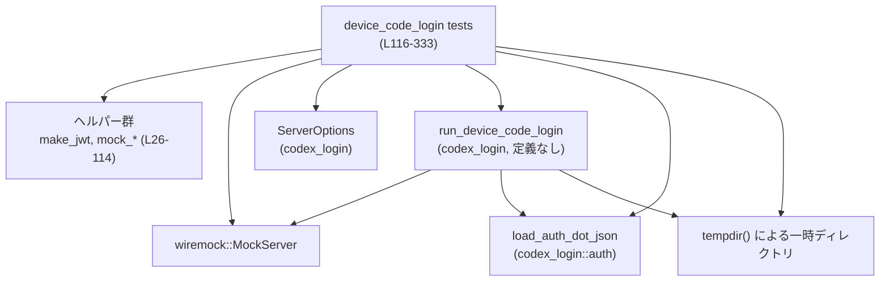
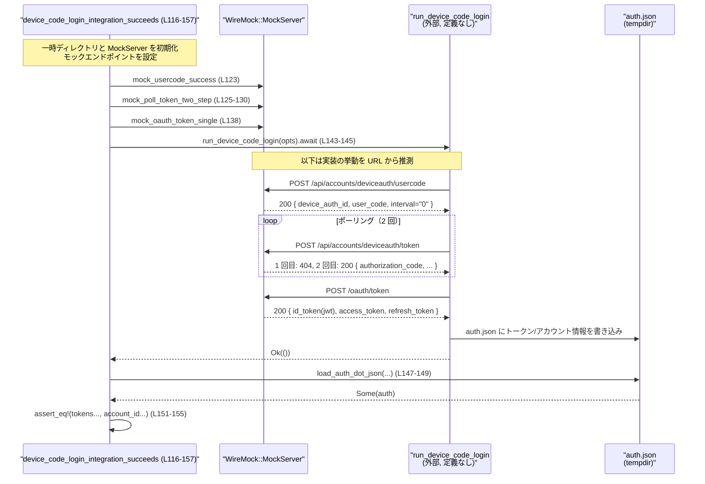

# login/tests/suite/device_code_login.rs コード解説

## 0. ざっくり一言

`run_device_code_login` のデバイスコード認証フローを WireMock でエンドツーエンドに模擬し、成功・失敗・エラー応答などのシナリオを検証する非同期統合テスト群です。  
モック HTTP サーバーと一時ディレクトリを使い、`auth.json` へのトークン永続化動作まで含めて確認します。

---

## 1. このモジュールの役割

### 1.1 概要

- このモジュールは **デバイスコードログイン(`run_device_code_login`)の外部挙動** を検証する統合テストを提供します。
- WireMock による HTTP モックを使い、以下の点を確認しています。
  - 正常なデバイスコードフローでトークンとアカウント ID が `auth.json` に保存されること（成功ケース）。`login/tests/suite/device_code_login.rs:L116-157`
  - 強制ワークスペース ID とトークン内のワークスペース ID が不一致な場合に `PermissionDenied` エラーになり、`auth.json` が作成されないこと。`login/tests/suite/device_code_login.rs:L159-200`
  - ユーザーコード取得 API やデバイス認証トークン API のエラー応答時にエラーが伝播し、`auth.json` が作成されないこと。`login/tests/suite/device_code_login.rs:L202-231, L281-333`
  - ID トークンに OpenAI API キー情報が含まれない場合でも、アクセストークン等は永続化されること。`login/tests/suite/device_code_login.rs:L233-279`

### 1.2 アーキテクチャ内での位置づけ

このテストモジュールは、`codex_login` クレートの公開 API をブラックボックス的に検証する位置づけです。



- テストは `ServerOptions` を構築し (`server_opts` / 直接 `ServerOptions::new`) `run_device_code_login` を呼び出します。`login/tests/suite/device_code_login.rs:L100-114, L116-157, L233-279, L281-315`
- HTTP 通信はすべて WireMock の `MockServer` に向けられ、実際の外部サービスにはアクセスしません。`login/tests/suite/device_code_login.rs:L34-45, L47-53, L55-78, L80-86, L88-98, L121-123`
- ログイン結果は `auth.json` として一時ディレクトリに保存され、それを `load_auth_dot_json` で読み出して検証しています。`login/tests/suite/device_code_login.rs:L147-155, L193-197, L224-229, L270-277, L326-331`

### 1.3 設計上のポイント

- **ヘルパーによる責務分離**  
  - JWT 生成、各エンドポイントのモック設定、`ServerOptions` 構築をそれぞれ専用関数に分離し、個々のテストの見通しを良くしています。`login/tests/suite/device_code_login.rs:L26-114`
- **非同期 & モックサーバー**  
  - すべてのテストは `#[tokio::test]` で非同期に実行され、WireMock の非同期 API を利用しています。`login/tests/suite/device_code_login.rs:L116, L159, L202, L233, L281`
- **並行性の安全性**  
  - ポーリング回数を管理するために `Arc<AtomicUsize>` と `Ordering::SeqCst` を使用し、WireMock のリクエストハンドラから安全に共有カウンタを操作しています。`login/tests/suite/device_code_login.rs:L55-65`
- **エラーハンドリング**  
  - テスト自身は `anyhow::Result<()>` を返し、I/O などのエラーに `anyhow::Context` で文脈を付与しています。`login/tests/suite/device_code_login.rs:L117, L160, L203, L235, L282`
  - 被テスト関数 `run_device_code_login` は `Result` を返し、テスト側で `expect` / `expect_err` / `assert!` によって期待される挙動を検証します。`login/tests/suite/device_code_login.rs:L143-145, L188-191, L215-221, L266-268, L316-323`
- **セキュリティ前提**  
  - テストでは `"alg": "none"` の JWT を生成し署名検証をモックしており、本番コード側が実際の署名検証を担う前提のシナリオになっています。`login/tests/suite/device_code_login.rs:L26-31`
- **ネットワーク環境依存の回避**  
  - すべてのテストの冒頭で `skip_if_no_network!` マクロを呼び出し、ネットワーク利用不可な環境ではテストをスキップする想定です（マクロ定義はこのチャンクには現れません）。`login/tests/suite/device_code_login.rs:L118, L161, L204, L236, L283`

---

## 2. 主要な機能一覧（コンポーネントインベントリー）

### 関数・テストの一覧

| 名前 | 種別 | 役割 / 用途 | 定義位置 |
|------|------|-------------|----------|
| `make_jwt` | 同期ヘルパー関数 | 任意の JSON ペイロードから署名なし JWT 文字列を生成する | `login/tests/suite/device_code_login.rs:L26-32` |
| `mock_usercode_success` | 非同期ヘルパー関数 | `/api/accounts/deviceauth/usercode` の成功レスポンスをモックする | `login/tests/suite/device_code_login.rs:L34-45` |
| `mock_usercode_failure` | 非同期ヘルパー関数 | `/api/accounts/deviceauth/usercode` の任意ステータス失敗レスポンスをモックする | `login/tests/suite/device_code_login.rs:L47-53` |
| `mock_poll_token_two_step` | 非同期ヘルパー関数 | `/api/accounts/deviceauth/token` が最初はエラー、2 回目に成功する 2 段階レスポンスをモックする | `login/tests/suite/device_code_login.rs:L55-78` |
| `mock_poll_token_single` | 非同期ヘルパー関数 | 指定エンドポイントに対する単一レスポンスのモックを作成する | `login/tests/suite/device_code_login.rs:L80-86` |
| `mock_oauth_token_single` | 非同期ヘルパー関数 | `/oauth/token` の成功レスポンスをモックし、ID/アクセス/リフレッシュトークンを返す | `login/tests/suite/device_code_login.rs:L88-98` |
| `server_opts` | 同期ヘルパー関数 | テスト用に `ServerOptions` を初期化し、`issuer` と `open_browser` を設定する | `login/tests/suite/device_code_login.rs:L100-114` |
| `device_code_login_integration_succeeds` | 非同期テスト | 正常なデバイスコードログインでトークンとアカウント ID が `auth.json` に保存されることを検証 | `login/tests/suite/device_code_login.rs:L116-157` |
| `device_code_login_rejects_workspace_mismatch` | 非同期テスト | JWT 内の `organization_id` が強制ワークスペース ID と異なる場合に `PermissionDenied` になることを検証 | `login/tests/suite/device_code_login.rs:L159-200` |
| `device_code_login_integration_handles_usercode_http_failure` | 非同期テスト | ユーザーコード取得 API が HTTP エラーを返した場合にエラーが伝播し `auth.json` が作成されないことを検証 | `login/tests/suite/device_code_login.rs:L202-231` |
| `device_code_login_integration_persists_without_api_key_on_exchange_failure` | 非同期テスト | ID トークンに API キー情報がなくても、取得済みトークンが永続化されることを検証 | `login/tests/suite/device_code_login.rs:L233-279` |
| `device_code_login_integration_handles_error_payload` | 非同期テスト | デバイス認証トークン API が 401 とエラー JSON を返す場合にエラーが伝播し `auth.json` が作成されないことを検証 | `login/tests/suite/device_code_login.rs:L281-333` |

---

## 3. 公開 API と詳細解説

### 3.1 型一覧（構造体・列挙体など）

このファイル内で **新たに定義されている構造体・列挙体はありません**。  
利用している主な外部型のみ列挙します（定義は他モジュールにあり、このチャンクには現れません）。

| 名前 | 種別 | 役割 / 用途 | 備考 |
|------|------|-------------|------|
| `ServerOptions` | 構造体 | `run_device_code_login` に渡す設定。ホームディレクトリ、クライアント ID、issuer などを保持 | `codex_login` クレートからインポート (`login/tests/suite/device_code_login.rs:L7, L100-113`) |
| `AuthCredentialsStoreMode` | 列挙体と推測 | 認証情報の保存モード（ファイル等）を表すと考えられますが、このチャンクには定義がありません | `login/tests/suite/device_code_login.rs:L6, L141, L185, L213, L261, L311` |
| `MockServer` | 構造体 | WireMock の HTTP モックサーバー | `login/tests/suite/device_code_login.rs:L16, L121, L164, L207, L240, L288` |
| `ResponseTemplate` | 構造体 | WireMock で HTTP レスポンス内容を指定するテンプレート | `login/tests/suite/device_code_login.rs:L18, L37-42, L50, L68-72, L83, L91-95, L296-299` |
| `AtomicUsize` | 構造体 | スレッド安全な整数カウンタ。ポーリング回数の管理に利用 | `login/tests/suite/device_code_login.rs:L12, L57-65` |
| `Arc<T>` | スマートポインタ | 参照カウント付き共有ポインタ。`AtomicUsize` を WireMock ハンドラと共有 | `login/tests/suite/device_code_login.rs:L11, L57, L60, L127, L170, L246` |

> 備考: 外部型の役割は名称と利用箇所からの推測であり、正確な定義は各クレート側のコードに依存します。

---

### 3.2 関数詳細（重要な 7 件）

#### `make_jwt(payload: serde_json::Value) -> String`

**定義位置**

- `login/tests/suite/device_code_login.rs:L26-32`

**概要**

- 渡された JSON ペイロードから、署名アルゴリズム `"none"` を使った 3 部構成の JWT 文字列（`header.payload.signature`）を生成します。`login/tests/suite/device_code_login.rs:L26-31`
- テスト用のトークン生成にのみ使用されます（署名検証は想定していません）。

**引数**

| 引数名 | 型 | 説明 |
|--------|----|------|
| `payload` | `serde_json::Value` | JWT のペイロード部分に埋め込む JSON 値 |

**戻り値**

- `String`: Base64 URL-safe 形式（パディングなし）でヘッダ・ペイロード・固定シグネチャを連結した JWT 文字列。`login/tests/suite/device_code_login.rs:L28-31`

**内部処理の流れ**

1. ヘッダとして `{"alg": "none", "typ": "JWT"}` を定義。`login/tests/suite/device_code_login.rs:L27`
2. ヘッダを JSON → バイト列にシリアライズし、URL-safe な Base64（パディング無し）でエンコード。`login/tests/suite/device_code_login.rs:L28`
3. ペイロードも同様に JSON → バイト列 → Base64 エンコード。`login/tests/suite/device_code_login.rs:L29`
4. 文字列 `"sig"` を Base64 エンコードして署名部分とする。`login/tests/suite/device_code_login.rs:L30`
5. 3 部分を `"header.payload.signature"` 形式に連結。`login/tests/suite/device_code_login.rs:L31`

**Examples（使用例）**

テスト内での利用例:

```rust
// ChatGPT アカウント ID のみを含む JWT を生成
let jwt = make_jwt(json!({
    "https://api.openai.com/auth": {
        "chatgpt_account_id": "acct_321"
    }
})); // login/tests/suite/device_code_login.rs:L132-136
```

**Errors / Panics**

- `serde_json::to_vec` の結果に対して `unwrap()` を呼び出しているため、シリアライズに失敗すると panic します。`login/tests/suite/device_code_login.rs:L28-29`
  - テストではリテラル `json!` から生成した妥当な JSON だけを渡しているため、通常は発生しません。

**Edge cases（エッジケース）**

- 空ペイロード `{}` を渡した場合でも、形式上は有効な JWT 文字列が生成されます。実際にそのケースが `device_code_login_integration_persists_without_api_key_on_exchange_failure` で使用されています。`login/tests/suite/device_code_login.rs:L251-253`
- ペイロードにどのようなフィールドを入れるかはテスト側の責務であり、この関数は内容を解釈しません。

**使用上の注意点**

- `"alg": "none"` を使用しているため、本番環境で受け入れるべきトークン形式ではなく、あくまでテスト用の簡易 JWT 生成関数です。
- 署名検証を伴う本番コードのテストでは、ここで生成したトークンをそのまま利用すると実際とは異なる挙動になる可能性があります。

---

#### `mock_poll_token_two_step(server: &MockServer, counter: Arc<AtomicUsize>, first_response_status: u16)`

**定義位置**

- `login/tests/suite/device_code_login.rs:L55-78`

**概要**

- `/api/accounts/deviceauth/token` への POST に対し、
  - 1 回目のリクエストでは指定ステータスコードのみを返し、
  - 2 回目では 200 と認可コード／チャレンジ／ベリファイアを含む JSON を返す
 という 2 段階のレスポンスを WireMock に設定します。`login/tests/suite/device_code_login.rs:L61-72`
- ポーリングロジックがエラー後に再試行する挙動をテストするために使われます。`login/tests/suite/device_code_login.rs:L125-130, L168-173, L244-249`

**引数**

| 引数名 | 型 | 説明 |
|--------|----|------|
| `server` | `&MockServer` | 対象となる WireMock サーバー |
| `counter` | `Arc<AtomicUsize>` | レスポンスの呼び出し回数をカウントする共有カウンタ |
| `first_response_status` | `u16` | 最初のリクエストで返すステータスコード（例: 404） |

**戻り値**

- `()`（暗黙）: 非同期に WireMock のモック設定を完了するだけで値は返しません。

**内部処理の流れ**

1. `counter` をローカル変数 `c` にクローンし、WireMock のハンドラクロージャにムーブします。`login/tests/suite/device_code_login.rs:L60, L63`
2. `Mock::given(method("POST")).and(path("/api/accounts/deviceauth/token"))` で対象エンドポイントを指定。`login/tests/suite/device_code_login.rs:L61-62`
3. `respond_with` にクロージャを渡し、各リクエストごとに以下を実行。`login/tests/suite/device_code_login.rs:L63-73`
   - `c.fetch_add(1, Ordering::SeqCst)` で現在の呼び出し回数を取得し、インクリメント。`login/tests/suite/device_code_login.rs:L64`
   - 最初の呼び出し (`attempt == 0`) では `first_response_status` のみを返す。`login/tests/suite/device_code_login.rs:L65-66`
   - 2 回目以降は 200 と、`authorization_code` / `code_challenge` / `code_verifier` を含む JSON を返す。`login/tests/suite/device_code_login.rs:L67-72`
4. `.expect(2)` でこのモックが 2 回ちょうど呼び出されることを期待し、過不足があるとテストが失敗するようにします。`login/tests/suite/device_code_login.rs:L75`
5. モックを `server` にマウントし、非同期で反映します。`login/tests/suite/device_code_login.rs:L76-77`

**Examples（使用例）**

```rust
// 1 回目は 404、2 回目で成功するシナリオのモック
mock_poll_token_two_step(
    &mock_server,
    Arc::new(AtomicUsize::new(0)),
    /*first_response_status*/ 404,
).await; // login/tests/suite/device_code_login.rs:L125-130
```

**Errors / Panics**

- WireMock の `.expect(2)` により、実際のリクエスト回数が 2 回と異なるとテストが失敗（panic）します。`login/tests/suite/device_code_login.rs:L75`
  - 例: `run_device_code_login` がポーリングを 1 回しか行わない、あるいは 3 回以上行うと失敗します。

**Edge cases（エッジケース）**

- `first_response_status` を 200 にした場合もコード上は動作しますが、「1 回目で成功する」シナリオになるため、2 回目のレスポンスが実際には使われない可能性があります。
- `counter` の初期値は呼び出し側で決めます。テストでは常に `0` を渡しています。`login/tests/suite/device_code_login.rs:L127, L170, L246`

**使用上の注意点**

- `Arc<AtomicUsize>` と `Ordering::SeqCst` により、WireMock の内部スレッドからも安全にカウンタを更新できるようにしています。これは Rust の **共有メモリの並行性** を扱う典型的なパターンです。
- 2 回以上のポーリングシナリオをテストしたい場合は、このヘルパーだけでは足りず、新たなヘルパーを追加する必要があります。

---

#### `device_code_login_integration_succeeds() -> anyhow::Result<()>`

**定義位置**

- `login/tests/suite/device_code_login.rs:L116-157`

**概要**

- 正常なデバイスコードログインフローを通じて、`auth.json` に OpenAI トークンとアカウント ID が保存されることを検証する統合テストです。`login/tests/suite/device_code_login.rs:L116-155`

**引数**

- ありません（テスト関数のため）。

**戻り値**

- `anyhow::Result<()>`: テスト内で発生した I/O などのエラーを呼び出し元（テストランナー）に伝えるために使用します。`?` 演算子を利用するための型です。`login/tests/suite/device_code_login.rs:L117-119, L147-149`

**内部処理の流れ**

1. `skip_if_no_network!(Ok(()));` を呼び出し、ネットワーク不可環境ではテストをスキップする想定です（詳細はこのチャンクにはありません）。`login/tests/suite/device_code_login.rs:L118`
2. 一時ディレクトリ `codex_home` を作成し、モックサーバーを起動。`login/tests/suite/device_code_login.rs:L120-121`
3. ユーザーコード取得 API の成功モックを設定。`mock_usercode_success(&mock_server).await;` `login/tests/suite/device_code_login.rs:L123`
4. デバイス認証トークン API を「1 回目は 404、2 回目は成功」という 2 段階モックに設定。`login/tests/suite/device_code_login.rs:L125-130`
5. ChatGPT アカウント ID を含む JWT を生成し、`/oauth/token` エンドポイントの成功モックを設定。`login/tests/suite/device_code_login.rs:L132-139`
6. MockServer の `uri` を issuer として `ServerOptions` を構築。`login/tests/suite/device_code_login.rs:L140-141`
7. `run_device_code_login(opts).await.expect("...");` を実行し、エラーが発生しないことを確認。`login/tests/suite/device_code_login.rs:L143-145`
8. `load_auth_dot_json` で `auth.json` を読み込み、`Some` であることと、中身のトークン情報がモックレスポンスに一致することを検証。`login/tests/suite/device_code_login.rs:L147-155`

**Examples（使用例）**

この関数自体がテストとして直接 `cargo test` によって実行されます。  
同じパターンで別パラメータの成功ケースを追加することができます。

**Errors / Panics**

- `run_device_code_login` が `Err` を返した場合、`expect("device code login integration should succeed")` によりテストが panic します。`login/tests/suite/device_code_login.rs:L143-145`
- `load_auth_dot_json` が `None` を返した場合、`context("auth.json written")?` により `anyhow::Error` が返されテストが失敗します。`login/tests/suite/device_code_login.rs:L147-149`
- `auth.tokens.expect("tokens persisted")` が `None` の場合にも panic します。`login/tests/suite/device_code_login.rs:L151`

**Edge cases（エッジケース）**

- `auth.openai_api_key` に対するアサーションはコメントアウトされており、API キーの存在はこのテストでは検証していません。`login/tests/suite/device_code_login.rs:L150`
- JWT ペイロードに `chatgpt_account_id` が含まれない場合の挙動は、このテストでは扱っていません（別テストで扱われます）。

**使用上の注意点**

- issuer を `mock_server.uri()` に設定しているため、ここを実サーバーの URL に変えるとテストの意味が変わります。`login/tests/suite/device_code_login.rs:L140-141`
- 一時ディレクトリ `codex_home` はテスト終了時に自動削除されますが、テスト中のパスは `ServerOptions` と `load_auth_dot_json` で一貫して使用する必要があります。

---

#### `device_code_login_rejects_workspace_mismatch() -> anyhow::Result<()>`

**定義位置**

- `login/tests/suite/device_code_login.rs:L159-200`

**概要**

- JWT の `organization_id` が `ServerOptions.forced_chatgpt_workspace_id` と異なる場合に、`run_device_code_login` が `PermissionDenied` を返し、`auth.json` を作成しないことを検証します。`login/tests/suite/device_code_login.rs:L175-187, L188-198`

**内部処理の流れ（簡略）**

1. ネットワークチェック → 一時ディレクトリ＆MockServer起動。`login/tests/suite/device_code_login.rs:L161-165`
2. ユーザーコード成功、2 段階ポーリング、`organization_id: "org-actual"` を含む JWT のモックを設定。`login/tests/suite/device_code_login.rs:L166-183`
3. `server_opts` で `ServerOptions` を作成し、`forced_chatgpt_workspace_id = Some("org-required")` を設定。`login/tests/suite/device_code_login.rs:L185-186`
4. `run_device_code_login` からのエラーを `expect_err` で受け取り、`err.kind() == std::io::ErrorKind::PermissionDenied` を確認。`login/tests/suite/device_code_login.rs:L188-191`
5. `load_auth_dot_json` を呼び出し、`auth` が `None` であることをアサート。`login/tests/suite/device_code_login.rs:L193-197`

**Errors / Panics**

- `run_device_code_login` の戻り値は `Err` であることが期待され、`expect_err` が `Ok` を受け取ると panic します。`login/tests/suite/device_code_login.rs:L188-190`
- `load_auth_dot_json` が `Err` を返した場合、`?` によりテスト全体が `Err` を返します。`login/tests/suite/device_code_login.rs:L193-194`

**Edge cases**

- `forced_chatgpt_workspace_id` が `None` の場合、このテストは成立せず、別の挙動になるはずですが、ここでは扱っていません。
- `organization_id` が JWT に含まれない場合の挙動も、本テストでは対象外です。

**使用上の注意点**

- このテストから、`run_device_code_login` はワークスペース検証に失敗した場合に `std::io::ErrorKind::PermissionDenied` を使う契約になっていることが読み取れますが、詳細実装はこのチャンクには現れません。

---

#### `device_code_login_integration_handles_usercode_http_failure() -> anyhow::Result<()>`

**定義位置**

- `login/tests/suite/device_code_login.rs:L202-231`

**概要**

- ユーザーコード取得エンドポイント `/api/accounts/deviceauth/usercode` が HTTP 503 を返した場合に、`run_device_code_login` がエラーを返し、そのエラーメッセージに `"device code request failed with status"` を含むこと、かつ `auth.json` が生成されないことを検証します。`login/tests/suite/device_code_login.rs:L209-221, L224-229`

**内部処理の流れ（簡略）**

1. ネットワークチェック、一時ディレクトリ、MockServer 起動。`login/tests/suite/device_code_login.rs:L204-208`
2. `mock_usercode_failure(&mock_server, 503).await;` によりユーザーコード API の失敗モックを設定。`login/tests/suite/device_code_login.rs:L209`
3. issuer を MockServer の URI にした `ServerOptions` を構築。`login/tests/suite/device_code_login.rs:L211-213`
4. `run_device_code_login(opts).await.expect_err("...")` でエラーを受け取り、`err.to_string()` が `"device code request failed with status"` を含むことを確認。`login/tests/suite/device_code_login.rs:L215-221`
5. `load_auth_dot_json` を呼び出し、`auth` が `None` であることを確認。`login/tests/suite/device_code_login.rs:L224-229`

**Errors / Panics**

- ここでも、`run_device_code_login` が成功してしまうと `expect_err` によりテストが panic します。
- エラーメッセージの文言に依存しているため、メッセージが変更されるとこのテストは失敗します。`login/tests/suite/device_code_login.rs:L219-221`

**使用上の注意点**

- エラー時に `auth.json` を残さないことが契約になっていると解釈できます。
- HTTP ステータスが 503 以外の場合の挙動はこのテストからは読み取れません（別テストや実装側を参照する必要があります）。

---

#### `device_code_login_integration_persists_without_api_key_on_exchange_failure() -> anyhow::Result<()>`

**定義位置**

- `login/tests/suite/device_code_login.rs:L233-279`

**概要**

- ID トークン (`id_token`) に API キー情報が含まれない場合でも、アクセストークン・リフレッシュトークン・ID トークン自体は `auth.json` に永続化されることを検証します。`login/tests/suite/device_code_login.rs:L251-277`

**内部処理の流れ（簡略）**

1. ネットワークチェック、一時ディレクトリ、MockServer 起動。`login/tests/suite/device_code_login.rs:L236-240`
2. ユーザーコード成功、2 段階ポーリングモックを設定。`login/tests/suite/device_code_login.rs:L242-249`
3. ペイロードが空 `{}` の JWT を生成し、それを返す `/oauth/token` モックを設定。`login/tests/suite/device_code_login.rs:L251-253`
4. `ServerOptions::new` から直接オプションを構築し、issuer と `open_browser = false` を設定。`login/tests/suite/device_code_login.rs:L257-264`
5. `run_device_code_login` を実行し、成功することを確認。`login/tests/suite/device_code_login.rs:L266-268`
6. `auth.json` を読み出し、`openai_api_key` が `None` である一方で、トークン群が期待通り保存されていることを確認。`login/tests/suite/device_code_login.rs:L270-277`

**Edge cases**

- ここでは「API キー交換が失敗/実行されない」ケースを `id_token` ペイロードが空であることによって表現していると解釈できますが、このチャンクには実装がないため断定はできません。
- `auth.tokens` が `None` の場合には `expect("tokens persisted")` によりテストが panic します。`login/tests/suite/device_code_login.rs:L274`

**使用上の注意点**

- このテストから、API キーと OAuth トークン（access/refresh/id token）が独立して扱われていることが分かります。
- 実装変更で API キーの存在を必須にすると、このテストの意図と矛盾します。

---

#### `device_code_login_integration_handles_error_payload() -> anyhow::Result<()>`

**定義位置**

- `login/tests/suite/device_code_login.rs:L281-333`

**概要**

- デバイス認証トークン API `/api/accounts/deviceauth/token` が 401 とエラー JSON（`{"error": "authorization_declined", ...}`）を返す場合に、`run_device_code_login` がエラーを返し、エラーメッセージに `"authorization_declined"` または `"401"` を含み、`auth.json` が生成されないことを検証します。`login/tests/suite/device_code_login.rs:L292-323, L326-331`

**内部処理の流れ（簡略）**

1. ネットワークチェック、一時ディレクトリ、MockServer 起動。`login/tests/suite/device_code_login.rs:L283-289`
2. ユーザーコード成功モックを設定。`login/tests/suite/device_code_login.rs:L290`
3. `/api/accounts/deviceauth/token` に対して 401 とエラー JSON を返すモックを設定。`login/tests/suite/device_code_login.rs:L292-301`
4. `ServerOptions` を issuer=MockServer URI で構築。`login/tests/suite/device_code_login.rs:L305-314`
5. `run_device_code_login` を実行し、`expect_err` でエラーを取得。`login/tests/suite/device_code_login.rs:L316-318`
6. `err.to_string()` が `"authorization_declined"` または `"401"` を含むことを確認。`login/tests/suite/device_code_login.rs:L321-323`
7. `load_auth_dot_json` で `auth` が `None` であることを確認。`login/tests/suite/device_code_login.rs:L326-331`

**Edge cases**

- コメントにあるように、本来は `"authorization_declined"` / 400 / 404 などのエラーが返されうることを想定し、そのいずれかを受容する形のアサーションになっています。`login/tests/suite/device_code_login.rs:L320-323`
- 実際には 401 のエラー JSON をモックしているため、実装によっては 401 をそのまま返すか、別のコードに変換する可能性があります。

**使用上の注意点**

- エラーメッセージの内容にテストが依存しており、ユーザーフレンドリーなメッセージに変更するとテスト更新が必要になります。
- `auth.json` の不在が「ログインフロー中断時には永続化しない」という契約の一部であることがわかります。

---

### 3.3 その他の関数

| 関数名 | 種別 | 役割（1 行） | 定義位置 |
|--------|------|--------------|----------|
| `mock_usercode_success` | 非同期ヘルパー | `/api/accounts/deviceauth/usercode` への POST に対して、固定の成功 JSON（`device_auth_id`, `user_code`, `interval="0"`）を返すモックを設定 | `login/tests/suite/device_code_login.rs:L34-45` |
| `mock_usercode_failure` | 非同期ヘルパー | `/api/accounts/deviceauth/usercode` への POST に対して、任意ステータスコードのみを返すモックを設定 | `login/tests/suite/device_code_login.rs:L47-53` |
| `mock_poll_token_single` | 非同期ヘルパー | 任意エンドポイントとレスポンステンプレートを指定して POST の単純なモックを設定 | `login/tests/suite/device_code_login.rs:L80-86` |
| `mock_oauth_token_single` | 非同期ヘルパー | `/oauth/token` への POST に対して、指定 JWT を `id_token` とし、固定の access/refresh token を返すモックを設定 | `login/tests/suite/device_code_login.rs:L88-98` |
| `server_opts` | 同期ヘルパー | `ServerOptions::new` で基本設定を行い、issuer と `open_browser=false` をセットして返す | `login/tests/suite/device_code_login.rs:L100-114` |

---

## 4. データフロー

ここでは、正常系テスト `device_code_login_integration_succeeds` を例に、データの流れを説明します。`login/tests/suite/device_code_login.rs:L116-157`

### 処理の要点（推測を含む）

1. テスト側で WireMock のエンドポイントに対し、ユーザーコード取得・デバイストークン取得・OAuth トークン取得のモックレスポンスを設定します。`login/tests/suite/device_code_login.rs:L123-139`
2. `run_device_code_login` は `ServerOptions` 内の `issuer` を使ってこれらのエンドポイントに HTTP POST を送り、デバイスコードフローを完了させます（実装はこのチャンクにはありませんが、URL から推測されます）。`login/tests/suite/device_code_login.rs:L140-145`
3. 最終的に取得したトークン群とアカウント ID を `auth.json` として `codex_home` に保存します。`login/tests/suite/device_code_login.rs:L147-155`
4. テストは `auth.json` を読み出し、その内容がモックと一致していることを確認します。

### シーケンス図（成功シナリオ）



> 注意: `run_device_code_login` の内部挙動はこのチャンクには現れないため、HTTP 呼び出しの詳細は URL やモックの内容からの推測です。

---

## 5. 使い方（How to Use）

このファイル自体はテスト専用ですが、**テストヘルパーの使い方** と **`run_device_code_login` の利用パターン** が読み取れます。

### 5.1 基本的な使用方法（新しいテストを追加する場合）

新しいシナリオの統合テストは、既存テストと同じパターンで構成できます。

```rust
#[tokio::test] // 非同期テストとして実行する   // login/tests/suite/device_code_login.rs:L116, L159 など参照
async fn my_new_device_code_scenario() -> anyhow::Result<()> {
    skip_if_no_network!(Ok(()));                      // ネットワーク環境に応じてスキップ（定義は別ファイル）

    let codex_home = tempdir().unwrap();             // 一時ホームディレクトリを作成
    let mock_server = MockServer::start().await;     // WireMock サーバー起動

    // 必要なエンドポイントをモック
    mock_usercode_success(&mock_server).await;       // ユーザーコード成功
    // 例: 独自の /deviceauth/token モックを設定
    mock_poll_token_single(
        &mock_server,
        "/api/accounts/deviceauth/token",
        ResponseTemplate::new(500),
    ).await;

    // ServerOptions を構築（server_opts ヘルパーを利用してもよい）
    let issuer = mock_server.uri();
    let opts = server_opts(&codex_home, issuer, AuthCredentialsStoreMode::File);

    // 実際の API を呼び出して結果を検証
    let err = run_device_code_login(opts).await.expect_err("should fail on 500");
    assert!(err.to_string().contains("500"));

    Ok(())
}
```

### 5.2 よくある使用パターン

- **成功パターンの検証**
  - `mock_usercode_success` + `mock_poll_token_two_step` + `mock_oauth_token_single` を組み合わせ、`auth.json` の内容を詳細に検証します。`login/tests/suite/device_code_login.rs:L123-139, L147-155`
- **HTTP 障害の検証**
  - ユーザーコード API の障害: `mock_usercode_failure` を使用し、エラー文言と `auth.json` 不在を確認。`login/tests/suite/device_code_login.rs:L209-221, L224-229`
  - トークン API の障害: `mock_poll_token_single` で 401 とエラー JSON を返し、エラー内容を確認。`login/tests/suite/device_code_login.rs:L292-301, L316-323`
- **ビジネスルール（ワークスペース）の検証**
  - `forced_chatgpt_workspace_id` を指定し、JWT 内の `organization_id` と照合する失敗ケースを検証。`login/tests/suite/device_code_login.rs:L175-187`

### 5.3 よくある間違い（想定されるもの）

このファイルから想定される「やりがちなミス」とその回避例です。

```rust
// 間違い例: issuer を MockServer に向け忘れる
let opts = server_opts(&codex_home, "https://real.example.com".into(), AuthCredentialsStoreMode::File);
// -> run_device_code_login が実サーバーにアクセスしようとし、テストの意図と異なる挙動になる可能性

// 正しい例: MockServer の URI を issuer に設定する
let issuer = mock_server.uri(); // login/tests/suite/device_code_login.rs:L140, L184, L211, L255, L305
let opts = server_opts(&codex_home, issuer, AuthCredentialsStoreMode::File);
```

```rust
// 間違い例: mock_poll_token_two_step の expect(2) を意識せず、
// run_device_code_login 側のポーリング仕様を変えてしまう
mock_poll_token_two_step(&mock_server, Arc::new(AtomicUsize::new(1)), 404).await;
// -> 初期値を 1 にすると attempt==0 がスキップされてしまい、意図しないレスポンス構造になる

// 正しい例: カウンタは 0 から開始し、2 回呼び出される前提を維持する
mock_poll_token_two_step(&mock_server, Arc::new(AtomicUsize::new(0)), 404).await;
```

### 5.4 使用上の注意点（まとめ）

- **非同期コンテキスト必須**  
  - すべてのヘルパー関数（特に WireMock 関連）は `async fn` であり、`#[tokio::test]` などの非同期ランタイム上でのみ利用できます。`login/tests/suite/device_code_login.rs:L34, L47, L55, L80, L88, L116`
- **一時ディレクトリのスコープ**  
  - `tempdir()` が返すディレクトリはオブジェクトのスコープを抜けると削除されるため、`ServerOptions` と `load_auth_dot_json` で同じライフタイム内で利用する必要があります。`login/tests/suite/device_code_login.rs:L120, L147`
- **エラーメッセージへの依存**  
  - いくつかのテストは `err.to_string().contains(...)` によってエラー文言に依存しており、実装側でメッセージを変更する場合はテストの更新が必要です。`login/tests/suite/device_code_login.rs:L219-221, L321-323`
- **セキュリティに関する前提**  
  - JWT 署名は検証されておらず `"alg": "none"` で生成されるため、セキュリティ検証のテストではなく、フロー制御と永続化ロジックの検証に重点が置かれています。`login/tests/suite/device_code_login.rs:L26-31`

---

## 6. 変更の仕方（How to Modify）

### 6.1 新しい機能（テストケース）を追加する場合

1. **シナリオの整理**
   - どの HTTP エンドポイント（`usercode` / `token` / `/oauth/token`）でどのようなレスポンスを返したいかを決めます。
2. **モックの追加**
   - 既存のヘルパーで表現できる場合はそれを流用し、足りなければ新しい `mock_*` ヘルパーをこのファイルに追加します。`login/tests/suite/device_code_login.rs:L34-53, L80-98`
3. **テスト関数の作成**
   - 既存のテスト（特に `device_code_login_integration_succeeds`）をコピーし、モックとアサーションだけをシナリオに合わせて変更します。`login/tests/suite/device_code_login.rs:L116-157`
4. **`auth.json` の検証方針を決める**
   - 成功シナリオなら `Some(auth)` と中身を検証し、失敗シナリオなら `auth.is_none()` を確認する、というパターンを踏襲します。

### 6.2 既存の機能を変更する場合

- **`run_device_code_login` の挙動を変える場合**
  - リクエスト回数やエラーメッセージ、エラー種別（`ErrorKind`）が変わると、多くのテストが影響を受けます。
  - 特に以下の契約が守られているかを再確認する必要があります。
    - ワークスペース不一致時に `PermissionDenied` を返すこと。`login/tests/suite/device_code_login.rs:L188-191`
    - ユーザーコード API エラー時に「device code request failed with status」を含むエラーを返すこと。`login/tests/suite/device_code_login.rs:L219-221`
    - デバイス認証トークン API エラー時にエラー内容がメッセージに含まれること。`login/tests/suite/device_code_login.rs:L321-323`
    - エラー時に `auth.json` を残さないこと。`login/tests/suite/device_code_login.rs:L193-197, L224-229, L326-331`
- **永続化フォーマットの変更**
  - `auth.json` のスキーマを変更する場合、`auth.tokens` や `auth.openai_api_key` に関するアサーションが壊れます。`login/tests/suite/device_code_login.rs:L151-155, L273-277`
  - スキーマ変更前後で互換性を保つか、テストを更新する必要があります。

---

## 7. 関連ファイル

このモジュールと強く関連する外部コンポーネント（ファイル/モジュール）は以下の通りです。

| パス / モジュール | 役割 / 関係 |
|-------------------|------------|
| `codex_login::run_device_code_login` | デバイスコードログインフローの本体関数。ここでモックされた HTTP エンドポイントを呼び出し、`auth.json` を書き出します。定義はこのチャンクには現れませんが、テストを通じて外部契約が確認されています。 |
| `codex_login::ServerOptions` | `run_device_code_login` の設定値を保持する構造体。ホームディレクトリ、クライアント ID、issuer、ブラウザ起動の有無などを含むと推測されます。`login/tests/suite/device_code_login.rs:L7, L100-113, L257-264, L307-314` |
| `codex_login::auth::load_auth_dot_json` | ログイン後に書き出された `auth.json` を読み込む関数。読み込み失敗時には `anyhow::Context` でメッセージが付与されます。`login/tests/suite/device_code_login.rs:L8, L147-149, L193-194, L224-225, L270-272, L326-327` |
| `codex_config::types::AuthCredentialsStoreMode` | 認証情報の保存モード（例: ファイル保存）を表す型と考えられます。ここでは常に `AuthCredentialsStoreMode::File` が使用されています。`login/tests/suite/device_code_login.rs:L6, L141, L185, L213, L261, L311` |
| `core_test_support::skip_if_no_network` | ネットワークが利用できない環境でテストをスキップするマクロと推測されますが、定義はこのチャンクには現れません。`login/tests/suite/device_code_login.rs:L22, L118, L161, L204, L236, L283` |
| `wiremock` クレート (`MockServer`, `Mock`, `ResponseTemplate`, `Request`) | HTTP エンドポイントのモックを提供し、`run_device_code_login` の外部依存関係をテスト用に差し替えるために利用されています。`login/tests/suite/device_code_login.rs:L15-19, L34-45, L47-53, L55-78, L80-86, L88-98` |
| `tempfile::tempdir` | 一時的なホームディレクトリを作成し、テスト終了時に自動的にクリーンアップします。`login/tests/suite/device_code_login.rs:L14, L120, L163, L206, L238, L285` |

以上が、このファイルに基づいて把握できる構造とデータフロー、および Rust 特有の安全性・エラーハンドリング・並行性に関するポイントです。
